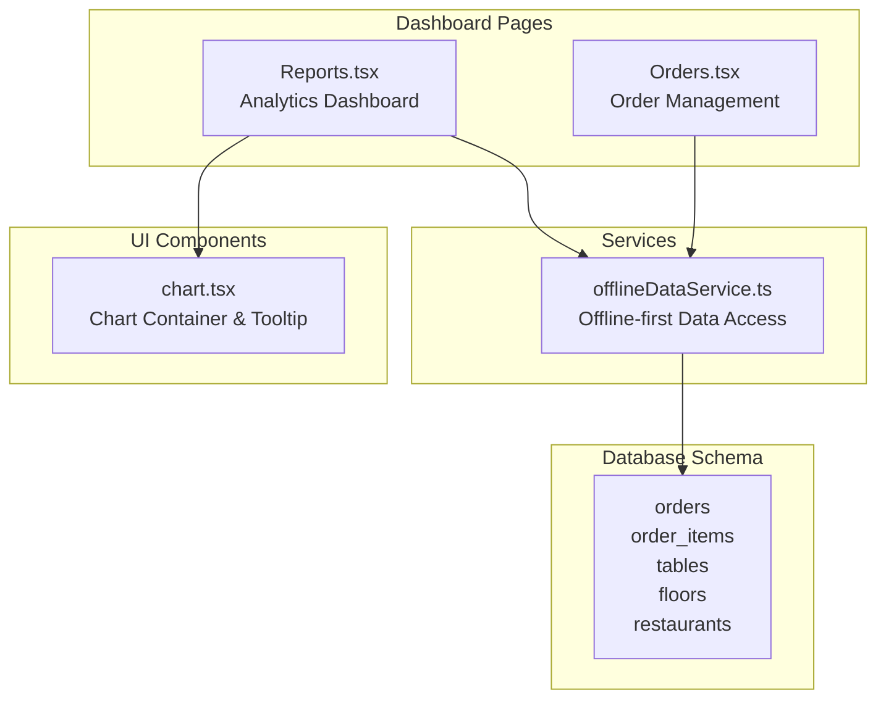
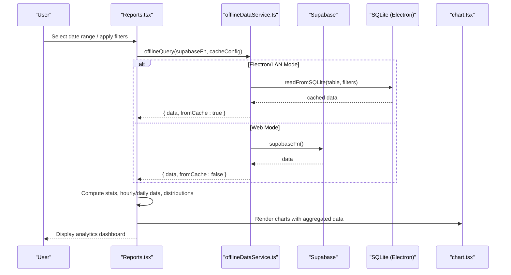
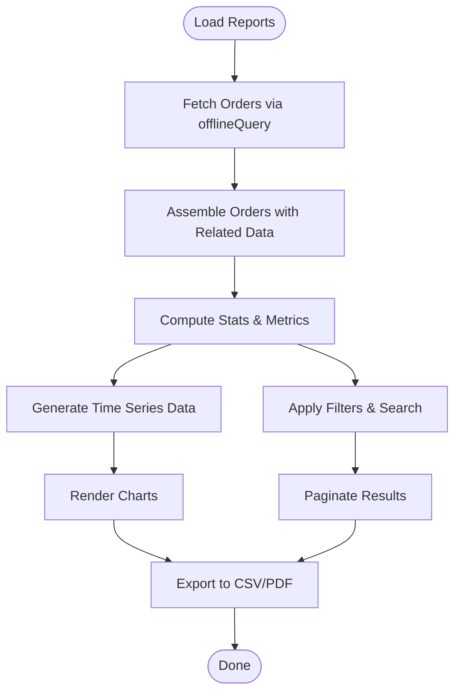
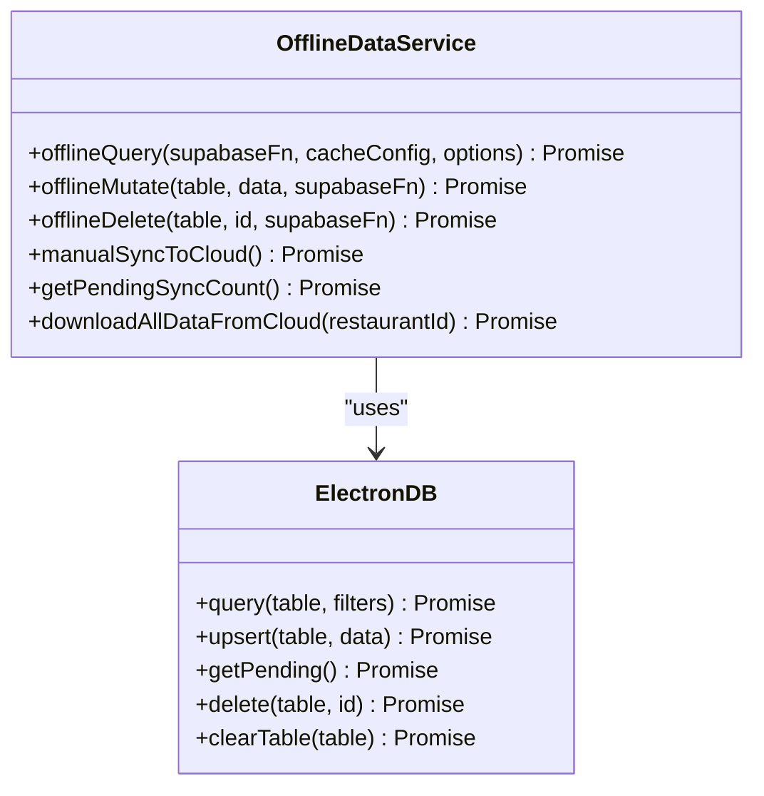
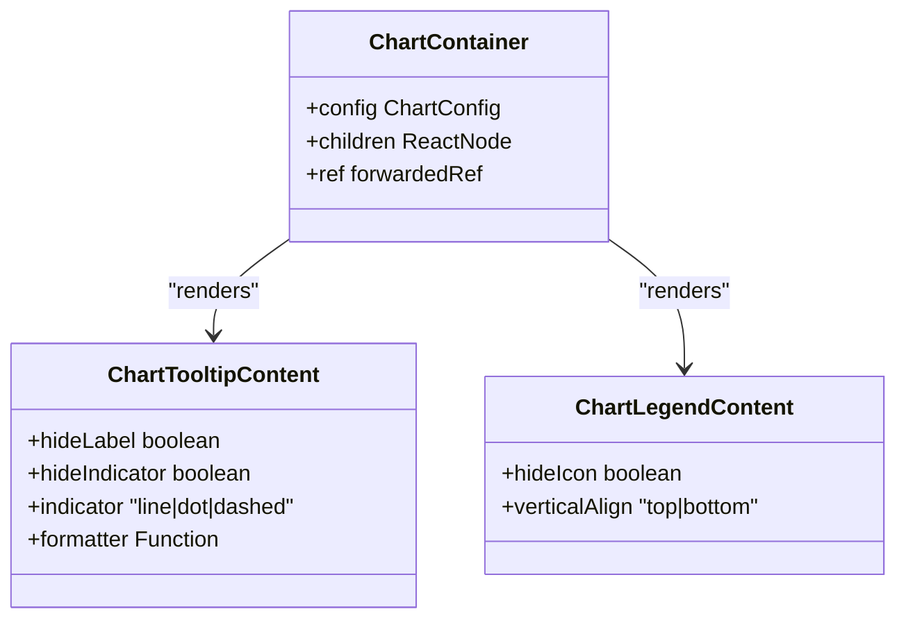
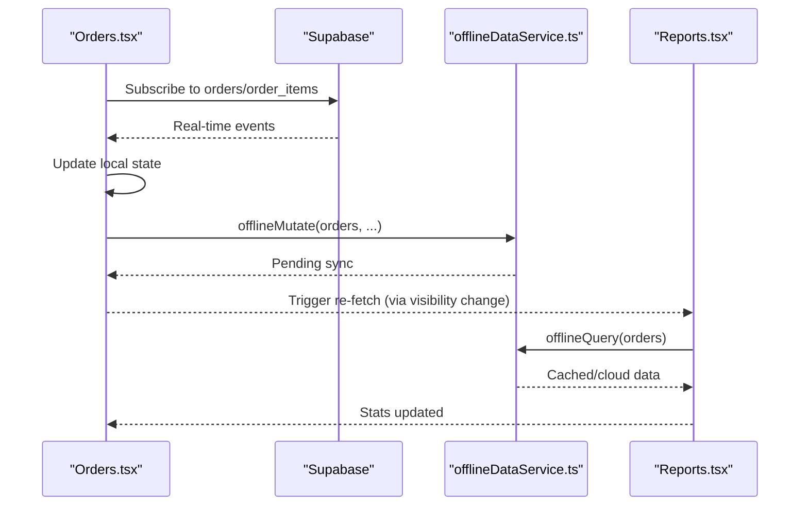
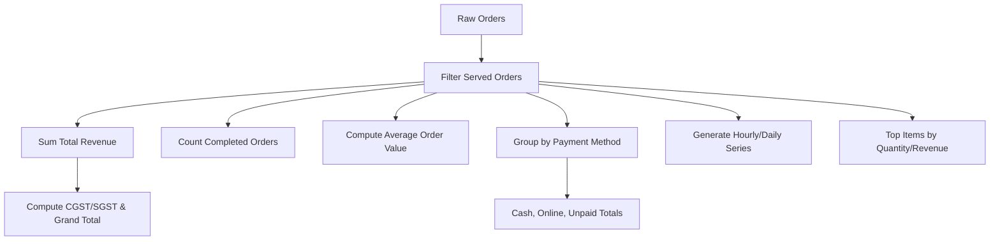
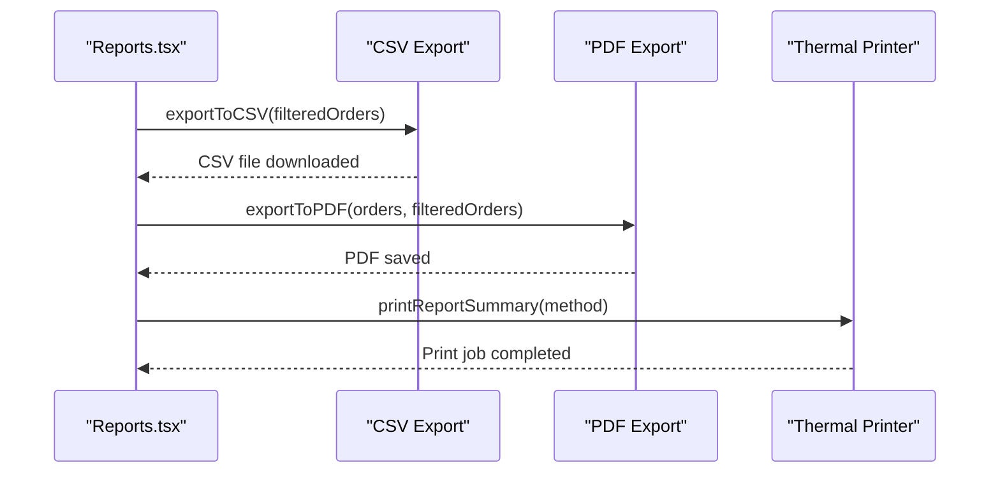
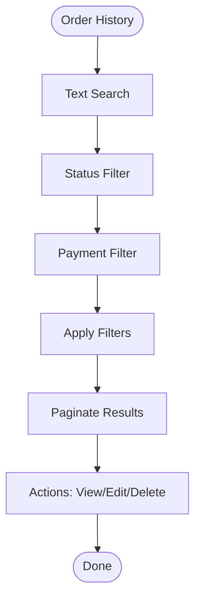
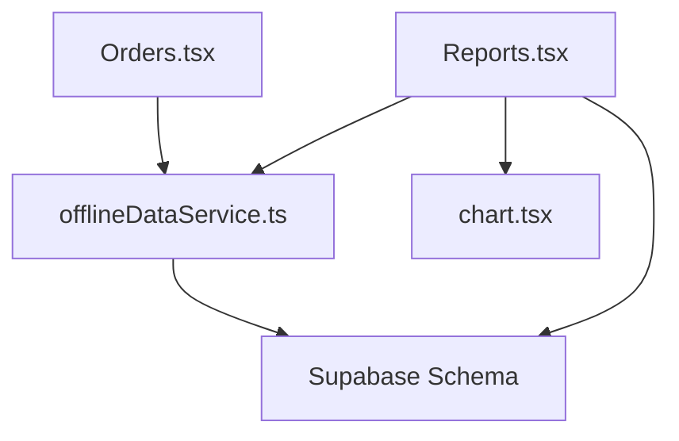

# Order Analytics & Reporting

<cite>
**Referenced Files in This Document**
- [Reports.tsx](file://src/pages/dashboard/Reports.tsx)
- [Orders.tsx](file://src/pages/dashboard/Orders.tsx)
- [offlineDataService.ts](file://src/services/offlineDataService.ts)
- [chart.tsx](file://src/components/ui/chart.tsx)
- [20251206042902_fc2b1d91-eb8e-4750-90c3-95b7e0feb6ba.sql](file://supabase/migrations/20251206042902_fc2b1d91-eb8e-4750-90c3-95b7e0feb6ba.sql)
- [20251206062448_4e2d7da9-9519-48ae-9d6c-bb1c994ed84a.sql](file://supabase/migrations/20251206062448_4e2d7da9-9519-48ae-9d6c-bb1c994ed84a.sql)
- [useActiveOrderCount.ts](file://src/hooks/useActiveOrderCount.ts)
</cite>

## Table of Contents
1. [Introduction](#introduction)
2. [Project Structure](#project-structure)
3. [Core Components](#core-components)
4. [Architecture Overview](#architecture-overview)
5. [Detailed Component Analysis](#detailed-component-analysis)
6. [Dependency Analysis](#dependency-analysis)
7. [Performance Considerations](#performance-considerations)
8. [Troubleshooting Guide](#troubleshooting-guide)
9. [Conclusion](#conclusion)

## Introduction
This document provides comprehensive coverage of the order analytics and reporting capabilities within the TableFlow Pro system. It explains how the analytics dashboard presents sales trends, order volume metrics, and performance indicators, documents the data collection and aggregation processes for order statistics (including time-based reporting and category analysis), details integration with reporting systems for generating comprehensive analytics, and outlines order history management, search functionality, filtering options, export capabilities, and custom report generation. It also addresses real-time analytics updates, historical data preservation, and performance optimization for large datasets.

## Project Structure
The analytics and reporting functionality is primarily implemented in the Reports page, with supporting components for offline data handling, chart rendering, and order lifecycle management. The database schema defines the foundational tables and relationships used for analytics.

**Diagram sources**
- [Reports.tsx:580-2156](file://src/pages/dashboard/Reports.tsx#L580-L2156)
- [Orders.tsx:134-1119](file://src/pages/dashboard/Orders.tsx#L134-L1119)
- [offlineDataService.ts:151-287](file://src/services/offlineDataService.ts#L151-L287)
- [chart.tsx:32-304](file://src/components/ui/chart.tsx#L32-L304)
- [20251206042902_fc2b1d91-eb8e-4750-90c3-95b7e0feb6ba.sql:84-108](file://supabase/migrations/20251206042902_fc2b1d91-eb8e-4750-90c3-95b7e0feb6ba.sql#L84-L108)

**Section sources**
- [Reports.tsx:580-2156](file://src/pages/dashboard/Reports.tsx#L580-L2156)
- [Orders.tsx:134-1119](file://src/pages/dashboard/Orders.tsx#L134-L1119)
- [offlineDataService.ts:151-287](file://src/services/offlineDataService.ts#L151-L287)
- [chart.tsx:32-304](file://src/components/ui/chart.tsx#L32-L304)
- [20251206042902_fc2b1d91-eb8e-4750-90c3-95b7e0feb6ba.sql:84-108](file://supabase/migrations/20251206042902_fc2b1d91-eb8e-4750-90c3-95b7e0feb6ba.sql#L84-L108)

## Core Components
- Analytics Dashboard (Reports page): Provides summary cards, charts, and order history with filtering and export capabilities.
- Offline Data Service: Implements SQLite-first data access for offline scenarios and supports manual synchronization.
- Chart Components: Recharts wrapper for responsive, theme-aware charts.
- Order Management (Orders page): Supports real-time updates, order lifecycle transitions, and bill generation.

Key responsibilities:
- Data retrieval: Uses offlineQuery for SQLite-first access with Supabase fallback.
- Aggregation: Computes revenue, counts, averages, and distributions from order data.
- Presentation: Renders charts, summary cards, and paginated order history.
- Export: Generates CSV and PDF reports with configurable date ranges.

**Section sources**
- [Reports.tsx:902-942](file://src/pages/dashboard/Reports.tsx#L902-L942)
- [Reports.tsx:1060-1219](file://src/pages/dashboard/Reports.tsx#L1060-L1219)
- [offlineDataService.ts:151-287](file://src/services/offlineDataService.ts#L151-L287)
- [chart.tsx:32-304](file://src/components/ui/chart.tsx#L32-L304)

## Architecture Overview
The analytics system follows an offline-first architecture with optional cloud synchronization. The Reports page orchestrates data fetching, aggregation, and visualization, while the Orders page manages order lifecycle events and real-time updates.

**Diagram sources**
- [Reports.tsx:719-882](file://src/pages/dashboard/Reports.tsx#L719-L882)
- [offlineDataService.ts:151-211](file://src/services/offlineDataService.ts#L151-L211)
- [chart.tsx:32-58](file://src/components/ui/chart.tsx#L32-L58)

**Section sources**
- [Reports.tsx:719-882](file://src/pages/dashboard/Reports.tsx#L719-L882)
- [offlineDataService.ts:151-211](file://src/services/offlineDataService.ts#L151-L211)

## Detailed Component Analysis

### Analytics Dashboard (Reports)
The Reports page serves as the central hub for order analytics, featuring:
- Summary cards: Total revenue, completed orders, average order value, pending orders, and GST breakdown.
- Charts: Orders vs revenue over time (hourly for today/yesterday, daily for week/month), order status distribution, and top-selling items.
- Order history: Filterable, searchable, paginated list with actions for editing, deleting, and printing bills.
- Export and printing: CSV/PDF exports and thermal printer integration for report summaries.

Processing logic highlights:
- Date range calculation: Supports today, yesterday, week, month, and custom ranges.
- Aggregation functions: Computes totals, averages, payment method breakdowns, and top items.
- Time-based reporting: Generates hourly series for recent days and daily series for longer periods.
- Filtering pipeline: Applies status, payment method, and text search filters before pagination.

**Diagram sources**
- [Reports.tsx:719-882](file://src/pages/dashboard/Reports.tsx#L719-L882)
- [Reports.tsx:902-1059](file://src/pages/dashboard/Reports.tsx#L902-L1059)
- [Reports.tsx:1060-1219](file://src/pages/dashboard/Reports.tsx#L1060-L1219)

**Section sources**
- [Reports.tsx:580-2156](file://src/pages/dashboard/Reports.tsx#L580-L2156)
- [Reports.tsx:902-1059](file://src/pages/dashboard/Reports.tsx#L902-L1059)
- [Reports.tsx:1060-1219](file://src/pages/dashboard/Reports.tsx#L1060-L1219)

### Offline Data Service
The offline data service enables offline-first operations with SQLite caching and optional cloud synchronization:
- offlineQuery: SQLite-first data retrieval with Supabase fallback in web mode; returns from cache flag for UI responsiveness.
- offlineMutate: Writes to SQLite with pending_sync status; updates UI immediately and syncs later.
- offlineDelete: Soft deletes by marking records as pending_delete; never auto-deletes from cloud.
- Manual sync: Forces upload of pending changes to Supabase with conflict resolution and FK safety checks.

**Diagram sources**
- [offlineDataService.ts:151-287](file://src/services/offlineDataService.ts#L151-L287)
- [offlineDataService.ts:397-541](file://src/services/offlineDataService.ts#L397-L541)

**Section sources**
- [offlineDataService.ts:151-287](file://src/services/offlineDataService.ts#L151-L287)
- [offlineDataService.ts:397-541](file://src/services/offlineDataService.ts#L397-L541)

### Chart Components
The chart wrapper provides a consistent, theme-aware interface for Recharts:
- ChartContainer: Applies theme-specific CSS variables and wraps ResponsiveContainer.
- ChartTooltipContent: Customized tooltips with configurable indicators and labels.
- ChartLegendContent: Flexible legends aligned to bottom or top.

**Diagram sources**
- [chart.tsx:32-304](file://src/components/ui/chart.tsx#L32-L304)

**Section sources**
- [chart.tsx:32-304](file://src/components/ui/chart.tsx#L32-L304)

### Order Management and Real-time Updates
The Orders page manages order lifecycle events and integrates with analytics:
- Real-time subscriptions: Subscribes to order and order_items changes for live updates.
- Order state transitions: Handles pending/cooking/ready/served/cancelled transitions.
- Bill generation: Opens billing dialog and updates order status upon payment completion.
- Offline mutations: Updates orders and related tables with SQLite-first writes.

**Diagram sources**
- [Orders.tsx:309-350](file://src/pages/dashboard/Orders.tsx#L309-L350)
- [offlineDataService.ts:220-287](file://src/services/offlineDataService.ts#L220-L287)
- [Reports.tsx:884-899](file://src/pages/dashboard/Reports.tsx#L884-L899)

**Section sources**
- [Orders.tsx:309-350](file://src/pages/dashboard/Orders.tsx#L309-L350)
- [offlineDataService.ts:220-287](file://src/services/offlineDataService.ts#L220-L287)
- [Reports.tsx:884-899](file://src/pages/dashboard/Reports.tsx#L884-L899)

### Data Collection and Aggregation Processes
Aggregation pipeline:
- Revenue and counts: Sum total_amount for served orders; compute average order value.
- Payment method breakdown: Separate cash, online (card/upi), and unpaid revenues.
- GST calculations: Apply configured percentages to derive CGST/SGST and grand total.
- Time-based reporting: Generate hourly series for today/yesterday and daily series for week/month.
- Status distribution: Count orders by status for pie chart visualization.
- Top items: Aggregate quantity and revenue per menu item for bar chart.

**Diagram sources**
- [Reports.tsx:902-965](file://src/pages/dashboard/Reports.tsx#L902-L965)
- [Reports.tsx:968-1010](file://src/pages/dashboard/Reports.tsx#L968-L1010)

**Section sources**
- [Reports.tsx:902-965](file://src/pages/dashboard/Reports.tsx#L902-L965)
- [Reports.tsx:968-1010](file://src/pages/dashboard/Reports.tsx#L968-L1010)

### Integration with Reporting Systems
Export and printing integrations:
- CSV export: Generates downloadable CSV with order metadata and items.
- PDF export: Creates multi-page PDF with summary, top items, and order details using jsPDF and autoTable.
- Thermal printer: Prints report summaries via USB, Bluetooth, or browser fallback with formatted text.

**Diagram sources**
- [Reports.tsx:1060-1219](file://src/pages/dashboard/Reports.tsx#L1060-L1219)
- [Reports.tsx:1233-1376](file://src/pages/dashboard/Reports.tsx#L1233-L1376)

**Section sources**
- [Reports.tsx:1060-1219](file://src/pages/dashboard/Reports.tsx#L1060-L1219)
- [Reports.tsx:1233-1376](file://src/pages/dashboard/Reports.tsx#L1233-L1376)

### Order History Management, Search, and Filtering
Order history features:
- Search: Text-based search across item names and table numbers.
- Filters: Status (all/pending/cooking/ready/served/cancelled) and payment method (cash/online/unpaid).
- Pagination: Fixed page size with navigation controls.
- Actions: View bill, edit order (payment method/status), delete order (soft delete).

**Diagram sources**
- [Reports.tsx:1035-1059](file://src/pages/dashboard/Reports.tsx#L1035-L1059)
- [Reports.tsx:1836-2018](file://src/pages/dashboard/Reports.tsx#L1836-L2018)

**Section sources**
- [Reports.tsx:1035-1059](file://src/pages/dashboard/Reports.tsx#L1035-L1059)
- [Reports.tsx:1836-2018](file://src/pages/dashboard/Reports.tsx#L1836-L2018)

### Examples of Common Analytics Queries
- Sales trends over time: Use hourlyData for today/yesterday and dailyData for week/month to plot orders and revenue.
- Performance indicators: Compute average order value, pending order counts, and completion rates.
- Category analysis: Aggregate by menu item categories using order_items and menu_items relations.
- Payment mix: Segment revenue by cash vs online payments.

These are implemented through computed metrics and time-series generation in the Reports component.

**Section sources**
- [Reports.tsx:968-1010](file://src/pages/dashboard/Reports.tsx#L968-L1010)
- [Reports.tsx:918-926](file://src/pages/dashboard/Reports.tsx#L918-L926)

## Dependency Analysis
The analytics system exhibits clear separation of concerns:
- Reports depends on offlineDataService for data access and on chart components for visualization.
- Orders provides real-time updates that feed into Reports via cache refresh and visibility change handlers.
- Database schema defines the relationships enabling efficient aggregation and filtering.

**Diagram sources**
- [Reports.tsx:580-2156](file://src/pages/dashboard/Reports.tsx#L580-L2156)
- [Orders.tsx:134-1119](file://src/pages/dashboard/Orders.tsx#L134-L1119)
- [offlineDataService.ts:151-287](file://src/services/offlineDataService.ts#L151-L287)
- [20251206042902_fc2b1d91-eb8e-4750-90c3-95b7e0feb6ba.sql:84-108](file://supabase/migrations/20251206042902_fc2b1d91-eb8e-4750-90c3-95b7e0feb6ba.sql#L84-L108)

**Section sources**
- [Reports.tsx:580-2156](file://src/pages/dashboard/Reports.tsx#L580-L2156)
- [Orders.tsx:134-1119](file://src/pages/dashboard/Orders.tsx#L134-L1119)
- [offlineDataService.ts:151-287](file://src/services/offlineDataService.ts#L151-L287)
- [20251206042902_fc2b1d91-eb8e-4750-90c3-95b7e0feb6ba.sql:84-108](file://supabase/migrations/20251206042902_fc2b1d91-eb8e-4750-90c3-95b7e0feb6ba.sql#L84-L108)

## Performance Considerations
- Offline-first architecture: Reduces latency and improves reliability by serving data from SQLite when available.
- Memoization: Extensive use of useMemo for computed stats, time series, distributions, and filtered lists prevents unnecessary recalculations.
- Pagination: Limits rendered order history to manageable chunks, reducing DOM and re-render overhead.
- Efficient aggregations: Map-based accumulation for top items and single-pass reductions for totals minimize computational cost.
- Real-time updates: Subscriptions trigger targeted refreshes; visibility change ensures data stays current when users return to the tab.
- Export optimization: CSV/PDF generation occurs client-side; large datasets should be filtered to reduce export size.

[No sources needed since this section provides general guidance]

## Troubleshooting Guide
Common issues and resolutions:
- No data displayed: Verify restaurant selection and ensure offlineQuery returns data from cache or cloud.
- Export failures: Confirm filteredOrders availability and network connectivity for PDF generation.
- Print errors: Check printer connectivity (USB/Bluetooth) and permissions; fall back to browser print if needed.
- Sync delays: Use manual sync to upload pending changes; monitor pending count and error logs.
- Real-time updates not appearing: Ensure Supabase subscriptions are active and not blocked by offline mode.

**Section sources**
- [Reports.tsx:1060-1219](file://src/pages/dashboard/Reports.tsx#L1060-L1219)
- [offlineDataService.ts:397-541](file://src/services/offlineDataService.ts#L397-L541)

## Conclusion
The order analytics and reporting system delivers a robust, offline-capable solution for monitoring sales trends, order volumes, and performance indicators. Through SQLite-first data access, real-time updates, and comprehensive export/printing capabilities, it supports both real-time insights and historical analysis. The modular architecture and memoized computations ensure scalability and responsiveness, while the filtering and pagination features enable efficient exploration of large datasets.