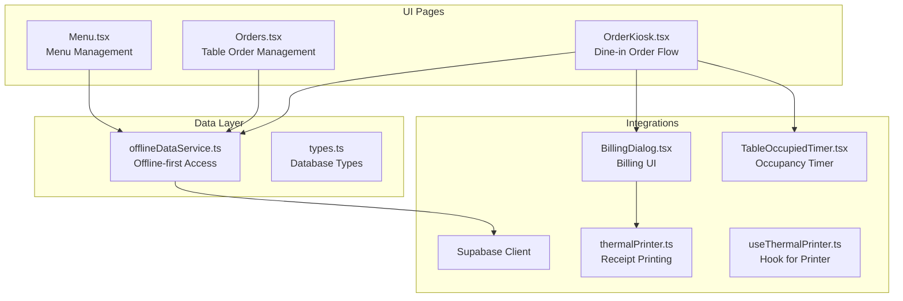
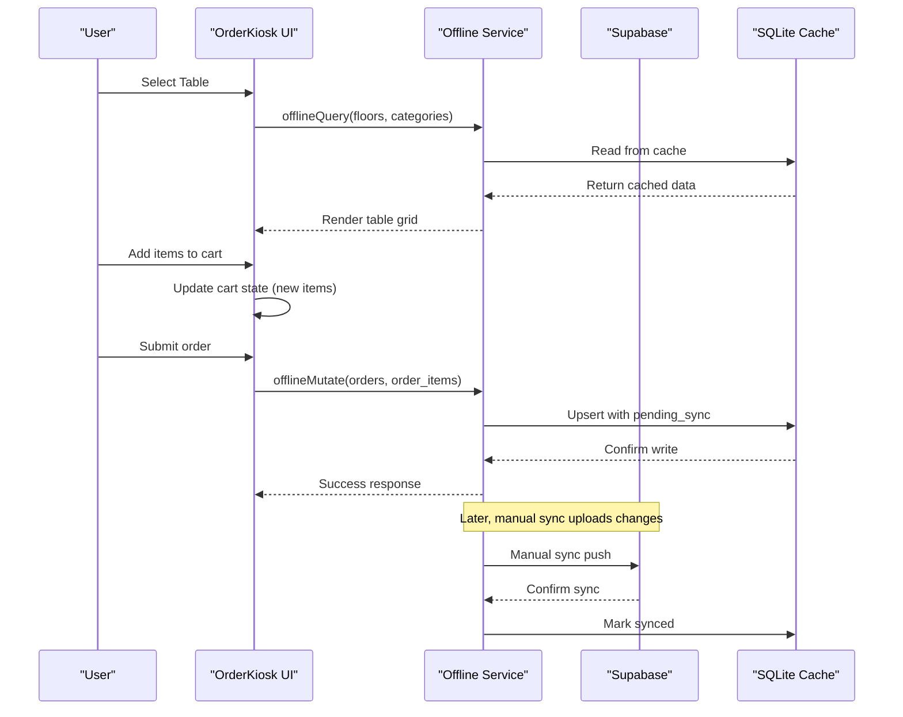
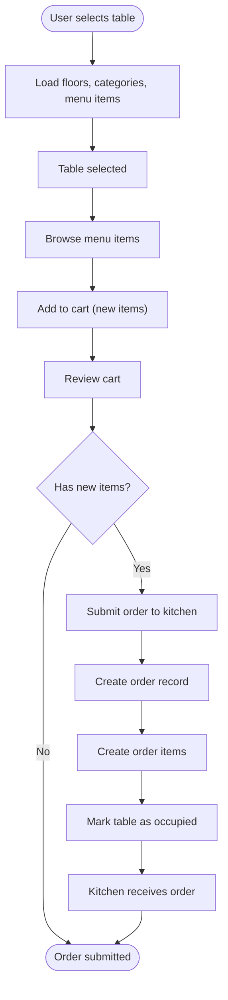
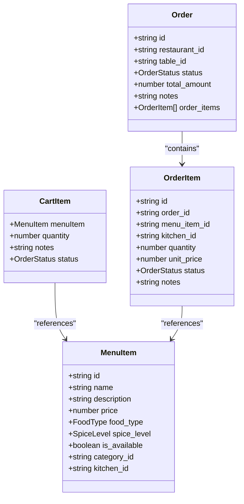
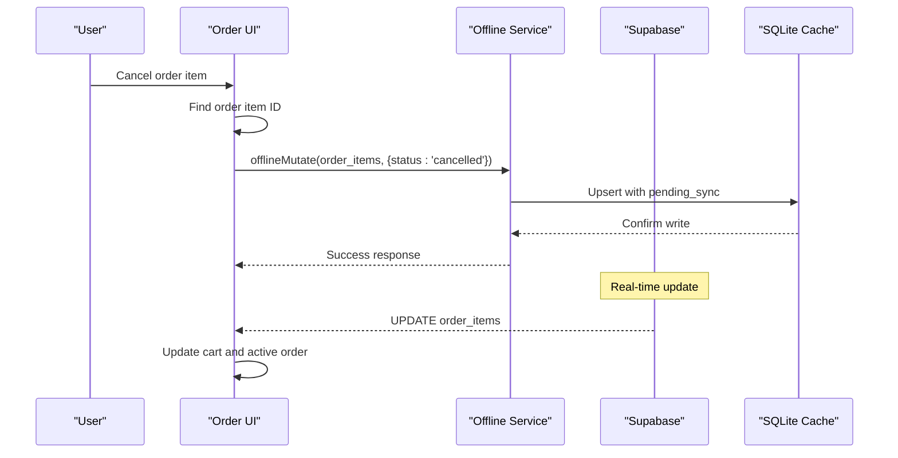
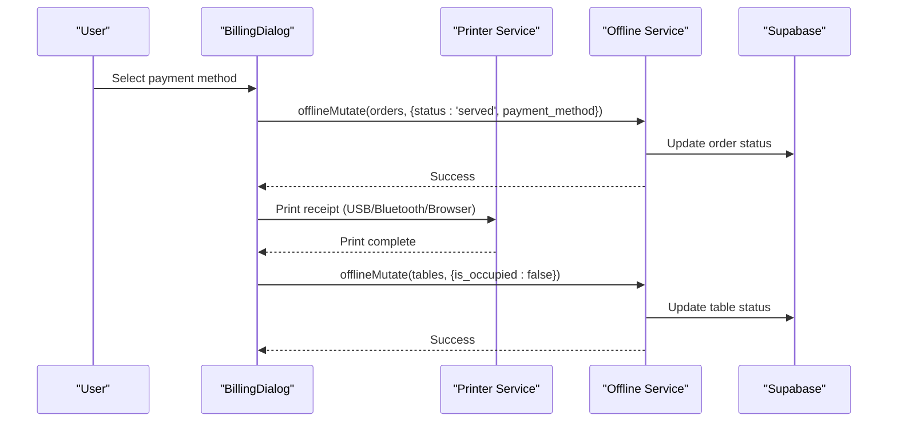
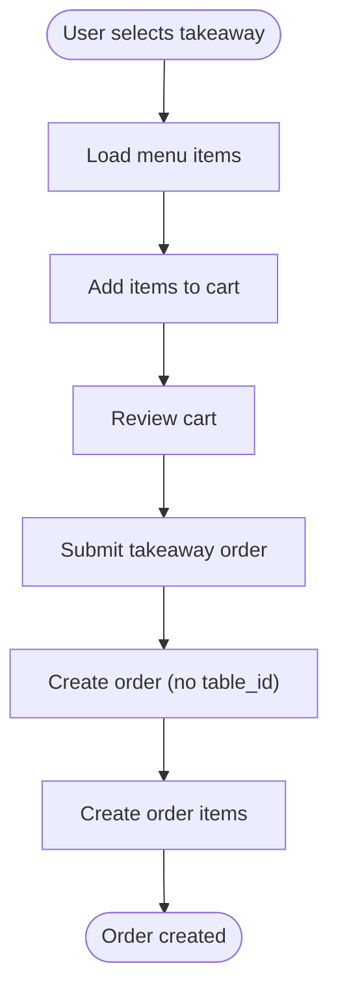
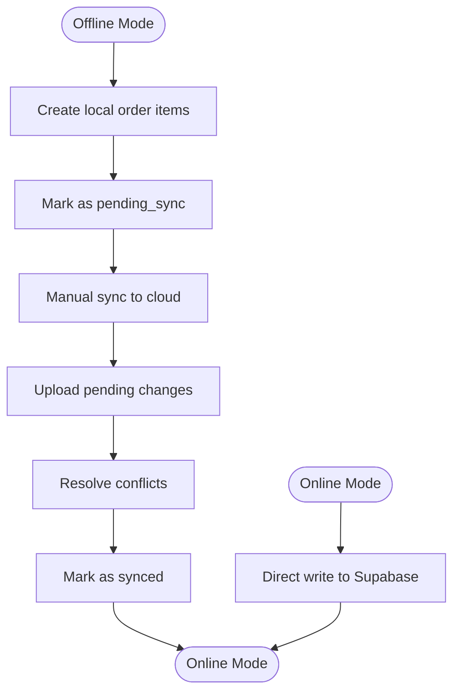
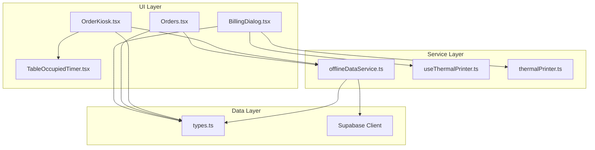

# Order Creation & Management

<cite>
**Referenced Files in This Document**
- [OrderKiosk.tsx](file://src/pages/dashboard/OrderKiosk.tsx)
- [Orders.tsx](file://src/pages/dashboard/Orders.tsx)
- [Menu.tsx](file://src/pages/dashboard/Menu.tsx)
- [types.ts](file://src/integrations/supabase/types.ts)
- [offlineDataService.ts](file://src/services/offlineDataService.ts)
- [BillingDialog.tsx](file://src/components/BillingDialog.tsx)
- [thermalPrinter.ts](file://src/services/thermalPrinter.ts)
- [useThermalPrinter.ts](file://src/hooks/useThermalPrinter.ts)
- [TableOccupiedTimer.tsx](file://src/components/TableOccupiedTimer.tsx)
</cite>

## Table of Contents
1. [Introduction](#introduction)
2. [Project Structure](#project-structure)
3. [Core Components](#core-components)
4. [Architecture Overview](#architecture-overview)
5. [Detailed Component Analysis](#detailed-component-analysis)
6. [Dependency Analysis](#dependency-analysis)
7. [Performance Considerations](#performance-considerations)
8. [Troubleshooting Guide](#troubleshooting-guide)
9. [Conclusion](#conclusion)

## Introduction
This document provides comprehensive documentation for the order creation and management functionality in the TableFlow Pro application. It covers the end-to-end order lifecycle, including table selection, menu item addition, cart management, order submission, kitchen integration, billing, and offline synchronization. The system supports both dine-in and takeaway orders, with robust offline-first capabilities and real-time updates when connectivity is available.

## Project Structure
The order management system spans several key areas:
- UI pages for order creation and management
- Data models and Supabase integration
- Offline-first data service for local storage and synchronization
- Billing and printing integration
- Real-time updates via Supabase channels

**Diagram sources**
- [OrderKiosk.tsx:138-2086](file://src/pages/dashboard/OrderKiosk.tsx#L138-L2086)
- [Orders.tsx:134-1119](file://src/pages/dashboard/Orders.tsx#L134-L1119)
- [Menu.tsx:100-844](file://src/pages/dashboard/Menu.tsx#L100-L844)
- [offlineDataService.ts:1-769](file://src/services/offlineDataService.ts#L1-L769)
- [types.ts:9-689](file://src/integrations/supabase/types.ts#L9-L689)
- [BillingDialog.tsx:62-569](file://src/components/BillingDialog.tsx#L62-L569)
- [thermalPrinter.ts:33-339](file://src/services/thermalPrinter.ts#L33-L339)
- [useThermalPrinter.ts:4-69](file://src/hooks/useThermalPrinter.ts#L4-L69)
- [TableOccupiedTimer.tsx:9-51](file://src/components/TableOccupiedTimer.tsx#L9-L51)

**Section sources**
- [OrderKiosk.tsx:138-2086](file://src/pages/dashboard/OrderKiosk.tsx#L138-L2086)
- [Orders.tsx:134-1119](file://src/pages/dashboard/Orders.tsx#L134-L1119)
- [Menu.tsx:100-844](file://src/pages/dashboard/Menu.tsx#L100-L844)
- [offlineDataService.ts:1-769](file://src/services/offlineDataService.ts#L1-L769)
- [types.ts:9-689](file://src/integrations/supabase/types.ts#L9-L689)
- [BillingDialog.tsx:62-569](file://src/components/BillingDialog.tsx#L62-L569)
- [thermalPrinter.ts:33-339](file://src/services/thermalPrinter.ts#L33-L339)
- [useThermalPrinter.ts:4-69](file://src/hooks/useThermalPrinter.ts#L4-L69)
- [TableOccupiedTimer.tsx:9-51](file://src/components/TableOccupiedTimer.tsx#L9-L51)

## Core Components
This section outlines the primary components involved in order creation and management, including data models, cart management, and offline-first architecture.

- Order Data Model
  - Order header: id, restaurant_id, table_id (optional), status, total_amount, notes, payment_method, timestamps
  - Order items: id, order_id, menu_item_id, kitchen_id (optional), quantity, unit_price, notes, status, timestamps
  - Related entities: tables, menu_items, kitchens, floors
- Cart Management
  - Cart items distinguish between new items (without status) and existing order items (with status)
  - Quantity management for both new and existing items
  - Food type indicators and spice level visualization
- Offline-First Architecture
  - SQLite-first caching for Electron/LAN modes
  - Local mutations with pending sync status
  - Manual cloud sync with conflict resolution
- Real-Time Updates
  - Supabase channels for orders and order items
  - Live table status updates
  - Toast notifications for kitchen status changes

**Section sources**
- [types.ts:342-392](file://src/integrations/supabase/types.ts#L342-L392)
- [types.ts:281-341](file://src/integrations/supabase/types.ts#L281-L341)
- [OrderKiosk.tsx:84-104](file://src/pages/dashboard/OrderKiosk.tsx#L84-L104)
- [offlineDataService.ts:151-211](file://src/services/offlineDataService.ts#L151-L211)
- [offlineDataService.ts:220-287](file://src/services/offlineDataService.ts#L220-L287)

## Architecture Overview
The order management system follows an offline-first architecture with optional real-time synchronization. The architecture ensures reliable operation in disconnected environments while providing seamless updates when connectivity is restored.

**Diagram sources**
- [OrderKiosk.tsx:164-280](file://src/pages/dashboard/OrderKiosk.tsx#L164-L280)
- [offlineDataService.ts:151-211](file://src/services/offlineDataService.ts#L151-L211)
- [offlineDataService.ts:220-287](file://src/services/offlineDataService.ts#L220-L287)
- [offlineDataService.ts:397-541](file://src/services/offlineDataService.ts#L397-L541)

**Section sources**
- [OrderKiosk.tsx:164-280](file://src/pages/dashboard/OrderKiosk.tsx#L164-L280)
- [offlineDataService.ts:151-211](file://src/services/offlineDataService.ts#L151-L211)
- [offlineDataService.ts:220-287](file://src/services/offlineDataService.ts#L220-L287)
- [offlineDataService.ts:397-541](file://src/services/offlineDataService.ts#L397-L541)

## Detailed Component Analysis

### Order Creation Workflow (Dine-in)
The dine-in order creation flow integrates table selection, menu browsing, cart management, and order submission with kitchen integration.

**Diagram sources**
- [OrderKiosk.tsx:494-586](file://src/pages/dashboard/OrderKiosk.tsx#L494-L586)
- [OrderKiosk.tsx:729-804](file://src/pages/dashboard/OrderKiosk.tsx#L729-L804)
- [OrderKiosk.tsx:596-613](file://src/pages/dashboard/OrderKiosk.tsx#L596-L613)

**Section sources**
- [OrderKiosk.tsx:494-586](file://src/pages/dashboard/OrderKiosk.tsx#L494-L586)
- [OrderKiosk.tsx:729-804](file://src/pages/dashboard/OrderKiosk.tsx#L729-L804)
- [OrderKiosk.tsx:596-613](file://src/pages/dashboard/OrderKiosk.tsx#L596-L613)

### Cart System and Item Management
The cart system distinguishes between new items and existing order items, enabling granular management of quantities and cancellations.

**Diagram sources**
- [OrderKiosk.tsx:84-104](file://src/pages/dashboard/OrderKiosk.tsx#L84-L104)
- [types.ts:221-280](file://src/integrations/supabase/types.ts#L221-L280)
- [types.ts:281-341](file://src/integrations/supabase/types.ts#L281-L341)

**Section sources**
- [OrderKiosk.tsx:84-104](file://src/pages/dashboard/OrderKiosk.tsx#L84-L104)
- [types.ts:221-280](file://src/integrations/supabase/types.ts#L221-L280)
- [types.ts:281-341](file://src/integrations/supabase/types.ts#L281-L341)

### Order Modification and Cancellation
The system supports modifying existing order items and cancelling them with appropriate status updates.

**Diagram sources**
- [OrderKiosk.tsx:620-680](file://src/pages/dashboard/OrderKiosk.tsx#L620-L680)
- [OrderKiosk.tsx:415-445](file://src/pages/dashboard/OrderKiosk.tsx#L415-L445)

**Section sources**
- [OrderKiosk.tsx:620-680](file://src/pages/dashboard/OrderKiosk.tsx#L620-L680)
- [OrderKiosk.tsx:415-445](file://src/pages/dashboard/OrderKiosk.tsx#L415-L445)

### Billing and Payment Processing
The billing system handles payment completion, table freeing, and receipt generation with multiple printing options.

**Diagram sources**
- [BillingDialog.tsx:255-269](file://src/components/BillingDialog.tsx#L255-L269)
- [OrderKiosk.tsx:851-925](file://src/pages/dashboard/OrderKiosk.tsx#L851-L925)
- [thermalPrinter.ts:118-219](file://src/services/thermalPrinter.ts#L118-L219)

**Section sources**
- [BillingDialog.tsx:255-269](file://src/components/BillingDialog.tsx#L255-L269)
- [OrderKiosk.tsx:851-925](file://src/pages/dashboard/OrderKiosk.tsx#L851-L925)
- [thermalPrinter.ts:118-219](file://src/services/thermalPrinter.ts#L118-L219)

### Takeaway Order Creation
Takeaway orders follow a similar flow but without table occupancy management.

**Diagram sources**
- [Orders.tsx:387-448](file://src/pages/dashboard/Orders.tsx#L387-L448)

**Section sources**
- [Orders.tsx:387-448](file://src/pages/dashboard/Orders.tsx#L387-L448)

### Offline Order Creation and Synchronization
The offline-first architecture enables order creation without network connectivity and later synchronization.

**Diagram sources**
- [offlineDataService.ts:220-287](file://src/services/offlineDataService.ts#L220-L287)
- [offlineDataService.ts:397-541](file://src/services/offlineDataService.ts#L397-L541)

**Section sources**
- [offlineDataService.ts:220-287](file://src/services/offlineDataService.ts#L220-L287)
- [offlineDataService.ts:397-541](file://src/services/offlineDataService.ts#L397-L541)

## Dependency Analysis
The order management system exhibits clear separation of concerns with well-defined dependencies between UI components, data services, and external integrations.

**Diagram sources**
- [OrderKiosk.tsx:1-50](file://src/pages/dashboard/OrderKiosk.tsx#L1-L50)
- [Orders.tsx:1-67](file://src/pages/dashboard/Orders.tsx#L1-L67)
- [BillingDialog.tsx:1-31](file://src/components/BillingDialog.tsx#L1-L31)
- [offlineDataService.ts:1-7](file://src/services/offlineDataService.ts#L1-L7)
- [types.ts:9-15](file://src/integrations/supabase/types.ts#L9-L15)

**Section sources**
- [OrderKiosk.tsx:1-50](file://src/pages/dashboard/OrderKiosk.tsx#L1-L50)
- [Orders.tsx:1-67](file://src/pages/dashboard/Orders.tsx#L1-L67)
- [BillingDialog.tsx:1-31](file://src/components/BillingDialog.tsx#L1-L31)
- [offlineDataService.ts:1-7](file://src/services/offlineDataService.ts#L1-L7)
- [types.ts:9-15](file://src/integrations/supabase/types.ts#L9-L15)

## Performance Considerations
- Offline-first caching reduces latency and improves reliability in disconnected environments
- Batch operations for order items minimize database writes during order submission
- Real-time subscriptions are conditionally enabled to avoid unnecessary network overhead
- Memoized computations for cart totals improve UI responsiveness
- SQLite indexing and query optimization enhance data retrieval performance

## Troubleshooting Guide
Common issues and their resolutions:

- Order submission fails
  - Verify offline mode status and retry manual sync
  - Check for invalid IDs or missing required fields
  - Review console logs for specific error messages

- Real-time updates not working
  - Confirm Supabase connectivity and authentication
  - Verify channel subscriptions are properly established
  - Check browser permissions for real-time features

- Printing issues
  - Ensure printer is properly connected and configured
  - Verify USB/Bluetooth device availability
  - Check browser popup blockers for browser-based printing

- Cart synchronization problems
  - Confirm cart item status tracking (new vs existing items)
  - Verify order item ID resolution for modifications
  - Check for pending sync operations

**Section sources**
- [offlineDataService.ts:368-387](file://src/services/offlineDataService.ts#L368-L387)
- [OrderKiosk.tsx:359-452](file://src/pages/dashboard/OrderKiosk.tsx#L359-L452)
- [BillingDialog.tsx:131-148](file://src/components/BillingDialog.tsx#L131-L148)

## Conclusion
The order creation and management system provides a robust, offline-first solution for restaurant operations. It seamlessly handles both dine-in and takeaway orders, offers comprehensive cart management, integrates with kitchen systems, and supports flexible billing and printing options. The offline-first architecture ensures reliable operation in various network conditions while maintaining data consistency through careful synchronization strategies.