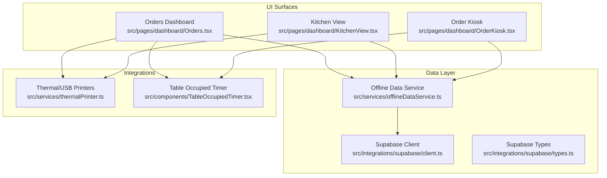
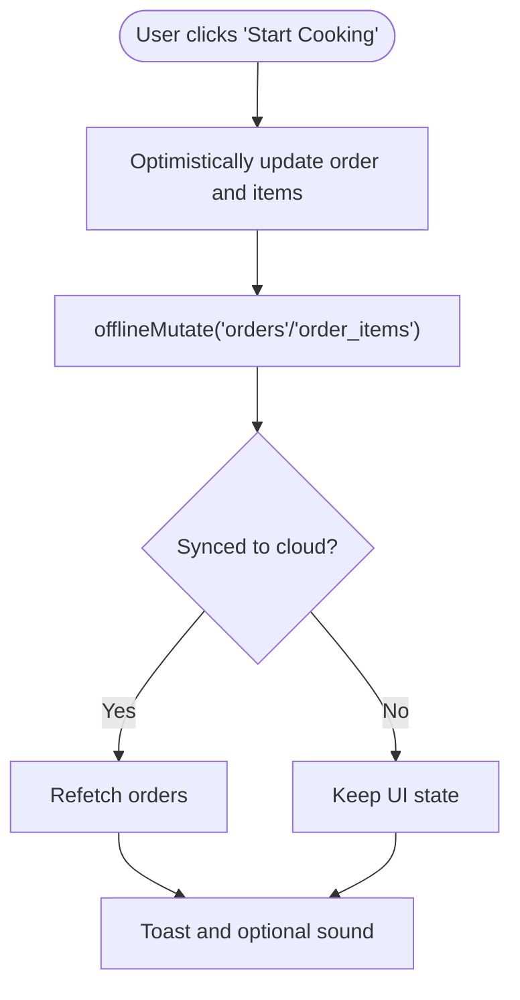
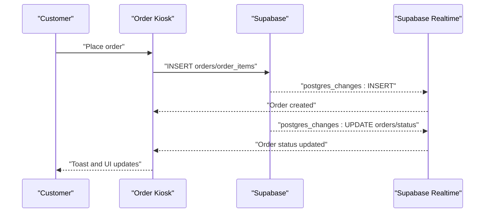
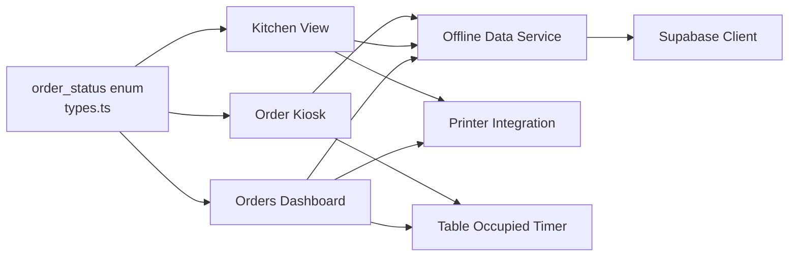

# Order Lifecycle & Status Management

<cite>
**Referenced Files in This Document**
- [Orders.tsx](file://src/pages/dashboard/Orders.tsx)
- [KitchenView.tsx](file://src/pages/dashboard/KitchenView.tsx)
- [OrderKiosk.tsx](file://src/pages/dashboard/OrderKiosk.tsx)
- [client.ts](file://src/integrations/supabase/client.ts)
- [types.ts](file://src/integrations/supabase/types.ts)
- [offlineDataService.ts](file://src/services/offlineDataService.ts)
- [TableOccupiedTimer.tsx](file://src/components/TableOccupiedTimer.tsx)
- [BillingDialog.tsx](file://src/components/BillingDialog.tsx)
- [20251206134902_8243dfe0-8b9c-4c6d-9a42-278158976001.sql](file://supabase/migrations/20251206134902_8243dfe0-8b9c-4c6d-9a42-278158976001.sql)
</cite>

## Table of Contents
1. [Introduction](#introduction)
2. [Project Structure](#project-structure)
3. [Core Components](#core-components)
4. [Architecture Overview](#architecture-overview)
5. [Detailed Component Analysis](#detailed-component-analysis)
6. [Dependency Analysis](#dependency-analysis)
7. [Performance Considerations](#performance-considerations)
8. [Troubleshooting Guide](#troubleshooting-guide)
9. [Conclusion](#conclusion)

## Introduction
This document explains the complete order lifecycle and status management in TableFlow Pro. It covers the end-to-end journey from order creation to completion, including all status transitions (pending, cooking, ready, served, cancelled). It documents the status configuration system, visual indicators, real-time updates, state management patterns, Supabase real-time subscriptions, and integrations with table occupancy, printer notifications, and kitchen displays.

## Project Structure
The order lifecycle spans several key areas:
- UI surfaces for order management (Dashboard Orders, Kitchen View, Order Kiosk)
- Supabase integration for data persistence and real-time events
- Offline-first data service for resilient operation
- Printer integration for receipts and kitchen tickets
- Table occupancy tracking and timers



**Diagram sources**
- [Orders.tsx:134-800](file://src/pages/dashboard/Orders.tsx#L134-L800)
- [KitchenView.tsx:80-785](file://src/pages/dashboard/KitchenView.tsx#L80-L785)
- [OrderKiosk.tsx:138-200](file://src/pages/dashboard/OrderKiosk.tsx#L138-L200)
- [offlineDataService.ts:151-287](file://src/services/offlineDataService.ts#L151-L287)
- [client.ts:11-17](file://src/integrations/supabase/client.ts#L11-L17)
- [types.ts:679-684](file://src/integrations/supabase/types.ts#L679-L684)

**Section sources**
- [Orders.tsx:134-800](file://src/pages/dashboard/Orders.tsx#L134-L800)
- [KitchenView.tsx:80-785](file://src/pages/dashboard/KitchenView.tsx#L80-L785)
- [OrderKiosk.tsx:138-200](file://src/pages/dashboard/OrderKiosk.tsx#L138-L200)
- [offlineDataService.ts:151-287](file://src/services/offlineDataService.ts#L151-L287)
- [client.ts:11-17](file://src/integrations/supabase/client.ts#L11-L17)
- [types.ts:679-684](file://src/integrations/supabase/types.ts#L679-L684)

## Core Components
- Orders Dashboard: Creates orders, manages order status, cancels orders, and integrates with Supabase real-time channels.
- Kitchen View: Displays orders grouped by status, allows item-level status updates, prints kitchen tickets, and plays notifications.
- Order Kiosk: Allows customers to place orders at a table, track order progress, and receive real-time updates.
- Offline Data Service: Provides offline-first data access with SQLite caching and manual sync to Supabase.
- Supabase Client and Types: Defines enums and tables used for order status and relationships.
- Printer Integration: Handles thermal and USB printer printing for bills and kitchen tickets.
- Table Occupied Timer: Tracks elapsed time for occupied tables.

**Section sources**
- [Orders.tsx:134-800](file://src/pages/dashboard/Orders.tsx#L134-L800)
- [KitchenView.tsx:80-785](file://src/pages/dashboard/KitchenView.tsx#L80-L785)
- [OrderKiosk.tsx:138-200](file://src/pages/dashboard/OrderKiosk.tsx#L138-L200)
- [offlineDataService.ts:151-287](file://src/services/offlineDataService.ts#L151-L287)
- [types.ts:679-684](file://src/integrations/supabase/types.ts#L679-L684)
- [TableOccupiedTimer.tsx:1-50](file://src/components/TableOccupiedTimer.tsx#L1-L50)
- [BillingDialog.tsx:62-569](file://src/components/BillingDialog.tsx#L62-L569)

## Architecture Overview
The order lifecycle is orchestrated through:
- Supabase Postgres tables for orders, order_items, and tables
- Supabase Realtime Postgres Changes for live updates
- Offline-first caching and mutations via SQLite
- UI components that reflect status changes immediately and synchronize in the background

```mermaid
sequenceDiagram
participant UI as "UI Component"
participant OFF as "Offline Data Service"
participant SUP as "Supabase Client"
participant DB as "SQLite (Electron)"
participant RT as "Supabase Realtime"
UI->>OFF : "offlineMutate(table, data)"
alt Electron mode
OFF->>DB : "upsert with sync_status=pending_sync"
DB-->>OFF : "ack"
OFF-->>UI : "pendingSync=true"
RT-->>UI : "Realtime event triggers refresh"
else Web mode
OFF->>SUP : "direct mutation"
SUP-->>OFF : "ack"
OFF-->>UI : "pendingSync=false"
end
```

**Diagram sources**
- [offlineDataService.ts:220-287](file://src/services/offlineDataService.ts#L220-L287)
- [client.ts:11-17](file://src/integrations/supabase/client.ts#L11-L17)

**Section sources**
- [offlineDataService.ts:151-287](file://src/services/offlineDataService.ts#L151-L287)
- [client.ts:11-17](file://src/integrations/supabase/client.ts#L11-L17)

## Detailed Component Analysis

### Order Status Configuration and Visual Indicators
Order statuses are defined as an enum and mapped to visual badges and icons:
- pending: warning color, clock icon
- cooking: primary color, chef hat icon
- ready: success color, check circle icon
- served: muted color, check circle icon
- cancelled: destructive color, x circle icon

These configurations are used across the Orders Dashboard and Kitchen View to present consistent status visuals.

**Section sources**
- [types.ts:679-684](file://src/integrations/supabase/types.ts#L679-L684)
- [Orders.tsx:119-125](file://src/pages/dashboard/Orders.tsx#L119-L125)
- [KitchenView.tsx:53-59](file://src/pages/dashboard/KitchenView.tsx#L53-L59)

### Orders Dashboard: Creation, Status Transitions, and Real-time Updates
- Order creation:
  - Builds an order with status pending and creates associated order_items
  - Optionally sets table occupancy to true
  - Uses offlineMutate for immediate UI feedback and background sync
- Status transitions:
  - Pending → Cooking: Start Cooking button
  - Pending → Cancelled: Cancel dialog confirms cancellation
  - Cooking → Ready: Mark Ready button
  - Ready → Served: Billing dialog records payment method and frees table
- Real-time updates:
  - Subscribes to orders and order_items changes for the restaurant
  - Triggers refetch on INSERT/UPDATE events
  - Toast notifications for new orders and status changes

```mermaid
sequenceDiagram
participant User as "User"
participant ORD as "Orders Dashboard"
participant OFF as "Offline Data Service"
participant SUP as "Supabase"
participant RT as "Supabase Realtime"
User->>ORD : "Click Start Cooking"
ORD->>ORD : "Optimistically update UI"
ORD->>OFF : "offlineMutate('orders', {status : 'cooking'})"
OFF->>SUP : "UPDATE orders SET status='cooking'"
SUP-->>RT : "postgres_changes : UPDATE"
RT-->>ORD : "Event received"
ORD->>ORD : "refetch orders"
ORD-->>User : "Updated status badge"
```

**Diagram sources**
- [Orders.tsx:450-488](file://src/pages/dashboard/Orders.tsx#L450-L488)
- [Orders.tsx:308-350](file://src/pages/dashboard/Orders.tsx#L308-L350)

**Section sources**
- [Orders.tsx:387-448](file://src/pages/dashboard/Orders.tsx#L387-L448)
- [Orders.tsx:450-530](file://src/pages/dashboard/Orders.tsx#L450-L530)
- [Orders.tsx:308-350](file://src/pages/dashboard/Orders.tsx#L308-L350)

### Kitchen View: Item-level Status Updates and Notifications
- Groups orders by status columns (Pending, Cooking, Ready)
- Supports item-level status updates:
  - Pending items can be started cooking
  - Cooking items can be marked ready
  - All items ready triggers order status to ready
- Plays notification sounds and shows toasts for new orders and updates
- Prints kitchen tickets via browser print



**Diagram sources**
- [KitchenView.tsx:255-324](file://src/pages/dashboard/KitchenView.tsx#L255-L324)
- [KitchenView.tsx:326-369](file://src/pages/dashboard/KitchenView.tsx#L326-L369)

**Section sources**
- [KitchenView.tsx:494-505](file://src/pages/dashboard/KitchenView.tsx#L494-L505)
- [KitchenView.tsx:255-324](file://src/pages/dashboard/KitchenView.tsx#L255-L324)
- [KitchenView.tsx:326-369](file://src/pages/dashboard/KitchenView.tsx#L326-L369)

### Order Kiosk: Customer Experience and Real-time Progress
- Allows customers to select a table and browse menu items
- Adds items to cart and places orders
- Subscribes to real-time updates for the active order:
  - Order status changes (pending → cooking → ready)
  - Individual item status changes
  - Table occupancy updates
- Displays elapsed time for occupied tables



**Diagram sources**
- [OrderKiosk.tsx:359-452](file://src/pages/dashboard/OrderKiosk.tsx#L359-L452)
- [OrderKiosk.tsx:297-468](file://src/pages/dashboard/OrderKiosk.tsx#L297-L468)

**Section sources**
- [OrderKiosk.tsx:138-200](file://src/pages/dashboard/OrderKiosk.tsx#L138-L200)
- [OrderKiosk.tsx:359-452](file://src/pages/dashboard/OrderKiosk.tsx#L359-L452)
- [OrderKiosk.tsx:297-468](file://src/pages/dashboard/OrderKiosk.tsx#L297-L468)

### State Management Patterns
- Optimistic UI updates: UI reflects status changes immediately while background sync occurs
- Error handling: On failure, components revert to previous state and rely on sync to resolve
- Background synchronization: offlineMutate writes to SQLite with pending_sync and later syncs to cloud
- Real-time subscriptions: Supabase channels notify components of external changes

**Section sources**
- [Orders.tsx:450-488](file://src/pages/dashboard/Orders.tsx#L450-L488)
- [KitchenView.tsx:255-324](file://src/pages/dashboard/KitchenView.tsx#L255-L324)
- [offlineDataService.ts:220-287](file://src/services/offlineDataService.ts#L220-L287)

### Integration with Supabase Real-time Subscriptions
- Orders Dashboard subscribes to orders and order_items for the current restaurant
- Kitchen View subscribes to orders and order_items for active orders
- Order Kiosk subscribes to specific order and items channels and to global tables updates
- Policies ensure staff can access orders and related resources based on restaurant membership

**Section sources**
- [Orders.tsx:308-350](file://src/pages/dashboard/Orders.tsx#L308-L350)
- [KitchenView.tsx:210-253](file://src/pages/dashboard/KitchenView.tsx#L210-L253)
- [OrderKiosk.tsx:359-452](file://src/pages/dashboard/OrderKiosk.tsx#L359-L452)
- [20251206134902_8243dfe0-8b9c-4c6d-9a42-278158976001.sql:4-14](file://supabase/migrations/20251206134902_8243dfe0-8b9c-4c6d-9a42-278158976001.sql#L4-L14)

### Relationship Between Order Status and Table Occupancy
- Creating an order against a table sets table.is_occupied to true
- Marking an order served or cancelled frees the table by setting is_occupied to false
- Table Occupied Timer displays elapsed time for occupied tables

**Section sources**
- [Orders.tsx:433-439](file://src/pages/dashboard/Orders.tsx#L433-L439)
- [Orders.tsx:472-480](file://src/pages/dashboard/Orders.tsx#L472-L480)
- [KitchenView.tsx:308-316](file://src/pages/dashboard/KitchenView.tsx#L308-L316)
- [TableOccupiedTimer.tsx:1-50](file://src/components/TableOccupiedTimer.tsx#L1-L50)

### Printer Notifications and Kitchen Display Updates
- Kitchen View prints kitchen tickets via browser print
- Billing Dialog prints receipts via thermal/USB printers
- Order Kiosk prints receipts and supports Bluetooth/USB/Windows printer selection
- Real-time updates trigger toasts and sounds for timely awareness

**Section sources**
- [KitchenView.tsx:378-486](file://src/pages/dashboard/KitchenView.tsx#L378-L486)
- [BillingDialog.tsx:131-201](file://src/components/BillingDialog.tsx#L131-L201)
- [OrderKiosk.tsx:359-452](file://src/pages/dashboard/OrderKiosk.tsx#L359-L452)

## Dependency Analysis
Order status management depends on:
- Supabase enums and tables for order_status and relationships
- Offline Data Service for caching and background sync
- Supabase Realtime for live updates
- UI components for rendering and user interactions



**Diagram sources**
- [types.ts:679-684](file://src/integrations/supabase/types.ts#L679-L684)
- [Orders.tsx:134-800](file://src/pages/dashboard/Orders.tsx#L134-L800)
- [KitchenView.tsx:80-785](file://src/pages/dashboard/KitchenView.tsx#L80-L785)
- [OrderKiosk.tsx:138-200](file://src/pages/dashboard/OrderKiosk.tsx#L138-L200)
- [offlineDataService.ts:151-287](file://src/services/offlineDataService.ts#L151-L287)
- [client.ts:11-17](file://src/integrations/supabase/client.ts#L11-L17)

**Section sources**
- [types.ts:679-684](file://src/integrations/supabase/types.ts#L679-L684)
- [offlineDataService.ts:151-287](file://src/services/offlineDataService.ts#L151-L287)
- [client.ts:11-17](file://src/integrations/supabase/client.ts#L11-L17)

## Performance Considerations
- Offline-first caching reduces latency and improves resilience
- Optimistic UI updates provide immediate feedback; background sync resolves conflicts
- Real-time subscriptions are scoped to reduce unnecessary updates
- Batched queries and filtered selects minimize data transfer

## Troubleshooting Guide
Common issues and resolutions:
- Status not updating in UI:
  - Verify Supabase Realtime subscription is active and not offline
  - Check for network connectivity and retry
- Background sync failures:
  - Use manual sync to upload pending changes
  - Review pending sync count and error logs
- Table occupancy not changing:
  - Ensure served/cancelled transitions are applied
  - Confirm table updates are reflected in the tables channel
- Printer issues:
  - Verify printer connectivity and device selection
  - Use fallback browser print for receipts

**Section sources**
- [offlineDataService.ts:397-541](file://src/services/offlineDataService.ts#L397-L541)
- [Orders.tsx:308-350](file://src/pages/dashboard/Orders.tsx#L308-L350)
- [KitchenView.tsx:210-253](file://src/pages/dashboard/KitchenView.tsx#L210-L253)
- [BillingDialog.tsx:131-201](file://src/components/BillingDialog.tsx#L131-L201)

## Conclusion
TableFlow Pro implements a robust order lifecycle with clear status transitions, immediate UI feedback, and reliable background synchronization. Supabase Realtime ensures live updates across all UI surfaces, while the offline-first data service guarantees continuity in challenging network conditions. Integrations with printers and table occupancy timers enhance operational efficiency and customer experience.