# Order Management System

<cite>
**Referenced Files in This Document**
- [Orders.tsx](file://src/pages/dashboard/Orders.tsx)
- [OrderKiosk.tsx](file://src/pages/dashboard/OrderKiosk.tsx)
- [KitchenView.tsx](file://src/pages/dashboard/KitchenView.tsx)
- [types.ts](file://src/integrations/supabase/types.ts)
- [RestaurantContext.tsx](file://src/contexts/RestaurantContext.tsx)
- [offlineDataService.ts](file://src/services/offlineDataService.ts)
- [thermalPrinter.ts](file://src/services/thermalPrinter.ts)
- [useThermalPrinter.ts](file://src/hooks/useThermalPrinter.ts)
- [useUSBPrinter.ts](file://src/hooks/useUSBPrinter.ts)
- [BillingDialog.tsx](file://src/components/BillingDialog.tsx)
- [Reports.tsx](file://src/pages/dashboard/Reports.tsx)
- [Menu.tsx](file://src/pages/dashboard/Menu.tsx)
- [Floors.tsx](file://src/pages/dashboard/Floors.tsx)
- [20251206042902_fc2b1d91-eb8e-4750-90c3-95b7e0feb6ba.sql](file://supabase/migrations/20251206042902_fc2b1d91-eb8e-4750-90c3-95b7e0feb6ba.sql)
- [20251206062448_4e2d7da9-9519-48ae-9d6c-bb1c994ed84a.sql](file://supabase/migrations/20251206062448_4e2d7da9-9519-48ae-9d6c-bb1c994ed84a.sql)
</cite>

## Table of Contents
1. [Introduction](#introduction)
2. [Project Structure](#project-structure)
3. [Core Components](#core-components)
4. [Architecture Overview](#architecture-overview)
5. [Detailed Component Analysis](#detailed-component-analysis)
6. [Dependency Analysis](#dependency-analysis)
7. [Performance Considerations](#performance-considerations)
8. [Troubleshooting Guide](#troubleshooting-guide)
9. [Conclusion](#conclusion)

## Introduction
This document describes the order management system for TableFlow Pro, covering the complete order lifecycle from creation through completion. It explains the order data model, status transitions, real-time tracking, kitchen workflow coordination, payment processing integration, and offline handling. It also documents the kiosk interface for customer-facing order taking, kitchen display system functionality, staff coordination workflows, and analytics/reporting capabilities.

## Project Structure
The order management system spans several key areas:
- UI pages for order management, kitchen view, kiosk, reports, menu, and floor/table management
- Supabase integration and type definitions
- Offline-first data service for local storage and synchronization
- Thermal printer integration for receipts
- Restaurant context for multi-restaurant and role-based access

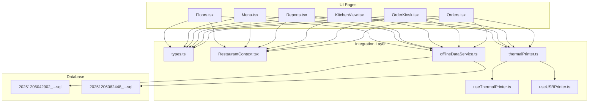

**Diagram sources**
- [Orders.tsx](file://src/pages/dashboard/Orders.tsx)
- [OrderKiosk.tsx](file://src/pages/dashboard/OrderKiosk.tsx)
- [KitchenView.tsx](file://src/pages/dashboard/KitchenView.tsx)
- [Reports.tsx](file://src/pages/dashboard/Reports.tsx)
- [Menu.tsx](file://src/pages/dashboard/Menu.tsx)
- [Floors.tsx](file://src/pages/dashboard/Floors.tsx)
- [types.ts](file://src/integrations/supabase/types.ts)
- [RestaurantContext.tsx](file://src/contexts/RestaurantContext.tsx)
- [offlineDataService.ts](file://src/services/offlineDataService.ts)
- [thermalPrinter.ts](file://src/services/thermalPrinter.ts)
- [useThermalPrinter.ts](file://src/hooks/useThermalPrinter.ts)
- [useUSBPrinter.ts](file://src/hooks/useUSBPrinter.ts)
- [20251206042902_fc2b1d91-eb8e-4750-90c3-95b7e0feb6ba.sql](file://supabase/migrations/20251206042902_fc2b1d91-eb8e-4750-90c3-95b7e0feb6ba.sql)
- [20251206062448_4e2d7da9-9519-48ae-9d6c-bb1c994ed84a.sql](file://supabase/migrations/20251206062448_4e2d7da9-9519-48ae-9d6c-bb1c994ed84a.sql)

**Section sources**
- [Orders.tsx](file://src/pages/dashboard/Orders.tsx)
- [OrderKiosk.tsx](file://src/pages/dashboard/OrderKiosk.tsx)
- [KitchenView.tsx](file://src/pages/dashboard/KitchenView.tsx)
- [Reports.tsx](file://src/pages/dashboard/Reports.tsx)
- [Menu.tsx](file://src/pages/dashboard/Menu.tsx)
- [Floors.tsx](file://src/pages/dashboard/Floors.tsx)
- [types.ts](file://src/integrations/supabase/types.ts)
- [RestaurantContext.tsx](file://src/contexts/RestaurantContext.tsx)
- [offlineDataService.ts](file://src/services/offlineDataService.ts)
- [thermalPrinter.ts](file://src/services/thermalPrinter.ts)
- [useThermalPrinter.ts](file://src/hooks/useThermalPrinter.ts)
- [useUSBPrinter.ts](file://src/hooks/useUSBPrinter.ts)
- [20251206042902_fc2b1d91-eb8e-4750-90c3-95b7e0feb6ba.sql](file://supabase/migrations/20251206042902_fc2b1d91-eb8e-4750-90c3-95b7e0feb6ba.sql)
- [20251206062448_4e2d7da9-9519-48ae-9d6c-bb1c994ed84a.sql](file://supabase/migrations/20251206062448_4e2d7da9-9519-48ae-9d6c-bb1c994ed84a.sql)

## Core Components
- Order lifecycle management: creation, modification, status transitions, cancellation, and completion
- Real-time updates via Supabase channels for orders and order items
- Offline-first architecture with SQLite caching and manual sync
- Kitchen workflow: status propagation from pending to cooking to ready
- Customer-facing kiosk for table-based ordering and status updates
- Payment processing integration with receipt printing via thermal printers
- Analytics and reporting with export and print capabilities

**Section sources**
- [Orders.tsx](file://src/pages/dashboard/Orders.tsx)
- [OrderKiosk.tsx](file://src/pages/dashboard/OrderKiosk.tsx)
- [KitchenView.tsx](file://src/pages/dashboard/KitchenView.tsx)
- [Reports.tsx](file://src/pages/dashboard/Reports.tsx)
- [offlineDataService.ts](file://src/services/offlineDataService.ts)

## Architecture Overview
The system follows an offline-first pattern with Supabase as the cloud source of truth and SQLite as the local store. Components use a shared offline service to read/write data, with optimistic UI updates and manual synchronization to the cloud.

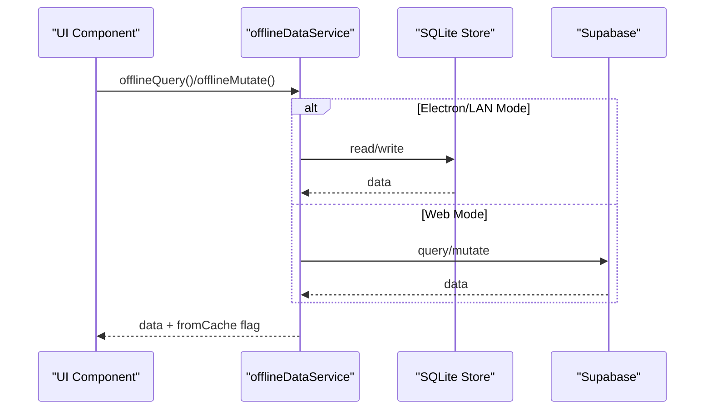

**Diagram sources**
- [offlineDataService.ts](file://src/services/offlineDataService.ts)

**Section sources**
- [offlineDataService.ts](file://src/services/offlineDataService.ts)

## Detailed Component Analysis

### Order Data Model and Status Transitions
The order model consists of orders and order items with a finite state machine for status transitions. The system supports:
- Order statuses: pending → cooking → ready → served; cancellation at any stage
- Order items inherit order status per item
- Kitchen association per menu item and order item
- Real-time updates via Supabase channels

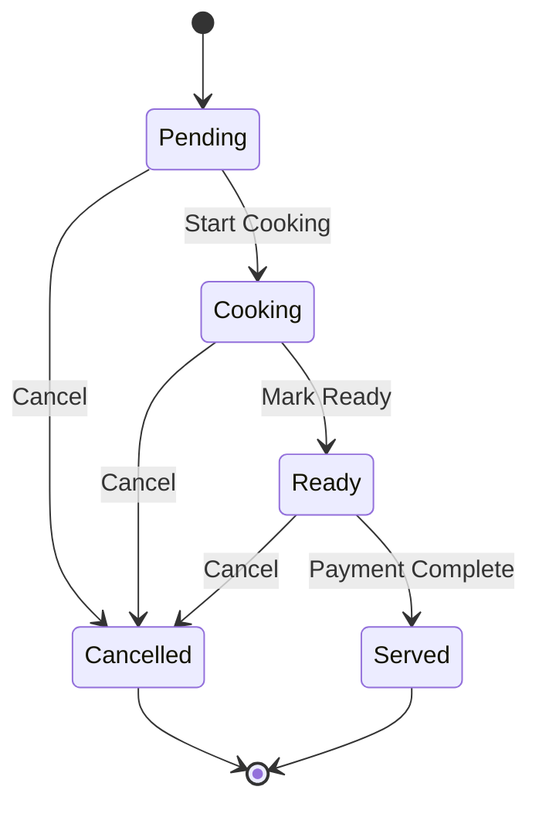

**Diagram sources**
- [types.ts](file://src/integrations/supabase/types.ts)
- [Orders.tsx](file://src/pages/dashboard/Orders.tsx)
- [KitchenView.tsx](file://src/pages/dashboard/KitchenView.tsx)

**Section sources**
- [types.ts](file://src/integrations/supabase/types.ts)
- [Orders.tsx](file://src/pages/dashboard/Orders.tsx)
- [KitchenView.tsx](file://src/pages/dashboard/KitchenView.tsx)

### Order Creation and Modification
- Dashboard Orders page allows creating new orders with table assignment, cart management, and batch item submission
- Order items are created with status pending and associated with a kitchen
- Modifications include updating quantities, adding notes, and cancelling items
- Table occupancy is managed automatically during order creation and completion

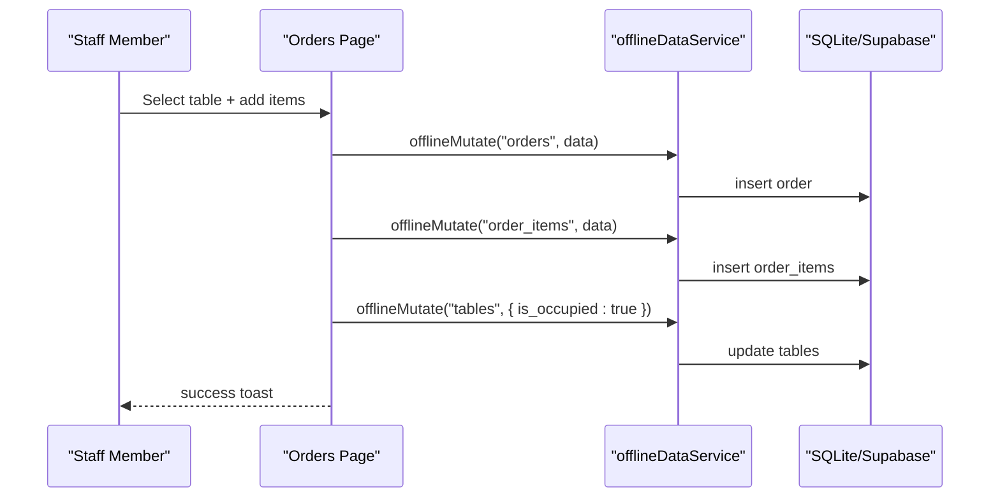

**Diagram sources**
- [Orders.tsx](file://src/pages/dashboard/Orders.tsx)
- [offlineDataService.ts](file://src/services/offlineDataService.ts)

**Section sources**
- [Orders.tsx](file://src/pages/dashboard/Orders.tsx)
- [offlineDataService.ts](file://src/services/offlineDataService.ts)

### Real-Time Status Tracking
- Real-time subscriptions for orders and order items ensure live updates across all views
- KitchenView aggregates orders by item status for efficient workflow
- Toast notifications provide user feedback for status changes

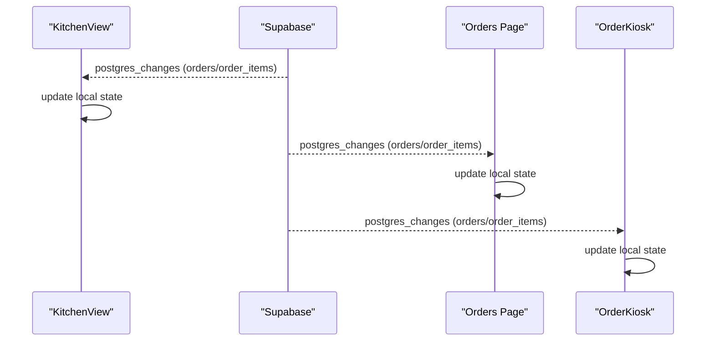

**Diagram sources**
- [KitchenView.tsx](file://src/pages/dashboard/KitchenView.tsx)
- [Orders.tsx](file://src/pages/dashboard/Orders.tsx)
- [OrderKiosk.tsx](file://src/pages/dashboard/OrderKiosk.tsx)

**Section sources**
- [KitchenView.tsx](file://src/pages/dashboard/KitchenView.tsx)
- [Orders.tsx](file://src/pages/dashboard/Orders.tsx)
- [OrderKiosk.tsx](file://src/pages/dashboard/OrderKiosk.tsx)

### Kitchen Workflow Coordination
- KitchenView organizes orders into Pending, Cooking, and Ready columns
- Staff can update item status individually or promote entire orders
- Automatic table release upon served status

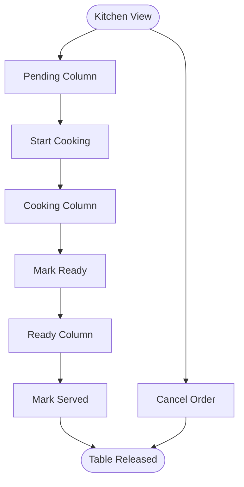

**Diagram sources**
- [KitchenView.tsx](file://src/pages/dashboard/KitchenView.tsx)

**Section sources**
- [KitchenView.tsx](file://src/pages/dashboard/KitchenView.tsx)

### Customer-Facing Kiosk Interface
- OrderKiosk enables customers to select floor, view tables, and place orders
- Supports search, category filtering, and real-time status updates
- Integrates with table occupancy and order history

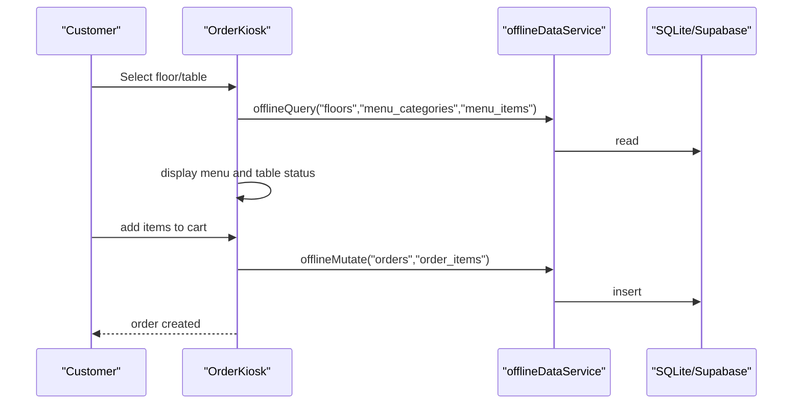

**Diagram sources**
- [OrderKiosk.tsx](file://src/pages/dashboard/OrderKiosk.tsx)
- [offlineDataService.ts](file://src/services/offlineDataService.ts)

**Section sources**
- [OrderKiosk.tsx](file://src/pages/dashboard/OrderKiosk.tsx)
- [offlineDataService.ts](file://src/services/offlineDataService.ts)

### Payment Processing and Receipt Printing
- BillingDialog integrates payment methods (cash, card, upi) and prints receipts
- Supports thermal printer via Bluetooth (mobile) and browser fallback
- USB printer support with device discovery and Windows printer switching

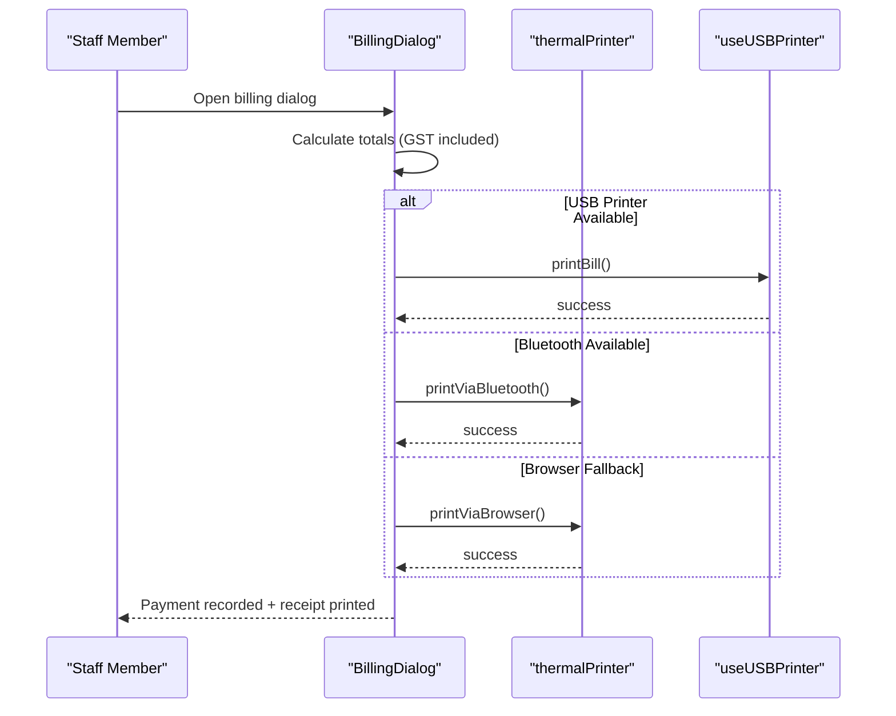

**Diagram sources**
- [BillingDialog.tsx](file://src/components/BillingDialog.tsx)
- [thermalPrinter.ts](file://src/services/thermalPrinter.ts)
- [useThermalPrinter.ts](file://src/hooks/useThermalPrinter.ts)
- [useUSBPrinter.ts](file://src/hooks/useUSBPrinter.ts)

**Section sources**
- [BillingDialog.tsx](file://src/components/BillingDialog.tsx)
- [thermalPrinter.ts](file://src/services/thermalPrinter.ts)
- [useThermalPrinter.ts](file://src/hooks/useThermalPrinter.ts)
- [useUSBPrinter.ts](file://src/hooks/useUSBPrinter.ts)

### Offline Order Handling and Synchronization
- offlineDataService provides offlineQuery and offlineMutate for SQLite-first operations
- Manual sync to cloud preserves timestamps and handles deletions
- Conflict prevention via soft deletes and pending sync markers

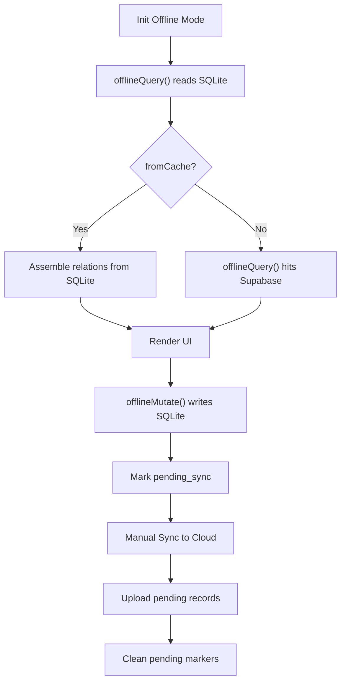

**Diagram sources**
- [offlineDataService.ts](file://src/services/offlineDataService.ts)

**Section sources**
- [offlineDataService.ts](file://src/services/offlineDataService.ts)

### Order History Management and Reporting
- Reports page aggregates order data, payment methods, and popular items
- Supports date range filtering, export, and printing via thermal printers
- Integrates with BillingDialog printer UX for report summaries

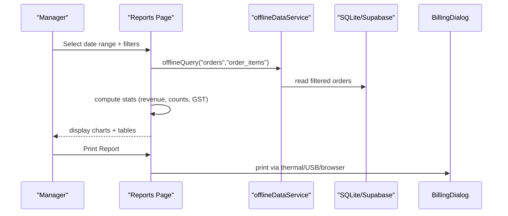

**Diagram sources**
- [Reports.tsx](file://src/pages/dashboard/Reports.tsx)
- [offlineDataService.ts](file://src/services/offlineDataService.ts)
- [BillingDialog.tsx](file://src/components/BillingDialog.tsx)

**Section sources**
- [Reports.tsx](file://src/pages/dashboard/Reports.tsx)
- [offlineDataService.ts](file://src/services/offlineDataService.ts)
- [BillingDialog.tsx](file://src/components/BillingDialog.tsx)

### Integration with Menu and Table Systems
- Menu management supports categories, items, availability, and kitchen associations
- Floor and table management integrates with order creation and occupancy tracking
- Kiosk leverages menu and floor data for intuitive ordering

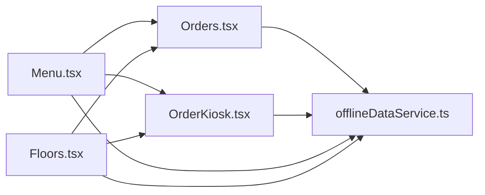

**Diagram sources**
- [Menu.tsx](file://src/pages/dashboard/Menu.tsx)
- [Floors.tsx](file://src/pages/dashboard/Floors.tsx)
- [Orders.tsx](file://src/pages/dashboard/Orders.tsx)
- [OrderKiosk.tsx](file://src/pages/dashboard/OrderKiosk.tsx)
- [offlineDataService.ts](file://src/services/offlineDataService.ts)

**Section sources**
- [Menu.tsx](file://src/pages/dashboard/Menu.tsx)
- [Floors.tsx](file://src/pages/dashboard/Floors.tsx)
- [Orders.tsx](file://src/pages/dashboard/Orders.tsx)
- [OrderKiosk.tsx](file://src/pages/dashboard/OrderKiosk.tsx)
- [offlineDataService.ts](file://src/services/offlineDataService.ts)

## Dependency Analysis
The order management system exhibits strong separation of concerns:
- UI components depend on RestaurantContext for restaurant and role context
- All data access funnels through offlineDataService
- Supabase types define the canonical schema and enums
- Printer integrations are isolated in dedicated services and hooks

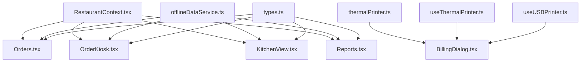

**Diagram sources**
- [RestaurantContext.tsx](file://src/contexts/RestaurantContext.tsx)
- [Orders.tsx](file://src/pages/dashboard/Orders.tsx)
- [OrderKiosk.tsx](file://src/pages/dashboard/OrderKiosk.tsx)
- [KitchenView.tsx](file://src/pages/dashboard/KitchenView.tsx)
- [Reports.tsx](file://src/pages/dashboard/Reports.tsx)
- [offlineDataService.ts](file://src/services/offlineDataService.ts)
- [types.ts](file://src/integrations/supabase/types.ts)
- [thermalPrinter.ts](file://src/services/thermalPrinter.ts)
- [useThermalPrinter.ts](file://src/hooks/useThermalPrinter.ts)
- [useUSBPrinter.ts](file://src/hooks/useUSBPrinter.ts)
- [BillingDialog.tsx](file://src/components/BillingDialog.tsx)

**Section sources**
- [RestaurantContext.tsx](file://src/contexts/RestaurantContext.tsx)
- [Orders.tsx](file://src/pages/dashboard/Orders.tsx)
- [OrderKiosk.tsx](file://src/pages/dashboard/OrderKiosk.tsx)
- [KitchenView.tsx](file://src/pages/dashboard/KitchenView.tsx)
- [Reports.tsx](file://src/pages/dashboard/Reports.tsx)
- [offlineDataService.ts](file://src/services/offlineDataService.ts)
- [types.ts](file://src/integrations/supabase/types.ts)
- [thermalPrinter.ts](file://src/services/thermalPrinter.ts)
- [useThermalPrinter.ts](file://src/hooks/useThermalPrinter.ts)
- [useUSBPrinter.ts](file://src/hooks/useUSBPrinter.ts)
- [BillingDialog.tsx](file://src/components/BillingDialog.tsx)

## Performance Considerations
- Offline-first reduces latency and improves reliability; use offlineQuery for reads and offlineMutate for writes
- Batch operations: create orders and order items in sequence to minimize network calls
- Real-time subscriptions should be scoped to relevant filters to reduce payload
- Cache assembly in UI components (e.g., Orders page) avoids redundant queries
- Printer operations are asynchronous; disable controls during printing to prevent race conditions

## Troubleshooting Guide
Common issues and resolutions:
- Offline mode errors: Verify SQLite availability and connectivity; use offlineQuery fallback behavior
- Sync failures: Check manual sync results and pending count; ensure timestamps are preserved
- Printer connectivity: Confirm device discovery and connection flows; use device lists and refresh mechanisms
- Real-time updates: Validate Supabase channel filters and restaurant scoping
- Data inconsistencies: Review soft-delete and pending_sync markers; clear local data if needed

**Section sources**
- [offlineDataService.ts](file://src/services/offlineDataService.ts)
- [useThermalPrinter.ts](file://src/hooks/useThermalPrinter.ts)
- [useUSBPrinter.ts](file://src/hooks/useUSBPrinter.ts)

## Conclusion
TableFlow Pro’s order management system combines robust offline-first architecture with real-time collaboration, kitchen-centric workflows, and integrated payment/receipt processing. The modular design ensures maintainability while supporting diverse deployment modes from LAN to standalone desktop applications.