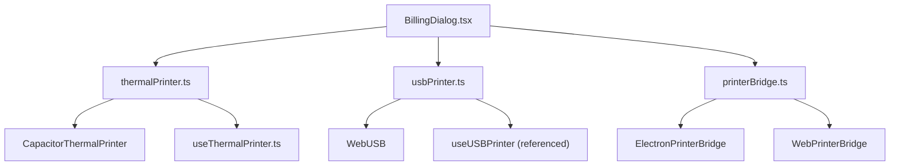
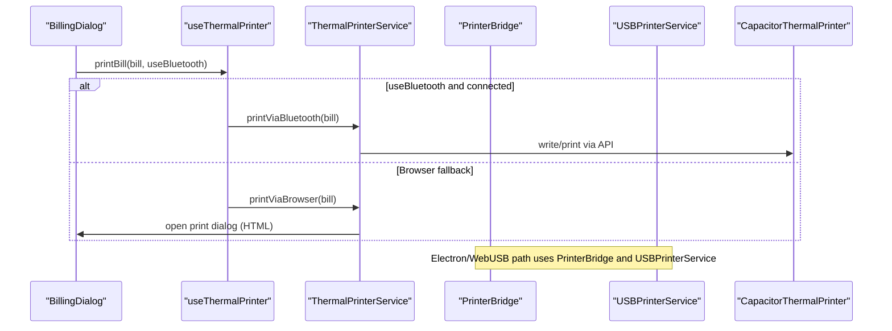
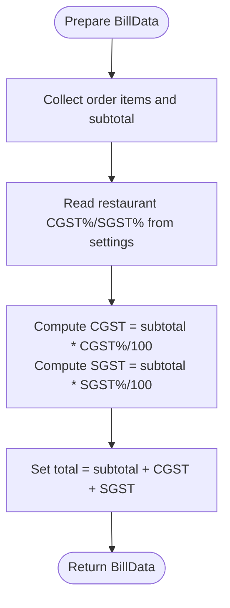
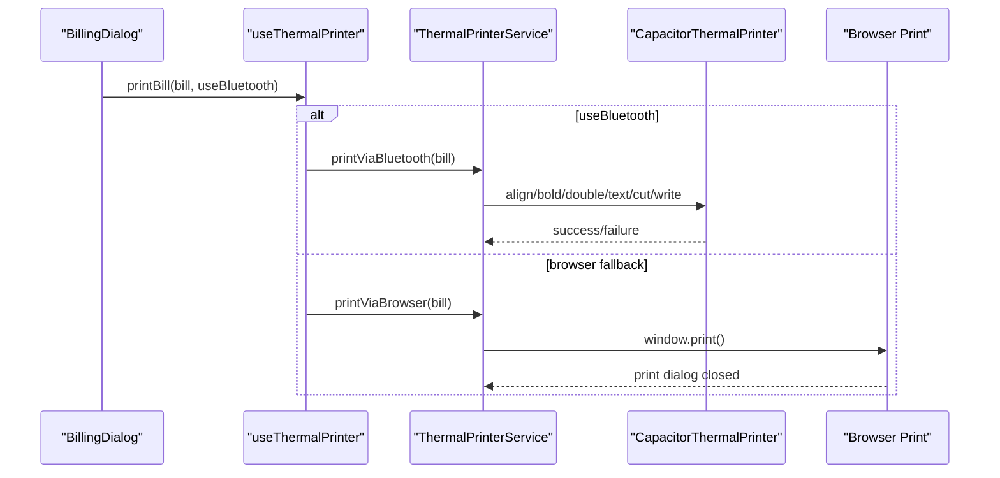
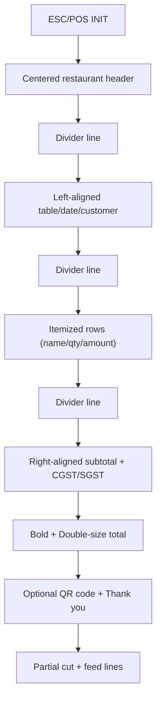
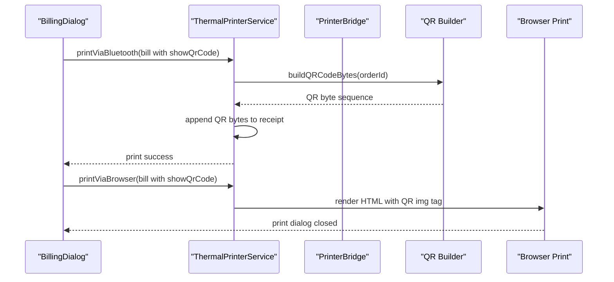
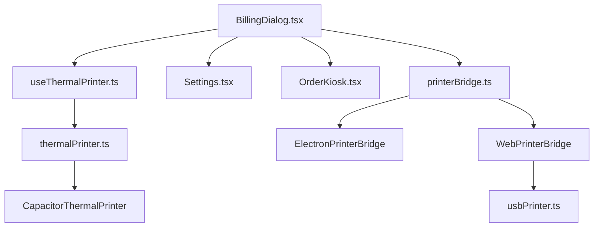

# Bill Printing Workflow & Templates

<cite>
**Referenced Files in This Document**
- [thermalPrinter.ts](file://src/services/thermalPrinter.ts)
- [useThermalPrinter.ts](file://src/hooks/useThermalPrinter.ts)
- [usbPrinter.ts](file://src/services/usbPrinter.ts)
- [printerBridge.ts](file://src/services/printerBridge.ts)
- [BillingDialog.tsx](file://src/components/BillingDialog.tsx)
- [Settings.tsx](file://src/pages/dashboard/Settings.tsx)
- [OrderKiosk.tsx](file://src/pages/dashboard/OrderKiosk.tsx)
- [IMPLEMENTATION_CHECKLIST.md](file://IMPLEMENTATION_CHECKLIST.md)
- [PHASE1_IMPLEMENTATION_COMPLETE.md](file://PHASE1_IMPLEMENTATION_COMPLETE.md)
</cite>

## Table of Contents
1. [Introduction](#introduction)
2. [Project Structure](#project-structure)
3. [Core Components](#core-components)
4. [Architecture Overview](#architecture-overview)
5. [Detailed Component Analysis](#detailed-component-analysis)
6. [Dependency Analysis](#dependency-analysis)
7. [Performance Considerations](#performance-considerations)
8. [Troubleshooting Guide](#troubleshooting-guide)
9. [Conclusion](#conclusion)
10. [Appendices](#appendices)

## Introduction
This document explains the bill printing workflow and template system used in the project. It covers the BillData interface, print template formatting for thermal printers (ESC/POS), receipt layout design, and the differences between printViaBluetooth and printViaBrowser. It also documents GST calculation display, QR code generation for order tracking, multi-language support considerations, and practical examples for preparing bill data, customizing templates, and executing print jobs. Finally, it addresses print quality settings, paper size considerations, and printer-specific formatting requirements.

## Project Structure
The bill printing system spans several modules:
- Services for thermal and USB printing
- A unified printer bridge for Electron/WebUSB
- React hooks to orchestrate printing flows
- UI components to collect bill data and trigger prints
- Settings and order-kiosk pages to prepare bill data and configure taxes

**Diagram sources**
- [BillingDialog.tsx:131-148](file://src/components/BillingDialog.tsx#L131-L148)
- [thermalPrinter.ts:118-219](file://src/services/thermalPrinter.ts#L118-L219)
- [usbPrinter.ts:295-313](file://src/services/usbPrinter.ts#L295-L313)
- [printerBridge.ts:198-258](file://src/services/printerBridge.ts#L198-L258)
- [printerBridge.ts:261-286](file://src/services/printerBridge.ts#L261-L286)
- [useThermalPrinter.ts:43-54](file://src/hooks/useThermalPrinter.ts#L43-L54)

**Section sources**
- [thermalPrinter.ts:1-339](file://src/services/thermalPrinter.ts#L1-L339)
- [useThermalPrinter.ts:1-69](file://src/hooks/useThermalPrinter.ts#L1-L69)
- [usbPrinter.ts:1-317](file://src/services/usbPrinter.ts#L1-L317)
- [printerBridge.ts:1-289](file://src/services/printerBridge.ts#L1-L289)
- [BillingDialog.tsx:1-569](file://src/components/BillingDialog.tsx#L1-L569)

## Core Components
- BillData interface: Defines restaurant info, customer details, order items, and tax fields (subtotal, CGST/SGST percentages and amounts, total).
- ThermalPrinterService: Provides Bluetooth printing via CapacitorThermalPrinter and browser-side HTML printing.
- USBPrinterService: Handles WebUSB ESC/POS printing with vendor/product filters and chunked transfers.
- PrinterBridge: Unified interface for Electron (native USB) and WebUSB printing, with QR code support and ESC/POS builders.
- BillingDialog: Collects order data, optional customer details, computes totals and taxes, and triggers print jobs.
- useThermalPrinter hook: Manages scanning/connecting/disconnecting and invoking print methods.

Key responsibilities:
- BillData: central contract for receipts
- ThermalPrinterService: mobile-first printing (Bluetooth) and fallback browser printing
- USBPrinterService: desktop/WebUSB printing with ESC/POS
- PrinterBridge: shared ESC/POS builder and QR code generation across environments
- BillingDialog: orchestrates bill creation and print method selection

**Section sources**
- [thermalPrinter.ts:9-31](file://src/services/thermalPrinter.ts#L9-L31)
- [thermalPrinter.ts:118-335](file://src/services/thermalPrinter.ts#L118-L335)
- [usbPrinter.ts:71-317](file://src/services/usbPrinter.ts#L71-L317)
- [printerBridge.ts:44-184](file://src/services/printerBridge.ts#L44-L184)
- [BillingDialog.tsx:98-129](file://src/components/BillingDialog.tsx#L98-L129)
- [useThermalPrinter.ts:4-15](file://src/hooks/useThermalPrinter.ts#L4-L15)

## Architecture Overview
The system supports three printing paths:
- Bluetooth (mobile): CapacitorThermalPrinter API
- Browser (fallback/web): HTML rendering and browser print dialog
- USB (desktop/WebUSB/Electron): ESC/POS via WebUSB or Electron native printer bridge

**Diagram sources**
- [BillingDialog.tsx:131-148](file://src/components/BillingDialog.tsx#L131-L148)
- [useThermalPrinter.ts:43-54](file://src/hooks/useThermalPrinter.ts#L43-L54)
- [thermalPrinter.ts:118-335](file://src/services/thermalPrinter.ts#L118-L335)
- [printerBridge.ts:261-286](file://src/services/printerBridge.ts#L261-L286)
- [usbPrinter.ts:295-313](file://src/services/usbPrinter.ts#L295-L313)

## Detailed Component Analysis

### BillData Interface and Tax Calculations
- Fields include restaurant info, customer info, items array, and tax breakdown (subtotal, CGST%, SGST%, CGST amount, SGST amount, total).
- BillingDialog computes CGST and SGST amounts from order total and configured percentages, then sets total as subtotal plus taxes.
- Settings page exposes CGST and SGST percentage configuration for the restaurant.

**Diagram sources**
- [BillingDialog.tsx:101-128](file://src/components/BillingDialog.tsx#L101-L128)
- [Settings.tsx:228-266](file://src/pages/dashboard/Settings.tsx#L228-L266)

**Section sources**
- [thermalPrinter.ts:9-31](file://src/services/thermalPrinter.ts#L9-L31)
- [BillingDialog.tsx:98-129](file://src/components/BillingDialog.tsx#L98-L129)
- [Settings.tsx:228-266](file://src/pages/dashboard/Settings.tsx#L228-L266)

### Thermal Printer Service: printViaBluetooth vs printViaBrowser
- printViaBluetooth (mobile):
  - Uses CapacitorThermalPrinter API to compose and send ESC/POS-like commands to a paired Bluetooth printer.
  - Applies alignment, bolding, double-width/double-size, divider lines, itemized rows, tax breakdown, and optional QR code.
- printViaBrowser (web/desktop):
  - Generates an HTML receipt and opens the browser’s print dialog.
  - Uses a fixed-width monospace layout optimized for thermal printer paper widths.

**Diagram sources**
- [thermalPrinter.ts:118-219](file://src/services/thermalPrinter.ts#L118-L219)
- [thermalPrinter.ts:221-335](file://src/services/thermalPrinter.ts#L221-L335)
- [useThermalPrinter.ts:43-54](file://src/hooks/useThermalPrinter.ts#L43-L54)

**Section sources**
- [thermalPrinter.ts:118-335](file://src/services/thermalPrinter.ts#L118-L335)
- [useThermalPrinter.ts:43-54](file://src/hooks/useThermalPrinter.ts#L43-L54)

### ESC/POS Template Formatting and Receipt Layout
- Shared ESC/POS constants and command builder are used across services.
- Typical layout:
  - Centered header with restaurant name and contact/GSTIN
  - Divider lines
  - Left-aligned table/date/customer info
  - Itemized rows with aligned columns (name, qty, amount)
  - Right-aligned subtotal and tax rows (CGST/SGST)
  - Bold and double-size for total
  - Optional QR code with order ID
  - Partial cut and feed lines

**Diagram sources**
- [printerBridge.ts:79-92](file://src/services/printerBridge.ts#L79-L92)
- [printerBridge.ts:94-184](file://src/services/printerBridge.ts#L94-L184)
- [usbPrinter.ts:11-24](file://src/services/usbPrinter.ts#L11-L24)
- [usbPrinter.ts:206-293](file://src/services/usbPrinter.ts#L206-L293)

**Section sources**
- [printerBridge.ts:44-184](file://src/services/printerBridge.ts#L44-L184)
- [usbPrinter.ts:11-24](file://src/services/usbPrinter.ts#L11-L24)
- [usbPrinter.ts:206-293](file://src/services/usbPrinter.ts#L206-L293)

### QR Code Generation for Order Tracking
- ESC/POS QR code builder composes GS ( k commands to store data, set module size, set error correction, and print QR.
- BillingDialog optionally enables QR code printing and passes order ID to the template.
- Browser fallback uses an external QR generator service and displays a fallback element if the image fails to load.

**Diagram sources**
- [printerBridge.ts:44-72](file://src/services/printerBridge.ts#L44-L72)
- [printerBridge.ts:162-171](file://src/services/printerBridge.ts#L162-L171)
- [thermalPrinter.ts:202-209](file://src/services/thermalPrinter.ts#L202-L209)
- [thermalPrinter.ts:317-327](file://src/services/thermalPrinter.ts#L317-L327)

**Section sources**
- [printerBridge.ts:44-72](file://src/services/printerBridge.ts#L44-L72)
- [printerBridge.ts:162-171](file://src/services/printerBridge.ts#L162-L171)
- [thermalPrinter.ts:202-209](file://src/services/thermalPrinter.ts#L202-L209)
- [thermalPrinter.ts:317-327](file://src/services/thermalPrinter.ts#L317-L327)

### Multi-Language Support and Date Formatting
- Dates are formatted using locale 'en-IN' to ensure consistent Indian formatting for date and time.
- Currency symbols and labels are static in the templates; localization would require internationalization libraries and locale-aware formatting for currency and labels.

**Section sources**
- [thermalPrinter.ts:127-130](file://src/services/thermalPrinter.ts#L127-L130)
- [thermalPrinter.ts:222-225](file://src/services/thermalPrinter.ts#L222-L225)
- [printerBridge.ts:117](file://src/services/printerBridge.ts#L117)

### Practical Examples

- Preparing BillData:
  - Collect order items and subtotal from the active order.
  - Read CGST and SGST percentages from settings.
  - Compute CGST and SGST amounts and set total accordingly.
  - Optionally populate customer details and enable QR code printing.

- Template customization:
  - Modify alignment, bolding, and divider styles in the shared ESC/POS builder or browser HTML template.
  - Adjust column widths and spacing to fit your paper width.

- Executing print jobs:
  - Use BillingDialog to compute BillData and choose print method (USB/Bluetooth/Browser).
  - For Electron/WebUSB, PrinterBridge handles ESC/POS assembly and QR code injection.

**Section sources**
- [BillingDialog.tsx:98-129](file://src/components/BillingDialog.tsx#L98-L129)
- [printerBridge.ts:94-184](file://src/services/printerBridge.ts#L94-L184)
- [thermalPrinter.ts:118-335](file://src/services/thermalPrinter.ts#L118-L335)

### Print Quality Settings, Paper Size, and Printer-Specific Requirements
- ESC/POS commands:
  - Alignment, bold, double-width/double-size, partial cut, and feed lines are used to format receipts.
- Paper width:
  - Templates assume a narrow thermal paper width suitable for typical home/small restaurant printers.
- USB connectivity:
  - WebUSB requires a supported browser and a compatible ESC/POS printer; vendor/product filters improve device selection.
- Electron integration:
  - ElectronPrinterBridge allows selecting a specific USB device and optionally switching a Windows printer for the same device.

**Section sources**
- [printerBridge.ts:79-92](file://src/services/printerBridge.ts#L79-L92)
- [usbPrinter.ts:28-52](file://src/services/usbPrinter.ts#L28-L52)
- [usbPrinter.ts:76-78](file://src/services/usbPrinter.ts#L76-L78)
- [printerBridge.ts:198-258](file://src/services/printerBridge.ts#L198-L258)

## Dependency Analysis
- BillingDialog depends on:
  - useThermalPrinter for Bluetooth/USB/browser print orchestration
  - Settings for CGST/SGST configuration
  - OrderKiosk for order aggregation and total computation
- ThermalPrinterService depends on CapacitorThermalPrinter for mobile printing.
- PrinterBridge abstracts environment-specific implementations (Electron vs WebUSB).
- USBPrinterService encapsulates WebUSB device selection and ESC/POS transfer.

**Diagram sources**
- [BillingDialog.tsx:82-83](file://src/components/BillingDialog.tsx#L82-L83)
- [useThermalPrinter.ts:2-3](file://src/hooks/useThermalPrinter.ts#L2-L3)
- [thermalPrinter.ts:1-3](file://src/services/thermalPrinter.ts#L1-L3)
- [printerBridge.ts:261-286](file://src/services/printerBridge.ts#L261-L286)
- [usbPrinter.ts:1-5](file://src/services/usbPrinter.ts#L1-L5)

**Section sources**
- [BillingDialog.tsx:82-83](file://src/components/BillingDialog.tsx#L82-L83)
- [useThermalPrinter.ts:2-3](file://src/hooks/useThermalPrinter.ts#L2-L3)
- [thermalPrinter.ts:1-3](file://src/services/thermalPrinter.ts#L1-L3)
- [printerBridge.ts:261-286](file://src/services/printerBridge.ts#L261-L286)
- [usbPrinter.ts:1-5](file://src/services/usbPrinter.ts#L1-L5)

## Performance Considerations
- Chunked USB transfers (64-byte) reduce memory pressure and improve reliability for large receipts.
- ESC/POS assembly concatenates pre-encoded segments; minimizing allocations improves throughput.
- Browser printing defers to the OS print queue; avoid excessive DOM reflows during HTML generation.

[No sources needed since this section provides general guidance]

## Troubleshooting Guide
Common issues and remedies:
- No printer connected (USB/WebUSB):
  - Ensure the printer is plugged in and selected; WebUSB requires a supported browser and compatible ESC/POS device.
- Bluetooth not available or not connected:
  - Verify the platform is native/mobile and a printer is paired and connected.
- Print failures:
  - Reconnect the printer and retry; check for endpoint availability and interface claims.
- QR code not appearing:
  - Confirm showQrCode flag and order ID are present; for browser fallback, ensure network access to the QR service.

**Section sources**
- [usbPrinter.ts:295-313](file://src/services/usbPrinter.ts#L295-L313)
- [thermalPrinter.ts:118-219](file://src/services/thermalPrinter.ts#L118-L219)
- [printerBridge.ts:242-253](file://src/services/printerBridge.ts#L242-L253)

## Conclusion
The bill printing system provides a robust, extensible solution for generating receipts across mobile, web, and desktop environments. The BillData interface standardizes input, while shared ESC/POS templates and QR code generation ensure consistent output. The unified PrinterBridge simplifies environment-specific logic, and the BillingDialog streamlines bill preparation and print method selection.

[No sources needed since this section summarizes without analyzing specific files]

## Appendices

### Appendix A: BillData Field Reference
- restaurantName, restaurantAddress, restaurantPhone, restaurantGstin
- tableNumber, orderId, showQrCode
- customerName, customerPhone, customerGstin
- items: array of { name, quantity, price }
- subtotal, cgstPercentage, sgstPercentage, cgstAmount, sgstAmount, total

**Section sources**
- [thermalPrinter.ts:9-31](file://src/services/thermalPrinter.ts#L9-L31)

### Appendix B: GST Calculation and Display
- Computed in BillingDialog using configured restaurant percentages.
- Displayed as separate CGST and SGST lines, followed by total.

**Section sources**
- [BillingDialog.tsx:101-128](file://src/components/BillingDialog.tsx#L101-L128)
- [thermalPrinter.ts:184-190](file://src/services/thermalPrinter.ts#L184-L190)
- [printerBridge.ts:143-148](file://src/services/printerBridge.ts#L143-L148)

### Appendix C: Printer Schema Alignment
- Local SQLite and LAN server include CGST/SGST/discount/final_amount/payment_status/customer fields.
- Supabase migration adds equivalent columns to synchronize cloud data.

**Section sources**
- [PHASE1_IMPLEMENTATION_COMPLETE.md:190-217](file://PHASE1_IMPLEMENTATION_COMPLETE.md#L190-L217)
- [IMPLEMENTATION_CHECKLIST.md:432-466](file://IMPLEMENTATION_CHECKLIST.md#L432-L466)