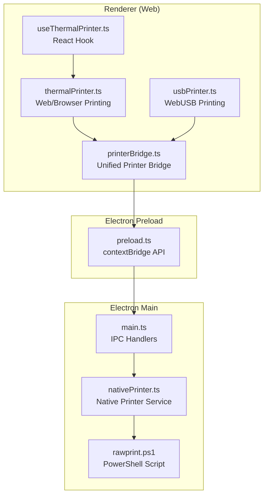
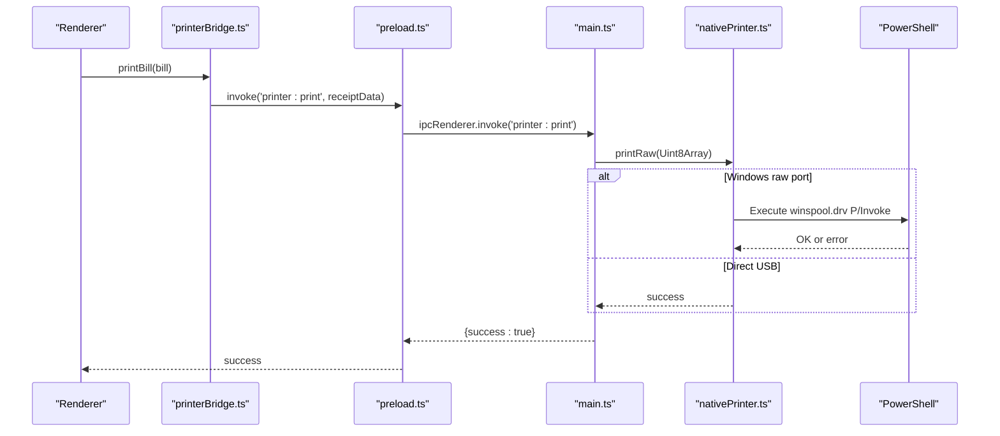
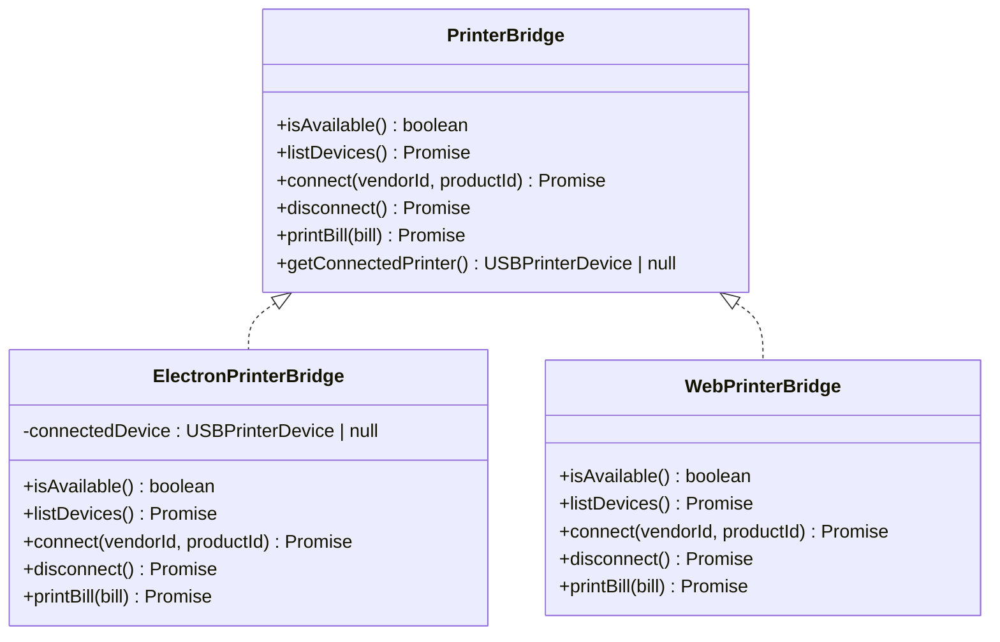
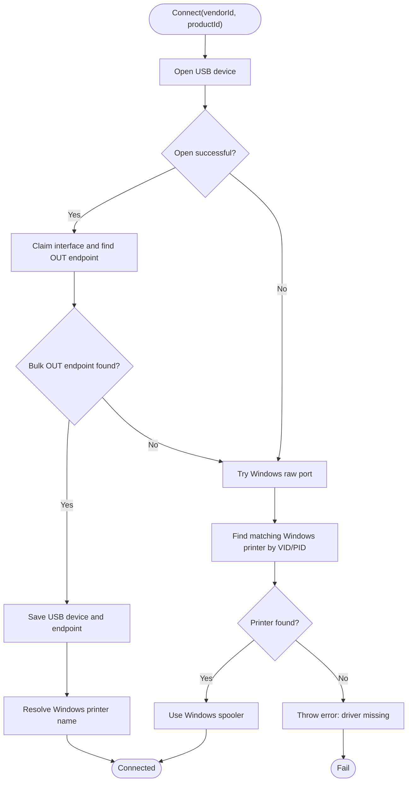
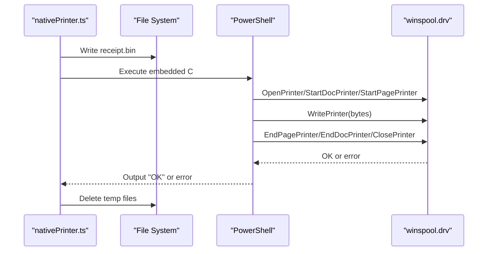
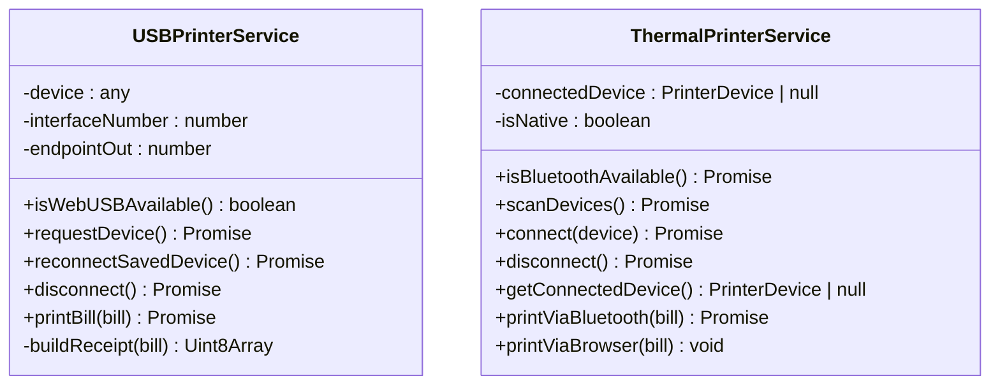
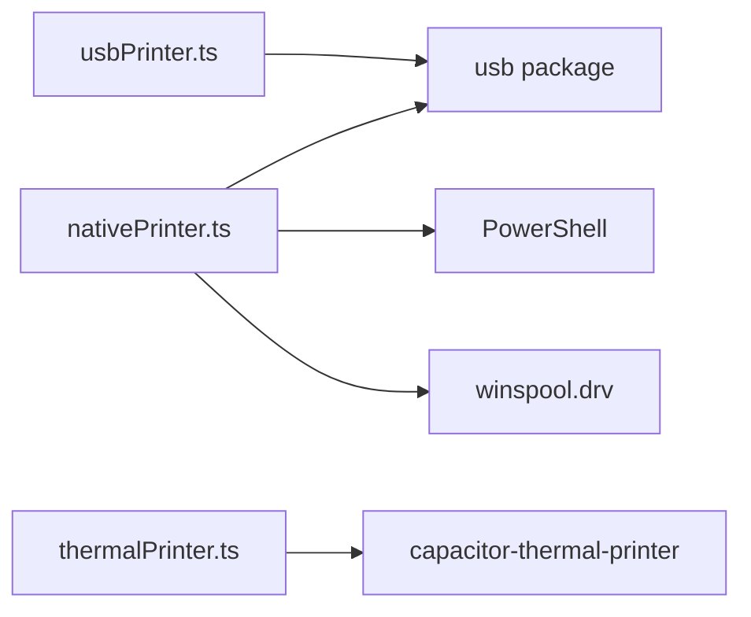

# Native Desktop Printing

<cite>
**Referenced Files in This Document**
- [main.ts](file://electron/main.ts)
- [preload.ts](file://electron/preload.ts)
- [nativePrinter.ts](file://electron/services/nativePrinter.ts)
- [rawprint.ps1](file://electron/services/rawprint.ps1)
- [printerBridge.ts](file://src/services/printerBridge.ts)
- [thermalPrinter.ts](file://src/services/thermalPrinter.ts)
- [usbPrinter.ts](file://src/services/usbPrinter.ts)
- [useThermalPrinter.ts](file://src/hooks/useThermalPrinter.ts)
- [package.json](file://package.json)
</cite>

## Table of Contents
1. [Introduction](#introduction)
2. [Project Structure](#project-structure)
3. [Core Components](#core-components)
4. [Architecture Overview](#architecture-overview)
5. [Detailed Component Analysis](#detailed-component-analysis)
6. [Dependency Analysis](#dependency-analysis)
7. [Performance Considerations](#performance-considerations)
8. [Troubleshooting Guide](#troubleshooting-guide)
9. [Conclusion](#conclusion)
10. [Appendices](#appendices)

## Introduction
This document explains the native desktop printing capabilities implemented in the Electron-based desktop application. It covers the unified printer bridge that supports both web-based and native desktop printing, the Windows-specific printer integration using raw printing APIs, and the PowerShell-based raw print command execution. It also documents printer discovery, device configuration, Windows printer queue management, and error handling strategies. Finally, it provides setup instructions for desktop printer configuration, driver installation, and printer sharing across network locations, along with security considerations and troubleshooting guidance.

## Project Structure
The printing system spans three layers:
- Renderer (web) layer: Provides a unified printer bridge abstraction and web-based thermal printing.
- Electron main process: Exposes native printer operations via IPC handlers and orchestrates Windows printer integration.
- Electron preload bridge: Exposes a safe API surface to the renderer process.

**Diagram sources**
- [printerBridge.ts:1-254](file://src/services/printerBridge.ts#L1-L254)
- [thermalPrinter.ts:1-339](file://src/services/thermalPrinter.ts#L1-L339)
- [usbPrinter.ts:1-317](file://src/services/usbPrinter.ts#L1-L317)
- [useThermalPrinter.ts:1-69](file://src/hooks/useThermalPrinter.ts#L1-L69)
- [preload.ts:1-90](file://electron/preload.ts#L1-L90)
- [main.ts:1-450](file://electron/main.ts#L1-L450)
- [nativePrinter.ts:1-542](file://electron/services/nativePrinter.ts#L1-L542)
- [rawprint.ps1:1-71](file://electron/services/rawprint.ps1#L1-L71)

**Section sources**
- [printerBridge.ts:1-254](file://src/services/printerBridge.ts#L1-L254)
- [preload.ts:1-90](file://electron/preload.ts#L1-L90)
- [main.ts:1-450](file://electron/main.ts#L1-L450)
- [nativePrinter.ts:1-542](file://electron/services/nativePrinter.ts#L1-L542)
- [rawprint.ps1:1-71](file://electron/services/rawprint.ps1#L1-L71)

## Core Components
- Unified Printer Bridge: Detects the runtime environment and routes calls to either Electron native or web implementations. It exposes methods to list devices, connect, disconnect, and print bills.
- Native Printer Service: Implements USB device enumeration and connection, raw printing via Windows spooler, and Windows printer switching. It includes robust fallbacks to Windows raw port printing when direct USB access fails.
- PowerShell Integration: Two mechanisms are used:
  - Inline C# P/Invoke via Add-Type to call winspool.drv for raw printing.
  - A separate PowerShell script that wraps the same P/Invoke pattern for external invocation.
- WebUSB and Browser Printing: WebUSB-based ESC/POS printing for compatible printers and browser-based HTML printing for general web usage.

Key responsibilities:
- Device discovery and connection for both USB and Windows printers.
- Raw ESC/POS data formatting and transmission.
- Error handling and graceful fallbacks.
- Cross-platform compatibility (Windows-specific enhancements).

**Section sources**
- [printerBridge.ts:188-254](file://src/services/printerBridge.ts#L188-L254)
- [nativePrinter.ts:45-531](file://electron/services/nativePrinter.ts#L45-L531)
- [rawprint.ps1:1-71](file://electron/services/rawprint.ps1#L1-L71)
- [usbPrinter.ts:71-317](file://src/services/usbPrinter.ts#L71-L317)
- [thermalPrinter.ts:33-339](file://src/services/thermalPrinter.ts#L33-L339)

## Architecture Overview
The architecture separates concerns across layers:
- Renderer invokes the unified bridge, which selects the appropriate implementation.
- Electron main registers IPC handlers that delegate to the native printer service.
- The native printer service manages USB connections and falls back to Windows raw printing when needed.
- PowerShell scripts are invoked to send raw ESC/POS data to Windows printers using the spooler API.

**Diagram sources**
- [printerBridge.ts:242-253](file://src/services/printerBridge.ts#L242-L253)
- [preload.ts:6-13](file://electron/preload.ts#L6-L13)
- [main.ts:71-78](file://electron/main.ts#L71-L78)
- [nativePrinter.ts:429-509](file://electron/services/nativePrinter.ts#L429-L509)
- [rawprint.ps1:39-70](file://electron/services/rawprint.ps1#L39-L70)

## Detailed Component Analysis

### Unified Printer Bridge
The bridge abstracts environment detection and routes operations to the correct implementation. It ensures consistent behavior whether running in Electron or web browsers.

**Diagram sources**
- [printerBridge.ts:188-254](file://src/services/printerBridge.ts#L188-L254)

**Section sources**
- [printerBridge.ts:198-254](file://src/services/printerBridge.ts#L198-L254)
- [printerBridge.ts:20-31](file://src/services/printerBridge.ts#L20-L31)

### Native Printer Service (Windows)
The native printer service encapsulates:
- USB device enumeration and connection with fallback to Windows raw printing.
- Windows printer discovery by VID/PID and port resolution.
- Raw printing via PowerShell with embedded C# P/Invoke to winspool.drv.
- Printer switching between multiple Windows printers mapped to the same USB device.

**Diagram sources**
- [nativePrinter.ts:101-229](file://electron/services/nativePrinter.ts#L101-L229)
- [nativePrinter.ts:234-325](file://electron/services/nativePrinter.ts#L234-L325)

**Section sources**
- [nativePrinter.ts:45-229](file://electron/services/nativePrinter.ts#L45-L229)
- [nativePrinter.ts:234-417](file://electron/services/nativePrinter.ts#L234-L417)

### PowerShell Raw Print Execution
Two approaches are used:
- Inline C# P/Invoke via Add-Type executed from the native service.
- A standalone PowerShell script that reads a binary file and sends it to a named printer.

**Diagram sources**
- [nativePrinter.ts:455-509](file://electron/services/nativePrinter.ts#L455-L509)
- [rawprint.ps1:39-70](file://electron/services/rawprint.ps1#L39-L70)

**Section sources**
- [nativePrinter.ts:455-509](file://electron/services/nativePrinter.ts#L455-L509)
- [rawprint.ps1:1-71](file://electron/services/rawprint.ps1#L1-L71)

### WebUSB and Browser Printing
- WebUSB: Enumerates and connects to ESC/POS-compatible printers via known vendor/product IDs and bulk OUT endpoints.
- Browser printing: Generates HTML receipts and prints via the browser’s print dialog.

**Diagram sources**
- [usbPrinter.ts:71-317](file://src/services/usbPrinter.ts#L71-L317)
- [thermalPrinter.ts:33-339](file://src/services/thermalPrinter.ts#L33-L339)

**Section sources**
- [usbPrinter.ts:71-317](file://src/services/usbPrinter.ts#L71-L317)
- [thermalPrinter.ts:33-339](file://src/services/thermalPrinter.ts#L33-L339)

## Dependency Analysis
External dependencies relevant to printing:
- USB access: The native service uses the USB library to enumerate and communicate with devices.
- Windows spooler: Raw printing relies on PowerShell and winspool.drv P/Invoke.
- Capacitor thermal printer: Used for mobile thermal printing scenarios.

**Diagram sources**
- [nativePrinter.ts:4-8](file://electron/services/nativePrinter.ts#L4-L8)
- [thermalPrinter.ts:1-3](file://src/services/thermalPrinter.ts#L1-L3)
- [usbPrinter.ts:1-2](file://src/services/usbPrinter.ts#L1-L2)

**Section sources**
- [package.json:74-77](file://package.json#L74-L77)
- [package.json:18-50](file://package.json#L18-L50)

## Performance Considerations
- Chunked transfers: Both USB and raw printing use chunked writes to reduce memory pressure and improve reliability.
- Endpoint selection: The service prioritizes bulk OUT endpoints for efficient data transfer.
- Fallback strategy: Direct USB access failures immediately fall back to Windows raw printing to maintain responsiveness.
- Temporary file cleanup: Raw printing creates temporary files; the service ensures cleanup to prevent disk bloat.

[No sources needed since this section provides general guidance]

## Troubleshooting Guide
Common issues and resolutions:
- No printer detected:
  - Verify the device is connected and recognized by the OS.
  - Use the device listing APIs to confirm availability.
- USB open or interface claim failures:
  - Ensure the correct driver is installed (e.g., WinUSB via Zadig).
  - Try Windows raw port fallback by installing a generic text-only driver.
- Windows printer not found:
  - Confirm the printer appears under Windows Settings > Printers.
  - Use the Windows printer listing and switching APIs to select the correct printer.
- Print failures:
  - Check the error messages returned by the native service and PowerShell scripts.
  - Validate the ESC/POS data generation and ensure proper alignment and formatting.
- Permissions:
  - Running PowerShell may require appropriate execution policies; the service bypasses policy for execution.
  - Administrative privileges may be required for driver installations.

**Section sources**
- [nativePrinter.ts:111-121](file://electron/services/nativePrinter.ts#L111-L121)
- [nativePrinter.ts:207-229](file://electron/services/nativePrinter.ts#L207-L229)
- [nativePrinter.ts:455-509](file://electron/services/nativePrinter.ts#L455-L509)

## Conclusion
The application provides a robust, cross-environment printing solution. The unified bridge ensures consistent behavior across platforms, while the native service delivers reliable Windows integration via raw printing and PowerShell. The system includes comprehensive fallbacks, error handling, and printer discovery mechanisms to support diverse deployment scenarios.

[No sources needed since this section summarizes without analyzing specific files]

## Appendices

### Setup Instructions: Desktop Printer Configuration
- Install drivers:
  - For direct USB access, install a WinUSB-compatible driver (e.g., using Zadig).
  - For Windows raw port fallback, install a generic text-only printer driver in Windows Settings > Printers.
- Configure shared printers:
  - Share the printer on the host machine and ensure network discovery is enabled.
  - Use the Windows printer listing and switching APIs to select the desired printer.
- Build and run:
  - Use the provided build scripts to package and run the application.
  - Ensure the application has permissions to access the printer and execute PowerShell.

**Section sources**
- [nativePrinter.ts:207-229](file://electron/services/nativePrinter.ts#L207-L229)
- [main.ts:89-123](file://electron/main.ts#L89-L123)
- [package.json:12-16](file://package.json#L12-L16)

### Security Considerations
- PowerShell execution:
  - The service executes PowerShell with bypassed execution policies for convenience; evaluate and adjust policies according to your security posture.
- Temporary files:
  - Raw printing writes temporary binary files; ensure secure deletion and appropriate file permissions.
- Driver trust:
  - Only install trusted drivers and verify hardware compatibility.

**Section sources**
- [nativePrinter.ts:497-500](file://electron/services/nativePrinter.ts#L497-L500)
- [rawprint.ps1:63-70](file://electron/services/rawprint.ps1#L63-L70)

### Integration Between Web-Based and Native Desktop Printing
- Unified bridge:
  - The bridge detects the runtime and routes to Electron native or web implementations.
- WebUSB and browser printing:
  - WebUSB enables direct ESC/POS printing for compatible devices.
  - Browser printing generates printable HTML receipts for general use.
- Electron main and preload:
  - IPC handlers expose native printer operations to the renderer.
  - The preload bridge defines a safe API surface for renderer access.

**Section sources**
- [printerBridge.ts:188-254](file://src/services/printerBridge.ts#L188-L254)
- [preload.ts:4-13](file://electron/preload.ts#L4-L13)
- [main.ts:53-124](file://electron/main.ts#L53-L124)
- [usbPrinter.ts:71-317](file://src/services/usbPrinter.ts#L71-L317)
- [thermalPrinter.ts:221-335](file://src/services/thermalPrinter.ts#L221-L335)