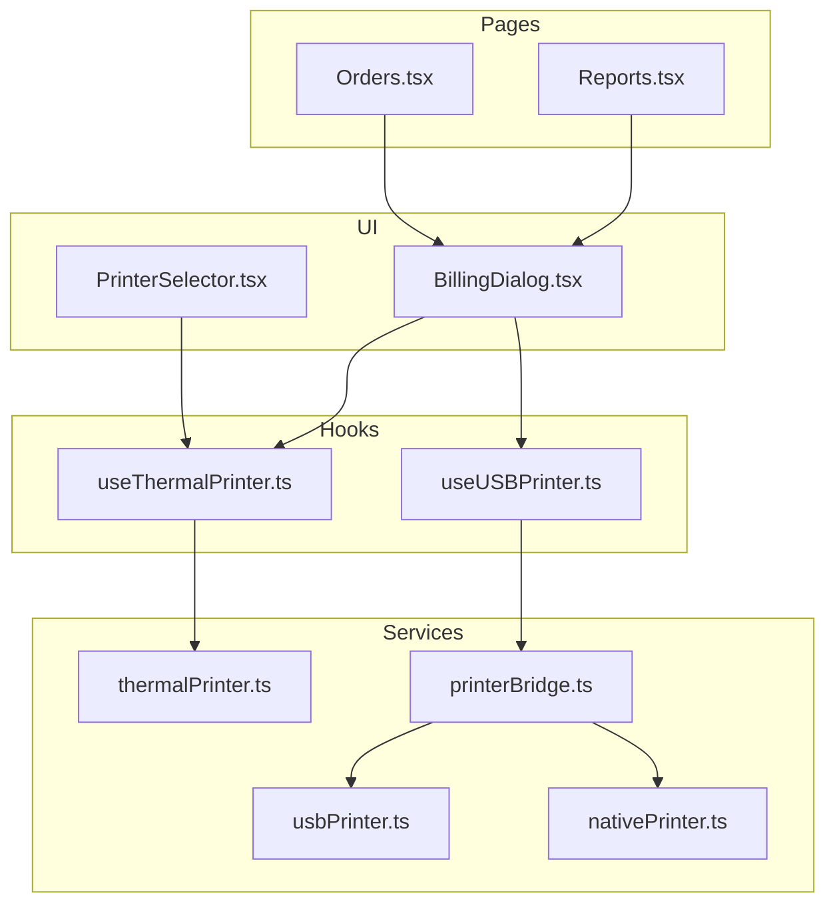
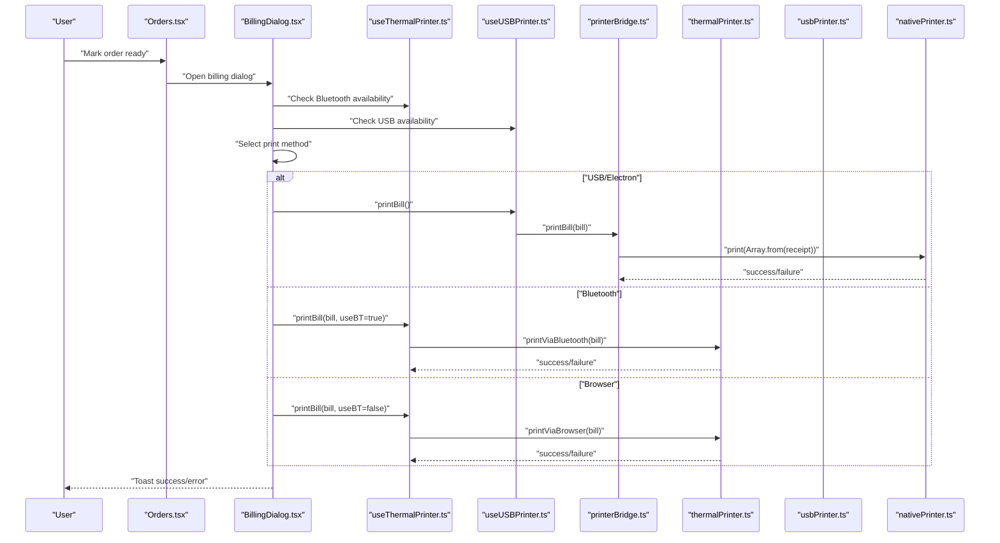
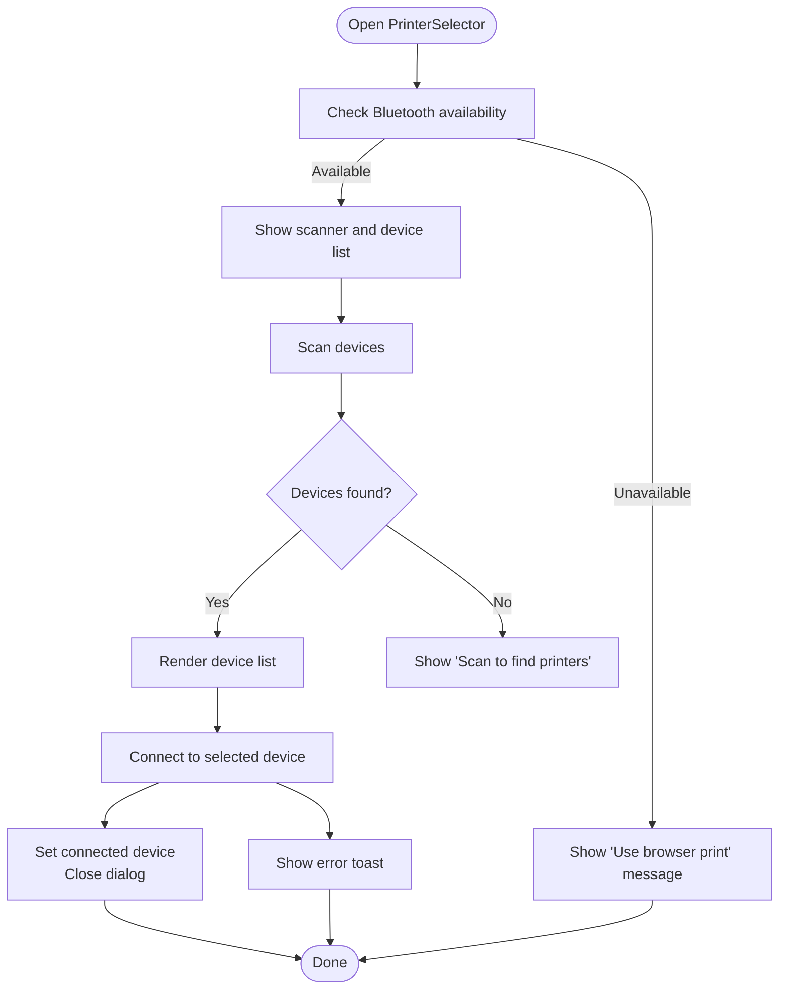
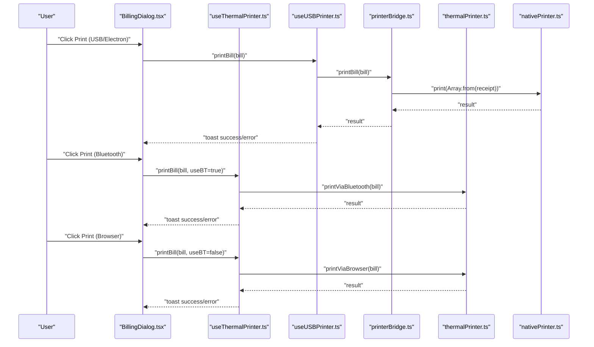
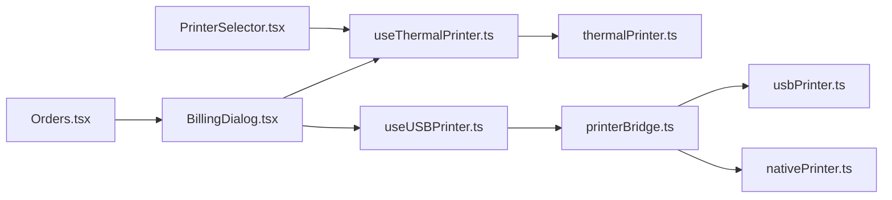

# Printer Integration

<cite>
**Referenced Files in This Document**
- [PrinterSelector.tsx](file://src/components/PrinterSelector.tsx)
- [BillingDialog.tsx](file://src/components/BillingDialog.tsx)
- [useThermalPrinter.ts](file://src/hooks/useThermalPrinter.ts)
- [useUSBPrinter.ts](file://src/hooks/useUSBPrinter.ts)
- [thermalPrinter.ts](file://src/services/thermalPrinter.ts)
- [usbPrinter.ts](file://src/services/usbPrinter.ts)
- [printerBridge.ts](file://src/services/printerBridge.ts)
- [Orders.tsx](file://src/pages/dashboard/Orders.tsx)
- [Reports.tsx](file://src/pages/dashboard/Reports.tsx)
- [nativePrinter.ts](file://electron/services/nativePrinter.ts)
</cite>

## Table of Contents
1. [Introduction](#introduction)
2. [Project Structure](#project-structure)
3. [Core Components](#core-components)
4. [Architecture Overview](#architecture-overview)
5. [Detailed Component Analysis](#detailed-component-analysis)
6. [Dependency Analysis](#dependency-analysis)
7. [Performance Considerations](#performance-considerations)
8. [Troubleshooting Guide](#troubleshooting-guide)
9. [Conclusion](#conclusion)
10. [Appendices](#appendices)

## Introduction
This document explains the printer integration for TableFlow Pro across web, desktop (Electron), and mobile platforms. It covers thermal printer connection and configuration, Bluetooth printer setup for mobile, bill printing workflows, device management, browser-based printing, and native desktop integration. It also documents the printer selection interface, print job management, error handling strategies, and integration with the order management system for automatic bill printing and receipt generation. Compatibility, driver requirements, and platform-specific considerations are included for web, desktop, and mobile environments.

## Project Structure
The printer integration spans UI components, hooks, and services organized by platform and responsibility:
- UI: PrinterSelector and BillingDialog provide user interfaces for selecting and printing receipts.
- Hooks: useThermalPrinter and useUSBPrinter encapsulate state and actions for thermal and USB printers.
- Services: thermalPrinter handles Bluetooth printing and browser fallback; usbPrinter and printerBridge implement WebUSB/Electron printer bridges; nativePrinter provides Electron-native USB and Windows printer support.
- Pages: Orders and Reports integrate printing into order lifecycle and reporting.

**Diagram sources**
- [PrinterSelector.tsx:16-168](file://src/components/PrinterSelector.tsx#L16-L168)
- [BillingDialog.tsx:62-568](file://src/components/BillingDialog.tsx#L62-L568)
- [useThermalPrinter.ts:4-68](file://src/hooks/useThermalPrinter.ts#L4-L68)
- [useUSBPrinter.ts:19-111](file://src/hooks/useUSBPrinter.ts#L19-L111)
- [thermalPrinter.ts:33-338](file://src/services/thermalPrinter.ts#L33-L338)
- [usbPrinter.ts:71-316](file://src/services/usbPrinter.ts#L71-L316)
- [printerBridge.ts:24-289](file://src/services/printerBridge.ts#L24-L289)
- [nativePrinter.ts:45-438](file://electron/services/nativePrinter.ts#L45-L438)
- [Orders.tsx:134-530](file://src/pages/dashboard/Orders.tsx#L134-L530)
- [Reports.tsx:204-576](file://src/pages/dashboard/Reports.tsx#L204-L576)

**Section sources**
- [PrinterSelector.tsx:16-168](file://src/components/PrinterSelector.tsx#L16-L168)
- [BillingDialog.tsx:62-568](file://src/components/BillingDialog.tsx#L62-L568)
- [useThermalPrinter.ts:4-68](file://src/hooks/useThermalPrinter.ts#L4-L68)
- [useUSBPrinter.ts:19-111](file://src/hooks/useUSBPrinter.ts#L19-L111)
- [thermalPrinter.ts:33-338](file://src/services/thermalPrinter.ts#L33-L338)
- [usbPrinter.ts:71-316](file://src/services/usbPrinter.ts#L71-L316)
- [printerBridge.ts:24-289](file://src/services/printerBridge.ts#L24-L289)
- [nativePrinter.ts:45-438](file://electron/services/nativePrinter.ts#L45-L438)
- [Orders.tsx:134-530](file://src/pages/dashboard/Orders.tsx#L134-L530)
- [Reports.tsx:204-576](file://src/pages/dashboard/Reports.tsx#L204-L576)

## Core Components
- PrinterSelector: Presents a modal to scan and connect Bluetooth thermal printers on mobile; shows connection status and allows disconnection.
- BillingDialog: Generates bills from order data, supports three printing modes (USB/Electron, Bluetooth, Browser), and integrates customer details and payment completion.
- useThermalPrinter: Manages Bluetooth availability, scanning, connecting, disconnecting, and printing via thermalPrinter.
- useUSBPrinter: Manages USB printer connectivity and printing via printerBridge; persists last connected device.
- thermalPrinter: Implements Bluetooth printing for mobile and browser fallback printing for desktop/web.
- usbPrinter: Implements WebUSB ESC/POS printing for compatible thermal printers.
- printerBridge: Unified bridge that selects Electron or WebUSB implementation at runtime and builds ESC/POS receipts.
- nativePrinter (Electron): Provides native USB and Windows printer support, including driver fallback and Windows printer switching.

**Section sources**
- [PrinterSelector.tsx:16-168](file://src/components/PrinterSelector.tsx#L16-L168)
- [BillingDialog.tsx:62-568](file://src/components/BillingDialog.tsx#L62-L568)
- [useThermalPrinter.ts:4-68](file://src/hooks/useThermalPrinter.ts#L4-L68)
- [useUSBPrinter.ts:19-111](file://src/hooks/useUSBPrinter.ts#L19-L111)
- [thermalPrinter.ts:33-338](file://src/services/thermalPrinter.ts#L33-L338)
- [usbPrinter.ts:71-316](file://src/services/usbPrinter.ts#L71-L316)
- [printerBridge.ts:24-289](file://src/services/printerBridge.ts#L24-L289)
- [nativePrinter.ts:45-438](file://electron/services/nativePrinter.ts#L45-L438)

## Architecture Overview
The system routes printing based on platform and capability:
- Mobile (Capacitor): Bluetooth printing via Capacitor Thermal Printer plugin.
- Desktop (Electron): Native USB printing via the native printer service; optional Windows printer switching; fallback to browser printing.
- Web (non-Electron): Browser printing via HTML rendering and window.print().
- Shared: ESC/POS receipt building and QR code generation centralized in printerBridge and usbPrinter.

**Diagram sources**
- [Orders.tsx:490-530](file://src/pages/dashboard/Orders.tsx#L490-L530)
- [BillingDialog.tsx:131-148](file://src/components/BillingDialog.tsx#L131-L148)
- [useThermalPrinter.ts:43-54](file://src/hooks/useThermalPrinter.ts#L43-L54)
- [useUSBPrinter.ts:91-98](file://src/hooks/useUSBPrinter.ts#L91-L98)
- [printerBridge.ts:242-253](file://src/services/printerBridge.ts#L242-L253)
- [thermalPrinter.ts:118-219](file://src/services/thermalPrinter.ts#L118-L219)
- [usbPrinter.ts:295-313](file://src/services/usbPrinter.ts#L295-L313)
- [nativePrinter.ts:429-438](file://electron/services/nativePrinter.ts#L429-L438)

## Detailed Component Analysis

### PrinterSelector Component
- Purpose: Discover and connect Bluetooth thermal printers on mobile; show connection status; allow disconnection.
- Capabilities:
  - Scans for nearby Bluetooth printers and lists them.
  - Connects to a selected device and updates connection state.
  - Disables actions when scanning/connecting/printing.
  - Shows a message when Bluetooth is unavailable (desktop).
- UI feedback: Toast notifications for success and error messages.

**Diagram sources**
- [PrinterSelector.tsx:16-168](file://src/components/PrinterSelector.tsx#L16-L168)

**Section sources**
- [PrinterSelector.tsx:16-168](file://src/components/PrinterSelector.tsx#L16-L168)

### BillingDialog Component
- Purpose: Generate bills from order data, collect optional customer details, and print via USB/Electron, Bluetooth, or browser.
- Features:
  - Calculates totals and taxes (CGST/SGST).
  - Supports QR code printing when enabled.
  - Integrates with useThermalPrinter and useUSBPrinter.
  - Electron-only: lists available USB devices, switches Windows printers by VID/PID, and auto-selects matching Windows printers.
  - Payment buttons trigger order status updates and table release.
- Print methods:
  - USB/Electron: uses printerBridge.printBill.
  - Bluetooth: uses thermalPrinter.printViaBluetooth.
  - Browser: uses thermalPrinter.printViaBrowser.

**Diagram sources**
- [BillingDialog.tsx:131-148](file://src/components/BillingDialog.tsx#L131-L148)
- [useThermalPrinter.ts:43-54](file://src/hooks/useThermalPrinter.ts#L43-L54)
- [useUSBPrinter.ts:91-98](file://src/hooks/useUSBPrinter.ts#L91-L98)
- [printerBridge.ts:242-253](file://src/services/printerBridge.ts#L242-L253)
- [thermalPrinter.ts:118-219](file://src/services/thermalPrinter.ts#L118-L219)
- [nativePrinter.ts:429-438](file://electron/services/nativePrinter.ts#L429-L438)

**Section sources**
- [BillingDialog.tsx:62-568](file://src/components/BillingDialog.tsx#L62-L568)
- [Orders.tsx:490-530](file://src/pages/dashboard/Orders.tsx#L490-L530)

### useThermalPrinter Hook
- Responsibilities:
  - Manage scanning, connecting, disconnecting, and printing states.
  - Expose isBluetoothAvailable, devices, connectedDevice, and printing flags.
  - Provide printBill method that dispatches to Bluetooth or browser based on availability.

**Section sources**
- [useThermalPrinter.ts:4-68](file://src/hooks/useThermalPrinter.ts#L4-L68)

### useUSBPrinter Hook
- Responsibilities:
  - Track connected printer and available devices.
  - Auto-reconnect last saved printer in Electron.
  - Persist last printer to localStorage for quick reconnection.
  - Expose connect/disconnect/print methods via printerBridge.

**Section sources**
- [useUSBPrinter.ts:19-111](file://src/hooks/useUSBPrinter.ts#L19-L111)

### thermalPrinter Service (Mobile/Desktop)
- Mobile (Capacitor):
  - Scans and connects Bluetooth printers.
  - Builds ESC/POS receipts and prints via Capacitor Thermal Printer.
  - Cuts paper and supports QR code printing.
- Desktop/Web:
  - Renders HTML receipt and triggers browser print dialog.
  - Includes QR code via external QR server with fallback.

**Section sources**
- [thermalPrinter.ts:33-338](file://src/services/thermalPrinter.ts#L33-L338)

### usbPrinter Service (WebUSB)
- Responsibilities:
  - Detects WebUSB availability.
  - Requests device selection with vendor and class filters.
  - Claims USB interface and transfers ESC/POS data in chunks.
  - Builds ESC/POS receipts and supports QR code.

**Section sources**
- [usbPrinter.ts:71-316](file://src/services/usbPrinter.ts#L71-L316)

### printerBridge Service (Unified Bridge)
- Responsibilities:
  - Detects Electron vs Web environment.
  - Electron path: uses ElectronPrinterBridge to list/connect/print via nativePrinter.
  - Web path: wraps usbPrinter for WebUSB operations.
  - Builds ESC/POS receipts and QR codes consistently.

**Section sources**
- [printerBridge.ts:24-289](file://src/services/printerBridge.ts#L24-L289)

### nativePrinter Service (Electron)
- Responsibilities:
  - Lists USB devices and attempts to claim bulk OUT endpoints.
  - Falls back to Windows raw port printing when interface cannot be claimed.
  - Finds Windows printers matching a USB VID/PID and switches between them.
  - Sends raw ESC/POS data to the selected printer.

**Section sources**
- [nativePrinter.ts:45-438](file://electron/services/nativePrinter.ts#L45-L438)

### Order Management Integration
- Orders page:
  - Transitions orders to “ready” and opens BillingDialog.
  - Updates order status to “served” and frees the table upon payment completion.
- Reports page:
  - Demonstrates Windows printer selection and switching for reports.

**Section sources**
- [Orders.tsx:490-530](file://src/pages/dashboard/Orders.tsx#L490-L530)
- [Reports.tsx:204-576](file://src/pages/dashboard/Reports.tsx#L204-L576)

## Dependency Analysis
The following diagram shows key dependencies among printer-related modules:

**Diagram sources**
- [Orders.tsx:490-530](file://src/pages/dashboard/Orders.tsx#L490-L530)
- [BillingDialog.tsx:82-83](file://src/components/BillingDialog.tsx#L82-L83)
- [useThermalPrinter.ts:4-68](file://src/hooks/useThermalPrinter.ts#L4-L68)
- [useUSBPrinter.ts:19-111](file://src/hooks/useUSBPrinter.ts#L19-L111)
- [thermalPrinter.ts:33-338](file://src/services/thermalPrinter.ts#L33-L338)
- [usbPrinter.ts:71-316](file://src/services/usbPrinter.ts#L71-L316)
- [printerBridge.ts:24-289](file://src/services/printerBridge.ts#L24-L289)
- [nativePrinter.ts:45-438](file://electron/services/nativePrinter.ts#L45-L438)
- [PrinterSelector.tsx:16-168](file://src/components/PrinterSelector.tsx#L16-L168)

**Section sources**
- [Orders.tsx:490-530](file://src/pages/dashboard/Orders.tsx#L490-L530)
- [BillingDialog.tsx:82-83](file://src/components/BillingDialog.tsx#L82-L83)
- [PrinterSelector.tsx:16-168](file://src/components/PrinterSelector.tsx#L16-L168)

## Performance Considerations
- Chunked USB transfers: ESC/POS data is sent in 64-byte chunks to avoid buffer limitations.
- Receipt building: Receipt assembly uses a single concatenated Uint8Array to minimize allocations.
- QR code generation: ESC/POS QR code commands are precomputed and appended efficiently.
- Browser printing: HTML rendering is lightweight and uses minimal inline styles; QR images are loaded asynchronously with fallbacks.

[No sources needed since this section provides general guidance]

## Troubleshooting Guide
Common issues and resolutions:
- Bluetooth printing unavailable on desktop:
  - Cause: Non-mobile platform.
  - Resolution: Use browser print or install the Electron app for native printing.
- No Bluetooth devices found:
  - Cause: Scanner timed out or printer not discoverable.
  - Resolution: Ensure printer is powered and in pairing mode; retry scanning.
- Failed to connect to Bluetooth printer:
  - Cause: Connection error or incompatible device.
  - Resolution: Verify device pairing and try reconnecting.
- WebUSB not supported:
  - Cause: Browser lacks WebUSB support or requires HTTPS.
  - Resolution: Use Chrome/Edge over HTTPS; ensure site permissions allow device access.
- No printer selected (WebUSB):
  - Cause: User canceled device selection.
  - Resolution: Retry device selection and choose a compatible thermal printer.
- Could not find printer endpoint:
  - Cause: Device not a bulk printer or unsupported vendor.
  - Resolution: Use a known ESC/POS-compatible thermal printer or install appropriate drivers.
- Print failed (Electron):
  - Cause: Device disconnected or driver issue.
  - Resolution: Reconnect printer, ensure drivers installed, and retry.
- Windows printer switching fails:
  - Cause: Printer not associated with the USB device or missing driver.
  - Resolution: Install correct drivers and ensure the Windows printer matches the USB VID/PID.

**Section sources**
- [thermalPrinter.ts:41-86](file://src/services/thermalPrinter.ts#L41-L86)
- [thermalPrinter.ts:89-112](file://src/services/thermalPrinter.ts#L89-L112)
- [usbPrinter.ts:89-124](file://src/services/usbPrinter.ts#L89-L124)
- [usbPrinter.ts:146-190](file://src/services/usbPrinter.ts#L146-L190)
- [usbPrinter.ts:295-313](file://src/services/usbPrinter.ts#L295-L313)
- [printerBridge.ts:216-234](file://src/services/printerBridge.ts#L216-L234)
- [nativePrinter.ts:207-214](file://electron/services/nativePrinter.ts#L207-L214)
- [nativePrinter.ts:345-359](file://electron/services/nativePrinter.ts#L345-L359)

## Conclusion
TableFlow Pro provides a unified, cross-platform printing solution:
- Mobile: Native Bluetooth printing via Capacitor Thermal Printer.
- Desktop/Electron: Native USB printing with Windows printer switching and fallback to browser printing.
- Web: Browser-based printing with HTML receipts and QR codes.
The integration is centered around shared receipt building and bridged printer services, ensuring consistent behavior across environments while leveraging platform-specific capabilities.

[No sources needed since this section summarizes without analyzing specific files]

## Appendices

### Printer Compatibility and Drivers
- WebUSB:
  - Known vendor IDs for ESC/POS thermal printers are supported; fallback to class-based filters if vendor-specific selection fails.
  - Requires HTTPS and user gesture for device selection.
- Electron (Windows):
  - Uses native USB via the “usb” package; falls back to Windows raw port printing when interface cannot be claimed.
  - Can switch between multiple Windows printers that match the same USB device (by VID/PID).
  - Driver requirement: Some printers require WinUSB drivers; install via Zadig when prompted.

**Section sources**
- [usbPrinter.ts:26-58](file://src/services/usbPrinter.ts#L26-L58)
- [usbPrinter.ts:89-124](file://src/services/usbPrinter.ts#L89-L124)
- [nativePrinter.ts:207-214](file://electron/services/nativePrinter.ts#L207-L214)
- [nativePrinter.ts:365-417](file://electron/services/nativePrinter.ts#L365-L417)

### Platform-Specific Considerations
- Mobile (Capacitor):
  - Bluetooth scanning and printing are supported; QR codes are rendered via ESC/POS commands.
- Desktop (Electron):
  - Native USB printing preferred; Windows printer switching available; fallback to browser printing.
- Web:
  - Browser print dialog is used; QR codes are generated via external QR server with a fallback element.

**Section sources**
- [thermalPrinter.ts:37-39](file://src/services/thermalPrinter.ts#L37-L39)
- [thermalPrinter.ts:221-335](file://src/services/thermalPrinter.ts#L221-L335)
- [printerBridge.ts:201-203](file://src/services/printerBridge.ts#L201-L203)
- [nativePrinter.ts:429-438](file://electron/services/nativePrinter.ts#L429-L438)

### Practical Examples
- Printing a bill via USB/Electron:
  - Open BillingDialog, select “USB Printer,” and click “Print.” The system uses printerBridge to send ESC/POS data.
- Printing a bill via Bluetooth:
  - Open BillingDialog, select “Bluetooth,” connect via PrinterSelector, then click “Print.”
- Printing a bill via Browser:
  - Open BillingDialog and click “Browser.” A new window opens with the receipt and triggers the browser print dialog.

**Section sources**
- [BillingDialog.tsx:131-148](file://src/components/BillingDialog.tsx#L131-L148)
- [PrinterSelector.tsx:38-58](file://src/components/PrinterSelector.tsx#L38-L58)
- [thermalPrinter.ts:221-335](file://src/services/thermalPrinter.ts#L221-L335)