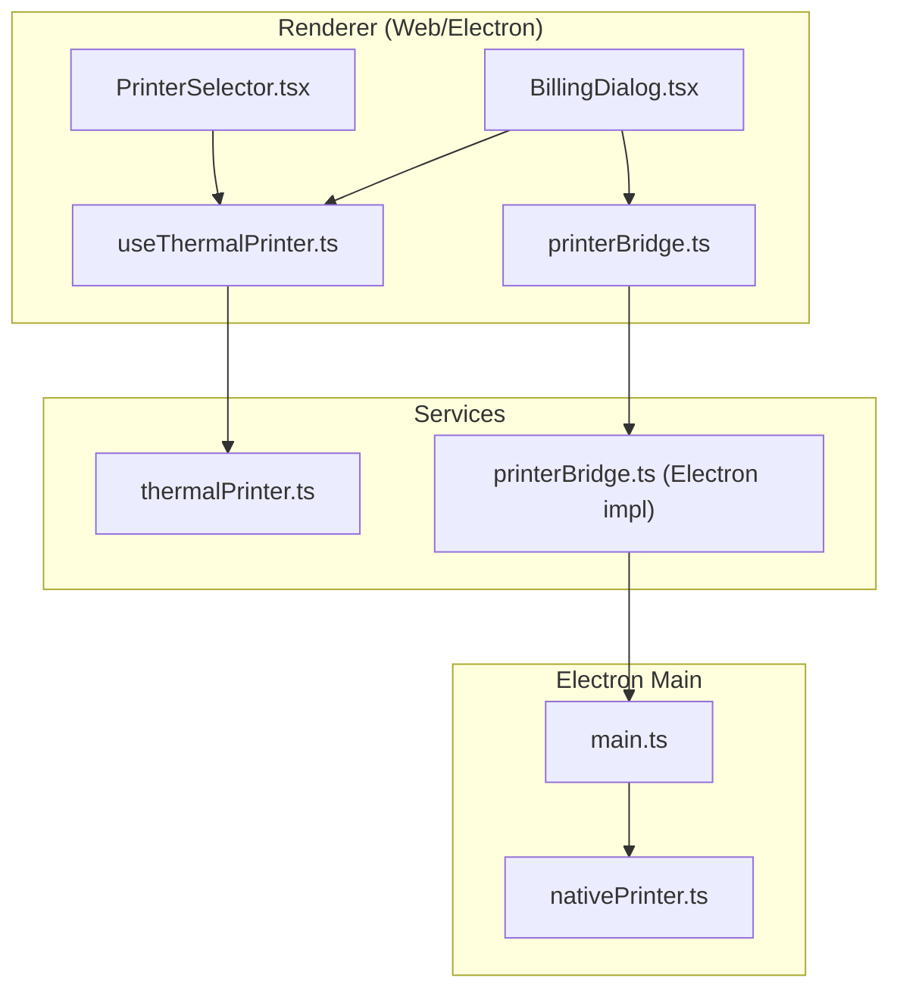
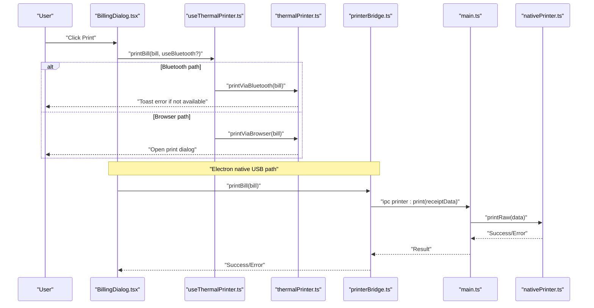
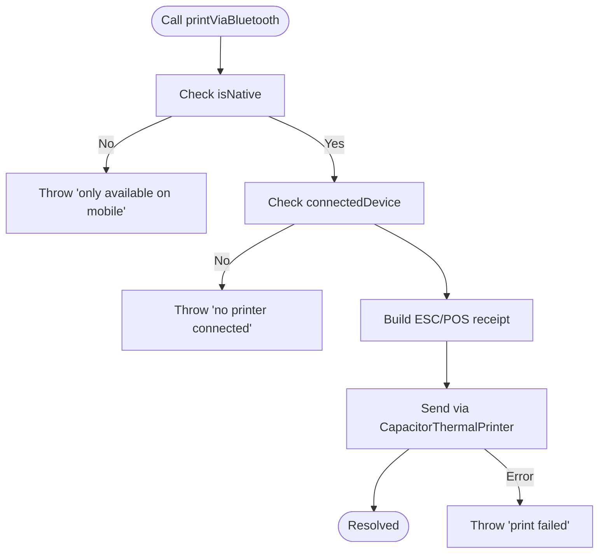
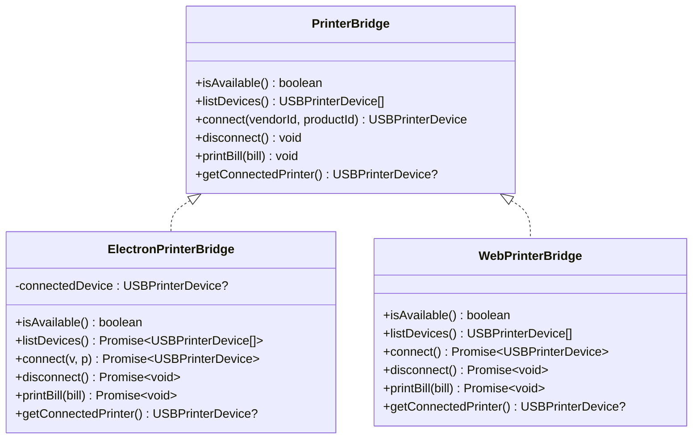
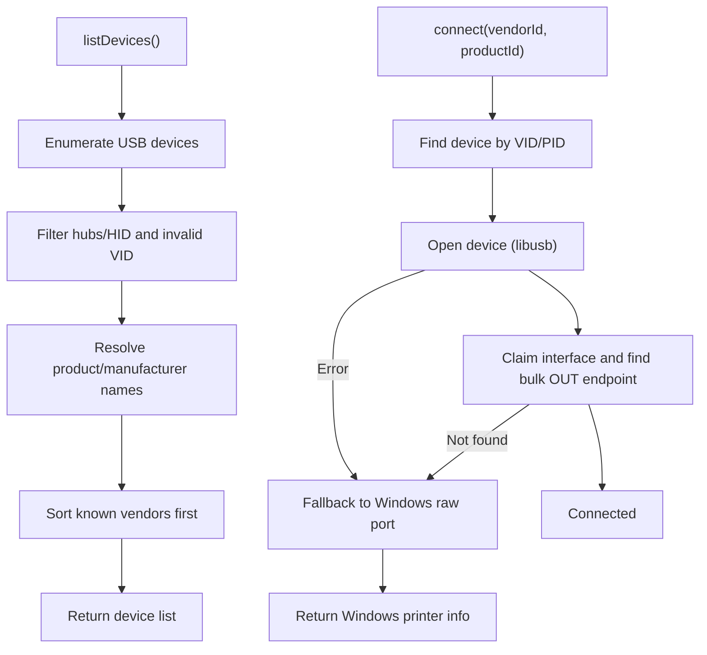
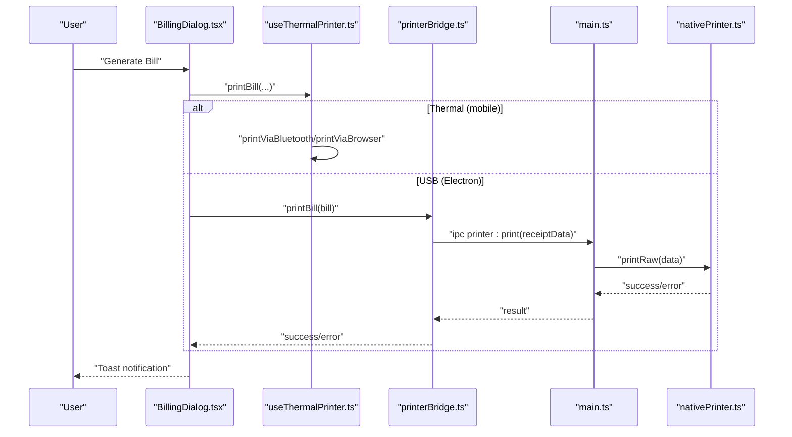
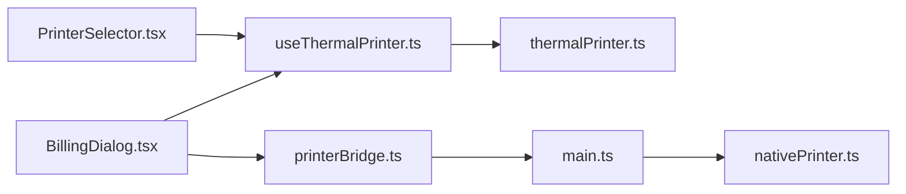

# Printer Troubleshooting & Diagnostics

<cite>
**Referenced Files in This Document**
- [thermalPrinter.ts](file://src/services/thermalPrinter.ts)
- [useThermalPrinter.ts](file://src/hooks/useThermalPrinter.ts)
- [PrinterSelector.tsx](file://src/components/PrinterSelector.tsx)
- [printerBridge.ts](file://src/services/printerBridge.ts)
- [nativePrinter.ts](file://electron/services/nativePrinter.ts)
- [main.ts](file://electron/main.ts)
- [BillingDialog.tsx](file://src/components/BillingDialog.tsx)
- [Orders.tsx](file://src/pages/dashboard/Orders.tsx)
- [use-toast.ts](file://src/hooks/use-toast.ts)
</cite>

## Table of Contents
1. [Introduction](#introduction)
2. [Project Structure](#project-structure)
3. [Core Components](#core-components)
4. [Architecture Overview](#architecture-overview)
5. [Detailed Component Analysis](#detailed-component-analysis)
6. [Dependency Analysis](#dependency-analysis)
7. [Performance Considerations](#performance-considerations)
8. [Troubleshooting Guide](#troubleshooting-guide)
9. [Conclusion](#conclusion)

## Introduction
This document provides comprehensive troubleshooting and diagnostics for printer integration across thermal printers (via Bluetooth), USB printers (via Electron native printing), and browser-native printing. It explains diagnostic procedures for connection failures, print quality issues, and device recognition problems, and covers error handling, logging strategies, and escalation paths. It also includes step-by-step guides for Bluetooth connectivity, driver installation, and printer configuration, along with platform-specific considerations and performance optimization techniques.

## Project Structure
The printer integration spans three environments:
- Web (Capacitor/React) for Bluetooth thermal printing
- Electron main process for native USB printing with Windows fallback
- Renderer process bridges and UI dialogs for user actions

**Diagram sources**
- [BillingDialog.tsx:131-148](file://src/components/BillingDialog.tsx#L131-L148)
- [PrinterSelector.tsx:16-58](file://src/components/PrinterSelector.tsx#L16-L58)
- [useThermalPrinter.ts:43-54](file://src/hooks/useThermalPrinter.ts#L43-L54)
- [printerBridge.ts:34-41](file://src/services/printerBridge.ts#L34-L41)
- [thermalPrinter.ts:118-219](file://src/services/thermalPrinter.ts#L118-L219)
- [printerBridge.ts:197-258](file://src/services/printerBridge.ts#L197-L258)
- [main.ts:52-124](file://electron/main.ts#L52-L124)
- [nativePrinter.ts:45-531](file://electron/services/nativePrinter.ts#L45-L531)

**Section sources**
- [thermalPrinter.ts:33-339](file://src/services/thermalPrinter.ts#L33-L339)
- [printerBridge.ts:1-289](file://src/services/printerBridge.ts#L1-L289)
- [nativePrinter.ts:1-542](file://electron/services/nativePrinter.ts#L1-L542)
- [main.ts:1-450](file://electron/main.ts#L1-L450)

## Core Components
- Thermal printer service (Bluetooth): Provides scanning, connection, disconnection, and Bluetooth printing for mobile platforms.
- USB printer bridge: Unified interface for Electron native printing and WebUSB fallback.
- Electron native printer service: Direct USB communication with Windows fallback to raw port printing.
- UI components: Printer selection dialogs and thermal printing hooks.

Key responsibilities:
- Platform detection and capability gating
- Device discovery and connection orchestration
- Print job construction and delivery
- Error propagation and user feedback

**Section sources**
- [thermalPrinter.ts:33-339](file://src/services/thermalPrinter.ts#L33-L339)
- [printerBridge.ts:197-258](file://src/services/printerBridge.ts#L197-L258)
- [nativePrinter.ts:45-531](file://electron/services/nativePrinter.ts#L45-L531)
- [useThermalPrinter.ts:4-68](file://src/hooks/useThermalPrinter.ts#L4-L68)
- [PrinterSelector.tsx:16-169](file://src/components/PrinterSelector.tsx#L16-L169)

## Architecture Overview
The system supports multiple printing pathways:
- Mobile: Bluetooth thermal printing via Capacitor plugin
- Desktop (Electron): Native USB printing with Windows raw port fallback
- Browser: HTML/CSS print via browser print dialog

**Diagram sources**
- [BillingDialog.tsx:131-148](file://src/components/BillingDialog.tsx#L131-L148)
- [useThermalPrinter.ts:43-54](file://src/hooks/useThermalPrinter.ts#L43-L54)
- [thermalPrinter.ts:118-219](file://src/services/thermalPrinter.ts#L118-L219)
- [thermalPrinter.ts:221-335](file://src/services/thermalPrinter.ts#L221-L335)
- [printerBridge.ts:242-253](file://src/services/printerBridge.ts#L242-L253)
- [main.ts:71-78](file://electron/main.ts#L71-L78)
- [nativePrinter.ts:429-450](file://electron/services/nativePrinter.ts#L429-L450)

## Detailed Component Analysis

### Thermal Printer Service (Bluetooth)
Handles mobile-only Bluetooth operations:
- Availability check for Bluetooth
- Device scanning with discovery listener and timeout
- Connection and disconnection
- Print job construction using ESC/POS commands
- Fallback to browser print on desktop

**Diagram sources**
- [thermalPrinter.ts:118-219](file://src/services/thermalPrinter.ts#L118-L219)

**Section sources**
- [thermalPrinter.ts:37-39](file://src/services/thermalPrinter.ts#L37-L39)
- [thermalPrinter.ts:41-87](file://src/services/thermalPrinter.ts#L41-L87)
- [thermalPrinter.ts:89-112](file://src/services/thermalPrinter.ts#L89-L112)
- [thermalPrinter.ts:118-219](file://src/services/thermalPrinter.ts#L118-L219)

### USB Printer Bridge (Electron)
Unified interface for native USB printing:
- Detects Electron vs Web environment
- Lists devices via Electron IPC
- Connects to a specific device (vendor/product)
- Prints raw ESC/POS data via IPC
- Disconnects and tracks connection state

**Diagram sources**
- [printerBridge.ts:188-195](file://src/services/printerBridge.ts#L188-L195)
- [printerBridge.ts:197-258](file://src/services/printerBridge.ts#L197-L258)
- [printerBridge.ts:260-286](file://src/services/printerBridge.ts#L260-L286)

**Section sources**
- [printerBridge.ts:197-258](file://src/services/printerBridge.ts#L197-L258)
- [printerBridge.ts:260-286](file://src/services/printerBridge.ts#L260-L286)

### Electron Native Printer Service
Direct USB communication with Windows fallback:
- Lists all USB devices and sorts by known vendor families
- Connects via libusb bulk endpoint or Windows raw port
- Finds matching Windows printer by VID/PID and switches printers
- Sends raw ESC/POS data via Windows spooler API

**Diagram sources**
- [nativePrinter.ts:56-96](file://electron/services/nativePrinter.ts#L56-L96)
- [nativePrinter.ts:101-201](file://electron/services/nativePrinter.ts#L101-L201)
- [nativePrinter.ts:207-229](file://electron/services/nativePrinter.ts#L207-L229)

**Section sources**
- [nativePrinter.ts:56-96](file://electron/services/nativePrinter.ts#L56-L96)
- [nativePrinter.ts:101-201](file://electron/services/nativePrinter.ts#L101-L201)
- [nativePrinter.ts:207-229](file://electron/services/nativePrinter.ts#L207-L229)

### UI Integration and Error Feedback
- Billing dialog orchestrates printing via thermal or USB paths
- Printer selector handles scanning, connecting, and disconnection
- Toast notifications surface errors and successes
- Orders page integrates printing into order lifecycle

**Diagram sources**
- [BillingDialog.tsx:131-148](file://src/components/BillingDialog.tsx#L131-L148)
- [useThermalPrinter.ts:43-54](file://src/hooks/useThermalPrinter.ts#L43-L54)
- [printerBridge.ts:242-253](file://src/services/printerBridge.ts#L242-L253)
- [main.ts:71-78](file://electron/main.ts#L71-L78)
- [nativePrinter.ts:429-450](file://electron/services/nativePrinter.ts#L429-L450)

**Section sources**
- [BillingDialog.tsx:131-148](file://src/components/BillingDialog.tsx#L131-L148)
- [PrinterSelector.tsx:30-58](file://src/components/PrinterSelector.tsx#L30-L58)
- [use-toast.ts:137-164](file://src/hooks/use-toast.ts#L137-L164)
- [Orders.tsx:490-530](file://src/pages/dashboard/Orders.tsx#L490-L530)

## Dependency Analysis
- Renderer depends on:
  - Thermal service for mobile Bluetooth printing
  - Printer bridge for unified USB printing
- Electron main depends on:
  - Native printer service for low-level USB operations
  - IPC handlers to expose printer APIs to renderer
- UI components depend on hooks and services for state and actions

**Diagram sources**
- [BillingDialog.tsx:82-83](file://src/components/BillingDialog.tsx#L82-L83)
- [useThermalPrinter.ts:4-10](file://src/hooks/useThermalPrinter.ts#L4-L10)
- [printerBridge.ts:26-31](file://src/services/printerBridge.ts#L26-L31)
- [thermalPrinter.ts:1-3](file://src/services/thermalPrinter.ts#L1-L3)
- [main.ts:14](file://electron/main.ts#L14)
- [nativePrinter.ts:1-2](file://electron/services/nativePrinter.ts#L1-L2)

**Section sources**
- [printerBridge.ts:26-31](file://src/services/printerBridge.ts#L26-L31)
- [main.ts:52-124](file://electron/main.ts#L52-L124)

## Performance Considerations
- Chunked USB transfers: Native printer sends data in chunks to avoid blocking and improve reliability.
- Minimal UI updates during long operations: Scrolling and loading states prevent redundant re-renders.
- Toast throttling: Limit concurrent toasts to reduce UI overhead.

Recommendations:
- Batch print jobs when possible to reduce USB handshakes.
- Use partial cuts and compact formatting to minimize paper usage.
- Cache device lists in Electron to avoid repeated enumeration.

**Section sources**
- [nativePrinter.ts:439-450](file://electron/services/nativePrinter.ts#L439-L450)
- [use-toast.ts:5-6](file://src/hooks/use-toast.ts#L5-L6)

## Troubleshooting Guide

### General Diagnostic Checklist
- Verify platform capabilities:
  - Bluetooth printing: mobile only
  - USB printing: Electron only
  - Browser printing: desktop/web
- Confirm device availability and permissions:
  - Bluetooth visibility and pairing
  - USB device connected and drivers installed
  - Windows printer driver and raw port access
- Review recent logs and toasts for error messages

### Bluetooth Thermal Printer (Mobile)
Symptoms:
- “Only available on mobile” message
- “No printer connected” during print
- “Failed to scan for Bluetooth printers”
- “Failed to connect to printer”
- “Failed to print via Bluetooth”

Diagnosis steps:
1. Confirm running on Capacitor mobile app (not web).
2. Ensure device scanning completes and devices appear.
3. Verify printer is paired and discoverable.
4. Attempt to connect; check for connection errors.
5. Attempt print; review toast for failure reasons.

Resolution tips:
- Re-scan and reconnect if discovery fails.
- Ensure printer battery is charged and within range.
- Clear cached device and retry connection.

**Section sources**
- [thermalPrinter.ts:37-39](file://src/services/thermalPrinter.ts#L37-L39)
- [thermalPrinter.ts:41-87](file://src/services/thermalPrinter.ts#L41-L87)
- [thermalPrinter.ts:89-112](file://src/services/thermalPrinter.ts#L89-L112)
- [thermalPrinter.ts:118-219](file://src/services/thermalPrinter.ts#L118-L219)
- [PrinterSelector.tsx:60-77](file://src/components/PrinterSelector.tsx#L60-L77)

### USB Printer (Electron)
Symptoms:
- “No printer connected.”
- “Failed to list devices.”
- “Cannot open printer.”
- “No bulk endpoint found.”
- “Failed to print.”

Diagnosis steps:
1. Ensure Electron app is running (not web).
2. List devices and select a specific printer (vendor/product).
3. If no bulk endpoint, verify WinUSB driver installation.
4. If driver missing, install using Zadig and retry.
5. If multiple Windows printers match, choose the correct one.

Resolution tips:
- Use “List Windows printers by VID/PID” to identify alternatives.
- Switch between Windows printers if needed.
- Disconnect and reconnect to refresh state.

**Section sources**
- [printerBridge.ts:205-214](file://src/services/printerBridge.ts#L205-L214)
- [printerBridge.ts:216-234](file://src/services/printerBridge.ts#L216-L234)
- [printerBridge.ts:242-253](file://src/services/printerBridge.ts#L242-L253)
- [nativePrinter.ts:101-201](file://electron/services/nativePrinter.ts#L101-L201)
- [nativePrinter.ts:207-229](file://electron/services/nativePrinter.ts#L207-L229)
- [nativePrinter.ts:365-417](file://electron/services/nativePrinter.ts#L365-L417)

### Browser Printing (Desktop/Web)
Symptoms:
- “Please allow popups to print the bill”
- Print dialog does not appear
- Blank or truncated receipts

Diagnosis steps:
1. Allow popups for the site.
2. Verify browser print dialog opens and printer is selected.
3. Check print margins and scaling.
4. Test with a simple HTML page to isolate issues.

Resolution tips:
- Disable ad blockers or popup blockers temporarily.
- Adjust browser print settings (margins, headers/footers).
- Use a dedicated thermal emulation font if needed.

**Section sources**
- [thermalPrinter.ts:221-335](file://src/services/thermalPrinter.ts#L221-L335)

### Logging and Error Handling Strategies
- Centralized error throwing with descriptive messages
- Toast notifications for immediate user feedback
- Console logging in Electron main and native printer service
- IPC result wrapping with success/error fields

Recommended practices:
- Log before and after critical operations (scan/connect/print).
- Capture stack traces for unhandled exceptions.
- Persist minimal logs for support escalation.

**Section sources**
- [thermalPrinter.ts:98-99](file://src/services/thermalPrinter.ts#L98-L99)
- [thermalPrinter.ts:215-218](file://src/services/thermalPrinter.ts#L215-L218)
- [nativePrinter.ts:113-121](file://electron/services/nativePrinter.ts#L113-L121)
- [nativePrinter.ts:455-508](file://electron/services/nativePrinter.ts#L455-L508)
- [main.ts:54-59](file://electron/main.ts#L54-L59)
- [use-toast.ts:137-164](file://src/hooks/use-toast.ts#L137-L164)

### Step-by-Step Guides

#### Bluetooth Connectivity (Mobile)
1. Open Printer Selector dialog.
2. Tap “Scan for Printers.”
3. Wait for device list; select the desired printer.
4. Confirm connection success via toast.
5. Generate a test bill to verify printing.

Common fixes:
- Re-scan if no devices found.
- Ensure printer is powered and paired.
- Retry connection after clearing cache.

**Section sources**
- [PrinterSelector.tsx:30-58](file://src/components/PrinterSelector.tsx#L30-L58)
- [useThermalPrinter.ts:17-26](file://src/hooks/useThermalPrinter.ts#L17-L26)
- [thermalPrinter.ts:41-87](file://src/services/thermalPrinter.ts#L41-L87)

#### Driver Installation (Windows USB)
1. Connect the thermal printer via USB.
2. If “No bulk endpoint found,” install WinUSB driver using Zadig.
3. Reconnect the device and retry.
4. Optionally, install a generic text-only driver for raw printing.

Verification:
- Use “List Windows printers by VID/PID” to confirm matches.
- Switch printers if multiple options exist.

**Section sources**
- [nativePrinter.ts:113-121](file://electron/services/nativePrinter.ts#L113-L121)
- [nativePrinter.ts:207-229](file://electron/services/nativePrinter.ts#L207-L229)
- [nativePrinter.ts:365-417](file://electron/services/nativePrinter.ts#L365-L417)

#### Printer Configuration (Electron)
1. Open Billing dialog and select “USB.”
2. Choose “Refresh Devices” to list available printers.
3. Select a specific device (vendor/product).
4. If multiple Windows printers match, choose the correct one.
5. Print a test receipt and verify cut/partial cut.

**Section sources**
- [BillingDialog.tsx:90-96](file://src/components/BillingDialog.tsx#L90-L96)
- [printerBridge.ts:205-214](file://src/services/printerBridge.ts#L205-L214)
- [printerBridge.ts:216-234](file://src/services/printerBridge.ts#L216-L234)

### Platform-Specific Issues
- Mobile (Capacitor):
  - Bluetooth availability gated to native platforms.
  - Popups may block browser print fallback.
- Electron:
  - Requires explicit device selection.
  - Windows raw port fallback for unsupported devices.
  - Multiple Windows printers may match the same VID/PID.
- Web:
  - Popup permissions required for print dialog.
  - Limited to browser print capabilities.

**Section sources**
- [thermalPrinter.ts:37-39](file://src/services/thermalPrinter.ts#L37-L39)
- [thermalPrinter.ts:221-335](file://src/services/thermalPrinter.ts#L221-L335)
- [nativePrinter.ts:207-229](file://electron/services/nativePrinter.ts#L207-L229)

### Escalation Procedures
- Collect logs:
  - Renderer: copy toast messages and console logs.
  - Electron main: capture IPC handler results.
  - Native printer: note VID/PID and Windows printer name.
- Reproduce with minimal steps and attach screenshots.
- Provide OS version, printer model, and driver details.

**Section sources**
- [main.ts:54-59](file://electron/main.ts#L54-L59)
- [nativePrinter.ts:234-267](file://electron/services/nativePrinter.ts#L234-L267)

### Preventive Maintenance and Monitoring
- Regularly refresh device lists in Electron.
- Monitor toast-based error trends.
- Keep drivers updated; test with Zadig when necessary.
- Validate print jobs after OS updates.

**Section sources**
- [printerBridge.ts:205-214](file://src/services/printerBridge.ts#L205-L214)
- [use-toast.ts:137-164](file://src/hooks/use-toast.ts#L137-L164)

## Conclusion
This guide consolidates printer troubleshooting across thermal Bluetooth, USB native printing, and browser printing. By following the diagnostic procedures, understanding platform limitations, and leveraging the provided logging and escalation strategies, most integration issues can be resolved quickly. Regular maintenance and monitoring will help sustain reliable printing performance in production environments.