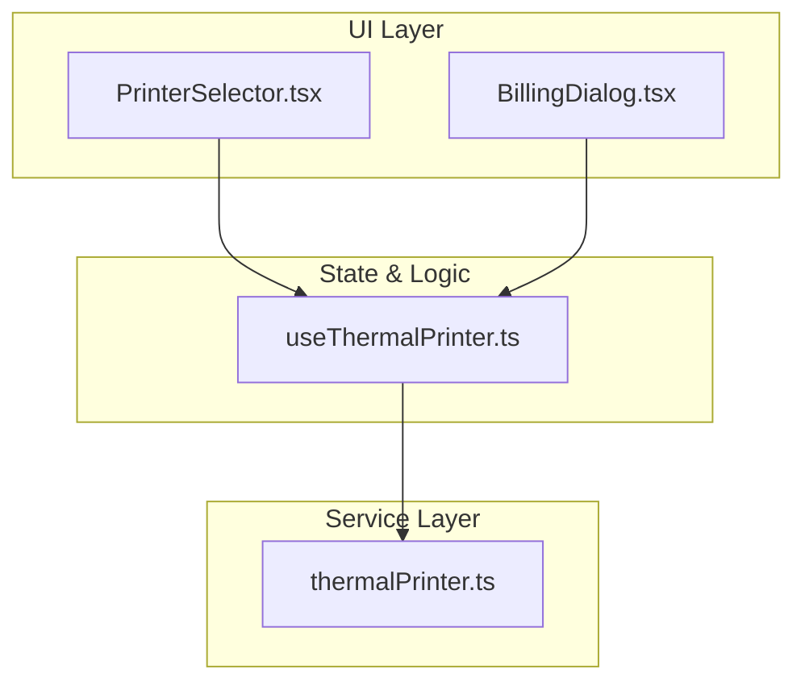
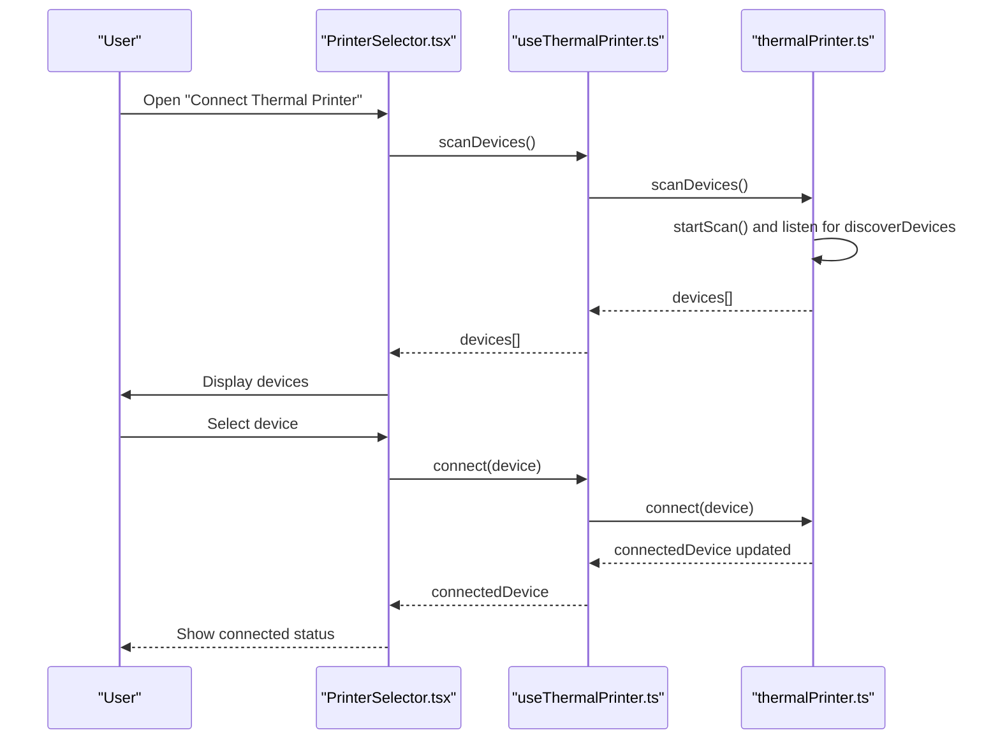
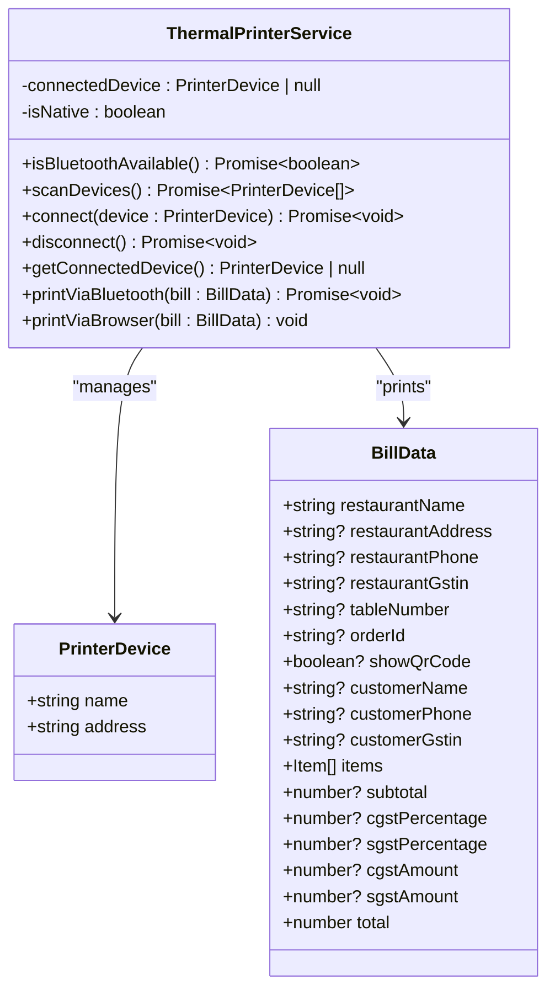
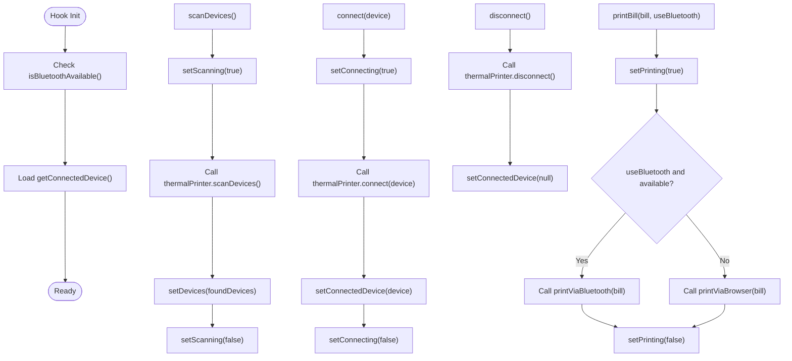
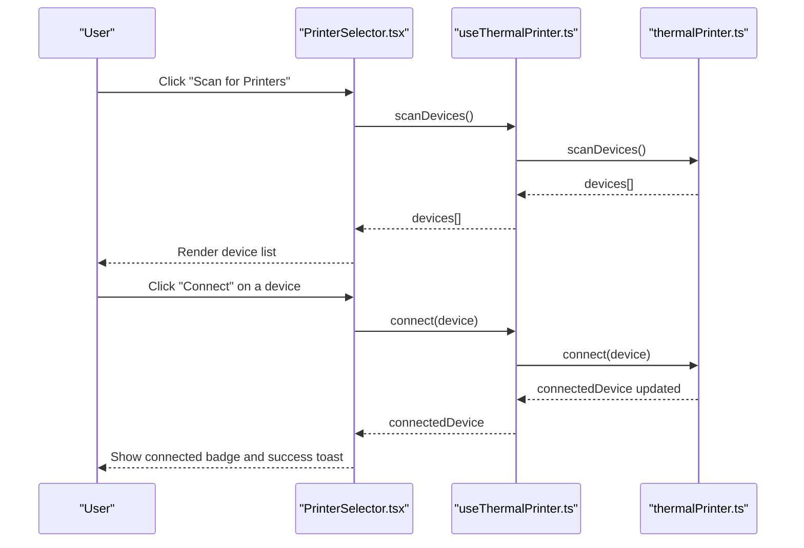
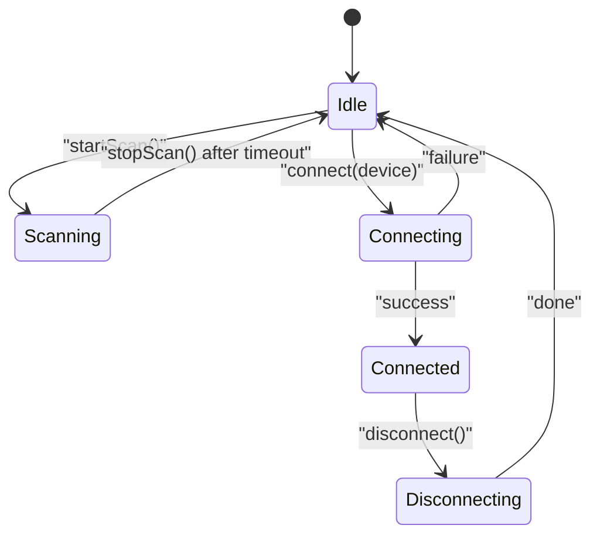

# Thermal Printer Setup & Configuration

<cite>
**Referenced Files in This Document**
- [thermalPrinter.ts](file://src/services/thermalPrinter.ts)
- [useThermalPrinter.ts](file://src/hooks/useThermalPrinter.ts)
- [PrinterSelector.tsx](file://src/components/PrinterSelector.tsx)
- [BillingDialog.tsx](file://src/components/BillingDialog.tsx)
- [Settings.tsx](file://src/pages/dashboard/Settings.tsx)
- [package.json](file://package.json)
</cite>

## Table of Contents
1. [Introduction](#introduction)
2. [Project Structure](#project-structure)
3. [Core Components](#core-components)
4. [Architecture Overview](#architecture-overview)
5. [Detailed Component Analysis](#detailed-component-analysis)
6. [Dependency Analysis](#dependency-analysis)
7. [Performance Considerations](#performance-considerations)
8. [Troubleshooting Guide](#troubleshooting-guide)
9. [Conclusion](#conclusion)
10. [Appendices](#appendices)

## Introduction
This document explains how to set up and configure thermal printers in TableFlow Pro, focusing on the Bluetooth thermal printer service, device discovery, connection management, and the PrinterSelector component. It covers the PrinterDevice interface, connection lifecycle, device scanning procedures, and how to manage multiple printer devices. It also provides step-by-step setup instructions for connecting thermal printers via Bluetooth, configuring printer preferences, and managing printer state. Practical examples demonstrate printer initialization, device enumeration, and connection verification processes.

## Project Structure
The thermal printer functionality is implemented as a service with a React hook and a selector UI component:
- Service: Provides Bluetooth device scanning, connection, disconnection, and printing capabilities.
- Hook: Exposes state and actions for scanning, connecting, disconnecting, and printing.
- UI: A modal dialog that lists discovered devices and manages connections.

**Diagram sources**
- [PrinterSelector.tsx:16-169](file://src/components/PrinterSelector.tsx#L16-L169)
- [useThermalPrinter.ts:4-68](file://src/hooks/useThermalPrinter.ts#L4-L68)
- [thermalPrinter.ts:33-339](file://src/services/thermalPrinter.ts#L33-L339)

**Section sources**
- [thermalPrinter.ts:1-339](file://src/services/thermalPrinter.ts#L1-L339)
- [useThermalPrinter.ts:1-69](file://src/hooks/useThermalPrinter.ts#L1-L69)
- [PrinterSelector.tsx:1-169](file://src/components/PrinterSelector.tsx#L1-L169)

## Core Components
- PrinterDevice interface: Represents a discovered Bluetooth printer with a name and address.
- ThermalPrinterService: Encapsulates Bluetooth scanning, connection, disconnection, and printing logic.
- useThermalPrinter hook: Manages UI state and exposes actions for device operations.
- PrinterSelector component: Presents a dialog to scan, select, connect, and disconnect Bluetooth printers.

Key responsibilities:
- Device discovery: Starts a timed scan and aggregates discovered devices.
- Connection lifecycle: Connects to a selected device and tracks the currently connected device.
- Printing: Builds a receipt using ESC/POS commands for Bluetooth or generates HTML for browser printing.

**Section sources**
- [thermalPrinter.ts:4-339](file://src/services/thermalPrinter.ts#L4-L339)
- [useThermalPrinter.ts:4-68](file://src/hooks/useThermalPrinter.ts#L4-L68)
- [PrinterSelector.tsx:16-169](file://src/components/PrinterSelector.tsx#L16-L169)

## Architecture Overview
The system follows a layered architecture:
- UI layer: Components render the printer selector and trigger actions.
- State & logic layer: Hook centralizes state and orchestrates service calls.
- Service layer: Implements platform-specific Bluetooth operations via a Capacitor plugin.

**Diagram sources**
- [PrinterSelector.tsx:30-58](file://src/components/PrinterSelector.tsx#L30-L58)
- [useThermalPrinter.ts:17-41](file://src/hooks/useThermalPrinter.ts#L17-L41)
- [thermalPrinter.ts:41-112](file://src/services/thermalPrinter.ts#L41-L112)

## Detailed Component Analysis

### ThermalPrinterService
Implements the Bluetooth printer service with the following capabilities:
- PrinterDevice interface: name and address.
- BillData interface: receipt payload including restaurant info, customer info, items, taxes, and totals.
- isBluetoothAvailable: checks native platform support.
- scanDevices: starts a 5-second scan, collects devices, and stops scanning.
- connect: connects to a selected device and updates the internal connected device.
- disconnect: disconnects the current device.
- getConnectedDevice: returns the currently connected device.
- printViaBluetooth: builds an ESC/POS receipt and prints via the native plugin.
- printViaBrowser: generates an HTML receipt and triggers browser print.

**Diagram sources**
- [thermalPrinter.ts:4-339](file://src/services/thermalPrinter.ts#L4-L339)

**Section sources**
- [thermalPrinter.ts:33-339](file://src/services/thermalPrinter.ts#L33-L339)

### useThermalPrinter Hook
Provides UI state and actions:
- State: scanning, devices, connectedDevice, connecting, printing, isBluetoothAvailable.
- Actions: scanDevices, connect, disconnect, printBill.
- Side effects: initializes availability and connected device on mount.

**Diagram sources**
- [useThermalPrinter.ts:4-68](file://src/hooks/useThermalPrinter.ts#L4-L68)

**Section sources**
- [useThermalPrinter.ts:4-68](file://src/hooks/useThermalPrinter.ts#L4-L68)

### PrinterSelector Component
Renders a modal dialog for Bluetooth printer management:
- Shows current connection status and a disconnect action.
- Provides a scan button that triggers device discovery.
- Lists discovered devices with connect buttons.
- Handles connectivity states (scanning, connecting) and displays loading indicators.
- Shows a message when Bluetooth is unavailable (desktop).

**Diagram sources**
- [PrinterSelector.tsx:30-58](file://src/components/PrinterSelector.tsx#L30-L58)
- [useThermalPrinter.ts:17-41](file://src/hooks/useThermalPrinter.ts#L17-L41)
- [thermalPrinter.ts:89-112](file://src/services/thermalPrinter.ts#L89-L112)

**Section sources**
- [PrinterSelector.tsx:16-169](file://src/components/PrinterSelector.tsx#L16-L169)

### PrinterDevice Interface and Connection Lifecycle
- PrinterDevice: Minimal interface with name and address for identification.
- Connection lifecycle:
  - Discovery: scanDevices initiates a 5-second scan and aggregates unique devices.
  - Connection: connect stores the selected device as connected.
  - Disconnection: disconnect clears the stored device.
  - Printing: printViaBluetooth validates connection and sends ESC/POS commands.

**Diagram sources**
- [thermalPrinter.ts:41-112](file://src/services/thermalPrinter.ts#L41-L112)

**Section sources**
- [thermalPrinter.ts:4-112](file://src/services/thermalPrinter.ts#L4-L112)

### Printer Selection and State Management
- PrinterSelector displays the connected device and allows disconnect.
- It disables actions during scanning/connecting to prevent race conditions.
- Toast notifications inform users of success or failure.

**Section sources**
- [PrinterSelector.tsx:93-104](file://src/components/PrinterSelector.tsx#L93-L104)
- [PrinterSelector.tsx:106-164](file://src/components/PrinterSelector.tsx#L106-L164)

## Dependency Analysis
External dependencies relevant to thermal printing:
- @capacitor/core: Cross-platform runtime.
- capacitor-thermal-printer: Native Bluetooth thermal printer plugin.

These dependencies enable:
- Platform detection (native vs web).
- Bluetooth device discovery and connection.
- ESC/POS printing on mobile platforms.

**Section sources**
- [package.json:17-78](file://package.json#L17-L78)

## Performance Considerations
- Scan timeout: The service enforces a fixed 5-second scan duration to avoid indefinite discovery loops.
- Debouncing actions: The hook prevents overlapping scans and connections by tracking state flags.
- Minimal UI updates: The selector renders only visible changes (connected badge, loader icons).

## Troubleshooting Guide
Common setup issues and resolutions:
- Bluetooth not available on desktop:
  - Symptom: Dialog indicates Bluetooth printing is only for mobile.
  - Resolution: Use browser print for receipts on desktop.
- No devices found during scan:
  - Ensure the thermal printer is powered on and discoverable.
  - Move closer to the device; interference may reduce visibility.
  - Retry scanning; the service stops after 5 seconds.
- Connection fails:
  - Verify the device is not paired with another host.
  - Re-scan and select the device again.
  - Ensure the app has necessary permissions on mobile.
- Printing fails:
  - Confirm a device is connected before printing.
  - Check for plugin errors; the service logs and throws descriptive messages.
- Browser print issues:
  - Allow popups for the receipt window.
  - Ensure the browser supports the print dialog.

**Section sources**
- [PrinterSelector.tsx:60-77](file://src/components/PrinterSelector.tsx#L60-L77)
- [thermalPrinter.ts:37-44](file://src/services/thermalPrinter.ts#L37-L44)
- [thermalPrinter.ts:89-101](file://src/services/thermalPrinter.ts#L89-L101)
- [thermalPrinter.ts:118-125](file://src/services/thermalPrinter.ts#L118-L125)
- [thermalPrinter.ts:221-243](file://src/services/thermalPrinter.ts#L221-L243)

## Conclusion
TableFlow Pro’s thermal printer setup centers around a clean separation of concerns: a service for Bluetooth operations, a hook for state orchestration, and a selector UI for device management. The system supports device discovery, connection, and printing with clear feedback and error handling. For optimal results, ensure the device is discoverable, connect via the selector, and use browser print on non-native platforms.

## Appendices

### Step-by-Step Setup Instructions: Bluetooth Thermal Printer
1. Open the Printer Selector dialog from the UI.
2. Tap “Scan for Printers” to initiate a 5-second discovery.
3. Review the list of discovered devices and tap “Connect” for the desired printer.
4. After successful connection, the UI shows the connected device and a disconnect option.
5. To print a receipt, trigger the print action from the billing flow; the system will use Bluetooth if available, otherwise fall back to browser print.

Verification steps:
- Confirm the device appears in the scanned list.
- Verify the connected badge and success toast after connecting.
- Attempt a test print and confirm the receipt is sent to the device.

**Section sources**
- [PrinterSelector.tsx:30-58](file://src/components/PrinterSelector.tsx#L30-L58)
- [useThermalPrinter.ts:17-41](file://src/hooks/useThermalPrinter.ts#L17-L41)
- [thermalPrinter.ts:41-112](file://src/services/thermalPrinter.ts#L41-L112)

### Printer Preferences and Configuration
- QR code printing:
  - Toggle “Print QR Code on Bill” in Settings to include an Order ID QR code on receipts.
  - This setting influences the BillData passed to the printer service.

**Section sources**
- [Settings.tsx:267-279](file://src/pages/dashboard/Settings.tsx#L267-L279)

### Practical Examples
- Printer initialization:
  - The hook initializes availability and connected device on mount.
  - Example path: [useThermalPrinter.ts:12-15](file://src/hooks/useThermalPrinter.ts#L12-L15)
- Device enumeration:
  - The service scans devices and aggregates unique entries.
  - Example path: [thermalPrinter.ts:46-86](file://src/services/thermalPrinter.ts#L46-L86)
- Connection verification:
  - The service validates a connection before printing.
  - Example path: [thermalPrinter.ts:123-125](file://src/services/thermalPrinter.ts#L123-L125)