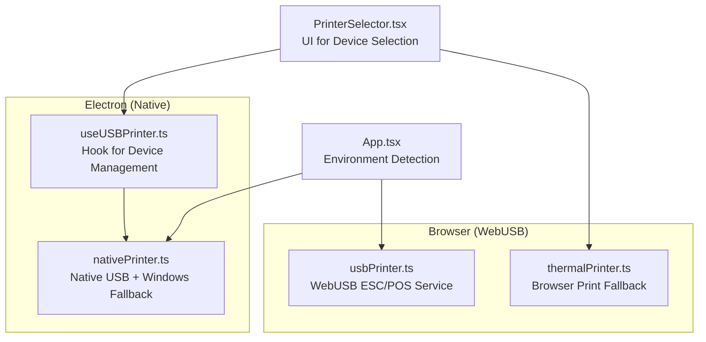
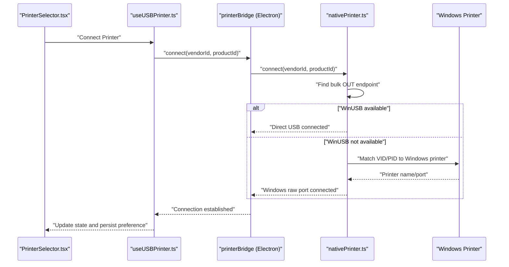
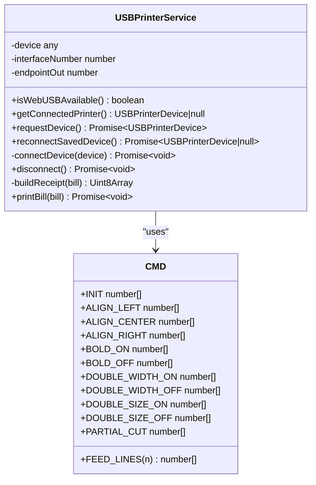
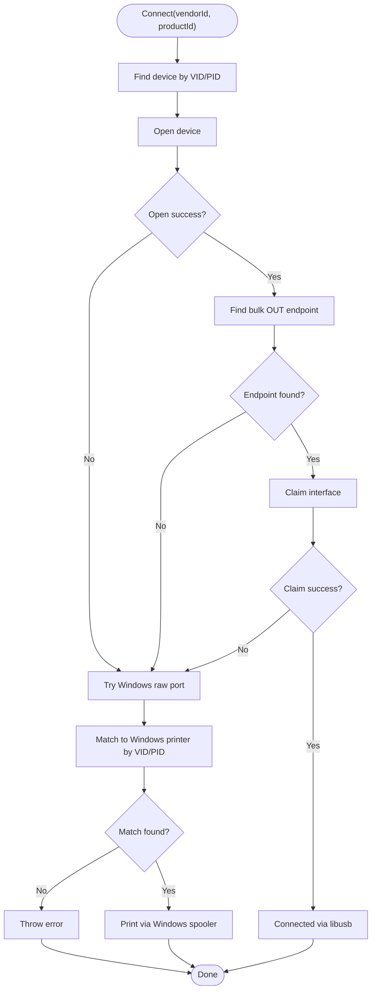
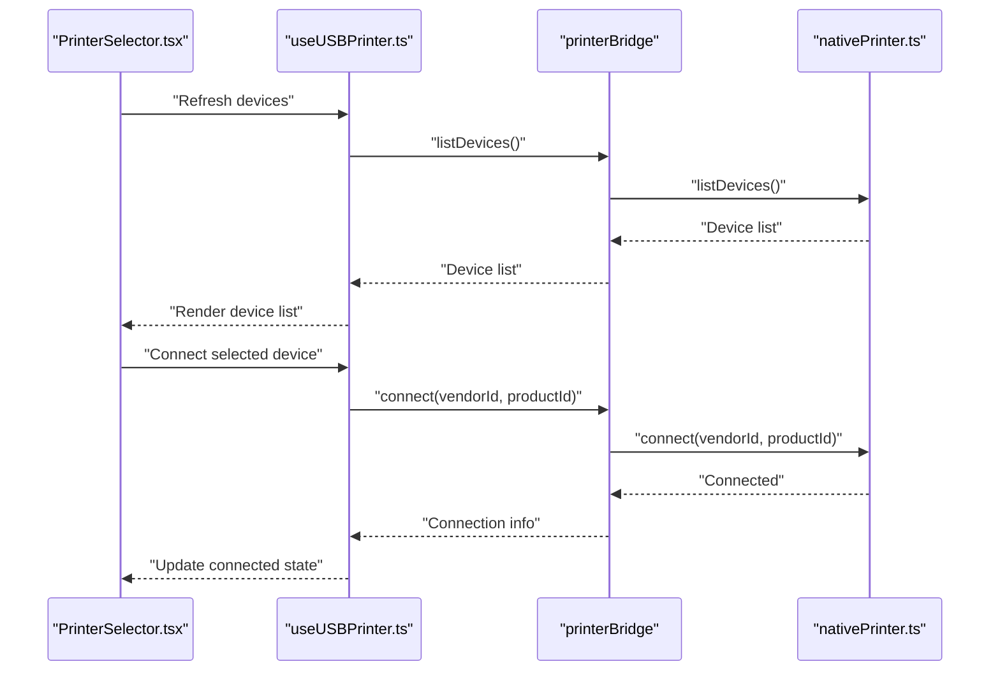
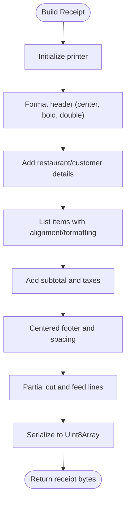
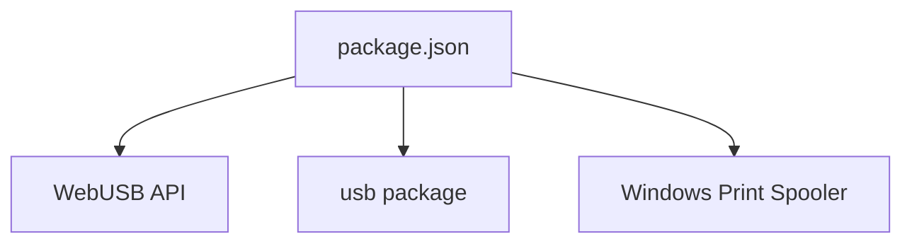

# USB Printer Integration

<cite>
**Referenced Files in This Document**
- [usbPrinter.ts](file://src/services/usbPrinter.ts)
- [nativePrinter.ts](file://electron/services/nativePrinter.ts)
- [thermalPrinter.ts](file://src/services/thermalPrinter.ts)
- [useUSBPrinter.ts](file://src/hooks/useUSBPrinter.ts)
- [useThermalPrinter.ts](file://src/hooks/useThermalPrinter.ts)
- [PrinterSelector.tsx](file://src/components/PrinterSelector.tsx)
- [package.json](file://package.json)
- [App.tsx](file://src/App.tsx)
</cite>

## Table of Contents
1. [Introduction](#introduction)
2. [Project Structure](#project-structure)
3. [Core Components](#core-components)
4. [Architecture Overview](#architecture-overview)
5. [Detailed Component Analysis](#detailed-component-analysis)
6. [Dependency Analysis](#dependency-analysis)
7. [Performance Considerations](#performance-considerations)
8. [Troubleshooting Guide](#troubleshooting-guide)
9. [Conclusion](#conclusion)
10. [Appendices](#appendices)

## Introduction
This document explains the USB printer integration capabilities of the project, focusing on the WebUSB and native Electron printer services, device detection, connection protocols, and user-facing components. It covers the service architecture, supported printer models, platform-specific considerations for Windows, macOS, and Linux, and provides setup and troubleshooting guidance.

## Project Structure
The USB printer integration spans three primary areas:
- WebUSB service for browser-based ESC/POS printing
- Native Electron service for direct USB and Windows fallback printing
- React hooks and UI components for device management and printing

**Diagram sources**
- [usbPrinter.ts:1-317](file://src/services/usbPrinter.ts#L1-L317)
- [nativePrinter.ts:1-542](file://electron/services/nativePrinter.ts#L1-L542)
- [thermalPrinter.ts:1-339](file://src/services/thermalPrinter.ts#L1-L339)
- [useUSBPrinter.ts:1-112](file://src/hooks/useUSBPrinter.ts#L1-L112)
- [PrinterSelector.tsx:1-169](file://src/components/PrinterSelector.tsx#L1-L169)
- [App.tsx:32-34](file://src/App.tsx#L32-L34)

**Section sources**
- [usbPrinter.ts:1-317](file://src/services/usbPrinter.ts#L1-L317)
- [nativePrinter.ts:1-542](file://electron/services/nativePrinter.ts#L1-L542)
- [thermalPrinter.ts:1-339](file://src/services/thermalPrinter.ts#L1-L339)
- [useUSBPrinter.ts:1-112](file://src/hooks/useUSBPrinter.ts#L1-L112)
- [PrinterSelector.tsx:1-169](file://src/components/PrinterSelector.tsx#L1-L169)
- [App.tsx:32-34](file://src/App.tsx#L32-L34)

## Core Components
- WebUSB ESC/POS Service: Handles device selection, interface claiming, and raw ESC/POS printing via the browser’s WebUSB API.
- Native Electron Printer Service: Manages direct USB communication and Windows raw port fallback with robust printer discovery and driver matching.
- React Hooks: Provide device enumeration, connection state, and printing orchestration for both browser and Electron contexts.
- UI Component: Presents device lists, connection status, and actions to the user.

Key responsibilities:
- Device detection and filtering (vendor/class-based)
- Endpoint discovery and interface claiming
- ESC/POS receipt building and chunked transfer
- Windows printer name resolution and raw spooler printing
- Auto-reconnection and persisted device preferences

**Section sources**
- [usbPrinter.ts:71-317](file://src/services/usbPrinter.ts#L71-L317)
- [nativePrinter.ts:45-531](file://electron/services/nativePrinter.ts#L45-L531)
- [useUSBPrinter.ts:19-112](file://src/hooks/useUSBPrinter.ts#L19-L112)
- [thermalPrinter.ts:33-339](file://src/services/thermalPrinter.ts#L33-L339)

## Architecture Overview
The system supports two primary paths:
- Browser path: WebUSB-based ESC/POS printing with vendor/class filters and bulk OUT endpoint targeting.
- Electron path: Native USB access with automatic driver fallback to Windows raw spooler printing.

**Diagram sources**
- [PrinterSelector.tsx:38-58](file://src/components/PrinterSelector.tsx#L38-L58)
- [useUSBPrinter.ts:72-83](file://src/hooks/useUSBPrinter.ts#L72-L83)
- [nativePrinter.ts:101-201](file://electron/services/nativePrinter.ts#L101-L201)
- [nativePrinter.ts:207-229](file://electron/services/nativePrinter.ts#L207-L229)

## Detailed Component Analysis

### WebUSB ESC/POS Service
The WebUSB service targets ESC/POS-compatible thermal printers via the browser’s WebUSB API. It:
- Defines ESC/POS command constants for initialization, alignment, bold, double-width/double-size, partial cut, and feed lines.
- Maintains vendor and class-based filters to discover supported printers.
- Opens a device, selects configuration, claims an interface, finds a bulk OUT endpoint, and transfers ESC/POS data in chunks.
- Provides a method to rebuild receipts from bill data and print via the connected device.

**Diagram sources**
- [usbPrinter.ts:71-317](file://src/services/usbPrinter.ts#L71-L317)

**Section sources**
- [usbPrinter.ts:6-24](file://src/services/usbPrinter.ts#L6-L24)
- [usbPrinter.ts:28-58](file://src/services/usbPrinter.ts#L28-L58)
- [usbPrinter.ts:89-124](file://src/services/usbPrinter.ts#L89-L124)
- [usbPrinter.ts:146-190](file://src/services/usbPrinter.ts#L146-L190)
- [usbPrinter.ts:206-293](file://src/services/usbPrinter.ts#L206-L293)
- [usbPrinter.ts:295-313](file://src/services/usbPrinter.ts#L295-L313)

### Native Electron Printer Service
The native service manages:
- Listing all USB devices and filtering out hubs and HID devices.
- Connecting via libusb when possible; otherwise falling back to Windows raw port printing.
- Matching a USB device to a Windows printer by VID/PID and driver characteristics.
- Sending raw ESC/POS data via direct USB or Windows spooler.

**Diagram sources**
- [nativePrinter.ts:101-201](file://electron/services/nativePrinter.ts#L101-L201)
- [nativePrinter.ts:207-229](file://electron/services/nativePrinter.ts#L207-L229)
- [nativePrinter.ts:234-325](file://electron/services/nativePrinter.ts#L234-L325)

**Section sources**
- [nativePrinter.ts:56-96](file://electron/services/nativePrinter.ts#L56-L96)
- [nativePrinter.ts:101-201](file://electron/services/nativePrinter.ts#L101-L201)
- [nativePrinter.ts:207-325](file://electron/services/nativePrinter.ts#L207-L325)
- [nativePrinter.ts:429-450](file://electron/services/nativePrinter.ts#L429-L450)
- [nativePrinter.ts:455-509](file://electron/services/nativePrinter.ts#L455-L509)

### React Hooks and UI Integration
- useUSBPrinter: Orchestrates device enumeration, connection, disconnection, and printing for Electron. It auto-restores previously connected devices and persists selections.
- useThermalPrinter: Manages Bluetooth scanning and printing for mobile (Capacitor). It also exposes browser printing fallback for desktop.
- PrinterSelector: Presents device lists, connection status, and actions to the user.

**Diagram sources**
- [useUSBPrinter.ts:63-70](file://src/hooks/useUSBPrinter.ts#L63-L70)
- [useUSBPrinter.ts:72-83](file://src/hooks/useUSBPrinter.ts#L72-L83)
- [PrinterSelector.tsx:30-58](file://src/components/PrinterSelector.tsx#L30-L58)

**Section sources**
- [useUSBPrinter.ts:19-112](file://src/hooks/useUSBPrinter.ts#L19-L112)
- [useThermalPrinter.ts:4-68](file://src/hooks/useThermalPrinter.ts#L4-L68)
- [PrinterSelector.tsx:16-169](file://src/components/PrinterSelector.tsx#L16-L169)

### ESC/POS Receipt Building
The service constructs ESC/POS receipts from bill data, applying formatting commands and cutting/partial-cut actions. The resulting byte stream is transferred in chunks to the printer.

**Diagram sources**
- [usbPrinter.ts:206-293](file://src/services/usbPrinter.ts#L206-L293)

**Section sources**
- [usbPrinter.ts:206-293](file://src/services/usbPrinter.ts#L206-L293)

## Dependency Analysis
External dependencies relevant to printer integration:
- WebUSB: Provided by the browser; the service checks availability and uses navigator.usb.
- Electron USB: The native service uses the 'usb' package for direct device access.
- Windows raw spooler: PowerShell-based printing via winspool.drv for Windows fallback.

**Diagram sources**
- [package.json:74](file://package.json#L74)
- [nativePrinter.ts:4](file://electron/services/nativePrinter.ts#L4)

**Section sources**
- [package.json:74](file://package.json#L74)
- [usbPrinter.ts:76-78](file://src/services/usbPrinter.ts#L76-L78)
- [nativePrinter.ts:4](file://electron/services/nativePrinter.ts#L4)

## Performance Considerations
- Chunked transfers: ESC/POS data is sent in fixed-size chunks to avoid buffer limitations and improve reliability.
- Endpoint selection: Bulk OUT endpoints are prioritized for efficient data transfer.
- Auto-reconnection: Saved device preferences reduce repeated device selection overhead.
- Windows fallback: Raw spooler printing avoids USB driver issues but may introduce latency.

[No sources needed since this section provides general guidance]

## Troubleshooting Guide
Common issues and resolutions:
- WebUSB not available: Ensure using a compatible browser (Chrome/Edge) and that the site is served securely.
- No printer selected: Confirm device selection in the browser prompt and retry with vendor/class filters.
- Access denied or printer not found: Verify physical connection and permissions; reconnect the device.
- Could not find printer endpoint: Confirm the device is ESC/POS-compatible and exposes a bulk OUT endpoint.
- Windows driver conflicts: Install WinUSB driver using Zadig; ensure a matching Windows printer exists.
- Windows printer not found: Verify the printer driver is installed and matches the USB VID/PID; use Windows raw port fallback.
- Print failures: Retry connection, check device power/cables, and confirm the printer is not out of paper.

**Section sources**
- [usbPrinter.ts:91-93](file://src/services/usbPrinter.ts#L91-L93)
- [usbPrinter.ts:105-123](file://src/services/usbPrinter.ts#L105-L123)
- [usbPrinter.ts:150-152](file://src/services/usbPrinter.ts#L150-L152)
- [usbPrinter.ts:179-181](file://src/services/usbPrinter.ts#L179-L181)
- [nativePrinter.ts:114-121](file://electron/services/nativePrinter.ts#L114-L121)
- [nativePrinter.ts:208-218](file://electron/services/nativePrinter.ts#L208-L218)
- [nativePrinter.ts:213-218](file://electron/services/nativePrinter.ts#L213-L218)
- [nativePrinter.ts:455-509](file://electron/services/nativePrinter.ts#L455-L509)

## Conclusion
The project integrates USB printer support through a dual-path architecture: WebUSB for browsers and native Electron for desktop applications with Windows raw port fallback. The system provides robust device detection, connection management, and ESC/POS printing with clear fallback mechanisms and user-friendly device selection.

[No sources needed since this section summarizes without analyzing specific files]

## Appendices

### Supported Printer Models and Compatibility Matrix
The WebUSB service recognizes a broad set of vendor IDs commonly associated with ESC/POS thermal printers. The native service includes an extended vendor set and attempts driver fallbacks.

- Known vendor IDs include Epson, TVS Electronics, POS Printer variants, STMicroelectronics, NXP, WinChipHead, QinHeng (CH340), Prolific (PL2303), FTDI, SNBC, Beiyang, Citizen, HP POS, CN (CN811-UB), Face POS, Analog Devices POS, Philips POS, GD32 Chinese POS, and others.
- Class-based fallback includes USB Printer class and vendor-specific class for unrecognized devices.

**Section sources**
- [usbPrinter.ts:28-52](file://src/services/usbPrinter.ts#L28-L52)
- [usbPrinter.ts:55-58](file://src/services/usbPrinter.ts#L55-L58)
- [nativePrinter.ts:19-43](file://electron/services/nativePrinter.ts#L19-L43)

### Platform-Specific Considerations
- Windows: Requires WinUSB driver installation for direct USB access; otherwise uses Windows raw port fallback via the print spooler.
- macOS/Linux: WebUSB support varies by browser; native Electron builds leverage the 'usb' package for direct access when drivers are present.
- Browser environment detection: The app switches routing based on Electron presence, ensuring appropriate printer APIs are used.

**Section sources**
- [nativePrinter.ts:207-218](file://electron/services/nativePrinter.ts#L207-L218)
- [App.tsx:32-34](file://src/App.tsx#L32-L34)

### Setup Instructions
- Browser (WebUSB):
  - Use Chrome or Edge on a secure origin.
  - Connect a supported ESC/POS thermal printer via USB.
  - Allow the browser to access the device when prompted.
- Electron (Native):
  - Install required dependencies and drivers.
  - For Windows, install WinUSB driver using Zadig if direct USB access fails.
  - Ensure a matching Windows printer driver is installed for raw port fallback.
- UI:
  - Open the printer selector dialog and choose a device from the list.
  - Use the connect action to establish a connection.
  - Print bills using the print action.

**Section sources**
- [usbPrinter.ts:91-93](file://src/services/usbPrinter.ts#L91-L93)
- [nativePrinter.ts:114-121](file://electron/services/nativePrinter.ts#L114-L121)
- [nativePrinter.ts:207-218](file://electron/services/nativePrinter.ts#L207-L218)
- [PrinterSelector.tsx:30-58](file://src/components/PrinterSelector.tsx#L30-L58)

### Integration with the Broader Printing System
- Desktop printing fallback: When USB printing is unavailable, the system can fall back to browser-based printing for receipts.
- Mobile printing: Bluetooth printing is available on mobile platforms via Capacitor plugins.
- State management: Hooks maintain connection state and enable seamless switching between USB and fallback printing modes.

**Section sources**
- [thermalPrinter.ts:221-335](file://src/services/thermalPrinter.ts#L221-L335)
- [thermalPrinter.ts:118-219](file://src/services/thermalPrinter.ts#L118-L219)
- [useThermalPrinter.ts:43-54](file://src/hooks/useThermalPrinter.ts#L43-L54)