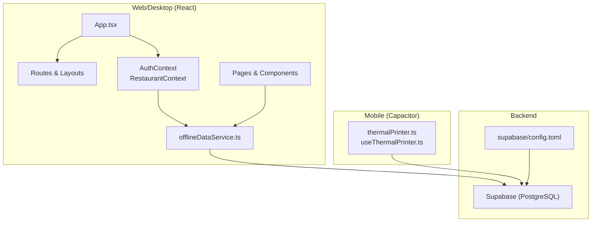
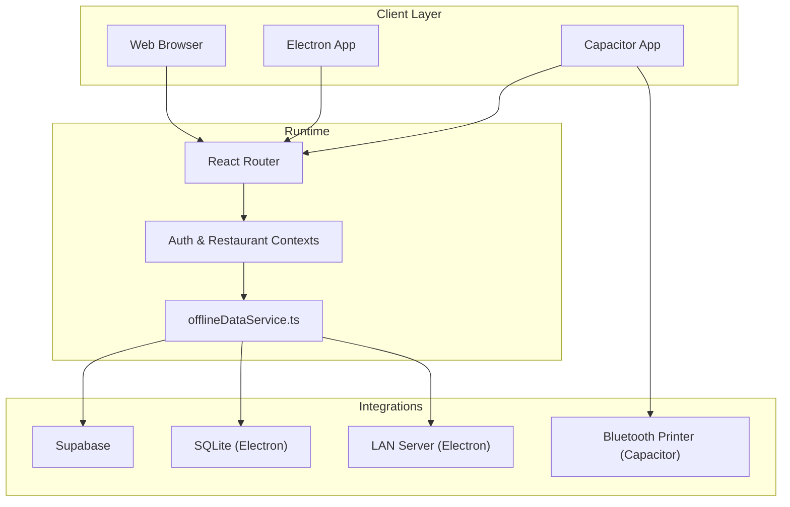
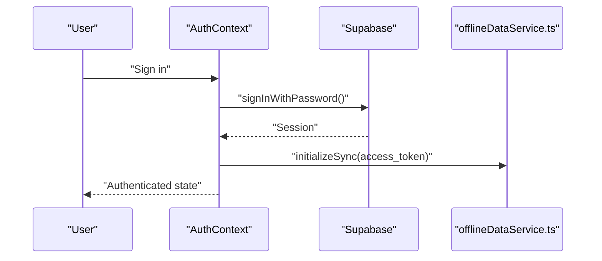
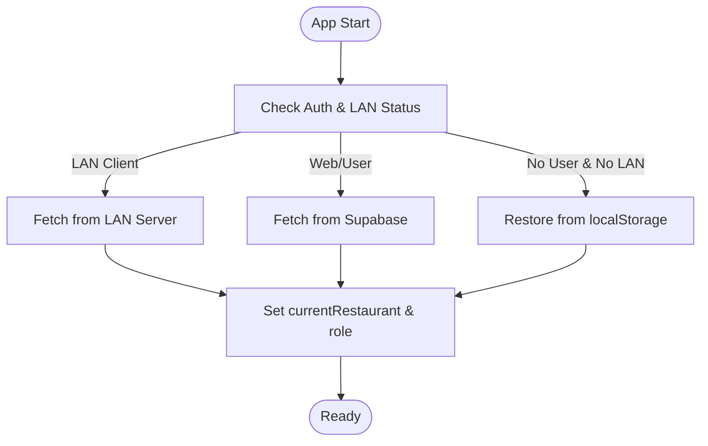
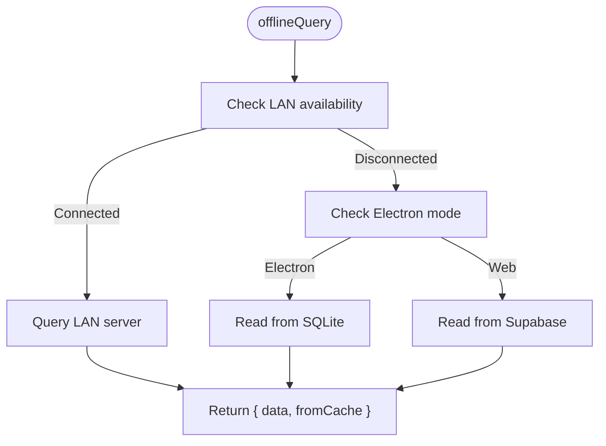
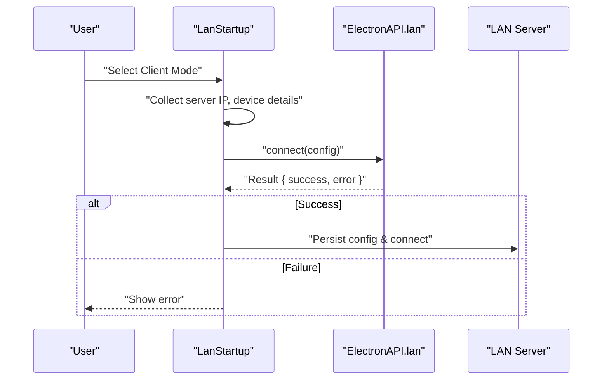
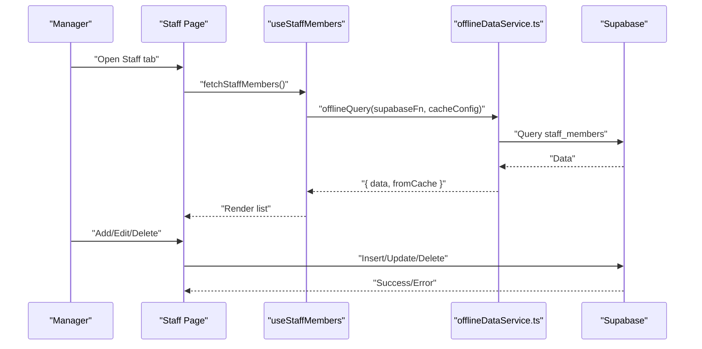
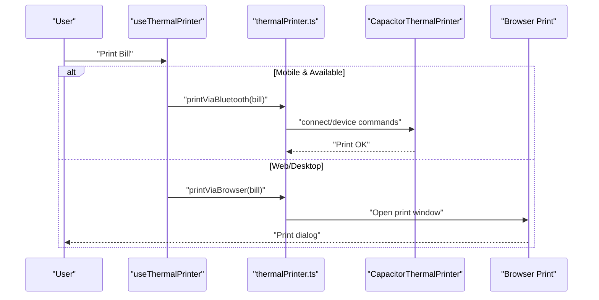
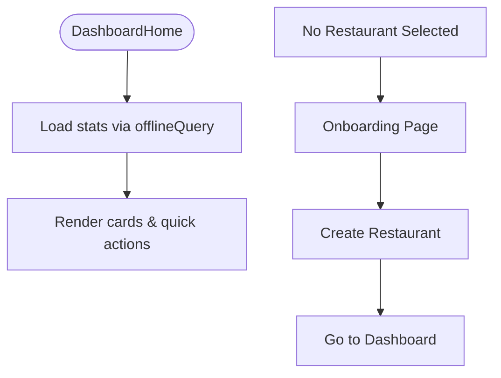
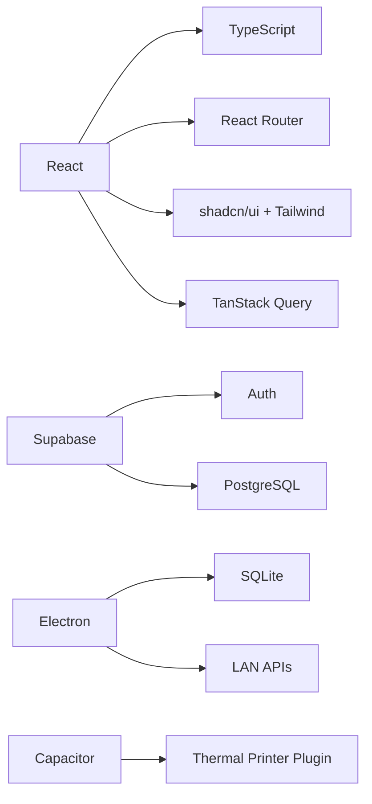

# Project Overview

<cite>
**Referenced Files in This Document**
- [README.md](file://README.md)
- [package.json](file://package.json)
- [src/App.tsx](file://src/App.tsx)
- [src/main.tsx](file://src/main.tsx)
- [src/contexts/AuthContext.tsx](file://src/contexts/AuthContext.tsx)
- [src/contexts/RestaurantContext.tsx](file://src/contexts/RestaurantContext.tsx)
- [src/services/offlineDataService.ts](file://src/services/offlineDataService.ts)
- [src/components/LanStartup.tsx](file://src/components/LanStartup.tsx)
- [src/pages/Onboarding.tsx](file://src/pages/Onboarding.tsx)
- [src/pages/dashboard/DashboardHome.tsx](file://src/pages/dashboard/DashboardHome.tsx)
- [src/pages/dashboard/Staff.tsx](file://src/pages/dashboard/Staff.tsx)
- [src/services/thermalPrinter.ts](file://src/services/thermalPrinter.ts)
- [src/hooks/useThermalPrinter.ts](file://src/hooks/useThermalPrinter.ts)
- [supabase/config.toml](file://supabase/config.toml)
</cite>

## Table of Contents
1. [Introduction](#introduction)
2. [Project Structure](#project-structure)
3. [Core Components](#core-components)
4. [Architecture Overview](#architecture-overview)
5. [Detailed Component Analysis](#detailed-component-analysis)
6. [Dependency Analysis](#dependency-analysis)
7. [Performance Considerations](#performance-considerations)
8. [Troubleshooting Guide](#troubleshooting-guide)
9. [Conclusion](#conclusion)

## Introduction
TableFlow Pro (formerly RestroFlow) is a restaurant management system designed to streamline daily operations across multiple platforms. It provides a unified solution for managing restaurants, staff, menus, orders, and reporting, while supporting offline-first workflows and LAN-based multi-device deployments. The system targets restaurant operators, managers, and staff who need reliable, real-time access to critical business data across web, desktop (Electron), and mobile (Capacitor) environments.

Key value propositions:
- Unified multi-platform experience: web, desktop, and mobile apps sharing the same data model.
- Offline-first and LAN-first: operate seamlessly without constant connectivity; share data across devices on a local network.
- Native integrations: thermal printer printing via Bluetooth on mobile and browser-based printing on web/desktop.
- Staff management: invite, manage roles, and schedule shifts with visibility and control appropriate to operator needs.
- Operational efficiency: centralized dashboards, kitchen view, kiosk ordering, and reporting to reduce bottlenecks and improve throughput.

## Project Structure
The project is a modern React application with TypeScript, structured around shared contexts, services, and pages. It integrates Supabase for backend-as-a-service, shadcn/ui for UI primitives, and Tailwind CSS for styling. Electron and Capacitor enable cross-platform desktop and mobile builds.

**Diagram sources**
- [src/App.tsx:1-150](file://src/App.tsx#L1-L150)
- [src/contexts/AuthContext.tsx:1-141](file://src/contexts/AuthContext.tsx#L1-L141)
- [src/contexts/RestaurantContext.tsx:1-391](file://src/contexts/RestaurantContext.tsx#L1-L391)
- [src/services/offlineDataService.ts:1-769](file://src/services/offlineDataService.ts#L1-L769)
- [src/services/thermalPrinter.ts:1-339](file://src/services/thermalPrinter.ts#L1-L339)
- [supabase/config.toml:1-1](file://supabase/config.toml#L1-L1)

**Section sources**
- [README.md:1-13](file://README.md#L1-L13)
- [package.json:1-131](file://package.json#L1-L131)
- [src/main.tsx:1-6](file://src/main.tsx#L1-L6)

## Core Components
- Authentication and session management powered by Supabase, with offline-aware caching and rehydration.
- Restaurant and role scoping with automatic restoration from local storage when offline or in LAN mode.
- Offline-first data service that prioritizes local SQLite (Electron) or LAN server data, falling back to Supabase on the web.
- LAN startup and mode selection for multi-device deployments (server vs client).
- Staff management with roles and shift scheduling.
- Thermal printer integration for mobile (Bluetooth) and browser-based printing for web/desktop.
- Dashboard with statistics, quick actions, and guided setup.

Practical use cases:
- Operator creates a restaurant and invites staff; staff log in and are scoped to their restaurant and role.
- Manager runs the main server PC and sets up LAN mode; billing and kitchen stations connect as LAN clients.
- Staff take orders, kitchen view updates in real time, and bills print via mobile thermal printer or browser print.
- Owner or manager downloads data to local SQLite for offline work and pushes changes later when online.

**Section sources**
- [src/contexts/AuthContext.tsx:1-141](file://src/contexts/AuthContext.tsx#L1-L141)
- [src/contexts/RestaurantContext.tsx:1-391](file://src/contexts/RestaurantContext.tsx#L1-L391)
- [src/services/offlineDataService.ts:140-287](file://src/services/offlineDataService.ts#L140-L287)
- [src/components/LanStartup.tsx:1-260](file://src/components/LanStartup.tsx#L1-L260)
- [src/pages/dashboard/Staff.tsx:1-205](file://src/pages/dashboard/Staff.tsx#L1-L205)
- [src/services/thermalPrinter.ts:1-339](file://src/services/thermalPrinter.ts#L1-L339)

## Architecture Overview
The system supports three primary deployment modes:
- Web: Direct Supabase integration with React Router and TanStack Query for optimistic UI.
- Desktop (Electron): Local SQLite-first architecture with optional cloud sync; LAN client mode connects to a LAN server.
- Mobile (Capacitor): Native thermal printer integration via Bluetooth; falls back to browser printing.

**Diagram sources**
- [src/App.tsx:32-34](file://src/App.tsx#L32-L34)
- [src/services/offlineDataService.ts:140-287](file://src/services/offlineDataService.ts#L140-L287)
- [src/services/thermalPrinter.ts:1-339](file://src/services/thermalPrinter.ts#L1-L339)

## Detailed Component Analysis

### Authentication and Session Management
- Initializes Supabase auth state listeners and caches the current user for offline scenarios.
- Starts/stops local sync engine based on session presence.
- Provides sign-up, sign-in, and sign-out flows.

**Diagram sources**
- [src/contexts/AuthContext.tsx:99-125](file://src/contexts/AuthContext.tsx#L99-L125)
- [src/services/offlineDataService.ts:351-360](file://src/services/offlineDataService.ts#L351-L360)

**Section sources**
- [src/contexts/AuthContext.tsx:1-141](file://src/contexts/AuthContext.tsx#L1-L141)

### Restaurant and Role Scoping
- Loads owned restaurants and staff-linked restaurants with role inference.
- Persists current restaurant and role in local storage for offline and LAN scenarios.
- Supports LAN client mode by querying the LAN server for restaurant data.

**Diagram sources**
- [src/contexts/RestaurantContext.tsx:78-136](file://src/contexts/RestaurantContext.tsx#L78-L136)
- [src/contexts/RestaurantContext.tsx:298-317](file://src/contexts/RestaurantContext.tsx#L298-L317)

**Section sources**
- [src/contexts/RestaurantContext.tsx:1-391](file://src/contexts/RestaurantContext.tsx#L1-L391)

### Offline-First Data Access
- Provides offlineQuery, offlineMutate, and offlineDelete with platform-specific behavior:
  - Web: Direct Supabase calls.
  - Electron: SQLite-first reads/writes; optional manual cloud sync.
  - LAN: Queries and mutations against the LAN server.
- Includes manual sync, pending change counts, and data download utilities.

**Diagram sources**
- [src/services/offlineDataService.ts:151-211](file://src/services/offlineDataService.ts#L151-L211)

**Section sources**
- [src/services/offlineDataService.ts:140-287](file://src/services/offlineDataService.ts#L140-L287)

### LAN Multi-Device Deployment
- Presents a startup wizard to choose server or client mode.
- Client mode requires server IP, device name, and role; attempts to connect and persists configuration.
- Integrates with Electron’s LAN APIs to query and mutate data on the server.

**Diagram sources**
- [src/components/LanStartup.tsx:44-66](file://src/components/LanStartup.tsx#L44-L66)
- [src/App.tsx:56-89](file://src/App.tsx#L56-L89)

**Section sources**
- [src/components/LanStartup.tsx:1-260](file://src/components/LanStartup.tsx#L1-L260)
- [src/App.tsx:36-106](file://src/App.tsx#L36-L106)

### Staff Management
- Lists, adds, edits, activates/deactivates staff members.
- Manages shifts with date and time ranges, linked to staff members.
- Uses offline-aware queries and toast notifications for feedback.

**Diagram sources**
- [src/pages/dashboard/Staff.tsx:18-90](file://src/pages/dashboard/Staff.tsx#L18-L90)
- [src/hooks/useStaffMembers.ts:41-74](file://src/hooks/useStaffMembers.ts#L41-L74)
- [src/services/offlineDataService.ts:151-211](file://src/services/offlineDataService.ts#L151-L211)

**Section sources**
- [src/pages/dashboard/Staff.tsx:1-205](file://src/pages/dashboard/Staff.tsx#L1-L205)
- [src/hooks/useStaffMembers.ts:1-255](file://src/hooks/useStaffMembers.ts#L1-L255)

### Thermal Printing (Mobile/Web)
- Mobile (Capacitor): Scans for Bluetooth printers, connects, and prints bills using ESC/POS-like commands.
- Web/Desktop: Generates printable HTML receipts and triggers browser print dialogs.
- Hook encapsulates scanning, connecting, disconnecting, and printing.

**Diagram sources**
- [src/hooks/useThermalPrinter.ts:43-54](file://src/hooks/useThermalPrinter.ts#L43-L54)
- [src/services/thermalPrinter.ts:118-219](file://src/services/thermalPrinter.ts#L118-L219)
- [src/services/thermalPrinter.ts:221-335](file://src/services/thermalPrinter.ts#L221-L335)

**Section sources**
- [src/services/thermalPrinter.ts:1-339](file://src/services/thermalPrinter.ts#L1-L339)
- [src/hooks/useThermalPrinter.ts:1-69](file://src/hooks/useThermalPrinter.ts#L1-L69)

### Dashboard and Onboarding
- DashboardHome aggregates stats (kitchens, tables, menu items, active orders) and provides quick actions.
- Onboarding enables operators to create their first restaurant and become owner/operator.

**Diagram sources**
- [src/pages/dashboard/DashboardHome.tsx:32-142](file://src/pages/dashboard/DashboardHome.tsx#L32-L142)
- [src/pages/Onboarding.tsx:20-31](file://src/pages/Onboarding.tsx#L20-L31)

**Section sources**
- [src/pages/dashboard/DashboardHome.tsx:1-345](file://src/pages/dashboard/DashboardHome.tsx#L1-L345)
- [src/pages/Onboarding.tsx:1-151](file://src/pages/Onboarding.tsx#L1-L151)

## Dependency Analysis
Technology stack highlights:
- Frontend: React, TypeScript, shadcn/ui, Tailwind CSS, React Router, TanStack Query.
- Backend: Supabase (authentication, database, real-time).
- Desktop: Electron with SQLite-backed offline storage and LAN client/server integration.
- Mobile: Capacitor with thermal printer plugin for Bluetooth printing.

**Diagram sources**
- [package.json:17-77](file://package.json#L17-L77)
- [README.md:2-12](file://README.md#L2-L12)

**Section sources**
- [package.json:1-131](file://package.json#L1-L131)
- [README.md:1-13](file://README.md#L1-L13)

## Performance Considerations
- Offline-first design minimizes latency and improves reliability; use offlineQuery to prefer local data.
- Batch operations and careful use of TanStack Query can reduce redundant network calls.
- For LAN deployments, minimize round trips by grouping queries and leveraging LAN server-side filtering.
- Mobile printing should batch ESC/POS commands to reduce Bluetooth overhead.

## Troubleshooting Guide
Common issues and resolutions:
- Authentication state not restored offline:
  - Verify cached user persistence and offline mode detection in the auth provider.
  - Confirm that the sync engine is initialized when a session exists.
- Restaurant not selected:
  - Use onboarding to create a restaurant; the dashboard will prompt to create one if none exists.
- LAN connection failures:
  - Ensure server mode is active and client has correct IP; confirm device name and role are set.
  - Check LAN client status and reattempt connection.
- Thermal printer not available on mobile:
  - Confirm device is native platform and Bluetooth permissions are granted.
  - Attempt to scan and connect to a printer before printing.
- Offline data not syncing:
  - In Electron, ensure cloud sync is initialized and internet is available.
  - Use manual sync to upload pending changes and review errors.

**Section sources**
- [src/contexts/AuthContext.tsx:44-97](file://src/contexts/AuthContext.tsx#L44-L97)
- [src/pages/Onboarding.tsx:20-31](file://src/pages/Onboarding.tsx#L20-L31)
- [src/components/LanStartup.tsx:44-66](file://src/components/LanStartup.tsx#L44-L66)
- [src/services/thermalPrinter.ts:37-44](file://src/services/thermalPrinter.ts#L37-L44)
- [src/services/offlineDataService.ts:351-372](file://src/services/offlineDataService.ts#L351-L372)

## Conclusion
TableFlow Pro delivers a cohesive, multi-platform restaurant management solution emphasizing reliability, flexibility, and operational efficiency. Its offline-first and LAN-first architecture ensures uninterrupted productivity, while native mobile printing and robust staff management features streamline day-to-day operations. Operators gain powerful dashboards, kitchen visibility, and reporting tools, enabling informed decisions and improved guest experiences.