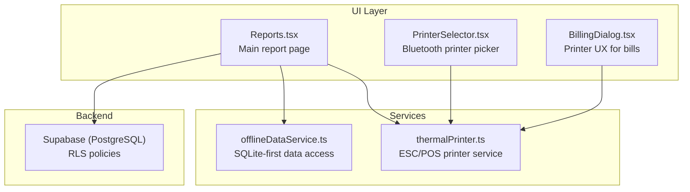
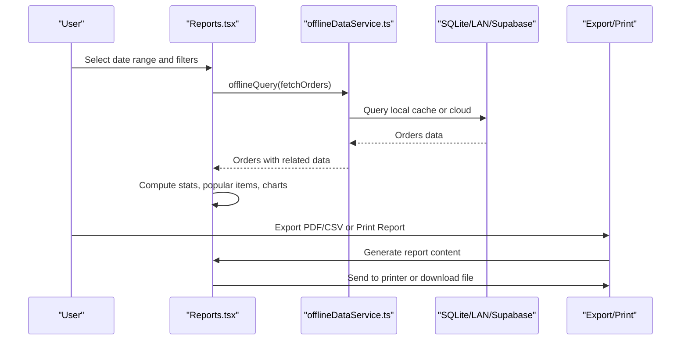
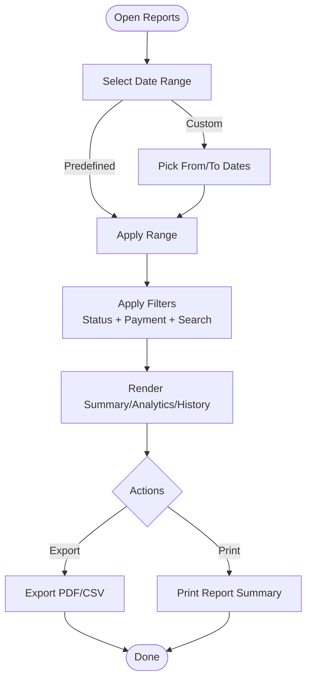
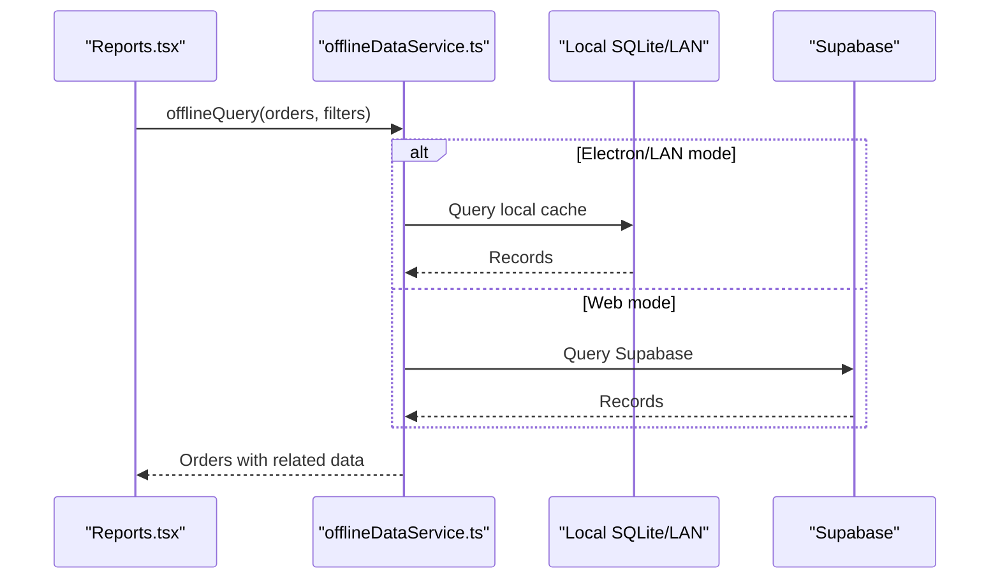
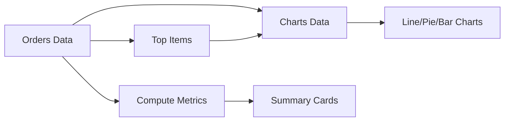
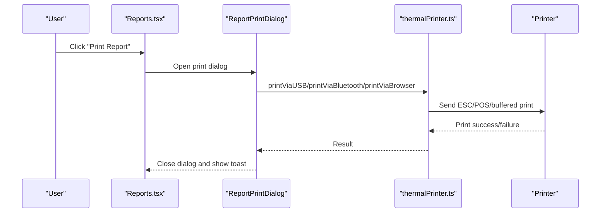
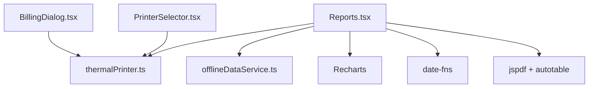

# Custom Report Generation

<cite>
**Referenced Files in This Document**
- [Reports.tsx](file://src/pages/dashboard/Reports.tsx)
- [offlineDataService.ts](file://src/services/offlineDataService.ts)
- [thermalPrinter.ts](file://src/services/thermalPrinter.ts)
- [PrinterSelector.tsx](file://src/components/PrinterSelector.tsx)
- [BillingDialog.tsx](file://src/components/BillingDialog.tsx)
- [20251206132719_11d13f91-c469-437f-9d98-63127362f20c.sql](file://supabase/migrations/20251206132719_11d13f91-c469-437f-9d98-63127362f20c.sql)
- [20251206133509_50399ee0-7c3e-4927-bf1a-00556ef24c8c.sql](file://supabase/migrations/20251206133509_50399ee0-7c3e-4927-bf1a-00556ef24c8c.sql)
- [package-lock.json](file://package-lock.json)
</cite>

## Table of Contents
1. [Introduction](#introduction)
2. [Project Structure](#project-structure)
3. [Core Components](#core-components)
4. [Architecture Overview](#architecture-overview)
5. [Detailed Component Analysis](#detailed-component-analysis)
6. [Dependency Analysis](#dependency-analysis)
7. [Performance Considerations](#performance-considerations)
8. [Troubleshooting Guide](#troubleshooting-guide)
9. [Conclusion](#conclusion)
10. [Appendices](#appendices)

## Introduction
This document explains how to build custom reports in TableFlow Pro. It covers the report builder interface, drag-and-drop-like field selection, custom date ranges, filtering, export formats (PDF, Excel, CSV), printable report layouts, and thermal printer integration. It also provides practical examples for sales reports, staff performance dashboards, and inventory analysis, along with guidance on report sharing, access controls, and report history tracking for audit purposes.

## Project Structure
The report generation feature is centered around a dedicated dashboard page that orchestrates data fetching, filtering, analytics rendering, and export/printing. Supporting services handle offline-first data access and thermal printing.

**Diagram sources**
- [Reports.tsx:580-1386](file://src/pages/dashboard/Reports.tsx#L580-L1386)
- [offlineDataService.ts:151-211](file://src/services/offlineDataService.ts#L151-L211)
- [thermalPrinter.ts:33-339](file://src/services/thermalPrinter.ts#L33-L339)
- [PrinterSelector.tsx:41-121](file://src/components/PrinterSelector.tsx#L41-L121)
- [BillingDialog.tsx:140-175](file://src/components/BillingDialog.tsx#L140-L175)

**Section sources**
- [Reports.tsx:580-1386](file://src/pages/dashboard/Reports.tsx#L580-L1386)

## Core Components
- Report Builder Interface: Provides date range selection, custom date pickers, and filter controls for status and payment method. Includes tabs for Summary, Analytics, and History.
- Data Fetching and Caching: Uses an offline-first strategy to read from local SQLite (Electron/LAN) or LAN server, with a fallback to Supabase in web mode.
- Analytics Charts: Renders charts for orders/revenue trends, order status distribution, and top-selling items.
- Export Functions: Generates PDF and CSV exports of filtered order history.
- Thermal Printing: Integrates with Bluetooth and USB printers for printable report summaries and receipts.

**Section sources**
- [Reports.tsx:1443-1493](file://src/pages/dashboard/Reports.tsx#L1443-L1493)
- [Reports.tsx:1035-1059](file://src/pages/dashboard/Reports.tsx#L1035-L1059)
- [Reports.tsx:1060-1219](file://src/pages/dashboard/Reports.tsx#L1060-L1219)
- [Reports.tsx:1222-1376](file://src/pages/dashboard/Reports.tsx#L1222-L1376)

## Architecture Overview
The report system follows a layered approach:
- UI: React components with shadcn/ui and Recharts for visualization.
- Services: Offline-first data access and thermal printing abstractions.
- Backend: Supabase with Row-Level Security (RLS) policies for access control.

**Diagram sources**
- [Reports.tsx:719-882](file://src/pages/dashboard/Reports.tsx#L719-L882)
- [offlineDataService.ts:151-211](file://src/services/offlineDataService.ts#L151-L211)
- [Reports.tsx:1103-1219](file://src/pages/dashboard/Reports.tsx#L1103-L1219)
- [Reports.tsx:1233-1376](file://src/pages/dashboard/Reports.tsx#L1233-L1376)

## Detailed Component Analysis

### Report Builder Interface
- Date Range Controls: Predefined ranges (Today, Yesterday, This Week, This Month) and a Custom range with two calendars.
- Filters: Status filter (All, Pending, Cooking, Ready, Served, Cancelled) and Payment filter (All, Cash, Online, Card Only, UPI Only, Not Recorded). Search term supports item and table lookup.
- Tabs: Summary (key metrics and charts), Analytics (trend and distribution charts), History (filtered order list with pagination).

**Diagram sources**
- [Reports.tsx:1443-1493](file://src/pages/dashboard/Reports.tsx#L1443-L1493)
- [Reports.tsx:1035-1059](file://src/pages/dashboard/Reports.tsx#L1035-L1059)
- [Reports.tsx:1495-1832](file://src/pages/dashboard/Reports.tsx#L1495-L1832)

**Section sources**
- [Reports.tsx:1443-1493](file://src/pages/dashboard/Reports.tsx#L1443-L1493)
- [Reports.tsx:1835-1999](file://src/pages/dashboard/Reports.tsx#L1835-L1999)

### Data Fetching and Offline-First Strategy
- The system prefers local data (SQLite or LAN server) and falls back to Supabase in web mode.
- Related data (tables, floors, menu items) is assembled from local caches or cloud queries depending on the data source.
- Visibility change triggers a refresh to keep data fresh when the tab becomes active.

**Diagram sources**
- [Reports.tsx:719-882](file://src/pages/dashboard/Reports.tsx#L719-L882)
- [offlineDataService.ts:151-211](file://src/services/offlineDataService.ts#L151-L211)

**Section sources**
- [Reports.tsx:719-882](file://src/pages/dashboard/Reports.tsx#L719-L882)
- [offlineDataService.ts:151-211](file://src/services/offlineDataService.ts#L151-L211)

### Analytics and Visualization
- Summary cards: Total Revenue, Completed Orders, Average Order Value, Pending Orders, and optional GST breakdown.
- Charts: Orders/Revenue trend (hourly/daily), Order Status Distribution (pie), Top Items (bar chart comparing quantity and revenue).
- Popular Items: Top 5 items by quantity sold, computed from served orders.

**Diagram sources**
- [Reports.tsx:902-965](file://src/pages/dashboard/Reports.tsx#L902-L965)
- [Reports.tsx:1694-1832](file://src/pages/dashboard/Reports.tsx#L1694-L1832)

**Section sources**
- [Reports.tsx:902-965](file://src/pages/dashboard/Reports.tsx#L902-L965)
- [Reports.tsx:1694-1832](file://src/pages/dashboard/Reports.tsx#L1694-L1832)

### Export Formats
- PDF Export: Generates a multi-page PDF with summary metrics, top items, and a table of filtered orders. Uses jspdf and jspdf-autotable.
- CSV Export: Produces a CSV file containing filtered order details suitable for spreadsheet analysis.

```mermaid
flowchart TD
Start(["Export Trigger"]) --> CheckData["Validate Data Exists"]
CheckData --> |No| Toast["Show 'No data to export'"]
CheckData --> |Yes| ChooseFormat{"Choose Format"}
ChooseFormat --> |PDF| PDFGen["Generate PDF with metrics and tables"]
ChooseFormat --> |CSV| CSVGen["Generate CSV rows"]
PDFGen --> SavePDF["Save file"]
CSVGen --> SaveCSV["Save file"]
SavePDF --> Done(["Success"])
SaveCSV --> Done
Toast --> End(["End"])
```

**Diagram sources**
- [Reports.tsx:1103-1219](file://src/pages/dashboard/Reports.tsx#L1103-L1219)
- [Reports.tsx:1060-1100](file://src/pages/dashboard/Reports.tsx#L1060-L1100)

**Section sources**
- [Reports.tsx:1103-1219](file://src/pages/dashboard/Reports.tsx#L1103-L1219)
- [Reports.tsx:1060-1100](file://src/pages/dashboard/Reports.tsx#L1060-L1100)
- [package-lock.json:8495-8500](file://package-lock.json#L8495-L8500)

### Printable Report Layouts and Thermal Printing
- Report Summary Print Dialog: Allows printing a concise report summary to USB, Bluetooth, or browser-based thermal receipt.
- Printer Integration: Supports USB device discovery and selection in Electron, Windows printer switching, and Bluetooth printing via a native plugin.
- Receipt Template: Uses ESC/POS-like formatting for crisp, compact receipts.

**Diagram sources**
- [Reports.tsx:1222-1376](file://src/pages/dashboard/Reports.tsx#L1222-L1376)
- [thermalPrinter.ts:118-219](file://src/services/thermalPrinter.ts#L118-L219)
- [PrinterSelector.tsx:41-121](file://src/components/PrinterSelector.tsx#L41-L121)
- [BillingDialog.tsx:140-175](file://src/components/BillingDialog.tsx#L140-L175)

**Section sources**
- [Reports.tsx:1222-1376](file://src/pages/dashboard/Reports.tsx#L1222-L1376)
- [thermalPrinter.ts:33-339](file://src/services/thermalPrinter.ts#L33-L339)
- [PrinterSelector.tsx:41-121](file://src/components/PrinterSelector.tsx#L41-L121)
- [BillingDialog.tsx:140-175](file://src/components/BillingDialog.tsx#L140-L175)

### Examples: Creating Custom Reports
- Sales Report: Use predefined date ranges (Today/Week/Month) or Custom dates. Apply filters for status and payment type. Export PDF for management review or CSV for accounting reconciliation.
- Staff Performance Dashboard: Aggregate order counts and revenue per staff member by joining order data with staff records. Use bar charts to compare performance across shifts.
- Inventory Analysis Report: Combine order items with menu items to compute quantity sold and revenue per item. Use bar charts to identify slow-moving stock and optimize procurement.

[No sources needed since this section provides conceptual examples]

## Dependency Analysis
- External Libraries:
  - jspdf and jspdf-autotable for PDF generation.
  - date-fns for date range calculations.
  - Recharts for interactive visualizations.
  - Capacitor plugins for Bluetooth printing on mobile.
- Internal Dependencies:
  - Reports.tsx depends on offlineDataService.ts for data access and thermalPrinter.ts for printing.
  - PrinterSelector.tsx and BillingDialog.tsx integrate with thermalPrinter.ts for device management.

**Diagram sources**
- [Reports.tsx:1-83](file://src/pages/dashboard/Reports.tsx#L1-L83)
- [offlineDataService.ts:151-211](file://src/services/offlineDataService.ts#L151-L211)
- [thermalPrinter.ts:33-339](file://src/services/thermalPrinter.ts#L33-L339)
- [PrinterSelector.tsx:41-121](file://src/components/PrinterSelector.tsx#L41-L121)
- [BillingDialog.tsx:140-175](file://src/components/BillingDialog.tsx#L140-L175)
- [package-lock.json:8495-8500](file://package-lock.json#L8495-L8500)

**Section sources**
- [Reports.tsx:1-83](file://src/pages/dashboard/Reports.tsx#L1-L83)
- [package-lock.json:8495-8500](file://package-lock.json#L8495-L8500)

## Performance Considerations
- Offline-first caching reduces latency and enables operation without network connectivity.
- Pagination limits the number of visible orders per page to improve rendering performance.
- Chart rendering uses responsive containers and tooltips with minimal styling overhead.
- Export operations disable UI controls during generation to prevent concurrent heavy tasks.

[No sources needed since this section provides general guidance]

## Troubleshooting Guide
- No data displayed:
  - Verify a restaurant is selected and the page is visible (auto-refresh on visibility change).
  - Confirm local cache availability or cloud connectivity in web mode.
- Export fails:
  - Ensure filtered data exists; the UI prevents exporting empty sets.
  - Check browser pop-up permissions for PDF preview and CSV downloads.
- Printing issues:
  - For USB: Ensure the device is connected and selected; Electron can list and switch Windows printers.
  - For Bluetooth: Confirm device pairing and connection; mobile-only scanning is supported.
  - For browser fallback: Use the browser’s print dialog to send to a connected printer.

**Section sources**
- [Reports.tsx:884-899](file://src/pages/dashboard/Reports.tsx#L884-L899)
- [Reports.tsx:1060-1100](file://src/pages/dashboard/Reports.tsx#L1060-L1100)
- [Reports.tsx:1233-1376](file://src/pages/dashboard/Reports.tsx#L1233-L1376)
- [PrinterSelector.tsx:41-121](file://src/components/PrinterSelector.tsx#L41-L121)
- [BillingDialog.tsx:140-175](file://src/components/BillingDialog.tsx#L140-L175)

## Conclusion
TableFlow Pro’s report generation combines a flexible UI with robust offline-first data access and multi-format export/print capabilities. Users can quickly build custom reports, apply granular filters, and produce professional PDFs, CSV datasets, or printable receipts tailored to sales, staff performance, and inventory insights.

[No sources needed since this section summarizes without analyzing specific files]

## Appendices

### Access Controls and Sharing
- Row-Level Security (RLS) ensures users can only access data relevant to their linked staff records and active restaurant memberships.
- Policies:
  - Staff can view staff records matching their email.
  - Staff can view restaurants they work at.
  - Owner staff records are inserted automatically for existing restaurants.

**Section sources**
- [20251206132719_11d13f91-c469-437f-9d98-63127362f20c.sql:1-12](file://supabase/migrations/20251206132719_11d13f91-c469-437f-9d98-63127362f20c.sql#L1-L12)
- [20251206133509_50399ee0-7c3e-4927-bf1a-00556ef24c8c.sql:1-28](file://supabase/migrations/20251206133509_50399ee0-7c3e-4927-bf1a-00556ef24c8c.sql#L1-L28)

### Report History Tracking for Audit
- The History tab displays filtered orders with pagination, enabling audit trails of transactions.
- Filtering by status, payment method, and search term supports targeted reviews.
- Exported PDFs include metadata such as generated date and page numbers for compliance.

**Section sources**
- [Reports.tsx:1835-1999](file://src/pages/dashboard/Reports.tsx#L1835-L1999)
- [Reports.tsx:1103-1219](file://src/pages/dashboard/Reports.tsx#L1103-L1219)