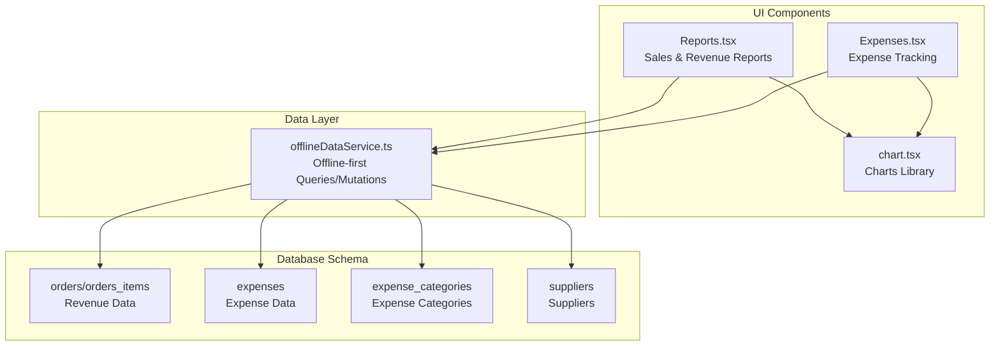
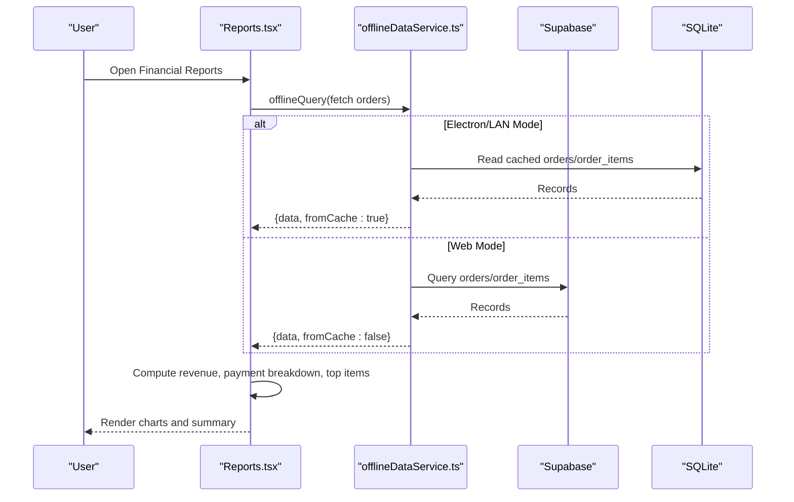
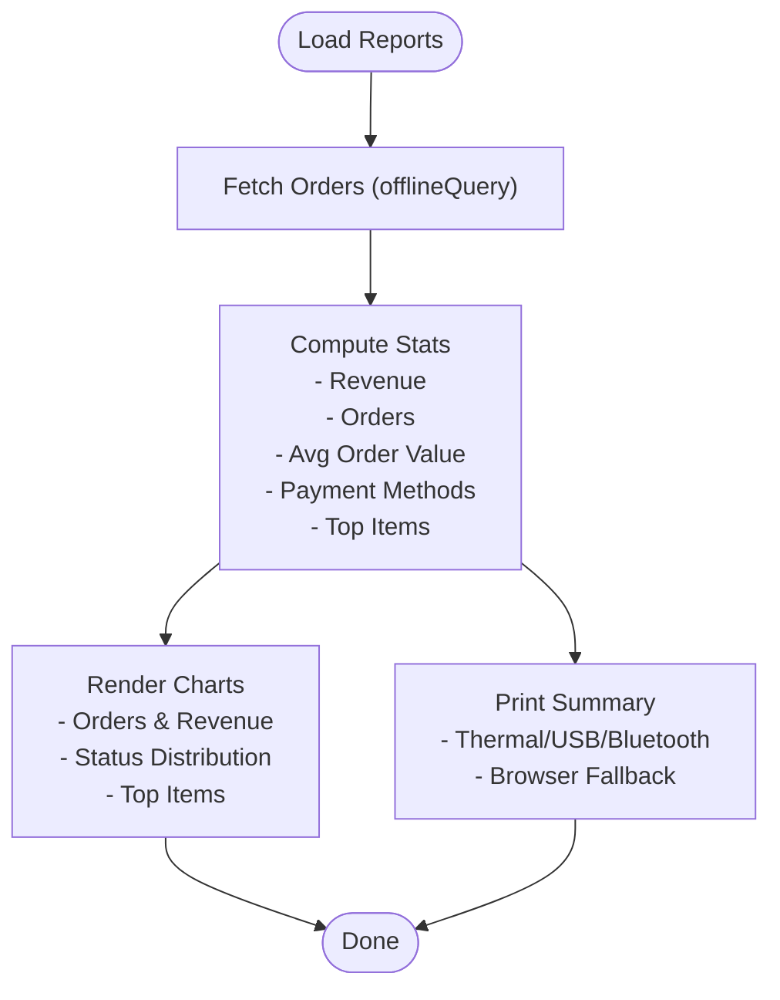
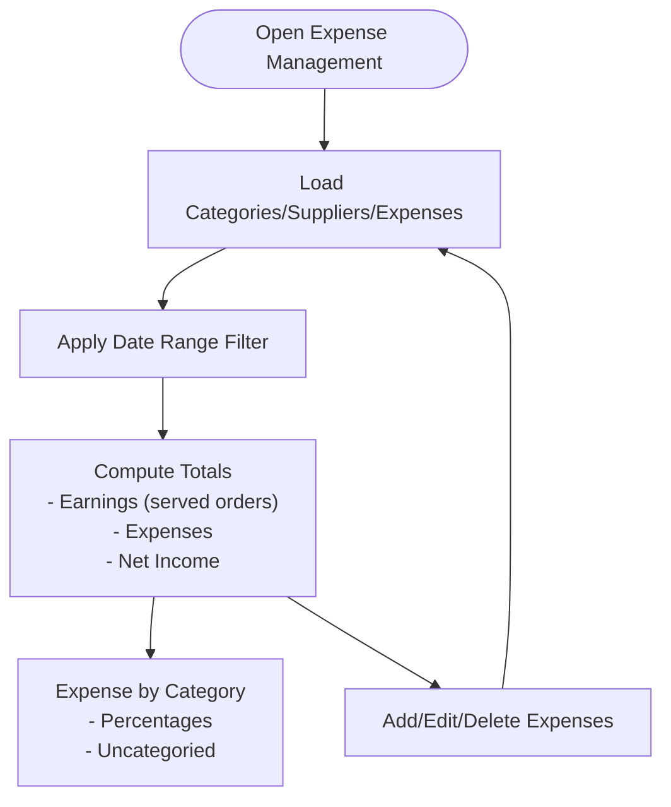
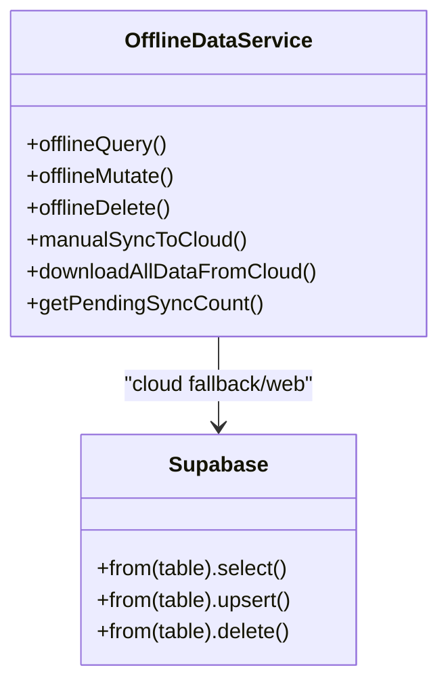
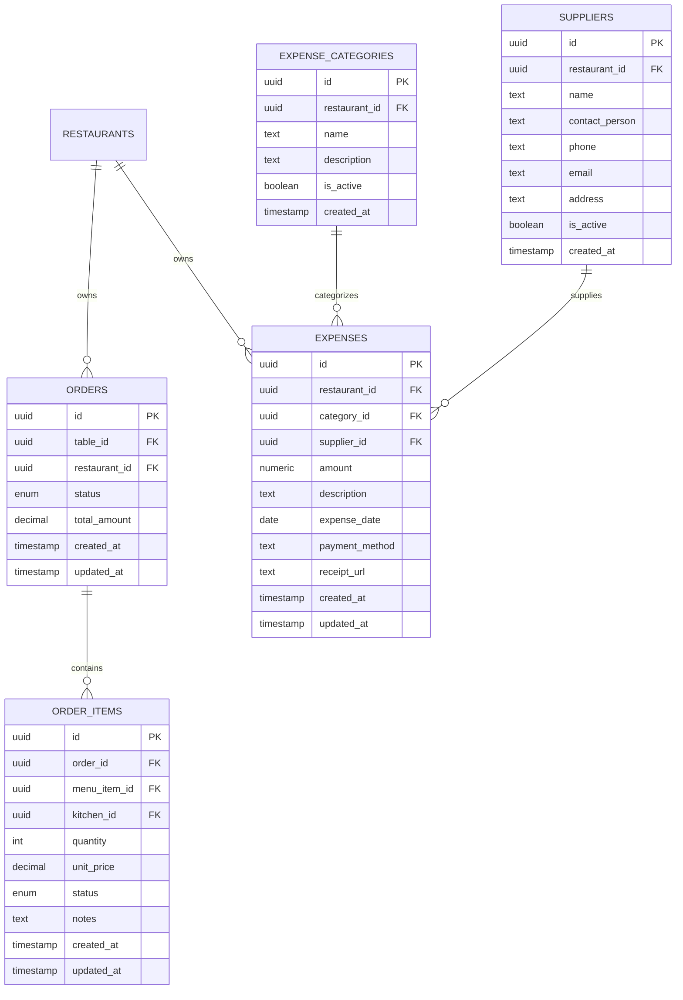
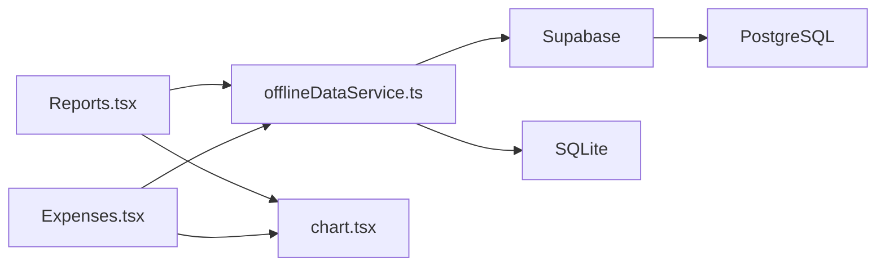

# Financial Summary Reports

<cite>
**Referenced Files in This Document**
- [Reports.tsx](file://src/pages/dashboard/Reports.tsx)
- [Expenses.tsx](file://src/pages/dashboard/Expenses.tsx)
- [offlineDataService.ts](file://src/services/offlineDataService.ts)
- [chart.tsx](file://src/components/ui/chart.tsx)
- [20251206042902_fc2b1d91-eb8e-4750-90c3-95b7e0feb6ba.sql](file://supabase/migrations/20251206042902_fc2b1d91-eb8e-4750-90c3-95b7e0feb6ba.sql)
- [20251212061838_061086f8-bf22-458f-b2e6-20f8199ee7ce.sql](file://supabase/migrations/20251212061838_061086f8-bf22-458f-b2e6-20f8199ee7ce.sql)
</cite>

## Table of Contents
1. [Introduction](#introduction)
2. [Project Structure](#project-structure)
3. [Core Components](#core-components)
4. [Architecture Overview](#architecture-overview)
5. [Detailed Component Analysis](#detailed-component-analysis)
6. [Dependency Analysis](#dependency-analysis)
7. [Performance Considerations](#performance-considerations)
8. [Troubleshooting Guide](#troubleshooting-guide)
9. [Conclusion](#conclusion)

## Introduction
This document describes the financial summary reporting capabilities in TableFlow Pro, focusing on profit and loss reporting, expense tracking, and financial performance dashboards. It explains how revenue is aggregated, how expenses are categorized and tracked, and how real-time financial data is consolidated for comprehensive reporting. It also covers integration with the expense management system, printing of sales summaries, and the offline-first data architecture that supports reliable financial reporting in disconnected environments.

## Project Structure
The financial reporting functionality spans three primary areas:
- Revenue and sales reporting dashboard with charts and printable summaries
- Expense management with categories, suppliers, and reporting
- Offline-first data service ensuring reliable financial data access and synchronization

**Diagram sources**
- [Reports.tsx:580-780](file://src/pages/dashboard/Reports.tsx#L580-L780)
- [Expenses.tsx:48-91](file://src/pages/dashboard/Expenses.tsx#L48-L91)
- [offlineDataService.ts:151-211](file://src/services/offlineDataService.ts#L151-L211)
- [20251206042902_fc2b1d91-eb8e-4750-90c3-95b7e0feb6ba.sql:84-108](file://supabase/migrations/20251206042902_fc2b1d91-eb8e-4750-90c3-95b7e0feb6ba.sql#L84-L108)
- [20251212061838_061086f8-bf22-458f-b2e6-20f8199ee7ce.sql:24-37](file://supabase/migrations/20251212061838_061086f8-bf22-458f-b2e6-20f8199ee7ce.sql#L24-L37)

**Section sources**
- [Reports.tsx:580-780](file://src/pages/dashboard/Reports.tsx#L580-L780)
- [Expenses.tsx:48-91](file://src/pages/dashboard/Expenses.tsx#L48-L91)
- [offlineDataService.ts:151-211](file://src/services/offlineDataService.ts#L151-L211)

## Core Components
- Sales and Revenue Reports: Aggregates order totals, payment methods, top-selling items, and prints a formatted sales summary.
- Expense Management: Records expenses with categories and suppliers, computes totals, and displays expense breakdowns.
- Charts and Visualization: Recharts-based components for time-series and distribution visualizations.
- Offline Data Service: SQLite-first architecture for reliable financial reporting when offline, with optional cloud sync.

**Section sources**
- [Reports.tsx:132-154](file://src/pages/dashboard/Reports.tsx#L132-L154)
- [Expenses.tsx:36-46](file://src/pages/dashboard/Expenses.tsx#L36-L46)
- [chart.tsx:1-304](file://src/components/ui/chart.tsx#L1-L304)
- [offlineDataService.ts:151-211](file://src/services/offlineDataService.ts#L151-L211)

## Architecture Overview
The financial reporting architecture combines:
- Real-time order data from Supabase with offline caching for resilience
- Expense data stored in dedicated tables with RLS policies
- Recharts-based visualizations for revenue trends and distributions
- A unified offline service that reads/writes SQLite and optionally syncs with the cloud

**Diagram sources**
- [Reports.tsx:718-760](file://src/pages/dashboard/Reports.tsx#L718-L760)
- [offlineDataService.ts:151-211](file://src/services/offlineDataService.ts#L151-L211)

## Detailed Component Analysis

### Sales and Revenue Reporting
This component aggregates:
- Total revenue, completed orders, average order value
- Cash vs online payment breakdown
- Top-selling menu items by quantity and revenue
- Optional printing to thermal printers or browser

**Diagram sources**
- [Reports.tsx:718-760](file://src/pages/dashboard/Reports.tsx#L718-L760)
- [Reports.tsx:1237-1266](file://src/pages/dashboard/Reports.tsx#L1237-L1266)
- [Reports.tsx:1596-1690](file://src/pages/dashboard/Reports.tsx#L1596-L1690)

Key implementation highlights:
- Date range selection (today/yesterday/week/month/custom)
- Payment method filtering and aggregation
- Top items computed from order items with menu item names and quantities
- Print dialog supporting thermal printers, USB, and browser fallback

**Section sources**
- [Reports.tsx:580-780](file://src/pages/dashboard/Reports.tsx#L580-L780)
- [Reports.tsx:1237-1266](file://src/pages/dashboard/Reports.tsx#L1237-L1266)
- [Reports.tsx:1596-1690](file://src/pages/dashboard/Reports.tsx#L1596-L1690)

### Expense Tracking and Financial Performance
This module manages:
- Expense categories and suppliers
- Recording expenses with amounts, dates, payment methods, and optional receipts
- Monthly/quarterly financial summaries (earnings vs expenses, net income)
- Expense-by-category breakdown

**Diagram sources**
- [Expenses.tsx:84-91](file://src/pages/dashboard/Expenses.tsx#L84-L91)
- [Expenses.tsx:111-127](file://src/pages/dashboard/Expenses.tsx#L111-L127)
- [Expenses.tsx:290-291](file://src/pages/dashboard/Expenses.tsx#L290-L291)

Key implementation highlights:
- Earnings derived from served orders within the selected date range
- Net income calculated as earnings minus total expenses
- Category and supplier associations for detailed reporting
- Expense forms with validation and RLS-secured backend writes

**Section sources**
- [Expenses.tsx:84-140](file://src/pages/dashboard/Expenses.tsx#L84-L140)
- [Expenses.tsx:218-257](file://src/pages/dashboard/Expenses.tsx#L218-L257)
- [Expenses.tsx:290-291](file://src/pages/dashboard/Expenses.tsx#L290-L291)

### Offline-First Data Architecture
The offline service ensures financial reports remain functional regardless of connectivity:
- SQLite-first queries in Electron/LAN modes
- Optional cloud sync with conflict resolution and pending change tracking
- Special handling for tables requiring cross-table joins during downloads

**Diagram sources**
- [offlineDataService.ts:151-211](file://src/services/offlineDataService.ts#L151-L211)
- [offlineDataService.ts:220-287](file://src/services/offlineDataService.ts#L220-L287)
- [offlineDataService.ts:397-541](file://src/services/offlineDataService.ts#L397-L541)

Operational characteristics:
- In Electron/LAN modes, queries bypass the cloud and read from SQLite
- Mutations and deletes are written to SQLite with pending_sync/pending_delete markers
- Manual sync pushes pending changes to Supabase while preserving original timestamps

**Section sources**
- [offlineDataService.ts:151-211](file://src/services/offlineDataService.ts#L151-L211)
- [offlineDataService.ts:220-287](file://src/services/offlineDataService.ts#L220-L287)
- [offlineDataService.ts:397-541](file://src/services/offlineDataService.ts#L397-L541)

### Database Schema for Financial Data
The schema defines the core tables used by financial reporting:
- Orders and order items: revenue and item-level details
- Expenses, expense categories, and suppliers: expense tracking and categorization

**Diagram sources**
- [20251206042902_fc2b1d91-eb8e-4750-90c3-95b7e0feb6ba.sql:84-108](file://supabase/migrations/20251206042902_fc2b1d91-eb8e-4750-90c3-95b7e0feb6ba.sql#L84-L108)
- [20251212061838_061086f8-bf22-458f-b2e6-20f8199ee7ce.sql:24-37](file://supabase/migrations/20251212061838_061086f8-bf22-458f-b2e6-20f8199ee7ce.sql#L24-L37)

**Section sources**
- [20251206042902_fc2b1d91-eb8e-4750-90c3-95b7e0feb6ba.sql:84-108](file://supabase/migrations/20251206042902_fc2b1d91-eb8e-4750-90c3-95b7e0feb6ba.sql#L84-L108)
- [20251212061838_061086f8-bf22-458f-b2e6-20f8199ee7ce.sql:24-37](file://supabase/migrations/20251212061838_061086f8-bf22-458f-b2e6-20f8199ee7ce.sql#L24-L37)

## Dependency Analysis
- Reports.tsx depends on:
  - offlineDataService for data retrieval
  - Recharts via chart.tsx for visualization
  - Supabase for cloud queries in web mode
- Expenses.tsx depends on:
  - offlineDataService for CRUD operations
  - Supabase for category/supplier/expense persistence
- offlineDataService coordinates:
  - SQLite access in Electron/LAN
  - Supabase fallback in web mode
  - Manual sync pipeline to cloud

**Diagram sources**
- [Reports.tsx:718-760](file://src/pages/dashboard/Reports.tsx#L718-L760)
- [Expenses.tsx:111-127](file://src/pages/dashboard/Expenses.tsx#L111-L127)
- [offlineDataService.ts:151-211](file://src/services/offlineDataService.ts#L151-L211)

**Section sources**
- [Reports.tsx:718-760](file://src/pages/dashboard/Reports.tsx#L718-L760)
- [Expenses.tsx:111-127](file://src/pages/dashboard/Expenses.tsx#L111-L127)
- [offlineDataService.ts:151-211](file://src/services/offlineDataService.ts#L151-L211)

## Performance Considerations
- Offline-first queries minimize network latency and improve reliability for financial reporting.
- Recharts rendering is optimized for small-to-medium datasets typical in daily reports.
- Manual sync batches pending changes and preserves original timestamps to maintain audit trails.
- Indexes on expense tables (restaurant_id, category_id, supplier_id) improve filtering performance.

[No sources needed since this section provides general guidance]

## Troubleshooting Guide
Common issues and resolutions:
- No data in reports when offline:
  - Verify SQLite availability and that data was downloaded previously.
  - Use the manual sync function to push pending changes and refresh data.
- Expenses not appearing:
  - Confirm date range selection and that expenses were recorded under the current restaurant.
  - Check category/supplier associations for missing links.
- Printing failures:
  - Ensure printer connectivity (USB/Bluetooth) and permissions.
  - Use browser fallback printing when device-specific printing fails.

**Section sources**
- [offlineDataService.ts:397-541](file://src/services/offlineDataService.ts#L397-L541)
- [Reports.tsx:274-361](file://src/pages/dashboard/Reports.tsx#L274-L361)
- [Expenses.tsx:111-127](file://src/pages/dashboard/Expenses.tsx#L111-L127)

## Conclusion
TableFlow Pro’s financial reporting integrates revenue tracking from orders with comprehensive expense management, supported by an offline-first architecture that ensures reliable access to financial data. The combination of real-time dashboards, category-based expense reporting, and optional cloud sync provides restaurant operators with actionable insights into their financial performance.