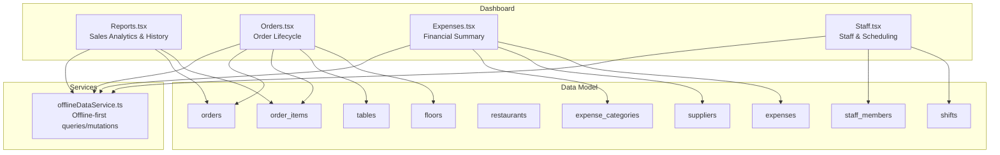
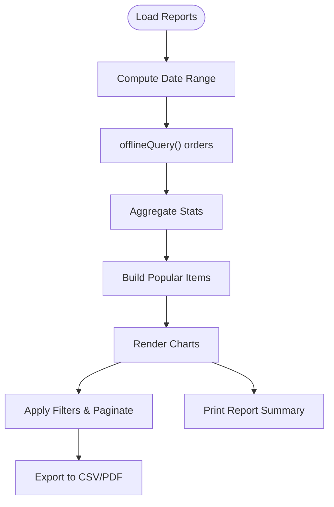
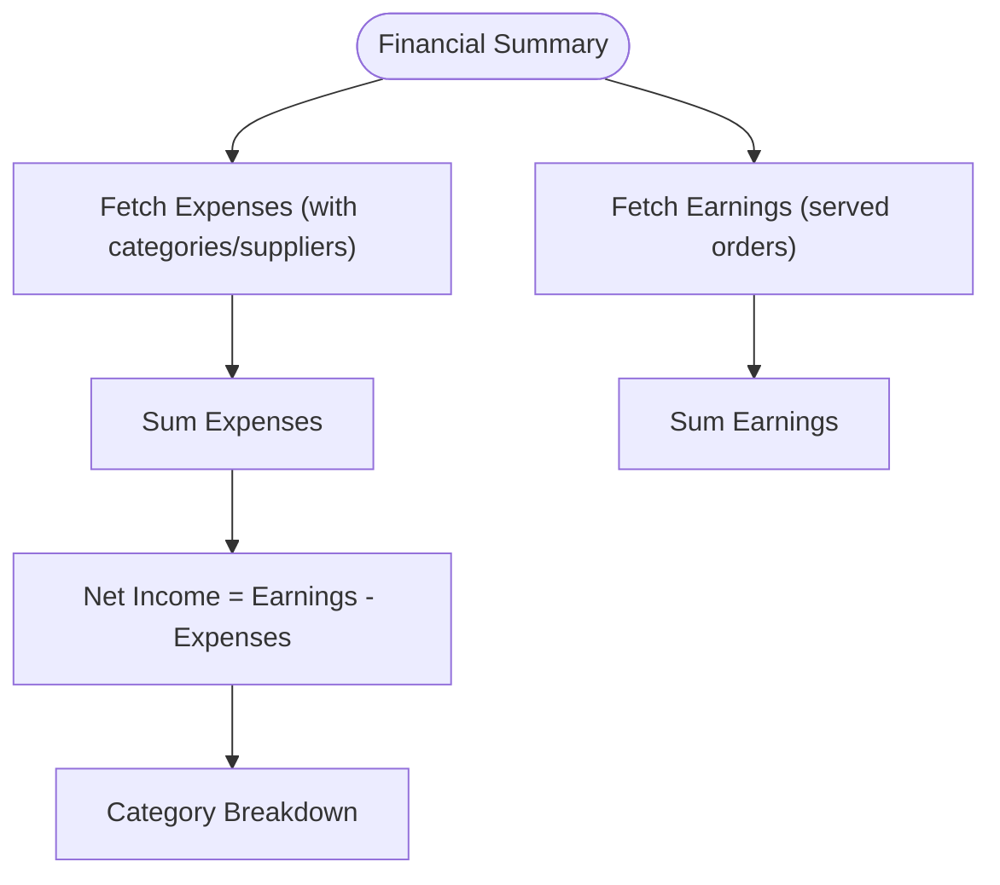
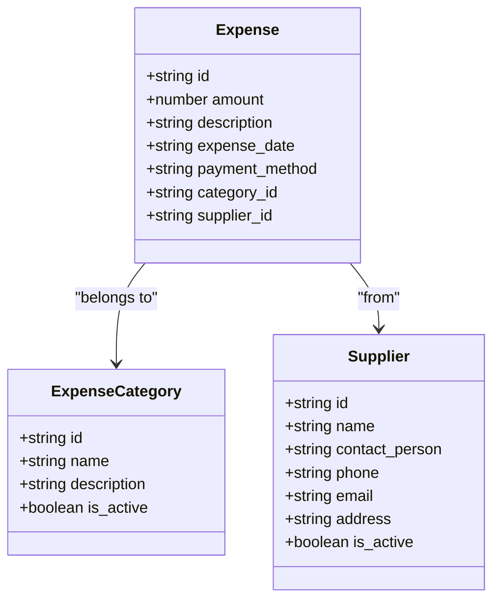
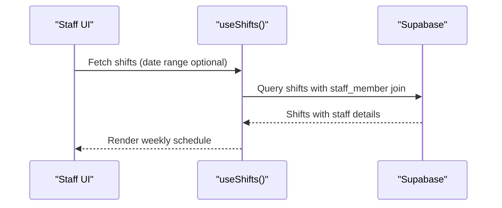
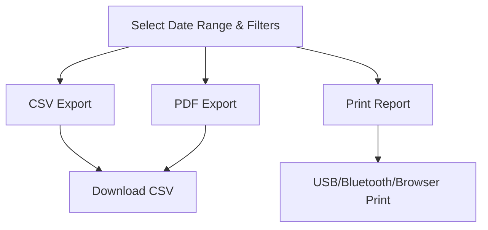
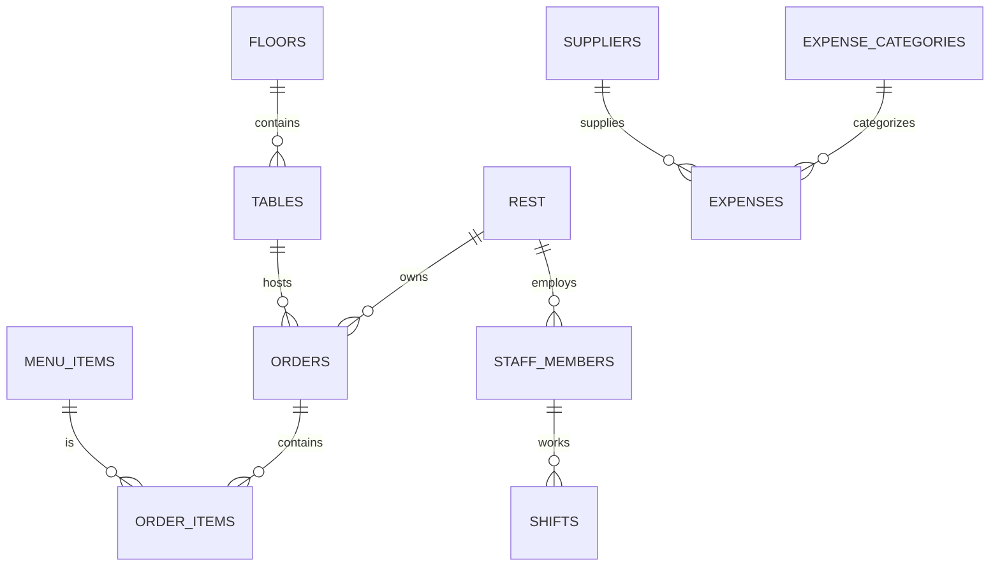
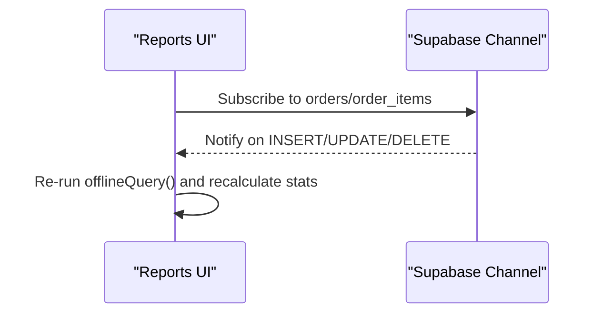
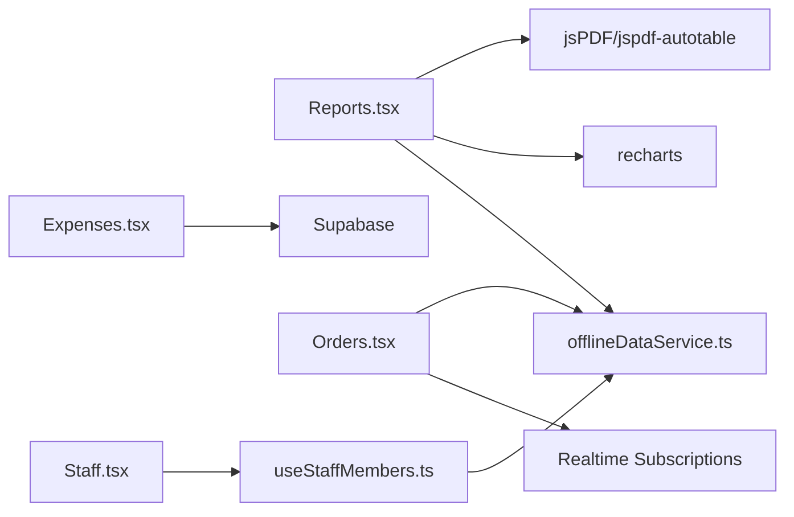

# Reporting & Analytics

<cite>
**Referenced Files in This Document**
- [Reports.tsx](file://src/pages/dashboard/Reports.tsx)
- [Expenses.tsx](file://src/pages/dashboard/Expenses.tsx)
- [Orders.tsx](file://src/pages/dashboard/Orders.tsx)
- [offlineDataService.ts](file://src/services/offlineDataService.ts)
- [useStaffMembers.ts](file://src/hooks/useStaffMembers.ts)
- [ShiftScheduler.tsx](file://src/components/staff/ShiftScheduler.tsx)
- [StaffMemberCard.tsx](file://src/components/staff/StaffMemberCard.tsx)
- [20251206042902_fc2b1d91-eb8e-4750-90c3-95b7e0feb6ba.sql](file://supabase/migrations/20251206042902_fc2b1d91-eb8e-4750-90c3-95b7e0feb6ba.sql)
- [20251206062448_4e2d7da9-9519-48ae-9d6c-bb1c994ed84a.sql](file://supabase/migrations/20251206062448_4e2d7da9-9519-48ae-9d6c-bb1c994ed84a.sql)
- [20251206132719_11d13f91-c469-437f-9d98-63127362f20c.sql](file://supabase/migrations/20251206132719_11d13f91-c469-437f-9d98-63127362f20c.sql)
- [20251206133509_50399ee0-7c3e-4927-bf1a-00556ef24c8c.sql](file://supabase/migrations/20251206133509_50399ee0-7c3e-4927-bf1a-00556ef24c8c.sql)
</cite>

## Table of Contents
1. [Introduction](#introduction)
2. [Project Structure](#project-structure)
3. [Core Components](#core-components)
4. [Architecture Overview](#architecture-overview)
5. [Detailed Component Analysis](#detailed-component-analysis)
6. [Dependency Analysis](#dependency-analysis)
7. [Performance Considerations](#performance-considerations)
8. [Troubleshooting Guide](#troubleshooting-guide)
9. [Conclusion](#conclusion)

## Introduction
This document explains the reporting and analytics capabilities of TableFlow Pro. It covers sales reports and analytics, staff performance insights, financial summaries, expense tracking, and custom report generation. It also documents data export functionality (CSV and PDF), report printing to thermal printers, dashboard visualizations, the reporting data model, aggregation strategies, offline-first processing, and integration with orders and staff management systems.

## Project Structure
Reporting and analytics functionality is centered around:
- Sales and order analytics dashboard
- Financial summary and expense tracking
- Staff scheduling and visibility for performance monitoring
- Offline-first data access and export/printing



**Diagram sources**
- [Reports.tsx:580-2156](file://src/pages/dashboard/Reports.tsx#L580-L2156)
- [Orders.tsx:134-1119](file://src/pages/dashboard/Orders.tsx#L134-L1119)
- [Expenses.tsx:48-780](file://src/pages/dashboard/Expenses.tsx#L48-L780)
- [offlineDataService.ts:151-347](file://src/services/offlineDataService.ts#L151-L347)
- [20251206042902_fc2b1d91-eb8e-4750-90c3-95b7e0feb6ba.sql:84-108](file://supabase/migrations/20251206042902_fc2b1d91-eb8e-4750-90c3-95b7e0feb6ba.sql#L84-L108)

**Section sources**
- [Reports.tsx:580-2156](file://src/pages/dashboard/Reports.tsx#L580-L2156)
- [Expenses.tsx:48-780](file://src/pages/dashboard/Expenses.tsx#L48-L780)
- [Orders.tsx:134-1119](file://src/pages/dashboard/Orders.tsx#L134-L1119)
- [offlineDataService.ts:151-347](file://src/services/offlineDataService.ts#L151-L347)

## Core Components
- Sales Analytics Dashboard: Provides summary cards, charts, and order history with filters and exports.
- Financial Summary: Tracks earnings, expenses, and net income with category breakdowns.
- Expense Management: Records expenses, categorizes, links suppliers, and generates financial reports.
- Staff Performance Monitoring: Shift scheduling and visibility for workforce planning.
- Offline-First Data Access: SQLite caching and manual sync for reliable reporting in disconnected environments.

**Section sources**
- [Reports.tsx:902-1059](file://src/pages/dashboard/Reports.tsx#L902-L1059)
- [Expenses.tsx:129-140](file://src/pages/dashboard/Expenses.tsx#L129-L140)
- [offlineDataService.ts:151-347](file://src/services/offlineDataService.ts#L151-L347)

## Architecture Overview
The reporting pipeline integrates UI components with Supabase-backed data and an offline SQLite layer. Real-time subscriptions update order analytics live. Offline mode prioritizes local SQLite for reads and defers writes until connectivity is restored.

```mermaid
sequenceDiagram
participant UI as "Reports UI"
participant OFF as "offlineQuery()"
participant DB as "SQLite (Electron)"
participant SUPA as "Supabase"
UI->>OFF : Request orders for date range
alt Electron/LAN Mode
OFF->>DB : Query orders + related tables
DB-->>OFF : Cached data (fromCache=true)
OFF-->>UI : Orders with joined metadata
else Web Mode
OFF->>SUPA : Query orders with relations
SUPA-->>OFF : Cloud data (fromCache=false)
OFF-->>UI : Orders with joined metadata
end
```

**Diagram sources**
- [Reports.tsx:718-882](file://src/pages/dashboard/Reports.tsx#L718-L882)
- [offlineDataService.ts:151-211](file://src/services/offlineDataService.ts#L151-L211)

## Detailed Component Analysis

### Sales Reports and Analytics
- Summary metrics: total revenue, completed orders, average order value, pending orders, and GST breakdown.
- Payment method breakdown: cash, online (card/upi), and unpaid.
- Popular items: top-selling dishes by quantity and revenue.
- Charts: hourly/daily trends, order status distribution, and top items bar chart.
- Filters and pagination: status, payment method, and text search in history.
- Exports: CSV and PDF with generated headers and tables.
- Printing: thermal printer support via USB/BT/browser fallback.



**Diagram sources**
- [Reports.tsx:696-1059](file://src/pages/dashboard/Reports.tsx#L696-L1059)
- [Reports.tsx:1059-1220](file://src/pages/dashboard/Reports.tsx#L1059-L1220)
- [Reports.tsx:1232-1376](file://src/pages/dashboard/Reports.tsx#L1232-L1376)

**Section sources**
- [Reports.tsx:902-1059](file://src/pages/dashboard/Reports.tsx#L902-L1059)
- [Reports.tsx:1059-1220](file://src/pages/dashboard/Reports.tsx#L1059-L1220)
- [Reports.tsx:1232-1376](file://src/pages/dashboard/Reports.tsx#L1232-L1376)

### Financial Summary Reports
- Earnings: served orders within the selected period.
- Expenses: categorized and supplier-linked costs.
- Net income: earnings minus total expenses.
- Category breakdown: visual progress bars for expense distribution.



**Diagram sources**
- [Expenses.tsx:129-140](file://src/pages/dashboard/Expenses.tsx#L129-L140)
- [Expenses.tsx:111-127](file://src/pages/dashboard/Expenses.tsx#L111-L127)
- [Expenses.tsx:290-299](file://src/pages/dashboard/Expenses.tsx#L290-L299)

**Section sources**
- [Expenses.tsx:129-140](file://src/pages/dashboard/Expenses.tsx#L129-L140)
- [Expenses.tsx:111-127](file://src/pages/dashboard/Expenses.tsx#L111-L127)
- [Expenses.tsx:290-299](file://src/pages/dashboard/Expenses.tsx#L290-L299)

### Expense Tracking Integration
- Categories and suppliers management.
- Expense recording with amount, date, description, category, supplier, and payment method.
- Financial reporting: earnings vs. expenses, net income, and category-wise spend.



**Diagram sources**
- [Expenses.tsx:36-46](file://src/pages/dashboard/Expenses.tsx#L36-L46)
- [20251206042902_fc2b1d91-eb8e-4750-90c3-95b7e0feb6ba.sql:110-119](file://supabase/migrations/20251206042902_fc2b1d91-eb8e-4750-90c3-95b7e0feb6ba.sql#L110-L119)

**Section sources**
- [Expenses.tsx:48-780](file://src/pages/dashboard/Expenses.tsx#L48-L780)

### Staff Performance Reports
- Shift scheduling: weekly calendar with add/delete actions.
- Staff visibility: active/inactive toggles and role badges.
- Integration: staff members and shifts inform workforce planning and performance monitoring.



**Diagram sources**
- [useStaffMembers.ts:150-186](file://src/hooks/useStaffMembers.ts#L150-L186)
- [ShiftScheduler.tsx:40-275](file://src/components/staff/ShiftScheduler.tsx#L40-L275)

**Section sources**
- [useStaffMembers.ts:150-186](file://src/hooks/useStaffMembers.ts#L150-L186)
- [ShiftScheduler.tsx:40-275](file://src/components/staff/ShiftScheduler.tsx#L40-L275)
- [StaffMemberCard.tsx:40-140](file://src/components/staff/StaffMemberCard.tsx#L40-L140)

### Custom Report Generation and Export
- CSV export: filtered order history to spreadsheet-friendly format.
- PDF export: multi-page report with summary, top items, and order details.
- Print to thermal: bill-style report with restaurant header and payment breakdown.



**Diagram sources**
- [Reports.tsx:1059-1100](file://src/pages/dashboard/Reports.tsx#L1059-L1100)
- [Reports.tsx:1102-1219](file://src/pages/dashboard/Reports.tsx#L1102-L1219)
- [Reports.tsx:1232-1376](file://src/pages/dashboard/Reports.tsx#L1232-L1376)

**Section sources**
- [Reports.tsx:1059-1100](file://src/pages/dashboard/Reports.tsx#L1059-L1100)
- [Reports.tsx:1102-1219](file://src/pages/dashboard/Reports.tsx#L1102-L1219)
- [Reports.tsx:1232-1376](file://src/pages/dashboard/Reports.tsx#L1232-L1376)

### Reporting Data Model and Aggregation Strategies
- Core entities: orders, order_items, tables, floors, restaurants, staff_members, shifts, expenses, expense_categories, suppliers.
- Aggregations:
  - Revenue: sum of total_amount for served orders.
  - Average order value: revenue / served orders count.
  - Payment breakdown: cash vs. online vs. unpaid.
  - Popular items: quantity and revenue per menu item (served orders only).
  - Status distribution: counts per order_status.
  - Daily/hourly trends: counts and revenue grouped by date/hour.



**Diagram sources**
- [20251206042902_fc2b1d91-eb8e-4750-90c3-95b7e0feb6ba.sql:84-108](file://supabase/migrations/20251206042902_fc2b1d91-eb8e-4750-90c3-95b7e0feb6ba.sql#L84-L108)
- [20251206042902_fc2b1d91-eb8e-4750-90c3-95b7e0feb6ba.sql:17-55](file://supabase/migrations/20251206042902_fc2b1d91-eb8e-4750-90c3-95b7e0feb6ba.sql#L17-L55)

**Section sources**
- [Reports.tsx:902-1059](file://src/pages/dashboard/Reports.tsx#L902-L1059)
- [20251206042902_fc2b1d91-eb8e-4750-90c3-95b7e0feb6ba.sql:84-108](file://supabase/migrations/20251206042902_fc2b1d91-eb8e-4750-90c3-95b7e0feb6ba.sql#L84-L108)

### Real-Time Analytics Processing
- Real-time subscriptions for orders and order_items to keep analytics updated without manual refresh.
- Visibility-aware refresh to re-fetch data when the page becomes visible again.



**Diagram sources**
- [Orders.tsx:308-350](file://src/pages/dashboard/Orders.tsx#L308-L350)
- [Reports.tsx:888-899](file://src/pages/dashboard/Reports.tsx#L888-L899)

**Section sources**
- [Orders.tsx:308-350](file://src/pages/dashboard/Orders.tsx#L308-L350)
- [Reports.tsx:888-899](file://src/pages/dashboard/Reports.tsx#L888-L899)

### Practical Examples
- Sales report creation workflow:
  - Select date range (today/yesterday/week/month/custom).
  - Apply filters (status, payment method, search).
  - Export to CSV/PDF or print a bill-style summary.
- Financial report creation:
  - Choose date range in Expenses tab.
  - View earnings, total expenses, and net income.
  - Drill down by category and supplier.
- Staff performance monitoring:
  - Navigate to Staff > Schedule.
  - Review weekly shifts and add/remove entries.
- Historical analysis:
  - Use the History tab filters to narrow down orders.
  - Paginate through results and export filtered data.

**Section sources**
- [Reports.tsx:1443-1492](file://src/pages/dashboard/Reports.tsx#L1443-L1492)
- [Expenses.tsx:316-339](file://src/pages/dashboard/Expenses.tsx#L316-L339)
- [ShiftScheduler.tsx:77-108](file://src/components/staff/ShiftScheduler.tsx#L77-L108)

## Dependency Analysis
- Reports.tsx depends on:
  - offlineQuery for data retrieval and assembly.
  - recharts for visualization.
  - jsPDF/jspdf-autotable for PDF export.
  - thermal printer hooks for printing.
- Expenses.tsx depends on:
  - Supabase queries for earnings and expenses.
  - Local state for category/supplier/expense CRUD.
- Orders.tsx integrates with:
  - Real-time subscriptions for live updates.
  - Offline mutations for order lifecycle changes.
- Staff.tsx integrates with:
  - useStaffMembers/useShifts hooks for staff and scheduling.



**Diagram sources**
- [Reports.tsx:580-2156](file://src/pages/dashboard/Reports.tsx#L580-L2156)
- [Expenses.tsx:48-780](file://src/pages/dashboard/Expenses.tsx#L48-L780)
- [Orders.tsx:134-1119](file://src/pages/dashboard/Orders.tsx#L134-L1119)
- [offlineDataService.ts:151-347](file://src/services/offlineDataService.ts#L151-L347)
- [useStaffMembers.ts:36-143](file://src/hooks/useStaffMembers.ts#L36-L143)

**Section sources**
- [Reports.tsx:580-2156](file://src/pages/dashboard/Reports.tsx#L580-L2156)
- [Expenses.tsx:48-780](file://src/pages/dashboard/Expenses.tsx#L48-L780)
- [Orders.tsx:134-1119](file://src/pages/dashboard/Orders.tsx#L134-L1119)
- [offlineDataService.ts:151-347](file://src/services/offlineDataService.ts#L151-L347)
- [useStaffMembers.ts:36-143](file://src/hooks/useStaffMembers.ts#L36-L143)

## Performance Considerations
- Offline-first architecture ensures fast loads and resilience in disconnected environments.
- Aggregations are computed client-side from cached data, minimizing network requests.
- Real-time subscriptions reduce polling overhead and keep analytics fresh.
- Export operations (CSV/PDF) process filtered datasets to limit payload sizes.

[No sources needed since this section provides general guidance]

## Troubleshooting Guide
- Offline mode issues:
  - Verify SQLite availability in Electron/LAN modes.
  - Use manual sync to upload pending changes to cloud.
- Export failures:
  - Ensure filtered dataset is non-empty before exporting.
  - Confirm browser print permissions for browser fallback printing.
- Real-time updates not appearing:
  - Check online status and re-subscribe if needed.
  - Refresh page to re-establish subscriptions.

**Section sources**
- [offlineDataService.ts:351-372](file://src/services/offlineDataService.ts#L351-L372)
- [offlineDataService.ts:397-541](file://src/services/offlineDataService.ts#L397-L541)
- [Reports.tsx:1410-1441](file://src/pages/dashboard/Reports.tsx#L1410-L1441)
- [Orders.tsx:308-350](file://src/pages/dashboard/Orders.tsx#L308-L350)

## Conclusion
TableFlow Pro’s reporting and analytics system combines a robust offline-first data layer with powerful UI components to deliver sales insights, financial summaries, and staff performance visibility. With flexible filters, export options, and real-time updates, it supports informed decision-making across day-to-day operations and long-term planning.