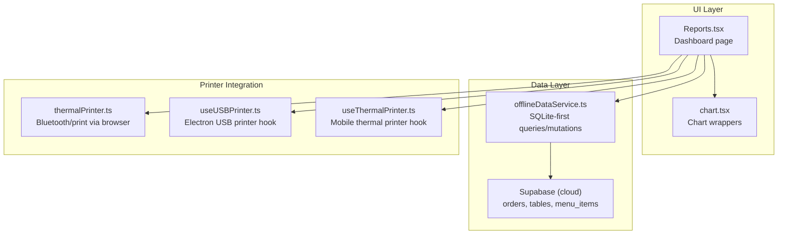
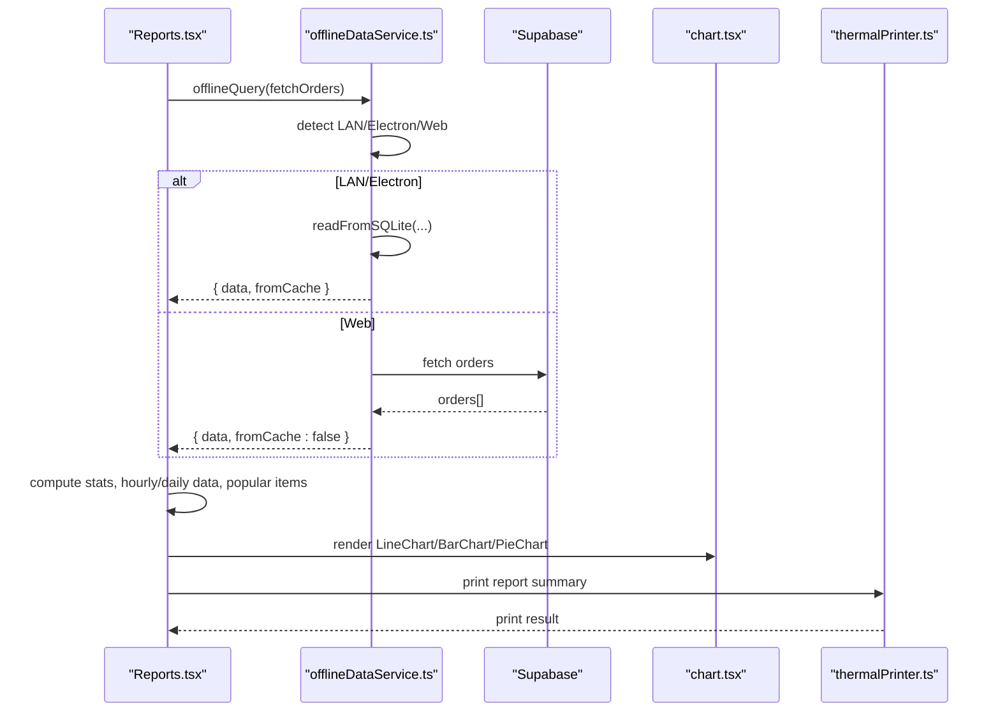
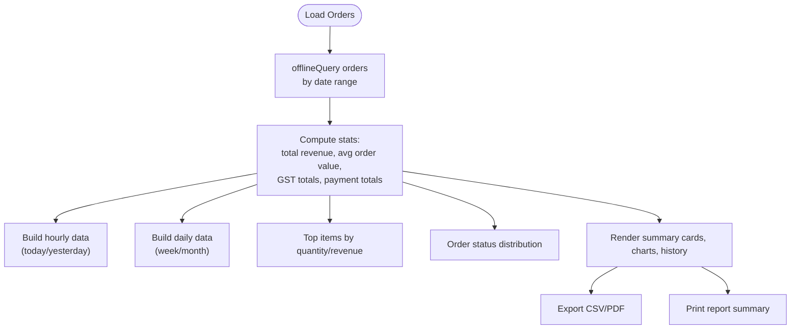
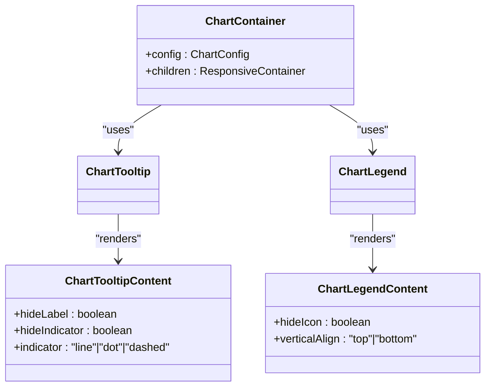
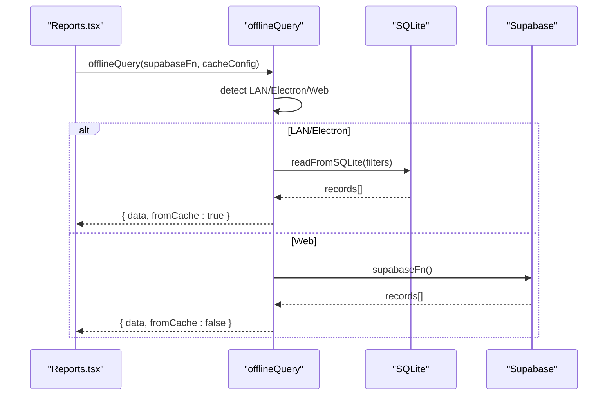
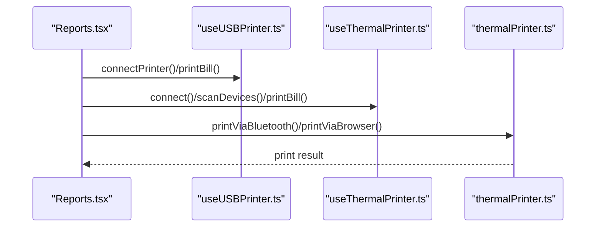
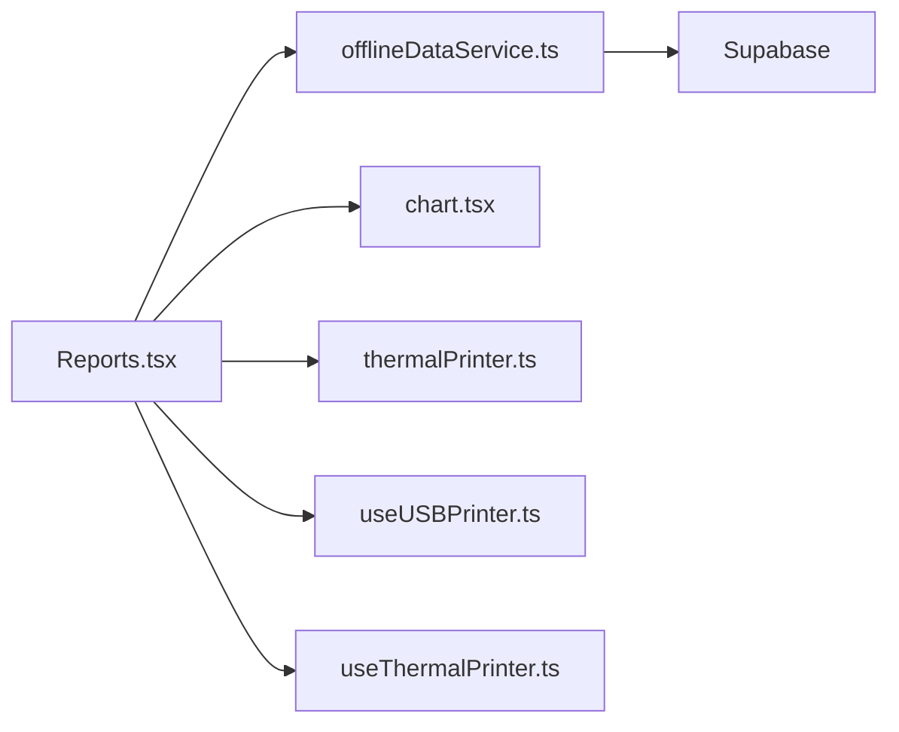

# Sales Reports & Analytics

<cite>
**Referenced Files in This Document**
- [Reports.tsx](file://src/pages/dashboard/Reports.tsx)
- [chart.tsx](file://src/components/ui/chart.tsx)
- [offlineDataService.ts](file://src/services/offlineDataService.ts)
- [thermalPrinter.ts](file://src/services/thermalPrinter.ts)
- [useUSBPrinter.ts](file://src/hooks/useUSBPrinter.ts)
- [useThermalPrinter.ts](file://src/hooks/useThermalPrinter.ts)
- [README.md](file://README.md)
</cite>

## Table of Contents
1. [Introduction](#introduction)
2. [Project Structure](#project-structure)
3. [Core Components](#core-components)
4. [Architecture Overview](#architecture-overview)
5. [Detailed Component Analysis](#detailed-component-analysis)
6. [Dependency Analysis](#dependency-analysis)
7. [Performance Considerations](#performance-considerations)
8. [Troubleshooting Guide](#troubleshooting-guide)
9. [Conclusion](#conclusion)

## Introduction
This document explains the sales reporting and analytics module for TableFlow Pro. It covers daily, weekly, monthly, and custom date-range sales analytics, including revenue tracking, order volume metrics, average order value calculations, and payment method breakdowns. It documents the sales dashboard interface with bar charts, pie charts, and trend analysis visualizations, revenue aggregation by payment methods (cash, online), GST calculations, and top-selling menu items analysis. Practical examples describe report filtering, date range selection, and export functionality. It also explains the integration with the order management system for real-time sales data updates and offline-first reporting capabilities.

## Project Structure
The sales reporting module is implemented as a dedicated dashboard page with reusable chart components and offline-first data services. The key areas are:
- Reports page: orchestrates data fetching, analytics computation, and UI rendering
- Chart components: reusable wrappers around recharts for consistent styling and tooltips
- Offline data service: SQLite-first architecture for local operation and cloud sync controls
- Thermal printer integration: native mobile and Electron USB/BT printing for receipts and report summaries

**Diagram sources**
- [Reports.tsx:580-2156](file://src/pages/dashboard/Reports.tsx#L580-L2156)
- [chart.tsx:1-304](file://src/components/ui/chart.tsx#L1-L304)
- [offlineDataService.ts:151-361](file://src/services/offlineDataService.ts#L151-L361)
- [thermalPrinter.ts:1-339](file://src/services/thermalPrinter.ts#L1-L339)
- [useUSBPrinter.ts:1-112](file://src/hooks/useUSBPrinter.ts#L1-L112)
- [useThermalPrinter.ts:1-68](file://src/hooks/useThermalPrinter.ts#L1-L68)

**Section sources**
- [README.md:1-13](file://README.md#L1-L13)

## Core Components
- Reports page: Implements date range selection, filtering, analytics computation, and export/printing. Provides summary cards, charts, and order history.
- Chart wrappers: Provide consistent styling, tooltips, legends, and responsive containers for recharts.
- Offline data service: SQLite-first query and mutation with LAN/Electron/Web modes, soft deletes, and pending sync markers.
- Printer integration: Mobile thermal printing via Bluetooth and browser fallback; Electron USB printing with device discovery and Windows printer switching.

**Section sources**
- [Reports.tsx:580-2156](file://src/pages/dashboard/Reports.tsx#L580-L2156)
- [chart.tsx:1-304](file://src/components/ui/chart.tsx#L1-L304)
- [offlineDataService.ts:151-361](file://src/services/offlineDataService.ts#L151-L361)
- [thermalPrinter.ts:1-339](file://src/services/thermalPrinter.ts#L1-L339)
- [useUSBPrinter.ts:1-112](file://src/hooks/useUSBPrinter.ts#L1-L112)
- [useThermalPrinter.ts:1-68](file://src/hooks/useThermalPrinter.ts#L1-L68)

## Architecture Overview
The sales reporting architecture follows an offline-first model:
- Data retrieval: The Reports page uses offlineQuery to read from local SQLite first (Electron/LAN), falling back to cloud Supabase in web mode.
- Analytics: Computation of revenue, order counts, averages, GST, payment breakdowns, and top items occurs client-side from loaded orders.
- Visualization: Charts render using recharts with shared chart wrappers for consistent styling and tooltips.
- Printing: Receipts and report summaries can be printed via Bluetooth (mobile), USB (Electron), or browser fallback.

**Diagram sources**
- [Reports.tsx:718-882](file://src/pages/dashboard/Reports.tsx#L718-L882)
- [offlineDataService.ts:151-211](file://src/services/offlineDataService.ts#L151-L211)
- [chart.tsx:32-58](file://src/components/ui/chart.tsx#L32-L58)
- [thermalPrinter.ts:118-219](file://src/services/thermalPrinter.ts#L118-L219)

## Detailed Component Analysis

### Sales Reports Page (Reports.tsx)
Responsibilities:
- Date range selection: Today, Yesterday, This Week, This Month, Custom with calendar pickers.
- Filtering: Status, payment method, and free-text search across items and tables.
- Analytics computation: Revenue, order counts, average order value, GST breakdown, payment method totals, top items.
- Visualizations: Line chart (hourly/daily), pie chart (status distribution), bar chart (top items).
- Export: CSV and PDF exports of filtered orders.
- Printing: Report summary to thermal printer via Bluetooth/USB/browser fallback.

Key computations:
- Revenue and GST: Subtotal (excl. GST), CGST/SGST amounts, Grand Total (incl. GST) using restaurant settings.
- Payment method breakdown: Cash, Online (card/upi), Not Recorded.
- Top selling items: Aggregated by quantity and revenue.

**Diagram sources**
- [Reports.tsx:901-1032](file://src/pages/dashboard/Reports.tsx#L901-L1032)
- [Reports.tsx:1693-1832](file://src/pages/dashboard/Reports.tsx#L1693-L1832)

**Section sources**
- [Reports.tsx:580-2156](file://src/pages/dashboard/Reports.tsx#L580-L2156)

### Chart Components (chart.tsx)
Provides:
- ChartContainer: wraps recharts with consistent styling and theme support.
- ChartTooltip/ChartTooltipContent: standardized tooltips with indicators and formatters.
- ChartLegend/ChartLegendContent: legend rendering with icons and labels.
- Responsive container integration for charts.

**Diagram sources**
- [chart.tsx:32-275](file://src/components/ui/chart.tsx#L32-L275)

**Section sources**
- [chart.tsx:1-304](file://src/components/ui/chart.tsx#L1-L304)

### Offline Data Service (offlineDataService.ts)
Capabilities:
- offlineQuery: SQLite-first, LAN/Electron/Web detection; returns from cache or cloud; supports forceRefresh.
- offlineMutate: Upserts to SQLite with pending_sync; preserves timestamps; supports LAN/Electron/Web.
- offlineDelete: Soft-deletes by marking pending_delete; preserves data integrity.
- LAN/Electron/Web routing: Different behavior per environment.

**Diagram sources**
- [offlineDataService.ts:151-211](file://src/services/offlineDataService.ts#L151-L211)

**Section sources**
- [offlineDataService.ts:151-361](file://src/services/offlineDataService.ts#L151-L361)

### Printer Integrations
- Mobile thermal printing: Bluetooth scanning, connect, and print via ESC/POS commands; browser fallback for receipts.
- Electron USB printing: Device discovery, connect/disconnect, print via USB endpoint; Windows printer switching.

**Diagram sources**
- [useUSBPrinter.ts:72-98](file://src/hooks/useUSBPrinter.ts#L72-L98)
- [useThermalPrinter.ts:28-54](file://src/hooks/useThermalPrinter.ts#L28-L54)
- [thermalPrinter.ts:118-219](file://src/services/thermalPrinter.ts#L118-L219)

**Section sources**
- [thermalPrinter.ts:1-339](file://src/services/thermalPrinter.ts#L1-L339)
- [useUSBPrinter.ts:1-112](file://src/hooks/useUSBPrinter.ts#L1-L112)
- [useThermalPrinter.ts:1-68](file://src/hooks/useThermalPrinter.ts#L1-L68)

## Dependency Analysis
- Reports.tsx depends on:
  - Restaurant context for current restaurant settings (including GST percentages).
  - Offline data service for orders and related entities.
  - Chart components for visualization.
  - Printer hooks/services for printing receipts and report summaries.
- offlineDataService.ts abstracts environment-specific behavior (LAN/Electron/Web) behind a unified API.
- Chart components encapsulate recharts styling and interactivity.

**Diagram sources**
- [Reports.tsx:580-2156](file://src/pages/dashboard/Reports.tsx#L580-L2156)
- [offlineDataService.ts:151-361](file://src/services/offlineDataService.ts#L151-L361)
- [chart.tsx:1-304](file://src/components/ui/chart.tsx#L1-L304)
- [thermalPrinter.ts:1-339](file://src/services/thermalPrinter.ts#L1-L339)
- [useUSBPrinter.ts:1-112](file://src/hooks/useUSBPrinter.ts#L1-L112)
- [useThermalPrinter.ts:1-68](file://src/hooks/useThermalPrinter.ts#L1-L68)

**Section sources**
- [Reports.tsx:580-2156](file://src/pages/dashboard/Reports.tsx#L580-L2156)
- [offlineDataService.ts:151-361](file://src/services/offlineDataService.ts#L151-L361)

## Performance Considerations
- Offline-first data retrieval reduces network latency and enables operation without connectivity.
- Client-side analytics computations (stats, hourly/daily series, top items) minimize server round-trips.
- Responsive charts adapt to viewport size; consider limiting data points for long date ranges to keep rendering smooth.
- Export operations (CSV/PDF) should be throttled to avoid blocking the UI; the implementation already disables buttons during export.

## Troubleshooting Guide
Common issues and resolutions:
- No orders displayed:
  - Verify date range selection and custom date range boundaries.
  - Confirm offline data availability; in LAN/Electron, ensure SQLite has records for the selected period.
- Export failures:
  - CSV/PDF export requires filtered orders; ensure filters are not overly restrictive.
  - Network errors in web mode may prevent cloud fetch; confirm connectivity.
- Printing issues:
  - Bluetooth: Ensure device is paired and connected; scanning and connecting are supported on mobile.
  - USB: In Electron, ensure printer is plugged in and device list is refreshed; Windows printer selection is available.
  - Browser fallback: Allow popups for print preview windows.

Operational tips:
- Use the visibility change listener to refresh data when the page becomes visible.
- For LAN mode, ensure LAN client status indicates a connected server before expecting data.

**Section sources**
- [Reports.tsx:888-899](file://src/pages/dashboard/Reports.tsx#L888-L899)
- [offlineDataService.ts:157-174](file://src/services/offlineDataService.ts#L157-L174)

## Conclusion
TableFlow Pro’s sales reporting module delivers comprehensive analytics with a focus on usability and reliability. It provides daily, weekly, monthly, and custom date-range insights, payment method breakdowns, GST calculations, and top-selling items. The offline-first architecture ensures robustness across environments, while integrated printing capabilities streamline receipt and report distribution. The modular design of the Reports page, chart wrappers, and offline data service promotes maintainability and extensibility.