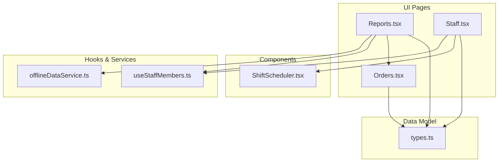
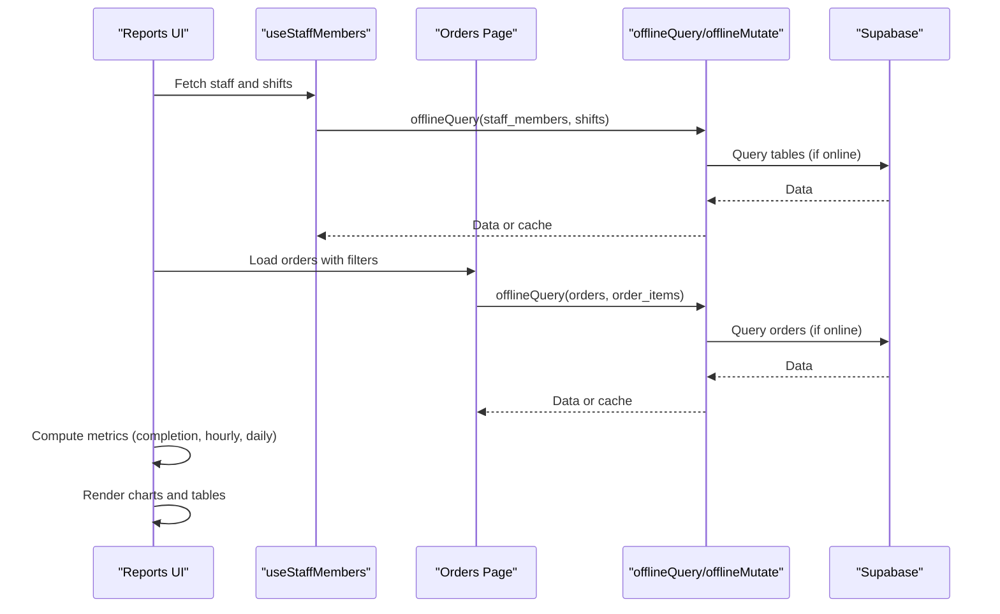
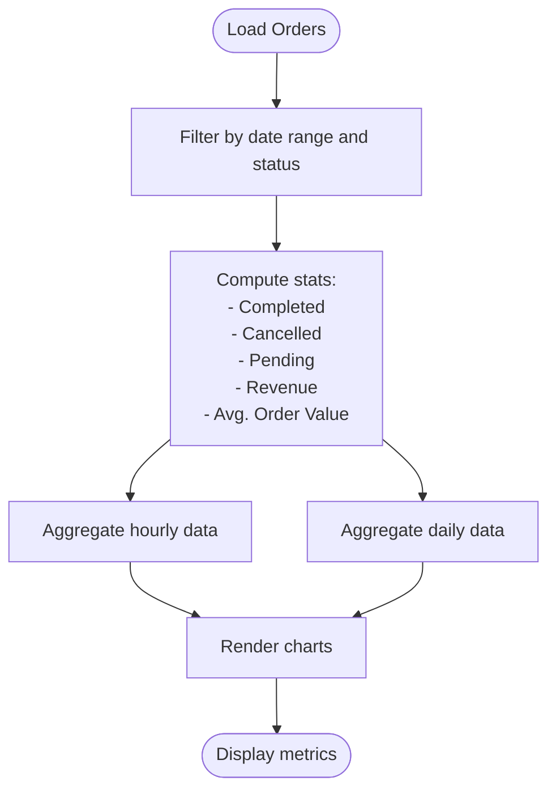
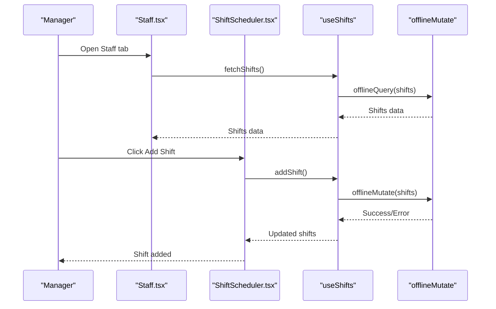
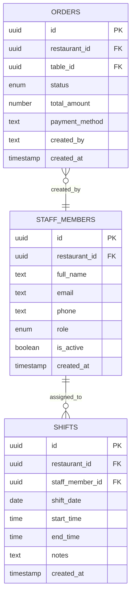
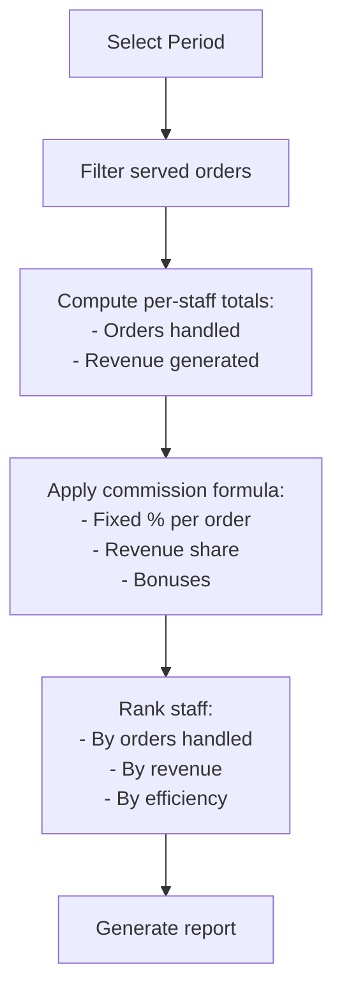
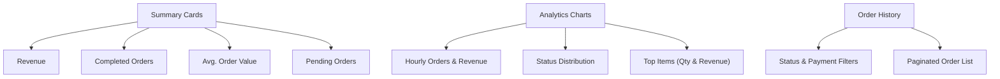
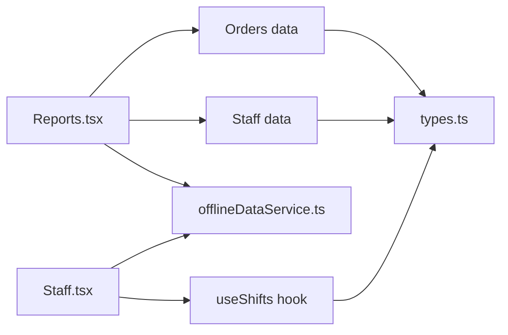

# Staff Performance Reports

<cite>
**Referenced Files in This Document**
- [Reports.tsx](file://src/pages/dashboard/Reports.tsx)
- [Staff.tsx](file://src/pages/dashboard/Staff.tsx)
- [ShiftScheduler.tsx](file://src/components/staff/ShiftScheduler.tsx)
- [useStaffMembers.ts](file://src/hooks/useStaffMembers.ts)
- [types.ts](file://src/integrations/supabase/types.ts)
- [offlineDataService.ts](file://src/services/offlineDataService.ts)
- [Orders.tsx](file://src/pages/dashboard/Orders.tsx)
</cite>

## Table of Contents
1. [Introduction](#introduction)
2. [Project Structure](#project-structure)
3. [Core Components](#core-components)
4. [Architecture Overview](#architecture-overview)
5. [Detailed Component Analysis](#detailed-component-analysis)
6. [Dependency Analysis](#dependency-analysis)
7. [Performance Considerations](#performance-considerations)
8. [Troubleshooting Guide](#troubleshooting-guide)
9. [Conclusion](#conclusion)

## Introduction
This document provides comprehensive staff performance reporting documentation for TableFlow Pro. It explains how to analyze staff productivity metrics (orders handled per shift, completion rates, peak performance hours), integrate scheduling for accurate performance attribution, and track individual contributions. It also covers performance ranking, commission calculation patterns, and team analytics, while detailing the integration with the staff management system and order assignment tracking.

## Project Structure
TableFlow Pro organizes staff performance reporting around:
- Reports dashboard for analytics and historical order tracking
- Staff management for adding, editing, and scheduling employees
- Hooks and services that provide offline-first data access and synchronization
- Supabase schema types that define the underlying data model

**Diagram sources**
- [Reports.tsx:580-2156](file://src/pages/dashboard/Reports.tsx#L580-L2156)
- [Staff.tsx:15-204](file://src/pages/dashboard/Staff.tsx#L15-L204)
- [ShiftScheduler.tsx:40-274](file://src/components/staff/ShiftScheduler.tsx#L40-L274)
- [useStaffMembers.ts:36-254](file://src/hooks/useStaffMembers.ts#L36-L254)
- [offlineDataService.ts:151-287](file://src/services/offlineDataService.ts#L151-L287)
- [types.ts:465-515](file://src/integrations/supabase/types.ts#L465-L515)

**Section sources**
- [Reports.tsx:580-2156](file://src/pages/dashboard/Reports.tsx#L580-L2156)
- [Staff.tsx:15-204](file://src/pages/dashboard/Staff.tsx#L15-L204)
- [ShiftScheduler.tsx:40-274](file://src/components/staff/ShiftScheduler.tsx#L40-L274)
- [useStaffMembers.ts:36-254](file://src/hooks/useStaffMembers.ts#L36-L254)
- [offlineDataService.ts:151-287](file://src/services/offlineDataService.ts#L151-L287)
- [types.ts:465-515](file://src/integrations/supabase/types.ts#L465-L515)

## Core Components
- Reports dashboard: Aggregates order data, computes performance metrics, and visualizes analytics.
- Staff management: Adds/editing staff, toggles activity, and manages schedules.
- Shift scheduler: Weekly view for assigning staff to shifts.
- Data hooks: Fetch and mutate staff and shift data with offline-first caching.
- Offline service: SQLite-first data access with optional cloud sync.

Key responsibilities:
- Staff productivity metrics: Orders handled per shift, completion rates, peak hours.
- Performance attribution: Link orders to staff via created_by or assignment patterns.
- Ranking and commission: Use served orders and quantities as basis for ranking; derive commission from revenue or fixed percentages.
- Team analytics: Compare throughput, revenue, and efficiency across roles.

**Section sources**
- [Reports.tsx:902-942](file://src/pages/dashboard/Reports.tsx#L902-L942)
- [Reports.tsx:967-1010](file://src/pages/dashboard/Reports.tsx#L967-L1010)
- [Staff.tsx:15-204](file://src/pages/dashboard/Staff.tsx#L15-L204)
- [ShiftScheduler.tsx:40-274](file://src/components/staff/ShiftScheduler.tsx#L40-L274)
- [useStaffMembers.ts:36-254](file://src/hooks/useStaffMembers.ts#L36-L254)
- [offlineDataService.ts:151-287](file://src/services/offlineDataService.ts#L151-L287)

## Architecture Overview
The system integrates staff and order data to produce performance insights. The Reports page consumes order data and applies filters by date range and status. Staff and shift data are fetched via hooks and used to attribute performance to individuals or roles.

**Diagram sources**
- [Reports.tsx:718-882](file://src/pages/dashboard/Reports.tsx#L718-L882)
- [useStaffMembers.ts:36-143](file://src/hooks/useStaffMembers.ts#L36-L143)
- [offlineDataService.ts:151-211](file://src/services/offlineDataService.ts#L151-L211)
- [Orders.tsx:170-289](file://src/pages/dashboard/Orders.tsx#L170-L289)

**Section sources**
- [Reports.tsx:718-882](file://src/pages/dashboard/Reports.tsx#L718-L882)
- [useStaffMembers.ts:36-143](file://src/hooks/useStaffMembers.ts#L36-L143)
- [offlineDataService.ts:151-211](file://src/services/offlineDataService.ts#L151-L211)
- [Orders.tsx:170-289](file://src/pages/dashboard/Orders.tsx#L170-L289)

## Detailed Component Analysis

### Staff Productivity Metrics
The Reports page calculates key productivity metrics:
- Completed orders and cancellation counts
- Average order value
- Revenue by payment method (cash, online, unpaid)
- Hourly and daily throughput
- Status distribution pie chart

These metrics enable:
- Orders handled per shift: Count served orders during each shift period.
- Completion rates: Ratio of served to total orders in a period.
- Peak performance hours: Hourly order volume and revenue spikes.

**Diagram sources**
- [Reports.tsx:902-942](file://src/pages/dashboard/Reports.tsx#L902-L942)
- [Reports.tsx:967-1010](file://src/pages/dashboard/Reports.tsx#L967-L1010)

**Section sources**
- [Reports.tsx:902-942](file://src/pages/dashboard/Reports.tsx#L902-L942)
- [Reports.tsx:967-1010](file://src/pages/dashboard/Reports.tsx#L967-L1010)

### Staff Scheduling Integration
The Staff page and ShiftScheduler component provide weekly scheduling:
- Active staff filtering
- Weekly calendar view with shift creation and deletion
- Assignment of staff to specific dates and times

**Diagram sources**
- [Staff.tsx:183-191](file://src/pages/dashboard/Staff.tsx#L183-L191)
- [ShiftScheduler.tsx:88-108](file://src/components/staff/ShiftScheduler.tsx#L88-L108)
- [useStaffMembers.ts:192-217](file://src/hooks/useStaffMembers.ts#L192-L217)
- [offlineDataService.ts:220-287](file://src/services/offlineDataService.ts#L220-L287)

**Section sources**
- [Staff.tsx:183-191](file://src/pages/dashboard/Staff.tsx#L183-L191)
- [ShiftScheduler.tsx:40-274](file://src/components/staff/ShiftScheduler.tsx#L40-L274)
- [useStaffMembers.ts:145-254](file://src/hooks/useStaffMembers.ts#L145-L254)
- [offlineDataService.ts:220-287](file://src/services/offlineDataService.ts#L220-L287)

### Performance Attribution and Order Assignment Tracking
Current schema supports:
- Orders with created_at, status, total_amount, payment_method
- Optional created_by field present in local SQLite schema (migration proposal)

Attribution patterns:
- Link served orders to staff via created_by (requires schema alignment)
- Use shift-based grouping to attribute performance to specific shifts
- Combine served orders with shift assignments to compute per-staff metrics

**Diagram sources**
- [types.ts:342-392](file://src/integrations/supabase/types.ts#L342-L392)
- [types.ts:516-530](file://src/integrations/supabase/types.ts#L516-L530)
- [types.ts:465-499](file://src/integrations/supabase/types.ts#L465-L499)
- [IMPLEMENTATION_CHECKLIST.md:438-466](file://IMPLEMENTATION_CHECKLIST.md#L438-L466)

**Section sources**
- [types.ts:342-392](file://src/integrations/supabase/types.ts#L342-L392)
- [types.ts:516-530](file://src/integrations/supabase/types.ts#L516-L530)
- [types.ts:465-499](file://src/integrations/supabase/types.ts#L465-L499)
- [IMPLEMENTATION_CHECKLIST.md:438-466](file://IMPLEMENTATION_CHECKLIST.md#L438-L466)

### Staff Commission Calculations and Rankings
Commission calculation patterns:
- Fixed percentage per served order
- Revenue share based on item revenue
- Tiered bonuses for exceeding targets

Rankings:
- Orders handled per period
- Revenue generated per period
- Efficiency metrics (avg. time per order)

[No sources needed since this diagram shows conceptual workflow, not actual code structure]

### Staff Performance Dashboards and Reviews
- Dashboard cards: Revenue, completed orders, average order value, pending orders
- Payment method breakdown: Cash vs. online vs. unpaid
- Top selling items: Quantity and revenue
- Analytics charts: Hourly/daily trends, status distribution, top items comparison
- History tab: Filterable order list with pagination

**Diagram sources**
- [Reports.tsx:1503-1689](file://src/pages/dashboard/Reports.tsx#L1503-L1689)
- [Reports.tsx:1693-1832](file://src/pages/dashboard/Reports.tsx#L1693-L1832)
- [Reports.tsx:1835-2018](file://src/pages/dashboard/Reports.tsx#L1835-L2018)

**Section sources**
- [Reports.tsx:1503-1689](file://src/pages/dashboard/Reports.tsx#L1503-L1689)
- [Reports.tsx:1693-1832](file://src/pages/dashboard/Reports.tsx#L1693-L1832)
- [Reports.tsx:1835-2018](file://src/pages/dashboard/Reports.tsx#L1835-L2018)

## Dependency Analysis
- Reports depends on:
  - Orders data for served/completion metrics
  - Staff and shift data for attribution
  - Offline service for data access and caching
- Staff management depends on:
  - Staff and shift hooks
  - Offline service for mutations
- Supabase types define the schema for orders, staff_members, and shifts

**Diagram sources**
- [Reports.tsx:718-882](file://src/pages/dashboard/Reports.tsx#L718-L882)
- [Staff.tsx:183-191](file://src/pages/dashboard/Staff.tsx#L183-L191)
- [useStaffMembers.ts:145-254](file://src/hooks/useStaffMembers.ts#L145-L254)
- [offlineDataService.ts:151-211](file://src/services/offlineDataService.ts#L151-L211)
- [types.ts:465-515](file://src/integrations/supabase/types.ts#L465-L515)

**Section sources**
- [Reports.tsx:718-882](file://src/pages/dashboard/Reports.tsx#L718-L882)
- [Staff.tsx:183-191](file://src/pages/dashboard/Staff.tsx#L183-L191)
- [useStaffMembers.ts:145-254](file://src/hooks/useStaffMembers.ts#L145-L254)
- [offlineDataService.ts:151-211](file://src/services/offlineDataService.ts#L151-L211)
- [types.ts:465-515](file://src/integrations/supabase/types.ts#L465-L515)

## Performance Considerations
- Offline-first architecture ensures availability without network connectivity.
- Local caching reduces repeated cloud queries and improves responsiveness.
- Use date-range filters and pagination to limit dataset sizes.
- Prefer indexed queries for shifts and orders to improve performance.

[No sources needed since this section provides general guidance]

## Troubleshooting Guide
Common issues and resolutions:
- No data displayed: Verify restaurant selection and date range filters.
- Offline mode limitations: Confirm local SQLite availability and data presence.
- Sync conflicts: Use manual sync to upload pending changes to cloud.
- Shift creation failures: Ensure staff member is active and valid date/time selections.

**Section sources**
- [offlineDataService.ts:351-372](file://src/services/offlineDataService.ts#L351-L372)
- [offlineDataService.ts:397-541](file://src/services/offlineDataService.ts#L397-L541)
- [ShiftScheduler.tsx:88-108](file://src/components/staff/ShiftScheduler.tsx#L88-L108)

## Conclusion
TableFlow Pro’s Reports and Staff modules provide a robust foundation for staff performance reporting. By leveraging served order data, shift schedules, and offline-first data access, managers can track productivity, identify peak performance hours, attribute performance to individuals, and generate actionable insights. Extending the schema with created_by and implementing commission formulas will further enhance the system’s analytical capabilities.