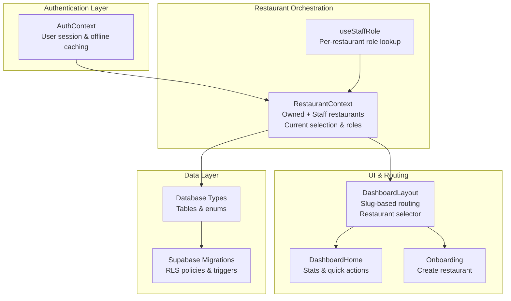
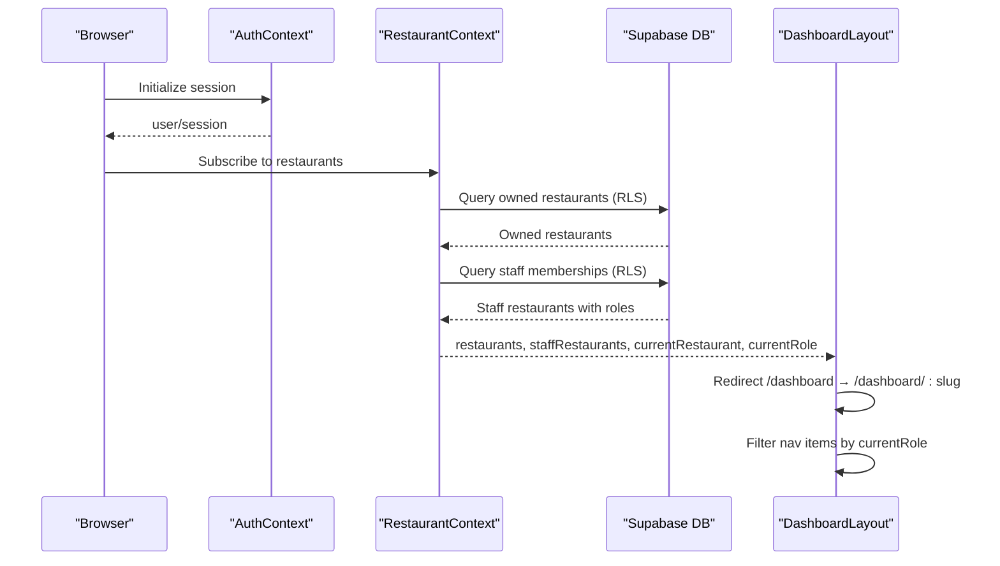
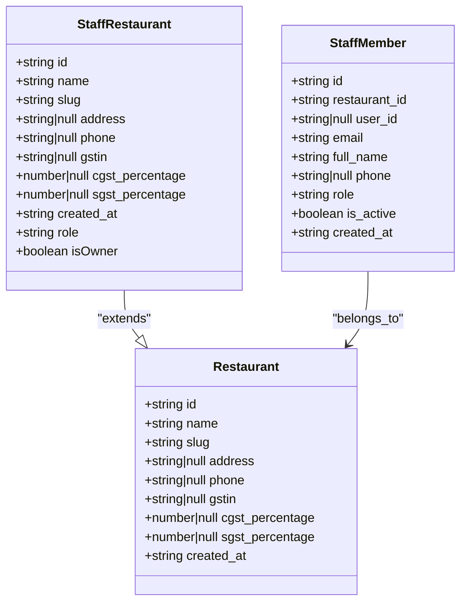
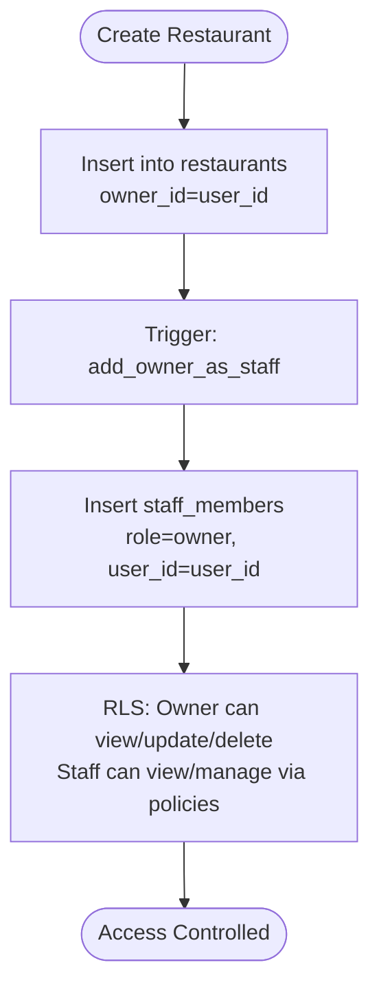
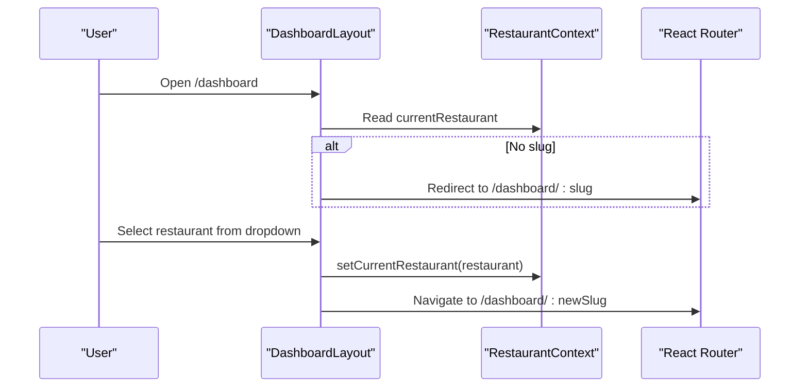
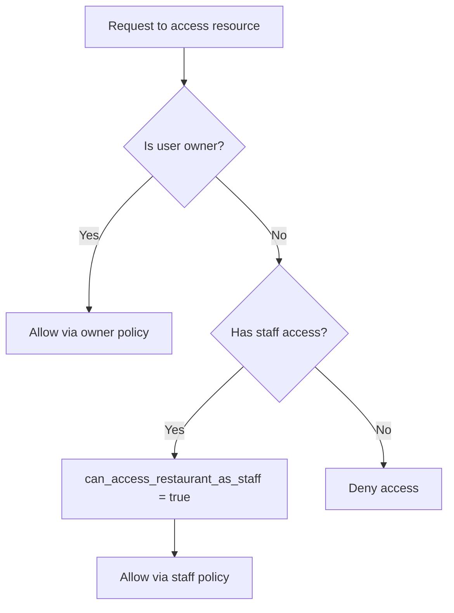
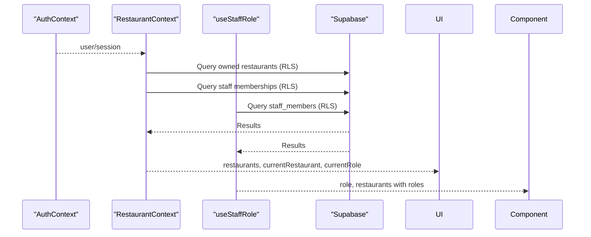
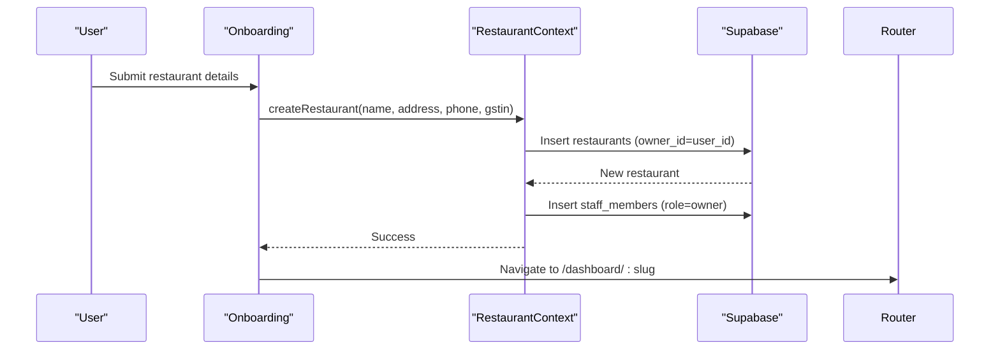
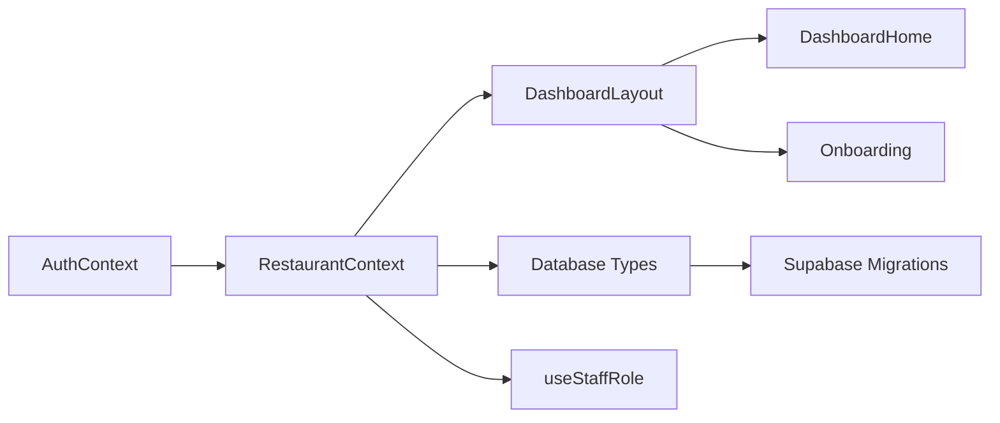

# Multi-Restaurant Architecture

<cite>
**Referenced Files in This Document**
- [RestaurantContext.tsx](file://src/contexts/RestaurantContext.tsx)
- [AuthContext.tsx](file://src/contexts/AuthContext.tsx)
- [types.ts](file://src/integrations/supabase/types.ts)
- [DashboardLayout.tsx](file://src/components/layout/DashboardLayout.tsx)
- [DashboardHome.tsx](file://src/pages/dashboard/DashboardHome.tsx)
- [Onboarding.tsx](file://src/pages/Onboarding.tsx)
- [useStaffRole.ts](file://src/hooks/useStaffRole.ts)
- [20251206042902_fc2b1d91-eb8e-4750-90c3-95b7e0feb6ba.sql](file://supabase/migrations/20251206042902_fc2b1d91-eb8e-4750-90c3-95b7e0feb6ba.sql)
- [20251206062448_4e2d7da9-9519-48ae-9d6c-bb1c994ed84a.sql](file://supabase/migrations/20251206062448_4e2d7da9-9519-48ae-9d6c-bb1c994ed84a.sql)
- [20251206081648_ef719884-b181-43d8-832a-02825f1b3a50.sql](file://supabase/migrations/20251206081648_ef719884-b181-43d8-832a-02825f1b3a50.sql)
- [20251206132719_11d13f91-c469-437f-9d98-63127362f20c.sql](file://supabase/migrations/20251206132719_11d13f91-c469-437f-9d98-63127362f20c.sql)
- [20251206133509_50399ee0-7c3e-4927-bf1a-00556ef24c8c.sql](file://supabase/migrations/20251206133509_50399ee0-7c3e-4927-bf1a-00556ef24c8c.sql)
- [20251206133955_231d3ef6-16e8-41de-8662-8dc09a54c6e3.sql](file://supabase/migrations/20251206133955_231d3ef6-16e8-41de-8662-8dc09a54c6e3.sql)
- [20251206134902_8243dfe0-8b9c-4c6d-9a42-278158976001.sql](file://supabase/migrations/20251206134902_8243dfe0-8b9c-4c6d-9a42-278158976001.sql)
</cite>

## Table of Contents
1. [Introduction](#introduction)
2. [Project Structure](#project-structure)
3. [Core Components](#core-components)
4. [Architecture Overview](#architecture-overview)
5. [Detailed Component Analysis](#detailed-component-analysis)
6. [Dependency Analysis](#dependency-analysis)
7. [Performance Considerations](#performance-considerations)
8. [Troubleshooting Guide](#troubleshooting-guide)
9. [Conclusion](#conclusion)

## Introduction
This document explains TableFlow Pro's multi-restaurant architecture. It covers the restaurant data model, role-based access control for staff, restaurant ownership linkage to user accounts, slug-based navigation, data isolation guarantees, and permission cascading through the restaurant hierarchy. Practical workflows for switching restaurants and navigating dashboards are included, along with integration points to authentication and offline-first behavior.

## Project Structure
The multi-restaurant system spans three primary layers:
- Authentication and identity: managed by Supabase Auth and persisted in local storage for offline scenarios.
- Restaurant orchestration: provided by a React context that loads restaurants, determines roles, and manages current selection.
- UI and routing: dashboard layout enforces slug-based navigation and role-filtered menus.

**Diagram sources**
- [AuthContext.tsx:1-141](file://src/contexts/AuthContext.tsx#L1-L141)
- [RestaurantContext.tsx:1-391](file://src/contexts/RestaurantContext.tsx#L1-L391)
- [useStaffRole.ts:1-190](file://src/hooks/useStaffRole.ts#L1-L190)
- [DashboardLayout.tsx:1-402](file://src/components/layout/DashboardLayout.tsx#L1-L402)
- [DashboardHome.tsx:1-345](file://src/pages/dashboard/DashboardHome.tsx#L1-L345)
- [Onboarding.tsx:1-151](file://src/pages/Onboarding.tsx#L1-L151)
- [types.ts:1-818](file://src/integrations/supabase/types.ts#L1-L818)

**Section sources**
- [AuthContext.tsx:1-141](file://src/contexts/AuthContext.tsx#L1-L141)
- [RestaurantContext.tsx:1-391](file://src/contexts/RestaurantContext.tsx#L1-L391)
- [DashboardLayout.tsx:1-402](file://src/components/layout/DashboardLayout.tsx#L1-L402)
- [DashboardHome.tsx:1-345](file://src/pages/dashboard/DashboardHome.tsx#L1-L345)
- [Onboarding.tsx:1-151](file://src/pages/Onboarding.tsx#L1-L151)
- [types.ts:1-818](file://src/integrations/supabase/types.ts#L1-L818)

## Core Components
- Restaurant data model
  - Base Restaurant interface includes id, name, slug, address, phone, gstin, tax percentages, and timestamps.
  - StaffRestaurant extends Restaurant with role and isOwner flag derived from staff membership.
- Ownership model
  - owner_id on restaurants links to Supabase Auth users.
  - Auto-created staff_members with role owner when restaurants are created.
- Role-based access control
  - Enum staff_role includes owner, manager, waiter, chef.
  - RLS policies grant access to data based on ownership or staff membership.
- Slug-based navigation
  - Unique restaurant slug generated from name and enforced by database triggers.
  - Dashboard routes use /dashboard/:slug for isolation and deep-linking.

**Section sources**
- [RestaurantContext.tsx:13-29](file://src/contexts/RestaurantContext.tsx#L13-L29)
- [types.ts:420-464](file://src/integrations/supabase/types.ts#L420-L464)
- [20251206081648_ef719884-b181-43d8-832a-02825f1b3a50.sql:2-20](file://supabase/migrations/20251206081648_ef719884-b181-43d8-832a-02825f1b3a50.sql#L2-L20)
- [20251206042902_fc2b1d91-eb8e-4750-90c3-95b7e0feb6ba.sql:16-26](file://supabase/migrations/20251206042902_fc2b1d91-eb8e-4750-90c3-95b7e0feb6ba.sql#L16-L26)
- [20251206062448_4e2d7da9-9519-48ae-9d6c-bb1c994ed84a.sql:1-64](file://supabase/migrations/20251206062448_4e2d7da9-9519-48ae-9d6c-bb1c994ed84a.sql#L1-L64)

## Architecture Overview
The system integrates authentication, restaurant selection, and role-aware UI routing. The RestaurantContext centralizes restaurant discovery, role resolution, and current selection. The DashboardLayout enforces slug-based navigation and role-filtered menus. Database RLS ensures data isolation per restaurant.

**Diagram sources**
- [AuthContext.tsx:39-141](file://src/contexts/AuthContext.tsx#L39-L141)
- [RestaurantContext.tsx:78-284](file://src/contexts/RestaurantContext.tsx#L78-L284)
- [DashboardLayout.tsx:127-175](file://src/components/layout/DashboardLayout.tsx#L127-L175)

## Detailed Component Analysis

### Restaurant Data Model
The restaurant entity and related types define the core data structures and constraints:
- Restaurant interface: id, name, slug, address, phone, gstin, tax percentages, timestamps.
- StaffRestaurant: adds role and isOwner flags for permission checks.
- Database tables: restaurants, staff_members, orders, order_items, tables, floors, menu_categories, menu_items.
- Enums: staff_role, order_status, food_type, spice_level.

**Diagram sources**
- [RestaurantContext.tsx:13-29](file://src/contexts/RestaurantContext.tsx#L13-L29)
- [types.ts:420-464](file://src/integrations/supabase/types.ts#L420-L464)
- [20251206081648_ef719884-b181-43d8-832a-02825f1b3a50.sql:5-20](file://supabase/migrations/20251206081648_ef719884-b181-43d8-832a-02825f1b3a50.sql#L5-L20)

**Section sources**
- [RestaurantContext.tsx:13-29](file://src/contexts/RestaurantContext.tsx#L13-L29)
- [types.ts:420-464](file://src/integrations/supabase/types.ts#L420-L464)
- [20251206081648_ef719884-b181-43d8-832a-02825f1b3a50.sql:5-20](file://supabase/migrations/20251206081648_ef719884-b181-43d8-832a-02825f1b3a50.sql#L5-L20)

### Restaurant Ownership and Access Control
Ownership ties restaurants to users and auto-creates owner staff records:
- owner_id on restaurants references auth.users.
- Trigger auto-inserts a staff_members record with role owner upon restaurant creation.
- RLS policies restrict data visibility to owners or authorized staff.

**Diagram sources**
- [20251206042902_fc2b1d91-eb8e-4750-90c3-95b7e0feb6ba.sql:16-26](file://supabase/migrations/20251206042902_fc2b1d91-eb8e-4750-90c3-95b7e0feb6ba.sql#L16-L26)
- [20251206081648_ef719884-b181-43d8-832a-02825f1b3a50.sql:131-156](file://supabase/migrations/20251206081648_ef719884-b181-43d8-832a-02825f1b3a50.sql#L131-L156)
- [20251206133509_50399ee0-7c3e-4927-bf1a-00556ef24c8c.sql:1-12](file://supabase/migrations/20251206133509_50399ee0-7c3e-4927-bf1a-00556ef24c8c.sql#L1-L12)

**Section sources**
- [20251206042902_fc2b1d91-eb8e-4750-90c3-95b7e0feb6ba.sql:16-26](file://supabase/migrations/20251206042902_fc2b1d91-eb8e-4750-90c3-95b7e0feb6ba.sql#L16-L26)
- [20251206081648_ef719884-b181-43d8-832a-02825f1b3a50.sql:131-156](file://supabase/migrations/20251206081648_ef719884-b181-43d8-832a-02825f1b3a50.sql#L131-L156)
- [20251206133509_50399ee0-7c3e-4927-bf1a-00556ef24c8c.sql:1-12](file://supabase/migrations/20251206133509_50399ee0-7c3e-4927-bf1a-00556ef24c8c.sql#L1-L12)

### Restaurant Selection and Slug-Based Navigation
The dashboard enforces slug-based navigation and allows switching between restaurants:
- RestaurantContext loads owned and staff restaurants, sets currentRestaurant and currentRole.
- DashboardLayout redirects /dashboard to /dashboard/:slug and switches restaurants by slug.
- Restaurant selector dropdown lists owned and staff restaurants with role badges.

**Diagram sources**
- [DashboardLayout.tsx:127-175](file://src/components/layout/DashboardLayout.tsx#L127-L175)
- [RestaurantContext.tsx:233-262](file://src/contexts/RestaurantContext.tsx#L233-L262)

**Section sources**
- [DashboardLayout.tsx:127-175](file://src/components/layout/DashboardLayout.tsx#L127-L175)
- [RestaurantContext.tsx:233-262](file://src/contexts/RestaurantContext.tsx#L233-L262)

### Data Isolation Patterns
Data isolation is enforced by RLS policies that check either:
- Ownership: auth.uid() = owner_id on restaurants.
- Staff membership: can_access_restaurant_as_staff function verifies active staff membership by user_id or email.

**Diagram sources**
- [20251206133955_231d3ef6-16e8-41de-8662-8dc09a54c6e3.sql:17-31](file://supabase/migrations/20251206133955_231d3ef6-16e8-41de-8662-8dc09a54c6e3.sql#L17-L31)
- [20251206134902_8243dfe0-8b9c-4c6d-9a42-278158976001.sql:4-76](file://supabase/migrations/20251206134902_8243dfe0-8b9c-4c6d-9a42-278158976001.sql#L4-L76)

**Section sources**
- [20251206133955_231d3ef6-16e8-41de-8662-8dc09a54c6e3.sql:17-31](file://supabase/migrations/20251206133955_231d3ef6-16e8-41de-8662-8dc09a54c6e3.sql#L17-L31)
- [20251206134902_8243dfe0-8b9c-4c6d-9a42-278158976001.sql:4-76](file://supabase/migrations/20251206134902_8243dfe0-8b9c-4c6d-9a42-278158976001.sql#L4-L76)

### Cross-Restaurant Data Access Limitations
- Staff members can access resources only within restaurants where they have active staff membership.
- The system prevents cross-restaurant queries by design; UI and backend enforce restaurant-scoped operations.
- Per-table RLS policies ensure staff cannot see unrelated data.

**Section sources**
- [20251206134902_8243dfe0-8b9c-4c6d-9a42-278158976001.sql:4-76](file://supabase/migrations/20251206134902_8243dfe0-8b9c-4c6d-9a42-278158976001.sql#L4-L76)

### Integration with Authentication Context
- AuthContext manages session lifecycle, offline caching, and initializes/stops synchronization.
- RestaurantContext depends on AuthContext to determine current user and fetch associated restaurants.
- useStaffRole hook provides per-user staff membership and role resolution.

**Diagram sources**
- [AuthContext.tsx:39-141](file://src/contexts/AuthContext.tsx#L39-L141)
- [RestaurantContext.tsx:78-284](file://src/contexts/RestaurantContext.tsx#L78-L284)
- [useStaffRole.ts:29-134](file://src/hooks/useStaffRole.ts#L29-L134)

**Section sources**
- [AuthContext.tsx:39-141](file://src/contexts/AuthContext.tsx#L39-L141)
- [RestaurantContext.tsx:78-284](file://src/contexts/RestaurantContext.tsx#L78-L284)
- [useStaffRole.ts:29-134](file://src/hooks/useStaffRole.ts#L29-L134)

### Practical Workflows

#### Creating a New Restaurant
- Owner creates a restaurant via Onboarding form.
- RestaurantContext inserts a new restaurant with owner_id set to current user.
- Trigger auto-creates owner staff member record.
- Dashboard navigates to newly created restaurant's slug route.

**Diagram sources**
- [Onboarding.tsx:20-31](file://src/pages/Onboarding.tsx#L20-L31)
- [RestaurantContext.tsx:319-353](file://src/contexts/RestaurantContext.tsx#L319-L353)
- [20251206081648_ef719884-b181-43d8-832a-02825f1b3a50.sql:131-156](file://supabase/migrations/20251206081648_ef719884-b181-43d8-832a-02825f1b3a50.sql#L131-L156)

**Section sources**
- [Onboarding.tsx:20-31](file://src/pages/Onboarding.tsx#L20-L31)
- [RestaurantContext.tsx:319-353](file://src/contexts/RestaurantContext.tsx#L319-L353)
- [20251206081648_ef719884-b181-43d8-832a-02825f1b3a50.sql:131-156](file://supabase/migrations/20251206081648_ef719884-b181-43d8-832a-02825f1b3a50.sql#L131-L156)

#### Switching Restaurants and Navigating
- User selects a restaurant from the dropdown in DashboardLayout.
- RestaurantContext updates currentRestaurant and currentRole.
- DashboardLayout rewrites URLs to use the selected restaurant's slug.

**Section sources**
- [DashboardLayout.tsx:149-167](file://src/components/layout/DashboardLayout.tsx#L149-L167)
- [RestaurantContext.tsx:286-296](file://src/contexts/RestaurantContext.tsx#L286-L296)

## Dependency Analysis
The multi-restaurant architecture exhibits clear separation of concerns:
- AuthContext depends on Supabase Auth and manages offline persistence.
- RestaurantContext depends on AuthContext and Supabase for data loading and role resolution.
- DashboardLayout depends on RestaurantContext for current selection and role filtering.
- Database migrations define RLS policies and triggers that enforce access control.

**Diagram sources**
- [AuthContext.tsx:1-141](file://src/contexts/AuthContext.tsx#L1-L141)
- [RestaurantContext.tsx:1-391](file://src/contexts/RestaurantContext.tsx#L1-L391)
- [DashboardLayout.tsx:1-402](file://src/components/layout/DashboardLayout.tsx#L1-L402)
- [DashboardHome.tsx:1-345](file://src/pages/dashboard/DashboardHome.tsx#L1-L345)
- [Onboarding.tsx:1-151](file://src/pages/Onboarding.tsx#L1-L151)
- [types.ts:1-818](file://src/integrations/supabase/types.ts#L1-L818)

**Section sources**
- [AuthContext.tsx:1-141](file://src/contexts/AuthContext.tsx#L1-L141)
- [RestaurantContext.tsx:1-391](file://src/contexts/RestaurantContext.tsx#L1-L391)
- [DashboardLayout.tsx:1-402](file://src/components/layout/DashboardLayout.tsx#L1-L402)
- [DashboardHome.tsx:1-345](file://src/pages/dashboard/DashboardHome.tsx#L1-L345)
- [Onboarding.tsx:1-151](file://src/pages/Onboarding.tsx#L1-L151)
- [types.ts:1-818](file://src/integrations/supabase/types.ts#L1-L818)

## Performance Considerations
- RestaurantContext leverages offline-first queries and local storage caching for current restaurant and role to minimize network requests during startup and offline scenarios.
- DashboardLayout performs slug-based navigation and role-filtered rendering to avoid unnecessary computations.
- Database RLS policies are designed to be efficient and rely on indexed foreign keys and helper functions.

## Troubleshooting Guide
Common issues and resolutions:
- No current restaurant selected
  - Cause: User has no owned or staff restaurants.
  - Resolution: Use Onboarding to create a restaurant; RestaurantContext falls back to localStorage cache when offline.
- Cannot switch restaurants
  - Cause: Restaurant not in owned or staff list.
  - Resolution: Ensure user has active staff membership or owns the restaurant; verify RLS policies apply.
- Slug mismatch or 404
  - Cause: Navigating to non-existent slug.
  - Resolution: Use restaurant selector dropdown to choose a valid slug; DashboardLayout redirects to slug-based URLs.
- Role restrictions
  - Cause: Attempting to access resources outside current restaurant scope.
  - Resolution: Verify staff membership and active status; ensure RLS policies are applied.

**Section sources**
- [RestaurantContext.tsx:247-282](file://src/contexts/RestaurantContext.tsx#L247-L282)
- [DashboardLayout.tsx:127-175](file://src/components/layout/DashboardLayout.tsx#L127-L175)
- [20251206133955_231d3ef6-16e8-41de-8662-8dc09a54c6e3.sql:48-63](file://supabase/migrations/20251206133955_231d3ef6-16e8-41de-8662-8dc09a54c6e3.sql#L48-L63)

## Conclusion
TableFlow Pro implements a robust multi-restaurant architecture centered on clear ownership semantics, role-based access control, and slug-based navigation. RestaurantContext orchestrates data loading, role resolution, and current selection, while DashboardLayout enforces isolation and provides intuitive navigation. Database RLS policies guarantee cross-restaurant data protection, and offline-first patterns ensure reliability in diverse environments.