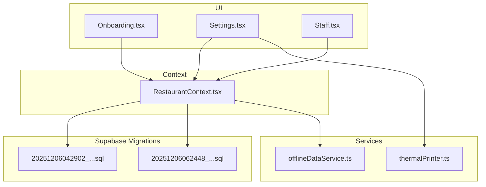
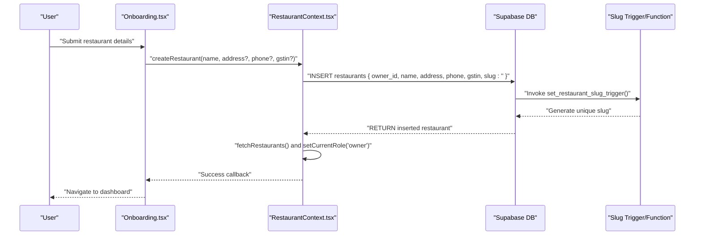
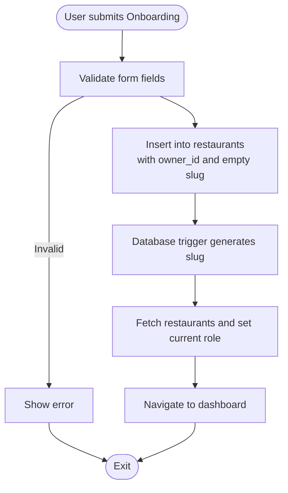
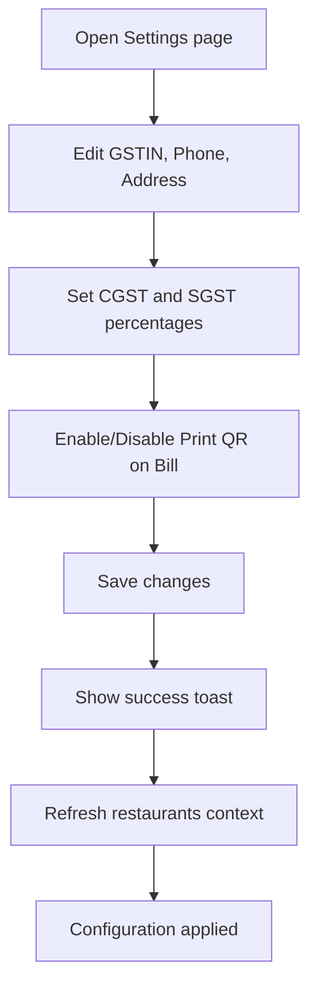
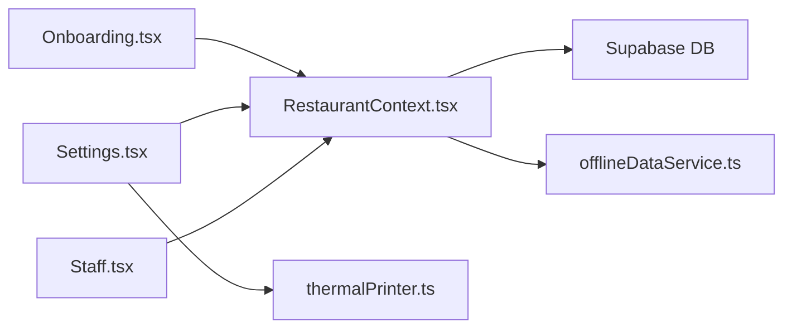

# Restaurant Creation & Setup

<cite>
**Referenced Files in This Document**
- [Onboarding.tsx](file://src/pages/Onboarding.tsx)
- [RestaurantContext.tsx](file://src/contexts/RestaurantContext.tsx)
- [Settings.tsx](file://src/pages/dashboard/Settings.tsx)
- [thermalPrinter.ts](file://src/services/thermalPrinter.ts)
- [20251206062448_4e2d7da9-9519-48ae-9d6c-bb1c994ed84a.sql](file://supabase/migrations/20251206062448_4e2d7da9-9519-48ae-9d6c-bb1c994ed84a.sql)
- [20251206042902_fc2b1d91-eb8e-4750-90c3-95b7e0feb6ba.sql](file://supabase/migrations/20251206042902_fc2b1d91-eb8e-4750-90c3-95b7e0feb6ba.sql)
- [Staff.tsx](file://src/pages/dashboard/Staff.tsx)
- [StaffMemberDialog.tsx](file://src/components/staff/StaffMemberDialog.tsx)
- [offlineDataService.ts](file://src/services/offlineDataService.ts)
</cite>

## Table of Contents
1. [Introduction](#introduction)
2. [Project Structure](#project-structure)
3. [Core Components](#core-components)
4. [Architecture Overview](#architecture-overview)
5. [Detailed Component Analysis](#detailed-component-analysis)
6. [Dependency Analysis](#dependency-analysis)
7. [Performance Considerations](#performance-considerations)
8. [Troubleshooting Guide](#troubleshooting-guide)
9. [Conclusion](#conclusion)
10. [Appendices](#appendices)

## Introduction
This document explains how TableFlow Pro creates a new restaurant and guides owners through initial setup. It covers the createRestaurant function, parameter validation, slug generation, default configuration, and the restaurant settings workflow. It also documents the restaurant settings interface, branding options, operational preferences, and step-by-step setup guides for new restaurant owners, common configuration scenarios, and troubleshooting setup issues.

## Project Structure
The restaurant creation and setup process spans UI pages, context providers, Supabase migrations, and services:
- Onboarding page collects restaurant details and triggers creation
- Restaurant context handles creation, persistence, and role assignment
- Supabase migrations define schema and slug generation
- Settings page manages GST registration, tax percentages, and print QR on bill
- Staff management enables inviting team members
- Offline data service supports local-first operation

**Diagram sources**
- [Onboarding.tsx:10-31](file://src/pages/Onboarding.tsx#L10-L31)
- [RestaurantContext.tsx:319-353](file://src/contexts/RestaurantContext.tsx#L319-L353)
- [Settings.tsx:26-180](file://src/pages/dashboard/Settings.tsx#L26-L180)
- [thermalPrinter.ts:33-339](file://src/services/thermalPrinter.ts#L33-L339)
- [offlineDataService.ts:151-221](file://src/services/offlineDataService.ts#L151-L221)
- [20251206042902_fc2b1d91-eb8e-4750-90c3-95b7e0feb6ba.sql:16-26](file://supabase/migrations/20251206042902_fc2b1d91-eb8e-4750-90c3-95b7e0feb6ba.sql#L16-L26)
- [20251206062448_4e2d7da9-9519-48ae-9d6c-bb1c994ed84a.sql:1-64](file://supabase/migrations/20251206062448_4e2d7da9-9519-48ae-9d6c-bb1c994ed84a.sql#L1-L64)

**Section sources**
- [Onboarding.tsx:10-31](file://src/pages/Onboarding.tsx#L10-L31)
- [RestaurantContext.tsx:319-353](file://src/contexts/RestaurantContext.tsx#L319-L353)
- [Settings.tsx:26-180](file://src/pages/dashboard/Settings.tsx#L26-L180)
- [20251206042902_fc2b1d91-eb8e-4750-90c3-95b7e0feb6ba.sql:16-26](file://supabase/migrations/20251206042902_fc2b1d91-eb8e-4750-90c3-95b7e0feb6ba.sql#L16-L26)
- [20251206062448_4e2d7da9-9519-48ae-9d6c-bb1c994ed84a.sql:1-64](file://supabase/migrations/20251206062448_4e2d7da9-9519-48ae-9d6c-bb1c994ed84a.sql#L1-L64)

## Core Components
- Onboarding page: Collects restaurant name, address, phone, and GSTIN; submits to createRestaurant.
- Restaurant context: Implements createRestaurant, sets owner role, and refreshes restaurant lists.
- Supabase migrations: Define restaurants table and slug generation trigger/function.
- Settings page: Manages GSTIN, CGST/SGST percentages, and print QR on bill flag.
- Staff management: Adds and manages staff members; integrates with restaurant context.
- Thermal printer service: Supports printing bills with QR codes and tax details.

**Section sources**
- [Onboarding.tsx:10-31](file://src/pages/Onboarding.tsx#L10-L31)
- [RestaurantContext.tsx:319-353](file://src/contexts/RestaurantContext.tsx#L319-L353)
- [Settings.tsx:26-180](file://src/pages/dashboard/Settings.tsx#L26-L180)
- [Staff.tsx:15-205](file://src/pages/dashboard/Staff.tsx#L15-L205)
- [thermalPrinter.ts:33-339](file://src/services/thermalPrinter.ts#L33-L339)

## Architecture Overview
The restaurant creation flow connects UI, context, and database:

**Diagram sources**
- [Onboarding.tsx:20-31](file://src/pages/Onboarding.tsx#L20-L31)
- [RestaurantContext.tsx:319-353](file://src/contexts/RestaurantContext.tsx#L319-L353)
- [20251206062448_4e2d7da9-9519-48ae-9d6c-bb1c994ed84a.sql:38-55](file://supabase/migrations/20251206062448_4e2d7da9-9519-48ae-9d6c-bb1c994ed84a.sql#L38-L55)

## Detailed Component Analysis

### Restaurant Creation Workflow
- Onboarding form captures name, address, phone, and GSTIN.
- createRestaurant validates user presence, inserts into restaurants, and auto-generates slug via database trigger.
- After successful creation, the context refreshes restaurants, sets current restaurant, and assigns owner role.

**Diagram sources**
- [Onboarding.tsx:20-31](file://src/pages/Onboarding.tsx#L20-L31)
- [RestaurantContext.tsx:319-353](file://src/contexts/RestaurantContext.tsx#L319-L353)
- [20251206062448_4e2d7da9-9519-48ae-9d6c-bb1c994ed84a.sql:38-55](file://supabase/migrations/20251206062448_4e2d7da9-9519-48ae-9d6c-bb1c994ed84a.sql#L38-L55)

**Section sources**
- [Onboarding.tsx:20-31](file://src/pages/Onboarding.tsx#L20-L31)
- [RestaurantContext.tsx:319-353](file://src/contexts/RestaurantContext.tsx#L319-L353)

### Parameter Validation and Database Insertion
- Validation occurs at the UI level (name required) and at the backend via Supabase policies.
- The restaurants table schema defines owner_id, name, address, phone, gstin, and created_at/updated_at.
- Slug is generated automatically by a PostgreSQL function and trigger.

Key schema and trigger details:
- restaurants table columns include owner_id, name, address, phone, gstin, created_at, updated_at.
- A function generate_restaurant_slug produces a unique slug from name and owner_id.
- A trigger set_restaurant_slug_trigger ensures slug is set before insert.

**Section sources**
- [20251206042902_fc2b1d91-eb8e-4750-90c3-95b7e0feb6ba.sql:16-26](file://supabase/migrations/20251206042902_fc2b1d91-eb8e-4750-90c3-95b7e0feb6ba.sql#L16-L26)
- [20251206062448_4e2d7da9-9519-48ae-9d6c-bb1c994ed84a.sql:5-36](file://supabase/migrations/20251206062448_4e2d7da9-9519-48ae-9d6c-bb1c994ed84a.sql#L5-L36)
- [20251206062448_4e2d7da9-9519-48ae-9d6c-bb1c994ed84a.sql:38-55](file://supabase/migrations/20251206062448_4e2d7da9-9519-48ae-9d6c-bb1c994ed84a.sql#L38-L55)

### Restaurant Slug Generation
- Base slug derived from name: lowercase, spaces replaced with hyphens, special characters removed, multiple spaces collapsed to single hyphen, leading/trailing hyphens trimmed.
- If empty, defaults to “restaurant”.
- Ensures uniqueness by appending a counter if collisions occur.
- Slug is set by a BEFORE INSERT trigger before row is saved.

**Section sources**
- [20251206062448_4e2d7da9-9519-48ae-9d6c-bb1c994ed84a.sql:5-36](file://supabase/migrations/20251206062448_4e2d7da9-9519-48ae-9d6c-bb1c994ed84a.sql#L5-L36)
- [20251206062448_4e2d7da9-9519-48ae-9d6c-bb1c994ed84a.sql:38-55](file://supabase/migrations/20251206062448_4e2d7da9-9519-48ae-9d6c-bb1c994ed84a.sql#L38-L55)

### Auto-Population of owner_id and Default Values
- owner_id is set to the authenticated user’s id during creation.
- address, phone, and gstin are stored as provided; empty values become SQL NULL.
- slug is auto-generated by the database trigger.
- Default configuration values:
  - print_qr_on_bill defaults to true when loaded in the UI.
  - cgst_percentage and sgst_percentage default to null/empty when loaded in the UI.

**Section sources**
- [RestaurantContext.tsx:328-339](file://src/contexts/RestaurantContext.tsx#L328-L339)
- [Settings.tsx:114-124](file://src/pages/dashboard/Settings.tsx#L114-L124)
- [Settings.tsx:137-139](file://src/pages/dashboard/Settings.tsx#L137-L139)

### Initial Restaurant Configuration Workflow
- GST registration: Enter GSTIN in Settings; stored on restaurants table.
- Tax percentage setup: Configure CGST and SGST percentages; used when generating bills.
- Print QR on bill: Toggle to enable/disable QR printing on receipts.

**Diagram sources**
- [Settings.tsx:126-180](file://src/pages/dashboard/Settings.tsx#L126-L180)

**Section sources**
- [Settings.tsx:126-180](file://src/pages/dashboard/Settings.tsx#L126-L180)

### Restaurant Settings Interface and Operational Preferences
- Restaurant Details tab: Name, Phone, Address, GSTIN.
- Tax Configuration: CGST and SGST percentage inputs with numeric validation.
- Operational Preferences: Print QR on Bill toggle.
- Data synchronization controls (Electron only): Download from cloud, upload to cloud, pending sync count, debug tools.

**Section sources**
- [Settings.tsx:190-290](file://src/pages/dashboard/Settings.tsx#L190-L290)
- [Settings.tsx:292-398](file://src/pages/dashboard/Settings.tsx#L292-L398)

### Branding Options and Print QR on Bill
- Branding: Restaurant name, address, phone, and GSTIN appear on bills and receipts.
- Print QR on Bill: When enabled, QR code containing order ID is printed on receipts.

**Section sources**
- [thermalPrinter.ts:118-219](file://src/services/thermalPrinter.ts#L118-L219)
- [Settings.tsx:267-279](file://src/pages/dashboard/Settings.tsx#L267-L279)

### Staff Invitation During Setup
- Use Staff Management to add staff members with roles (manager, chef, waiter).
- The dialog enforces required fields and role selection.
- Staff members can be activated/deactivated and edited later.

**Section sources**
- [Staff.tsx:15-205](file://src/pages/dashboard/Staff.tsx#L15-L205)
- [StaffMemberDialog.tsx:31-88](file://src/components/staff/StaffMemberDialog.tsx#L31-L88)

## Dependency Analysis
- Onboarding depends on RestaurantContext.createRestaurant.
- RestaurantContext depends on Supabase client and uses offline data service for caching and sync.
- Settings depends on RestaurantContext for current restaurant and uses offlineMutate for updates.
- Thermal printer service reads restaurant settings to format bills.

**Diagram sources**
- [Onboarding.tsx:12](file://src/pages/Onboarding.tsx#L12)
- [RestaurantContext.tsx:319-353](file://src/contexts/RestaurantContext.tsx#L319-L353)
- [Settings.tsx:27](file://src/pages/dashboard/Settings.tsx#L27)
- [thermalPrinter.ts:33](file://src/services/thermalPrinter.ts#L33)
- [offlineDataService.ts:151-221](file://src/services/offlineDataService.ts#L151-L221)

**Section sources**
- [Onboarding.tsx:12](file://src/pages/Onboarding.tsx#L12)
- [RestaurantContext.tsx:319-353](file://src/contexts/RestaurantContext.tsx#L319-L353)
- [Settings.tsx:27](file://src/pages/dashboard/Settings.tsx#L27)
- [offlineDataService.ts:151-221](file://src/services/offlineDataService.ts#L151-L221)

## Performance Considerations
- Local-first architecture: offlineQuery prioritizes SQLite in Electron/LAN modes, reducing network latency and enabling offline operation.
- Minimal re-renders: RestaurantContext caches current restaurant and role, avoiding unnecessary fetches.
- Efficient slug generation: PostgreSQL function and trigger compute slug server-side, minimizing client work.

[No sources needed since this section provides general guidance]

## Troubleshooting Guide
Common setup issues and resolutions:
- Restaurant creation fails with user not authenticated:
  - Ensure user is logged in; createRestaurant requires a valid user.
- Slug generation conflicts:
  - The trigger appends a counter; verify uniqueness and retry.
- GSTIN not saving:
  - Ensure GSTIN is valid and non-empty; Settings converts empty to null.
- QR not printing:
  - Verify “Print QR on Bill” is enabled and printer is connected (mobile) or browser print dialog is allowed.
- Staff invitation not appearing:
  - Confirm email matches existing unlinked staff record; the system links accounts automatically.

**Section sources**
- [RestaurantContext.tsx:348-352](file://src/contexts/RestaurantContext.tsx#L348-L352)
- [20251206062448_4e2d7da9-9519-48ae-9d6c-bb1c994ed84a.sql:38-55](file://supabase/migrations/20251206062448_4e2d7da9-9519-48ae-9d6c-bb1c994ed84a.sql#L38-L55)
- [Settings.tsx:136-139](file://src/pages/dashboard/Settings.tsx#L136-L139)
- [thermalPrinter.ts:118-219](file://src/services/thermalPrinter.ts#L118-L219)

## Conclusion
TableFlow Pro streamlines restaurant creation and initial setup with a clean UI, robust backend validation, and flexible configuration. The createRestaurant function centralizes data insertion and slug generation, while Settings and Staff Management provide essential configuration and team setup. The local-first architecture ensures reliability and performance across environments.

[No sources needed since this section summarizes without analyzing specific files]

## Appendices

### Step-by-Step Setup Guide for New Restaurant Owners
1. Log in to TableFlow Pro.
2. Navigate to Onboarding and enter:
   - Restaurant Name (required)
   - Address (optional)
   - Phone (optional)
   - GSTIN (optional)
3. Submit to create the restaurant.
4. Configure Settings:
   - Update GSTIN, Phone, Address
   - Set CGST and SGST percentages
   - Toggle “Print QR on Bill”
5. Invite staff:
   - Go to Staff Management
   - Add staff members with roles
   - Activate/deactivate as needed
6. Verify bill printing:
   - Test printing with QR enabled/disabled
   - Confirm restaurant details appear on receipts

**Section sources**
- [Onboarding.tsx:20-31](file://src/pages/Onboarding.tsx#L20-L31)
- [Settings.tsx:126-180](file://src/pages/dashboard/Settings.tsx#L126-L180)
- [Staff.tsx:15-205](file://src/pages/dashboard/Staff.tsx#L15-L205)

### Common Configuration Scenarios
- GST-registered restaurant:
  - Enter GSTIN in Settings; taxes will be calculated accordingly.
- Non-GST restaurant:
  - Leave GSTIN blank; CGST/SGST can remain unset.
- Paper-saving preference:
  - Disable “Print QR on Bill” to reduce paper usage.
- Multi-location setup:
  - Use Onboarding to create additional restaurants; each gets a unique slug.

**Section sources**
- [Settings.tsx:126-180](file://src/pages/dashboard/Settings.tsx#L126-L180)
- [20251206062448_4e2d7da9-9519-48ae-9d6c-bb1c994ed84a.sql:5-36](file://supabase/migrations/20251206062448_4e2d7da9-9519-48ae-9d6c-bb1c994ed84a.sql#L5-L36)

### Restaurant Data Initialization
- Restaurants table initialized with owner_id, name, address, phone, gstin, and timestamps.
- Slug auto-generated via trigger and function.
- Default values:
  - print_qr_on_bill defaults to true in UI.
  - cgst_percentage and sgst_percentage default to null/empty in UI.

**Section sources**
- [20251206042902_fc2b1d91-eb8e-4750-90c3-95b7e0feb6ba.sql:16-26](file://supabase/migrations/20251206042902_fc2b1d91-eb8e-4750-90c3-95b7e0feb6ba.sql#L16-L26)
- [Settings.tsx:114-124](file://src/pages/dashboard/Settings.tsx#L114-L124)