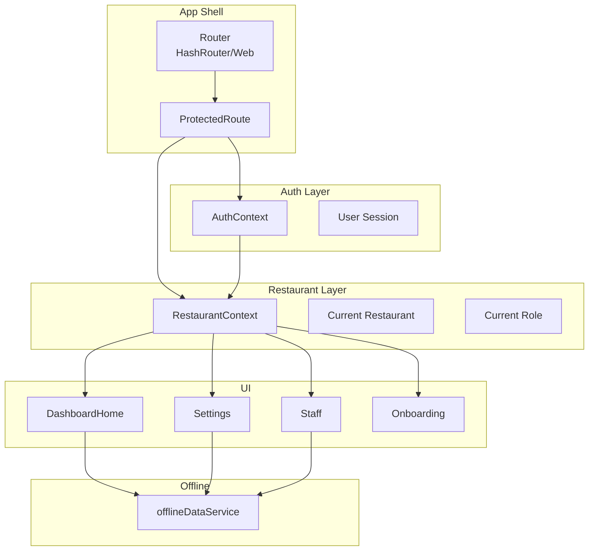
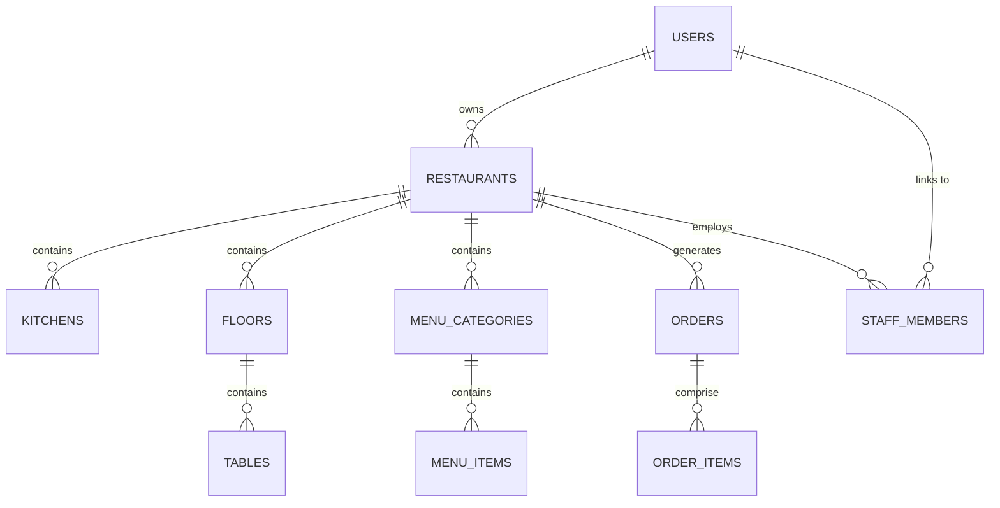
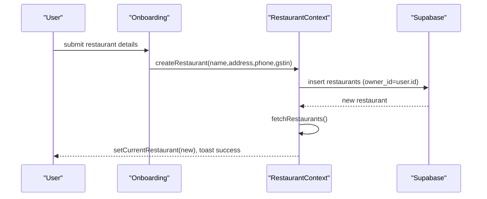
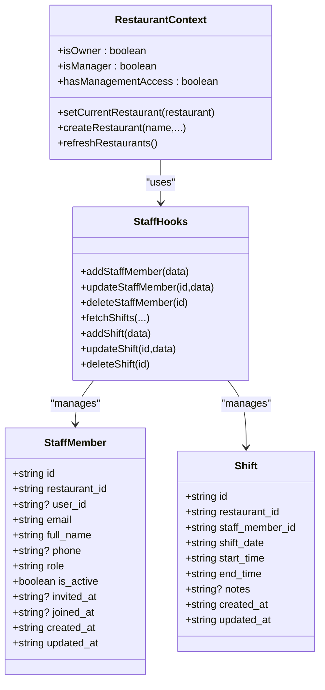
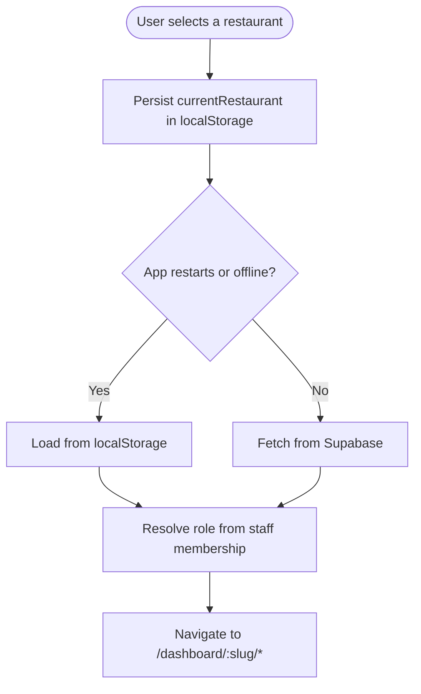
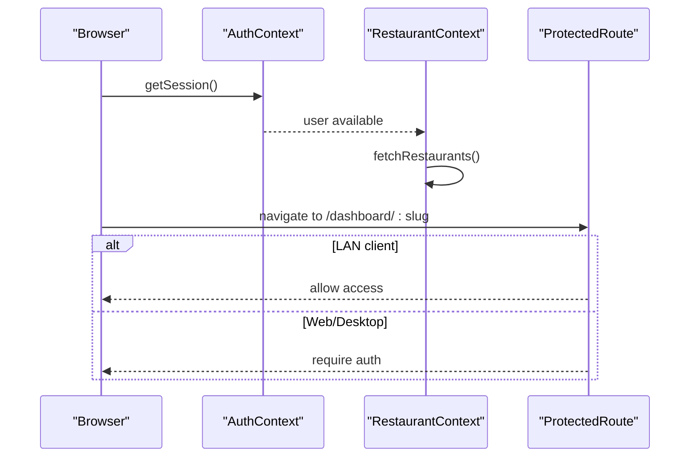
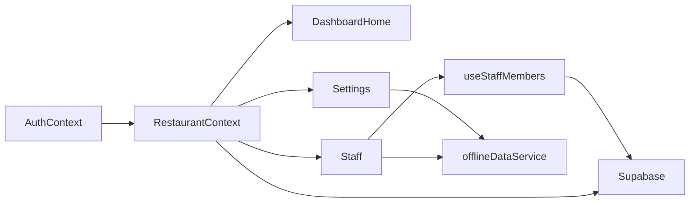

# Restaurant Management

<cite>
**Referenced Files in This Document**
- [RestaurantContext.tsx](file://src/contexts/RestaurantContext.tsx)
- [AuthContext.tsx](file://src/contexts/AuthContext.tsx)
- [App.tsx](file://src/App.tsx)
- [ProtectedRoute.tsx](file://src/components/ProtectedRoute.tsx)
- [DashboardHome.tsx](file://src/pages/dashboard/DashboardHome.tsx)
- [Settings.tsx](file://src/pages/dashboard/Settings.tsx)
- [Onboarding.tsx](file://src/pages/Onboarding.tsx)
- [Staff.tsx](file://src/pages/dashboard/Staff.tsx)
- [useStaffMembers.ts](file://src/hooks/useStaffMembers.ts)
- [useStaffRole.ts](file://src/hooks/useStaffRole.ts)
- [StaffMemberCard.tsx](file://src/components/staff/StaffMemberCard.tsx)
- [StaffMemberDialog.tsx](file://src/components/staff/StaffMemberDialog.tsx)
- [offlineDataService.ts](file://src/services/offlineDataService.ts)
- [20251206042902_fc2b1d91-eb8e-4750-90c3-95b7e0feb6ba.sql](file://supabase/migrations/20251206042902_fc2b1d91-eb8e-4750-90c3-95b7e0feb6ba.sql)
- [20251206062448_4e2d7da9-9519-48ae-9d6c-bb1c994ed84a.sql](file://supabase/migrations/20251206062448_4e2d7da9-9519-48ae-9d6c-bb1c994ed84a.sql)
- [20251206132719_11d13f91-c469-437f-9d98-63127362f20c.sql](file://supabase/migrations/20251206132719_11d13f91-c469-437f-9d98-63127362f20c.sql)
- [20251206133955_231d3ef6-16e8-41de-8662-8dc09a54c6e3.sql](file://supabase/migrations/20251206133955_231d3ef6-16e8-41de-8662-8dc09a54c6e3.sql)
- [20251206134902_8243dfe0-8b9c-4c6d-9a42-278158976001.sql](file://supabase/migrations/20251206134902_8243dfe0-8b9c-4c6d-9a42-278158976001.sql)
</cite>

## Table of Contents
1. [Introduction](#introduction)
2. [Project Structure](#project-structure)
3. [Core Components](#core-components)
4. [Architecture Overview](#architecture-overview)
5. [Detailed Component Analysis](#detailed-component-analysis)
6. [Dependency Analysis](#dependency-analysis)
7. [Performance Considerations](#performance-considerations)
8. [Troubleshooting Guide](#troubleshooting-guide)
9. [Conclusion](#conclusion)
10. [Appendices](#appendices)

## Introduction
This document explains the multi-restaurant architecture and restaurant management capabilities in TableFlow Pro. It covers how restaurants are created and configured, how staff are managed with role-based access control, how restaurant switching and slug-based navigation work, and how data ownership and isolation are enforced. It also documents restaurant settings and preferences, offline/local operation modes, and administrative workflows for scaling and cross-restaurant operations.

## Project Structure
TableFlow Pro organizes restaurant management around two primary contexts:
- Authentication context: user session and offline caching
- Restaurant context: restaurant list, current selection, roles, and creation

Routing supports slug-based navigation under /dashboard/:slug for all restaurant-scoped dashboards. ProtectedRoute enforces authentication or LAN client connectivity. Offline/local operation is handled by offlineDataService for Electron/LAN modes.



**Diagram sources**
- [App.tsx:115-141](file://src/App.tsx#L115-L141)
- [ProtectedRoute.tsx:9-59](file://src/components/ProtectedRoute.tsx#L9-L59)
- [AuthContext.tsx:39-131](file://src/contexts/AuthContext.tsx#L39-L131)
- [RestaurantContext.tsx:47-381](file://src/contexts/RestaurantContext.tsx#L47-L381)
- [DashboardHome.tsx:27-159](file://src/pages/dashboard/DashboardHome.tsx#L27-L159)
- [Settings.tsx:26-180](file://src/pages/dashboard/Settings.tsx#L26-L180)
- [Staff.tsx:15-204](file://src/pages/dashboard/Staff.tsx#L15-L204)
- [offlineDataService.ts:151-211](file://src/services/offlineDataService.ts#L151-L211)

**Section sources**
- [App.tsx:115-141](file://src/App.tsx#L115-L141)
- [ProtectedRoute.tsx:9-59](file://src/components/ProtectedRoute.tsx#L9-L59)
- [AuthContext.tsx:39-131](file://src/contexts/AuthContext.tsx#L39-L131)
- [RestaurantContext.tsx:47-381](file://src/contexts/RestaurantContext.tsx#L47-L381)

## Core Components
- Authentication context: manages user session, caches user for offline, and starts/stops sync when signed in.
- Restaurant context: loads restaurants owned by the user and staff memberships, tracks current restaurant and role, creates restaurants, and persists selections.
- Dashboard routing: slug-based routes under /dashboard/:slug for all restaurant dashboards.
- Staff management: adds, edits, activates/deactivates, and deletes staff; maintains shift schedules.
- Settings: updates restaurant details, taxes, and branding options; manages local/cloud sync in Electron/LAN.
- Offline service: SQLite-first data access with manual cloud sync, LAN client mode, and local-only operation.

**Section sources**
- [AuthContext.tsx:39-131](file://src/contexts/AuthContext.tsx#L39-L131)
- [RestaurantContext.tsx:47-381](file://src/contexts/RestaurantContext.tsx#L47-L381)
- [App.tsx:115-141](file://src/App.tsx#L115-L141)
- [Staff.tsx:15-204](file://src/pages/dashboard/Staff.tsx#L15-L204)
- [Settings.tsx:26-180](file://src/pages/dashboard/Settings.tsx#L26-L180)
- [offlineDataService.ts:151-211](file://src/services/offlineDataService.ts#L151-L211)

## Architecture Overview
TableFlow Pro implements a multi-restaurant architecture with:
- Authentication-driven restaurant access: users own restaurants; staff members gain access via staff_members records.
- Slug-based navigation: all dashboards route under /dashboard/:slug.
- Role-based access control: owner, manager, waiter, chef roles define permissions.
- Data ownership and isolation: Supabase RLS policies enforce per-restaurant boundaries; offline mode isolates data per restaurant.
- Cross-restaurant operations: staff can be linked to multiple restaurants; staff roles are tracked per restaurant.

```mermaid
sequenceDiagram
participant U as "User"
participant Auth as "AuthContext"
participant Rest as "RestaurantContext"
participant DB as "Supabase"
participant Off as "offlineDataService"
U->>Auth : Sign in
Auth-->>Rest : user/session available
Rest->>DB : Load owned restaurants
Rest->>DB : Load staff memberships
DB-->>Rest : restaurants + roles
Rest-->>U : currentRestaurant + currentRole
U->>Rest : createRestaurant(name,...)
Rest->>DB : insert restaurants (owner_id=user.id)
DB-->>Rest : new restaurant
Rest->>Rest : setCurrentRestaurant(new)
Rest-->>U : success toast
U->>Off : offlineMutate/restaurants (settings)
Off-->>U : pendingSync (Electron)
```

**Diagram sources**
- [AuthContext.tsx:39-131](file://src/contexts/AuthContext.tsx#L39-L131)
- [RestaurantContext.tsx:159-353](file://src/contexts/RestaurantContext.tsx#L159-L353)
- [offlineDataService.ts:220-287](file://src/services/offlineDataService.ts#L220-L287)

## Detailed Component Analysis

### Multi-Restaurant Architecture and Data Ownership
- Restaurants belong to owners (auth.users.id). Staff members link to restaurants via staff_members.
- RLS policies restrict access to restaurant data by owner or active staff membership.
- The slug column on restaurants enables slug-based navigation and branding-friendly URLs.



**Diagram sources**
- [20251206042902_fc2b1d91-eb8e-4750-90c3-95b7e0feb6ba.sql:16-108](file://supabase/migrations/20251206042902_fc2b1d91-eb8e-4750-90c3-95b7e0feb6ba.sql#L16-L108)
- [20251206062448_4e2d7da9-9519-48ae-9d6c-bb1c994ed84a.sql:1-64](file://supabase/migrations/20251206062448_4e2d7da9-9519-48ae-9d6c-bb1c994ed84a.sql#L1-L64)

**Section sources**
- [20251206042902_fc2b1d91-eb8e-4750-90c3-95b7e0feb6ba.sql:110-172](file://supabase/migrations/20251206042902_fc2b1d91-eb8e-4750-90c3-95b7e0feb6ba.sql#L110-L172)
- [20251206132719_11d13f91-c469-437f-9d98-63127362f20c.sql:1-12](file://supabase/migrations/20251206132719_11d13f91-c469-437f-9d98-63127362f20c.sql#L1-L12)
- [20251206133955_231d3ef6-16e8-41de-8662-8dc09a54c6e3.sql:17-46](file://supabase/migrations/20251206133955_231d3ef6-16e8-41de-8662-8dc09a54c6e3.sql#L17-L46)
- [20251206134902_8243dfe0-8b9c-4c6d-9a42-278158976001.sql:38-76](file://supabase/migrations/20251206134902_8243dfe0-8b9c-4c6d-9a42-278158976001.sql#L38-L76)

### Restaurant Creation and Configuration
- Owner creates a restaurant; the backend auto-generates a unique slug.
- After creation, the context refreshes to populate staff membership and sets current restaurant and role to owner.
- Restaurant settings (name, address, phone, GSTIN, CGST/SGST percentages, QR printing preference) are editable in Settings.



**Diagram sources**
- [Onboarding.tsx:20-31](file://src/pages/Onboarding.tsx#L20-L31)
- [RestaurantContext.tsx:319-353](file://src/contexts/RestaurantContext.tsx#L319-L353)

**Section sources**
- [Onboarding.tsx:20-31](file://src/pages/Onboarding.tsx#L20-L31)
- [RestaurantContext.tsx:319-353](file://src/contexts/RestaurantContext.tsx#L319-L353)
- [Settings.tsx:126-180](file://src/pages/dashboard/Settings.tsx#L126-L180)

### Staff Membership Management and Role-Based Access Control
- Staff roles: owner, manager, waiter, chef. Owner and manager have management access.
- Staff can be added, edited, activated/deactivated, and deleted. Shifts are maintained per restaurant.
- RLS policies allow staff to access restaurant resources based on active staff membership.
- The system auto-links accounts to staff records when emails match.



**Diagram sources**
- [useStaffMembers.ts:36-143](file://src/hooks/useStaffMembers.ts#L36-L143)
- [useStaffMembers.ts:145-254](file://src/hooks/useStaffMembers.ts#L145-L254)
- [RestaurantContext.tsx:319-353](file://src/contexts/RestaurantContext.tsx#L319-L353)

**Section sources**
- [Staff.tsx:15-204](file://src/pages/dashboard/Staff.tsx#L15-L204)
- [useStaffMembers.ts:36-143](file://src/hooks/useStaffMembers.ts#L36-L143)
- [useStaffMembers.ts:145-254](file://src/hooks/useStaffMembers.ts#L145-L254)
- [useStaffRole.ts:29-134](file://src/hooks/useStaffRole.ts#L29-L134)
- [20251206133955_231d3ef6-16e8-41de-8662-8dc09a54c6e3.sql:17-46](file://supabase/migrations/20251206133955_231d3ef6-16e8-41de-8662-8dc09a54c6e3.sql#L17-L46)
- [20251206134902_8243dfe0-8b9c-4c6d-9a42-278158976001.sql:38-76](file://supabase/migrations/20251206134902_8243dfe0-8b9c-4c6d-9a42-278158976001.sql#L38-L76)

### Restaurant Switching and Slug-Based Navigation
- Dashboard routes are parameterized by :slug, enabling navigation between restaurants.
- Current restaurant is persisted in localStorage and restored when offline or without a user.
- The dashboard home constructs links using the current restaurant’s slug.



**Diagram sources**
- [RestaurantContext.tsx:55-76](file://src/contexts/RestaurantContext.tsx#L55-L76)
- [RestaurantContext.tsx:233-296](file://src/contexts/RestaurantContext.tsx#L233-L296)
- [App.tsx:122-137](file://src/App.tsx#L122-L137)
- [DashboardHome.tsx:161-169](file://src/pages/dashboard/DashboardHome.tsx#L161-L169)

**Section sources**
- [RestaurantContext.tsx:55-76](file://src/contexts/RestaurantContext.tsx#L55-L76)
- [RestaurantContext.tsx:233-296](file://src/contexts/RestaurantContext.tsx#L233-L296)
- [App.tsx:122-137](file://src/App.tsx#L122-L137)
- [DashboardHome.tsx:161-169](file://src/pages/dashboard/DashboardHome.tsx#L161-L169)

### Restaurant Settings and Preferences
- Editable settings include name, phone, address, GSTIN, CGST/SGST percentages, and whether to print QR codes on bills.
- Updates are applied via offlineMutate to SQLite first (in Electron/LAN), then optionally synced to cloud.

```mermaid
sequenceDiagram
participant U as "User"
participant Settings as "Settings"
participant Rest as "RestaurantContext"
participant Off as "offlineDataService"
participant DB as "Supabase"
U->>Settings : change fields
Settings->>Off : offlineMutate('restaurants', updatedData)
Off-->>Settings : pendingSync
Settings->>Rest : refreshRestaurants()
Rest-->>U : updated currentRestaurant
U->>Off : manualSyncToCloud()
Off->>DB : upsert restaurants (preserve timestamps)
DB-->>Off : success
Off-->>U : upload summary
```

**Diagram sources**
- [Settings.tsx:126-180](file://src/pages/dashboard/Settings.tsx#L126-L180)
- [offlineDataService.ts:220-287](file://src/services/offlineDataService.ts#L220-L287)
- [offlineDataService.ts:397-541](file://src/services/offlineDataService.ts#L397-L541)
- [RestaurantContext.tsx:355-357](file://src/contexts/RestaurantContext.tsx#L355-L357)

**Section sources**
- [Settings.tsx:126-180](file://src/pages/dashboard/Settings.tsx#L126-L180)
- [offlineDataService.ts:220-287](file://src/services/offlineDataService.ts#L220-L287)
- [offlineDataService.ts:397-541](file://src/services/offlineDataService.ts#L397-L541)

### Practical Workflows

#### Restaurant Setup Workflow
- Create a restaurant via Onboarding; the system auto-generates a slug and sets the owner as current user.
- Navigate to dashboard and use setup prompts to add kitchens, floors/tables, and menu items.

**Section sources**
- [Onboarding.tsx:20-31](file://src/pages/Onboarding.tsx#L20-L31)
- [DashboardHome.tsx:28-159](file://src/pages/dashboard/DashboardHome.tsx#L28-L159)

#### Staff Invitation and Role Assignment
- Add staff members from the Staff page; assign roles (manager, chef, waiter).
- Auto-link occurs when a user signs in with an email matching an existing staff record.

**Section sources**
- [Staff.tsx:15-204](file://src/pages/dashboard/Staff.tsx#L15-L204)
- [useStaffMembers.ts:36-143](file://src/hooks/useStaffMembers.ts#L36-L143)
- [useStaffRole.ts:35-59](file://src/hooks/useStaffRole.ts#L35-L59)
- [20251206132719_11d13f91-c469-437f-9d98-63127362f20c.sql:1-12](file://supabase/migrations/20251206132719_11d13f91-c469-437f-9d98-63127362f20c.sql#L1-L12)

#### Restaurant Data Management
- Use Settings to update branding and tax configurations.
- In Electron/LAN, use manual sync to upload local changes to cloud while preserving timestamps.

**Section sources**
- [Settings.tsx:126-180](file://src/pages/dashboard/Settings.tsx#L126-L180)
- [offlineDataService.ts:397-541](file://src/services/offlineDataService.ts#L397-L541)

### Integration Between Authentication and Restaurant Context
- AuthContext provides user/session and offline caching; RestaurantContext depends on user to load restaurants and staff memberships.
- ProtectedRoute allows LAN clients to access dashboards without authentication, while web/desktop requires sign-in.



**Diagram sources**
- [AuthContext.tsx:39-131](file://src/contexts/AuthContext.tsx#L39-L131)
- [RestaurantContext.tsx:78-284](file://src/contexts/RestaurantContext.tsx#L78-L284)
- [ProtectedRoute.tsx:9-59](file://src/components/ProtectedRoute.tsx#L9-L59)

**Section sources**
- [AuthContext.tsx:39-131](file://src/contexts/AuthContext.tsx#L39-L131)
- [ProtectedRoute.tsx:9-59](file://src/components/ProtectedRoute.tsx#L9-L59)

## Dependency Analysis
- RestaurantContext depends on AuthContext for user identity and on Supabase for data queries.
- Dashboard pages depend on RestaurantContext for current restaurant and role.
- Staff management hooks depend on Supabase and use offlineDataService for offline-first behavior.
- Routing depends on slug parameterization to isolate dashboards per restaurant.



**Diagram sources**
- [RestaurantContext.tsx:47-381](file://src/contexts/RestaurantContext.tsx#L47-L381)
- [DashboardHome.tsx:27-159](file://src/pages/dashboard/DashboardHome.tsx#L27-L159)
- [Settings.tsx:26-180](file://src/pages/dashboard/Settings.tsx#L26-L180)
- [Staff.tsx:15-204](file://src/pages/dashboard/Staff.tsx#L15-L204)
- [useStaffMembers.ts:36-143](file://src/hooks/useStaffMembers.ts#L36-L143)
- [offlineDataService.ts:151-211](file://src/services/offlineDataService.ts#L151-L211)

**Section sources**
- [RestaurantContext.tsx:47-381](file://src/contexts/RestaurantContext.tsx#L47-L381)
- [App.tsx:115-141](file://src/App.tsx#L115-L141)

## Performance Considerations
- Offline-first design minimizes network requests and improves responsiveness in LAN/Electron modes.
- offlineQuery prioritizes SQLite reads; offlineMutate writes locally and defers cloud sync.
- RLS policies ensure efficient filtering at the database level, reducing payload sizes.

[No sources needed since this section provides general guidance]

## Troubleshooting Guide
- Authentication issues: verify session restoration and cached user in offline mode.
- Restaurant switching: confirm localStorage persistence and role resolution when restoring current restaurant.
- Staff linking: ensure email matches between user and staff records; auto-link runs on sign-in.
- Sync problems (Electron/LAN): check connectivity, pending sync count, and manual sync results.

**Section sources**
- [AuthContext.tsx:44-97](file://src/contexts/AuthContext.tsx#L44-L97)
- [RestaurantContext.tsx:55-76](file://src/contexts/RestaurantContext.tsx#L55-L76)
- [useStaffRole.ts:44-59](file://src/hooks/useStaffRole.ts#L44-L59)
- [offlineDataService.ts:546-560](file://src/services/offlineDataService.ts#L546-L560)

## Conclusion
TableFlow Pro’s restaurant management combines robust multi-restaurant support with role-based access control, slug-based navigation, and strong data isolation enforced by Supabase RLS. The system supports seamless offline and LAN operation, enabling scalable, cross-restaurant administration and reliable data ownership patterns.

[No sources needed since this section summarizes without analyzing specific files]

## Appendices

### Administrative Workflows
- Adding new restaurants: owner creates via Onboarding; slug is generated automatically.
- Managing staff: add/edit roles, activate/deactivate, and schedule shifts.
- Branding and taxes: update restaurant details and tax settings in Settings.
- Sync and reset: download/upload data, inspect SQLite, and clear local data in Electron/LAN.

**Section sources**
- [Onboarding.tsx:20-31](file://src/pages/Onboarding.tsx#L20-L31)
- [Staff.tsx:15-204](file://src/pages/dashboard/Staff.tsx#L15-L204)
- [Settings.tsx:126-180](file://src/pages/dashboard/Settings.tsx#L126-L180)
- [offlineDataService.ts:605-707](file://src/services/offlineDataService.ts#L605-L707)