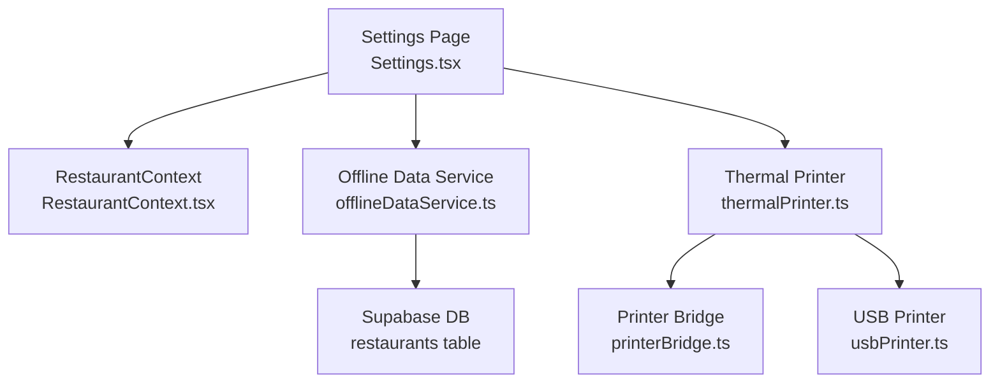
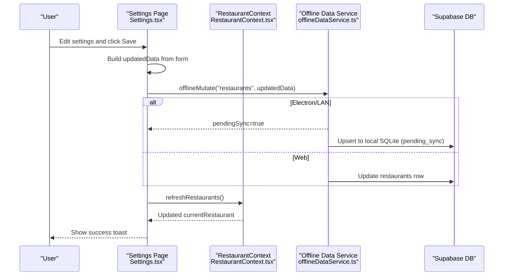
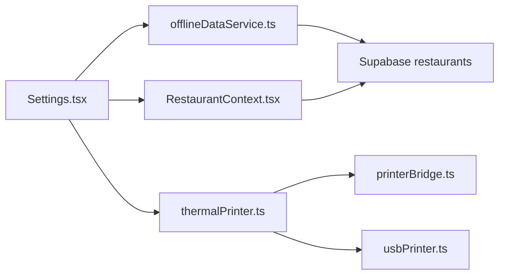

# Restaurant Settings & Preferences

<cite>
**Referenced Files in This Document**
- [Settings.tsx](file://src/pages/dashboard/Settings.tsx)
- [RestaurantContext.tsx](file://src/contexts/RestaurantContext.tsx)
- [offlineDataService.ts](file://src/services/offlineDataService.ts)
- [types.ts](file://src/integrations/supabase/types.ts)
- [20260410120000_add_gst_percentages.sql](file://supabase/migrations/20260410120000_add_gst_percentages.sql)
- [20260411120000_add_print_qr_on_bill.sql](file://supabase/migrations/20260411120000_add_print_qr_on_bill.sql)
- [thermalPrinter.ts](file://src/services/thermalPrinter.ts)
- [printerBridge.ts](file://src/services/printerBridge.ts)
- [usbPrinter.ts](file://src/services/usbPrinter.ts)
- [Reports.tsx](file://src/pages/dashboard/Reports.tsx)
</cite>

## Table of Contents
1. [Introduction](#introduction)
2. [Project Structure](#project-structure)
3. [Core Components](#core-components)
4. [Architecture Overview](#architecture-overview)
5. [Detailed Component Analysis](#detailed-component-analysis)
6. [Dependency Analysis](#dependency-analysis)
7. [Performance Considerations](#performance-considerations)
8. [Troubleshooting Guide](#troubleshooting-guide)
9. [Conclusion](#conclusion)

## Introduction
This document explains how restaurant settings and preferences are configured and managed in TableFlow Pro. It covers the restaurant configuration options (address, phone, GSTIN, CGST/SGST tax percentages, and print QR on bill), the settings update workflows, validation rules, and data persistence mechanisms. It also documents branding preferences, operational settings, compliance configurations, interface design, form validation, error handling, and practical examples. Finally, it addresses settings inheritance patterns, default value management, and synchronization across multiple locations or branches.

## Project Structure
The settings management spans several layers:
- UI page: Settings page renders and updates restaurant configuration.
- Context: RestaurantContext provides current restaurant data and roles.
- Data service: offlineDataService orchestrates offline-first mutations and cloud sync.
- Database: Supabase schema stores restaurant settings and supports migrations.
- Printing: thermalPrinter integrates with settings to optionally print QR codes on bills.

**Diagram sources**
- [Settings.tsx:26-180](file://src/pages/dashboard/Settings.tsx#L26-L180)
- [RestaurantContext.tsx:47-381](file://src/contexts/RestaurantContext.tsx#L47-L381)
- [offlineDataService.ts:220-287](file://src/services/offlineDataService.ts#L220-L287)
- [thermalPrinter.ts:118-219](file://src/services/thermalPrinter.ts#L118-L219)
- [printerBridge.ts:34-180](file://src/services/printerBridge.ts#L34-L180)
- [usbPrinter.ts:197-237](file://src/services/usbPrinter.ts#L197-L237)

**Section sources**
- [Settings.tsx:26-180](file://src/pages/dashboard/Settings.tsx#L26-L180)
- [RestaurantContext.tsx:47-381](file://src/contexts/RestaurantContext.tsx#L47-L381)
- [offlineDataService.ts:220-287](file://src/services/offlineDataService.ts#L220-L287)

## Core Components
- Settings page: Presents inputs for name, phone, address, GSTIN, CGST/SGST percentages, and QR printing preference. Handles saving via offlineMutate and refreshes context.
- Restaurant context: Loads and exposes current restaurant data, merges staff-linked restaurants, and normalizes defaults (e.g., QR printing default).
- Offline data service: Provides offline-first mutations and manual cloud sync for Electron/LAN modes.
- Supabase schema: Defines restaurants table columns and migrations for tax and QR settings.
- Printing service: Uses restaurant settings to render receipts and conditionally include QR codes.

**Section sources**
- [Settings.tsx:190-290](file://src/pages/dashboard/Settings.tsx#L190-L290)
- [RestaurantContext.tsx:13-43](file://src/contexts/RestaurantContext.tsx#L13-L43)
- [offlineDataService.ts:220-287](file://src/services/offlineDataService.ts#L220-L287)
- [types.ts:420-464](file://src/integrations/supabase/types.ts#L420-L464)
- [20260410120000_add_gst_percentages.sql:1-9](file://supabase/migrations/20260410120000_add_gst_percentages.sql#L1-L9)
- [20260411120000_add_print_qr_on_bill.sql](file://supabase/migrations/20260411120000_add_print_qr_on_bill.sql)

## Architecture Overview
The settings update follows an offline-first pattern:
- UI captures form changes.
- offlineMutate writes to local SQLite (Electron/LAN) or directly to Supabase (web).
- For cloud sync, manual push preserves original timestamps and handles deletions distinctly.
- RestaurantContext refresh ensures UI reflects updated settings across the app.

**Diagram sources**
- [Settings.tsx:126-180](file://src/pages/dashboard/Settings.tsx#L126-L180)
- [offlineDataService.ts:220-287](file://src/services/offlineDataService.ts#L220-L287)
- [RestaurantContext.tsx:355-357](file://src/contexts/RestaurantContext.tsx#L355-L357)

## Detailed Component Analysis

### Settings Page: Form Fields and Workflows
- Fields:
  - Name, Phone, Address: free-text inputs.
  - GSTIN: optional string.
  - CGST % and SGST %: numeric inputs with step and bounds.
  - Print QR on Bill: boolean switch.
- Workflow:
  - Load currentRestaurant into form state.
  - On save, compute updatedData and call offlineMutate.
  - On success, show toast and refresh restaurants.

Validation and defaults:
- CGST/SGST are parsed to numbers; missing values default to zero.
- GSTIN is stored as null when empty.
- Print QR defaults to true when null.

Persistence:
- offlineMutate writes to local SQLite in Electron/LAN mode and marks records as pending_sync.
- In web mode, updates Supabase directly.

UI feedback:
- Loading states for save/download/upload actions.
- Toast notifications for success/error.

**Section sources**
- [Settings.tsx:33-41](file://src/pages/dashboard/Settings.tsx#L33-L41)
- [Settings.tsx:112-180](file://src/pages/dashboard/Settings.tsx#L112-L180)
- [Settings.tsx:228-279](file://src/pages/dashboard/Settings.tsx#L228-L279)

### Restaurant Context: Defaults and Role Resolution
- Normalizes settings defaults:
  - QR printing defaults to true when null.
  - CGST/SGST percentages default to null when not present.
- Resolves current role (owner/manager) based on staff membership or ownership.
- Refreshes currentRestaurant to reflect upstream changes (e.g., GSTIN updates).

**Section sources**
- [RestaurantContext.tsx:212-212](file://src/contexts/RestaurantContext.tsx#L212-L212)
- [RestaurantContext.tsx:25-43](file://src/contexts/RestaurantContext.tsx#L25-L43)
- [RestaurantContext.tsx:286-296](file://src/contexts/RestaurantContext.tsx#L286-L296)

### Offline Data Service: Mutation and Sync
- offlineMutate:
  - Ensures IDs and timestamps.
  - In Electron/LAN: upserts to SQLite with pending_sync.
  - In web: executes Supabase update.
- manualSyncToCloud:
  - Uploads pending changes preserving original timestamps.
  - Handles deletions distinctly and strips unsupported columns.
  - Returns counts and error messages.

**Section sources**
- [offlineDataService.ts:220-287](file://src/services/offlineDataService.ts#L220-L287)
- [offlineDataService.ts:397-541](file://src/services/offlineDataService.ts#L397-L541)

### Database Schema: Settings Columns and Migrations
- restaurants table includes:
  - address, phone, gstin, cgst_percentage, sgst_percentage, print_qr_on_bill.
- Migrations:
  - Add CGST/SGST columns with defaults.
  - Add print_qr_on_bill column.

**Section sources**
- [types.ts:420-464](file://src/integrations/supabase/types.ts#L420-L464)
- [20260410120000_add_gst_percentages.sql:1-9](file://supabase/migrations/20260410120000_add_gst_percentages.sql#L1-L9)
- [20260411120000_add_print_qr_on_bill.sql](file://supabase/migrations/20260411120000_add_print_qr_on_bill.sql)

### Printing Integration: QR Code Rendering
- Receipt rendering uses restaurant settings:
  - Name, address, phone, GSTIN.
  - Optional QR code when enabled and order ID is available.
- Two printing paths:
  - Mobile: Bluetooth via thermalPrinter.
  - Desktop: Browser print or ESC/POS via printerBridge/usbPrinter.

**Section sources**
- [thermalPrinter.ts:118-219](file://src/services/thermalPrinter.ts#L118-L219)
- [printerBridge.ts:94-180](file://src/services/printerBridge.ts#L94-L180)
- [usbPrinter.ts:206-237](file://src/services/usbPrinter.ts#L206-L237)

### Compliance and Reporting Implications
- CGST/SGST values influence report calculations and printed receipts.
- Reports consume currentRestaurant for branding and tax reporting.

**Section sources**
- [Reports.tsx:1299-1321](file://src/pages/dashboard/Reports.tsx#L1299-L1321)

## Dependency Analysis
Settings depend on:
- UI form state and controlled inputs.
- RestaurantContext for defaults and role-awareness.
- Offline data service for persistence and sync.
- Supabase schema for storage and migrations.
- Printing service for runtime behavior based on settings.

**Diagram sources**
- [Settings.tsx:26-180](file://src/pages/dashboard/Settings.tsx#L26-L180)
- [RestaurantContext.tsx:47-381](file://src/contexts/RestaurantContext.tsx#L47-L381)
- [offlineDataService.ts:220-287](file://src/services/offlineDataService.ts#L220-L287)
- [thermalPrinter.ts:118-219](file://src/services/thermalPrinter.ts#L118-L219)

**Section sources**
- [Settings.tsx:26-180](file://src/pages/dashboard/Settings.tsx#L26-L180)
- [RestaurantContext.tsx:47-381](file://src/contexts/RestaurantContext.tsx#L47-L381)
- [offlineDataService.ts:220-287](file://src/services/offlineDataService.ts#L220-L287)

## Performance Considerations
- Offline-first mutations reduce network latency and enable work offline.
- Manual cloud sync batches operations and preserves timestamps to maintain auditability.
- UI updates are immediate via local cache; context refresh ensures consistency.

## Troubleshooting Guide
Common issues and resolutions:
- Save fails:
  - Verify network connectivity (web) or local SQLite availability (Electron/LAN).
  - Check toast messages for specific errors.
- QR not printing:
  - Confirm print_qr_on_bill is enabled in settings.
  - Ensure an order ID is available for the bill.
- Taxes not reflected:
  - Confirm CGST/SGST values are set and saved.
  - Verify reports consume currentRestaurant for tax computation.

**Section sources**
- [Settings.tsx:171-179](file://src/pages/dashboard/Settings.tsx#L171-L179)
- [thermalPrinter.ts:202-214](file://src/services/thermalPrinter.ts#L202-L214)

## Conclusion
TableFlow Pro’s settings system combines a straightforward UI with robust offline-first persistence and explicit cloud sync controls. Restaurant configuration—branding, compliance, and operational preferences—is centralized in the restaurants table and consistently applied across the app. The design balances usability, reliability, and compliance while supporting multi-location deployments via manual synchronization.