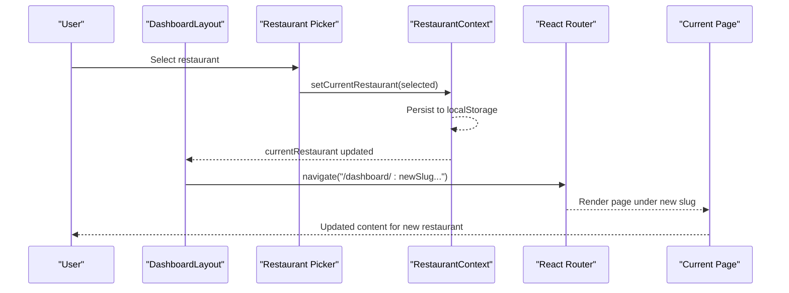
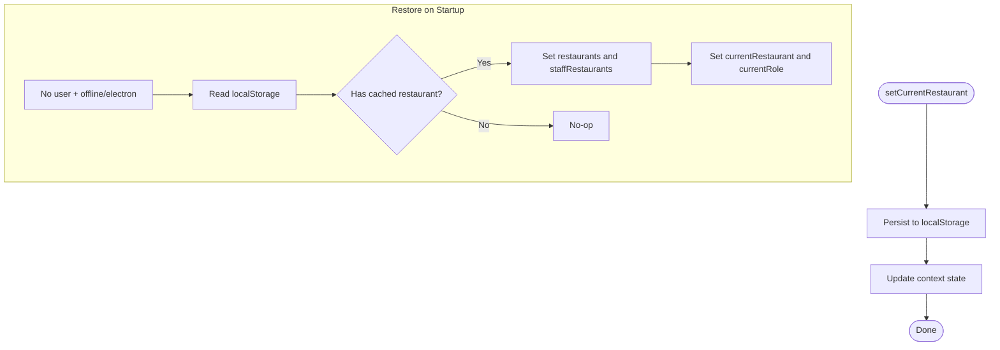
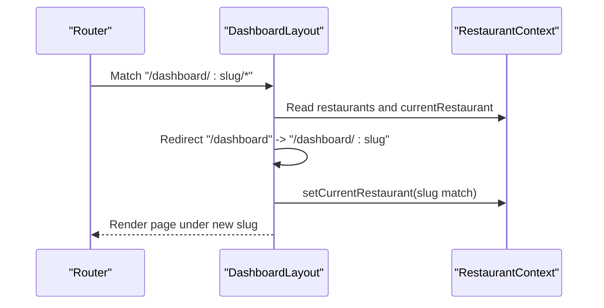
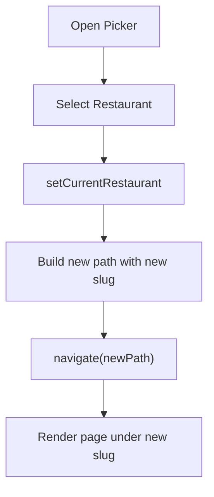
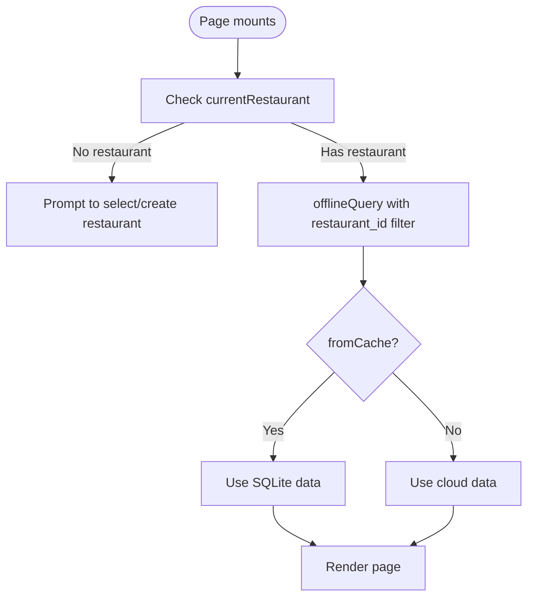
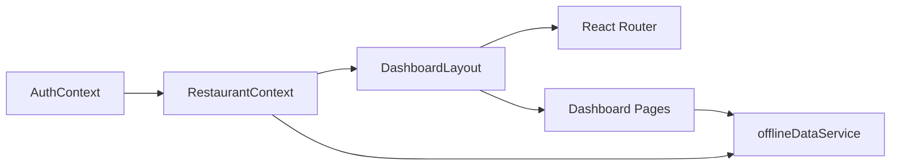

# Restaurant Switching & Navigation

<cite>
**Referenced Files in This Document**
- [RestaurantContext.tsx](file://src/contexts/RestaurantContext.tsx)
- [DashboardLayout.tsx](file://src/components/layout/DashboardLayout.tsx)
- [App.tsx](file://src/App.tsx)
- [offlineDataService.ts](file://src/services/offlineDataService.ts)
- [AuthContext.tsx](file://src/contexts/AuthContext.tsx)
- [ProtectedRoute.tsx](file://src/components/ProtectedRoute.tsx)
- [DashboardHome.tsx](file://src/pages/dashboard/DashboardHome.tsx)
- [Orders.tsx](file://src/pages/dashboard/Orders.tsx)
- [Kitchens.tsx](file://src/pages/dashboard/Kitchens.tsx)
- [Onboarding.tsx](file://src/pages/Onboarding.tsx)
- [LanSettings.tsx](file://src/pages/LanSettings.tsx)
</cite>

## Table of Contents
1. [Introduction](#introduction)
2. [Project Structure](#project-structure)
3. [Core Components](#core-components)
4. [Architecture Overview](#architecture-overview)
5. [Detailed Component Analysis](#detailed-component-analysis)
6. [Dependency Analysis](#dependency-analysis)
7. [Performance Considerations](#performance-considerations)
8. [Troubleshooting Guide](#troubleshooting-guide)
9. [Conclusion](#conclusion)

## Introduction
This document explains how restaurant switching and navigation work in TableFlow Pro. It covers the setCurrentRestaurant mechanism, localStorage persistence, slug-based URL navigation, restaurant context maintenance across sessions, the restaurant picker UI, dashboard routing integration, cross-restaurant navigation limitations, offline switching and cached data restoration, and error handling during restaurant context changes.

## Project Structure
TableFlow Pro uses a layered architecture:
- Authentication and restaurant context are provided via React Context providers.
- The dashboard layout renders the restaurant picker and navigates using slug-based URLs.
- Pages consume the restaurant context and fetch data scoped to the current restaurant.
- Offline-first data services enable switching and navigation even when offline.

```mermaid
graph TB
subgraph "Providers"
Auth["AuthContext"]
Restaurant["RestaurantContext"]
end
subgraph "UI"
Layout["DashboardLayout"]
Picker["Restaurant Picker<br/>Dropdown"]
end
subgraph "Routing"
Router["React Router DOM"]
Routes["/dashboard/:slug/*"]
end
subgraph "Pages"
Home["DashboardHome"]
Orders["Orders"]
Kitchens["Kitchens"]
end
subgraph "Offline"
Offline["offlineDataService"]
end
Auth --> Restaurant
Restaurant --> Layout
Layout --> Picker
Router --> Routes
Routes --> Home
Routes --> Orders
Routes --> Kitchens
Home --> Offline
Orders --> Offline
Kitchens --> Offline
```

**Diagram sources**
- [App.tsx:115-141](file://src/App.tsx#L115-L141)
- [DashboardLayout.tsx:75-175](file://src/components/layout/DashboardLayout.tsx#L75-L175)
- [RestaurantContext.tsx:47-382](file://src/contexts/RestaurantContext.tsx#L47-L382)
- [offlineDataService.ts:151-211](file://src/services/offlineDataService.ts#L151-L211)

**Section sources**
- [App.tsx:115-141](file://src/App.tsx#L115-L141)
- [DashboardLayout.tsx:75-175](file://src/components/layout/DashboardLayout.tsx#L75-L175)
- [RestaurantContext.tsx:47-382](file://src/contexts/RestaurantContext.tsx#L47-L382)

## Core Components
- RestaurantContext: Manages restaurants, current restaurant, current role, and persistence to localStorage. Exposes setCurrentRestaurant and createRestaurant.
- DashboardLayout: Renders the restaurant picker, builds navigation items from the current restaurant’s slug, and handles URL synchronization.
- offlineDataService: Provides offline-first data access and enables switching and navigation even when offline.
- ProtectedRoute: Protects routes and allows LAN client mode without authentication.
- Dashboard pages: Consume the restaurant context and fetch data scoped to the current restaurant.

**Section sources**
- [RestaurantContext.tsx:31-43](file://src/contexts/RestaurantContext.tsx#L31-L43)
- [DashboardLayout.tsx:51-73](file://src/components/layout/DashboardLayout.tsx#L51-L73)
- [offlineDataService.ts:151-211](file://src/services/offlineDataService.ts#L151-L211)
- [ProtectedRoute.tsx:9-59](file://src/components/ProtectedRoute.tsx#L9-L59)

## Architecture Overview
The system maintains restaurant context through:
- A Context provider that loads restaurants and sets currentRestaurant.
- localStorage caching for offline restoration.
- Slug-based URLs that encode the current restaurant.
- A restaurant picker that updates currentRestaurant and navigates to the same page under the new slug.



**Diagram sources**
- [DashboardLayout.tsx:149-167](file://src/components/layout/DashboardLayout.tsx#L149-L167)
- [RestaurantContext.tsx:56-65](file://src/contexts/RestaurantContext.tsx#L56-L65)
- [App.tsx:122-137](file://src/App.tsx#L122-L137)

## Detailed Component Analysis

### RestaurantContext: setCurrentRestaurant, Persistence, and Restoration
- setCurrentRestaurant persists the current restaurant to localStorage and updates the context state.
- Role persistence is handled separately via setCurrentRole.
- Restoration logic:
  - If no user and offline/electron, attempts to restore from localStorage.
  - If LAN client, fetches restaurants from LAN server and sets the first as current.
  - Otherwise, fetches owned and staff restaurants from Supabase, sets current based on precedence, and falls back to localStorage if needed.
- Role resolution:
  - If currentRestaurant is present, resolves role from staffRestaurants or owner if in owned list.
- LAN re-fetch:
  - Subscribes to LAN connection events and re-fetches restaurants when connected.



**Diagram sources**
- [RestaurantContext.tsx:56-76](file://src/contexts/RestaurantContext.tsx#L56-L76)
- [RestaurantContext.tsx:84-99](file://src/contexts/RestaurantContext.tsx#L84-L99)
- [RestaurantContext.tsx:248-262](file://src/contexts/RestaurantContext.tsx#L248-L262)

**Section sources**
- [RestaurantContext.tsx:56-76](file://src/contexts/RestaurantContext.tsx#L56-L76)
- [RestaurantContext.tsx:84-99](file://src/contexts/RestaurantContext.tsx#L84-L99)
- [RestaurantContext.tsx:248-262](file://src/contexts/RestaurantContext.tsx#L248-L262)
- [RestaurantContext.tsx:287-296](file://src/contexts/RestaurantContext.tsx#L287-L296)

### Slug-Based URL Navigation and Routing
- Routes define a slug parameter for all dashboard pages.
- DashboardLayout redirects from /dashboard to /dashboard/:slug using the current restaurant’s slug.
- DashboardLayout listens for slug changes and switches currentRestaurant accordingly.
- Navigation items are generated dynamically using the current restaurant’s slug.



**Diagram sources**
- [App.tsx:122-137](file://src/App.tsx#L122-L137)
- [DashboardLayout.tsx:127-142](file://src/components/layout/DashboardLayout.tsx#L127-L142)
- [DashboardLayout.tsx:169-175](file://src/components/layout/DashboardLayout.tsx#L169-L175)

**Section sources**
- [App.tsx:122-137](file://src/App.tsx#L122-L137)
- [DashboardLayout.tsx:127-142](file://src/components/layout/DashboardLayout.tsx#L127-L142)
- [DashboardLayout.tsx:169-175](file://src/components/layout/DashboardLayout.tsx#L169-L175)

### Restaurant Picker UI and Navigation Patterns
- The restaurant picker is a dropdown that lists all restaurants the user has access to (owned and staff).
- Selecting a restaurant triggers handleRestaurantChange:
  - Calls setCurrentRestaurant.
  - Navigates to the same page under the new restaurant’s slug.
  - Falls back to dashboard root if the current path does not contain a slug.
- Role badges indicate the user’s role for each restaurant.



**Diagram sources**
- [DashboardLayout.tsx:236-260](file://src/components/layout/DashboardLayout.tsx#L236-L260)
- [DashboardLayout.tsx:149-167](file://src/components/layout/DashboardLayout.tsx#L149-L167)

**Section sources**
- [DashboardLayout.tsx:236-260](file://src/components/layout/DashboardLayout.tsx#L236-L260)
- [DashboardLayout.tsx:149-167](file://src/components/layout/DashboardLayout.tsx#L149-L167)

### Integration with Dashboard Routing and Cross-Restaurant Navigation Limitations
- All dashboard pages are protected and rendered under /dashboard/:slug/*.
- Navigation items are filtered by role and include the current restaurant’s slug.
- Cross-restaurant navigation is limited to the same page path; the system replaces the slug in the current path rather than jumping to a different route.
- When no restaurant is selected, pages render a friendly prompt to create or select a restaurant.

**Section sources**
- [App.tsx:122-137](file://src/App.tsx#L122-L137)
- [DashboardLayout.tsx:169-175](file://src/components/layout/DashboardLayout.tsx#L169-L175)
- [DashboardHome.tsx:144-159](file://src/pages/dashboard/DashboardHome.tsx#L144-L159)

### Restaurant-Specific Data Handling and Offline Switching
- Pages fetch data scoped to the current restaurant’s id.
- offlineDataService provides offline-first queries and mutations:
  - offlineQuery reads from SQLite first (or LAN server) and returns fromCache flag.
  - offlineMutate writes to SQLite (or LAN) and marks records as pending_sync.
  - offlineDelete soft-deletes records in SQLite.
- Offline switching:
  - RestaurantContext restores from localStorage when offline and no user.
  - Pages continue to render using cached data from offlineDataService.



**Diagram sources**
- [DashboardHome.tsx:32-142](file://src/pages/dashboard/DashboardHome.tsx#L32-L142)
- [offlineDataService.ts:151-211](file://src/services/offlineDataService.ts#L151-L211)

**Section sources**
- [DashboardHome.tsx:32-142](file://src/pages/dashboard/DashboardHome.tsx#L32-L142)
- [offlineDataService.ts:151-211](file://src/services/offlineDataService.ts#L151-L211)

### Practical Workflows

#### Switching Restaurants
- Open the restaurant picker and select a restaurant.
- The system updates currentRestaurant and navigates to the same page under the new slug.
- Pages re-fetch data scoped to the new restaurant.

**Section sources**
- [DashboardLayout.tsx:149-167](file://src/components/layout/DashboardLayout.tsx#L149-L167)

#### Creating a New Restaurant
- Owner role users can add a new restaurant via the onboarding flow.
- After creation, the system sets the new restaurant as current and navigates to the dashboard.

**Section sources**
- [Onboarding.tsx:20-31](file://src/pages/Onboarding.tsx#L20-L31)
- [RestaurantContext.tsx:319-353](file://src/contexts/RestaurantContext.tsx#L319-L353)

#### Offline Restaurant Switching
- When offline and no user, RestaurantContext restores the last selected restaurant from localStorage.
- Pages continue rendering using offlineDataService’s SQLite-backed data.

**Section sources**
- [RestaurantContext.tsx:84-99](file://src/contexts/RestaurantContext.tsx#L84-L99)
- [offlineDataService.ts:151-211](file://src/services/offlineDataService.ts#L151-L211)

### Error Handling During Restaurant Context Changes
- RestaurantContext gracefully handles errors during fetchRestaurants and falls back to localStorage.
- AuthContext caches the user when offline to avoid losing context.
- ProtectedRoute allows LAN client mode without authentication and checks LAN connectivity.

**Section sources**
- [RestaurantContext.tsx:263-281](file://src/contexts/RestaurantContext.tsx#L263-L281)
- [AuthContext.tsx:44-97](file://src/contexts/AuthContext.tsx#L44-L97)
- [ProtectedRoute.tsx:15-38](file://src/components/ProtectedRoute.tsx#L15-L38)

## Dependency Analysis
- RestaurantContext depends on:
  - AuthContext for user/session.
  - Supabase client for cloud data.
  - offlineDataService for offline-first behavior.
  - localStorage for persistence.
- DashboardLayout depends on:
  - RestaurantContext for restaurants and currentRestaurant.
  - React Router for navigation.
  - offlineDataService for page-level data.
- Pages depend on:
  - RestaurantContext for currentRestaurant.
  - offlineDataService for scoped queries and mutations.



**Diagram sources**
- [RestaurantContext.tsx:47-382](file://src/contexts/RestaurantContext.tsx#L47-L382)
- [DashboardLayout.tsx:75-175](file://src/components/layout/DashboardLayout.tsx#L75-L175)
- [offlineDataService.ts:151-211](file://src/services/offlineDataService.ts#L151-L211)

**Section sources**
- [RestaurantContext.tsx:47-382](file://src/contexts/RestaurantContext.tsx#L47-L382)
- [DashboardLayout.tsx:75-175](file://src/components/layout/DashboardLayout.tsx#L75-L175)
- [offlineDataService.ts:151-211](file://src/services/offlineDataService.ts#L151-L211)

## Performance Considerations
- Offline-first queries minimize network latency and improve responsiveness.
- Role filtering reduces unnecessary data and improves UI rendering.
- Cached data restoration avoids long fetch sequences on startup.

## Troubleshooting Guide
- Restaurant not selected:
  - Ensure a restaurant is created or restored from localStorage.
  - Check offline mode and AuthContext caching behavior.
- Navigation stuck on /dashboard:
  - Confirm currentRestaurant has a slug and that DashboardLayout redirects.
- LAN mode issues:
  - Verify LAN client status and connectivity.
  - Check LAN settings and server/client configuration.

**Section sources**
- [DashboardHome.tsx:144-159](file://src/pages/dashboard/DashboardHome.tsx#L144-L159)
- [DashboardLayout.tsx:127-142](file://src/components/layout/DashboardLayout.tsx#L127-L142)
- [LanSettings.tsx:94-109](file://src/pages/LanSettings.tsx#L94-L109)

## Conclusion
TableFlow Pro’s restaurant switching and navigation rely on a robust context provider, slug-based routing, and offline-first data services. The restaurant picker enables seamless switching, while localStorage and LAN capabilities ensure continuity across sessions and environments. Pages remain focused on the current restaurant’s data, and navigation adapts to reflect the selected restaurant, maintaining a consistent and reliable user experience.