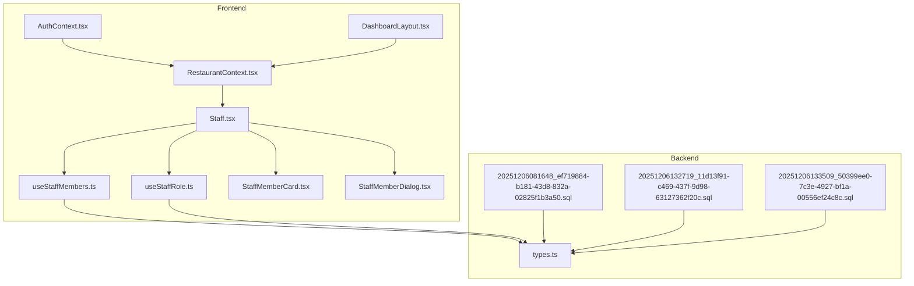
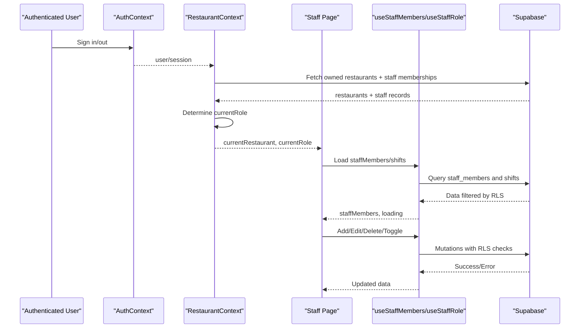
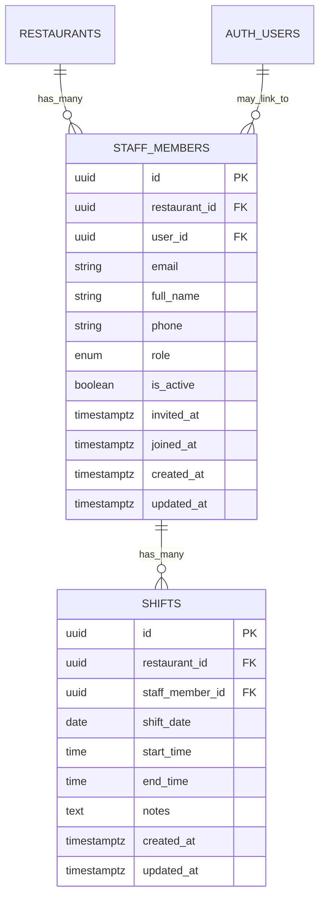
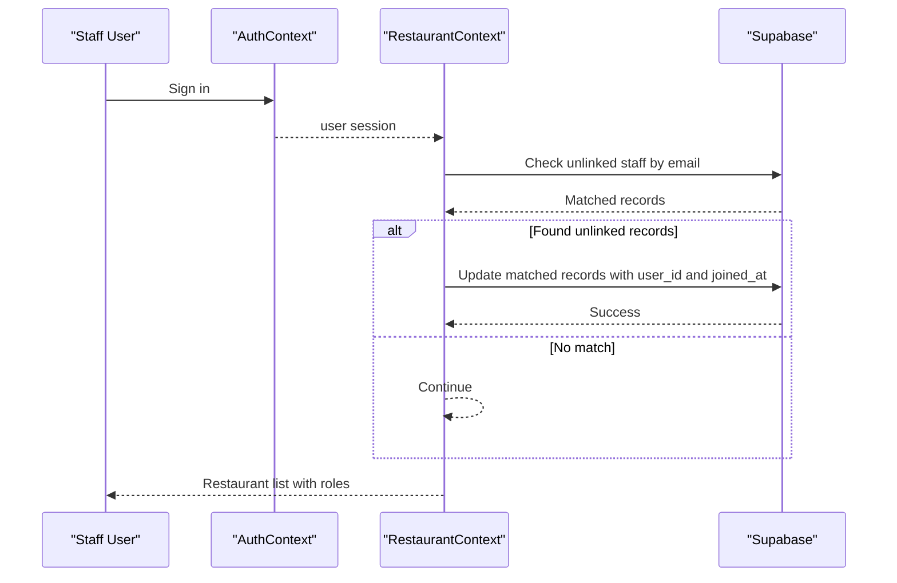
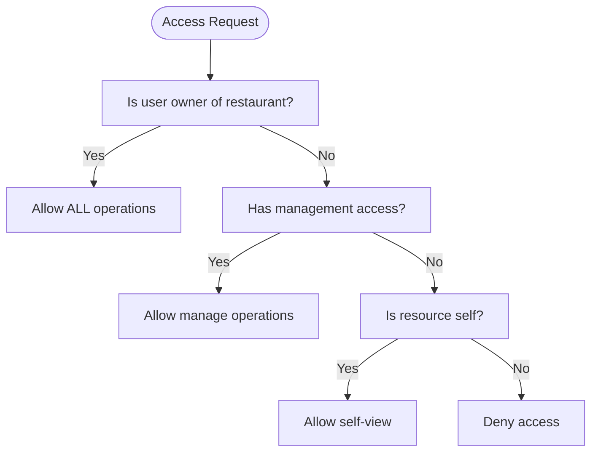
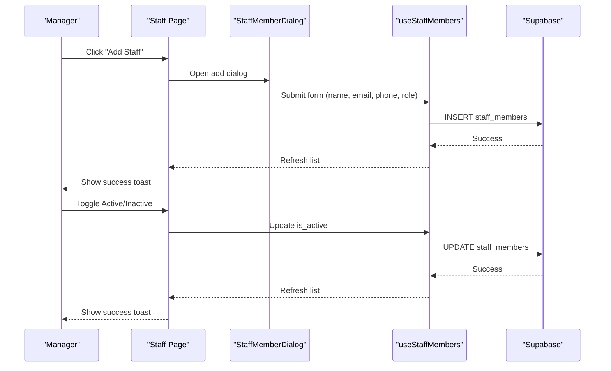
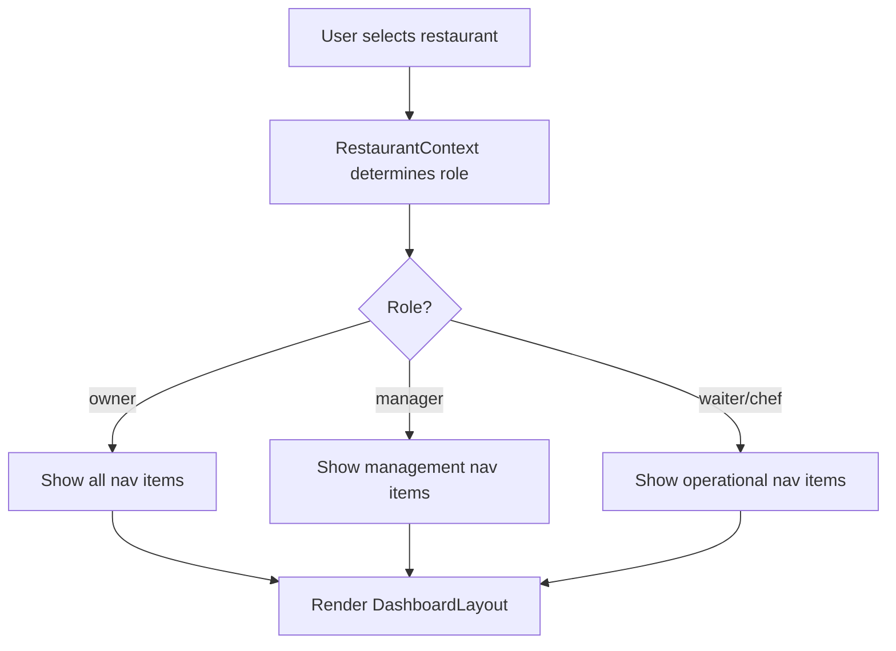
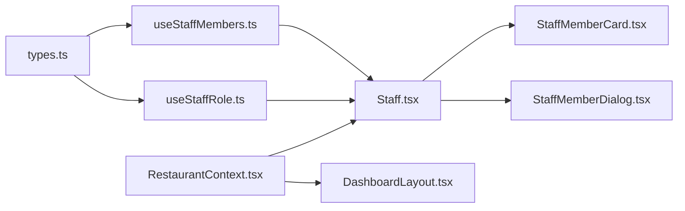

# Staff Membership & Roles

<cite>
**Referenced Files in This Document**
- [Staff.tsx](file://src/pages/dashboard/Staff.tsx)
- [useStaffMembers.ts](file://src/hooks/useStaffMembers.ts)
- [useStaffRole.ts](file://src/hooks/useStaffRole.ts)
- [StaffMemberCard.tsx](file://src/components/staff/StaffMemberCard.tsx)
- [StaffMemberDialog.tsx](file://src/components/staff/StaffMemberDialog.tsx)
- [DashboardLayout.tsx](file://src/components/layout/DashboardLayout.tsx)
- [RestaurantContext.tsx](file://src/contexts/RestaurantContext.tsx)
- [AuthContext.tsx](file://src/contexts/AuthContext.tsx)
- [types.ts](file://src/integrations/supabase/types.ts)
- [20251206081648_ef719884-b181-43d8-832a-02825f1b3a50.sql](file://supabase/migrations/20251206081648_ef719884-b181-43d8-832a-02825f1b3a50.sql)
- [20251206132719_11d13f91-c469-437f-9d98-63127362f20c.sql](file://supabase/migrations/20251206132719_11d13f91-c469-437f-9d98-63127362f20c.sql)
- [20251206133509_50399ee0-7c3e-4927-bf1a-00556ef24c8c.sql](file://supabase/migrations/20251206133509_50399ee0-7c3e-4927-bf1a-00556ef24c8c.sql)
</cite>

## Table of Contents
1. [Introduction](#introduction)
2. [Project Structure](#project-structure)
3. [Core Components](#core-components)
4. [Architecture Overview](#architecture-overview)
5. [Detailed Component Analysis](#detailed-component-analysis)
6. [Dependency Analysis](#dependency-analysis)
7. [Performance Considerations](#performance-considerations)
8. [Troubleshooting Guide](#troubleshooting-guide)
9. [Conclusion](#conclusion)

## Introduction
This document explains staff membership and role management in TableFlow Pro. It covers the staff_role enum, staff_members table structure, and the relationships between users, restaurants, and roles. It documents invitation workflows, email-based staff linking, automatic account association, role-based access control, permission hierarchies, UI visibility rules, and practical staff onboarding and deactivation procedures. It also addresses staff activity tracking, join date management, and status handling.

## Project Structure
The staff membership and role system spans frontend React components and hooks, backend Supabase database schemas and policies, and authentication contexts.



**Diagram sources**
- [AuthContext.tsx:1-141](file://src/contexts/AuthContext.tsx#L1-L141)
- [RestaurantContext.tsx:1-391](file://src/contexts/RestaurantContext.tsx#L1-L391)
- [Staff.tsx:1-205](file://src/pages/dashboard/Staff.tsx#L1-L205)
- [useStaffMembers.ts:1-255](file://src/hooks/useStaffMembers.ts#L1-L255)
- [useStaffRole.ts:1-190](file://src/hooks/useStaffRole.ts#L1-L190)
- [StaffMemberCard.tsx:1-140](file://src/components/staff/StaffMemberCard.tsx#L1-L140)
- [StaffMemberDialog.tsx:1-184](file://src/components/staff/StaffMemberDialog.tsx#L1-L184)
- [DashboardLayout.tsx:1-402](file://src/components/layout/DashboardLayout.tsx#L1-L402)
- [types.ts:679-688](file://src/integrations/supabase/types.ts#L679-L688)
- [20251206081648_ef719884-b181-43d8-832a-02825f1b3a50.sql:1-157](file://supabase/migrations/20251206081648_ef719884-b181-43d8-832a-02825f1b3a50.sql#L1-L157)
- [20251206132719_11d13f91-c469-437f-9d98-63127362f20c.sql:1-12](file://supabase/migrations/20251206132719_11d13f91-c469-437f-9d98-63127362f20c.sql#L1-L12)
- [20251206133509_50399ee0-7c3e-4927-bf1a-00556ef24c8c.sql:1-28](file://supabase/migrations/20251206133509_50399ee0-7c3e-4927-bf1a-00556ef24c8c.sql#L1-L28)

**Section sources**
- [Staff.tsx:1-205](file://src/pages/dashboard/Staff.tsx#L1-L205)
- [useStaffMembers.ts:1-255](file://src/hooks/useStaffMembers.ts#L1-L255)
- [useStaffRole.ts:1-190](file://src/hooks/useStaffRole.ts#L1-L190)
- [DashboardLayout.tsx:58-73](file://src/components/layout/DashboardLayout.tsx#L58-L73)
- [RestaurantContext.tsx:286-296](file://src/contexts/RestaurantContext.tsx#L286-L296)

## Core Components
- staff_role enum: owner, manager, waiter, chef
- staff_members table: links users to restaurants with role and status
- Shifts table: schedules staff availability per restaurant
- Frontend hooks:
  - useStaffMembers: CRUD for staff_members and shifts
  - useStaffRole: resolves current role and permissions
- UI components:
  - Staff page with search, add/edit/delete, activation toggles
  - StaffMemberCard and StaffMemberDialog
  - DashboardLayout navigation filtered by role

**Section sources**
- [useStaffMembers.ts:6-21](file://src/hooks/useStaffMembers.ts#L6-L21)
- [20251206081648_ef719884-b181-43d8-832a-02825f1b3a50.sql:2-33](file://supabase/migrations/20251206081648_ef719884-b181-43d8-832a-02825f1b3a50.sql#L2-L33)
- [types.ts:679-688](file://src/integrations/supabase/types.ts#L679-L688)

## Architecture Overview
The system integrates authentication, role resolution, and UI filtering. Supabase enforces row-level security policies to ensure access control based on roles and ownership.



**Diagram sources**
- [AuthContext.tsx:39-97](file://src/contexts/AuthContext.tsx#L39-L97)
- [RestaurantContext.tsx:138-296](file://src/contexts/RestaurantContext.tsx#L138-L296)
- [Staff.tsx:15-25](file://src/pages/dashboard/Staff.tsx#L15-L25)
- [useStaffMembers.ts:36-143](file://src/hooks/useStaffMembers.ts#L36-L143)
- [useStaffRole.ts:29-134](file://src/hooks/useStaffRole.ts#L29-L134)

## Detailed Component Analysis

### Staff Role Enum and Access Control
- Enum definition: owner, manager, waiter, chef
- Permission hierarchy:
  - Owner: full access across all restaurants
  - Manager: management access (can manage staff and shifts)
  - Waiter/Chef: limited access aligned with UI navigation roles
- UI visibility: DashboardLayout filters navigation items by currentRole

```mermaid
classDiagram
class StaffRole {
<<enum>>
"owner"
"manager"
"waiter"
"chef"
}
class Permissions {
+isOwner : boolean
+isManager : boolean
+hasManagementAccess : boolean
}
StaffRole --> Permissions : "resolved by"
```

**Diagram sources**
- [types.ts:679-688](file://src/integrations/supabase/types.ts#L679-L688)
- [useStaffRole.ts:127-132](file://src/hooks/useStaffRole.ts#L127-L132)
- [DashboardLayout.tsx:169-175](file://src/components/layout/DashboardLayout.tsx#L169-L175)

**Section sources**
- [types.ts:679-688](file://src/integrations/supabase/types.ts#L679-L688)
- [DashboardLayout.tsx:58-73](file://src/components/layout/DashboardLayout.tsx#L58-L73)
- [useStaffRole.ts:127-132](file://src/hooks/useStaffRole.ts#L127-L132)

### Staff Members Table and Relationships
- Primary keys and foreign keys:
  - staff_members.id
  - staff_members.restaurant_id → restaurants.id
  - staff_members.user_id → auth.users.id (optional)
- Key attributes:
  - email, full_name, phone, role, is_active, invited_at, joined_at
- Unique constraint: (restaurant_id, email)
- Relationships:
  - One restaurant has many staff_members
  - One user can be linked to multiple staff_members across restaurants
  - Shifts reference staff_members



**Diagram sources**
- [20251206081648_ef719884-b181-43d8-832a-02825f1b3a50.sql:5-33](file://supabase/migrations/20251206081648_ef719884-b181-43d8-832a-02825f1b3a50.sql#L5-L33)

**Section sources**
- [20251206081648_ef719884-b181-43d8-832a-02825f1b3a50.sql:5-20](file://supabase/migrations/20251206081648_ef719884-b181-43d8-832a-02825f1b3a50.sql#L5-L20)

### Invitation Workflow and Automatic Account Association
- When a user signs in with an email that matches an unlinked staff_member (user_id is null), the system automatically links the account and sets joined_at.
- Policies enable users to view and update matching unlinked staff records to facilitate this process.



**Diagram sources**
- [RestaurantContext.tsx:139-157](file://src/contexts/RestaurantContext.tsx#L139-L157)
- [20251206132719_11d13f91-c469-437f-9d98-63127362f20c.sql:1-12](file://supabase/migrations/20251206132719_11d13f91-c469-437f-9d98-63127362f20c.sql#L1-L12)

**Section sources**
- [RestaurantContext.tsx:139-157](file://src/contexts/RestaurantContext.tsx#L139-L157)
- [20251206132719_11d13f91-c469-437f-9d98-63127362f20c.sql:1-12](file://supabase/migrations/20251206132719_11d13f91-c469-437f-9d98-63127362f20c.sql#L1-L12)

### Role-Based Access Control Implementation
- Supabase functions:
  - get_staff_role: returns current role for a user/restaurant
  - is_restaurant_owner: checks ownership
  - has_management_access: owner or manager
- RLS policies:
  - Owners: full access to staff_members and shifts
  - Managers: select access to staff_members and shifts; limited update scope
  - Staff: can view own staff record and own shifts
  - Staff can view restaurants they work at via composite condition



**Diagram sources**
- [20251206081648_ef719884-b181-43d8-832a-02825f1b3a50.sql:39-80](file://supabase/migrations/20251206081648_ef719884-b181-43d8-832a-02825f1b3a50.sql#L39-L80)
- [20251206081648_ef719884-b181-43d8-832a-02825f1b3a50.sql:81-118](file://supabase/migrations/20251206081648_ef719884-b181-43d8-832a-02825f1b3a50.sql#L81-L118)
- [20251206133509_50399ee0-7c3e-4927-bf1a-00556ef24c8c.sql:1-12](file://supabase/migrations/20251206133509_50399ee0-7c3e-4927-bf1a-00556ef24c8c.sql#L1-L12)

**Section sources**
- [20251206081648_ef719884-b181-43d8-832a-02825f1b3a50.sql:39-118](file://supabase/migrations/20251206081648_ef719884-b181-43d8-832a-02825f1b3a50.sql#L39-L118)
- [20251206133509_50399ee0-7c3e-4927-bf1a-00556ef24c8c.sql:1-12](file://supabase/migrations/20251206133509_50399ee0-7c3e-4927-bf1a-00556ef24c8c.sql#L1-L12)

### Staff Onboarding and Deactivation Procedures
- Adding a staff member:
  - UseStaffMembers.addStaffMember inserts a new staff_members record with role and optional phone
  - UI: StaffMemberDialog validates and submits form data
- Editing a staff member:
  - UseStaffMembers.updateStaffMember updates name, phone, and role
  - Owner role is excluded from editing via form schema
- Deleting a staff member:
  - UseStaffMembers.deleteStaffMember removes the record (also cascades to shifts)
- Activating/deactivating:
  - Toggle is_active via updateStaffMember
  - UI shows Inactive badge and enables activation/deactivation actions



**Diagram sources**
- [Staff.tsx:39-119](file://src/pages/dashboard/Staff.tsx#L39-L119)
- [StaffMemberDialog.tsx:55-88](file://src/components/staff/StaffMemberDialog.tsx#L55-L88)
- [useStaffMembers.ts:80-133](file://src/hooks/useStaffMembers.ts#L80-L133)

**Section sources**
- [Staff.tsx:39-119](file://src/pages/dashboard/Staff.tsx#L39-L119)
- [StaffMemberDialog.tsx:31-88](file://src/components/staff/StaffMemberDialog.tsx#L31-L88)
- [useStaffMembers.ts:80-133](file://src/hooks/useStaffMembers.ts#L80-L133)

### UI Visibility and Navigation Based on Roles
- Navigation items are filtered by currentRole:
  - Owner/Manager: access to staff, data manager, settings
  - Waiter/Chef: limited to operational views like order kiosk and kitchen view
- Current role is derived from RestaurantContext and updated when currentRestaurant changes



**Diagram sources**
- [RestaurantContext.tsx:286-296](file://src/contexts/RestaurantContext.tsx#L286-L296)
- [DashboardLayout.tsx:169-175](file://src/components/layout/DashboardLayout.tsx#L169-L175)

**Section sources**
- [DashboardLayout.tsx:58-73](file://src/components/layout/DashboardLayout.tsx#L58-L73)
- [RestaurantContext.tsx:286-296](file://src/contexts/RestaurantContext.tsx#L286-L296)

### Staff Activity Tracking and Status Handling
- invited_at: timestamp when staff record was created
- joined_at: timestamp when user linked their account to the staff record
- is_active: toggled to deactivate staff members
- UI reflects inactive members with reduced opacity and "Inactive" badge

**Section sources**
- [20251206081648_ef719884-b181-43d8-832a-02825f1b3a50.sql:13-18](file://supabase/migrations/20251206081648_ef719884-b181-43d8-832a-02825f1b3a50.sql#L13-L18)
- [StaffMemberCard.tsx:48-63](file://src/components/staff/StaffMemberCard.tsx#L48-L63)

## Dependency Analysis
- Frontend depends on Supabase enums and tables via types.ts
- useStaffMembers and useStaffRole depend on Supabase client and RLS policies
- RestaurantContext orchestrates role determination and caches currentRole
- DashboardLayout enforces UI filtering based on resolved role



**Diagram sources**
- [types.ts:679-688](file://src/integrations/supabase/types.ts#L679-L688)
- [useStaffMembers.ts:1-5](file://src/hooks/useStaffMembers.ts#L1-L5)
- [useStaffRole.ts:1-6](file://src/hooks/useStaffRole.ts#L1-L6)
- [Staff.tsx:1-13](file://src/pages/dashboard/Staff.tsx#L1-L13)
- [RestaurantContext.tsx:1-7](file://src/contexts/RestaurantContext.tsx#L1-L7)
- [DashboardLayout.tsx:1-44](file://src/components/layout/DashboardLayout.tsx#L1-L44)

**Section sources**
- [types.ts:679-688](file://src/integrations/supabase/types.ts#L679-L688)
- [useStaffMembers.ts:1-5](file://src/hooks/useStaffMembers.ts#L1-L5)
- [useStaffRole.ts:1-6](file://src/hooks/useStaffRole.ts#L1-L6)
- [Staff.tsx:1-13](file://src/pages/dashboard/Staff.tsx#L1-L13)
- [RestaurantContext.tsx:1-7](file://src/contexts/RestaurantContext.tsx#L1-L7)
- [DashboardLayout.tsx:1-44](file://src/components/layout/DashboardLayout.tsx#L1-L44)

## Performance Considerations
- Offline-first data fetching: use offlineQuery and offlineMutate to reduce latency and improve reliability
- Efficient queries: filtering by restaurant_id and ordering by role/full_name reduces UI rendering overhead
- RLS enforcement occurs server-side; ensure indexes on frequently queried columns (e.g., restaurant_id, user_id, email)

## Troubleshooting Guide
- Cannot add/edit staff member:
  - Verify current user has management access for the selected restaurant
  - Check RLS policies for staff_members and shifts
- Email-based linking not working:
  - Confirm unlinked staff records exist with matching email
  - Ensure user is signed in and policies allow updating unlinked records
- Navigation items missing:
  - Confirm currentRole is set correctly in RestaurantContext
  - Verify DashboardLayout filtering logic

**Section sources**
- [useStaffMembers.ts:41-74](file://src/hooks/useStaffMembers.ts#L41-L74)
- [useStaffRole.ts:35-115](file://src/hooks/useStaffRole.ts#L35-L115)
- [RestaurantContext.tsx:286-296](file://src/contexts/RestaurantContext.tsx#L286-L296)
- [DashboardLayout.tsx:169-175](file://src/components/layout/DashboardLayout.tsx#L169-L175)

## Conclusion
TableFlow Pro implements a robust staff membership and role system centered on the staff_role enum and staff_members table. Supabase RLS and helper functions enforce strict access control, while frontend hooks and contexts provide seamless user experiences. The invitation workflow and automatic account association streamline onboarding, and UI filtering ensures appropriate navigation based on role. The system supports practical workflows for adding, editing, and deactivating staff, with clear activity tracking and status handling.