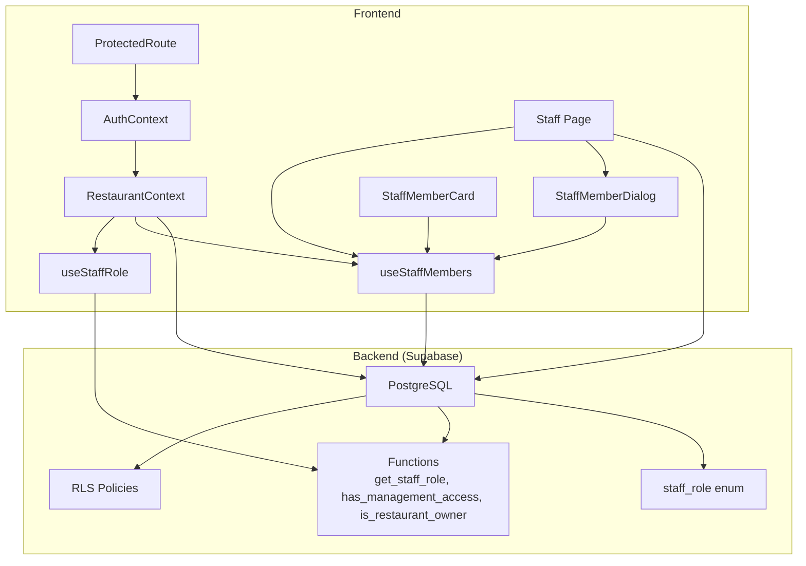
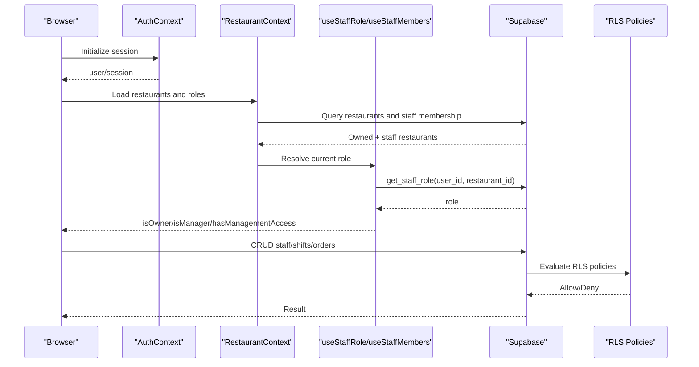
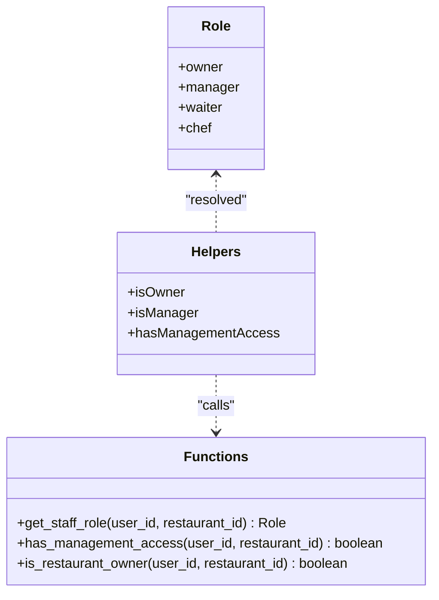
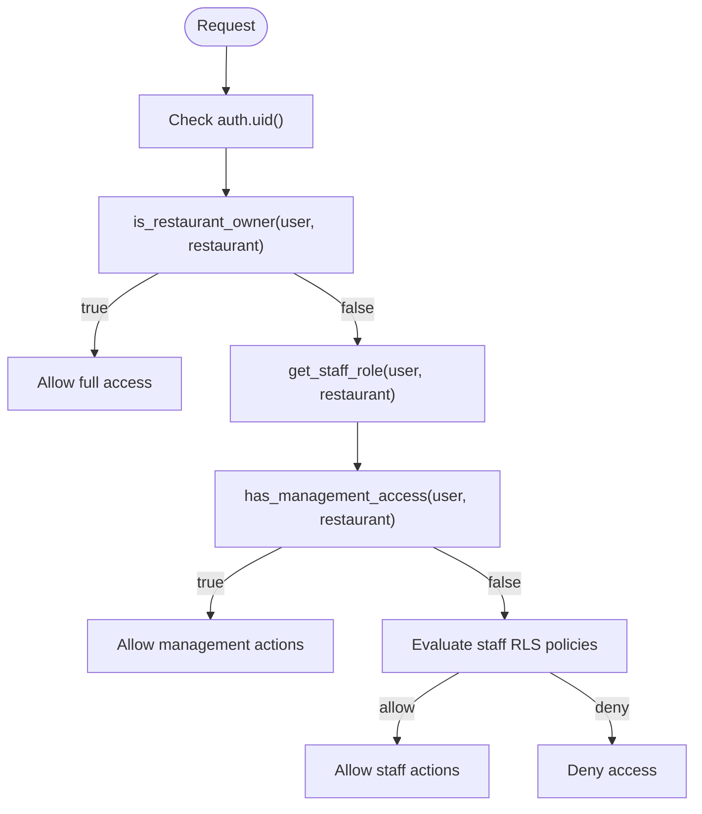
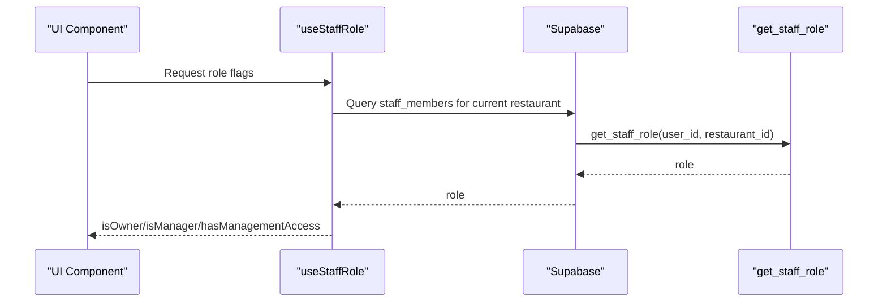
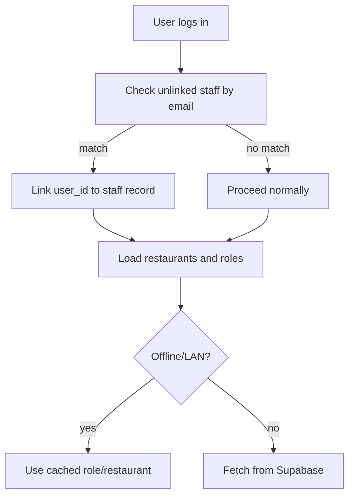
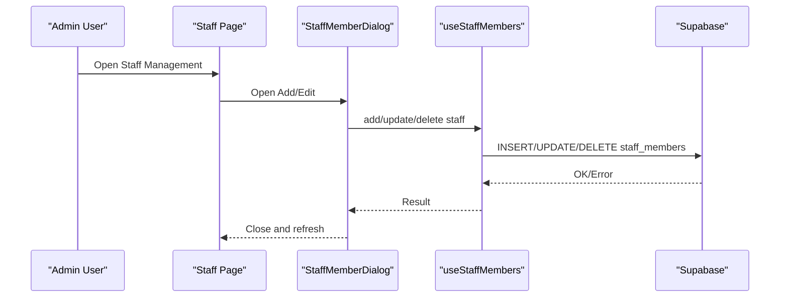
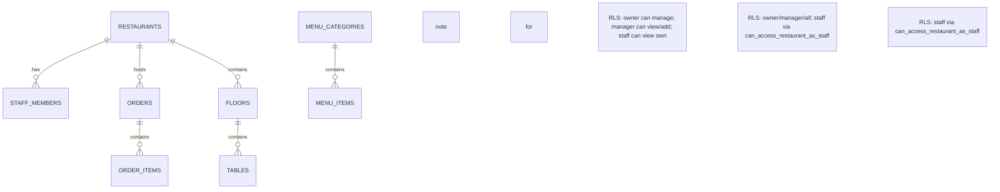
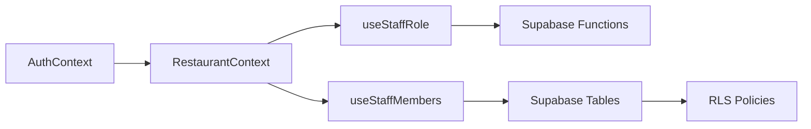

# Role Assignment & Permissions

<cite>
**Referenced Files in This Document**
- [AuthContext.tsx](file://src/contexts/AuthContext.tsx)
- [ProtectedRoute.tsx](file://src/components/ProtectedRoute.tsx)
- [RestaurantContext.tsx](file://src/contexts/RestaurantContext.tsx)
- [useStaffRole.ts](file://src/hooks/useStaffRole.ts)
- [useStaffMembers.ts](file://src/hooks/useStaffMembers.ts)
- [Staff.tsx](file://src/pages/dashboard/Staff.tsx)
- [StaffMemberDialog.tsx](file://src/components/staff/StaffMemberDialog.tsx)
- [StaffMemberCard.tsx](file://src/components/staff/StaffMemberCard.tsx)
- [types.ts](file://src/integrations/supabase/types.ts)
- [20251206081648_ef719884-b181-43d8-832a-02825f1b3a50.sql](file://supabase/migrations/20251206081648_ef719884-b181-43d8-832a-02825f1b3a50.sql)
- [20251206132719_11d13f91-c469-437f-9d98-63127362f20c.sql](file://supabase/migrations/20251206132719_11d13f91-c469-437f-9d98-63127362f20c.sql)
- [20251206133509_50399ee0-7c3e-4927-bf1a-00556ef24c8c.sql](file://supabase/migrations/20251206133509_50399ee0-7c3e-4927-bf1a-00556ef24c8c.sql)
- [20251206134902_8243dfe0-8b9c-4c6d-9a42-278158976001.sql](file://supabase/migrations/20251206134902_8243dfe0-8b9c-4c6d-9a42-278158976001.sql)
</cite>

## Table of Contents
1. [Introduction](#introduction)
2. [Project Structure](#project-structure)
3. [Core Components](#core-components)
4. [Architecture Overview](#architecture-overview)
5. [Detailed Component Analysis](#detailed-component-analysis)
6. [Dependency Analysis](#dependency-analysis)
7. [Performance Considerations](#performance-considerations)
8. [Troubleshooting Guide](#troubleshooting-guide)
9. [Conclusion](#conclusion)

## Introduction
This document explains the staff role assignment and permission management system. It covers the role hierarchy (owner, manager, staff, and customer), role-based access control (RBAC), permission checking, and role validation. It also documents how roles integrate with restaurant-level permissions and staff access to features, along with practical workflows, permission inheritance, and best practices for secure role management.

## Project Structure
The RBAC system spans frontend React components and backend Supabase policies/functions:
- Frontend contexts and hooks manage authentication, restaurant selection, and staff roles.
- Supabase migrations define enums, tables, row-level security (RLS) policies, and helper functions for role checks.

**Diagram sources**
- [AuthContext.tsx:1-141](file://src/contexts/AuthContext.tsx#L1-L141)
- [RestaurantContext.tsx:1-391](file://src/contexts/RestaurantContext.tsx#L1-L391)
- [useStaffRole.ts:1-190](file://src/hooks/useStaffRole.ts#L1-L190)
- [useStaffMembers.ts:1-255](file://src/hooks/useStaffMembers.ts#L1-L255)
- [ProtectedRoute.tsx:1-60](file://src/components/ProtectedRoute.tsx#L1-L60)
- [Staff.tsx:1-205](file://src/pages/dashboard/Staff.tsx#L1-L205)
- [StaffMemberDialog.tsx:1-184](file://src/components/staff/StaffMemberDialog.tsx#L1-L184)
- [StaffMemberCard.tsx:1-140](file://src/components/staff/StaffMemberCard.tsx#L1-L140)
- [20251206081648_ef719884-b181-43d8-832a-02825f1b3a50.sql:1-157](file://supabase/migrations/20251206081648_ef719884-b181-43d8-832a-02825f1b3a50.sql#L1-L157)
- [20251206132719_11d13f91-c469-437f-9d98-63127362f20c.sql:1-12](file://supabase/migrations/20251206132719_11d13f91-c469-437f-9d98-63127362f20c.sql#L1-L12)
- [20251206133509_50399ee0-7c3e-4927-bf1a-00556ef24c8c.sql:1-28](file://supabase/migrations/20251206133509_50399ee0-7c3e-4927-bf1a-00556ef24c8c.sql#L1-L28)
- [20251206134902_8243dfe0-8b9c-4c6d-9a42-278158976001.sql:1-76](file://supabase/migrations/20251206134902_8243dfe0-8b9c-4c6d-9a42-278158976001.sql#L1-L76)

**Section sources**
- [AuthContext.tsx:1-141](file://src/contexts/AuthContext.tsx#L1-L141)
- [RestaurantContext.tsx:1-391](file://src/contexts/RestaurantContext.tsx#L1-L391)
- [useStaffRole.ts:1-190](file://src/hooks/useStaffRole.ts#L1-L190)
- [useStaffMembers.ts:1-255](file://src/hooks/useStaffMembers.ts#L1-L255)
- [ProtectedRoute.tsx:1-60](file://src/components/ProtectedRoute.tsx#L1-L60)
- [Staff.tsx:1-205](file://src/pages/dashboard/Staff.tsx#L1-L205)
- [StaffMemberDialog.tsx:1-184](file://src/components/staff/StaffMemberDialog.tsx#L1-L184)
- [StaffMemberCard.tsx:1-140](file://src/components/staff/StaffMemberCard.tsx#L1-L140)
- [20251206081648_ef719884-b181-43d8-832a-02825f1b3a50.sql:1-157](file://supabase/migrations/20251206081648_ef719884-b181-43d8-832a-02825f1b3a50.sql#L1-L157)
- [20251206132719_11d13f91-c469-437f-9d98-63127362f20c.sql:1-12](file://supabase/migrations/20251206132719_11d13f91-c469-437f-9d98-63127362f20c.sql#L1-L12)
- [20251206133509_50399ee0-7c3e-4927-bf1a-00556ef24c8c.sql:1-28](file://supabase/migrations/20251206133509_50399ee0-7c3e-4927-bf1a-00556ef24c8c.sql#L1-L28)
- [20251206134902_8243dfe0-8b9c-4c6d-9a42-278158976001.sql:1-76](file://supabase/migrations/20251206134902_8243dfe0-8b9c-4c6d-9a42-278158976001.sql#L1-L76)

## Core Components
- Authentication and session management via Supabase Auth, with offline caching and LAN client support.
- Restaurant selection and role resolution per restaurant.
- Staff role detection and helpers for UI decisions.
- Staff management UI with add/edit/delete and activation toggles.
- Backend role functions and RLS policies enforcing access per role.

Key responsibilities:
- AuthContext: Provides user/session state and lifecycle events.
- RestaurantContext: Loads restaurants, resolves current role, and persists selections.
- useStaffRole: Resolves current user’s role for the selected restaurant and exposes helpers.
- useStaffMembers: CRUD for staff and shifts with offline support.
- Supabase functions/policies: Enforce who can access what based on role and ownership.

**Section sources**
- [AuthContext.tsx:1-141](file://src/contexts/AuthContext.tsx#L1-L141)
- [RestaurantContext.tsx:1-391](file://src/contexts/RestaurantContext.tsx#L1-L391)
- [useStaffRole.ts:1-190](file://src/hooks/useStaffRole.ts#L1-L190)
- [useStaffMembers.ts:1-255](file://src/hooks/useStaffMembers.ts#L1-L255)

## Architecture Overview
The system enforces RBAC across three layers:
- Authentication: Supabase Auth supplies user identity.
- Authorization: Supabase functions determine role and management access.
- Access Control: RLS policies restrict reads/writes to permitted resources.

**Diagram sources**
- [AuthContext.tsx:1-141](file://src/contexts/AuthContext.tsx#L1-L141)
- [RestaurantContext.tsx:1-391](file://src/contexts/RestaurantContext.tsx#L1-L391)
- [useStaffRole.ts:1-190](file://src/hooks/useStaffRole.ts#L1-L190)
- [useStaffMembers.ts:1-255](file://src/hooks/useStaffMembers.ts#L1-L255)
- [20251206081648_ef719884-b181-43d8-832a-02825f1b3a50.sql:1-157](file://supabase/migrations/20251206081648_ef719884-b181-43d8-832a-02825f1b3a50.sql#L1-L157)
- [20251206132719_11d13f91-c469-437f-9d98-63127362f20c.sql:1-12](file://supabase/migrations/20251206132719_11d13f91-c469-437f-9d98-63127362f20c.sql#L1-L12)
- [20251206133509_50399ee0-7c3e-4927-bf1a-00556ef24c8c.sql:1-28](file://supabase/migrations/20251206133509_50399ee0-7c3e-4927-bf1a-00556ef24c8c.sql#L1-L28)
- [20251206134902_8243dfe0-8b9c-4c6d-9a42-278158976001.sql:1-76](file://supabase/migrations/20251206134902_8243dfe0-8b9c-4c6d-9a42-278158976001.sql#L1-L76)

## Detailed Component Analysis

### Role Hierarchy and Permissions
- Roles: owner, manager, waiter, chef.
- Owner: Full access to restaurant resources; auto-created when a restaurant is made.
- Manager: Management access (enforced by helper function).
- Waiter/Chef: Staff-level access; granted via RLS policies for supported tables.

**Diagram sources**
- [types.ts:679-684](file://src/integrations/supabase/types.ts#L679-L684)
- [useStaffRole.ts:127-131](file://src/hooks/useStaffRole.ts#L127-L131)
- [20251206081648_ef719884-b181-43d8-832a-02825f1b3a50.sql:40-79](file://supabase/migrations/20251206081648_ef719884-b181-43d8-832a-02825f1b3a50.sql#L40-L79)

**Section sources**
- [types.ts:679-684](file://src/integrations/supabase/types.ts#L679-L684)
- [useStaffRole.ts:127-131](file://src/hooks/useStaffRole.ts#L127-L131)
- [20251206081648_ef719884-b181-43d8-832a-02825f1b3a50.sql:40-79](file://supabase/migrations/20251206081648_ef719884-b181-43d8-832a-02825f1b3a50.sql#L40-L79)

### Role-Based Access Control Implementation
- Ownership: Restaurant owner_id determines owner privileges.
- Management access: Helper function aggregates owner and manager roles.
- Staff access: RLS policies enable staff to access relevant resources (orders, order_items, tables, floors, menu_*).

**Diagram sources**
- [20251206081648_ef719884-b181-43d8-832a-02825f1b3a50.sql:54-79](file://supabase/migrations/20251206081648_ef719884-b181-43d8-832a-02825f1b3a50.sql#L54-L79)
- [20251206134902_8243dfe0-8b9c-4c6d-9a42-278158976001.sql:1-76](file://supabase/migrations/20251206134902_8243dfe0-8b9c-4c6d-9a42-278158976001.sql#L1-L76)

**Section sources**
- [20251206081648_ef719884-b181-43d8-832a-02825f1b3a50.sql:54-79](file://supabase/migrations/20251206081648_ef719884-b181-43d8-832a-02825f1b3a50.sql#L54-L79)
- [20251206134902_8243dfe0-8b9c-4c6d-9a42-278158976001.sql:1-76](file://supabase/migrations/20251206134902_8243dfe0-8b9c-4c6d-9a42-278158976001.sql#L1-L76)

### Permission Checking Mechanisms
- Frontend helpers compute booleans for UI rendering and feature gating.
- Backend functions encapsulate role checks to prevent RLS recursion and simplify policies.

**Diagram sources**
- [useStaffRole.ts:127-131](file://src/hooks/useStaffRole.ts#L127-L131)
- [20251206081648_ef719884-b181-43d8-832a-02825f1b3a50.sql:40-52](file://supabase/migrations/20251206081648_ef719884-b181-43d8-832a-02825f1b3a50.sql#L40-L52)

**Section sources**
- [useStaffRole.ts:127-131](file://src/hooks/useStaffRole.ts#L127-L131)
- [20251206081648_ef719884-b181-43d8-832a-02825f1b3a50.sql:40-52](file://supabase/migrations/20251206081648_ef719884-b181-43d8-832a-02825f1b3a50.sql#L40-L52)

### Role Validation Processes
- Unlinked staff accounts can self-link if email matches a staff record with no user_id.
- Restaurant membership is validated via staff_members with is_active flag.
- Current role is persisted locally when offline or in LAN client mode.

**Diagram sources**
- [useStaffRole.ts:44-59](file://src/hooks/useStaffRole.ts#L44-L59)
- [RestaurantContext.tsx:139-157](file://src/contexts/RestaurantContext.tsx#L139-L157)
- [20251206132719_11d13f91-c469-437f-9d98-63127362f20c.sql:1-12](file://supabase/migrations/20251206132719_11d13f91-c469-437f-9d98-63127362f20c.sql#L1-L12)

**Section sources**
- [useStaffRole.ts:44-59](file://src/hooks/useStaffRole.ts#L44-L59)
- [RestaurantContext.tsx:139-157](file://src/contexts/RestaurantContext.tsx#L139-L157)
- [20251206132719_11d13f91-c469-437f-9d98-63127362f20c.sql:1-12](file://supabase/migrations/20251206132719_11d13f91-c469-437f-9d98-63127362f20c.sql#L1-L12)

### Staff Role Assignment and Management
- Staff page lists, searches, and manages staff members.
- Role selection excludes owner in forms; owner role is managed internally by the system.
- Shift scheduling integrates with staff assignments.

**Diagram sources**
- [Staff.tsx:39-120](file://src/pages/dashboard/Staff.tsx#L39-L120)
- [StaffMemberDialog.tsx:31-88](file://src/components/staff/StaffMemberDialog.tsx#L31-L88)
- [useStaffMembers.ts:80-142](file://src/hooks/useStaffMembers.ts#L80-L142)

**Section sources**
- [Staff.tsx:39-120](file://src/pages/dashboard/Staff.tsx#L39-L120)
- [StaffMemberDialog.tsx:31-88](file://src/components/staff/StaffMemberDialog.tsx#L31-L88)
- [useStaffMembers.ts:80-142](file://src/hooks/useStaffMembers.ts#L80-L142)

### Restaurant-Level Permissions and Staff Access
- Staff can view restaurants they work at via RLS policy.
- RLS policies extend to orders, order_items, tables, floors, menu_categories, and menu_items for staff with access.
- Management access allows full CRUD on staff and shifts.

**Diagram sources**
- [20251206133509_50399ee0-7c3e-4927-bf1a-00556ef24c8c.sql:1-12](file://supabase/migrations/20251206133509_50399ee0-7c3e-4927-bf1a-00556ef24c8c.sql#L1-L12)
- [20251206134902_8243dfe0-8b9c-4c6d-9a42-278158976001.sql:1-76](file://supabase/migrations/20251206134902_8243dfe0-8b9c-4c6d-9a42-278158976001.sql#L1-L76)
- [20251206081648_ef719884-b181-43d8-832a-02825f1b3a50.sql:101-118](file://supabase/migrations/20251206081648_ef719884-b181-43d8-832a-02825f1b3a50.sql#L101-L118)

**Section sources**
- [20251206133509_50399ee0-7c3e-4927-bf1a-00556ef24c8c.sql:1-12](file://supabase/migrations/20251206133509_50399ee0-7c3e-4927-bf1a-00556ef24c8c.sql#L1-L12)
- [20251206134902_8243dfe0-8b9c-4c6d-9a42-278158976001.sql:1-76](file://supabase/migrations/20251206134902_8243dfe0-8b9c-4c6d-9a42-278158976001.sql#L1-L76)
- [20251206081648_ef719884-b181-43d8-832a-02825f1b3a50.sql:101-118](file://supabase/migrations/20251206081648_ef719884-b181-43d8-832a-02825f1b3a50.sql#L101-L118)

### Practical Workflows and Examples
- Assigning a manager:
  - Open Staff Management, add a new staff member with role manager.
  - The system inserts a staff_members record linked to the current restaurant.
- Promoting a staff member:
  - Edit the staff member’s role to manager or chef.
- Removing access:
  - Deactivate the staff member or delete the record.
- Role inheritance:
  - Owner implicitly has management access; manager inherits management rights for the restaurant.

**Section sources**
- [Staff.tsx:39-120](file://src/pages/dashboard/Staff.tsx#L39-L120)
- [useStaffMembers.ts:80-142](file://src/hooks/useStaffMembers.ts#L80-L142)
- [20251206081648_ef719884-b181-43d8-832a-02825f1b3a50.sql:82-118](file://supabase/migrations/20251206081648_ef719884-b181-43d8-832a-02825f1b3a50.sql#L82-L118)

### Security Considerations and Best Practices
- Prefer helper functions for role checks to avoid RLS recursion.
- Always scope queries by restaurant_id to enforce tenant isolation.
- Use RLS policies to minimize application-level checks.
- Keep role flags derived from backend functions to prevent stale UI states.
- Leverage offline caching with careful invalidation when roles change.

**Section sources**
- [20251206081648_ef719884-b181-43d8-832a-02825f1b3a50.sql:40-79](file://supabase/migrations/20251206081648_ef719884-b181-43d8-832a-02825f1b3a50.sql#L40-L79)
- [RestaurantContext.tsx:286-296](file://src/contexts/RestaurantContext.tsx#L286-L296)

## Dependency Analysis
- Frontend depends on Supabase for identity and data.
- RestaurantContext orchestrates role resolution and caches state.
- useStaffRole depends on Supabase functions for accurate role checks.
- Staff management UI depends on useStaffMembers for CRUD operations.

**Diagram sources**
- [AuthContext.tsx:1-141](file://src/contexts/AuthContext.tsx#L1-L141)
- [RestaurantContext.tsx:1-391](file://src/contexts/RestaurantContext.tsx#L1-L391)
- [useStaffRole.ts:1-190](file://src/hooks/useStaffRole.ts#L1-L190)
- [useStaffMembers.ts:1-255](file://src/hooks/useStaffMembers.ts#L1-L255)
- [20251206081648_ef719884-b181-43d8-832a-02825f1b3a50.sql:1-157](file://supabase/migrations/20251206081648_ef719884-b181-43d8-832a-02825f1b3a50.sql#L1-L157)

**Section sources**
- [AuthContext.tsx:1-141](file://src/contexts/AuthContext.tsx#L1-L141)
- [RestaurantContext.tsx:1-391](file://src/contexts/RestaurantContext.tsx#L1-L391)
- [useStaffRole.ts:1-190](file://src/hooks/useStaffRole.ts#L1-L190)
- [useStaffMembers.ts:1-255](file://src/hooks/useStaffMembers.ts#L1-L255)
- [20251206081648_ef719884-b181-43d8-832a-02825f1b3a50.sql:1-157](file://supabase/migrations/20251206081648_ef719884-b181-43d8-832a-02825f1b3a50.sql#L1-L157)

## Performance Considerations
- Use offline-aware queries for staff and shifts to reduce latency and improve reliability.
- Cache current restaurant and role locally to avoid repeated backend calls during navigation.
- Batch role checks on mount and reuse computed flags across components.

[No sources needed since this section provides general guidance]

## Troubleshooting Guide
- Stale role after promotion: Refresh restaurant data to update cached role.
- Self-linking not working: Ensure email matches an unlinked staff record; backend attempts to link on auth state change.
- Access denied for staff: Confirm RLS policies apply and restaurant_id is correctly scoped.

**Section sources**
- [RestaurantContext.tsx:286-296](file://src/contexts/RestaurantContext.tsx#L286-L296)
- [useStaffRole.ts:44-59](file://src/hooks/useStaffRole.ts#L44-L59)
- [20251206132719_11d13f91-c469-437f-9d98-63127362f20c.sql:1-12](file://supabase/migrations/20251206132719_11d13f91-c469-437f-9d98-63127362f20c.sql#L1-L12)

## Conclusion
The system implements a robust RBAC model centered on restaurant-scoped roles. Frontend hooks resolve roles efficiently, while backend functions and RLS policies enforce tenant isolation and appropriate access. Following the documented workflows and best practices ensures secure and maintainable role management.