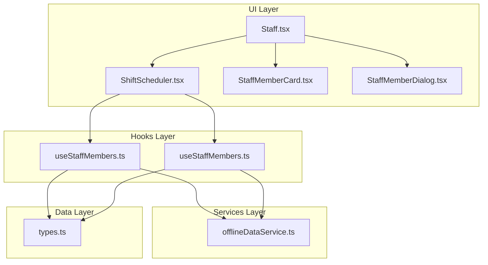
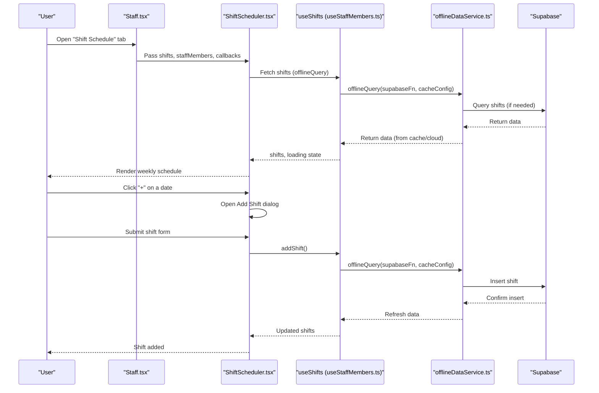
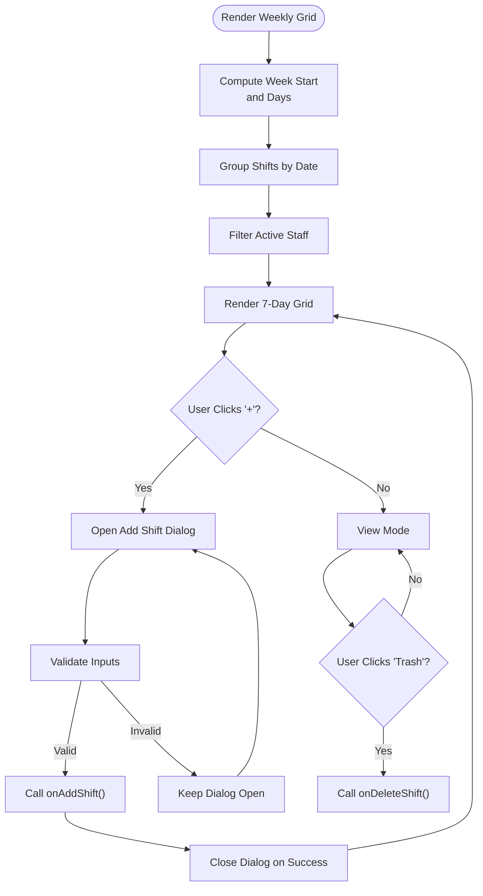
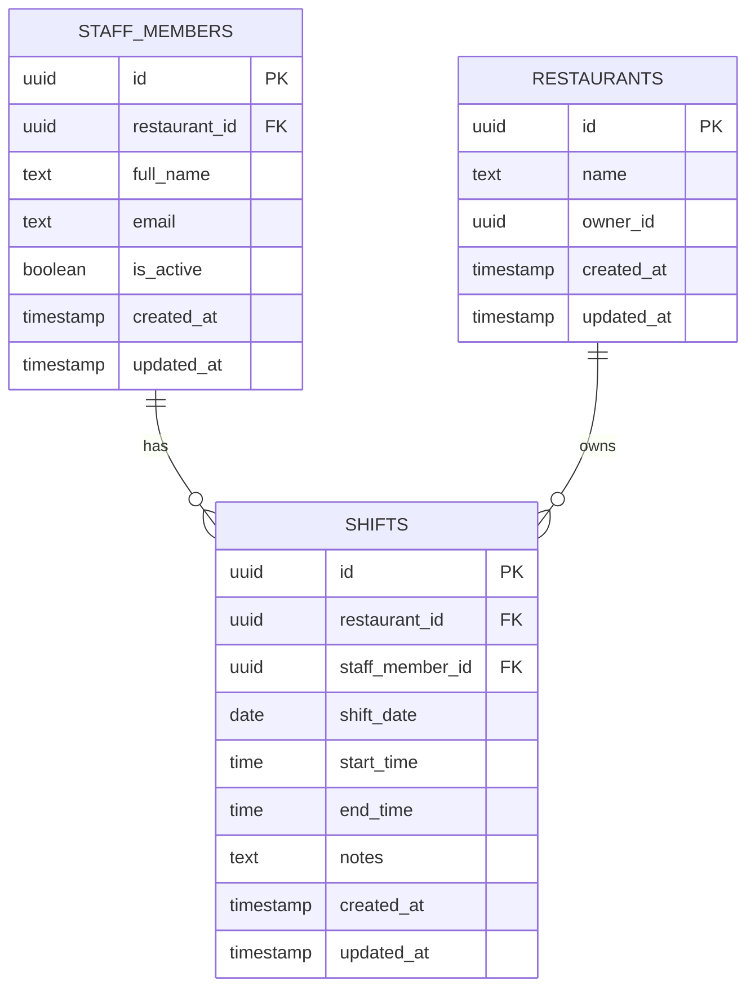
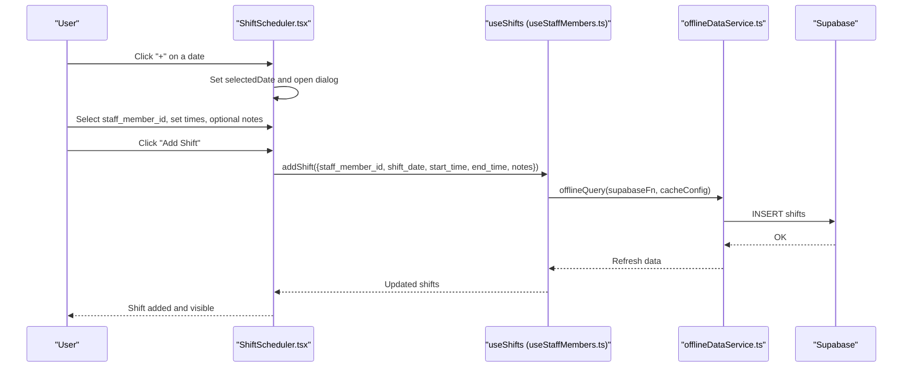
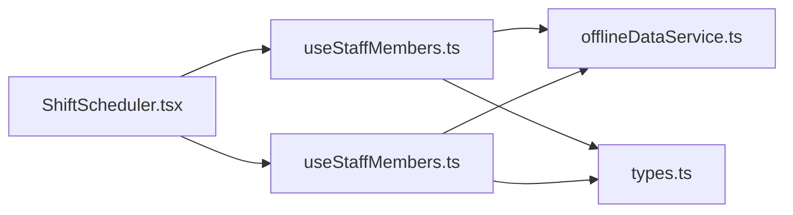

# Shift Scheduling System

<cite>
**Referenced Files in This Document**
- [ShiftScheduler.tsx](file://src/components/staff/ShiftScheduler.tsx)
- [useStaffMembers.ts](file://src/hooks/useStaffMembers.ts)
- [Staff.tsx](file://src/pages/dashboard/Staff.tsx)
- [types.ts](file://src/integrations/supabase/types.ts)
- [offlineDataService.ts](file://src/services/offlineDataService.ts)
- [StaffMemberCard.tsx](file://src/components/staff/StaffMemberCard.tsx)
- [StaffMemberDialog.tsx](file://src/components/staff/StaffMemberDialog.tsx)
</cite>

## Table of Contents
1. [Introduction](#introduction)
2. [Project Structure](#project-structure)
3. [Core Components](#core-components)
4. [Architecture Overview](#architecture-overview)
5. [Detailed Component Analysis](#detailed-component-analysis)
6. [Dependency Analysis](#dependency-analysis)
7. [Performance Considerations](#performance-considerations)
8. [Troubleshooting Guide](#troubleshooting-guide)
9. [Conclusion](#conclusion)

## Introduction
This document provides comprehensive technical documentation for the shift scheduling system within the TableFlow Pro application. It covers the ShiftScheduler component implementation, shift creation and management workflows, shift conflict detection, shift timing calculations, staff availability tracking, and shift assignment processes. It also documents the shift data model, practical planning scenarios, conflict resolution, modification workflows, integration with staff availability, notifications, and schedule visualization. Finally, it outlines best practices for staff workload balancing and schedule approval workflows.

## Project Structure
The shift scheduling functionality is implemented as a cohesive module centered around the ShiftScheduler component, backed by React hooks for data management and Supabase for persistence. The Staff dashboard page orchestrates the integration between UI components and data hooks.

**Diagram sources**
- [Staff.tsx:15-204](file://src/pages/dashboard/Staff.tsx#L15-L204)
- [ShiftScheduler.tsx:40-274](file://src/components/staff/ShiftScheduler.tsx#L40-L274)
- [useStaffMembers.ts:36-254](file://src/hooks/useStaffMembers.ts#L36-L254)
- [offlineDataService.ts:151-211](file://src/services/offlineDataService.ts#L151-L211)
- [types.ts:465-515](file://src/integrations/supabase/types.ts#L465-L515)

**Section sources**
- [Staff.tsx:15-204](file://src/pages/dashboard/Staff.tsx#L15-L204)
- [ShiftScheduler.tsx:40-274](file://src/components/staff/ShiftScheduler.tsx#L40-L274)
- [useStaffMembers.ts:36-254](file://src/hooks/useStaffMembers.ts#L36-L254)

## Core Components
- ShiftScheduler: A weekly calendar-based component that displays shifts across seven days, supports adding and deleting shifts, and integrates with staff availability filtering.
- useStaffMembers and useShifts: React hooks that encapsulate staff and shift data fetching, caching, and mutations with offline-first capabilities.
- Staff dashboard integration: The Staff page wires the ShiftScheduler component with data from hooks and exposes tabbed views for staff management and scheduling.

Key responsibilities:
- Render weekly schedule grid with day headers and shift blocks
- Filter active staff for shift assignments
- Group shifts by date for efficient rendering
- Manage form state for new shift creation
- Trigger add/delete operations via hook callbacks

**Section sources**
- [ShiftScheduler.tsx:26-113](file://src/components/staff/ShiftScheduler.tsx#L26-L113)
- [useStaffMembers.ts:145-254](file://src/hooks/useStaffMembers.ts#L145-L254)
- [Staff.tsx:183-191](file://src/pages/dashboard/Staff.tsx#L183-L191)

## Architecture Overview
The system follows an offline-first architecture with Supabase as the primary backend. Data queries leverage a caching layer that prioritizes local storage in Electron/LAN modes while falling back to cloud when necessary. The ShiftScheduler component consumes data from hooks that abstract away caching and synchronization concerns.

**Diagram sources**
- [Staff.tsx:183-191](file://src/pages/dashboard/Staff.tsx#L183-L191)
- [ShiftScheduler.tsx:77-104](file://src/components/staff/ShiftScheduler.tsx#L77-L104)
- [useStaffMembers.ts:150-186](file://src/hooks/useStaffMembers.ts#L150-L186)
- [offlineDataService.ts:151-211](file://src/services/offlineDataService.ts#L151-L211)

## Detailed Component Analysis

### ShiftScheduler Component
The ShiftScheduler component renders a weekly calendar grid and manages shift creation and deletion. It calculates the current week’s dates, groups shifts by date, filters active staff, and provides controls for navigating weeks and opening the add-shift dialog.

Implementation highlights:
- Week navigation: Uses date-fns to compute the start of the week and move forward/backward by seven days.
- Shift grouping: Memoized grouping by shift_date for efficient rendering.
- Active staff filtering: Filters staff by is_active to limit assignments to currently employed staff.
- Add shift dialog: Collects staff_member_id, shift_date, start_time, end_time, and optional notes; validates required fields before submission.
- Delete shift: Invokes onDeleteShift callback with the shift id.

**Diagram sources**
- [ShiftScheduler.tsx:47-113](file://src/components/staff/ShiftScheduler.tsx#L47-L113)
- [ShiftScheduler.tsx:77-104](file://src/components/staff/ShiftScheduler.tsx#L77-L104)

**Section sources**
- [ShiftScheduler.tsx:40-274](file://src/components/staff/ShiftScheduler.tsx#L40-L274)

### Shift Data Model and Database Schema
The shift data model is defined in TypeScript and corresponds to the Supabase schema. The model includes identifiers, restaurant linkage, staff association, date and time fields, and optional notes.

Fields:
- id: Unique identifier
- restaurant_id: Links shift to a restaurant
- staff_member_id: Links shift to a staff member
- shift_date: Date of the shift (YYYY-MM-DD)
- start_time: Shift start time (HH:mm)
- end_time: Shift end time (HH:mm)
- notes: Optional notes
- created_at/updated_at: Timestamps

**Diagram sources**
- [types.ts:465-498](file://src/integrations/supabase/types.ts#L465-L498)
- [types.ts:516-558](file://src/integrations/supabase/types.ts#L516-L558)

**Section sources**
- [useStaffMembers.ts:23-34](file://src/hooks/useStaffMembers.ts#L23-L34)
- [types.ts:465-515](file://src/integrations/supabase/types.ts#L465-L515)

### Shift Creation and Management Workflows
Shift creation and management are handled through the ShiftScheduler component and the useShifts hook. The workflow includes:
- Opening the add-shift dialog and selecting a staff member
- Setting shift date, start time, and end time
- Optionally adding notes
- Submitting the form to create a shift
- Deleting shifts via the trash icon

**Diagram sources**
- [ShiftScheduler.tsx:77-104](file://src/components/staff/ShiftScheduler.tsx#L77-L104)
- [useStaffMembers.ts:192-217](file://src/hooks/useStaffMembers.ts#L192-L217)
- [offlineDataService.ts:151-211](file://src/services/offlineDataService.ts#L151-L211)

**Section sources**
- [ShiftScheduler.tsx:77-104](file://src/components/staff/ShiftScheduler.tsx#L77-L104)
- [useStaffMembers.ts:192-217](file://src/hooks/useStaffMembers.ts#L192-L217)

### Shift Timing Calculations and Conflict Detection
The current implementation does not include explicit shift conflict detection logic within the ShiftScheduler component or hooks. Conflict detection would require:
- Comparing overlapping time slots for the same staff member on the same date
- Enforcing business rules such as minimum break periods between shifts
- Providing user feedback and preventing conflicting submissions

Recommended approach:
- Extend the addShift mutation to validate against existing shifts for the same staff_member_id and shift_date
- Implement a conflict-checking function that compares start_time and end_time intervals
- Surface validation errors to the user via toast notifications or inline form errors

[No sources needed since this section proposes future enhancements not present in the current codebase]

### Staff Availability Tracking
The system tracks staff availability through the is_active flag on staff members. The ShiftScheduler filters staff to only show active employees when assigning shifts. This ensures that inactive staff (e.g., on leave, terminated) cannot be assigned to shifts.

Integration points:
- Active staff filter in ShiftScheduler
- StaffMemberCard indicates inactive status with badges
- StaffMemberDialog allows toggling is_active

**Section sources**
- [ShiftScheduler.tsx:72](file://src/components/staff/ShiftScheduler.tsx#L72)
- [StaffMemberCard.tsx:40-116](file://src/components/staff/StaffMemberCard.tsx#L40-L116)

### Shift Assignment Processes
Shift assignment is performed through the addShift mutation, which:
- Inserts a new shift record linked to the selected staff member and date
- Persists the record via Supabase with offline caching
- Refreshes the shifts list to reflect the new assignment

Best practices:
- Validate that the selected staff member is active before assignment
- Ensure shift_date falls within the expected range
- Provide clear feedback on successful assignment and potential errors

**Section sources**
- [useStaffMembers.ts:192-217](file://src/hooks/useStaffMembers.ts#L192-L217)
- [offlineDataService.ts:151-211](file://src/services/offlineDataService.ts#L151-L211)

### Practical Examples and Scenarios
Example 1: Adding a morning shift for a waiter on Monday
- Navigate to the upcoming week view
- Click "+" on the Monday cell
- Select the waiter from the active staff list
- Set start_time to 09:00 and end_time to 13:00
- Click "Add Shift"

Example 2: Resolving a schedule conflict
- Identify overlapping shifts for the same staff member
- Adjust one shift’s end_time to end before the next shift starts
- Save changes; the system will reflect updated timings

Example 3: Modifying a shift
- Hover over the shift block and click the trash icon to delete
- Alternatively, add a new shift with corrected timings and remove the old one

[No sources needed since these are illustrative examples]

### Schedule Visualization and Notifications
Visualization:
- Weekly grid layout with day headers and shift blocks
- Highlighting of today’s date
- Hover actions to reveal delete controls

Notifications:
- Toast messages for successful operations and errors
- Inline form validation feedback during shift creation

**Section sources**
- [ShiftScheduler.tsx:115-201](file://src/components/staff/ShiftScheduler.tsx#L115-L201)
- [useStaffMembers.ts:48-74](file://src/hooks/useStaffMembers.ts#L48-L74)

### Best Practices and Recommendations
Workload balancing:
- Distribute shifts evenly across staff members
- Respect minimum break periods between consecutive shifts
- Avoid back-to-back shifts exceeding legal limits

Approval workflows:
- Implement a two-stage process: draft shifts → review → approve
- Notify staff of approved schedules via in-app notifications or email
- Maintain audit trails of schedule changes with timestamps and approvers

[No sources needed since this section provides general guidance]

## Dependency Analysis
The ShiftScheduler component depends on:
- useStaffMembers and useShifts hooks for data management
- Offline data service for caching and synchronization
- UI primitives from the shared component library

**Diagram sources**
- [ShiftScheduler.tsx:23-24](file://src/components/staff/ShiftScheduler.tsx#L23-L24)
- [useStaffMembers.ts:36-254](file://src/hooks/useStaffMembers.ts#L36-L254)
- [offlineDataService.ts:151-211](file://src/services/offlineDataService.ts#L151-L211)
- [types.ts:465-515](file://src/integrations/supabase/types.ts#L465-L515)

**Section sources**
- [ShiftScheduler.tsx:23-24](file://src/components/staff/ShiftScheduler.tsx#L23-L24)
- [useStaffMembers.ts:36-254](file://src/hooks/useStaffMembers.ts#L36-L254)

## Performance Considerations
- Memoization: The ShiftScheduler uses useMemo for week computation and shift grouping to minimize re-renders.
- Offline-first queries: The offlineQuery function reduces network latency and improves responsiveness by serving cached data when available.
- Efficient rendering: Grouping shifts by date avoids scanning the entire shifts array for each day cell.

Recommendations:
- Consider virtualizing the shift list for very large datasets.
- Debounce search/filter operations if additional filtering is introduced.

**Section sources**
- [ShiftScheduler.tsx:58-70](file://src/components/staff/ShiftScheduler.tsx#L58-L70)
- [offlineDataService.ts:151-211](file://src/services/offlineDataService.ts#L151-L211)

## Troubleshooting Guide
Common issues and resolutions:
- Shift not appearing after creation
  - Verify that the shift_date is valid and within the expected range
  - Check for offline mode and ensure data sync if applicable
- Unable to assign shifts to inactive staff
  - Confirm the staff member’s is_active flag is true
- Conflicts not detected
  - Implement client-side validation to compare overlapping intervals
  - Surface validation errors to the user

Error handling:
- Hook-level error handling displays toast notifications for failures
- Offline mode gracefully handles missing cloud connectivity

**Section sources**
- [useStaffMembers.ts:48-74](file://src/hooks/useStaffMembers.ts#L48-L74)
- [offlineDataService.ts:151-211](file://src/services/offlineDataService.ts#L151-L211)

## Conclusion
The shift scheduling system provides a robust, offline-capable solution for managing staff schedules. The ShiftScheduler component offers an intuitive weekly view, while the useShifts hook ensures reliable data access and persistence. Future enhancements could include built-in conflict detection, improved approval workflows, and expanded notification mechanisms to further streamline schedule management.