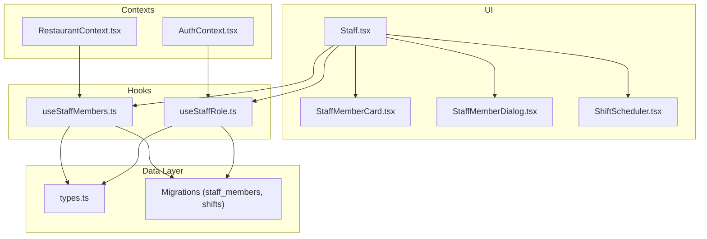
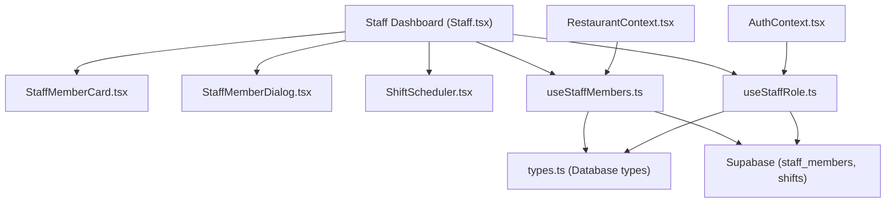
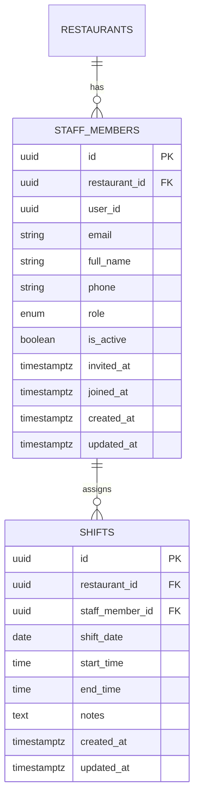
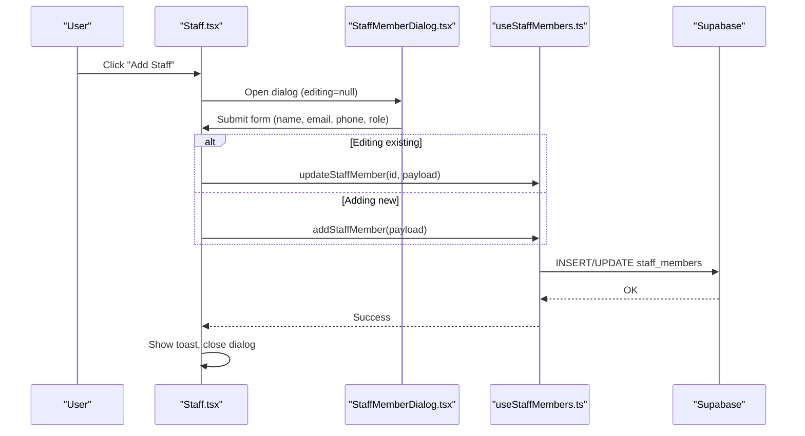
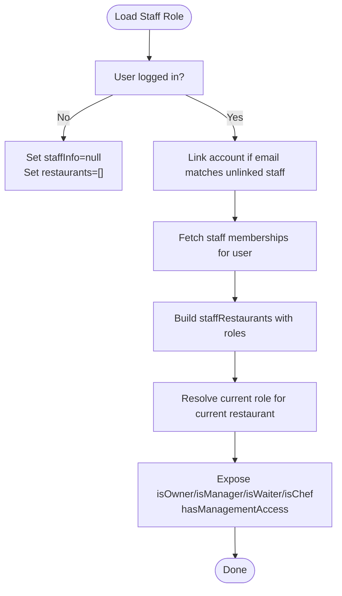
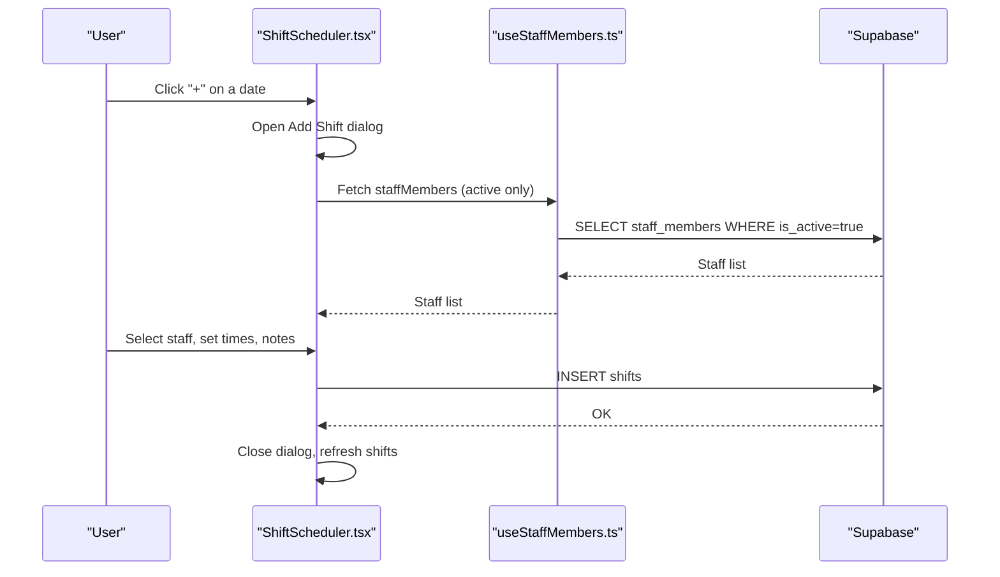
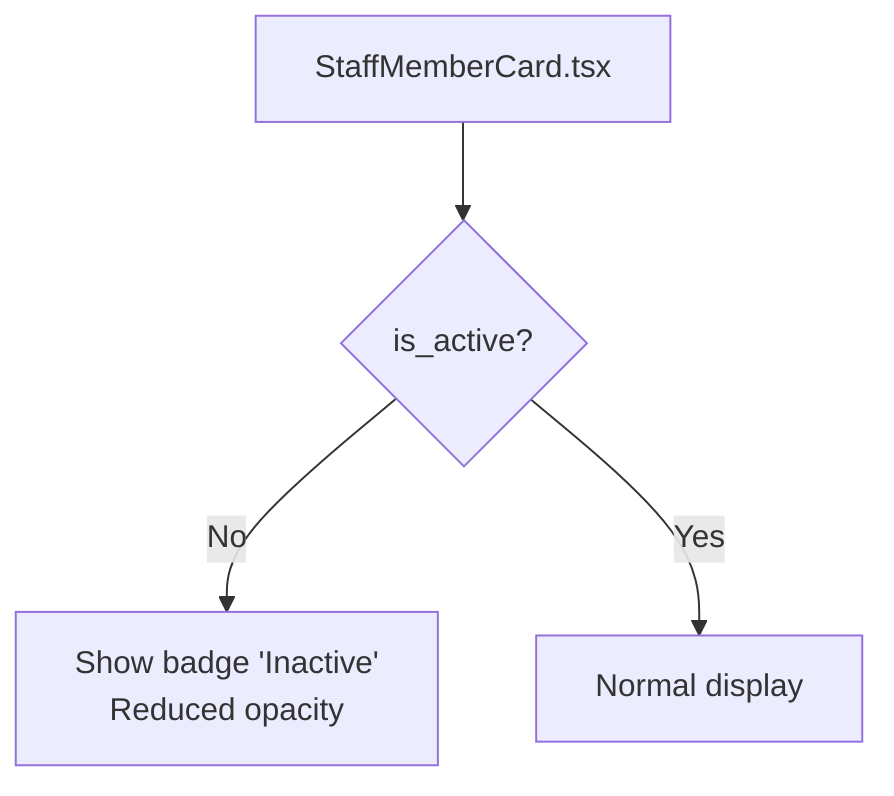
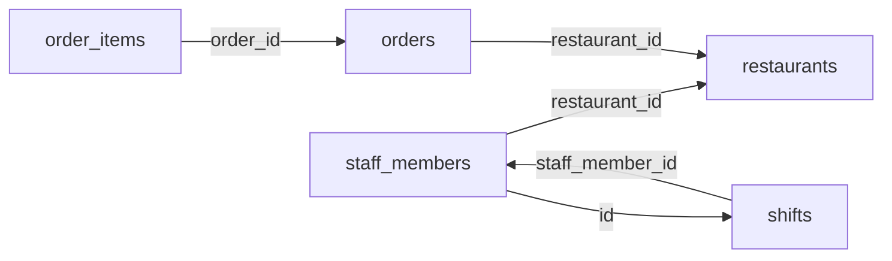
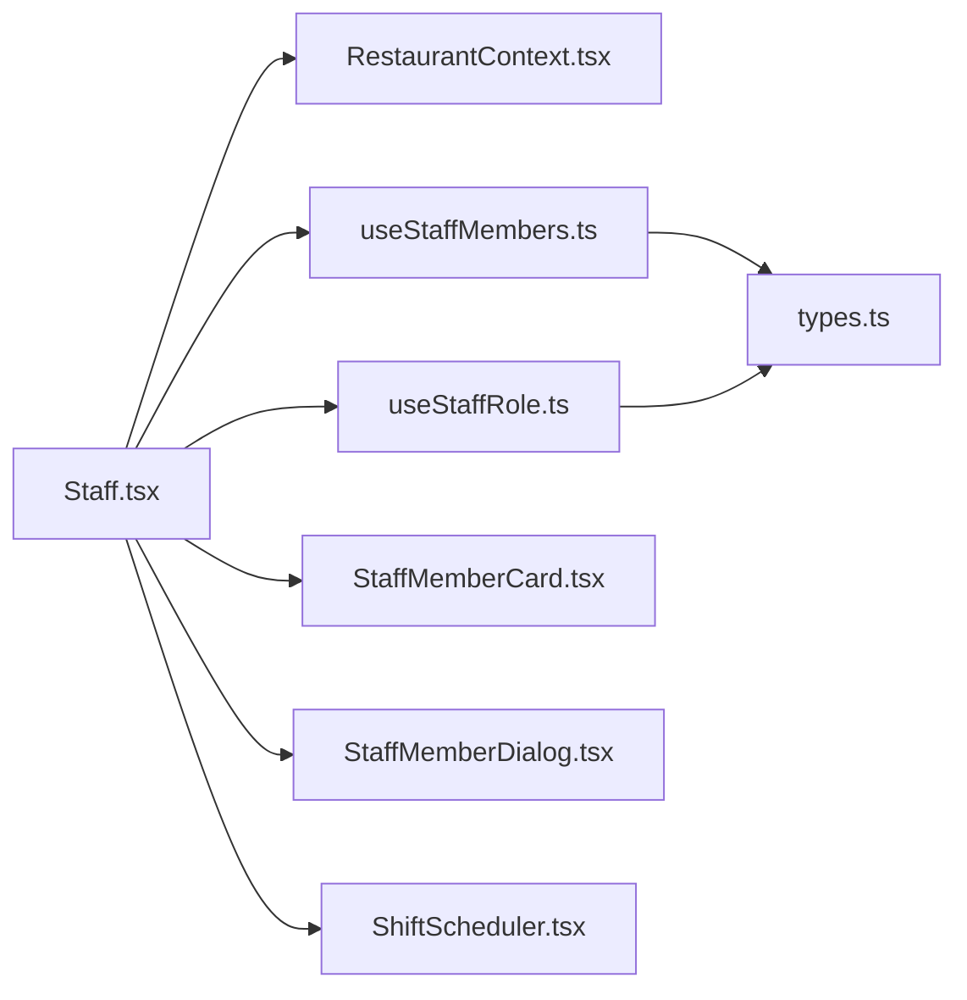

# Staff Management

<cite>
**Referenced Files in This Document**
- [Staff.tsx](file://src/pages/dashboard/Staff.tsx)
- [ShiftScheduler.tsx](file://src/components/staff/ShiftScheduler.tsx)
- [StaffMemberCard.tsx](file://src/components/staff/StaffMemberCard.tsx)
- [StaffMemberDialog.tsx](file://src/components/staff/StaffMemberDialog.tsx)
- [useStaffMembers.ts](file://src/hooks/useStaffMembers.ts)
- [useStaffRole.ts](file://src/hooks/useStaffRole.ts)
- [AuthContext.tsx](file://src/contexts/AuthContext.tsx)
- [RestaurantContext.tsx](file://src/contexts/RestaurantContext.tsx)
- [types.ts](file://src/integrations/supabase/types.ts)
- [20251206081648_ef719884-b181-43d8-832a-02825f1b3a50.sql](file://supabase/migrations/20251206081648_ef719884-b181-43d8-832a-02825f1b3a50.sql)
- [20251206132719_11d13f91-c469-437f-9d98-63127362f20c.sql](file://supabase/migrations/20251206132719_11d13f91-c469-437f-9d98-63127362f20c.sql)
- [Orders.tsx](file://src/pages/dashboard/Orders.tsx)
- [DataManager.tsx](file://src/pages/dashboard/DataManager.tsx)
</cite>

## Table of Contents
1. [Introduction](#introduction)
2. [Project Structure](#project-structure)
3. [Core Components](#core-components)
4. [Architecture Overview](#architecture-overview)
5. [Detailed Component Analysis](#detailed-component-analysis)
6. [Dependency Analysis](#dependency-analysis)
7. [Performance Considerations](#performance-considerations)
8. [Troubleshooting Guide](#troubleshooting-guide)
9. [Conclusion](#conclusion)
10. [Appendices](#appendices)

## Introduction
This document explains the staff management system in TableFlow Pro, focusing on staff member registration and profile management, role assignment and permissions, shift scheduling, and related operational workflows. It also covers staff data modeling, role-based access control (RBAC), staff availability management, and integration points with the order management system. Practical examples illustrate onboarding, role configuration, and scheduling scenarios, along with guidance for training, skills, team coordination, and reporting.

## Project Structure
Staff management spans UI components, hooks for data access, and Supabase-backed persistence with row-level security policies. The dashboard page orchestrates staff lists and scheduling, while reusable components encapsulate editing, activation/deactivation, and weekly scheduling views.

**Diagram sources**
- [Staff.tsx:15-204](file://src/pages/dashboard/Staff.tsx#L15-L204)
- [useStaffMembers.ts:36-143](file://src/hooks/useStaffMembers.ts#L36-L143)
- [useStaffRole.ts:29-134](file://src/hooks/useStaffRole.ts#L29-L134)
- [RestaurantContext.tsx:319-353](file://src/contexts/RestaurantContext.tsx#L319-L353)
- [AuthContext.tsx:39-131](file://src/contexts/AuthContext.tsx#L39-L131)
- [types.ts:516-568](file://src/integrations/supabase/types.ts#L516-L568)
- [20251206081648_ef719884-b181-43d8-832a-02825f1b3a50.sql:5-33](file://supabase/migrations/20251206081648_ef719884-b181-43d8-832a-02825f1b3a50.sql#L5-L33)

**Section sources**
- [Staff.tsx:15-204](file://src/pages/dashboard/Staff.tsx#L15-L204)
- [useStaffMembers.ts:36-143](file://src/hooks/useStaffMembers.ts#L36-L143)
- [useStaffRole.ts:29-134](file://src/hooks/useStaffRole.ts#L29-L134)
- [RestaurantContext.tsx:319-353](file://src/contexts/RestaurantContext.tsx#L319-L353)
- [AuthContext.tsx:39-131](file://src/contexts/AuthContext.tsx#L39-L131)
- [types.ts:516-568](file://src/integrations/supabase/types.ts#L516-L568)
- [20251206081648_ef719884-b181-43d8-832a-02825f1b3a50.sql:5-33](file://supabase/migrations/20251206081648_ef719884-b181-43d8-832a-02825f1b3a50.sql#L5-L33)

## Core Components
- Staff dashboard page: Manages staff listing, search, add/edit/delete, and toggles active status; integrates shift schedule tab.
- Staff member card: Displays profile, role badge, and actions (edit, activate/deactivate, delete).
- Staff member dialog: Form for adding/updating staff with validation and role selection.
- Shift scheduler: Weekly calendar view for assigning shifts to active staff with add/remove controls.
- Hooks:
  - useStaffMembers: CRUD for staff and shifts, offline-aware queries.
  - useStaffRole: Resolves current staff role and restaurant membership.
- Contexts:
  - AuthContext: Authentication state and offline sync lifecycle.
  - RestaurantContext: Current restaurant context, role, and management access flags.

Key responsibilities:
- Data model: staff_members and shifts tables with restaurant scoping and RLS policies.
- Access control: Owner and manager can manage staff and shifts; staff can view own records; cross-linking via email.
- Availability: Active/inactive flag on staff; only active staff appear in scheduling.

**Section sources**
- [Staff.tsx:15-204](file://src/pages/dashboard/Staff.tsx#L15-L204)
- [StaffMemberCard.tsx:40-140](file://src/components/staff/StaffMemberCard.tsx#L40-L140)
- [StaffMemberDialog.tsx:48-184](file://src/components/staff/StaffMemberDialog.tsx#L48-L184)
- [ShiftScheduler.tsx:40-275](file://src/components/staff/ShiftScheduler.tsx#L40-L275)
- [useStaffMembers.ts:36-255](file://src/hooks/useStaffMembers.ts#L36-L255)
- [useStaffRole.ts:29-134](file://src/hooks/useStaffRole.ts#L29-L134)
- [AuthContext.tsx:39-131](file://src/contexts/AuthContext.tsx#L39-L131)
- [RestaurantContext.tsx:319-353](file://src/contexts/RestaurantContext.tsx#L319-L353)

## Architecture Overview
The staff management subsystem combines React components, custom hooks for data access, Supabase client integration, and database migrations defining the schema and policies.

**Diagram sources**
- [Staff.tsx:15-204](file://src/pages/dashboard/Staff.tsx#L15-L204)
- [useStaffMembers.ts:36-143](file://src/hooks/useStaffMembers.ts#L36-L143)
- [useStaffRole.ts:29-134](file://src/hooks/useStaffRole.ts#L29-L134)
- [RestaurantContext.tsx:319-353](file://src/contexts/RestaurantContext.tsx#L319-L353)
- [AuthContext.tsx:39-131](file://src/contexts/AuthContext.tsx#L39-L131)
- [types.ts:516-568](file://src/integrations/supabase/types.ts#L516-L568)

## Detailed Component Analysis

### Staff Data Model and RBAC
- Entities:
  - staff_members: Links users to restaurants with role and active status.
  - shifts: Assigns staff to work dates/times within a restaurant.
- Roles: owner, manager, waiter, chef.
- RLS policies:
  - Owners and managers can manage staff and shifts.
  - Staff can view own records; managers can view staff; owners can manage.
  - Cross-linking: Users can claim unlinked staff records by matching email.

**Diagram sources**
- [20251206081648_ef719884-b181-43d8-832a-02825f1b3a50.sql:5-33](file://supabase/migrations/20251206081648_ef719884-b181-43d8-832a-02825f1b3a50.sql#L5-L33)
- [types.ts:516-568](file://src/integrations/supabase/types.ts#L516-L568)

**Section sources**
- [20251206081648_ef719884-b181-43d8-832a-02825f1b3a50.sql:54-118](file://supabase/migrations/20251206081648_ef719884-b181-43d8-832a-02825f1b3a50.sql#L54-L118)
- [20251206132719_11d13f91-c469-437f-9d98-63127362f20c.sql:1-12](file://supabase/migrations/20251206132719_11d13f91-c469-437f-9d98-63127362f20c.sql#L1-L12)
- [types.ts:516-568](file://src/integrations/supabase/types.ts#L516-L568)

### Staff Registration and Profile Management
- Add/Edit staff:
  - Dialog enforces name, valid email, optional phone, and role selection.
  - Owner role is excluded from selection to prevent direct ownership assignment.
- Activation control:
  - Toggle activates/deactivates staff; inactive staff are filtered from scheduling.
- Deletion:
  - Removing a staff member deletes their associated shifts.

**Diagram sources**
- [Staff.tsx:39-90](file://src/pages/dashboard/Staff.tsx#L39-L90)
- [StaffMemberDialog.tsx:57-88](file://src/components/staff/StaffMemberDialog.tsx#L57-L88)
- [useStaffMembers.ts:80-133](file://src/hooks/useStaffMembers.ts#L80-L133)

**Section sources**
- [Staff.tsx:39-119](file://src/pages/dashboard/Staff.tsx#L39-L119)
- [StaffMemberDialog.tsx:31-88](file://src/components/staff/StaffMemberDialog.tsx#L31-L88)
- [useStaffMembers.ts:80-133](file://src/hooks/useStaffMembers.ts#L80-L133)

### Role Assignment and Permission Systems
- Role resolution:
  - useStaffRole determines current role across restaurants and exposes booleans for owner/manager/waiter/chef and management access.
- Restaurant-scoped roles:
  - useStaffRoleForRestaurant resolves role for a specific restaurant.
- Access enforcement:
  - RLS policies restrict staff and shift management to owners/managers; staff can view own records; cross-linking allows self-service account-to-staff linkage.

**Diagram sources**
- [useStaffRole.ts:35-133](file://src/hooks/useStaffRole.ts#L35-L133)
- [20251206132719_11d13f91-c469-437f-9d98-63127362f20c.sql:1-12](file://supabase/migrations/20251206132719_11d13f91-c469-437f-9d98-63127362f20c.sql#L1-L12)

**Section sources**
- [useStaffRole.ts:29-134](file://src/hooks/useStaffRole.ts#L29-L134)
- [20251206132719_11d13f91-c469-437f-9d98-63127362f20c.sql:1-12](file://supabase/migrations/20251206132719_11d13f91-c469-437f-9d98-63127362f20c.sql#L1-L12)

### Shift Scheduling Functionality
- Weekly calendar:
  - Navigable week view; today highlighted; per-day shift blocks with staff name and time range.
- Add shift:
  - Select active staff member, set start/end time, optional notes; persists to shifts table.
- Remove shift:
  - Deletes shift record; no separate deletion UI on the calendar cell.
- Filtering:
  - Only active staff appear in the add-shift dropdown.

**Diagram sources**
- [ShiftScheduler.tsx:77-108](file://src/components/staff/ShiftScheduler.tsx#L77-L108)
- [ShiftScheduler.tsx:213-248](file://src/components/staff/ShiftScheduler.tsx#L213-L248)
- [useStaffMembers.ts:150-186](file://src/hooks/useStaffMembers.ts#L150-L186)

**Section sources**
- [ShiftScheduler.tsx:40-275](file://src/components/staff/ShiftScheduler.tsx#L40-L275)
- [useStaffMembers.ts:145-255](file://src/hooks/useStaffMembers.ts#L145-L255)

### Staff Activity Tracking and Availability
- Availability:
  - is_active flag on staff_members; only active staff appear in scheduling and dialogs.
- Activity indicators:
  - Inactive staff cards show a badge and reduced opacity.
- Shift visibility:
  - Staff can view their own shifts via RLS policy; managers/owners see all.

**Diagram sources**
- [StaffMemberCard.tsx:40-116](file://src/components/staff/StaffMemberCard.tsx#L40-L116)
- [20251206081648_ef719884-b181-43d8-832a-02825f1b3a50.sql:108-118](file://supabase/migrations/20251206081648_ef719884-b181-43d8-832a-02825f1b3a50.sql#L108-L118)

**Section sources**
- [StaffMemberCard.tsx:40-116](file://src/components/staff/StaffMemberCard.tsx#L40-L116)
- [useStaffMembers.ts:145-255](file://src/hooks/useStaffMembers.ts#L145-L255)

### Staff Communication Features
- Email-based account linking:
  - When a user signs up or logs in, the system attempts to link their account to an existing staff record if the email matches.
- Self-service access:
  - Users can claim unlinked staff records by logging in with the matching email.

**Section sources**
- [useStaffRole.ts:44-114](file://src/hooks/useStaffRole.ts#L44-L114)
- [20251206132719_11d13f91-c469-437f-9d98-63127362f20c.sql:1-12](file://supabase/migrations/20251206132719_11d13f91-c469-437f-9d98-63127362f20c.sql#L1-L12)

### Integration with Order Management System
- Staff-to-orders relationship:
  - Orders and order_items are scoped to restaurants; staff members are linked to restaurants and can be associated with service activities.
- Practical integration points:
  - Shifts can be used to plan coverage for peak order periods.
  - The Orders page displays order statuses and kitchen workflows; staff availability impacts throughput.
- Data export/import:
  - DataManager supports exporting/importing staff_members and order_items for administrative tasks.

**Diagram sources**
- [types.ts:516-568](file://src/integrations/supabase/types.ts#L516-L568)
- [DataManager.tsx:202-213](file://src/pages/dashboard/DataManager.tsx#L202-L213)

**Section sources**
- [Orders.tsx:134-200](file://src/pages/dashboard/Orders.tsx#L134-L200)
- [DataManager.tsx:202-213](file://src/pages/dashboard/DataManager.tsx#L202-L213)

### Practical Workflows

#### Staff Onboarding Workflow
- Steps:
  - Add staff member via dialog (name, email, phone, role).
  - Optionally activate immediately.
  - Assign initial shifts for the upcoming week.
- Notes:
  - Owner role is not selectable in the dialog to prevent direct ownership assignment.

**Section sources**
- [Staff.tsx:39-90](file://src/pages/dashboard/Staff.tsx#L39-L90)
- [StaffMemberDialog.tsx:31-88](file://src/components/staff/StaffMemberDialog.tsx#L31-L88)

#### Role Configuration Process
- Determine current role via useStaffRole.
- Enforce management access checks for sensitive operations.
- Cross-link user accounts to staff records using email matching.

**Section sources**
- [useStaffRole.ts:29-134](file://src/hooks/useStaffRole.ts#L29-L134)
- [20251206132719_11d13f91-c469-437f-9d98-63127362f20c.sql:1-12](file://supabase/migrations/20251206132719_11d13f91-c469-437f-9d98-63127362f20c.sql#L1-L12)

#### Shift Scheduling Scenarios
- Scenario A: Assign a waiter to a weekend shift.
  - Open add-shift dialog for the target date, select active waiter, set times, save.
- Scenario B: Replace a manager’s shift due to coverage.
  - Remove old shift; add new manager or substitute staff.
- Scenario C: Plan chef coverage during busy hours.
  - Review weekly view, adjust overlapping shifts, ensure adequate coverage.

**Section sources**
- [ShiftScheduler.tsx:77-108](file://src/components/staff/ShiftScheduler.tsx#L77-L108)
- [ShiftScheduler.tsx:213-248](file://src/components/staff/ShiftScheduler.tsx#L213-L248)

### Training, Skills, and Team Coordination
- Current capabilities:
  - Role-based access and shift scheduling support team coordination.
  - No dedicated training or skill records are present in the current schema.
- Recommended extensions:
  - Add a staff_skills table with proficiency levels and certifications.
  - Integrate with shifts to indicate required skills for specific stations.
  - Provide team dashboards showing coverage gaps and skill availability.

[No sources needed since this section proposes future enhancements conceptually]

### Reporting and Administrative Oversight
- Data export/import:
  - DataManager supports exporting/importing staff_members and order_items for administrative reporting and bulk operations.
- Audit trail:
  - Created/updated timestamps on staff_members and shifts enable basic auditability.

**Section sources**
- [DataManager.tsx:202-213](file://src/pages/dashboard/DataManager.tsx#L202-L213)
- [useStaffMembers.ts:8-34](file://src/hooks/useStaffMembers.ts#L8-L34)

## Dependency Analysis
- Component coupling:
  - Staff.tsx depends on RestaurantContext for restaurant ID and on useStaffMembers/useShifts for data.
  - ShiftScheduler depends on active staff filtering and shift CRUD hooks.
- External dependencies:
  - Supabase client for database operations and RLS enforcement.
  - React hooks for state and effects.
- Potential circular dependencies:
  - None observed among staff components; hooks are leaf dependencies.

**Diagram sources**
- [Staff.tsx:15-204](file://src/pages/dashboard/Staff.tsx#L15-L204)
- [useStaffMembers.ts:36-143](file://src/hooks/useStaffMembers.ts#L36-L143)
- [useStaffRole.ts:29-134](file://src/hooks/useStaffRole.ts#L29-L134)
- [RestaurantContext.tsx:319-353](file://src/contexts/RestaurantContext.tsx#L319-L353)
- [types.ts:516-568](file://src/integrations/supabase/types.ts#L516-L568)

**Section sources**
- [Staff.tsx:15-204](file://src/pages/dashboard/Staff.tsx#L15-L204)
- [useStaffMembers.ts:36-143](file://src/hooks/useStaffMembers.ts#L36-L143)
- [useStaffRole.ts:29-134](file://src/hooks/useStaffRole.ts#L29-L134)
- [RestaurantContext.tsx:319-353](file://src/contexts/RestaurantContext.tsx#L319-L353)
- [types.ts:516-568](file://src/integrations/supabase/types.ts#L516-L568)

## Performance Considerations
- Offline-first design:
  - useStaffMembers and RestaurantContext leverage offline-aware queries to maintain responsiveness when network is unavailable.
- Efficient queries:
  - Sorting by role/full_name and shift_date/start_time reduces UI rendering overhead.
- Minimal re-renders:
  - useMemo for week days and grouped shifts improves calendar rendering performance.

[No sources needed since this section provides general guidance]

## Troubleshooting Guide
- Cannot add/update staff:
  - Verify restaurant context is selected; ensure email uniqueness per restaurant; check toast messages for errors.
- Shift not appearing:
  - Confirm staff member is active; verify date/time ranges; ensure restaurant context matches.
- Role restrictions:
  - Only owners/managers can manage staff/shifts; useStaffRole flags help diagnose access issues.
- Account linking:
  - If login does not auto-link, ensure the user email matches an existing unlinked staff record.

**Section sources**
- [Staff.tsx:64-118](file://src/pages/dashboard/Staff.tsx#L64-L118)
- [ShiftScheduler.tsx:88-108](file://src/components/staff/ShiftScheduler.tsx#L88-L108)
- [useStaffRole.ts:121-133](file://src/hooks/useStaffRole.ts#L121-L133)

## Conclusion
TableFlow Pro’s staff management system provides a robust foundation for onboarding, role-based access control, and shift scheduling. The combination of Supabase RLS, React hooks, and reusable UI components enables secure, efficient operations. Future enhancements could include dedicated training and skill tracking, expanded reporting, and deeper integration with order workflows to optimize team coordination and performance.

## Appendices

### API and Data Access Patterns
- Staff CRUD:
  - addStaffMember, updateStaffMember, deleteStaffMember via useStaffMembers.
- Shift CRUD:
  - addShift, updateShift, deleteShift via useStaffMembers.
- Role and restaurant context:
  - useStaffRole and RestaurantContext provide current role and management access flags.

**Section sources**
- [useStaffMembers.ts:80-255](file://src/hooks/useStaffMembers.ts#L80-L255)
- [useStaffRole.ts:29-134](file://src/hooks/useStaffRole.ts#L29-L134)
- [RestaurantContext.tsx:319-353](file://src/contexts/RestaurantContext.tsx#L319-L353)