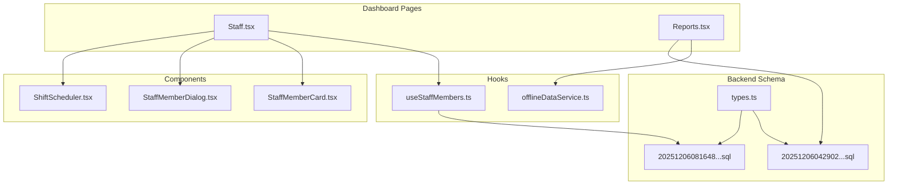
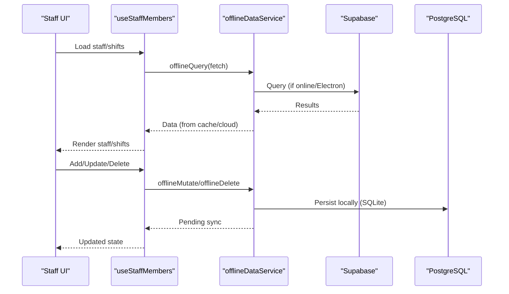
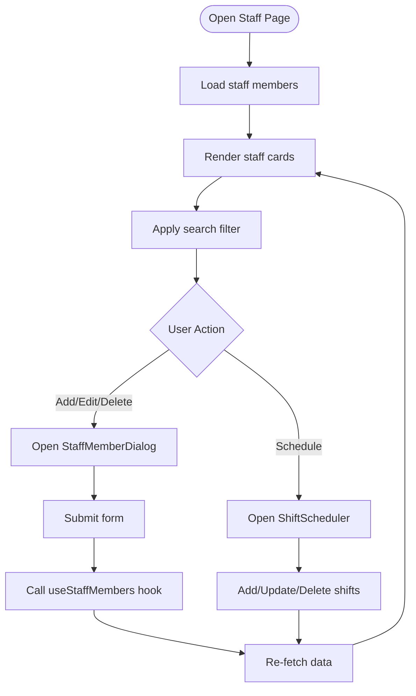
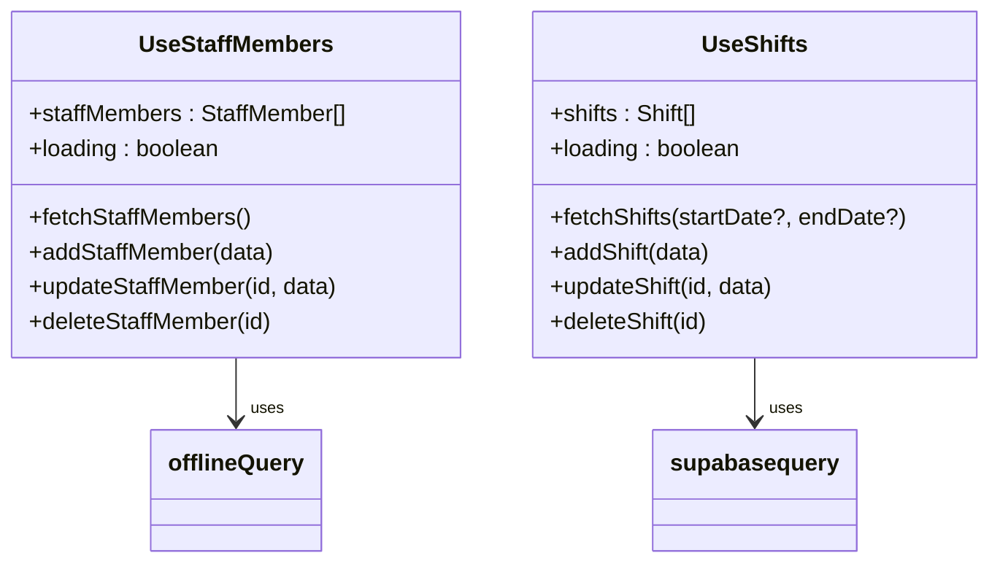
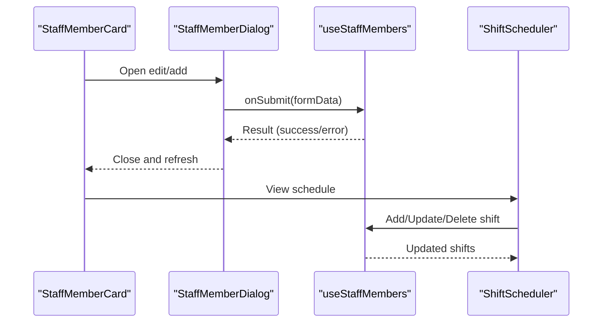
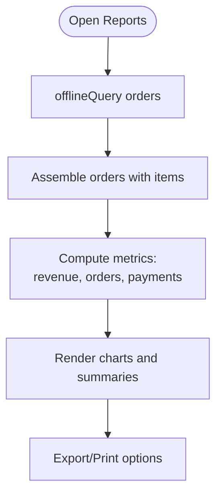
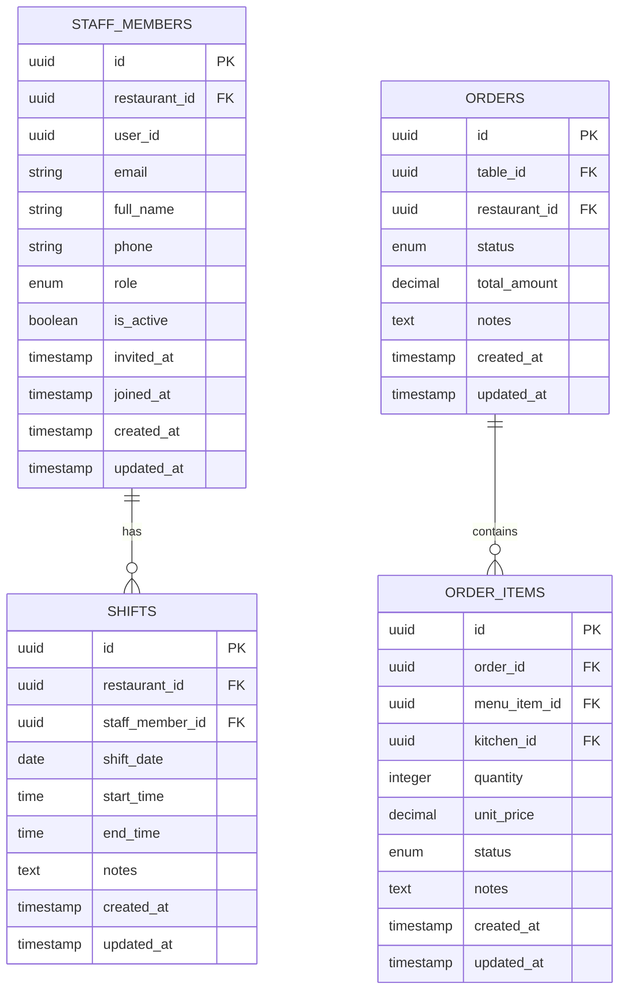
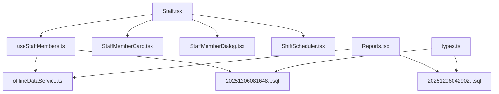

# Staff Performance & Activity Tracking

<cite>
**Referenced Files in This Document**
- [Staff.tsx](file://src/pages/dashboard/Staff.tsx)
- [useStaffMembers.ts](file://src/hooks/useStaffMembers.ts)
- [StaffMemberCard.tsx](file://src/components/staff/StaffMemberCard.tsx)
- [StaffMemberDialog.tsx](file://src/components/staff/StaffMemberDialog.tsx)
- [ShiftScheduler.tsx](file://src/components/staff/ShiftScheduler.tsx)
- [Reports.tsx](file://src/pages/dashboard/Reports.tsx)
- [offlineDataService.ts](file://src/services/offlineDataService.ts)
- [20251206081648_ef719884-b181-43d8-832a-02825f1b3a50.sql](file://supabase/migrations/20251206081648_ef719884-b181-43d8-832a-02825f1b3a50.sql)
- [20251206042902_fc2b1d91-eb8e-4750-90c3-95b7e0feb6ba.sql](file://supabase/migrations/20251206042902_fc2b1d91-eb8e-4750-90c3-95b7e0feb6ba.sql)
- [types.ts](file://src/integrations/supabase/types.ts)
</cite>

## Table of Contents
1. [Introduction](#introduction)
2. [Project Structure](#project-structure)
3. [Core Components](#core-components)
4. [Architecture Overview](#architecture-overview)
5. [Detailed Component Analysis](#detailed-component-analysis)
6. [Dependency Analysis](#dependency-analysis)
7. [Performance Considerations](#performance-considerations)
8. [Troubleshooting Guide](#troubleshooting-guide)
9. [Conclusion](#conclusion)

## Introduction
This document explains the staff performance tracking and activity monitoring capabilities implemented in the system. It covers staff activity logging, performance metrics collection, productivity measurements, staff activity timelines, order assignment tracking, and performance analytics. It also documents integration with the order management system for staff assignment tracking, performance attribution, recognition features, feedback mechanisms, and team coordination tools.

The system provides:
- Staff lifecycle management (hire, activate/deactivate, roles)
- Shift scheduling and visibility
- Order lifecycle tracking linked to staff assignments
- Performance analytics dashboards
- Offline-first data handling for robust operations

## Project Structure
The staff performance tracking spans several UI pages, hooks, components, and backend schema definitions:
- Dashboard pages for staff management and reporting
- Hooks for staff and shift data management
- UI components for staff cards, dialogs, and schedulers
- Supabase migrations defining staff and order-related schemas
- Offline data service enabling offline-first operations

**Diagram sources**
- [Staff.tsx:15-205](file://src/pages/dashboard/Staff.tsx#L15-L205)
- [useStaffMembers.ts:36-143](file://src/hooks/useStaffMembers.ts#L36-L143)
- [StaffMemberCard.tsx:40-140](file://src/components/staff/StaffMemberCard.tsx#L40-L140)
- [StaffMemberDialog.tsx:48-184](file://src/components/staff/StaffMemberDialog.tsx#L48-L184)
- [ShiftScheduler.tsx:40-275](file://src/components/staff/ShiftScheduler.tsx#L40-L275)
- [Reports.tsx:580-800](file://src/pages/dashboard/Reports.tsx#L580-L800)
- [20251206042902_fc2b1d91-eb8e-4750-90c3-95b7e0feb6ba.sql:84-94](file://supabase/migrations/20251206042902_fc2b1d91-eb8e-4750-90c3-95b7e0feb6ba.sql#L84-L94)
- [20251206081648_ef719884-b181-43d8-832a-02825f1b3a50.sql:5-33](file://supabase/migrations/20251206081648_ef719884-b181-43d8-832a-02825f1b3a50.sql#L5-L33)
- [types.ts:465-515](file://src/integrations/supabase/types.ts#L465-L515)

**Section sources**
- [Staff.tsx:15-205](file://src/pages/dashboard/Staff.tsx#L15-L205)
- [useStaffMembers.ts:36-143](file://src/hooks/useStaffMembers.ts#L36-L143)
- [ShiftScheduler.tsx:40-275](file://src/components/staff/ShiftScheduler.tsx#L40-L275)
- [Reports.tsx:580-800](file://src/pages/dashboard/Reports.tsx#L580-L800)

## Core Components
This section outlines the core building blocks for staff performance tracking:

- Staff Management Page
  - Provides tabs for staff members and schedule
  - Supports search, add/edit/delete, and activation toggles
  - Integrates with staff hooks for CRUD operations

- Staff Hooks
  - Manage staff members and shifts
  - Fetch, add, update, delete with offline-first caching
  - Expose loading states and error handling

- Staff Components
  - StaffMemberCard: displays staff info, roles, and actions
  - StaffMemberDialog: form for adding/editing staff
  - ShiftScheduler: weekly view for shift planning and editing

- Reporting and Analytics
  - Revenue, order counts, and payment breakdown
  - Export and printing capabilities
  - Offline-first data access for reports

- Database Schema
  - staff_members and shifts tables with RLS policies
  - orders and order_items tables supporting performance attribution

**Section sources**
- [Staff.tsx:15-205](file://src/pages/dashboard/Staff.tsx#L15-L205)
- [useStaffMembers.ts:36-143](file://src/hooks/useStaffMembers.ts#L36-L143)
- [StaffMemberCard.tsx:40-140](file://src/components/staff/StaffMemberCard.tsx#L40-L140)
- [StaffMemberDialog.tsx:48-184](file://src/components/staff/StaffMemberDialog.tsx#L48-L184)
- [ShiftScheduler.tsx:40-275](file://src/components/staff/ShiftScheduler.tsx#L40-L275)
- [Reports.tsx:580-800](file://src/pages/dashboard/Reports.tsx#L580-L800)
- [20251206081648_ef719884-b181-43d8-832a-02825f1b3a50.sql:5-33](file://supabase/migrations/20251206081648_ef719884-b181-43d8-832a-02825f1b3a50.sql#L5-L33)
- [20251206042902_fc2b1d91-eb8e-4750-90c3-95b7e0feb6ba.sql:84-94](file://supabase/migrations/20251206042902_fc2b1d91-eb8e-4750-90c3-95b7e0feb6ba.sql#L84-L94)

## Architecture Overview
The system follows an offline-first architecture with Supabase as the cloud backend. Data flows between the UI, hooks, components, and database via the offline data service. Staff performance analytics leverage order data linked to staff assignments.

**Diagram sources**
- [useStaffMembers.ts:41-74](file://src/hooks/useStaffMembers.ts#L41-L74)
- [offlineDataService.ts:151-211](file://src/services/offlineDataService.ts#L151-L211)
- [offlineDataService.ts:220-287](file://src/services/offlineDataService.ts#L220-L287)

**Section sources**
- [offlineDataService.ts:151-211](file://src/services/offlineDataService.ts#L151-L211)
- [offlineDataService.ts:220-287](file://src/services/offlineDataService.ts#L220-L287)

## Detailed Component Analysis

### Staff Management Page
The Staff page orchestrates staff and schedule views, search, and CRUD operations. It integrates with the staff hooks and renders staff cards and the shift scheduler.

**Diagram sources**
- [Staff.tsx:15-205](file://src/pages/dashboard/Staff.tsx#L15-L205)
- [StaffMemberDialog.tsx:48-184](file://src/components/staff/StaffMemberDialog.tsx#L48-L184)
- [ShiftScheduler.tsx:40-275](file://src/components/staff/ShiftScheduler.tsx#L40-L275)
- [useStaffMembers.ts:36-143](file://src/hooks/useStaffMembers.ts#L36-L143)

**Section sources**
- [Staff.tsx:15-205](file://src/pages/dashboard/Staff.tsx#L15-L205)
- [StaffMemberDialog.tsx:48-184](file://src/components/staff/StaffMemberDialog.tsx#L48-L184)
- [ShiftScheduler.tsx:40-275](file://src/components/staff/ShiftScheduler.tsx#L40-L275)
- [useStaffMembers.ts:36-143](file://src/hooks/useStaffMembers.ts#L36-L143)

### Staff Hooks: Data Access and Offline Handling
The staff hooks encapsulate data operations for staff members and shifts, including offline-first caching and error handling.

**Diagram sources**
- [useStaffMembers.ts:36-143](file://src/hooks/useStaffMembers.ts#L36-L143)
- [useStaffMembers.ts:145-254](file://src/hooks/useStaffMembers.ts#L145-L254)

**Section sources**
- [useStaffMembers.ts:36-143](file://src/hooks/useStaffMembers.ts#L36-L143)
- [useStaffMembers.ts:145-254](file://src/hooks/useStaffMembers.ts#L145-L254)

### Staff Components: Cards, Dialogs, and Schedulers
- StaffMemberCard: Displays staff details, role badges, and action dropdowns (edit, activate/deactivate, delete).
- StaffMemberDialog: Form-based UI for adding/editing staff with validation.
- ShiftScheduler: Weekly calendar view for assigning shifts with add/update/delete operations.

**Diagram sources**
- [StaffMemberCard.tsx:40-140](file://src/components/staff/StaffMemberCard.tsx#L40-L140)
- [StaffMemberDialog.tsx:48-184](file://src/components/staff/StaffMemberDialog.tsx#L48-L184)
- [ShiftScheduler.tsx:40-275](file://src/components/staff/ShiftScheduler.tsx#L40-L275)
- [useStaffMembers.ts:36-143](file://src/hooks/useStaffMembers.ts#L36-L143)

**Section sources**
- [StaffMemberCard.tsx:40-140](file://src/components/staff/StaffMemberCard.tsx#L40-L140)
- [StaffMemberDialog.tsx:48-184](file://src/components/staff/StaffMemberDialog.tsx#L48-L184)
- [ShiftScheduler.tsx:40-275](file://src/components/staff/ShiftScheduler.tsx#L40-L275)
- [useStaffMembers.ts:36-143](file://src/hooks/useStaffMembers.ts#L36-L143)

### Reporting and Performance Analytics
The Reports page aggregates sales data, calculates performance metrics, and supports export/printing. It leverages offline-first data access for robustness.

**Diagram sources**
- [Reports.tsx:580-800](file://src/pages/dashboard/Reports.tsx#L580-L800)
- [offlineDataService.ts:151-211](file://src/services/offlineDataService.ts#L151-L211)

**Section sources**
- [Reports.tsx:580-800](file://src/pages/dashboard/Reports.tsx#L580-L800)
- [offlineDataService.ts:151-211](file://src/services/offlineDataService.ts#L151-L211)

### Database Schema for Staff and Orders
The schema defines staff and order-related tables with appropriate relationships and RLS policies for security.

**Diagram sources**
- [20251206081648_ef719884-b181-43d8-832a-02825f1b3a50.sql:5-33](file://supabase/migrations/20251206081648_ef719884-b181-43d8-832a-02825f1b3a50.sql#L5-L33)
- [20251206042902_fc2b1d91-eb8e-4750-90c3-95b7e0feb6ba.sql:84-108](file://supabase/migrations/20251206042902_fc2b1d91-eb8e-4750-90c3-95b7e0feb6ba.sql#L84-L108)

**Section sources**
- [20251206081648_ef719884-b181-43d8-832a-02825f1b3a50.sql:5-33](file://supabase/migrations/20251206081648_ef719884-b181-43d8-832a-02825f1b3a50.sql#L5-L33)
- [20251206042902_fc2b1d91-eb8e-4750-90c3-95b7e0feb6ba.sql:84-108](file://supabase/migrations/20251206042902_fc2b1d91-eb8e-4750-90c3-95b7e0feb6ba.sql#L84-L108)

## Dependency Analysis
The following diagram shows key dependencies among components and services involved in staff performance tracking:

**Diagram sources**
- [Staff.tsx:15-205](file://src/pages/dashboard/Staff.tsx#L15-L205)
- [useStaffMembers.ts:36-143](file://src/hooks/useStaffMembers.ts#L36-L143)
- [offlineDataService.ts:151-211](file://src/services/offlineDataService.ts#L151-L211)
- [Reports.tsx:580-800](file://src/pages/dashboard/Reports.tsx#L580-L800)
- [20251206081648_ef719884-b181-43d8-832a-02825f1b3a50.sql:5-33](file://supabase/migrations/20251206081648_ef719884-b181-43d8-832a-02825f1b3a50.sql#L5-L33)
- [20251206042902_fc2b1d91-eb8e-4750-90c3-95b7e0feb6ba.sql:84-108](file://supabase/migrations/20251206042902_fc2b1d91-eb8e-4750-90c3-95b7e0feb6ba.sql#L84-L108)
- [types.ts:465-515](file://src/integrations/supabase/types.ts#L465-L515)

**Section sources**
- [Staff.tsx:15-205](file://src/pages/dashboard/Staff.tsx#L15-L205)
- [useStaffMembers.ts:36-143](file://src/hooks/useStaffMembers.ts#L36-L143)
- [offlineDataService.ts:151-211](file://src/services/offlineDataService.ts#L151-L211)
- [Reports.tsx:580-800](file://src/pages/dashboard/Reports.tsx#L580-L800)
- [types.ts:465-515](file://src/integrations/supabase/types.ts#L465-L515)

## Performance Considerations
- Offline-first data access ensures reliable operations during connectivity issues.
- Local caching reduces network requests and improves responsiveness.
- Weekly shift rendering groups shifts per date for efficient UI updates.
- Reports aggregate data locally when offline, providing immediate insights.

[No sources needed since this section provides general guidance]

## Troubleshooting Guide
Common issues and resolutions:
- Staff not loading: Verify restaurant context and network connectivity; check offline data availability.
- Shifts not updating: Confirm date range filters and that the correct restaurant is selected.
- Reports show empty data: Ensure data is available in local cache or cloud; use manual sync if needed.
- Permission errors: Review RLS policies for staff and shifts; confirm user role and restaurant ownership.

**Section sources**
- [offlineDataService.ts:151-211](file://src/services/offlineDataService.ts#L151-L211)
- [useStaffMembers.ts:41-74](file://src/hooks/useStaffMembers.ts#L41-L74)
- [20251206081648_ef719884-b181-43d8-832a-02825f1b3a50.sql:81-118](file://supabase/migrations/20251206081648_ef719884-b181-43d8-832a-02825f1b3a50.sql#L81-L118)

## Conclusion
The system provides a comprehensive foundation for staff performance tracking and activity monitoring. It combines staff lifecycle management, shift scheduling, order assignment tracking, and performance analytics with an offline-first architecture for reliability. The modular design enables easy extension for advanced performance indicators, recognition features, and team coordination tools.