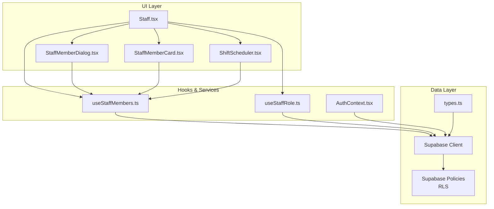
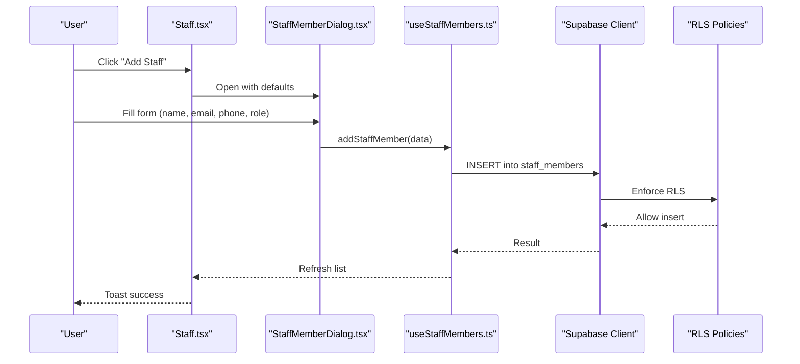
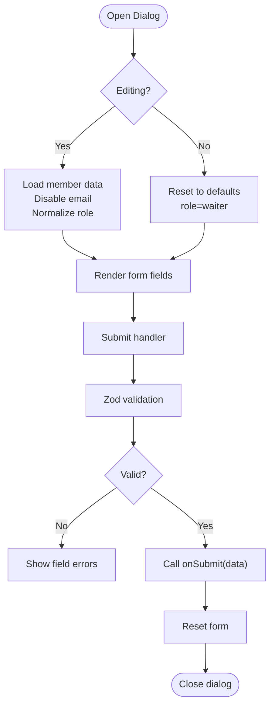
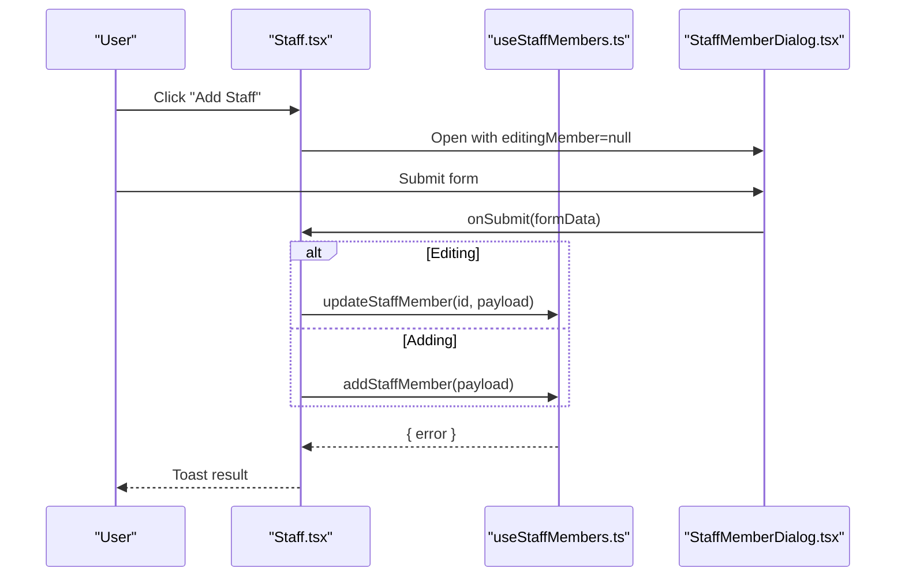
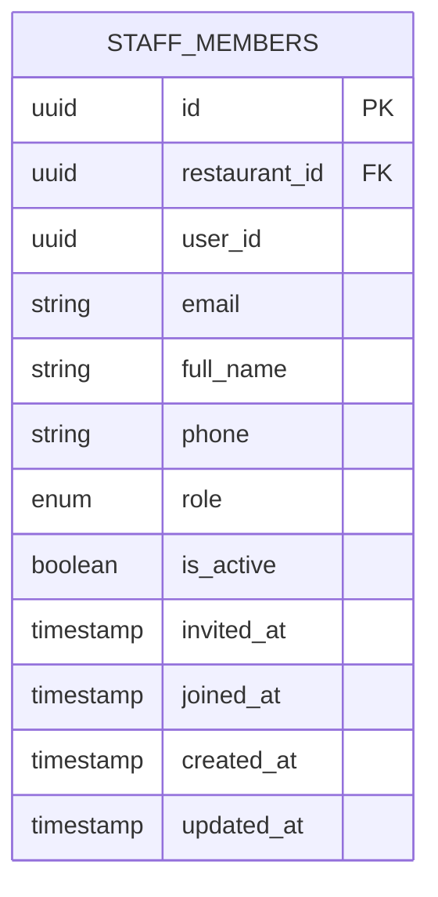
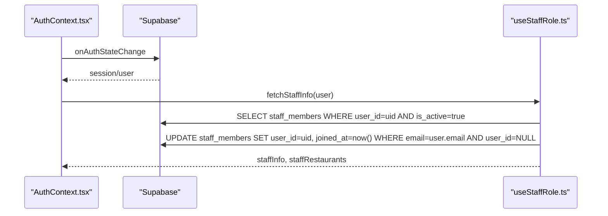
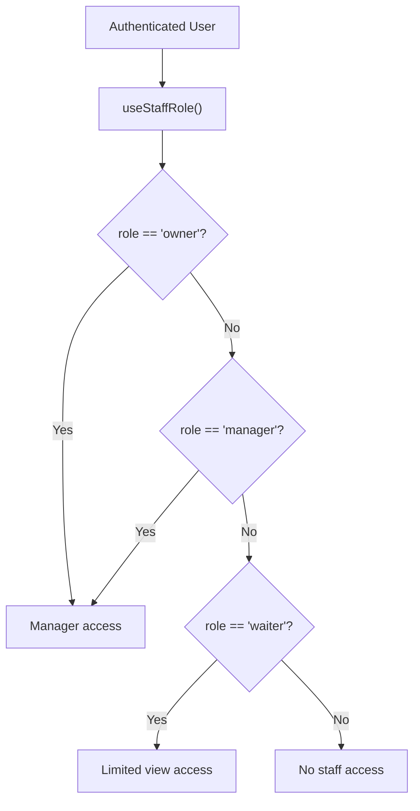
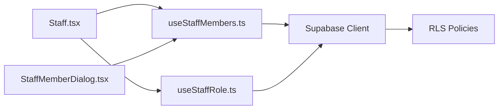

# Staff Registration & Profile Management

<cite>
**Referenced Files in This Document**
- [StaffMemberDialog.tsx](file://src/components/staff/StaffMemberDialog.tsx)
- [Staff.tsx](file://src/pages/dashboard/Staff.tsx)
- [useStaffMembers.ts](file://src/hooks/useStaffMembers.ts)
- [useStaffRole.ts](file://src/hooks/useStaffRole.ts)
- [types.ts](file://src/integrations/supabase/types.ts)
- [StaffMemberCard.tsx](file://src/components/staff/StaffMemberCard.tsx)
- [ShiftScheduler.tsx](file://src/components/staff/ShiftScheduler.tsx)
- [AuthContext.tsx](file://src/contexts/AuthContext.tsx)
- [20251206132719_11d13f91-c469-437f-9d98-63127362f20c.sql](file://supabase/migrations/20251206132719_11d13f91-c469-437f-9d98-63127362f20c.sql)
- [20251206133509_50399ee0-7c3e-4927-bf1a-00556ef24c8c.sql](file://supabase/migrations/20251206133509_50399ee0-7c3e-4927-bf1a-00556ef24c8c.sql)
- [20251206133955_231d3ef6-16e8-41de-8662-8dc09a54c6e3.sql](file://supabase/migrations/20251206133955_231d3ef6-16e8-41de-8662-8dc09a54c6e3.sql)
</cite>

## Table of Contents
1. [Introduction](#introduction)
2. [Project Structure](#project-structure)
3. [Core Components](#core-components)
4. [Architecture Overview](#architecture-overview)
5. [Detailed Component Analysis](#detailed-component-analysis)
6. [Dependency Analysis](#dependency-analysis)
7. [Performance Considerations](#performance-considerations)
8. [Troubleshooting Guide](#troubleshooting-guide)
9. [Conclusion](#conclusion)

## Introduction
This document explains the staff registration and profile management functionality. It covers the end-to-end workflow for adding and editing staff members, form validation rules, role selection, profile data management, and integration with the authentication system. It also documents the staff data model, role-based access control, offline-first caching, and practical examples for onboarding, profile updates, and status management.

## Project Structure
The staff management feature spans UI components, page containers, hooks for data access, Supabase integration, and database policies. The primary files involved are:

- Page container: [Staff.tsx](file://src/pages/dashboard/Staff.tsx)
- Dialog form: [StaffMemberDialog.tsx](file://src/components/staff/StaffMemberDialog.tsx)
- Staff card: [StaffMemberCard.tsx](file://src/components/staff/StaffMemberCard.tsx)
- Shift scheduler: [ShiftScheduler.tsx](file://src/components/staff/ShiftScheduler.tsx)
- Data hooks: [useStaffMembers.ts](file://src/hooks/useStaffMembers.ts), [useStaffRole.ts](file://src/hooks/useStaffRole.ts)
- Auth context: [AuthContext.tsx](file://src/contexts/AuthContext.tsx)
- Types and enums: [types.ts](file://src/integrations/supabase/types.ts)
- Database policies: migration files under [supabase/migrations/](file://supabase/migrations/)

**Diagram sources**
- [Staff.tsx:15-205](file://src/pages/dashboard/Staff.tsx#L15-L205)
- [StaffMemberDialog.tsx:48-184](file://src/components/staff/StaffMemberDialog.tsx#L48-L184)
- [StaffMemberCard.tsx:40-140](file://src/components/staff/StaffMemberCard.tsx#L40-L140)
- [ShiftScheduler.tsx:40-275](file://src/components/staff/ShiftScheduler.tsx#L40-L275)
- [useStaffMembers.ts:36-143](file://src/hooks/useStaffMembers.ts#L36-L143)
- [useStaffRole.ts:29-134](file://src/hooks/useStaffRole.ts#L29-L134)
- [AuthContext.tsx:39-141](file://src/contexts/AuthContext.tsx#L39-L141)
- [types.ts:516-568](file://src/integrations/supabase/types.ts#L516-L568)

**Section sources**
- [Staff.tsx:15-205](file://src/pages/dashboard/Staff.tsx#L15-L205)
- [StaffMemberDialog.tsx:48-184](file://src/components/staff/StaffMemberDialog.tsx#L48-L184)
- [useStaffMembers.ts:36-143](file://src/hooks/useStaffMembers.ts#L36-L143)
- [useStaffRole.ts:29-134](file://src/hooks/useStaffRole.ts#L29-L134)
- [types.ts:516-568](file://src/integrations/supabase/types.ts#L516-L568)

## Core Components
- Staff page container orchestrates staff listing, filtering, and actions (add/edit/delete/status toggle).
- StaffMemberDialog provides a Zod-based form for creating or editing staff with validation and controlled submission.
- useStaffMembers hook encapsulates CRUD operations against the staff_members table with offline caching.
- useStaffRole hook integrates with authentication to link user accounts to staff records and derive role-based permissions.
- StaffMemberCard renders individual staff entries with role badges and action menus.
- ShiftScheduler manages shift assignments per staff member with weekly calendar UI.

Key responsibilities:
- Validation: Full name required, email valid, optional phone, role enum selection.
- Editing: Email is disabled during edits; owner role is normalized to manager in the dialog.
- Status management: Toggle is_active via update mutation.
- Access control: Role checks (owner, manager) for sensitive actions.

**Section sources**
- [Staff.tsx:18-119](file://src/pages/dashboard/Staff.tsx#L18-L119)
- [StaffMemberDialog.tsx:31-88](file://src/components/staff/StaffMemberDialog.tsx#L31-L88)
- [useStaffMembers.ts:80-133](file://src/hooks/useStaffMembers.ts#L80-L133)
- [useStaffRole.ts:29-134](file://src/hooks/useStaffRole.ts#L29-L134)
- [StaffMemberCard.tsx:40-140](file://src/components/staff/StaffMemberCard.tsx#L40-L140)
- [ShiftScheduler.tsx:40-275](file://src/components/staff/ShiftScheduler.tsx#L40-L275)

## Architecture Overview
The system follows a layered architecture:
- UI layer: Pages and components manage user interactions.
- Hooks layer: Encapsulate data fetching, mutations, and offline caching.
- Supabase layer: Real-time data access with Row Level Security (RLS) policies.
- Authentication: Supabase Auth provides session and user identity.

**Diagram sources**
- [Staff.tsx:39-90](file://src/pages/dashboard/Staff.tsx#L39-L90)
- [StaffMemberDialog.tsx:85-88](file://src/components/staff/StaffMemberDialog.tsx#L85-L88)
- [useStaffMembers.ts:80-103](file://src/hooks/useStaffMembers.ts#L80-L103)
- [20251206132719_11d13f91-c469-437f-9d98-63127362f20c.sql:1-12](file://supabase/migrations/20251206132719_11d13f91-c469-437f-9d98-63127362f20c.sql#L1-L12)

## Detailed Component Analysis

### StaffMemberDialog Component
Implements the modal form for staff creation and editing:
- Zod schema enforces:
  - full_name: required
  - email: valid email format
  - phone: optional
  - role: enum ['manager', 'waiter', 'chef']
- Editing behavior:
  - Disables email field
  - Normalizes owner role to manager for display
- Submission:
  - Calls onSubmit with validated data
  - Resets form after submit

**Diagram sources**
- [StaffMemberDialog.tsx:55-88](file://src/components/staff/StaffMemberDialog.tsx#L55-L88)
- [StaffMemberDialog.tsx:31-36](file://src/components/staff/StaffMemberDialog.tsx#L31-L36)

**Section sources**
- [StaffMemberDialog.tsx:31-88](file://src/components/staff/StaffMemberDialog.tsx#L31-L88)
- [StaffMemberDialog.tsx:90-182](file://src/components/staff/StaffMemberDialog.tsx#L90-L182)

### Staff Page Container (Staff.tsx)
Manages:
- Filtering staff by name, email, or role
- Opening the dialog for add/edit
- Submitting form data to create/update staff
- Deleting staff and toggling active status
- Integrating with useStaffMembers for CRUD and with useToast for feedback

**Diagram sources**
- [Staff.tsx:39-90](file://src/pages/dashboard/Staff.tsx#L39-L90)
- [useStaffMembers.ts:80-133](file://src/hooks/useStaffMembers.ts#L80-L133)

**Section sources**
- [Staff.tsx:18-119](file://src/pages/dashboard/Staff.tsx#L18-L119)
- [Staff.tsx:195-201](file://src/pages/dashboard/Staff.tsx#L195-L201)

### Staff Data Model and Validation Rules
The staff member entity includes:
- id, restaurant_id, user_id (nullable), email, full_name, phone (nullable), role (enum), is_active, invited_at, joined_at, created_at, updated_at

Validation rules enforced by the dialog:
- full_name: required
- email: must be a valid email address
- phone: optional
- role: restricted to ['manager', 'waiter', 'chef']

**Diagram sources**
- [types.ts:516-568](file://src/integrations/supabase/types.ts#L516-L568)
- [useStaffMembers.ts:8-21](file://src/hooks/useStaffMembers.ts#L8-L21)
- [StaffMemberDialog.tsx:31-36](file://src/components/staff/StaffMemberDialog.tsx#L31-L36)

**Section sources**
- [useStaffMembers.ts:8-21](file://src/hooks/useStaffMembers.ts#L8-L21)
- [types.ts:679-684](file://src/integrations/supabase/types.ts#L679-L684)
- [StaffMemberDialog.tsx:31-36](file://src/components/staff/StaffMemberDialog.tsx#L31-L36)

### Authentication Integration and Account Linking
The system supports seamless account-to-staff linking:
- On auth state change, the app attempts to link any unlinked staff record whose email matches the logged-in user.
- After linking, staff memberships are fetched and the first active staff record becomes the user's active role context.
- The AuthContext manages session lifecycle and offline caching.

**Diagram sources**
- [AuthContext.tsx:39-97](file://src/contexts/AuthContext.tsx#L39-L97)
- [useStaffRole.ts:35-115](file://src/hooks/useStaffRole.ts#L35-L115)

**Section sources**
- [AuthContext.tsx:39-97](file://src/contexts/AuthContext.tsx#L39-L97)
- [useStaffRole.ts:35-115](file://src/hooks/useStaffRole.ts#L35-L115)

### Role-Based Access Control (RBAC)
- Roles: owner, manager, waiter, chef
- hasManagementAccess: owner or manager
- UI controls are hidden for owner role and restricted actions are gated by role checks
- Database policies enforce access to restaurants and staff records

**Diagram sources**
- [useStaffRole.ts:121-133](file://src/hooks/useStaffRole.ts#L121-L133)
- [20251206133509_50399ee0-7c3e-4927-bf1a-00556ef24c8c.sql:14-28](file://supabase/migrations/20251206133509_50399ee0-7c3e-4927-bf1a-00556ef24c8c.sql#L14-L28)

**Section sources**
- [useStaffRole.ts:121-133](file://src/hooks/useStaffRole.ts#L121-L133)
- [20251206133509_50399ee0-7c3e-4927-bf1a-00556ef24c8c.sql:14-28](file://supabase/migrations/20251206133509_50399ee0-7c3e-4927-bf1a-00556ef24c8c.sql#L14-L28)

### Practical Examples

#### Example 1: Staff Onboarding Process
- Open the Staff page and click "Add Staff".
- Enter full_name, email, optional phone, and select role.
- Submit; the system inserts a new staff member record and refreshes the list.

**Section sources**
- [Staff.tsx:39-90](file://src/pages/dashboard/Staff.tsx#L39-L90)
- [useStaffMembers.ts:80-103](file://src/hooks/useStaffMembers.ts#L80-L103)

#### Example 2: Profile Update
- From the staff grid, click the overflow menu on a staff card and choose "Edit".
- Modify name, phone, or role; email cannot be changed.
- Save; the system updates the record and shows a success toast.

**Section sources**
- [Staff.tsx:44-74](file://src/pages/dashboard/Staff.tsx#L44-L74)
- [StaffMemberDialog.tsx:120-125](file://src/components/staff/StaffMemberDialog.tsx#L120-L125)

#### Example 3: Staff Status Management
- Toggle "Activate" or "Deactivate" from the staff card menu.
- The system updates is_active and notifies the user.

**Section sources**
- [Staff.tsx:105-119](file://src/pages/dashboard/Staff.tsx#L105-L119)

#### Example 4: Shift Assignment
- Navigate to the "Shift Schedule" tab.
- Choose a date, select a staff member, set start/end times, and add the shift.
- Shifts appear on the weekly calendar grid.

**Section sources**
- [ShiftScheduler.tsx:77-108](file://src/components/staff/ShiftScheduler.tsx#L77-L108)
- [ShiftScheduler.tsx:203-271](file://src/components/staff/ShiftScheduler.tsx#L203-L271)

### Duplicate Detection and Verification Workflows
- Email uniqueness is enforced at the database level via Supabase policies and constraints.
- During sign-up, the system prevents duplicate registrations.
- Account-to-staff linking ensures a single user can claim an unlinked staff record matching their email.

**Section sources**
- [20251206132719_11d13f91-c469-437f-9d98-63127362f20c.sql:1-12](file://supabase/migrations/20251206132719_11d13f91-c469-437f-9d98-63127362f20c.sql#L1-L12)
- [20251206133509_50399ee0-7c3e-4927-bf1a-00556ef24c8c.sql:14-28](file://supabase/migrations/20251206133509_50399ee0-7c3e-4927-bf1a-00556ef24c8c.sql#L14-L28)
- [AuthContext.tsx:99-125](file://src/contexts/AuthContext.tsx#L99-L125)

### Profile Completeness Requirements
- Required fields for creation: full_name, email, role.
- Optional fields: phone.
- The system does not require phone during onboarding; it can be added later.

**Section sources**
- [StaffMemberDialog.tsx:31-36](file://src/components/staff/StaffMemberDialog.tsx#L31-L36)
- [useStaffMembers.ts:80-84](file://src/hooks/useStaffMembers.ts#L80-L84)

## Dependency Analysis
- Staff.tsx depends on useStaffMembers for data and useToast for notifications.
- StaffMemberDialog depends on react-hook-form and zod-resolver for validation.
- useStaffMembers depends on Supabase client and offline caching service.
- useStaffRole depends on AuthContext and Supabase for role resolution.
- Database policies enforce RLS for staff_members and restaurants.

**Diagram sources**
- [Staff.tsx:18-25](file://src/pages/dashboard/Staff.tsx#L18-L25)
- [useStaffMembers.ts:36-143](file://src/hooks/useStaffMembers.ts#L36-L143)
- [useStaffRole.ts:29-134](file://src/hooks/useStaffRole.ts#L29-L134)
- [20251206133509_50399ee0-7c3e-4927-bf1a-00556ef24c8c.sql:14-28](file://supabase/migrations/20251206133509_50399ee0-7c3e-4927-bf1a-00556ef24c8c.sql#L14-L28)

**Section sources**
- [Staff.tsx:18-25](file://src/pages/dashboard/Staff.tsx#L18-L25)
- [useStaffMembers.ts:36-143](file://src/hooks/useStaffMembers.ts#L36-L143)
- [useStaffRole.ts:29-134](file://src/hooks/useStaffRole.ts#L29-L134)

## Performance Considerations
- Offline-first caching: useStaffMembers leverages offlineQuery to reduce latency and enable offline operation.
- Debounced UI updates: The form resets after submission to prevent stale state.
- Minimal re-renders: useCallback is used for fetch functions to avoid unnecessary reloads.

[No sources needed since this section provides general guidance]

## Troubleshooting Guide
Common issues and resolutions:
- Duplicate email on add/edit: Ensure the email is unique; the backend enforces uniqueness.
- Cannot edit email: Email is disabled in edit mode by design.
- Owner role normalization: Owner role is normalized to manager in the dialog for display consistency.
- Toast failures: Errors from mutations are surfaced via toasts; check network connectivity and Supabase logs.
- Role restrictions: Some actions are hidden for owner or non-manager users.

**Section sources**
- [StaffMemberDialog.tsx:120-125](file://src/components/staff/StaffMemberDialog.tsx#L120-L125)
- [Staff.tsx:64-70](file://src/pages/dashboard/Staff.tsx#L64-L70)
- [Staff.tsx:105-119](file://src/pages/dashboard/Staff.tsx#L105-L119)

## Conclusion
The staff registration and profile management system provides a robust, accessible interface for HR-like tasks with strong validation, role-aware UI, and seamless authentication integration. The dialog-driven form, combined with hooks for data access and Supabase’s RLS policies, ensures secure and reliable operations across online and offline scenarios.