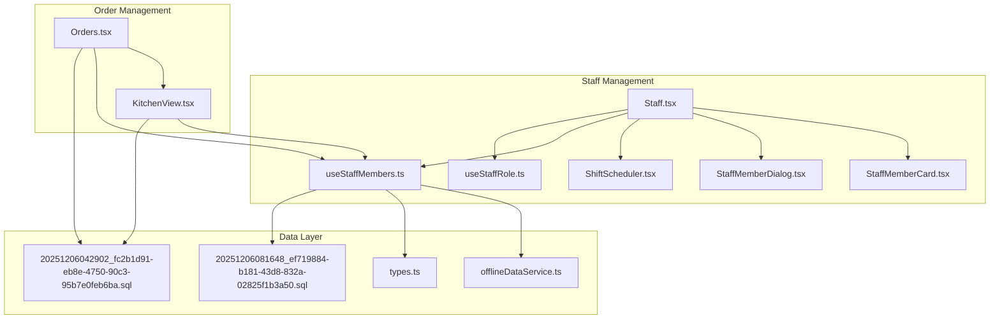
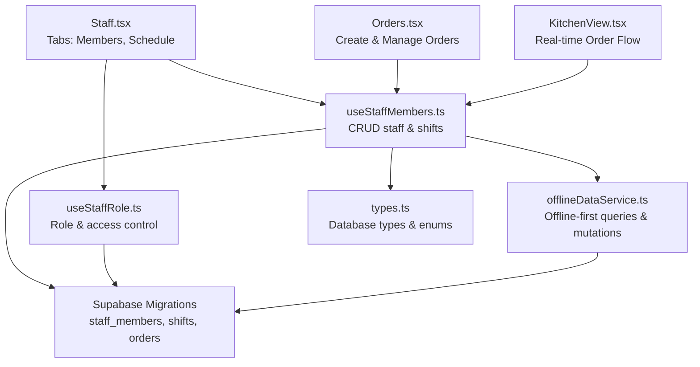
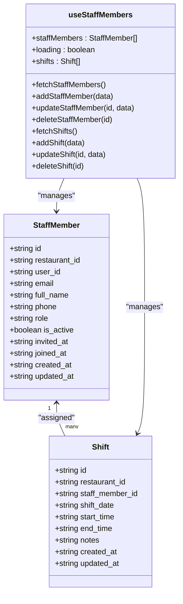
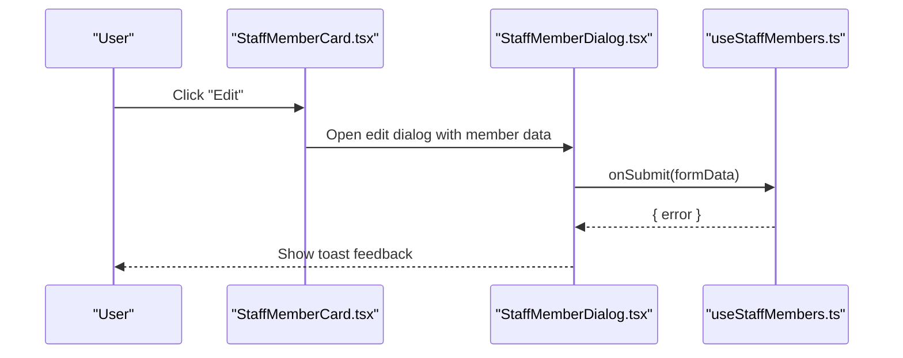
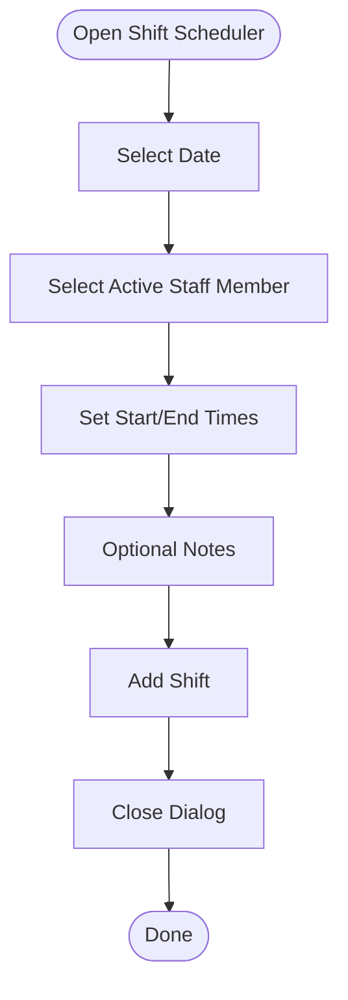
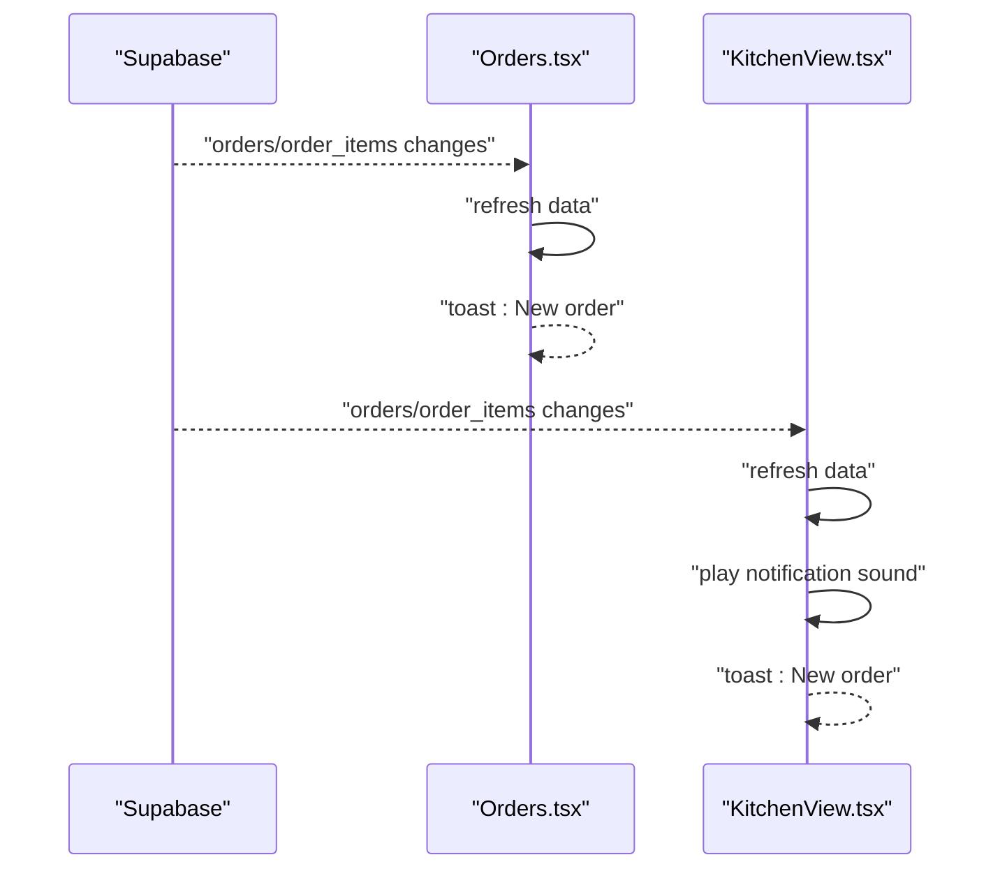
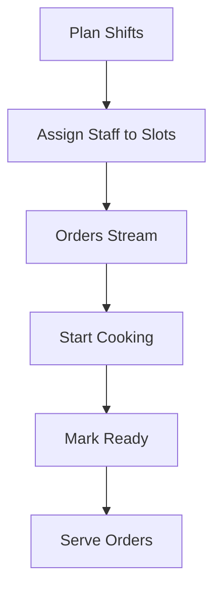
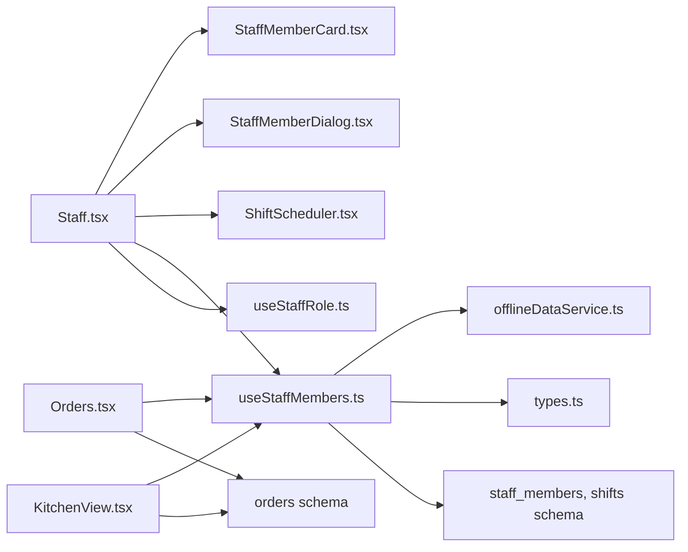

# Team Coordination & Communication

<cite>
**Referenced Files in This Document**
- [Staff.tsx](file://src/pages/dashboard/Staff.tsx)
- [ShiftScheduler.tsx](file://src/components/staff/ShiftScheduler.tsx)
- [StaffMemberCard.tsx](file://src/components/staff/StaffMemberCard.tsx)
- [StaffMemberDialog.tsx](file://src/components/staff/StaffMemberDialog.tsx)
- [useStaffMembers.ts](file://src/hooks/useStaffMembers.ts)
- [useStaffRole.ts](file://src/hooks/useStaffRole.ts)
- [Orders.tsx](file://src/pages/dashboard/Orders.tsx)
- [KitchenView.tsx](file://src/pages/dashboard/KitchenView.tsx)
- [offlineDataService.ts](file://src/services/offlineDataService.ts)
- [20251206081648_ef719884-b181-43d8-832a-02825f1b3a50.sql](file://supabase/migrations/20251206081648_ef719884-b181-43d8-832a-02825f1b3a50.sql)
- [20251206042902_fc2b1d91-eb8e-4750-90c3-95b7e0feb6ba.sql](file://supabase/migrations/20251206042902_fc2b1d91-eb8e-4750-90c3-95b7e0feb6ba.sql)
- [types.ts](file://src/integrations/supabase/types.ts)
</cite>

## Table of Contents
1. [Introduction](#introduction)
2. [Project Structure](#project-structure)
3. [Core Components](#core-components)
4. [Architecture Overview](#architecture-overview)
5. [Detailed Component Analysis](#detailed-component-analysis)
6. [Dependency Analysis](#dependency-analysis)
7. [Performance Considerations](#performance-considerations)
8. [Troubleshooting Guide](#troubleshooting-guide)
9. [Conclusion](#conclusion)

## Introduction
This document explains team coordination and communication features within staff management. It covers how staff teams are organized, how communication channels and collaborative workflows operate, and how team-based order processing integrates with real-time order management. It also documents the staff member card interface, team visibility features, and practical workflows for team formation, communication patterns, and task assignments during peak hours. Cross-training and mentorship opportunities are addressed conceptually alongside team-building activities.

## Project Structure
The team coordination features span several UI pages and shared hooks/services:
- Staff management page with team cards and schedule
- Shift scheduling for team-based planning
- Role-aware access control for team visibility and actions
- Real-time order management supporting team-based processing
- Offline-first data service enabling team coordination during network constraints

**Diagram sources**
- [Staff.tsx:15-205](file://src/pages/dashboard/Staff.tsx#L15-L205)
- [ShiftScheduler.tsx:40-275](file://src/components/staff/ShiftScheduler.tsx#L40-L275)
- [StaffMemberCard.tsx:40-140](file://src/components/staff/StaffMemberCard.tsx#L40-L140)
- [StaffMemberDialog.tsx:48-184](file://src/components/staff/StaffMemberDialog.tsx#L48-L184)
- [useStaffMembers.ts:36-143](file://src/hooks/useStaffMembers.ts#L36-L143)
- [useStaffRole.ts:29-134](file://src/hooks/useStaffRole.ts#L29-L134)
- [Orders.tsx:134-800](file://src/pages/dashboard/Orders.tsx#L134-L800)
- [KitchenView.tsx:80-785](file://src/pages/dashboard/KitchenView.tsx#L80-L785)
- [offlineDataService.ts:151-287](file://src/services/offlineDataService.ts#L151-L287)
- [20251206081648_ef719884-b181-43d8-832a-02825f1b3a50.sql:1-157](file://supabase/migrations/20251206081648_ef719884-b181-43d8-832a-02825f1b3a50.sql#L1-L157)
- [20251206042902_fc2b1d91-eb8e-4750-90c3-95b7e0feb6ba.sql:84-94](file://supabase/migrations/20251206042902_fc2b1d91-eb8e-4750-90c3-95b7e0feb6ba.sql#L84-L94)

**Section sources**
- [Staff.tsx:15-205](file://src/pages/dashboard/Staff.tsx#L15-L205)
- [ShiftScheduler.tsx:40-275](file://src/components/staff/ShiftScheduler.tsx#L40-L275)
- [useStaffMembers.ts:36-143](file://src/hooks/useStaffMembers.ts#L36-L143)
- [useStaffRole.ts:29-134](file://src/hooks/useStaffRole.ts#L29-L134)
- [Orders.tsx:134-800](file://src/pages/dashboard/Orders.tsx#L134-L800)
- [KitchenView.tsx:80-785](file://src/pages/dashboard/KitchenView.tsx#L80-L785)
- [offlineDataService.ts:151-287](file://src/services/offlineDataService.ts#L151-L287)
- [20251206081648_ef719884-b181-43d8-832a-02825f1b3a50.sql:1-157](file://supabase/migrations/20251206081648_ef719884-b181-43d8-832a-02825f1b3a50.sql#L1-L157)
- [20251206042902_fc2b1d91-eb8e-4750-90c3-95b7e0feb6ba.sql:84-94](file://supabase/migrations/20251206042902_fc2b1d91-eb8e-4750-90c3-95b7e0feb6ba.sql#L84-L94)

## Core Components
- Staff management page with search, add/edit/delete, and schedule tab
- Staff member card with role badges, activation status, and action menu
- Shift scheduler with weekly calendar, add/remove shifts, and staff assignment
- Role-aware hooks for access control and team visibility
- Real-time order management supporting team-based cooking and serving
- Offline-first data service enabling team coordination during outages

**Section sources**
- [Staff.tsx:15-205](file://src/pages/dashboard/Staff.tsx#L15-L205)
- [StaffMemberCard.tsx:40-140](file://src/components/staff/StaffMemberCard.tsx#L40-L140)
- [ShiftScheduler.tsx:40-275](file://src/components/staff/ShiftScheduler.tsx#L40-L275)
- [useStaffMembers.ts:36-143](file://src/hooks/useStaffMembers.ts#L36-L143)
- [useStaffRole.ts:29-134](file://src/hooks/useStaffRole.ts#L29-L134)
- [Orders.tsx:134-800](file://src/pages/dashboard/Orders.tsx#L134-L800)
- [KitchenView.tsx:80-785](file://src/pages/dashboard/KitchenView.tsx#L80-L785)
- [offlineDataService.ts:151-287](file://src/services/offlineDataService.ts#L151-L287)

## Architecture Overview
The system separates concerns across UI, hooks, services, and database:
- UI pages orchestrate views and user actions
- Hooks encapsulate data fetching, mutations, and role checks
- Services provide offline-first caching and synchronization
- Database schema defines staff roles, scheduling, and order processing

**Diagram sources**
- [Staff.tsx:15-205](file://src/pages/dashboard/Staff.tsx#L15-L205)
- [Orders.tsx:134-800](file://src/pages/dashboard/Orders.tsx#L134-L800)
- [KitchenView.tsx:80-785](file://src/pages/dashboard/KitchenView.tsx#L80-L785)
- [useStaffMembers.ts:36-143](file://src/hooks/useStaffMembers.ts#L36-L143)
- [useStaffRole.ts:29-134](file://src/hooks/useStaffRole.ts#L29-L134)
- [offlineDataService.ts:151-287](file://src/services/offlineDataService.ts#L151-L287)
- [20251206081648_ef719884-b181-43d8-832a-02825f1b3a50.sql:1-157](file://supabase/migrations/20251206081648_ef719884-b181-43d8-832a-02825f1b3a50.sql#L1-L157)
- [types.ts:679-684](file://src/integrations/supabase/types.ts#L679-L684)

## Detailed Component Analysis

### Staff Team Organization and Visibility
- Staff grouping and roles: The system defines roles (owner, manager, waiter, chef) and exposes them via hooks and UI components. Cards display role badges and activation status, enabling quick team visibility.
- Team assignment strategies: Shifts associate staff members to specific dates and times, forming temporary teams for operational periods.
- Access control: Role-aware hooks restrict actions and visibility to authorized users (owners/managers).

**Diagram sources**
- [useStaffMembers.ts:8-34](file://src/hooks/useStaffMembers.ts#L8-L34)
- [useStaffMembers.ts:36-143](file://src/hooks/useStaffMembers.ts#L36-L143)
- [20251206081648_ef719884-b181-43d8-832a-02825f1b3a50.sql:5-33](file://supabase/migrations/20251206081648_ef719884-b181-43d8-832a-02825f1b3a50.sql#L5-L33)

**Section sources**
- [useStaffMembers.ts:8-34](file://src/hooks/useStaffMembers.ts#L8-L34)
- [useStaffMembers.ts:36-143](file://src/hooks/useStaffMembers.ts#L36-L143)
- [StaffMemberCard.tsx:33-76](file://src/components/staff/StaffMemberCard.tsx#L33-L76)
- [useStaffRole.ts:29-134](file://src/hooks/useStaffRole.ts#L29-L134)

### Staff Member Card Interface and Team Visibility
- Role badges and icons: Cards display role-specific badges and icons for quick recognition.
- Activation status: Inactive members are visually marked, aiding team visibility.
- Action menu: Non-owner members expose edit, activate/deactivate, and delete actions.

**Diagram sources**
- [StaffMemberCard.tsx:40-140](file://src/components/staff/StaffMemberCard.tsx#L40-L140)
- [StaffMemberDialog.tsx:48-184](file://src/components/staff/StaffMemberDialog.tsx#L48-L184)
- [useStaffMembers.ts:105-142](file://src/hooks/useStaffMembers.ts#L105-L142)

**Section sources**
- [StaffMemberCard.tsx:40-140](file://src/components/staff/StaffMemberCard.tsx#L40-L140)
- [StaffMemberDialog.tsx:48-184](file://src/components/staff/StaffMemberDialog.tsx#L48-L184)
- [useStaffMembers.ts:105-142](file://src/hooks/useStaffMembers.ts#L105-L142)

### Team Assignment Strategies and Shift Scheduler
- Weekly calendar: The scheduler displays a weekly grid with days and slots for adding shifts.
- Staff assignment: Adding a shift requires selecting an active staff member, date, and time range.
- Removal: Shifts can be removed per slot.

**Diagram sources**
- [ShiftScheduler.tsx:40-275](file://src/components/staff/ShiftScheduler.tsx#L40-L275)

**Section sources**
- [ShiftScheduler.tsx:40-275](file://src/components/staff/ShiftScheduler.tsx#L40-L275)
- [useStaffMembers.ts:145-254](file://src/hooks/useStaffMembers.ts#L145-L254)

### Inter-Staff Coordination Tools and Communication Patterns
- Real-time order updates: The Orders and KitchenView pages subscribe to real-time events, notifying kitchen and waitstaff of new orders and status changes.
- Sound notifications: KitchenView plays a sound on new orders to prompt immediate coordination.
- Status-driven handoffs: Orders move through pending → cooking → ready → served, enabling coordinated handoffs between kitchen and service teams.

**Diagram sources**
- [Orders.tsx:308-350](file://src/pages/dashboard/Orders.tsx#L308-L350)
- [KitchenView.tsx:210-253](file://src/pages/dashboard/KitchenView.tsx#L210-L253)

**Section sources**
- [Orders.tsx:308-350](file://src/pages/dashboard/Orders.tsx#L308-L350)
- [KitchenView.tsx:210-253](file://src/pages/dashboard/KitchenView.tsx#L210-L253)

### Team-Based Task Assignments and Peak Hour Coordination
- Task assignment: Shifts define who is responsible for which time slots, enabling team-based coverage.
- Status transitions: KitchenView allows cooks to mark items ready, moving orders toward served status.
- Peak hour patterns: Use the schedule to pre-allocate more chefs and waiters during busy periods; rely on real-time order flow to adjust staffing dynamically.

**Diagram sources**
- [ShiftScheduler.tsx:40-275](file://src/components/staff/ShiftScheduler.tsx#L40-L275)
- [KitchenView.tsx:255-324](file://src/pages/dashboard/KitchenView.tsx#L255-L324)
- [Orders.tsx:450-488](file://src/pages/dashboard/Orders.tsx#L450-L488)

**Section sources**
- [ShiftScheduler.tsx:40-275](file://src/components/staff/ShiftScheduler.tsx#L40-L275)
- [KitchenView.tsx:255-324](file://src/pages/dashboard/KitchenView.tsx#L255-L324)
- [Orders.tsx:450-488](file://src/pages/dashboard/Orders.tsx#L450-L488)

### Practical Examples
- Team formation workflow:
  - Add staff members (owner/manager) and assign roles.
  - Create shifts for upcoming weeks, assigning active staff to time slots.
  - Monitor real-time order updates to adjust coverage as needed.
- Staff communication pattern:
  - Use KitchenView notifications to coordinate cooking tasks.
  - Use Orders page to communicate notes and cancellations.
- Team-based task assignment:
  - Pre-schedule more chefs during lunch/dinner peaks.
  - Use status transitions to signal readiness and availability.

[No sources needed since this section provides practical guidance derived from analyzed components]

### Cross-Training and Mentorship Opportunities
- Cross-training: Use the schedule to rotate staff across roles (e.g., waiters covering prep during busy periods) by adjusting roles and shifts.
- Mentorship: Pair junior staff with experienced chefs/waiters via shift assignments to facilitate on-the-job learning.

[No sources needed since this section provides conceptual guidance]

## Dependency Analysis
The following diagram highlights key dependencies among components and services:

**Diagram sources**
- [Staff.tsx:15-205](file://src/pages/dashboard/Staff.tsx#L15-L205)
- [ShiftScheduler.tsx:40-275](file://src/components/staff/ShiftScheduler.tsx#L40-L275)
- [StaffMemberCard.tsx:40-140](file://src/components/staff/StaffMemberCard.tsx#L40-L140)
- [StaffMemberDialog.tsx:48-184](file://src/components/staff/StaffMemberDialog.tsx#L48-L184)
- [useStaffMembers.ts:36-143](file://src/hooks/useStaffMembers.ts#L36-L143)
- [useStaffRole.ts:29-134](file://src/hooks/useStaffRole.ts#L29-L134)
- [Orders.tsx:134-800](file://src/pages/dashboard/Orders.tsx#L134-L800)
- [KitchenView.tsx:80-785](file://src/pages/dashboard/KitchenView.tsx#L80-L785)
- [offlineDataService.ts:151-287](file://src/services/offlineDataService.ts#L151-L287)
- [20251206081648_ef719884-b181-43d8-832a-02825f1b3a50.sql:1-157](file://supabase/migrations/20251206081648_ef719884-b181-43d8-832a-02825f1b3a50.sql#L1-L157)
- [20251206042902_fc2b1d91-eb8e-4750-90c3-95b7e0feb6ba.sql:84-94](file://supabase/migrations/20251206042902_fc2b1d91-eb8e-4750-90c3-95b7e0feb6ba.sql#L84-L94)

**Section sources**
- [useStaffMembers.ts:36-143](file://src/hooks/useStaffMembers.ts#L36-L143)
- [useStaffRole.ts:29-134](file://src/hooks/useStaffRole.ts#L29-L134)
- [offlineDataService.ts:151-287](file://src/services/offlineDataService.ts#L151-L287)
- [20251206081648_ef719884-b181-43d8-832a-02825f1b3a50.sql:1-157](file://supabase/migrations/20251206081648_ef719884-b181-43d8-832a-02825f1b3a50.sql#L1-L157)
- [20251206042902_fc2b1d91-eb8e-4750-90c3-95b7e0feb6ba.sql:84-94](file://supabase/migrations/20251206042902_fc2b1d91-eb8e-4750-90c3-95b7e0feb6ba.sql#L84-L94)

## Performance Considerations
- Offline-first data access reduces latency and enables team coordination during outages.
- Real-time subscriptions update order states instantly, minimizing coordination delays.
- Role-aware filtering ensures users only see relevant data, reducing UI overhead.

[No sources needed since this section provides general guidance]

## Troubleshooting Guide
- Shifts not appearing: Verify active staff members and correct date/time selection in the scheduler.
- Role restrictions: Use role-aware hooks to confirm access level; owners/managers have broader permissions.
- Real-time updates not firing: Confirm connectivity and that subscriptions are active for the current restaurant.
- Offline mode: In Electron/LAN modes, data is served from local storage; use manual sync to upload changes when online.

**Section sources**
- [ShiftScheduler.tsx:40-275](file://src/components/staff/ShiftScheduler.tsx#L40-L275)
- [useStaffRole.ts:29-134](file://src/hooks/useStaffRole.ts#L29-L134)
- [Orders.tsx:308-350](file://src/pages/dashboard/Orders.tsx#L308-L350)
- [offlineDataService.ts:151-287](file://src/services/offlineDataService.ts#L151-L287)

## Conclusion
The team coordination and communication system combines role-aware staff management, shift scheduling, and real-time order processing to enable efficient team-based operations. The offline-first architecture ensures reliable coordination during network constraints, while real-time updates and notifications streamline inter-staff communication. By leveraging shifts, status transitions, and role-based access, teams can maintain smooth operations during peak hours and support ongoing development through cross-training and mentorship.