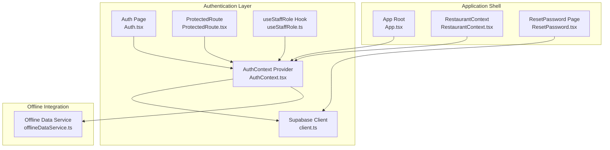
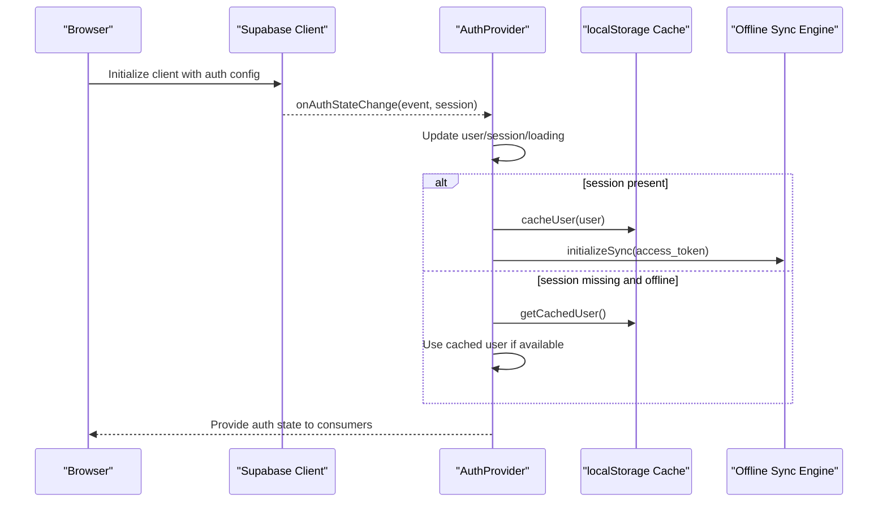
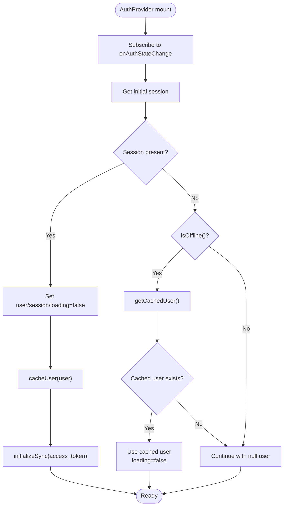
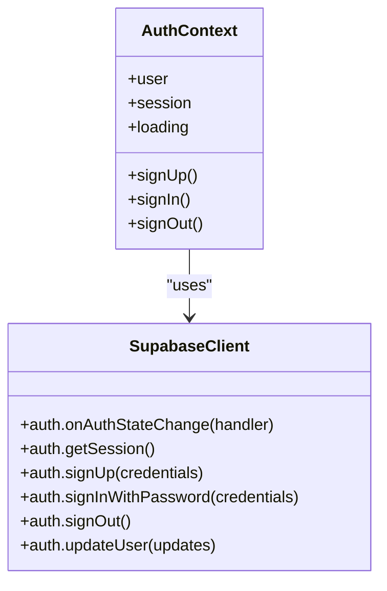
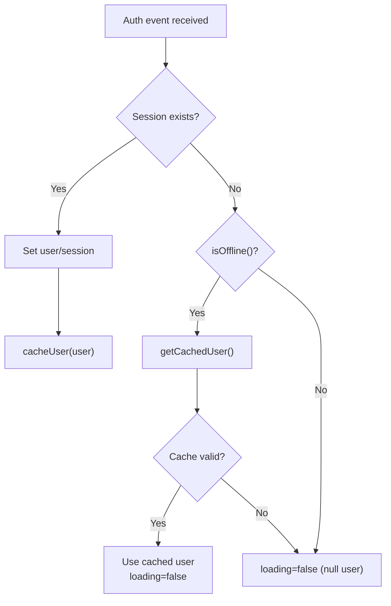
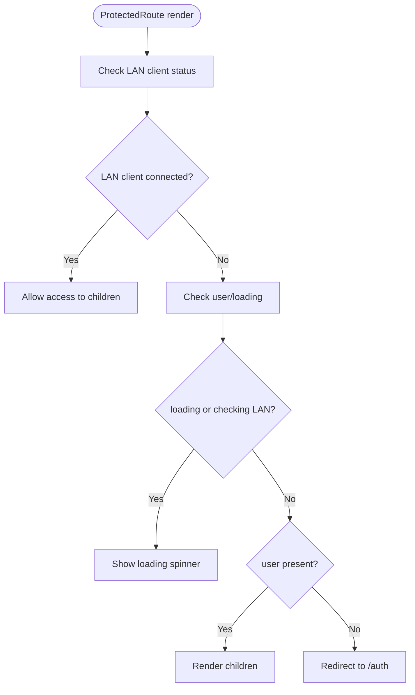
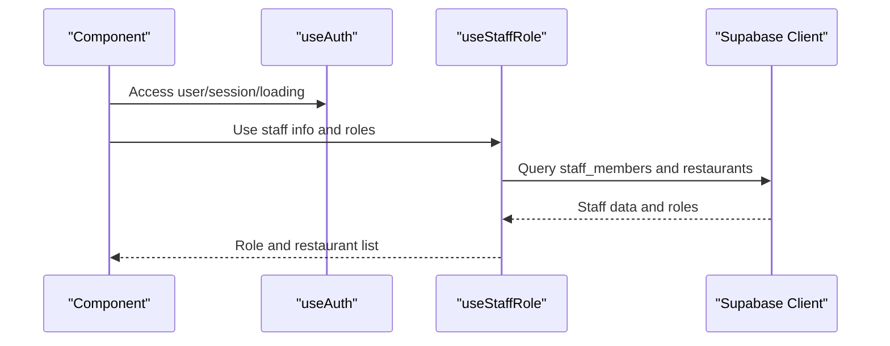
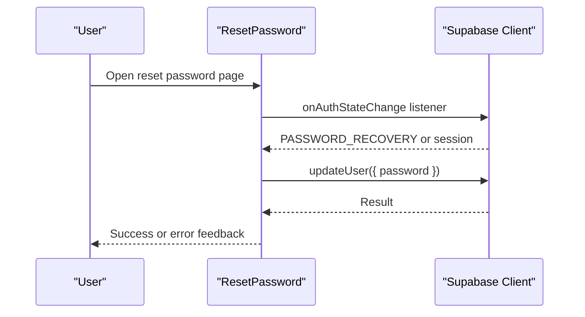
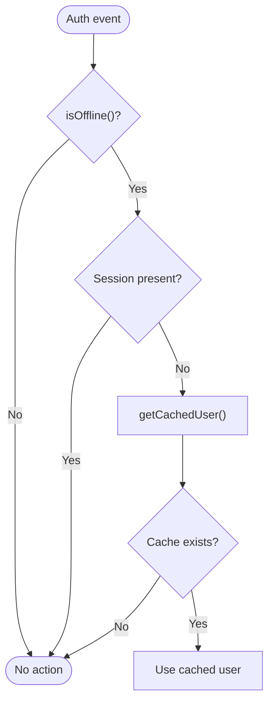
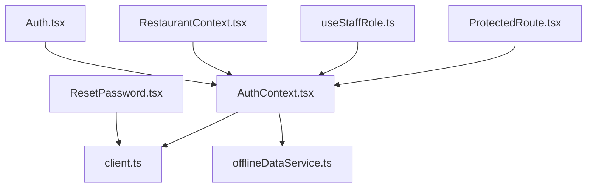

# Authentication Context

<cite>
**Referenced Files in This Document**
- [AuthContext.tsx](file://src/contexts/AuthContext.tsx)
- [client.ts](file://src/integrations/supabase/client.ts)
- [Auth.tsx](file://src/pages/Auth.tsx)
- [ProtectedRoute.tsx](file://src/components/ProtectedRoute.tsx)
- [useStaffRole.ts](file://src/hooks/useStaffRole.ts)
- [App.tsx](file://src/App.tsx)
- [offlineDataService.ts](file://src/services/offlineDataService.ts)
- [types.ts](file://src/integrations/supabase/types.ts)
- [ResetPassword.tsx](file://src/pages/ResetPassword.tsx)
- [RestaurantContext.tsx](file://src/contexts/RestaurantContext.tsx)
</cite>

## Table of Contents
1. [Introduction](#introduction)
2. [Project Structure](#project-structure)
3. [Core Components](#core-components)
4. [Architecture Overview](#architecture-overview)
5. [Detailed Component Analysis](#detailed-component-analysis)
6. [Dependency Analysis](#dependency-analysis)
7. [Performance Considerations](#performance-considerations)
8. [Troubleshooting Guide](#troubleshooting-guide)
9. [Conclusion](#conclusion)

## Introduction
This document explains the authentication context system in TableFlow Pro. It covers the AuthProvider implementation, user session management, authentication state handling, Supabase integration, real-time auth state changes, offline authentication support, caching mechanisms for user sessions, token refresh handling, and secure authentication workflows. Practical examples demonstrate authentication hooks usage, protected route implementation, and error handling patterns. Security considerations for offline operations and session lifecycle management are also addressed.

## Project Structure
The authentication system spans several modules:
- Authentication context provider and hooks
- Supabase client configuration
- Authentication UI pages
- Protected routing
- Offline data synchronization integration
- Staff role and restaurant context integration

**Diagram sources**
- [AuthContext.tsx:1-141](file://src/contexts/AuthContext.tsx#L1-L141)
- [client.ts:1-17](file://src/integrations/supabase/client.ts#L1-L17)
- [Auth.tsx:1-224](file://src/pages/Auth.tsx#L1-L224)
- [ProtectedRoute.tsx:1-60](file://src/components/ProtectedRoute.tsx#L1-L60)
- [useStaffRole.ts:1-190](file://src/hooks/useStaffRole.ts#L1-L190)
- [App.tsx:1-150](file://src/App.tsx#L1-L150)
- [offlineDataService.ts:1-769](file://src/services/offlineDataService.ts#L1-L769)
- [RestaurantContext.tsx:1-391](file://src/contexts/RestaurantContext.tsx#L1-L391)
- [ResetPassword.tsx:1-154](file://src/pages/ResetPassword.tsx#L1-L154)

**Section sources**
- [AuthContext.tsx:1-141](file://src/contexts/AuthContext.tsx#L1-L141)
- [client.ts:1-17](file://src/integrations/supabase/client.ts#L1-L17)
- [Auth.tsx:1-224](file://src/pages/Auth.tsx#L1-L224)
- [ProtectedRoute.tsx:1-60](file://src/components/ProtectedRoute.tsx#L1-L60)
- [useStaffRole.ts:1-190](file://src/hooks/useStaffRole.ts#L1-L190)
- [App.tsx:1-150](file://src/App.tsx#L1-L150)
- [offlineDataService.ts:1-769](file://src/services/offlineDataService.ts#L1-L769)
- [RestaurantContext.tsx:1-391](file://src/contexts/RestaurantContext.tsx#L1-L391)
- [ResetPassword.tsx:1-154](file://src/pages/ResetPassword.tsx#L1-L154)

## Core Components
- AuthProvider: Centralizes authentication state, exposes sign-up, sign-in, and sign-out actions, and manages Supabase auth state changes and offline behavior.
- Supabase Client: Configured with automatic token refresh, session persistence, and localStorage-backed storage.
- Auth Page: Provides sign-in and sign-up forms integrated with AuthProvider and Supabase.
- ProtectedRoute: Guards dashboard routes using authentication state and supports LAN client bypass.
- useStaffRole Hook: Derives staff role and restaurant membership from the authenticated user.
- Offline Data Service: Integrates with AuthProvider to start/stop sync based on auth state and supports offline authentication via cached user.
- RestaurantContext: Builds on AuthProvider to manage current restaurant and role, with offline persistence.

**Section sources**
- [AuthContext.tsx:28-141](file://src/contexts/AuthContext.tsx#L28-L141)
- [client.ts:11-17](file://src/integrations/supabase/client.ts#L11-L17)
- [Auth.tsx:13-224](file://src/pages/Auth.tsx#L13-L224)
- [ProtectedRoute.tsx:9-60](file://src/components/ProtectedRoute.tsx#L9-L60)
- [useStaffRole.ts:29-134](file://src/hooks/useStaffRole.ts#L29-L134)
- [offlineDataService.ts:351-372](file://src/services/offlineDataService.ts#L351-L372)
- [RestaurantContext.tsx:47-391](file://src/contexts/RestaurantContext.tsx#L47-L391)

## Architecture Overview
The authentication architecture integrates Supabase’s auth state management with a React context provider. Real-time auth events trigger updates to user/session state, optional caching, and conditional initialization of offline sync. ProtectedRoute enforces authentication for most routes, with LAN client mode bypassing auth checks when connected.

**Diagram sources**
- [AuthContext.tsx:44-97](file://src/contexts/AuthContext.tsx#L44-L97)
- [client.ts:11-17](file://src/integrations/supabase/client.ts#L11-L17)
- [offlineDataService.ts:351-372](file://src/services/offlineDataService.ts#L351-L372)

## Detailed Component Analysis

### AuthProvider Implementation
- State management: Tracks user, session, and loading state.
- Supabase integration: Subscribes to onAuthStateChange and retrieves initial session.
- Offline-aware behavior: When offline and session is null, restores user from localStorage cache if available.
- Sync lifecycle: Starts offline sync when a valid access token is available; stops sync on sign-out or missing token.
- Authentication actions: Exposes sign-up, sign-in, and sign-out functions backed by Supabase.

**Diagram sources**
- [AuthContext.tsx:44-97](file://src/contexts/AuthContext.tsx#L44-L97)
- [offlineDataService.ts:351-372](file://src/services/offlineDataService.ts#L351-L372)

**Section sources**
- [AuthContext.tsx:39-132](file://src/contexts/AuthContext.tsx#L39-L132)
- [offlineDataService.ts:351-372](file://src/services/offlineDataService.ts#L351-L372)

### Supabase Integration and Token Refresh
- Client configuration enables autoRefreshToken and persistSession with localStorage storage.
- Auth state changes propagate to the provider, ensuring consistent user/session state across the app.
- Token refresh and persistence are handled transparently by Supabase.

**Diagram sources**
- [client.ts:11-17](file://src/integrations/supabase/client.ts#L11-L17)
- [AuthContext.tsx:28-141](file://src/contexts/AuthContext.tsx#L28-L141)

**Section sources**
- [client.ts:11-17](file://src/integrations/supabase/client.ts#L11-L17)
- [AuthContext.tsx:44-97](file://src/contexts/AuthContext.tsx#L44-L97)

### Authentication State Handling and Caching
- User caching: On successful auth, user is serialized to localStorage for offline restoration.
- Offline restoration: When offline and session is null, the provider attempts to restore the user from cache.
- Explicit sign-out clears the cached user to prevent stale data.

**Diagram sources**
- [AuthContext.tsx:44-97](file://src/contexts/AuthContext.tsx#L44-L97)

**Section sources**
- [AuthContext.tsx:8-26](file://src/contexts/AuthContext.tsx#L8-L26)
- [AuthContext.tsx:49-75](file://src/contexts/AuthContext.tsx#L49-L75)

### Protected Route Implementation
- Uses AuthProvider to determine authentication state.
- Supports LAN client mode: if LAN client is connected, routes are accessible without requiring a Supabase session.
- Displays a loading spinner while authentication state is resolving.

**Diagram sources**
- [ProtectedRoute.tsx:9-60](file://src/components/ProtectedRoute.tsx#L9-L60)

**Section sources**
- [ProtectedRoute.tsx:9-60](file://src/components/ProtectedRoute.tsx#L9-L60)

### Authentication Hooks Usage
- useAuth: Provides authentication state and actions to components.
- useStaffRole: Derives staff role and restaurant memberships for the authenticated user, with offline-aware behavior.

**Diagram sources**
- [useStaffRole.ts:29-134](file://src/hooks/useStaffRole.ts#L29-L134)
- [AuthContext.tsx:134-141](file://src/contexts/AuthContext.tsx#L134-L141)

**Section sources**
- [AuthContext.tsx:134-141](file://src/contexts/AuthContext.tsx#L134-L141)
- [useStaffRole.ts:29-134](file://src/hooks/useStaffRole.ts#L29-L134)

### Password Reset Flow
- Validates active recovery session or current session.
- Updates user password upon successful validation.

**Diagram sources**
- [ResetPassword.tsx:18-61](file://src/pages/ResetPassword.tsx#L18-L61)
- [client.ts:11-17](file://src/integrations/supabase/client.ts#L11-L17)

**Section sources**
- [ResetPassword.tsx:18-61](file://src/pages/ResetPassword.tsx#L18-L61)

### Offline Authentication Support
- Offline detection: Uses connectivity listeners to determine offline state.
- Cached user restoration: When offline and session is null, the provider restores the user from localStorage.
- Sync lifecycle: Starts offline sync engine when an access token is available; stops on sign-out.

**Diagram sources**
- [AuthContext.tsx:49-57](file://src/contexts/AuthContext.tsx#L49-L57)
- [offlineDataService.ts:36-47](file://src/services/offlineDataService.ts#L36-L47)

**Section sources**
- [AuthContext.tsx:49-57](file://src/contexts/AuthContext.tsx#L49-L57)
- [offlineDataService.ts:36-47](file://src/services/offlineDataService.ts#L36-L47)

## Dependency Analysis
- AuthProvider depends on Supabase client for auth state and actions.
- AuthProvider coordinates with Offline Data Service to start/stop sync based on access token availability.
- ProtectedRoute depends on AuthProvider for authentication state and LAN client status.
- useStaffRole depends on AuthProvider for user identity and Supabase for staff role queries.
- RestaurantContext depends on AuthProvider for user identity and offline-aware data retrieval.

**Diagram sources**
- [AuthContext.tsx:1-141](file://src/contexts/AuthContext.tsx#L1-L141)
- [client.ts:1-17](file://src/integrations/supabase/client.ts#L1-L17)
- [offlineDataService.ts:1-769](file://src/services/offlineDataService.ts#L1-L769)
- [ProtectedRoute.tsx:1-60](file://src/components/ProtectedRoute.tsx#L1-L60)
- [useStaffRole.ts:1-190](file://src/hooks/useStaffRole.ts#L1-L190)
- [RestaurantContext.tsx:1-391](file://src/contexts/RestaurantContext.tsx#L1-L391)
- [Auth.tsx:1-224](file://src/pages/Auth.tsx#L1-L224)
- [ResetPassword.tsx:1-154](file://src/pages/ResetPassword.tsx#L1-L154)

**Section sources**
- [AuthContext.tsx:1-141](file://src/contexts/AuthContext.tsx#L1-L141)
- [client.ts:1-17](file://src/integrations/supabase/client.ts#L1-L17)
- [offlineDataService.ts:1-769](file://src/services/offlineDataService.ts#L1-L769)
- [ProtectedRoute.tsx:1-60](file://src/components/ProtectedRoute.tsx#L1-L60)
- [useStaffRole.ts:1-190](file://src/hooks/useStaffRole.ts#L1-L190)
- [RestaurantContext.tsx:1-391](file://src/contexts/RestaurantContext.tsx#L1-L391)
- [Auth.tsx:1-224](file://src/pages/Auth.tsx#L1-L224)
- [ResetPassword.tsx:1-154](file://src/pages/ResetPassword.tsx#L1-L154)

## Performance Considerations
- Minimize unnecessary re-renders by relying on AuthProvider’s consolidated state.
- Use offline-aware queries (e.g., RestaurantContext) to avoid redundant network requests when offline.
- Keep cached user minimal and only serialize essential user data to localStorage.

## Troubleshooting Guide
- Authentication not persisting after reload: Ensure Supabase client is configured with persistSession and storage set to localStorage.
- Stale user after sign-out: Confirm that sign-out clears cached user and that sync is stopped.
- Offline mode not restoring user: Verify isOffline detection and that cached user exists in localStorage.
- ProtectedRoute blocking LAN client: Confirm LAN client status check and that the LAN client is connected.

**Section sources**
- [client.ts:11-17](file://src/integrations/supabase/client.ts#L11-L17)
- [AuthContext.tsx:72-75](file://src/contexts/AuthContext.tsx#L72-L75)
- [offlineDataService.ts:36-47](file://src/services/offlineDataService.ts#L36-L47)
- [ProtectedRoute.tsx:15-38](file://src/components/ProtectedRoute.tsx#L15-L38)

## Conclusion
TableFlow Pro’s authentication system centers on a robust AuthProvider that integrates Supabase’s real-time auth state, caches user data for offline resilience, and coordinates with the offline sync engine. ProtectedRoute ensures secure access to dashboard routes while supporting LAN client scenarios. Together, these components deliver a secure, resilient, and user-friendly authentication experience across online and offline environments.