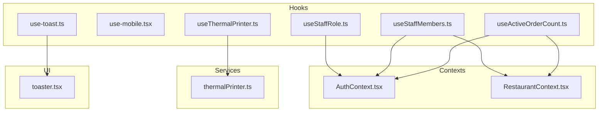
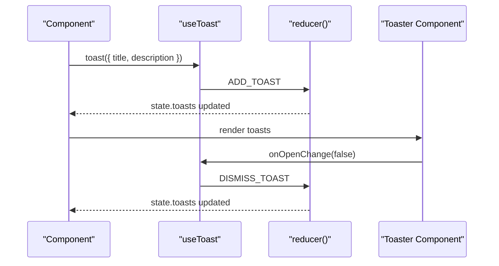
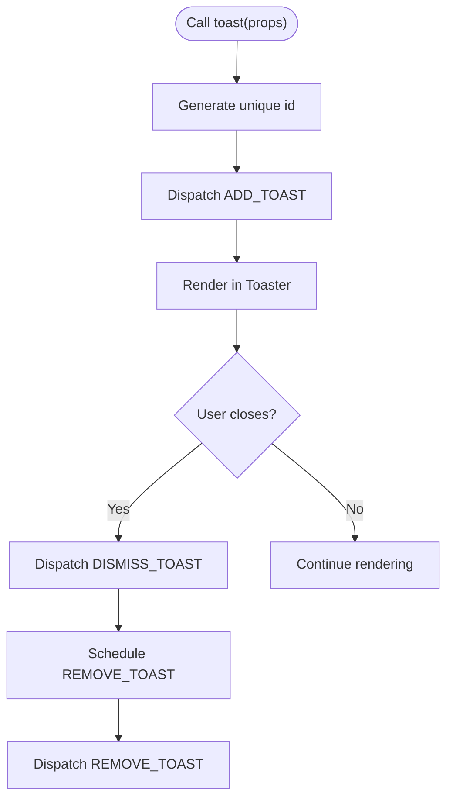
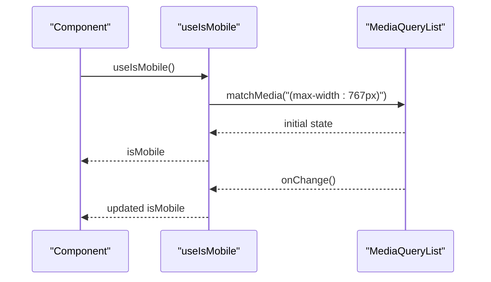
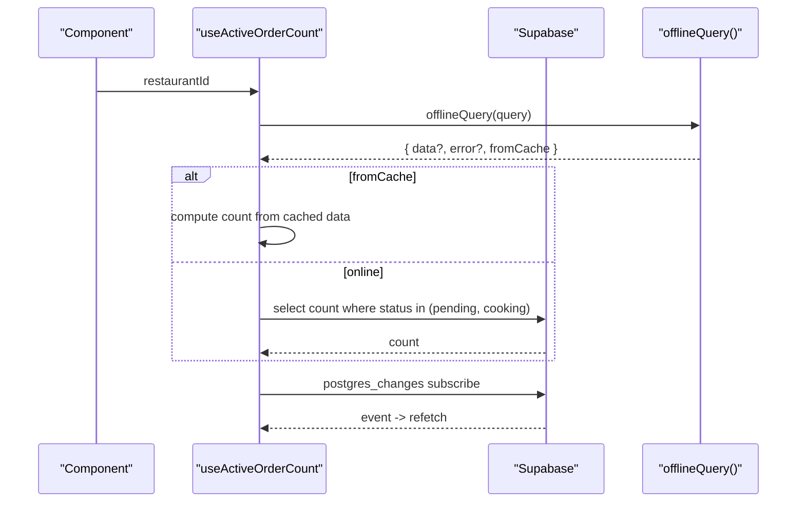
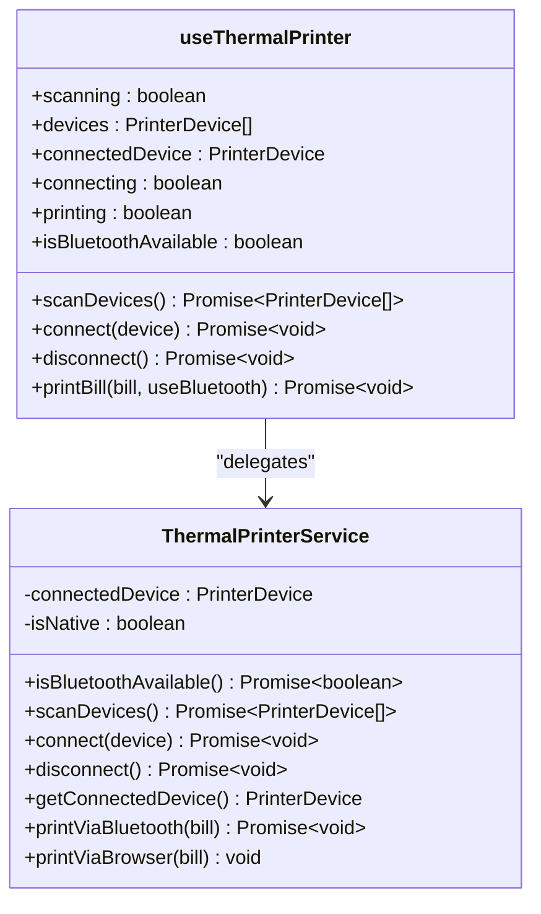
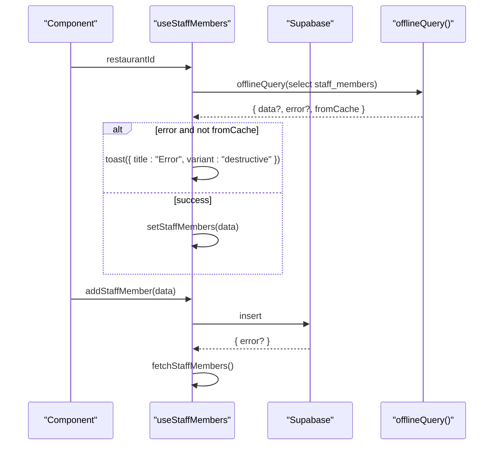
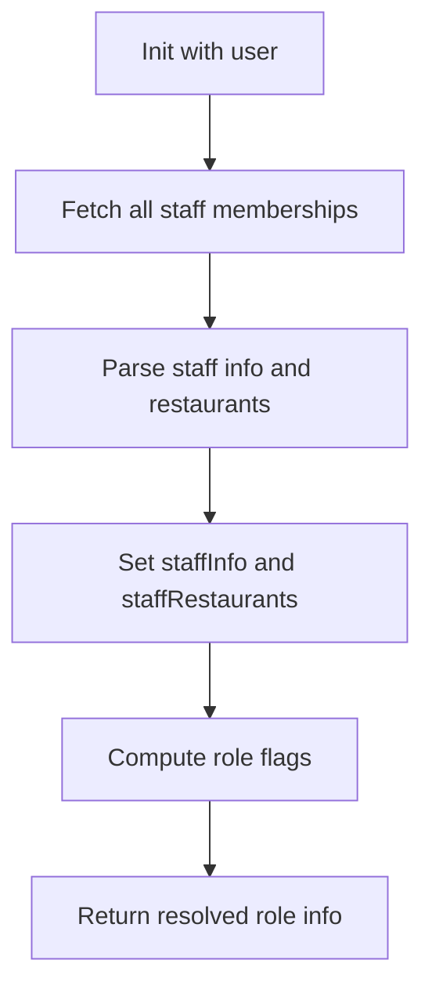
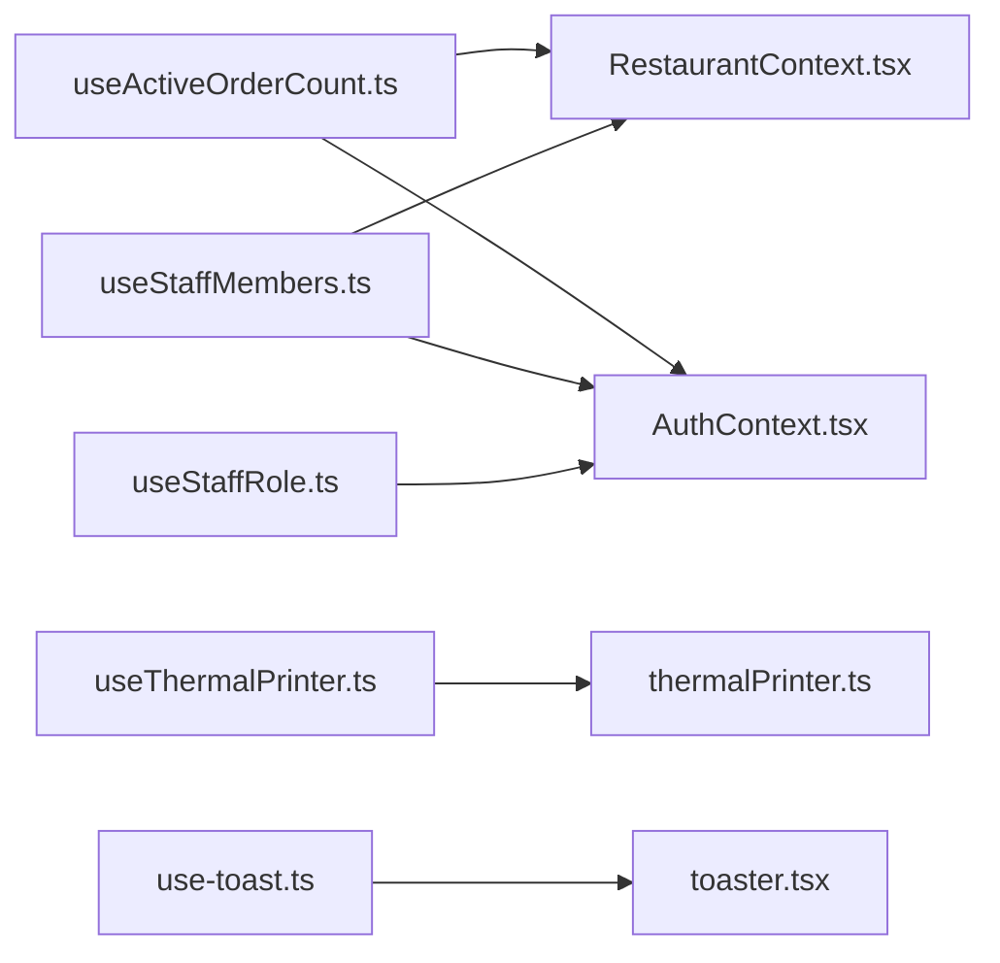

# Custom Hooks & State Logic

<cite>
**Referenced Files in This Document**
- [use-toast.ts](file://src/hooks/use-toast.ts)
- [use-mobile.tsx](file://src/hooks/use-mobile.tsx)
- [useActiveOrderCount.ts](file://src/hooks/useActiveOrderCount.ts)
- [useThermalPrinter.ts](file://src/hooks/useThermalPrinter.ts)
- [useStaffMembers.ts](file://src/hooks/useStaffMembers.ts)
- [useStaffRole.ts](file://src/hooks/useStaffRole.ts)
- [thermalPrinter.ts](file://src/services/thermalPrinter.ts)
- [AuthContext.tsx](file://src/contexts/AuthContext.tsx)
- [RestaurantContext.tsx](file://src/contexts/RestaurantContext.tsx)
- [toaster.tsx](file://src/components/ui/toaster.tsx)
- [DashboardLayout.tsx](file://src/components/layout/DashboardLayout.tsx)
- [PrinterSelector.tsx](file://src/components/PrinterSelector.tsx)
- [OrderKiosk.tsx](file://src/pages/dashboard/OrderKiosk.tsx)
- [Reports.tsx](file://src/pages/dashboard/Reports.tsx)
- [BillingDialog.tsx](file://src/components/BillingDialog.tsx)
- [sidebar.tsx](file://src/components/ui/sidebar.tsx)
- [KitchenView.tsx](file://src/pages/dashboard/KitchenView.tsx)
- [Orders.tsx](file://src/pages/dashboard/Orders.tsx)
</cite>

## Table of Contents
1. [Introduction](#introduction)
2. [Project Structure](#project-structure)
3. [Core Components](#core-components)
4. [Architecture Overview](#architecture-overview)
5. [Detailed Component Analysis](#detailed-component-analysis)
6. [Dependency Analysis](#dependency-analysis)
7. [Performance Considerations](#performance-considerations)
8. [Troubleshooting Guide](#troubleshooting-guide)
9. [Conclusion](#conclusion)

## Introduction
This document explains the custom hooks and state management patterns used in TableFlow Pro. It focuses on how hooks encapsulate business logic, manage state, compose dependencies, and integrate with context providers. Covered hooks include notification management (useToast), responsive behavior (useMobile), real-time order tracking (useActiveOrderCount), and thermal printer operations (useThermalPrinter). Practical usage examples, composition patterns, performance tips, and testing strategies are included to help developers adopt and extend these patterns effectively.

## Project Structure
The hooks live under src/hooks and are consumed by components across the application. They rely on:
- Context providers (AuthContext, RestaurantContext) for global state
- Services (thermalPrinter) for platform-specific capabilities
- UI toast components for user feedback

**Diagram sources**
- [use-toast.ts:1-187](file://src/hooks/use-toast.ts#L1-L187)
- [use-mobile.tsx:1-20](file://src/hooks/use-mobile.tsx#L1-L20)
- [useActiveOrderCount.ts:1-76](file://src/hooks/useActiveOrderCount.ts#L1-L76)
- [useThermalPrinter.ts:1-69](file://src/hooks/useThermalPrinter.ts#L1-L69)
- [useStaffMembers.ts:1-255](file://src/hooks/useStaffMembers.ts#L1-L255)
- [useStaffRole.ts:1-190](file://src/hooks/useStaffRole.ts#L1-L190)
- [thermalPrinter.ts:1-339](file://src/services/thermalPrinter.ts#L1-L339)
- [AuthContext.tsx:1-141](file://src/contexts/AuthContext.tsx#L1-L141)
- [RestaurantContext.tsx:1-391](file://src/contexts/RestaurantContext.tsx#L1-L391)
- [toaster.tsx:1-4](file://src/components/ui/toaster.tsx#L1-L4)

**Section sources**
- [use-toast.ts:1-187](file://src/hooks/use-toast.ts#L1-L187)
- [use-mobile.tsx:1-20](file://src/hooks/use-mobile.tsx#L1-L20)
- [useActiveOrderCount.ts:1-76](file://src/hooks/useActiveOrderCount.ts#L1-L76)
- [useThermalPrinter.ts:1-69](file://src/hooks/useThermalPrinter.ts#L1-L69)
- [useStaffMembers.ts:1-255](file://src/hooks/useStaffMembers.ts#L1-L255)
- [useStaffRole.ts:1-190](file://src/hooks/useStaffRole.ts#L1-L190)
- [thermalPrinter.ts:1-339](file://src/services/thermalPrinter.ts#L1-L339)
- [AuthContext.tsx:1-141](file://src/contexts/AuthContext.tsx#L1-L141)
- [RestaurantContext.tsx:1-391](file://src/contexts/RestaurantContext.tsx#L1-L391)
- [toaster.tsx:1-4](file://src/components/ui/toaster.tsx#L1-L4)

## Core Components
- useToast: Centralized toast notifications with a reducer-driven state machine, supporting add/update/dismiss/remove actions and a queue for removal timers.
- useIsMobile: Responsive detection using MediaQueryList to track viewport breakpoints.
- useActiveOrderCount: Real-time order counting with offline-first caching and Supabase real-time subscriptions.
- useThermalPrinter: Printer lifecycle and printing operations with platform-aware behavior (native vs browser).
- useStaffMembers: CRUD and listing for staff members and shifts with offline support and toast integration.
- useStaffRole: Role resolution per user and per restaurant with caching and refresh capability.

**Section sources**
- [use-toast.ts:166-184](file://src/hooks/use-toast.ts#L166-L184)
- [use-mobile.tsx:5-19](file://src/hooks/use-mobile.tsx#L5-L19)
- [useActiveOrderCount.ts:5-75](file://src/hooks/useActiveOrderCount.ts#L5-L75)
- [useThermalPrinter.ts:4-68](file://src/hooks/useThermalPrinter.ts#L4-L68)
- [useStaffMembers.ts:36-143](file://src/hooks/useStaffMembers.ts#L36-L143)
- [useStaffRole.ts:29-134](file://src/hooks/useStaffRole.ts#L29-L134)

## Architecture Overview
The hooks follow a layered pattern:
- UI layer consumes hooks for state and actions
- Hooks derive state from contexts (AuthContext, RestaurantContext)
- Hooks call services for platform-specific operations (thermalPrinter)
- Hooks coordinate with Supabase for data and real-time updates
- Notifications are centralized via useToast

**Diagram sources**
- [use-toast.ts:137-164](file://src/hooks/use-toast.ts#L137-L164)
- [use-toast.ts:71-122](file://src/hooks/use-toast.ts#L71-L122)
- [toaster.tsx:1-4](file://src/components/ui/toaster.tsx#L1-L4)

## Detailed Component Analysis

### useToast: Notification Management
- State model: maintains an array of toasts with ids and metadata
- Actions: add, update, dismiss, remove; dismiss triggers a delayed removal timer
- Composition: exposes a functional toast() creator and a hook-bound state with helpers
- UI integration: Toaster renders the current toasts and invokes dismiss on close

**Diagram sources**
- [use-toast.ts:137-164](file://src/hooks/use-toast.ts#L137-L164)
- [use-toast.ts:55-69](file://src/hooks/use-toast.ts#L55-L69)
- [use-toast.ts:71-122](file://src/hooks/use-toast.ts#L71-L122)
- [toaster.tsx:1-4](file://src/components/ui/toaster.tsx#L1-L4)

**Section sources**
- [use-toast.ts:1-187](file://src/hooks/use-toast.ts#L1-L187)
- [toaster.tsx:1-4](file://src/components/ui/toaster.tsx#L1-L4)

### useIsMobile: Responsive Design
- Uses MediaQueryList to detect viewport width against a breakpoint
- Initializes state from current window width and subscribes to media change events
- Returns a boolean suitable for conditional rendering and layout decisions

**Diagram sources**
- [use-mobile.tsx:5-19](file://src/hooks/use-mobile.tsx#L5-L19)

**Section sources**
- [use-mobile.tsx:1-20](file://src/hooks/use-mobile.tsx#L1-L20)
- [sidebar.tsx:50](file://src/components/ui/sidebar.tsx#L50)
- [KitchenView.tsx:84](file://src/pages/dashboard/KitchenView.tsx#L84)
- [Orders.tsx:135](file://src/pages/dashboard/Orders.tsx#L135)

### useActiveOrderCount: Real-Time Order Tracking
- Fetches counts for pending/cooking orders with offline-first caching
- Subscribes to Supabase real-time channel to refresh counts instantly
- Handles offline scenarios gracefully and falls back to online queries when needed

**Diagram sources**
- [useActiveOrderCount.ts:5-75](file://src/hooks/useActiveOrderCount.ts#L5-L75)

**Section sources**
- [useActiveOrderCount.ts:1-76](file://src/hooks/useActiveOrderCount.ts#L1-L76)
- [DashboardLayout.tsx:77](file://src/components/layout/DashboardLayout.tsx#L77)

### useThermalPrinter: Printer Lifecycle and Printing
- Manages scanning, connecting, disconnecting, and printing bills
- Supports native Bluetooth printing on Capacitor platforms and browser-based printing
- Exposes status flags (scanning, connecting, printing) and device lists

**Diagram sources**
- [useThermalPrinter.ts:4-68](file://src/hooks/useThermalPrinter.ts#L4-L68)
- [thermalPrinter.ts:33-339](file://src/services/thermalPrinter.ts#L33-L339)

**Section sources**
- [useThermalPrinter.ts:1-69](file://src/hooks/useThermalPrinter.ts#L1-L69)
- [thermalPrinter.ts:1-339](file://src/services/thermalPrinter.ts#L1-L339)
- [PrinterSelector.tsx:25](file://src/components/PrinterSelector.tsx#L25)
- [OrderKiosk.tsx:158](file://src/pages/dashboard/OrderKiosk.tsx#L158)
- [OrderKiosk.tsx:160](file://src/pages/dashboard/OrderKiosk.tsx#L160)
- [Reports.tsx:162](file://src/pages/dashboard/Reports.tsx#L162)
- [Reports.tsx:603](file://src/pages/dashboard/Reports.tsx#L603)
- [BillingDialog.tsx:81](file://src/components/BillingDialog.tsx#L81)

### useStaffMembers: Staff and Shift Management
- Provides CRUD operations for staff members and shifts with offline support
- Integrates with useToast for error reporting
- Sorts and orders data consistently for UI stability

**Diagram sources**
- [useStaffMembers.ts:36-143](file://src/hooks/useStaffMembers.ts#L36-L143)

**Section sources**
- [useStaffMembers.ts:1-255](file://src/hooks/useStaffMembers.ts#L1-L255)
- [Reports.tsx:581](file://src/pages/dashboard/Reports.tsx#L581)
- [Settings.tsx:27](file://src/pages/dashboard/Settings.tsx#L27)
- [Staff.tsx:16](file://src/pages/dashboard/Staff.tsx#L16)

### useStaffRole: Role Resolution
- Resolves current user’s role across restaurants and per-restaurant roles
- Supports refreshing and caching for performance

**Diagram sources**
- [useStaffRole.ts:29-134](file://src/hooks/useStaffRole.ts#L29-L134)

**Section sources**
- [useStaffRole.ts:1-190](file://src/hooks/useStaffRole.ts#L1-L190)
- [AuthContext.tsx:134-140](file://src/contexts/AuthContext.tsx#L134-L140)
- [RestaurantContext.tsx:384-390](file://src/contexts/RestaurantContext.tsx#L384-L390)

## Dependency Analysis
- Context dependencies:
  - useActiveOrderCount depends on RestaurantContext for restaurantId and AuthContext for session state
  - useStaffMembers and useStaffRole depend on AuthContext and RestaurantContext
- Service dependencies:
  - useThermalPrinter depends on thermalPrinter service for platform-specific operations
- UI dependencies:
  - useToast integrates with toaster.tsx to render notifications

**Diagram sources**
- [useActiveOrderCount.ts:1-76](file://src/hooks/useActiveOrderCount.ts#L1-L76)
- [useStaffMembers.ts:1-255](file://src/hooks/useStaffMembers.ts#L1-L255)
- [useStaffRole.ts:1-190](file://src/hooks/useStaffRole.ts#L1-L190)
- [useThermalPrinter.ts:1-69](file://src/hooks/useThermalPrinter.ts#L1-L69)
- [thermalPrinter.ts:1-339](file://src/services/thermalPrinter.ts#L1-L339)
- [AuthContext.tsx:1-141](file://src/contexts/AuthContext.tsx#L1-L141)
- [RestaurantContext.tsx:1-391](file://src/contexts/RestaurantContext.tsx#L1-L391)
- [use-toast.ts:1-187](file://src/hooks/use-toast.ts#L1-L187)
- [toaster.tsx:1-4](file://src/components/ui/toaster.tsx#L1-L4)

**Section sources**
- [useActiveOrderCount.ts:1-76](file://src/hooks/useActiveOrderCount.ts#L1-L76)
- [useStaffMembers.ts:1-255](file://src/hooks/useStaffMembers.ts#L1-L255)
- [useStaffRole.ts:1-190](file://src/hooks/useStaffRole.ts#L1-L190)
- [useThermalPrinter.ts:1-69](file://src/hooks/useThermalPrinter.ts#L1-L69)
- [thermalPrinter.ts:1-339](file://src/services/thermalPrinter.ts#L1-L339)
- [AuthContext.tsx:1-141](file://src/contexts/AuthContext.tsx#L1-L141)
- [RestaurantContext.tsx:1-391](file://src/contexts/RestaurantContext.tsx#L1-L391)
- [use-toast.ts:1-187](file://src/hooks/use-toast.ts#L1-L187)
- [toaster.tsx:1-4](file://src/components/ui/toaster.tsx#L1-L4)

## Performance Considerations
- Memoization and stable callbacks:
  - Use useCallback for data mutation functions (e.g., add/update/delete) to prevent unnecessary re-renders
  - Keep dependencies minimal on callback hooks to avoid frequent recreation
- Offline-first caching:
  - Prefer offlineQuery wrappers to reduce network calls and improve responsiveness
- Real-time subscriptions:
  - Subscribe only when online to avoid redundant work
  - Clean up channels on unmount to prevent leaks
- Toast throttling:
  - Limit concurrent toasts and reuse ids to minimize re-renders
- Platform checks:
  - Defer expensive operations (e.g., Bluetooth scanning) until needed and guard with availability checks

[No sources needed since this section provides general guidance]

## Troubleshooting Guide
- Toast not dismissing:
  - Ensure onOpenChange is wired to dismiss and that timers are scheduled
- Mobile detection not updating:
  - Verify MediaQueryList listeners are attached and cleaned up
- Order count not refreshing:
  - Confirm restaurantId is present and Supabase subscription is active
- Printer operations failing:
  - Check platform availability and connection state; ensure proper error messages are surfaced
- Staff data not loading:
  - Validate restaurantId and offlineQuery results; confirm toast errors are visible

**Section sources**
- [use-toast.ts:55-69](file://src/hooks/use-toast.ts#L55-L69)
- [use-mobile.tsx:8-16](file://src/hooks/use-mobile.tsx#L8-L16)
- [useActiveOrderCount.ts:50-72](file://src/hooks/useActiveOrderCount.ts#L50-L72)
- [useThermalPrinter.ts:12-15](file://src/hooks/useThermalPrinter.ts#L12-L15)
- [useStaffMembers.ts:64-74](file://src/hooks/useStaffMembers.ts#L64-L74)

## Conclusion
TableFlow Pro’s hooks encapsulate complex state logic and cross-cutting concerns:
- useToast centralizes notification UX
- useIsMobile enables responsive UI decisions
- useActiveOrderCount delivers real-time, offline-aware counters
- useThermalPrinter abstracts platform-specific printing
- useStaffMembers and useStaffRole provide robust data and role management

These hooks are composable, testable, and resilient, integrating cleanly with context providers and services to deliver a cohesive developer experience.