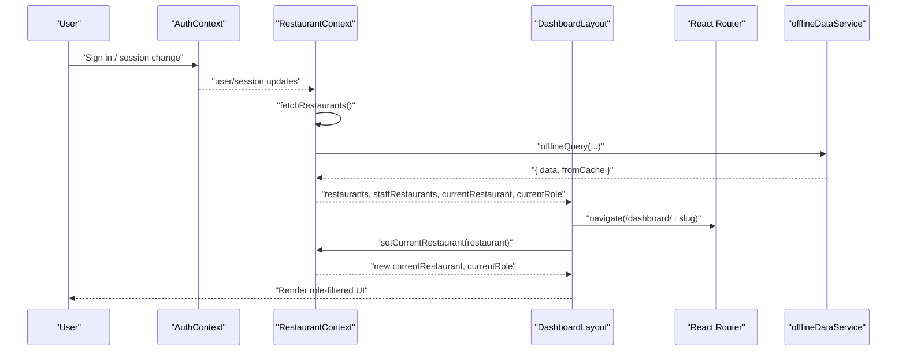
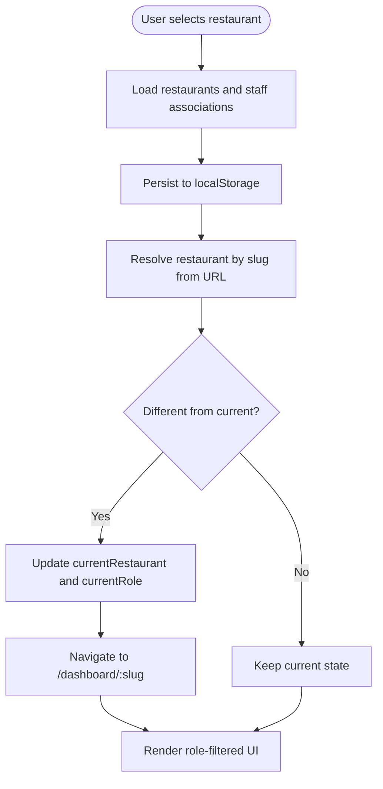
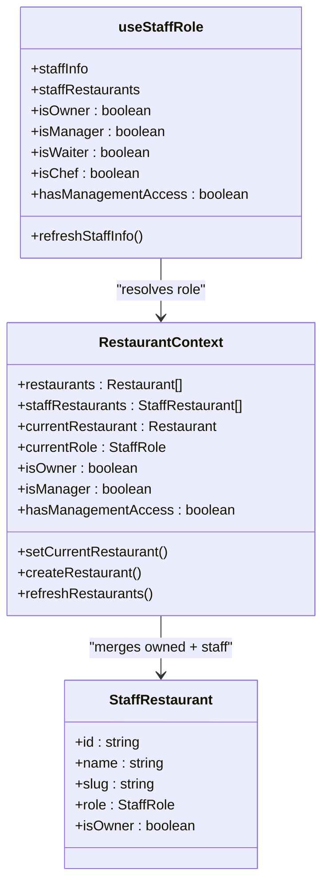
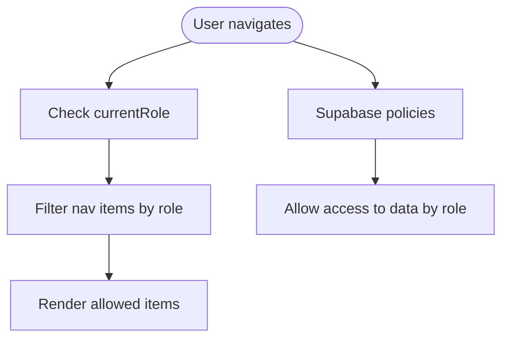
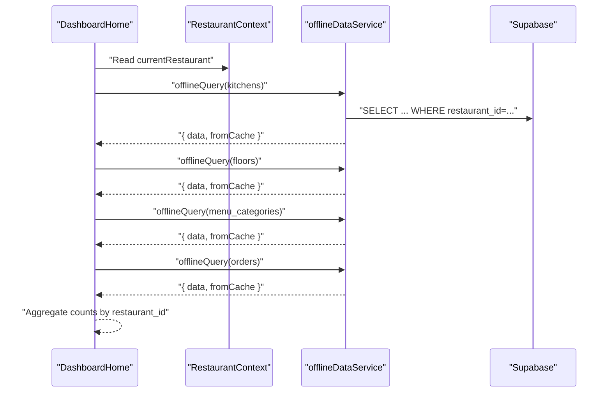
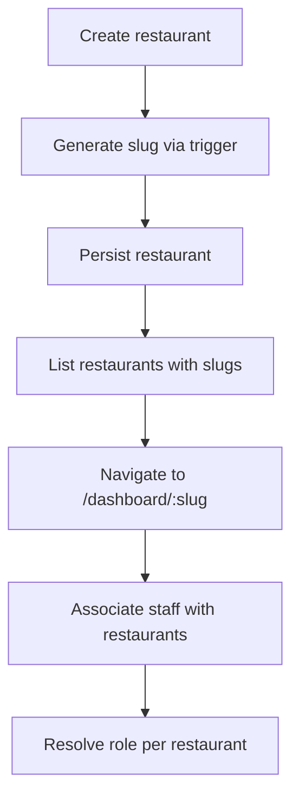
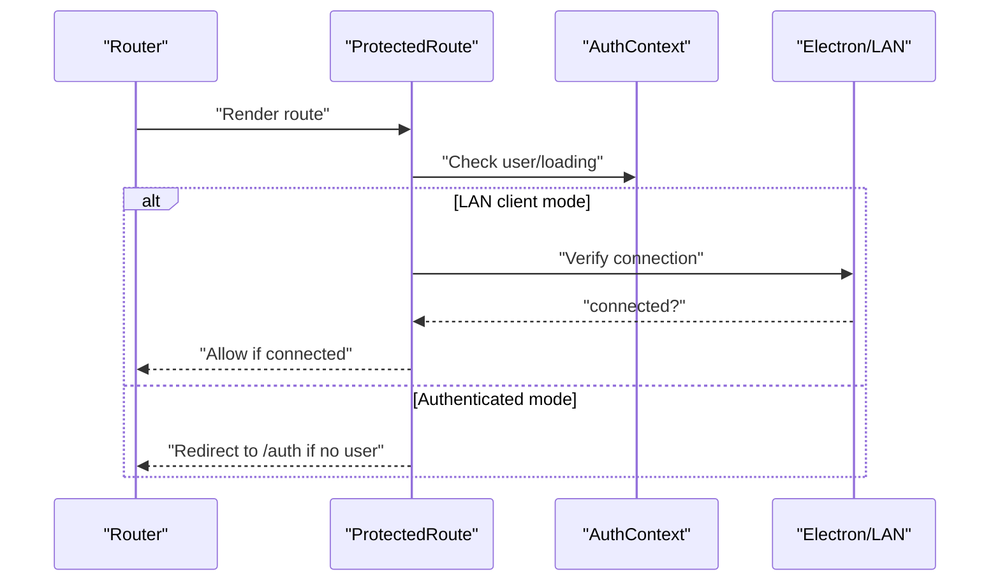
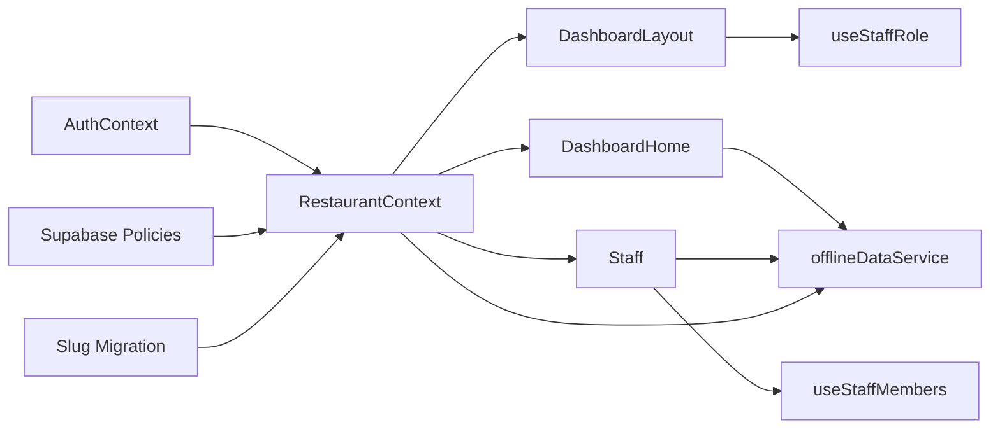

# Restaurant Context

<cite>
**Referenced Files in This Document**
- [RestaurantContext.tsx](file://src/contexts/RestaurantContext.tsx)
- [AuthContext.tsx](file://src/contexts/AuthContext.tsx)
- [useStaffRole.ts](file://src/hooks/useStaffRole.ts)
- [useStaffMembers.ts](file://src/hooks/useStaffMembers.ts)
- [ProtectedRoute.tsx](file://src/components/ProtectedRoute.tsx)
- [App.tsx](file://src/App.tsx)
- [DashboardLayout.tsx](file://src/components/layout/DashboardLayout.tsx)
- [DashboardHome.tsx](file://src/pages/dashboard/DashboardHome.tsx)
- [Staff.tsx](file://src/pages/dashboard/Staff.tsx)
- [offlineDataService.ts](file://src/services/offlineDataService.ts)
- [20251206062448_4e2d7da9-9519-48ae-9d6c-bb1c994ed84a.sql](file://supabase/migrations/20251206062448_4e2d7da9-9519-48ae-9d6c-bb1c994ed84a.sql)
- [20251206133955_231d3ef6-16e8-41de-8662-8dc09a54c6e3.sql](file://supabase/migrations/20251206133955_231d3ef6-16e8-41de-8662-8dc09a54c6e3.sql)
</cite>

## Table of Contents
1. [Introduction](#introduction)
2. [Project Structure](#project-structure)
3. [Core Components](#core-components)
4. [Architecture Overview](#architecture-overview)
5. [Detailed Component Analysis](#detailed-component-analysis)
6. [Dependency Analysis](#dependency-analysis)
7. [Performance Considerations](#performance-considerations)
8. [Troubleshooting Guide](#troubleshooting-guide)
9. [Conclusion](#conclusion)

## Introduction
This document explains the restaurant context system that powers multi-restaurant operations in the application. It covers how restaurants are selected and switched, how staff membership and roles are handled, and how role-based access control is enforced. It also documents slug-based navigation, staff restaurant associations, restaurant-aware components, permission-checking patterns, restaurant-specific data filtering, state synchronization, caching, and performance optimizations for multi-restaurant environments. Finally, it describes the integration with authentication and the navigation system.

## Project Structure
The restaurant context system spans several layers:
- Context providers for authentication and restaurant state
- Hooks for staff roles and staff data
- Layout and routing components that enforce slug-based navigation and role visibility
- Offline data service enabling offline-first operations across restaurants
- Supabase policies and migrations supporting staff-role-based access and restaurant slugs

```mermaid
graph TB
subgraph "Providers"
Auth["AuthContext"]
Resto["RestaurantContext"]
end
subgraph "UI Layer"
Layout["DashboardLayout"]
Home["DashboardHome"]
Staff["Staff"]
Protected["ProtectedRoute"]
end
subgraph "Hooks"
RoleHook["useStaffRole"]
StaffHook["useStaffMembers"]
end
subgraph "Offline"
Offline["offlineDataService"]
end
subgraph "Supabase"
Migrations["Migrations<br/>restaurants.slug<br/>security functions"]
Policies["Policies<br/>staff access"]
end
Auth --> Resto
Resto --> Layout
Layout --> Home
Layout --> Staff
Layout --> Protected
Layout --> RoleHook
Staff --> StaffHook
Home --> Offline
Staff --> Offline
Resto --> Offline
Auth --> Policies
Resto --> Migrations
```

**Diagram sources**
- [RestaurantContext.tsx:47-382](file://src/contexts/RestaurantContext.tsx#L47-L382)
- [AuthContext.tsx:39-132](file://src/contexts/AuthContext.tsx#L39-L132)
- [DashboardLayout.tsx:75-402](file://src/components/layout/DashboardLayout.tsx#L75-L402)
- [DashboardHome.tsx:27-345](file://src/pages/dashboard/DashboardHome.tsx#L27-L345)
- [Staff.tsx:15-205](file://src/pages/dashboard/Staff.tsx#L15-L205)
- [useStaffRole.ts:29-134](file://src/hooks/useStaffRole.ts#L29-L134)
- [useStaffMembers.ts:36-143](file://src/hooks/useStaffMembers.ts#L36-L143)
- [offlineDataService.ts:151-211](file://src/services/offlineDataService.ts#L151-L211)
- [20251206062448_4e2d7da9-9519-48ae-9d6c-bb1c994ed84a.sql:1-64](file://supabase/migrations/20251206062448_4e2d7da9-9519-48ae-9d6c-bb1c994ed84a.sql#L1-L64)
- [20251206133955_231d3ef6-16e8-41de-8662-8dc09a54c6e3.sql:1-63](file://supabase/migrations/20251206133955_231d3ef6-16e8-41de-8662-8dc09a54c6e3.sql#L1-L63)

**Section sources**
- [RestaurantContext.tsx:47-382](file://src/contexts/RestaurantContext.tsx#L47-L382)
- [AuthContext.tsx:39-132](file://src/contexts/AuthContext.tsx#L39-L132)
- [DashboardLayout.tsx:75-402](file://src/components/layout/DashboardLayout.tsx#L75-L402)
- [App.tsx:108-147](file://src/App.tsx#L108-L147)
- [offlineDataService.ts:151-211](file://src/services/offlineDataService.ts#L151-L211)

## Core Components
- RestaurantContext: Central state for restaurants, staff restaurants, current restaurant, and current role. Handles creation, switching, and restoration from storage.
- AuthContext: Authentication state and session lifecycle, including offline caching and sync initialization.
- useStaffRole: Per-user staff role and restaurant associations, with helpers to resolve role for a specific restaurant.
- useStaffMembers: Restaurant-scoped staff and shift management with offline-first queries.
- DashboardLayout: Slug-based navigation, restaurant switching, role-filtered navigation, and sync status.
- offlineDataService: Offline-first data access with SQLite caching, LAN mode, and manual sync controls.

**Section sources**
- [RestaurantContext.tsx:31-43](file://src/contexts/RestaurantContext.tsx#L31-L43)
- [AuthContext.tsx:28-35](file://src/contexts/AuthContext.tsx#L28-L35)
- [useStaffRole.ts:17-27](file://src/hooks/useStaffRole.ts#L17-L27)
- [useStaffMembers.ts:6-21](file://src/hooks/useStaffMembers.ts#L6-L21)
- [DashboardLayout.tsx:58-73](file://src/components/layout/DashboardLayout.tsx#L58-L73)
- [offlineDataService.ts:151-211](file://src/services/offlineDataService.ts#L151-L211)

## Architecture Overview
The system integrates authentication, restaurant selection, role resolution, and navigation with robust offline capabilities.



**Diagram sources**
- [AuthContext.tsx:44-97](file://src/contexts/AuthContext.tsx#L44-L97)
- [RestaurantContext.tsx:78-284](file://src/contexts/RestaurantContext.tsx#L78-L284)
- [DashboardLayout.tsx:127-167](file://src/components/layout/DashboardLayout.tsx#L127-L167)
- [offlineDataService.ts:151-211](file://src/services/offlineDataService.ts#L151-L211)

## Detailed Component Analysis

### Restaurant Selection and Switching
- Restaurant discovery: Owned restaurants and staff-associated restaurants are fetched and merged. Role is resolved per restaurant.
- Current restaurant persistence: Local storage persists the selected restaurant and role to restore state when offline or without a user.
- Slug-based navigation: The layout extracts the slug from the URL, resolves the restaurant, and switches context accordingly. It also redirects from bare `/dashboard` to `/dashboard/:slug`.
- Restaurant switching: Changing the restaurant triggers a navigation update to keep the user on the same logical page under the new slug.



**Diagram sources**
- [RestaurantContext.tsx:78-136](file://src/contexts/RestaurantContext.tsx#L78-L136)
- [DashboardLayout.tsx:127-167](file://src/components/layout/DashboardLayout.tsx#L127-L167)

**Section sources**
- [RestaurantContext.tsx:55-76](file://src/contexts/RestaurantContext.tsx#L55-L76)
- [DashboardLayout.tsx:127-167](file://src/components/layout/DashboardLayout.tsx#L127-L167)
- [App.tsx:122-137](file://src/App.tsx#L122-L137)

### Staff Membership and Role Resolution
- Staff role resolution: The context determines the current role based on either ownership (owner) or staff association (manager/waiter/chef).
- Staff role hook: Provides per-user staff info, associated restaurants with roles, and helpers to resolve role for a given restaurant.
- Role-based UI: Navigation items are filtered by the current role.



**Diagram sources**
- [RestaurantContext.tsx:13-43](file://src/contexts/RestaurantContext.tsx#L13-L43)
- [useStaffRole.ts:29-134](file://src/hooks/useStaffRole.ts#L29-L134)

**Section sources**
- [RestaurantContext.tsx:286-296](file://src/contexts/RestaurantContext.tsx#L286-L296)
- [useStaffRole.ts:121-133](file://src/hooks/useStaffRole.ts#L121-L133)
- [DashboardLayout.tsx:169-175](file://src/components/layout/DashboardLayout.tsx#L169-L175)

### Role-Based Access Control (RBAC)
- Navigation filtering: Only items appropriate for the current role are shown.
- Policy-backed access: Supabase policies restrict staff access to restaurants and enable automatic account linking based on email.



**Diagram sources**
- [DashboardLayout.tsx:58-73](file://src/components/layout/DashboardLayout.tsx#L58-L73)
- [DashboardLayout.tsx:169-175](file://src/components/layout/DashboardLayout.tsx#L169-L175)
- [20251206133955_231d3ef6-16e8-41de-8662-8dc09a54c6e3.sql:48-63](file://supabase/migrations/20251206133955_231d3ef6-16e8-41de-8662-8dc09a54c6e3.sql#L48-L63)

**Section sources**
- [DashboardLayout.tsx:58-73](file://src/components/layout/DashboardLayout.tsx#L58-L73)
- [20251206133955_231d3ef6-16e8-41de-8662-8dc09a54c6e3.sql:48-63](file://supabase/migrations/20251206133955_231d3ef6-16e8-41de-8662-8dc09a54c6e3.sql#L48-L63)

### Restaurant-Aware Components and Data Filtering
- DashboardHome: Queries kitchen, floor, menu category, and order counts scoped to the current restaurant using offline-aware queries.
- Staff page: Uses restaurant-scoped hooks to list and manage staff and shifts.
- Permission patterns: Components read currentRestaurant and currentRole to decide visibility and actions.



**Diagram sources**
- [DashboardHome.tsx:38-142](file://src/pages/dashboard/DashboardHome.tsx#L38-L142)
- [offlineDataService.ts:151-211](file://src/services/offlineDataService.ts#L151-L211)

**Section sources**
- [DashboardHome.tsx:38-142](file://src/pages/dashboard/DashboardHome.tsx#L38-L142)
- [Staff.tsx:15-205](file://src/pages/dashboard/Staff.tsx#L15-L205)

### Slug-Based Navigation and Restaurant Associations
- Slug generation: Restaurants have unique slugs generated from names and enforced by database triggers.
- Navigation: All dashboard routes are parameterized by slug; the layout enforces slug presence and updates URLs on restaurant change.
- Staff restaurant associations: Staff members can belong to multiple restaurants with distinct roles.



**Diagram sources**
- [20251206062448_4e2d7da9-9519-48ae-9d6c-bb1c994ed84a.sql:1-64](file://supabase/migrations/20251206062448_4e2d7da9-9519-48ae-9d6c-bb1c994ed84a.sql#L1-L64)
- [App.tsx:122-137](file://src/App.tsx#L122-L137)
- [DashboardLayout.tsx:127-167](file://src/components/layout/DashboardLayout.tsx#L127-L167)

**Section sources**
- [20251206062448_4e2d7da9-9519-48ae-9d6c-bb1c994ed84a.sql:1-64](file://supabase/migrations/20251206062448_4e2d7da9-9519-48ae-9d6c-bb1c994ed84a.sql#L1-L64)
- [App.tsx:122-137](file://src/App.tsx#L122-L137)
- [DashboardLayout.tsx:127-167](file://src/components/layout/DashboardLayout.tsx#L127-L167)

### Authentication Integration and Protected Routes
- ProtectedRoute: Allows access in LAN client mode without requiring authentication; otherwise requires a valid user session.
- AuthContext: Manages session state, caches user for offline use, and initializes/stops sync based on auth events.



**Diagram sources**
- [ProtectedRoute.tsx:9-59](file://src/components/ProtectedRoute.tsx#L9-L59)
- [AuthContext.tsx:44-97](file://src/contexts/AuthContext.tsx#L44-L97)

**Section sources**
- [ProtectedRoute.tsx:9-59](file://src/components/ProtectedRoute.tsx#L9-L59)
- [AuthContext.tsx:44-97](file://src/contexts/AuthContext.tsx#L44-L97)

## Dependency Analysis
- RestaurantContext depends on AuthContext for user/session signals and on offlineDataService for offline-first queries.
- DashboardLayout depends on RestaurantContext for current restaurant and role, and on offlineDataService for connectivity and sync status.
- useStaffMembers and useStaffRole depend on Supabase and AuthContext for staff data and user identity.
- Supabase policies and migrations define backend constraints for staff-role access and slug generation.



**Diagram sources**
- [RestaurantContext.tsx:47-382](file://src/contexts/RestaurantContext.tsx#L47-L382)
- [DashboardLayout.tsx:75-402](file://src/components/layout/DashboardLayout.tsx#L75-L402)
- [DashboardHome.tsx:27-345](file://src/pages/dashboard/DashboardHome.tsx#L27-L345)
- [Staff.tsx:15-205](file://src/pages/dashboard/Staff.tsx#L15-L205)
- [useStaffRole.ts:29-134](file://src/hooks/useStaffRole.ts#L29-L134)
- [useStaffMembers.ts:36-143](file://src/hooks/useStaffMembers.ts#L36-L143)
- [offlineDataService.ts:151-211](file://src/services/offlineDataService.ts#L151-L211)
- [20251206133955_231d3ef6-16e8-41de-8662-8dc09a54c6e3.sql:48-63](file://supabase/migrations/20251206133955_231d3ef6-16e8-41de-8662-8dc09a54c6e3.sql#L48-L63)
- [20251206062448_4e2d7da9-9519-48ae-9d6c-bb1c994ed84a.sql:1-64](file://supabase/migrations/20251206062448_4e2d7da9-9519-48ae-9d6c-bb1c994ed84a.sql#L1-L64)

**Section sources**
- [RestaurantContext.tsx:47-382](file://src/contexts/RestaurantContext.tsx#L47-L382)
- [DashboardLayout.tsx:75-402](file://src/components/layout/DashboardLayout.tsx#L75-L402)
- [offlineDataService.ts:151-211](file://src/services/offlineDataService.ts#L151-L211)

## Performance Considerations
- Offline-first queries: All restaurant-scoped queries leverage offlineDataService to minimize network latency and enable offline operation.
- LAN mode: When available, queries are served from the LAN server, reducing cloud dependency.
- SQLite caching: Electron mode caches data locally; queries return from SQLite first, ensuring responsiveness.
- Batched queries: Dashboard statistics aggregate multiple counts efficiently using concurrent requests.
- Role filtering: Navigation items are filtered client-side based on current role, avoiding unnecessary renders.

[No sources needed since this section provides general guidance]

## Troubleshooting Guide
- No restaurant selected: DashboardHome displays a prompt to create a restaurant when currentRestaurant is null.
- Role mismatches: Ensure staff records are linked to the user’s email; the system attempts to link accounts automatically on auth state changes.
- Offline mode: Verify offlineDataService connectivity and pending sync counts; use manual sync to upload changes when online.
- LAN mode: Confirm LAN client connection status and that the LAN server is reachable.

**Section sources**
- [DashboardHome.tsx:144-159](file://src/pages/dashboard/DashboardHome.tsx#L144-L159)
- [RestaurantContext.tsx:138-157](file://src/contexts/RestaurantContext.tsx#L138-L157)
- [DashboardLayout.tsx:87-125](file://src/components/layout/DashboardLayout.tsx#L87-L125)
- [offlineDataService.ts:397-541](file://src/services/offlineDataService.ts#L397-L541)

## Conclusion
The restaurant context system provides a robust foundation for multi-restaurant operations with seamless authentication integration, role-based access control, and offline-first data handling. Slug-based navigation ensures consistent routing, while hooks and components encapsulate restaurant-aware logic. The combination of Supabase policies, migrations, and offline services delivers a reliable, scalable solution for diverse deployment scenarios.