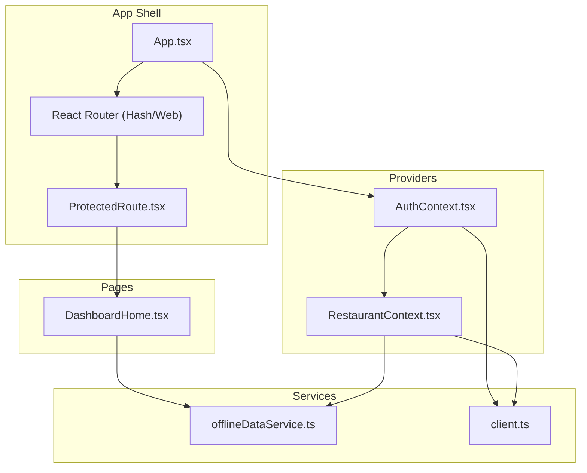
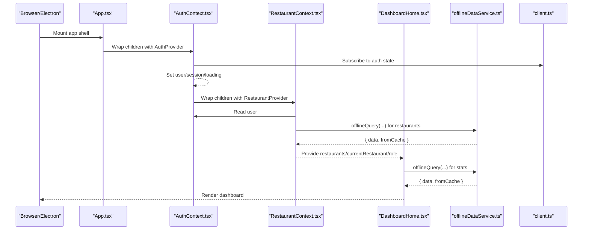
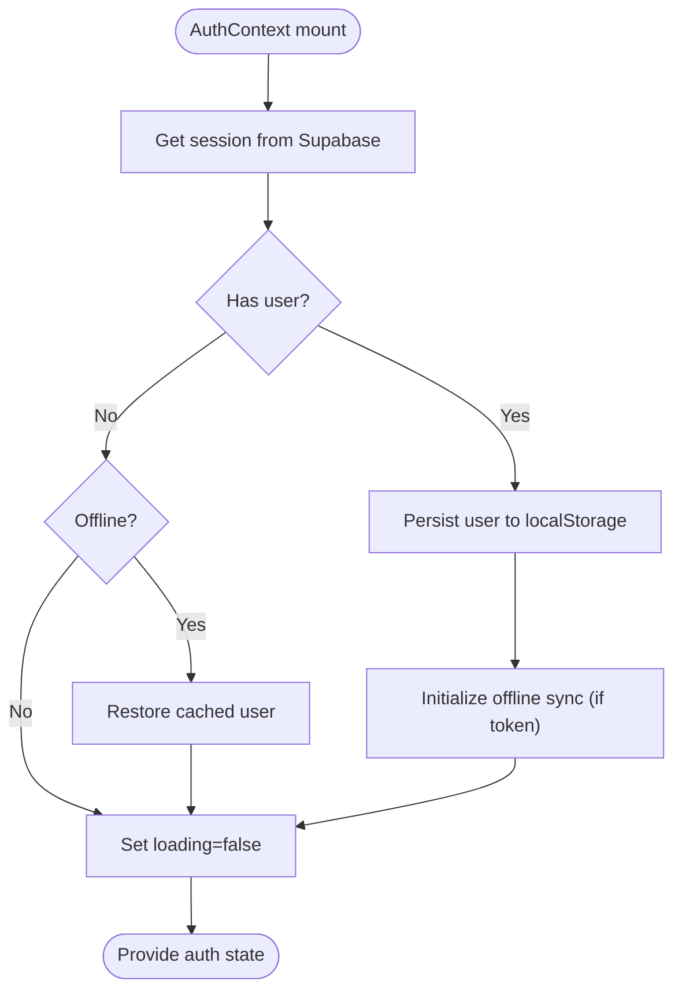
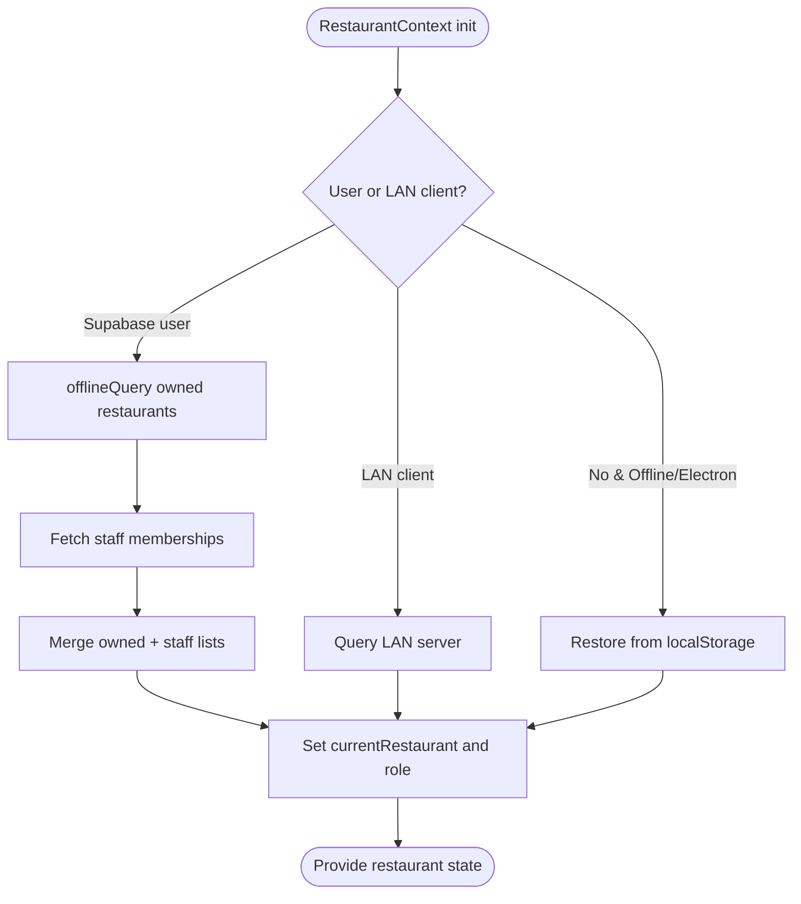
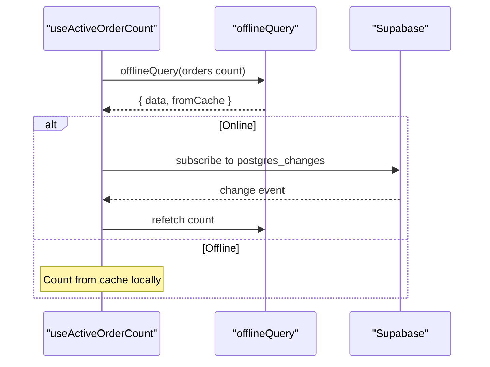
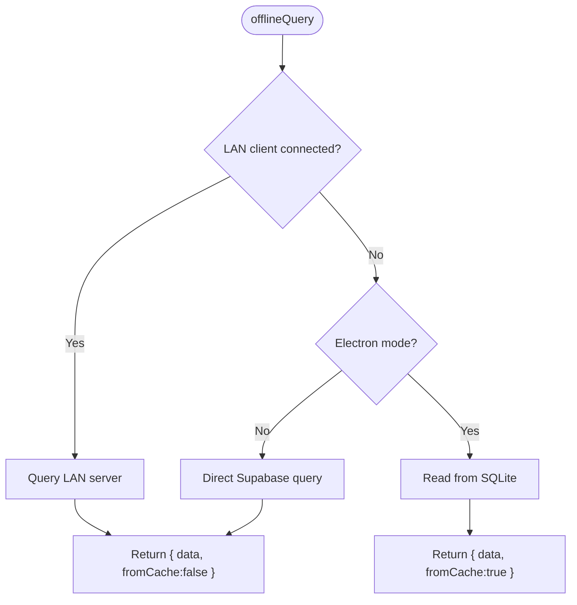
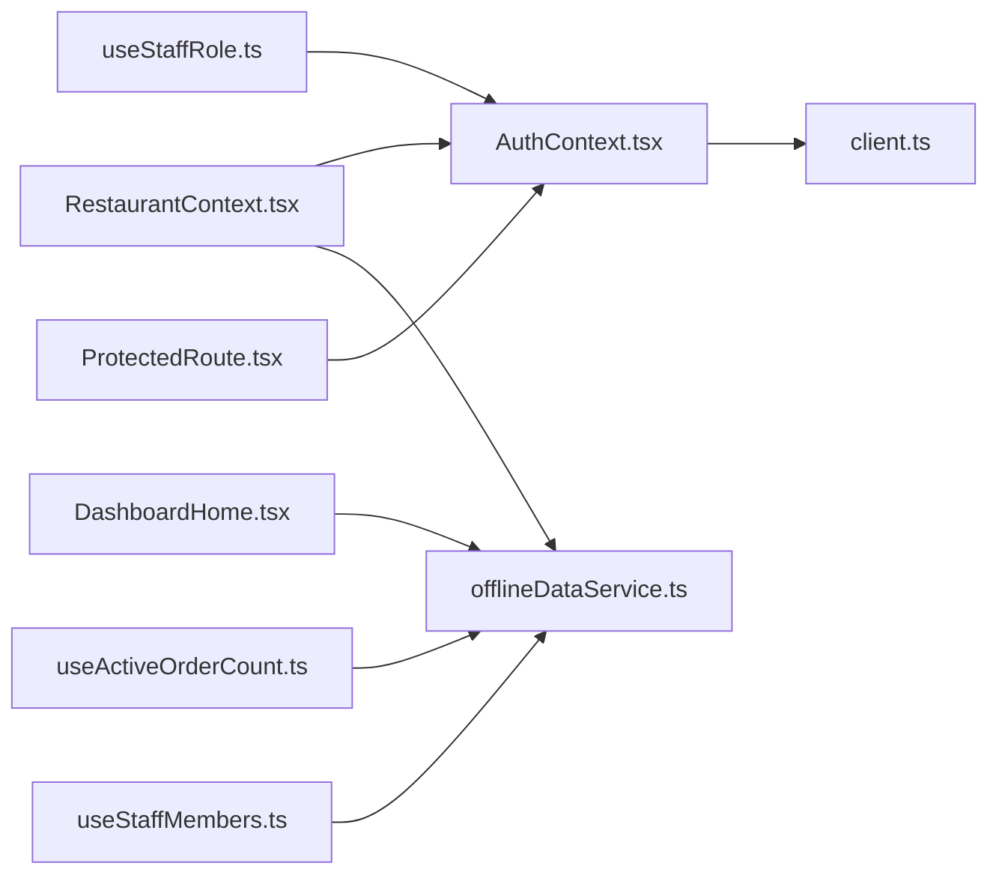

# State Management & Contexts

<cite>
**Referenced Files in This Document**
- [AuthContext.tsx](file://src/contexts/AuthContext.tsx)
- [RestaurantContext.tsx](file://src/contexts/RestaurantContext.tsx)
- [App.tsx](file://src/App.tsx)
- [ProtectedRoute.tsx](file://src/components/ProtectedRoute.tsx)
- [offlineDataService.ts](file://src/services/offlineDataService.ts)
- [client.ts](file://src/integrations/supabase/client.ts)
- [DashboardHome.tsx](file://src/pages/dashboard/DashboardHome.tsx)
- [useActiveOrderCount.ts](file://src/hooks/useActiveOrderCount.ts)
- [useStaffMembers.ts](file://src/hooks/useStaffMembers.ts)
- [useStaffRole.ts](file://src/hooks/useStaffRole.ts)
- [use-toast.ts](file://src/hooks/use-toast.ts)
- [use-mobile.tsx](file://src/hooks/use-mobile.tsx)
- [package.json](file://package.json)
</cite>

## Table of Contents
1. [Introduction](#introduction)
2. [Project Structure](#project-structure)
3. [Core Components](#core-components)
4. [Architecture Overview](#architecture-overview)
5. [Detailed Component Analysis](#detailed-component-analysis)
6. [Dependency Analysis](#dependency-analysis)
7. [Performance Considerations](#performance-considerations)
8. [Troubleshooting Guide](#troubleshooting-guide)
9. [Conclusion](#conclusion)
10. [Appendices](#appendices)

## Introduction
This document explains the state management architecture of TableFlow Pro, focusing on the context provider model, global state patterns, local versus global state strategies, authentication and restaurant contexts, custom hooks, persistence and caching, performance optimizations, and integration between providers. It also covers debugging, testing strategies, and migration approaches for evolving state management.

## Project Structure
TableFlow Pro organizes state around two primary context providers:
- Authentication context: manages user session, sign-up/sign-in/sign-out, and offline-aware caching.
- Restaurant context: manages restaurants, roles, current selection, and offline-first data access.

These contexts are layered inside the application shell and protected routing. Supporting services provide offline-first data access and synchronization for Electron/LAN modes.

**Diagram sources**
- [App.tsx:111-144](file://src/App.tsx#L111-L144)
- [AuthContext.tsx:39-132](file://src/contexts/AuthContext.tsx#L39-L132)
- [RestaurantContext.tsx:47-382](file://src/contexts/RestaurantContext.tsx#L47-L382)
- [ProtectedRoute.tsx:9-59](file://src/components/ProtectedRoute.tsx#L9-L59)
- [DashboardHome.tsx:27-142](file://src/pages/dashboard/DashboardHome.tsx#L27-L142)
- [offlineDataService.ts:151-211](file://src/services/offlineDataService.ts#L151-L211)
- [client.ts:11-17](file://src/integrations/supabase/client.ts#L11-L17)

**Section sources**
- [App.tsx:111-144](file://src/App.tsx#L111-L144)
- [AuthContext.tsx:39-132](file://src/contexts/AuthContext.tsx#L39-L132)
- [RestaurantContext.tsx:47-382](file://src/contexts/RestaurantContext.tsx#L47-L382)
- [ProtectedRoute.tsx:9-59](file://src/components/ProtectedRoute.tsx#L9-L59)
- [DashboardHome.tsx:27-142](file://src/pages/dashboard/DashboardHome.tsx#L27-L142)
- [offlineDataService.ts:151-211](file://src/services/offlineDataService.ts#L151-L211)
- [client.ts:11-17](file://src/integrations/supabase/client.ts#L11-L17)

## Core Components
- Authentication Context
  - Manages user/session/loading state, sign-up/sign-in/sign-out actions, and offline-aware behavior.
  - Persists user to localStorage for offline use and integrates with the offline sync engine.
  - Subscribes to Supabase auth state changes and conditionally restores cached user when offline.

- Restaurant Context
  - Loads restaurants and staff memberships, sets current restaurant and role, and persists selections to localStorage.
  - Supports LAN client mode, Electron local mode, and web mode with offlineQuery/offlineMutate.
  - Handles restoration from localStorage and cached data when offline or no user.

- Custom Hooks
  - useActiveOrderCount: counts active orders with offlineQuery and real-time updates via Supabase channels.
  - useStaffMembers/useShifts: CRUD operations for staff and shifts with offlineQuery and toast feedback.
  - useStaffRole/useStaffRoleForRestaurant: resolves staff role and permissions across restaurants.

- Offline Data Service
  - Provides offlineQuery/offlineMutate/offlineDelete with SQLite-first logic in Electron/LAN modes.
  - Manages connectivity state, manual sync, and data download/clear utilities.

- ProtectedRoute
  - Guards routes using auth state and LAN client connectivity checks.

**Section sources**
- [AuthContext.tsx:28-141](file://src/contexts/AuthContext.tsx#L28-L141)
- [RestaurantContext.tsx:31-391](file://src/contexts/RestaurantContext.tsx#L31-L391)
- [useActiveOrderCount.ts:5-76](file://src/hooks/useActiveOrderCount.ts#L5-L76)
- [useStaffMembers.ts:36-143](file://src/hooks/useStaffMembers.ts#L36-L143)
- [useStaffRole.ts:29-134](file://src/hooks/useStaffRole.ts#L29-L134)
- [offlineDataService.ts:26-47](file://src/services/offlineDataService.ts#L26-L47)
- [ProtectedRoute.tsx:9-59](file://src/components/ProtectedRoute.tsx#L9-L59)

## Architecture Overview
The app initializes providers at the top level and composes them to deliver global state to pages. Authentication drives session state and triggers offline sync initialization. Restaurant context depends on auth state and exposes current restaurant and role to downstream components. Pages use offline-aware queries and hooks to render data efficiently.

**Diagram sources**
- [App.tsx:111-144](file://src/App.tsx#L111-L144)
- [AuthContext.tsx:44-97](file://src/contexts/AuthContext.tsx#L44-L97)
- [RestaurantContext.tsx:78-284](file://src/contexts/RestaurantContext.tsx#L78-L284)
- [DashboardHome.tsx:38-142](file://src/pages/dashboard/DashboardHome.tsx#L38-L142)
- [offlineDataService.ts:151-211](file://src/services/offlineDataService.ts#L151-L211)
- [client.ts:11-17](file://src/integrations/supabase/client.ts#L11-L17)

## Detailed Component Analysis

### Authentication Context
- Responsibilities
  - Manage user/session/loading lifecycle.
  - Expose sign-up/sign-in/sign-out functions.
  - Persist user to localStorage for offline use and restore on startup.
  - Initialize/stop offline sync engine based on session presence.

- Offline-awareness
  - On null session while offline, restores cached user to maintain UX continuity.
  - Clears cached user on explicit sign-out.

- Provider composition
  - Wrapped by App.tsx and consumed by RestaurantContext.

**Diagram sources**
- [AuthContext.tsx:79-97](file://src/contexts/AuthContext.tsx#L79-L97)
- [AuthContext.tsx:44-77](file://src/contexts/AuthContext.tsx#L44-L77)

**Section sources**
- [AuthContext.tsx:28-141](file://src/contexts/AuthContext.tsx#L28-L141)

### Restaurant Context
- Responsibilities
  - Fetch owned restaurants and staff memberships with offline fallback.
  - Persist current restaurant and role to localStorage.
  - Support LAN client mode by querying LAN server.
  - Derive role flags (owner/manager) and expose creation/refresh helpers.

- Offline-first strategy
  - Uses offlineQuery to fetch data; falls back to localStorage when offline or no user.
  - On LAN mode, queries LAN server and maps results to staff restaurants with manager role.

- Role resolution
  - Updates current role based on currentRestaurant membership or ownership.

**Diagram sources**
- [RestaurantContext.tsx:78-284](file://src/contexts/RestaurantContext.tsx#L78-L284)

**Section sources**
- [RestaurantContext.tsx:31-391](file://src/contexts/RestaurantContext.tsx#L31-L391)

### Custom Hooks
- useActiveOrderCount
  - Counts orders with status “pending” or “cooking” using offlineQuery.
  - Subscribes to Supabase postgres_changes to refresh on changes (skips when offline).
  - Recounts when online to ensure accuracy.

- useStaffMembers/useShifts
  - Fetches lists with offlineQuery and orders consistently.
  - Provides add/update/delete functions backed by Supabase with immediate refresh.
  - Uses toast for error feedback.

- useStaffRole/useStaffRoleForRestaurant
  - Resolves staff info and restaurant-role mapping for the current user.
  - Provides role flags and a restaurant-specific hook to resolve role.

**Diagram sources**
- [useActiveOrderCount.ts:14-72](file://src/hooks/useActiveOrderCount.ts#L14-L72)
- [offlineDataService.ts:151-211](file://src/services/offlineDataService.ts#L151-L211)

**Section sources**
- [useActiveOrderCount.ts:5-76](file://src/hooks/useActiveOrderCount.ts#L5-L76)
- [useStaffMembers.ts:36-143](file://src/hooks/useStaffMembers.ts#L36-L143)
- [useStaffRole.ts:29-134](file://src/hooks/useStaffRole.ts#L29-L134)

### ProtectedRoute
- Ensures authenticated access except when LAN client is connected.
- Checks LAN client status and allows route rendering without auth in that mode.
- Displays a loader while checking auth and LAN status.

**Section sources**
- [ProtectedRoute.tsx:9-59](file://src/components/ProtectedRoute.tsx#L9-L59)

### Offline Data Service
- Connectivity state
  - Tracks online/offline and notifies listeners.
- offlineQuery
  - SQLite-first in Electron/LAN; LAN server query when connected; direct Supabase on web.
  - Returns fromCache flag to guide UI behavior.
- offlineMutate/offlineDelete
  - Writes to SQLite in Electron/LAN; marks pending_sync/pending_delete; avoids auto-cloud sync.
- Sync management
  - initializeSync/stopSync/forceSyncPush for Electron sync engine.
  - manualSyncToCloud uploads pending changes respecting constraints and dependency order.
- Utilities
  - downloadAllDataFromCloud clears and downloads data for offline use.
  - clearAllLocalData removes all local records.
  - debugDumpSQLiteData prints SQLite contents for diagnostics.

**Diagram sources**
- [offlineDataService.ts:151-211](file://src/services/offlineDataService.ts#L151-L211)
- [offlineDataService.ts:220-287](file://src/services/offlineDataService.ts#L220-L287)
- [offlineDataService.ts:351-372](file://src/services/offlineDataService.ts#L351-L372)

**Section sources**
- [offlineDataService.ts:26-47](file://src/services/offlineDataService.ts#L26-L47)
- [offlineDataService.ts:151-211](file://src/services/offlineDataService.ts#L151-L211)
- [offlineDataService.ts:220-287](file://src/services/offlineDataService.ts#L220-L287)
- [offlineDataService.ts:351-372](file://src/services/offlineDataService.ts#L351-L372)

## Dependency Analysis
- Providers depend on Supabase client for auth and data operations.
- Restaurant context depends on auth context for user identity.
- Pages depend on contexts and hooks for data and actions.
- Offline service encapsulates platform-specific logic (Electron/LAN/web).
- ProtectedRoute depends on auth and LAN client status.

**Diagram sources**
- [AuthContext.tsx:3-4](file://src/contexts/AuthContext.tsx#L3-L4)
- [RestaurantContext.tsx:2-3](file://src/contexts/RestaurantContext.tsx#L2-L3)
- [DashboardHome.tsx:3-4](file://src/pages/dashboard/DashboardHome.tsx#L3-L4)
- [useActiveOrderCount.ts:2-3](file://src/hooks/useActiveOrderCount.ts#L2-L3)
- [useStaffMembers.ts:2-3](file://src/hooks/useStaffMembers.ts#L2-L3)
- [useStaffRole.ts:3](file://src/hooks/useStaffRole.ts#L3)
- [ProtectedRoute.tsx:1](file://src/components/ProtectedRoute.tsx#L1)

**Section sources**
- [AuthContext.tsx:3-4](file://src/contexts/AuthContext.tsx#L3-L4)
- [RestaurantContext.tsx:2-3](file://src/contexts/RestaurantContext.tsx#L2-L3)
- [DashboardHome.tsx:3-4](file://src/pages/dashboard/DashboardHome.tsx#L3-L4)
- [useActiveOrderCount.ts:2-3](file://src/hooks/useActiveOrderCount.ts#L2-L3)
- [useStaffMembers.ts:2-3](file://src/hooks/useStaffMembers.ts#L2-L3)
- [useStaffRole.ts:3](file://src/hooks/useStaffRole.ts#L3)
- [ProtectedRoute.tsx:1](file://src/components/ProtectedRoute.tsx#L1)

## Performance Considerations
- Offline-first queries
  - Use offlineQuery to minimize network latency and enable offline operation.
  - Prefer head queries with count for lightweight counts; re-count when necessary to ensure accuracy.

- Real-time subscriptions
  - Subscribe to Supabase postgres_changes only when online to avoid unnecessary overhead.
  - Keep subscriptions scoped to restaurantId to reduce payload.

- Memoization and callbacks
  - useCallback in hooks to prevent unnecessary re-renders when dependencies are unchanged.

- Batched requests
  - Use Promise.all for concurrent stats queries in pages to reduce total fetch time.

- Toast batching
  - Limit concurrent toasts to reduce DOM churn.

- Mobile responsiveness
  - useIsMobile hook enables responsive UI decisions without heavy computations.

**Section sources**
- [useActiveOrderCount.ts:50-72](file://src/hooks/useActiveOrderCount.ts#L50-L72)
- [DashboardHome.tsx:40-82](file://src/pages/dashboard/DashboardHome.tsx#L40-L82)
- [use-mobile.tsx:5-19](file://src/hooks/use-mobile.tsx#L5-L19)
- [use-toast.ts:5-7](file://src/hooks/use-toast.ts#L5-L7)

## Troubleshooting Guide
- Auth state not restoring offline
  - Verify cached user exists in localStorage and that offline flag is detected.
  - Confirm AuthContext handles null session while offline and restores cached user.

- Restaurant not selected after sign-in
  - Check RestaurantContext fetch flow and localStorage restoration.
  - Ensure setCurrentRestaurant persists to localStorage and role is derived from staff list or ownership.

- Stats show zero offline
  - Confirm offlineQuery returns fromCache and UI counts locally when applicable.
  - For Electron/LAN, verify SQLite has data or LAN server is reachable.

- Sync not pushing changes
  - Ensure initializeSync is called on session presence and stopSync on sign-out.
  - Use manualSyncToCloud to upload pending changes and inspect errors.

- LAN client not connecting
  - Verify LAN mode saved in localStorage and electronAPI.lan is available.
  - Check LAN server host/port and connectivity.

- Toast spam or not clearing
  - Respect TOAST_LIMIT and TOAST_REMOVE_DELAY; ensure dismiss is called on open change.

**Section sources**
- [AuthContext.tsx:44-77](file://src/contexts/AuthContext.tsx#L44-L77)
- [RestaurantContext.tsx:78-284](file://src/contexts/RestaurantContext.tsx#L78-L284)
- [offlineDataService.ts:351-372](file://src/services/offlineDataService.ts#L351-L372)
- [offlineDataService.ts:397-541](file://src/services/offlineDataService.ts#L397-L541)
- [ProtectedRoute.tsx:16-38](file://src/components/ProtectedRoute.tsx#L16-L38)
- [use-toast.ts:137-164](file://src/hooks/use-toast.ts#L137-L164)

## Conclusion
TableFlow Pro employs a layered context architecture with strong offline-first capabilities. Authentication and restaurant contexts provide global state, while custom hooks encapsulate domain-specific logic. The offline data service centralizes platform-specific behavior, enabling seamless operation across web, LAN, and Electron environments. Following the patterns documented here ensures predictable state updates, efficient performance, and robust error handling.

## Appendices

### Practical Examples and Patterns
- Context usage in a page
  - Consume currentRestaurant and stats via RestaurantContext and offlineQuery in a dashboard page.
  - Reference: [DashboardHome.tsx:27-142](file://src/pages/dashboard/DashboardHome.tsx#L27-L142)

- State update pattern with offline mutations
  - Use offlineMutate to write data; expect pendingSync in Electron/LAN.
  - Reference: [offlineDataService.ts:220-287](file://src/services/offlineDataService.ts#L220-L287)

- Component re-render optimization
  - Wrap data-fetching callbacks with useCallback to stabilize dependencies.
  - Reference: [useStaffMembers.ts:41-74](file://src/hooks/useStaffMembers.ts#L41-L74)

- Real-time updates
  - Subscribe to Supabase channels only when online; unsubscribe on cleanup.
  - Reference: [useActiveOrderCount.ts:50-72](file://src/hooks/useActiveOrderCount.ts#L50-L72)

### Testing Strategies
- Unit tests for hooks
  - Mock offlineQuery/offlineMutate to simulate online/offline scenarios.
  - Test role flags and loading states under various user/rest states.

- Integration tests for providers
  - Simulate auth state changes and verify RestaurantContext selection logic.
  - Validate LAN mode behavior with mocked electronAPI.lan.

- E2E tests for offline flows
  - Disable network, verify localStorage restoration and cached counts.
  - Trigger manual sync and assert pending count transitions.

### Migration Approaches
- From legacy context to new patterns
  - Extract shared logic into custom hooks to reduce context bloat.
  - Introduce offlineQuery wrappers incrementally to preserve existing components.

- Scaling contexts
  - Split RestaurantContext into smaller contexts (e.g., KitchenContext, MenuContext) as the app grows.
  - Centralize permission checks in a dedicated hook to avoid duplication.

- Versioning state
  - Add version fields to localStorage keys for breaking changes.
  - Gracefully migrate cached data during startup.

**Section sources**
- [useStaffMembers.ts:41-74](file://src/hooks/useStaffMembers.ts#L41-L74)
- [useActiveOrderCount.ts:50-72](file://src/hooks/useActiveOrderCount.ts#L50-L72)
- [offlineDataService.ts:151-211](file://src/services/offlineDataService.ts#L151-L211)