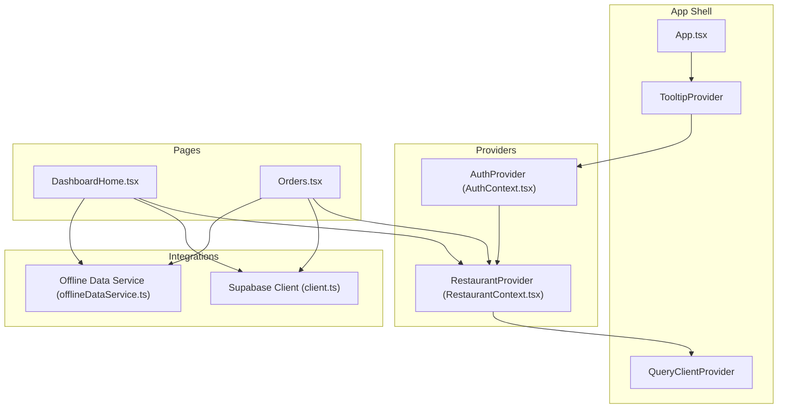
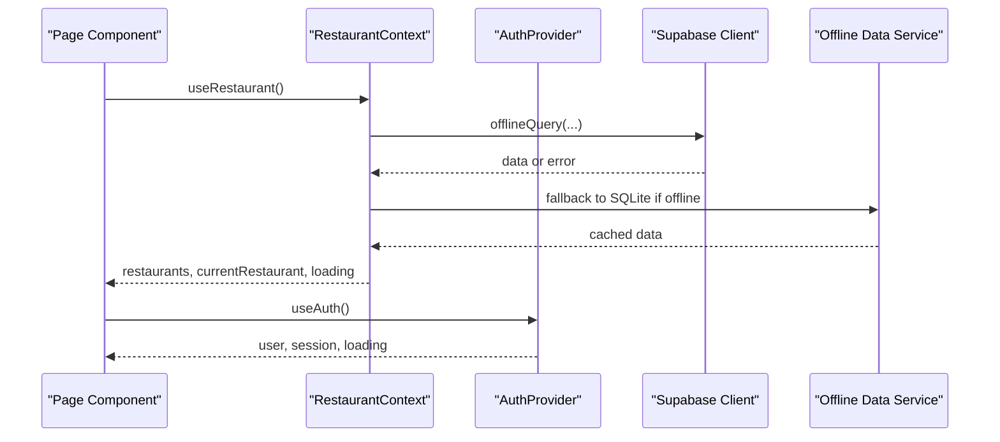
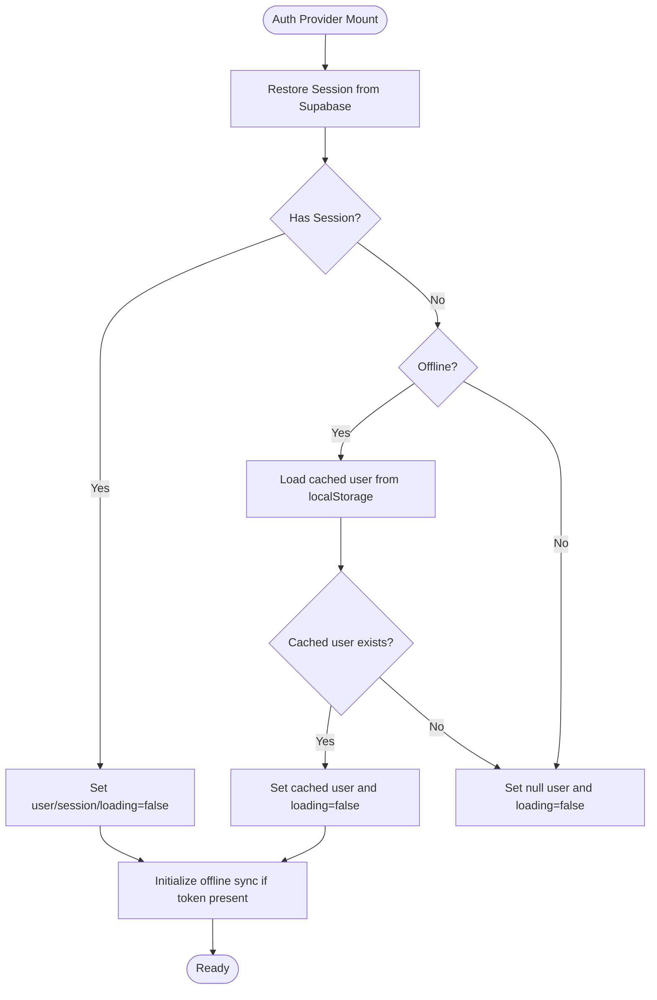
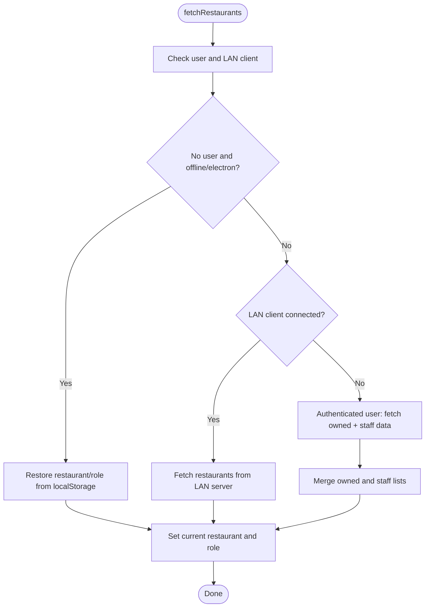
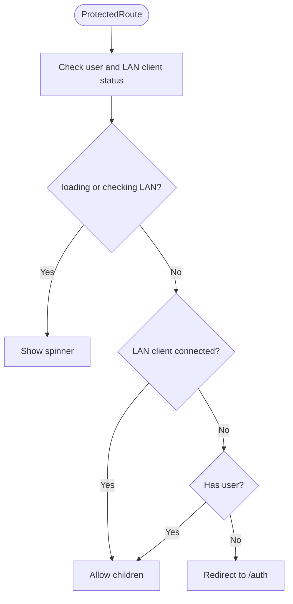
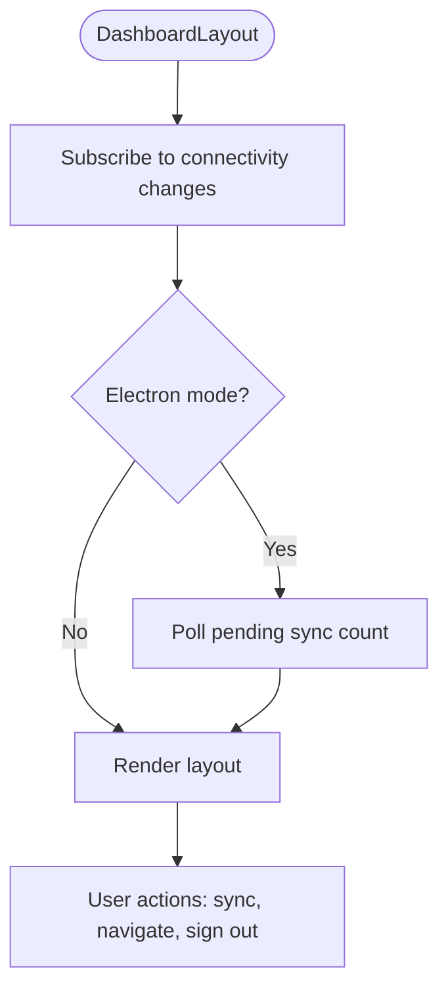
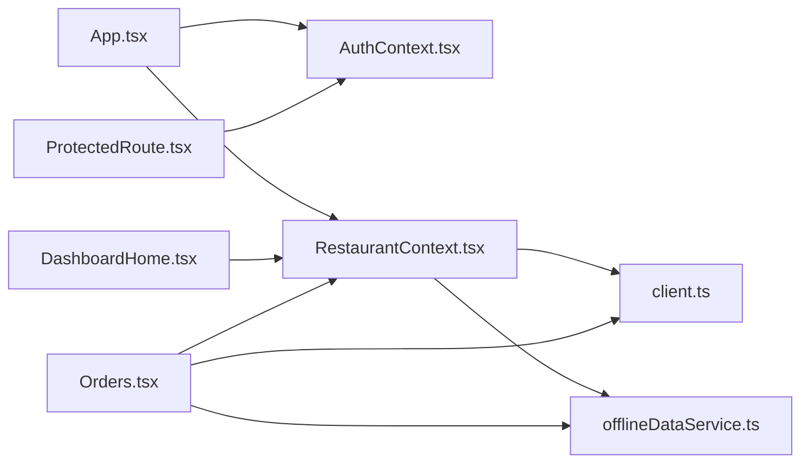

# State Management Patterns & Strategies

<cite>
**Referenced Files in This Document**
- [AuthContext.tsx](file://src/contexts/AuthContext.tsx)
- [RestaurantContext.tsx](file://src/contexts/RestaurantContext.tsx)
- [client.ts](file://src/integrations/supabase/client.ts)
- [App.tsx](file://src/App.tsx)
- [DashboardLayout.tsx](file://src/components/layout/DashboardLayout.tsx)
- [DashboardHome.tsx](file://src/pages/dashboard/DashboardHome.tsx)
- [Orders.tsx](file://src/pages/dashboard/Orders.tsx)
- [useStaffMembers.ts](file://src/hooks/useStaffMembers.ts)
- [ProtectedRoute.tsx](file://src/components/ProtectedRoute.tsx)
- [offlineDataService.ts](file://src/services/offlineDataService.ts)
- [thermalPrinter.ts](file://src/services/thermalPrinter.ts)
- [use-toast.ts](file://src/hooks/use-toast.ts)
</cite>

## Table of Contents
1. [Introduction](#introduction)
2. [Project Structure](#project-structure)
3. [Core Components](#core-components)
4. [Architecture Overview](#architecture-overview)
5. [Detailed Component Analysis](#detailed-component-analysis)
6. [Dependency Analysis](#dependency-analysis)
7. [Performance Considerations](#performance-considerations)
8. [Troubleshooting Guide](#troubleshooting-guide)
9. [Conclusion](#conclusion)
10. [Appendices](#appendices)

## Introduction
This document explains the state management patterns and strategies used in TableFlow Pro. It focuses on the provider pattern, context composition, and synchronization across layers. It also covers the separation of local versus global state, offline-first data architecture, caching and persistence strategies, integration with Supabase real-time updates, performance optimizations, memory management, debugging approaches, testing strategies, and migration patterns for evolving state requirements.

## Project Structure
TableFlow Pro organizes state around two primary React contexts:
- Authentication state and lifecycle are managed in a dedicated Auth Provider.
- Restaurant-scoped state (restaurants, current selection, roles, and derived flags) are managed in a Restaurant Provider.

These providers are composed at the top level of the application and consumed by page components and hooks. Supabase is configured with persistent auth storage and used for both real-time subscriptions and direct queries/mutations. Offline-first data services wrap Supabase operations to enable seamless offline experiences and eventual consistency.



**Diagram sources**
- [App.tsx:108-146](file://src/App.tsx#L108-L146)
- [AuthContext.tsx:39-132](file://src/contexts/AuthContext.tsx#L39-L132)
- [RestaurantContext.tsx:47-382](file://src/contexts/RestaurantContext.tsx#L47-L382)
- [client.ts:11-17](file://src/integrations/supabase/client.ts#L11-L17)
- [offlineDataService.ts:190-221](file://src/services/offlineDataService.ts#L190-L221)

**Section sources**
- [App.tsx:108-146](file://src/App.tsx#L108-L146)
- [AuthContext.tsx:39-132](file://src/contexts/AuthContext.tsx#L39-L132)
- [RestaurantContext.tsx:47-382](file://src/contexts/RestaurantContext.tsx#L47-L382)

## Core Components
- Auth Provider: Manages user/session state, handles Supabase auth state changes, caches user for offline use, and initializes/stops the offline sync engine upon auth transitions.
- Restaurant Provider: Loads restaurants and staff memberships, persists current selection to localStorage, supports LAN client mode, and exposes role-based flags.
- Supabase Client: Configured with persistent auth storage and auto-refresh to maintain session availability.
- Offline Data Service: Provides offline-first query and mutation helpers, SQLite fallback, and sync orchestration for Electron and LAN modes.
- Page Components: Consume contexts and hooks to render UI and drive state transitions.
- Hooks: Encapsulate reusable stateful logic (e.g., staff members, toast notifications).

Key responsibilities:
- Local state: UI flags, forms, cart, and transient UI state within components.
- Global state: Auth, restaurant selection, roles, and derived flags exposed via contexts.
- Persistence: localStorage for user/restaurant/role, SQLite for offline data, and Supabase for cloud.

**Section sources**
- [AuthContext.tsx:28-141](file://src/contexts/AuthContext.tsx#L28-L141)
- [RestaurantContext.tsx:31-391](file://src/contexts/RestaurantContext.tsx#L31-L391)
- [client.ts:11-17](file://src/integrations/supabase/client.ts#L11-L17)
- [offlineDataService.ts:190-221](file://src/services/offlineDataService.ts#L190-L221)

## Architecture Overview
The state architecture follows a layered approach:
- UI Layer: Pages and components consume contexts and hooks.
- Context Layer: Providers manage cross-cutting state and expose actions.
- Service Layer: Offline data service wraps Supabase operations for offline-first behavior.
- Integration Layer: Supabase client and optional LAN/Electron integrations.



**Diagram sources**
- [RestaurantContext.tsx:78-284](file://src/contexts/RestaurantContext.tsx#L78-L284)
- [offlineDataService.ts:190-221](file://src/services/offlineDataService.ts#L190-L221)
- [client.ts:11-17](file://src/integrations/supabase/client.ts#L11-L17)

## Detailed Component Analysis

### Auth Provider: Authentication and Offline User Cache
- Initializes Supabase auth state listener and session restoration.
- On auth state changes, updates user/session, caches user for offline scenarios, and starts/stops the offline sync engine depending on session presence.
- Uses localStorage to persist user data when offline to avoid losing access to the app.



**Diagram sources**
- [AuthContext.tsx:44-97](file://src/contexts/AuthContext.tsx#L44-L97)
- [AuthContext.tsx:66-75](file://src/contexts/AuthContext.tsx#L66-L75)

**Section sources**
- [AuthContext.tsx:44-97](file://src/contexts/AuthContext.tsx#L44-L97)
- [AuthContext.tsx:66-75](file://src/contexts/AuthContext.tsx#L66-L75)

### Restaurant Provider: Multi-Source Data Loading and Role Resolution
- Supports three modes:
  - No user and offline/electron: restores restaurant/role from localStorage.
  - LAN client: fetches data from LAN server via Electron bridge.
  - Authenticated user: fetches owned restaurants and staff memberships, merges into a single list, and sets current restaurant and role.
- Persists current restaurant and role to localStorage for quick restoration.
- Exposes role-based flags (owner, manager, hasManagementAccess) derived from current selection.



**Diagram sources**
- [RestaurantContext.tsx:78-284](file://src/contexts/RestaurantContext.tsx#L78-L284)
- [RestaurantContext.tsx:55-76](file://src/contexts/RestaurantContext.tsx#L55-L76)

**Section sources**
- [RestaurantContext.tsx:78-284](file://src/contexts/RestaurantContext.tsx#L78-L284)
- [RestaurantContext.tsx:55-76](file://src/contexts/RestaurantContext.tsx#L55-L76)

### Dashboard Home: Offline-First Statistics Aggregation
- Uses offline-aware queries to compute counts for kitchens, tables, menu items, and active orders.
- When offline or cache-only, performs local joins against SQLite data for tables and menu items.
- Updates loading state and renders statistics cards.

```mermaid
sequenceDiagram
participant Page as "DashboardHome"
participant Ctx as "RestaurantContext"
participant Off as "Offline Service"
participant SB as "Supabase"
participant DB as "SQLite (Electron)"
Page->>Ctx : useRestaurant()
Page->>Off : offlineQuery(kitchens)
Off->>SB : network query
SB-->>Off : data or error
Off->>DB : fallback to SQLite if offline
DB-->>Off : cached data
Off-->>Page : {data, fromCache}
Page->>Off : offlineQuery(floors, menu_categories, orders)
Off->>DB : local joins for tables/items
DB-->>Page : aggregated counts
Page-->>Page : setStats and loading=false
```

**Diagram sources**
- [DashboardHome.tsx:32-142](file://src/pages/dashboard/DashboardHome.tsx#L32-L142)
- [offlineDataService.ts:190-221](file://src/services/offlineDataService.ts#L190-L221)

**Section sources**
- [DashboardHome.tsx:32-142](file://src/pages/dashboard/DashboardHome.tsx#L32-L142)
- [offlineDataService.ts:190-221](file://src/services/offlineDataService.ts#L190-L221)

### Orders Page: Real-Time Updates, Offline Mutations, and Local UI Responsiveness
- Subscribes to Supabase real-time events for orders and order items, refreshing data on changes.
- Uses offline mutations to create orders, order items, and update table occupancy, falling back to SQLite and deferring to cloud sync.
- Maintains local UI state for cart and order status transitions to feel responsive, with optimistic updates and retry via sync.

```mermaid
sequenceDiagram
participant Page as "Orders Page"
participant SB as "Supabase"
participant Off as "Offline Service"
participant UI as "UI State"
Page->>SB : subscribe to orders/order_items
SB-->>Page : realtime INSERT/UPDATE
Page->>Page : fetchData() to refresh
Page->>UI : setOrders(...) (optimistic)
Page->>Off : offlineMutate(orders, order_items, tables)
Off-->>Page : success/error
Page->>SB : fallback to Supabase insert/update
Page-->>UI : finalize state after sync
```

**Diagram sources**
- [Orders.tsx:308-350](file://src/pages/dashboard/Orders.tsx#L308-L350)
- [Orders.tsx:405-448](file://src/pages/dashboard/Orders.tsx#L405-L448)
- [Orders.tsx:450-488](file://src/pages/dashboard/Orders.tsx#L450-L488)

**Section sources**
- [Orders.tsx:308-350](file://src/pages/dashboard/Orders.tsx#L308-L350)
- [Orders.tsx:405-448](file://src/pages/dashboard/Orders.tsx#L405-L448)
- [Orders.tsx:450-488](file://src/pages/dashboard/Orders.tsx#L450-L488)

### ProtectedRoute: Auth Guard with LAN Client Fallback
- Blocks navigation until auth state and optional LAN client status are resolved.
- Allows LAN client mode without requiring a backend session.



**Diagram sources**
- [ProtectedRoute.tsx:9-59](file://src/components/ProtectedRoute.tsx#L9-L59)

**Section sources**
- [ProtectedRoute.tsx:9-59](file://src/components/ProtectedRoute.tsx#L9-L59)

### DashboardLayout: Sync Status, Connectivity, and Navigation
- Displays offline banner and sync status in Electron mode.
- Provides force-sync controls and updates pending sync counts periodically.
- Handles restaurant slug-based navigation and role-filtered menu items.



**Diagram sources**
- [DashboardLayout.tsx:87-125](file://src/components/layout/DashboardLayout.tsx#L87-L125)

**Section sources**
- [DashboardLayout.tsx:87-125](file://src/components/layout/DashboardLayout.tsx#L87-L125)

### Hooks and Utilities
- useStaffMembers: Encapsulates staff and shift data fetching and mutations with offline-aware queries.
- use-toast: Lightweight toast manager with memory state and queue behavior.

**Section sources**
- [useStaffMembers.ts:36-143](file://src/hooks/useStaffMembers.ts#L36-L143)
- [use-toast.ts:166-187](file://src/hooks/use-toast.ts#L166-L187)

## Dependency Analysis
- App composes providers and wraps routing with UI providers.
- Pages depend on contexts and hooks; hooks encapsulate Supabase and offline service usage.
- Supabase client is configured centrally and reused across modules.
- Offline service abstracts network/cloud operations behind a unified interface.



**Diagram sources**
- [App.tsx:108-146](file://src/App.tsx#L108-L146)
- [AuthContext.tsx:39-132](file://src/contexts/AuthContext.tsx#L39-L132)
- [RestaurantContext.tsx:47-382](file://src/contexts/RestaurantContext.tsx#L47-L382)
- [client.ts:11-17](file://src/integrations/supabase/client.ts#L11-L17)
- [offlineDataService.ts:190-221](file://src/services/offlineDataService.ts#L190-L221)

**Section sources**
- [App.tsx:108-146](file://src/App.tsx#L108-L146)
- [client.ts:11-17](file://src/integrations/supabase/client.ts#L11-L17)

## Performance Considerations
- Offline-first queries reduce network latency and improve resilience. The offline service returns cached data when available and falls back to SQLite in Electron/LAN modes.
- Optimistic UI updates in order creation and status changes provide immediate feedback; background sync ensures eventual consistency.
- Real-time subscriptions are scoped to the current restaurant to minimize unnecessary updates.
- Local joins in offline mode (e.g., assembling orders from SQLite tables and menu items) avoid expensive network calls.
- Toast manager limits concurrent notifications and uses timers to clean up, preventing memory leaks.

[No sources needed since this section provides general guidance]

## Troubleshooting Guide
- Auth state not restoring:
  - Verify localStorage availability and that cached user is present during offline sessions.
  - Confirm Supabase auth state listener is active and that sync engine is initialized on session presence.
- Restaurant not selected:
  - Check localStorage restoration logic and LAN client status.
  - Ensure current restaurant is persisted and role flags are derived correctly.
- Offline data not appearing:
  - Confirm offline service is returning cached data and SQLite fallback is functioning.
  - Validate that local joins are performed when data is served from cache.
- Real-time updates not firing:
  - Ensure the current restaurant is set and that subscriptions are scoped to the restaurant filter.
  - Check connectivity and that channels are properly subscribed/unsubscribed.
- Sync issues in Electron:
  - Use the sync status indicators and force-sync controls to diagnose pending operations.
  - Monitor pending sync counts and error logs from manual sync attempts.

**Section sources**
- [AuthContext.tsx:44-97](file://src/contexts/AuthContext.tsx#L44-L97)
- [RestaurantContext.tsx:78-284](file://src/contexts/RestaurantContext.tsx#L78-L284)
- [offlineDataService.ts:190-221](file://src/services/offlineDataService.ts#L190-L221)
- [Orders.tsx:308-350](file://src/pages/dashboard/Orders.tsx#L308-L350)
- [DashboardLayout.tsx:87-125](file://src/components/layout/DashboardLayout.tsx#L87-L125)

## Conclusion
TableFlow Pro employs a robust, layered state management strategy centered on React contexts, offline-first services, and Supabase real-time capabilities. The provider pattern cleanly separates global state from local UI state, while the offline service ensures continuity across network conditions. Real-time subscriptions, optimistic UI updates, and careful caching deliver a responsive and reliable user experience. The architecture supports LAN and Electron modes, integrates toast notifications, and provides clear pathways for debugging and testing.

[No sources needed since this section summarizes without analyzing specific files]

## Appendices

### State Separation: Local vs Global
- Global state:
  - Auth: user, session, loading.
  - Restaurant: restaurants list, staff restaurants, current restaurant, current role, loading, flags (owner/manager/management access).
- Local state:
  - UI flags: dialogs, drawers, tabs, search terms, cart.
  - Transient state: form inputs, visibility state, sync status indicators.

**Section sources**
- [AuthContext.tsx:28-35](file://src/contexts/AuthContext.tsx#L28-L35)
- [RestaurantContext.tsx:31-43](file://src/contexts/RestaurantContext.tsx#L31-L43)
- [Orders.tsx:145-156](file://src/pages/dashboard/Orders.tsx#L145-L156)

### Persistence and Caching Strategies
- localStorage:
  - Auth user caching for offline sessions.
  - Current restaurant and role persistence for quick restoration.
- SQLite (Electron/LAN):
  - Offline data storage and local joins for tables, menu items, and orders.
- Supabase:
  - Primary cloud source-of-truth with offline-aware wrappers.

**Section sources**
- [AuthContext.tsx:8-26](file://src/contexts/AuthContext.tsx#L8-L26)
- [RestaurantContext.tsx:55-76](file://src/contexts/RestaurantContext.tsx#L55-L76)
- [offlineDataService.ts:190-221](file://src/services/offlineDataService.ts#L190-L221)

### Offline State Handling
- Offline detection and fallback:
  - offlineQuery returns cached data when network is unavailable.
  - Local joins assemble related entities from SQLite when data is served from cache.
- LAN mode:
  - Direct queries to LAN server via Electron bridge; role inference for LAN clients.
- Electron mode:
  - Pending sync counts and manual sync controls; offline banner and connectivity indicators.

**Section sources**
- [offlineDataService.ts:190-221](file://src/services/offlineDataService.ts#L190-L221)
- [RestaurantContext.tsx:104-136](file://src/contexts/RestaurantContext.tsx#L104-L136)
- [DashboardLayout.tsx:87-125](file://src/components/layout/DashboardLayout.tsx#L87-L125)

### Integration Between React Contexts, Supabase, and Offline Sync
- Contexts provide restaurant-scoped state and actions.
- Supabase client is configured with persistent auth storage.
- Offline service wraps queries/mutations to ensure offline readiness and eventual consistency.
- Real-time subscriptions are scoped to the current restaurant to minimize overhead.

**Section sources**
- [client.ts:11-17](file://src/integrations/supabase/client.ts#L11-L17)
- [RestaurantContext.tsx:78-284](file://src/contexts/RestaurantContext.tsx#L78-L284)
- [Orders.tsx:308-350](file://src/pages/dashboard/Orders.tsx#L308-L350)

### State Debugging Approaches
- Console logging in providers and pages to trace state transitions and offline decisions.
- Real-time event logs for order changes and sync status updates.
- Toast notifications for user-visible errors and success messages.
- Connectivity monitoring and offline banner to surface network status.

**Section sources**
- [AuthContext.tsx:48-57](file://src/contexts/AuthContext.tsx#L48-L57)
- [Orders.tsx:322-331](file://src/pages/dashboard/Orders.tsx#L322-L331)
- [DashboardLayout.tsx:382-388](file://src/components/layout/DashboardLayout.tsx#L382-L388)

### Testing Strategies for Stateful Components
- Unit tests for hooks:
  - Mock Supabase client and offline service to test offline-aware queries and mutations.
  - Simulate network failures and localStorage availability.
- Integration tests for pages:
  - Test real-time subscription behavior and optimistic updates.
  - Validate offline fallback and local join logic.
- Context tests:
  - Wrap components under test with providers and assert derived flags and state transitions.
- Snapshot tests for UI state:
  - Capture UI rendering differences across online/offline and LAN modes.

[No sources needed since this section provides general guidance]

### Migration Patterns for Evolving State Requirements
- Incremental schema alignment:
  - Align LAN server, Electron SQLite, and Supabase schemas incrementally.
  - Add validation and indexes to ensure data integrity and performance.
- Centralized service evolution:
  - Consolidate offline services and introduce unified mutation/query APIs.
- Batch operations and transactions:
  - Introduce batch endpoints and transaction support to improve sync performance and reliability.

[No sources needed since this section provides general guidance]