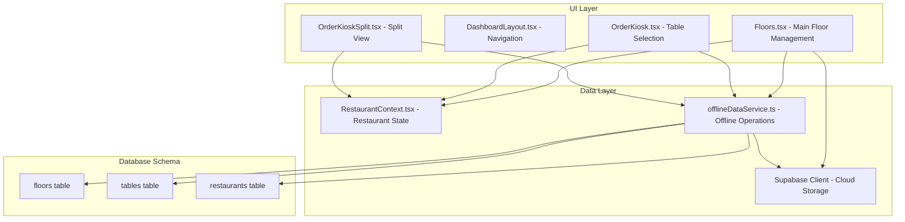
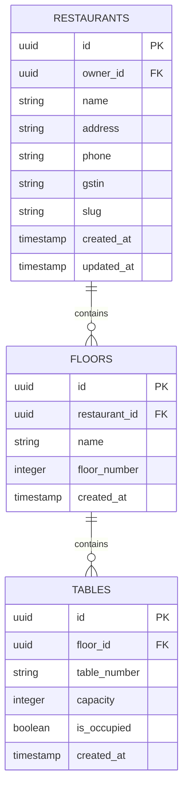
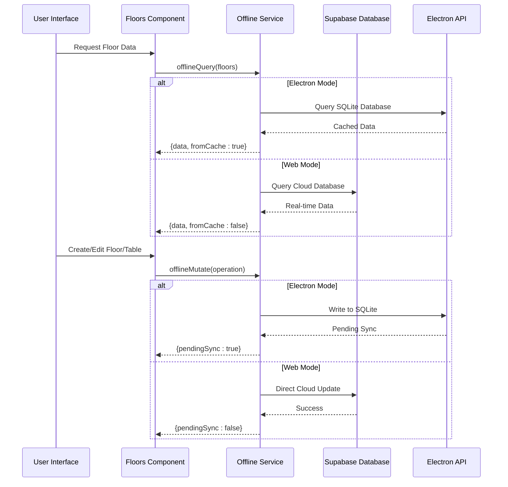
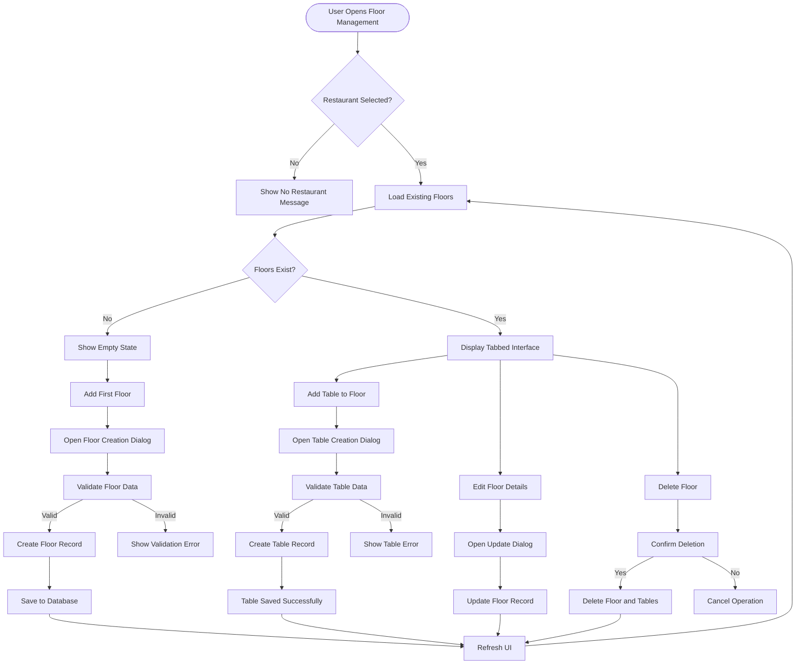
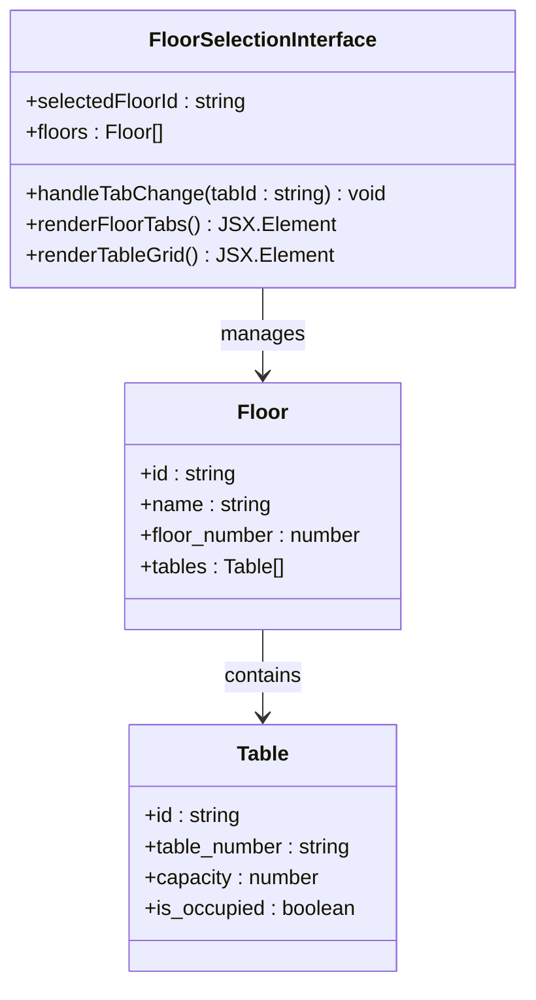
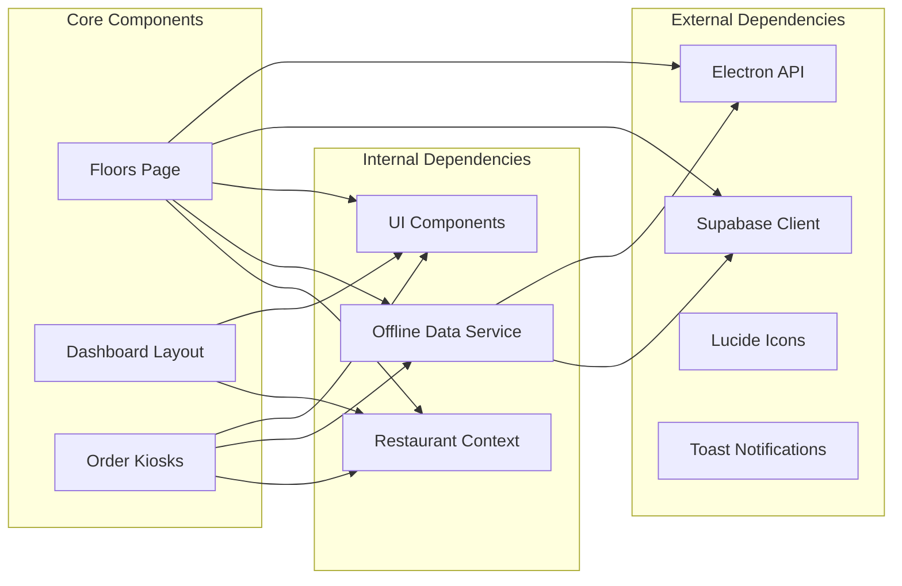
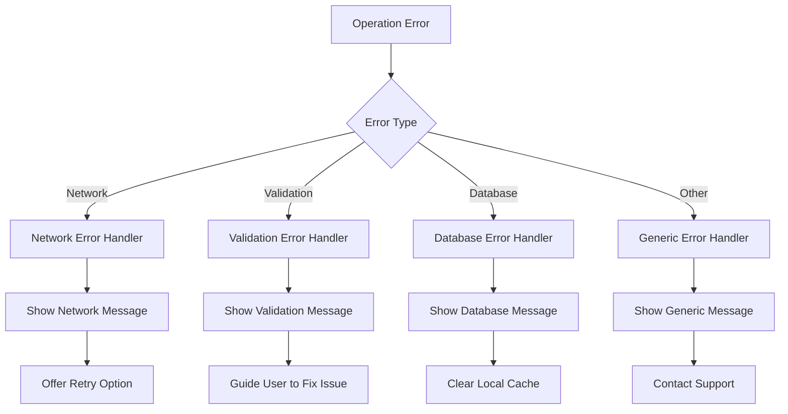

# Floor Planning System

<cite>
**Referenced Files in This Document**
- [Floors.tsx](file://src/pages/dashboard/Floors.tsx)
- [DashboardLayout.tsx](file://src/components/layout/DashboardLayout.tsx)
- [RestaurantContext.tsx](file://src/contexts/RestaurantContext.tsx)
- [offlineDataService.ts](file://src/services/offlineDataService.ts)
- [20251206042902_fc2b1d91-eb8e-4750-90c3-95b7e0feb6ba.sql](file://supabase/migrations/20251206042902_fc2b1d91-eb8e-4750-90c3-95b7e0feb6ba.sql)
- [20251206062448_4e2d7da9-9519-48ae-9d6c-bb1c994ed84a.sql](file://supabase/migrations/20251206062448_4e2d7da9-9519-48ae-9d6c-bb1c994ed84a.sql)
- [OrderKiosk.tsx](file://src/pages/dashboard/OrderKiosk.tsx)
- [OrderKioskSplit.tsx](file://src/pages/dashboard/OrderKioskSplit.tsx)
</cite>

## Table of Contents
1. [Introduction](#introduction)
2. [Project Structure](#project-structure)
3. [Core Components](#core-components)
4. [Architecture Overview](#architecture-overview)
5. [Detailed Component Analysis](#detailed-component-analysis)
6. [Dependency Analysis](#dependency-analysis)
7. [Performance Considerations](#performance-considerations)
8. [Troubleshooting Guide](#troubleshooting-guide)
9. [Conclusion](#conclusion)

## Introduction

The Floor Planning System is a comprehensive restaurant layout management solution that enables restaurant owners and managers to organize their physical space into multiple floors and tables. This system provides a complete workflow for floor creation, management, and spatial organization, integrating seamlessly with the broader TableFlow ecosystem.

The system supports both online and offline operations through a sophisticated offline-first architecture, allowing restaurant staff to work effectively even without network connectivity. It maintains real-time synchronization capabilities when network conditions permit, ensuring data consistency across all devices and locations.

## Project Structure

The floor planning system is built around several key components that work together to provide a seamless user experience:

**Diagram sources**
- [Floors.tsx:1-559](file://src/pages/dashboard/Floors.tsx#L1-L559)
- [DashboardLayout.tsx:1-402](file://src/components/layout/DashboardLayout.tsx#L1-L402)
- [offlineDataService.ts:1-769](file://src/services/offlineDataService.ts#L1-L769)

**Section sources**
- [Floors.tsx:1-559](file://src/pages/dashboard/Floors.tsx#L1-L559)
- [DashboardLayout.tsx:58-73](file://src/components/layout/DashboardLayout.tsx#L58-L73)

## Core Components

### Floor Data Model

The floor planning system uses a structured data model that defines the relationship between restaurants, floors, and tables:

**Diagram sources**
- [20251206042902_fc2b1d91-eb8e-4750-90c3-95b7e0feb6ba.sql:38-55](file://supabase/migrations/20251206042902_fc2b1d91-eb8e-4750-90c3-95b7e0feb6ba.sql#L38-L55)

### Floor Management Interface

The primary interface for floor management is located in the Floors page component, which provides comprehensive functionality for creating, editing, and organizing restaurant layouts.

**Section sources**
- [Floors.tsx:36-41](file://src/pages/dashboard/Floors.tsx#L36-L41)
- [20251206042902_fc2b1d91-eb8e-4750-90c3-95b7e0feb6ba.sql:38-55](file://supabase/migrations/20251206042902_fc2b1d91-eb8e-4750-90c3-95b7e0feb6ba.sql#L38-L55)

## Architecture Overview

The floor planning system implements a sophisticated offline-first architecture that ensures reliable operation in various network conditions while maintaining data consistency when connectivity is available.

**Diagram sources**
- [offlineDataService.ts:151-211](file://src/services/offlineDataService.ts#L151-L211)
- [offlineDataService.ts:220-287](file://src/services/offlineDataService.ts#L220-L287)

### Offline Data Flow

The system maintains two distinct data flows depending on the deployment mode:

**Web Mode**: Direct cloud connectivity with real-time updates
**Electron Mode**: Local SQLite storage with manual synchronization

**Section sources**
- [offlineDataService.ts:140-211](file://src/services/offlineDataService.ts#L140-L211)
- [offlineDataService.ts:289-347](file://src/services/offlineDataService.ts#L289-L347)

## Detailed Component Analysis

### Floor Creation and Management Workflow

The floor creation process follows a structured workflow that ensures data integrity and provides intuitive user interaction:

**Diagram sources**
- [Floors.tsx:125-146](file://src/pages/dashboard/Floors.tsx#L125-L146)
- [Floors.tsx:148-195](file://src/pages/dashboard/Floors.tsx#L148-L195)
- [Floors.tsx:248-278](file://src/pages/dashboard/Floors.tsx#L248-L278)

### Floor Naming Conventions and Numbering Systems

The system implements flexible naming and numbering conventions for optimal organization:

#### Floor Naming Conventions
- **Descriptive Names**: Floor names should clearly indicate their location (e.g., "Ground Floor", "First Floor", "Basement")
- **Consistency**: Maintain consistent naming patterns across all floors
- **Accessibility**: Include accessibility features for visually impaired users

#### Floor Numbering Systems
- **Integer Values**: Floor numbers are stored as integers for precise sorting
- **Default Value**: Ground floor defaults to 0, basement levels use negative numbers
- **Sorting Priority**: Floors are automatically sorted by floor_number in ascending order

**Section sources**
- [Floors.tsx:54-55](file://src/pages/dashboard/Floors.tsx#L54-L55)
- [20251206042902_fc2b1d91-eb8e-4750-90c3-95b7e0feb6ba.sql:42-43](file://supabase/migrations/20251206042902_fc2b1d91-eb8e-4750-90c3-95b7e0feb6ba.sql#L42-L43)

### Spatial Organization and Table Management

The system provides comprehensive spatial organization capabilities:

#### Table Organization Features
- **Capacity Management**: Each table maintains a capacity attribute for guest count tracking
- **Occupancy Status**: Real-time occupancy tracking with visual indicators
- **Table Numbering**: Flexible table numbering system supporting alphanumeric sequences
- **Visual Layout**: Grid-based table display with hover actions for editing/deletion

#### Sorting Mechanisms
- **Floor Sorting**: Automatic sorting by floor_number for logical floor arrangement
- **Table Sorting**: Alphabetical sorting by table_number within each floor
- **Occupancy Priority**: In kiosk views, occupied tables appear before available tables

**Section sources**
- [Floors.tsx:496-547](file://src/pages/dashboard/Floors.tsx#L496-L547)
- [OrderKiosk.tsx:1191-1204](file://src/pages/dashboard/OrderKiosk.tsx#L1191-L1204)

### Floor Selection Interface and Tab-Based Navigation

The floor selection interface provides an intuitive tab-based navigation system:

**Diagram sources**
- [Floors.tsx:448-477](file://src/pages/dashboard/Floors.tsx#L448-L477)
- [Floors.tsx:479-552](file://src/pages/dashboard/Floors.tsx#L479-L552)

### Floor Editing and Deletion Processes

The system provides comprehensive editing and deletion capabilities:

#### Edit Operations
- **Floor Updates**: Modify floor names and numbers through dedicated dialogs
- **Table Updates**: Change table numbers, capacities, and associated floors
- **Real-time Validation**: Form validation prevents invalid data entry

#### Delete Operations
- **Floor Deletion**: Removes entire floors along with all associated tables
- **Table Deletion**: Removes individual tables with confirmation prompts
- **Soft Deletion**: In offline mode, operations are queued for later synchronization

**Section sources**
- [Floors.tsx:125-146](file://src/pages/dashboard/Floors.tsx#L125-L146)
- [Floors.tsx:248-278](file://src/pages/dashboard/Floors.tsx#L248-L278)

### Multi-Floor Restaurant Configurations

The system supports complex multi-floor restaurant configurations:

#### Restaurant Association
- **Single Restaurant**: Each floor belongs to exactly one restaurant
- **Restaurant Isolation**: Data is properly isolated between different restaurants
- **Multi-Restaurant Support**: Staff members can manage multiple restaurants

#### Floor Relationships
- **Hierarchical Structure**: Floors represent physical levels within a restaurant
- **Table Distribution**: Tables are distributed across multiple floors based on layout
- **Capacity Planning**: Total restaurant capacity calculated from individual floor capacities

**Section sources**
- [RestaurantContext.tsx:13-29](file://src/contexts/RestaurantContext.tsx#L13-L29)
- [20251206042902_fc2b1d91-eb8e-4750-90c3-95b7e0feb6ba.sql:39-45](file://supabase/migrations/20251206042902_fc2b1d91-eb8e-4750-90c3-95b7e0feb6ba.sql#L39-L45)

## Dependency Analysis

The floor planning system has well-defined dependencies that ensure maintainability and scalability:

**Diagram sources**
- [Floors.tsx:1-27](file://src/pages/dashboard/Floors.tsx#L1-L27)
- [DashboardLayout.tsx:1-43](file://src/components/layout/DashboardLayout.tsx#L1-L43)

### Integration Points

The floor planning system integrates with several key components:

#### Restaurant Context Integration
- **Restaurant Selection**: Automatically loads floor data for the currently selected restaurant
- **Role-Based Access**: Restricts floor management operations based on user roles
- **Multi-Restaurant Support**: Allows switching between different restaurant configurations

#### Offline Data Service Integration
- **Local Storage**: Uses SQLite for offline data persistence in Electron mode
- **Cloud Synchronization**: Manages data synchronization when network connectivity is available
- **Conflict Resolution**: Handles data conflicts during synchronization

**Section sources**
- [RestaurantContext.tsx:47-382](file://src/contexts/RestaurantContext.tsx#L47-L382)
- [offlineDataService.ts:1-769](file://src/services/offlineDataService.ts#L1-L769)

## Performance Considerations

The floor planning system is designed with performance optimization in mind:

### Data Loading Strategies
- **Lazy Loading**: Floors are loaded only when needed, reducing initial load times
- **Caching**: Frequently accessed data is cached locally for improved responsiveness
- **Pagination**: Large datasets are paginated to prevent memory issues

### Offline Performance
- **Local Queries**: SQLite queries provide fast local data access
- **Background Sync**: Data synchronization occurs in the background without blocking UI
- **Incremental Updates**: Only changed data is synchronized, reducing bandwidth usage

### Memory Management
- **Component Unmounting**: Proper cleanup of event listeners and subscriptions
- **State Optimization**: Efficient state management to minimize re-renders
- **Resource Cleanup**: Automatic cleanup of database connections and timers

## Troubleshooting Guide

### Common Issues and Solutions

#### Floor Data Not Loading
**Symptoms**: Empty floor list or loading errors
**Causes**: 
- No restaurant selected
- Network connectivity issues
- Database corruption

**Solutions**:
1. Verify restaurant selection in the restaurant selector
2. Check network connectivity status
3. Force data refresh using the refresh button
4. Clear local cache if persistent issues occur

#### Floor Creation Failures
**Symptoms**: Error messages when creating new floors
**Causes**:
- Invalid floor names or numbers
- Duplicate floor numbers
- Database connection issues

**Solutions**:
1. Ensure floor names are unique and descriptive
2. Verify floor numbers are valid integers
3. Check database connectivity
4. Retry operation after resolving underlying issues

#### Table Management Issues
**Symptoms**: Tables not appearing or incorrect sorting
**Causes**:
- Missing floor associations
- Invalid table numbers
- Database synchronization delays

**Solutions**:
1. Verify table floor associations
2. Check table number formatting
3. Force manual synchronization
4. Restart application if issues persist

### Error Handling Patterns

The system implements comprehensive error handling:

**Section sources**
- [Floors.tsx:101-105](file://src/pages/dashboard/Floors.tsx#L101-L105)
- [offlineDataService.ts:397-541](file://src/services/offlineDataService.ts#L397-L541)

## Conclusion

The Floor Planning System provides a robust, scalable solution for restaurant layout management with comprehensive offline capabilities. Its modular architecture, flexible data model, and intuitive user interface make it suitable for restaurants of all sizes and configurations.

Key strengths of the system include:

- **Offline-First Design**: Reliable operation in any network condition
- **Real-time Synchronization**: Seamless data consistency when connectivity is available
- **Flexible Data Model**: Adaptable to various restaurant layouts and requirements
- **Intuitive Interface**: User-friendly controls for floor and table management
- **Multi-Restaurant Support**: Capability to manage multiple restaurant locations

The system's comprehensive error handling, performance optimizations, and integration with the broader TableFlow ecosystem position it as a cornerstone component for modern restaurant management solutions.

Future enhancements could include advanced layout visualization tools, automated capacity planning, and enhanced reporting capabilities to further improve the restaurant management experience.