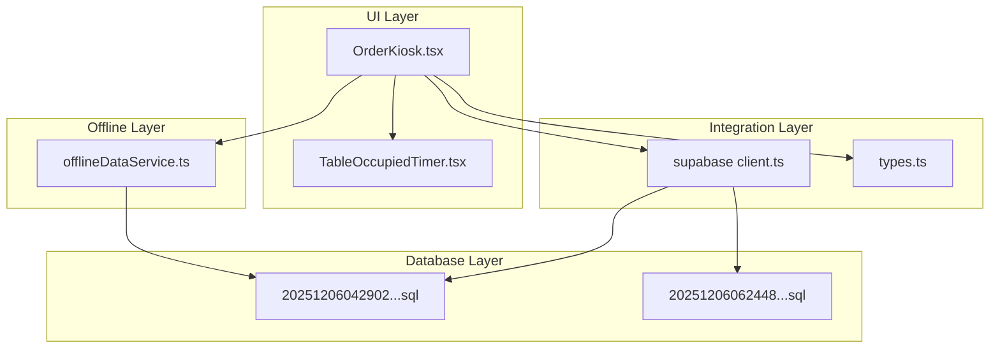
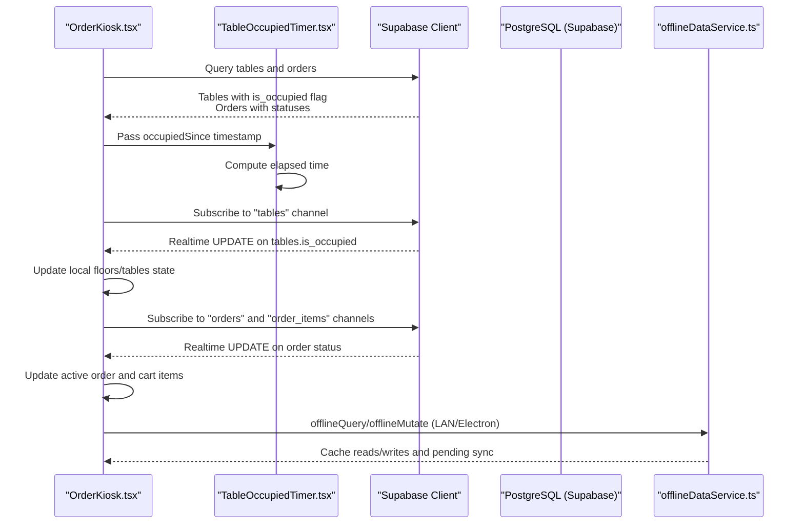
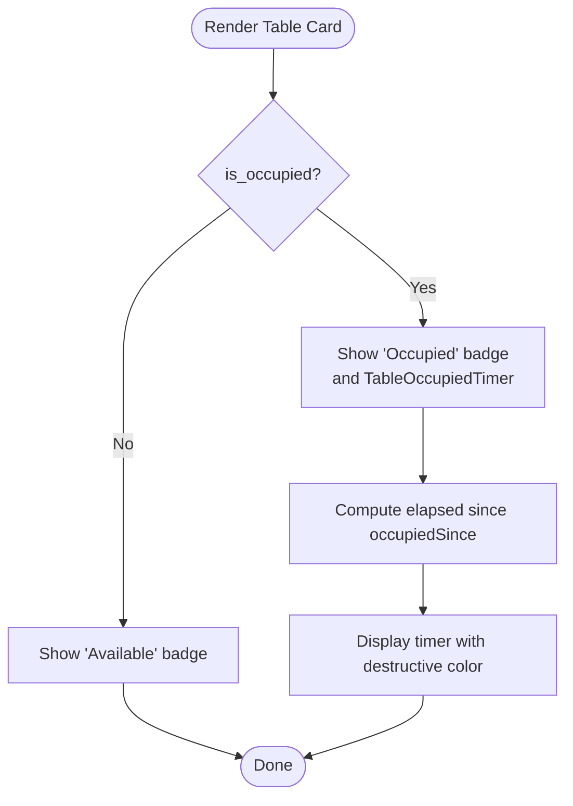
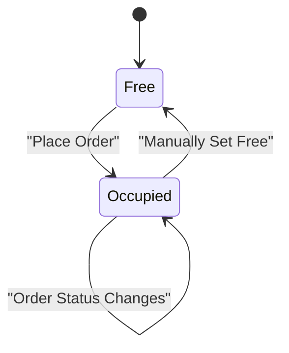
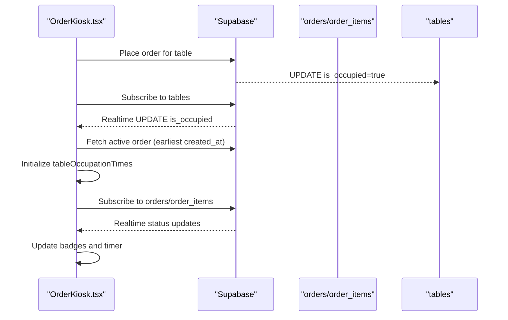
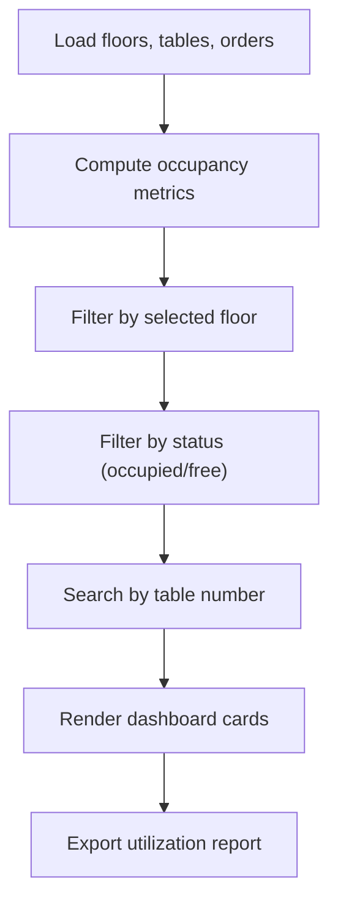
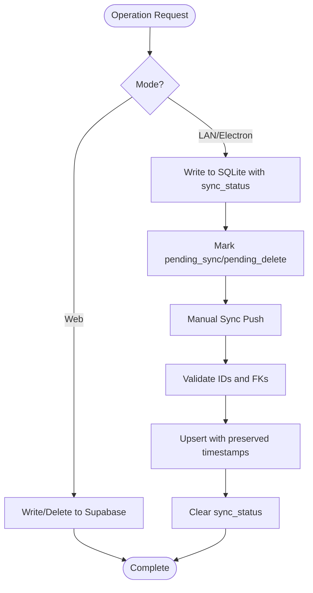
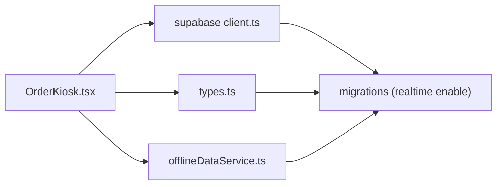

# Occupancy Tracking System

<cite>
**Referenced Files in This Document**
- [TableOccupiedTimer.tsx](file://src/components/TableOccupiedTimer.tsx)
- [OrderKiosk.tsx](file://src/pages/dashboard/OrderKiosk.tsx)
- [client.ts](file://src/integrations/supabase/client.ts)
- [types.ts](file://src/integrations/supabase/types.ts)
- [20251206042902_fc2b1d91-eb8e-4750-90c3-95b7e0feb6ba.sql](file://supabase/migrations/20251206042902_fc2b1d91-eb8e-4750-90c3-95b7e0feb6ba.sql)
- [20251206062448_4e2d7da9-9519-48ae-9d6c-bb1c994ed84a.sql](file://supabase/migrations/20251206062448_4e2d7da9-9519-48ae-9d6c-bb1c994ed84a.sql)
- [offlineDataService.ts](file://src/services/offlineDataService.ts)
</cite>

## Table of Contents
1. [Introduction](#introduction)
2. [Project Structure](#project-structure)
3. [Core Components](#core-components)
4. [Architecture Overview](#architecture-overview)
5. [Detailed Component Analysis](#detailed-component-analysis)
6. [Dependency Analysis](#dependency-analysis)
7. [Performance Considerations](#performance-considerations)
8. [Troubleshooting Guide](#troubleshooting-guide)
9. [Conclusion](#conclusion)
10. [Appendices](#appendices)

## Introduction
This document describes the occupancy tracking system and real-time status management for tables. It covers:
- Table occupancy status indicators and visual badges
- Color coding for destructive and success states
- Occupancy state transitions and real-time updates via Supabase
- Manual occupancy management
- Integration with the order management system for automatic occupancy updates
- Examples of occupancy monitoring dashboards, filtering, and reporting
- Data synchronization between online and offline modes with conflict resolution

## Project Structure
The occupancy tracking system spans UI components, Supabase integration, database schema, and offline-first data services:
- UI components render occupancy badges and timers
- Supabase client and types define real-time channels and table schemas
- Migrations enable real-time publication for tables and orders
- Offline service supports LAN/Electron modes with manual sync

**Diagram sources**
- [OrderKiosk.tsx:1-200](file://src/pages/dashboard/OrderKiosk.tsx#L1-L200)
- [TableOccupiedTimer.tsx:1-51](file://src/components/TableOccupiedTimer.tsx#L1-L51)
- [client.ts:1-17](file://src/integrations/supabase/client.ts#L1-L17)
- [types.ts:613-647](file://src/integrations/supabase/types.ts#L613-L647)
- [20251206042902_fc2b1d91-eb8e-4750-90c3-95b7e0feb6ba.sql:47-55](file://supabase/migrations/20251206042902_fc2b1d91-eb8e-4750-90c3-95b7e0feb6ba.sql#L47-L55)
- [20251206062448_4e2d7da9-9519-48ae-9d6c-bb1c994ed84a.sql:1-64](file://supabase/migrations/20251206062448_4e2d7da9-9519-48ae-9d6c-bb1c994ed84a.sql#L1-L64)
- [offlineDataService.ts:1-211](file://src/services/offlineDataService.ts#L1-L211)

**Section sources**
- [OrderKiosk.tsx:1-200](file://src/pages/dashboard/OrderKiosk.tsx#L1-L200)
- [TableOccupiedTimer.tsx:1-51](file://src/components/TableOccupiedTimer.tsx#L1-L51)
- [client.ts:1-17](file://src/integrations/supabase/client.ts#L1-L17)
- [types.ts:613-647](file://src/integrations/supabase/types.ts#L613-L647)
- [20251206042902_fc2b1d91-eb8e-4750-90c3-95b7e0feb6ba.sql:47-55](file://supabase/migrations/20251206042902_fc2b1d91-eb8e-4750-90c3-95b7e0feb6ba.sql#L47-L55)
- [20251206062448_4e2d7da9-9519-48ae-9d6c-bb1c994ed84a.sql:1-64](file://supabase/migrations/20251206062448_4e2d7da9-9519-48ae-9d6c-bb1c994ed84a.sql#L1-L64)
- [offlineDataService.ts:1-211](file://src/services/offlineDataService.ts#L1-L211)

## Core Components
- Occupancy badge rendering: Displays “Available” (success) or “Occupied” (destructive) badges per table in the kiosk interface.
- Occupied timer: Tracks elapsed time since a table became occupied and displays a destructive-colored timer.
- Real-time subscriptions: Subscribes to Supabase postgres_changes for orders and order_items to reflect live order status; subscribes to tables for occupancy changes.
- Offline-first data service: Supports LAN/Electron modes with SQLite caching, manual sync, and conflict-safe writes.

**Section sources**
- [OrderKiosk.tsx:1077-1095](file://src/pages/dashboard/OrderKiosk.tsx#L1077-L1095)
- [OrderKiosk.tsx:1314-1332](file://src/pages/dashboard/OrderKiosk.tsx#L1314-L1332)
- [TableOccupiedTimer.tsx:44-50](file://src/components/TableOccupiedTimer.tsx#L44-L50)
- [OrderKiosk.tsx:396-452](file://src/pages/dashboard/OrderKiosk.tsx#L396-L452)
- [offlineDataService.ts:151-211](file://src/services/offlineDataService.ts#L151-L211)

## Architecture Overview
The occupancy system integrates UI, Supabase, and offline storage:

**Diagram sources**
- [OrderKiosk.tsx:454-452](file://src/pages/dashboard/OrderKiosk.tsx#L454-L452)
- [TableOccupiedTimer.tsx:12-40](file://src/components/TableOccupiedTimer.tsx#L12-L40)
- [client.ts:11-17](file://src/integrations/supabase/client.ts#L11-L17)
- [offlineDataService.ts:151-211](file://src/services/offlineDataService.ts#L151-L211)

## Detailed Component Analysis

### Occupancy Badge and Status Indicators
- Badge display:
  - Occupied: destructive-colored badge with label
  - Available: success-colored badge with label
- Color coding:
  - Destructive: indicates busy/occupied state
  - Success: indicates free/available state
- Timer integration:
  - When occupied, a timer shows elapsed time since the table became occupied

**Diagram sources**
- [OrderKiosk.tsx:1077-1095](file://src/pages/dashboard/OrderKiosk.tsx#L1077-L1095)
- [OrderKiosk.tsx:1314-1332](file://src/pages/dashboard/OrderKiosk.tsx#L1314-L1332)
- [TableOccupiedTimer.tsx:44-50](file://src/components/TableOccupiedTimer.tsx#L44-L50)

**Section sources**
- [OrderKiosk.tsx:1077-1095](file://src/pages/dashboard/OrderKiosk.tsx#L1077-L1095)
- [OrderKiosk.tsx:1314-1332](file://src/pages/dashboard/OrderKiosk.tsx#L1314-L1332)
- [TableOccupiedTimer.tsx:44-50](file://src/components/TableOccupiedTimer.tsx#L44-L50)

### Occupancy State Transitions and Automatic Updates
- Transition triggers:
  - Placing an order against a table sets the table’s is_occupied flag
  - Completing/canceling orders does not automatically clear is_occupied
- Real-time updates:
  - Subscribes to Supabase postgres_changes on tables to reflect occupancy changes
  - Subscribes to orders/order_items to reflect order lifecycle updates
- Manual management:
  - UI allows toggling occupancy flags for operational needs

**Diagram sources**
- [OrderKiosk.tsx:454-452](file://src/pages/dashboard/OrderKiosk.tsx#L454-L452)
- [20251206042902_fc2b1d91-eb8e-4750-90c3-95b7e0feb6ba.sql:47-55](file://supabase/migrations/20251206042902_fc2b1d91-eb8e-4750-90c3-95b7e0feb6ba.sql#L47-L55)

**Section sources**
- [OrderKiosk.tsx:454-452](file://src/pages/dashboard/OrderKiosk.tsx#L454-L452)
- [20251206042902_fc2b1d91-eb8e-4750-90c3-95b7e0feb6ba.sql:47-55](file://supabase/migrations/20251206042902_fc2b1d91-eb8e-4750-90c3-95b7e0feb6ba.sql#L47-L55)

### Integration with Order Management System
- Automatic occupancy updates:
  - When an order is placed for a table, the table becomes occupied
  - The system captures the earliest active order timestamp to power the occupied timer
- Real-time order status updates:
  - Subscribes to order and order_item updates to reflect readiness and progress
- UI feedback:
  - Toast notifications inform staff when orders change status

**Diagram sources**
- [OrderKiosk.tsx:221-248](file://src/pages/dashboard/OrderKiosk.tsx#L221-L248)
- [OrderKiosk.tsx:396-452](file://src/pages/dashboard/OrderKiosk.tsx#L396-L452)
- [20251206042902_fc2b1d91-eb8e-4750-90c3-95b7e0feb6ba.sql:84-94](file://supabase/migrations/20251206042902_fc2b1d91-eb8e-4750-90c3-95b7e0feb6ba.sql#L84-L94)

**Section sources**
- [OrderKiosk.tsx:221-248](file://src/pages/dashboard/OrderKiosk.tsx#L221-L248)
- [OrderKiosk.tsx:396-452](file://src/pages/dashboard/OrderKiosk.tsx#L396-L452)
- [20251206042902_fc2b1d91-eb8e-4750-90c3-95b7e0feb6ba.sql:84-94](file://supabase/migrations/20251206042902_fc2b1d91-eb8e-4750-90c3-95b7e0feb6ba.sql#L84-L94)

### Occupancy Monitoring Dashboards, Filtering, and Reporting
- Dashboard examples:
  - Kiosk view: Grid/list of tables with occupancy badges and timers
  - Filtering: by floor, table number, occupancy status, and search
- Reporting:
  - Track table utilization rate by counting occupied vs total tables
  - Aggregate by time windows (daily/weekly/monthly) using order timestamps

[No sources needed since this diagram shows conceptual workflow, not actual code structure]

### Data Synchronization Between Online and Offline Modes
- Modes:
  - Web: Direct Supabase queries
  - LAN/Electron: SQLite-first with manual sync
- Conflict resolution:
  - Timestamp preservation during manual sync
  - Pending sync markers and soft deletes
  - FK nullification for invalid references
  - Dependency ordering to avoid foreign key violations

**Diagram sources**
- [offlineDataService.ts:220-287](file://src/services/offlineDataService.ts#L220-L287)
- [offlineDataService.ts:397-541](file://src/services/offlineDataService.ts#L397-L541)

**Section sources**
- [offlineDataService.ts:151-211](file://src/services/offlineDataService.ts#L151-L211)
- [offlineDataService.ts:220-287](file://src/services/offlineDataService.ts#L220-L287)
- [offlineDataService.ts:397-541](file://src/services/offlineDataService.ts#L397-L541)

## Dependency Analysis
- Supabase client and types define the schema and real-time channels used by the UI.
- Migrations enable real-time publication for tables, orders, and order_items.
- Offline service abstracts connectivity and provides SQLite-backed operations.

**Diagram sources**
- [OrderKiosk.tsx:1-50](file://src/pages/dashboard/OrderKiosk.tsx#L1-L50)
- [client.ts:1-17](file://src/integrations/supabase/client.ts#L1-L17)
- [types.ts:613-647](file://src/integrations/supabase/types.ts#L613-L647)
- [20251206042902_fc2b1d91-eb8e-4750-90c3-95b7e0feb6ba.sql:207-210](file://supabase/migrations/20251206042902_fc2b1d91-eb8e-4750-90c3-95b7e0feb6ba.sql#L207-L210)

**Section sources**
- [OrderKiosk.tsx:1-50](file://src/pages/dashboard/OrderKiosk.tsx#L1-L50)
- [client.ts:1-17](file://src/integrations/supabase/client.ts#L1-L17)
- [types.ts:613-647](file://src/integrations/supabase/types.ts#L613-L647)
- [20251206042902_fc2b1d91-eb8e-4750-90c3-95b7e0feb6ba.sql:207-210](file://supabase/migrations/20251206042902_fc2b1d91-eb8e-4750-90c3-95b7e0feb6ba.sql#L207-L210)

## Performance Considerations
- Real-time subscriptions: Limit to active order and table views to reduce bandwidth and CPU usage.
- Timer updates: One-second intervals are efficient; ensure throttling if rendering many tables simultaneously.
- Offline caching: Batch SQLite writes and reads; avoid excessive re-renders by updating only affected table rows.
- Sync push: Process in dependency order and batch operations to minimize network overhead.

[No sources needed since this section provides general guidance]

## Troubleshooting Guide
- Real-time not updating:
  - Verify Supabase publication includes tables and orders/order_items.
  - Confirm the client is online and channels are subscribed.
- Offline mode issues:
  - Ensure SQLite is available and initialized.
  - Use manual sync to upload pending changes; check pending count.
- Conflicts during sync:
  - Review invalid IDs and foreign keys; nullify invalid FKs before upload.
  - Re-run sync after correcting data anomalies.

**Section sources**
- [20251206042902_fc2b1d91-eb8e-4750-90c3-95b7e0feb6ba.sql:207-210](file://supabase/migrations/20251206042902_fc2b1d91-eb8e-4750-90c3-95b7e0feb6ba.sql#L207-L210)
- [offlineDataService.ts:397-541](file://src/services/offlineDataService.ts#L397-L541)

## Conclusion
The occupancy tracking system combines real-time Supabase updates with an offline-first architecture to provide reliable table status visibility. UI badges and timers clearly communicate occupancy, while order management integration ensures accurate automatic updates. The offline service enables robust operations in LAN/Electron environments with controlled synchronization and conflict resolution.

## Appendices
- Example dashboard features:
  - Occupancy grid with status badges and timers
  - Filters: floor, table number, status, and search
  - Reporting: utilization rate calculations and exportable summaries
- Operational tips:
  - Manually reset occupancy when needed
  - Use manual sync to reconcile offline changes
  - Monitor pending sync count and resolve conflicts proactively

[No sources needed since this section provides general guidance]