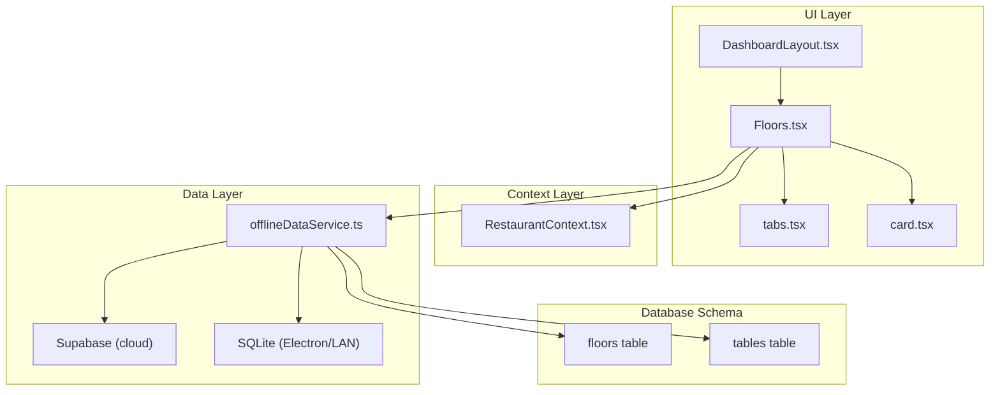
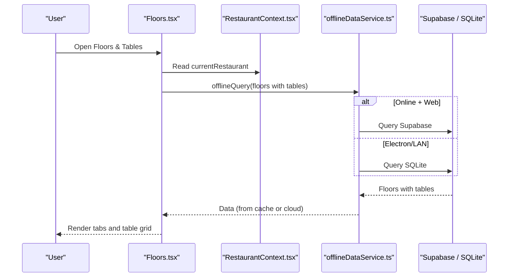
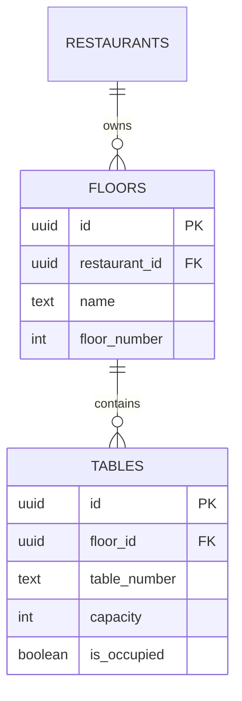
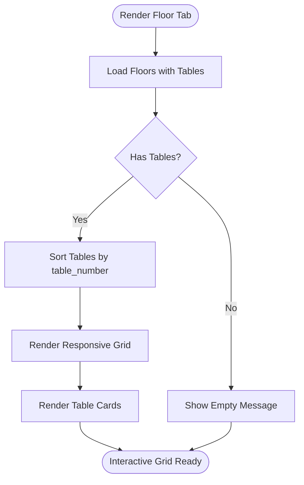
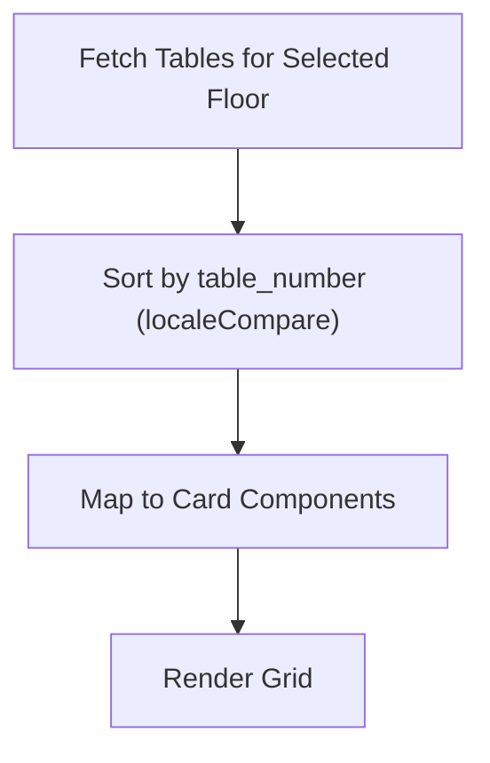
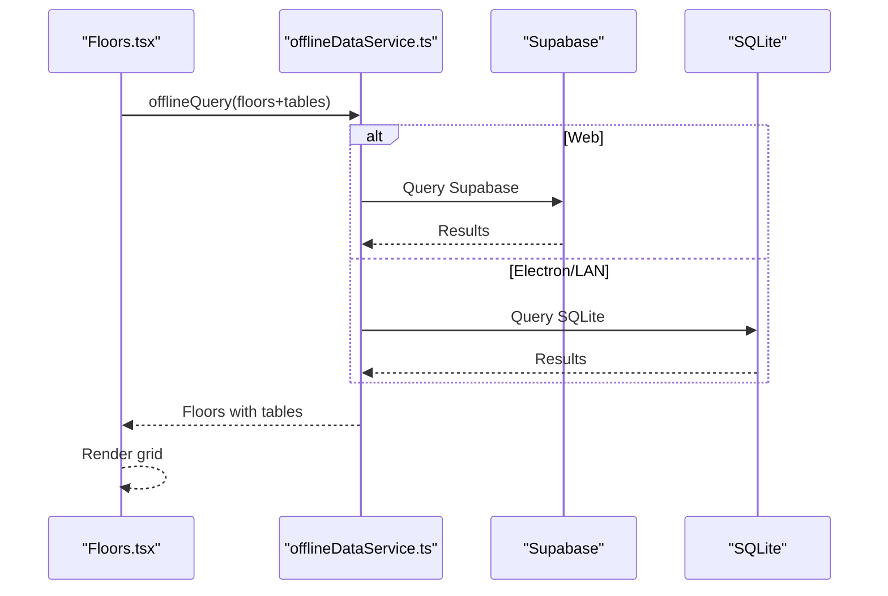
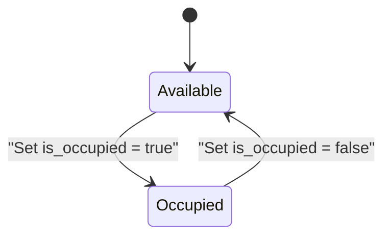
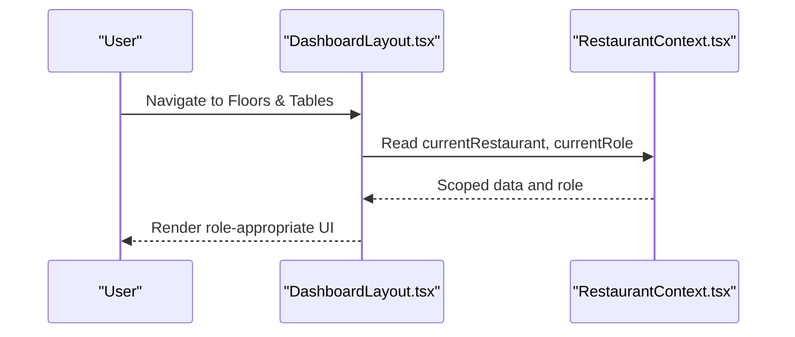
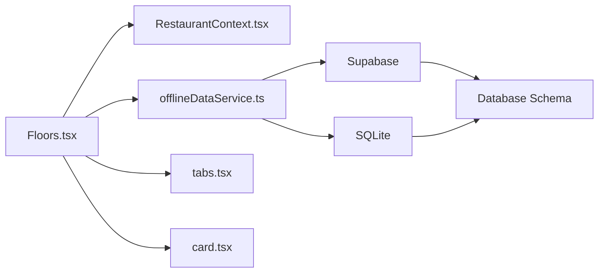

# Spatial Organization & Layout

<cite>
**Referenced Files in This Document**
- [Floors.tsx](file://src/pages/dashboard/Floors.tsx)
- [RestaurantContext.tsx](file://src/contexts/RestaurantContext.tsx)
- [offlineDataService.ts](file://src/services/offlineDataService.ts)
- [20251206042902_fc2b1d91-eb8e-4750-90c3-95b7e0feb6ba.sql](file://supabase/migrations/20251206042902_fc2b1d91-eb8e-4750-90c3-95b7e0feb6ba.sql)
- [tabs.tsx](file://src/components/ui/tabs.tsx)
- [card.tsx](file://src/components/ui/card.tsx)
- [DashboardLayout.tsx](file://src/components/layout/DashboardLayout.tsx)
- [use-mobile.tsx](file://src/hooks/use-mobile.tsx)
- [utils.ts](file://src/lib/utils.ts)
</cite>

## Table of Contents
1. [Introduction](#introduction)
2. [Project Structure](#project-structure)
3. [Core Components](#core-components)
4. [Architecture Overview](#architecture-overview)
5. [Detailed Component Analysis](#detailed-component-analysis)
6. [Dependency Analysis](#dependency-analysis)
7. [Performance Considerations](#performance-considerations)
8. [Troubleshooting Guide](#troubleshooting-guide)
9. [Conclusion](#conclusion)
10. [Appendices](#appendices)

## Introduction
This document explains the spatial organization and floor layout management capabilities of the application. It focuses on:
- The floor-to-table relationship hierarchy
- Table arrangement strategies and sorting
- Grid-based table layout and responsive design
- Positioning of tables within floor plans
- Sorting mechanisms (alphabetical and numeric)
- Practical examples for restaurant layout optimization, grouping, and capacity planning
- Operational efficiency considerations including traffic flow and staff accessibility

## Project Structure
The spatial layout feature centers around a dedicated dashboard page that manages floors and tables, integrates with a restaurant-scoped context, and leverages an offline-first data service for robust cross-environment support.

**Diagram sources**
- [Floors.tsx:43-559](file://src/pages/dashboard/Floors.tsx#L43-L559)
- [RestaurantContext.tsx:47-382](file://src/contexts/RestaurantContext.tsx#L47-L382)
- [offlineDataService.ts:151-347](file://src/services/offlineDataService.ts#L151-L347)
- [20251206042902_fc2b1d91-eb8e-4750-90c3-95b7e0feb6ba.sql:38-55](file://supabase/migrations/20251206042902_fc2b1d91-eb8e-4750-90c3-95b7e0feb6ba.sql#L38-L55)

**Section sources**
- [Floors.tsx:43-559](file://src/pages/dashboard/Floors.tsx#L43-L559)
- [RestaurantContext.tsx:47-382](file://src/contexts/RestaurantContext.tsx#L47-L382)
- [offlineDataService.ts:151-347](file://src/services/offlineDataService.ts#L151-L347)
- [20251206042902_fc2b1d91-eb8e-4750-90c3-95b7e0feb6ba.sql:38-55](file://supabase/migrations/20251206042902_fc2b1d91-eb8e-4750-90c3-95b7e0feb6ba.sql#L38-L55)

## Core Components
- Floors and Tables Management Page: Implements CRUD for floors and tables, tabbed interface per floor, and grid-based table cards with occupancy indicators.
- Restaurant Context: Provides restaurant-scoped selection and role-aware navigation, ensuring data isolation and access control.
- Offline Data Service: Enables offline-first behavior with SQLite caching and optional LAN synchronization, supporting consistent layout management across environments.
- Database Schema: Defines the hierarchical relationship between restaurants, floors, and tables, including capacity and occupancy flags.

Key responsibilities:
- Floor-to-table hierarchy: One floor contains many tables; tables belong to a single floor.
- Sorting: Tables are sorted alphabetically by table number within each floor view.
- Responsive layout: Grid columns adapt to screen size using Tailwind utilities.
- Occupancy state: Visual indicators reflect whether a table is occupied or available.

**Section sources**
- [Floors.tsx:29-41](file://src/pages/dashboard/Floors.tsx#L29-L41)
- [Floors.tsx:495-547](file://src/pages/dashboard/Floors.tsx#L495-L547)
- [RestaurantContext.tsx:31-43](file://src/contexts/RestaurantContext.tsx#L31-L43)
- [20251206042902_fc2b1d91-eb8e-4750-90c3-95b7e0feb6ba.sql:38-55](file://supabase/migrations/20251206042902_fc2b1d91-eb8e-4750-90c3-95b7e0feb6ba.sql#L38-L55)

## Architecture Overview
The system follows a layered architecture:
- UI: React components render the floor and table views, dialogs, and tabbed navigation.
- Context: RestaurantContext scopes data and permissions to a specific restaurant.
- Data Access: offlineDataService abstracts cloud and local storage, enabling offline-first behavior.
- Persistence: Supabase for cloud, SQLite for Electron/LAN modes.

**Diagram sources**
- [Floors.tsx:62-106](file://src/pages/dashboard/Floors.tsx#L62-L106)
- [offlineDataService.ts:151-211](file://src/services/offlineDataService.ts#L151-L211)
- [RestaurantContext.tsx:78-136](file://src/contexts/RestaurantContext.tsx#L78-L136)

## Detailed Component Analysis

### Floor-to-Table Relationship Hierarchy
- Entities:
  - Floor: belongs to a restaurant, has a floor number, and contains many tables.
  - Table: belongs to a floor, has a table number, capacity, and occupancy flag.
- Relationship:
  - One-to-many: one floor has many tables.
  - Foreign keys enforce referential integrity at the database level.
- UI representation:
  - Tabbed interface per floor.
  - Each tab displays a grid of tables belonging to that floor.

**Diagram sources**
- [20251206042902_fc2b1d91-eb8e-4750-90c3-95b7e0feb6ba.sql:38-55](file://supabase/migrations/20251206042902_fc2b1d91-eb8e-4750-90c3-95b7e0feb6ba.sql#L38-L55)

**Section sources**
- [20251206042902_fc2b1d91-eb8e-4750-90c3-95b7e0feb6ba.sql:38-55](file://supabase/migrations/20251206042902_fc2b1d91-eb8e-4750-90c3-95b7e0feb6ba.sql#L38-L55)
- [Floors.tsx:36-41](file://src/pages/dashboard/Floors.tsx#L36-L41)

### Grid-Based Table Layout and Responsive Design
- Grid layout:
  - Responsive grid adapts columns based on viewport width using Tailwind’s grid utilities.
  - Example breakpoints: 2 columns on small screens, increasing to 6 on very large screens.
- Visual presentation:
  - Each table is rendered as a card with:
    - Table number (bold)
    - Capacity indicator
    - Occupancy badge (available/occupied)
    - Hover actions (edit/delete) for authorized users
- Accessibility:
  - Cards are keyboard navigable and focusable within the grid.

**Diagram sources**
- [Floors.tsx:495-547](file://src/pages/dashboard/Floors.tsx#L495-L547)

**Section sources**
- [Floors.tsx:495-547](file://src/pages/dashboard/Floors.tsx#L495-L547)
- [use-mobile.tsx:1-19](file://src/hooks/use-mobile.tsx#L1-L19)
- [utils.ts:1-7](file://src/lib/utils.ts#L1-L7)

### Table Sorting Mechanisms
- Sorting strategy:
  - Tables within a floor are sorted alphabetically by table_number.
- Implementation:
  - Sorting occurs in memory on the frontend before rendering.
- Extensibility:
  - The sorting comparator can be adapted for numeric or custom ordering if needed.

**Diagram sources**
- [Floors.tsx:496-498](file://src/pages/dashboard/Floors.tsx#L496-L498)

**Section sources**
- [Floors.tsx:496-498](file://src/pages/dashboard/Floors.tsx#L496-L498)

### Data Access and Offline Behavior
- Query pattern:
  - offlineQuery executes a Supabase select with join to fetch floors and nested tables, then applies offline caching or LAN retrieval depending on environment.
- Mutation pattern:
  - offlineMutate persists changes locally (SQLite) and optionally syncs to cloud later.
- Offline-first guarantees:
  - The UI remains functional when offline; changes are queued and synced when connectivity returns.

**Diagram sources**
- [Floors.tsx:62-106](file://src/pages/dashboard/Floors.tsx#L62-L106)
- [offlineDataService.ts:151-211](file://src/services/offlineDataService.ts#L151-L211)

**Section sources**
- [Floors.tsx:62-106](file://src/pages/dashboard/Floors.tsx#L62-L106)
- [offlineDataService.ts:151-211](file://src/services/offlineDataService.ts#L151-L211)

### Occupancy State and Operational Efficiency
- Occupancy flag:
  - Each table carries an is_occupied boolean indicating real-time status.
- UI feedback:
  - Visual indicators differentiate occupied vs available tables.
- Operational impact:
  - Helps staff quickly identify free tables for new guests.
  - Supports traffic flow by highlighting areas with higher availability.

**Diagram sources**
- [20251206042902_fc2b1d91-eb8e-4750-90c3-95b7e0feb6ba.sql:48-55](file://supabase/migrations/20251206042902_fc2b1d91-eb8e-4750-90c3-95b7e0feb6ba.sql#L48-L55)
- [Floors.tsx:500-520](file://src/pages/dashboard/Floors.tsx#L500-L520)

**Section sources**
- [20251206042902_fc2b1d91-eb8e-4750-90c3-95b7e0feb6ba.sql:48-55](file://supabase/migrations/20251206042902_fc2b1d91-eb8e-4750-90c3-95b7e0feb6ba.sql#L48-L55)
- [Floors.tsx:500-520](file://src/pages/dashboard/Floors.tsx#L500-L520)

### Restaurant Context and Role-Aware Navigation
- Restaurant scoping:
  - RestaurantContext provides the current restaurant and role, ensuring data and UI are scoped to the selected restaurant.
- Navigation:
  - DashboardLayout builds navigation items dynamically based on role, including Floors & Tables.

**Diagram sources**
- [DashboardLayout.tsx:58-73](file://src/components/layout/DashboardLayout.tsx#L58-L73)
- [RestaurantContext.tsx:26-43](file://src/contexts/RestaurantContext.tsx#L26-L43)

**Section sources**
- [DashboardLayout.tsx:58-73](file://src/components/layout/DashboardLayout.tsx#L58-L73)
- [RestaurantContext.tsx:26-43](file://src/contexts/RestaurantContext.tsx#L26-L43)

## Dependency Analysis
- UI depends on:
  - RestaurantContext for scoping
  - offlineDataService for data access
  - Radix UI Tabs for tabbed navigation
  - Tailwind utilities for responsive grid
- Data layer depends on:
  - Supabase for cloud operations
  - SQLite for local/LAN operations
- Database depends on:
  - Foreign keys to maintain referential integrity

**Diagram sources**
- [Floors.tsx:43-559](file://src/pages/dashboard/Floors.tsx#L43-L559)
- [RestaurantContext.tsx:47-382](file://src/contexts/RestaurantContext.tsx#L47-L382)
- [offlineDataService.ts:151-347](file://src/services/offlineDataService.ts#L151-L347)
- [20251206042902_fc2b1d91-eb8e-4750-90c3-95b7e0feb6ba.sql:38-55](file://supabase/migrations/20251206042902_fc2b1d91-eb8e-4750-90c3-95b7e0feb6ba.sql#L38-L55)

**Section sources**
- [Floors.tsx:43-559](file://src/pages/dashboard/Floors.tsx#L43-L559)
- [RestaurantContext.tsx:47-382](file://src/contexts/RestaurantContext.tsx#L47-L382)
- [offlineDataService.ts:151-347](file://src/services/offlineDataService.ts#L151-L347)
- [20251206042902_fc2b1d91-eb8e-4750-90c3-95b7e0feb6ba.sql:38-55](file://supabase/migrations/20251206042902_fc2b1d91-eb8e-4750-90c3-95b7e0feb6ba.sql#L38-L55)

## Performance Considerations
- Offline-first reduces latency and improves reliability by serving cached data immediately.
- Sorting is O(n log n) per floor; keep floor sizes reasonable for smooth UI responsiveness.
- Grid rendering scales with number of tables; virtualization is not currently implemented but could be considered for very large layouts.
- Network-bound operations are minimized through offline mutations and manual sync controls.

[No sources needed since this section provides general guidance]

## Troubleshooting Guide
Common issues and resolutions:
- No restaurant selected:
  - The Floors page displays a guidance message when no restaurant is chosen. Select a restaurant from the header dropdown.
- No floors or tables displayed:
  - Ensure floors are created and tables are added to the selected floor.
- Offline mode:
  - When offline, the app uses cached data. Changes are queued and sync when connectivity returns.
- Syncing in Electron/LAN:
  - Use the sync status bar to check online/offline status and pending changes; force sync when ready.

**Section sources**
- [Floors.tsx:280-290](file://src/pages/dashboard/Floors.tsx#L280-L290)
- [DashboardLayout.tsx:382-388](file://src/components/layout/DashboardLayout.tsx#L382-L388)
- [offlineDataService.ts:397-541](file://src/services/offlineDataService.ts#L397-L541)

## Conclusion
The spatial organization module provides a robust, offline-capable foundation for managing restaurant floor plans and tables. Its grid-based UI, role-aware navigation, and flexible sorting enable efficient layout management. By leveraging the floor-to-table hierarchy and occupancy flags, operators can optimize traffic flow, improve staff accessibility, and plan capacity effectively.

[No sources needed since this section summarizes without analyzing specific files]

## Appendices

### Best Practices for Layout Optimization
- Group tables by capacity to streamline service and accommodate party sizes efficiently.
- Place high-traffic tables near entrances and staff stations to minimize walking distance.
- Reserve corner or quieter tables for larger groups to reduce noise and disruption.
- Use occupancy indicators to proactively manage wait times and reallocate resources.

[No sources needed since this section provides general guidance]