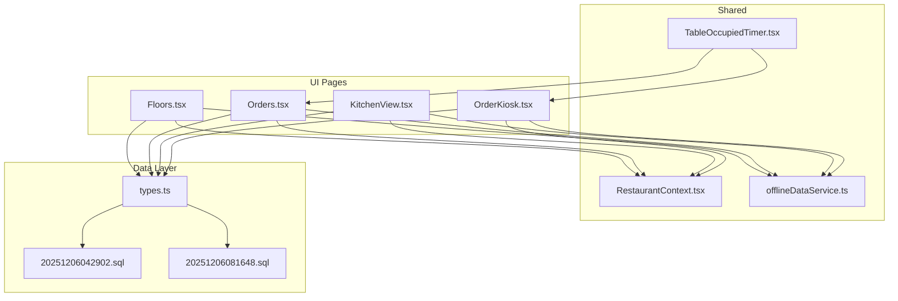
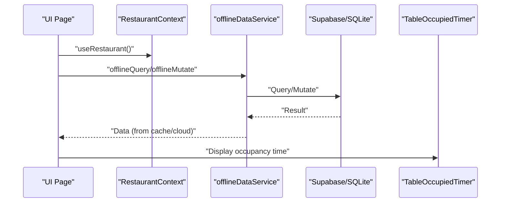
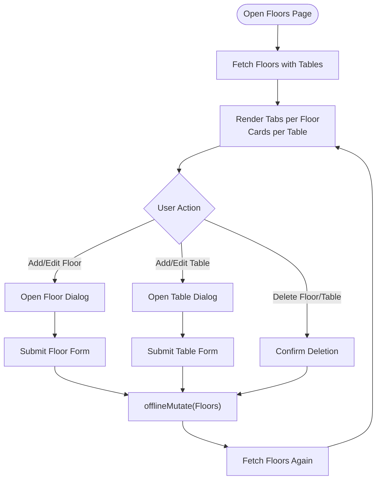
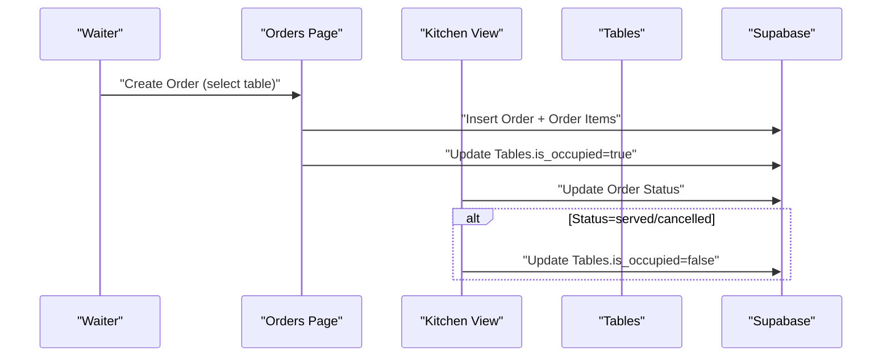
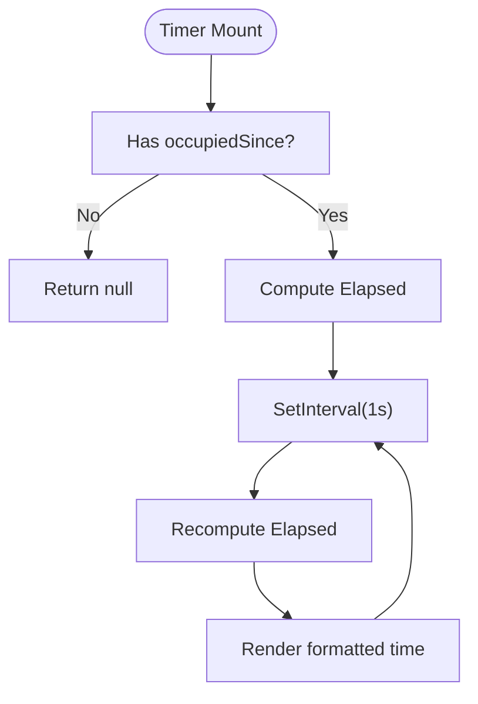
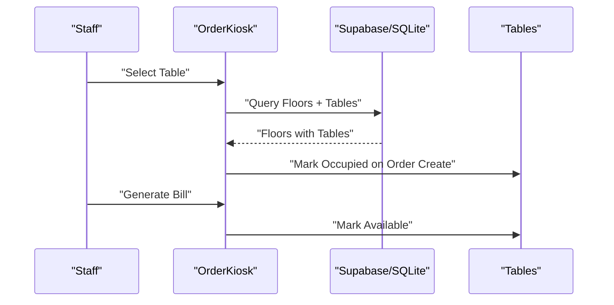
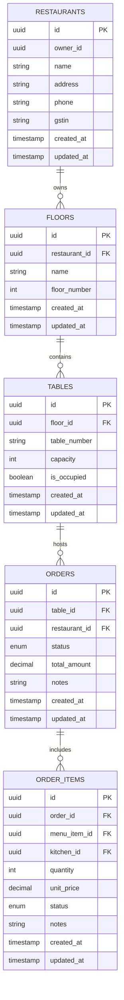
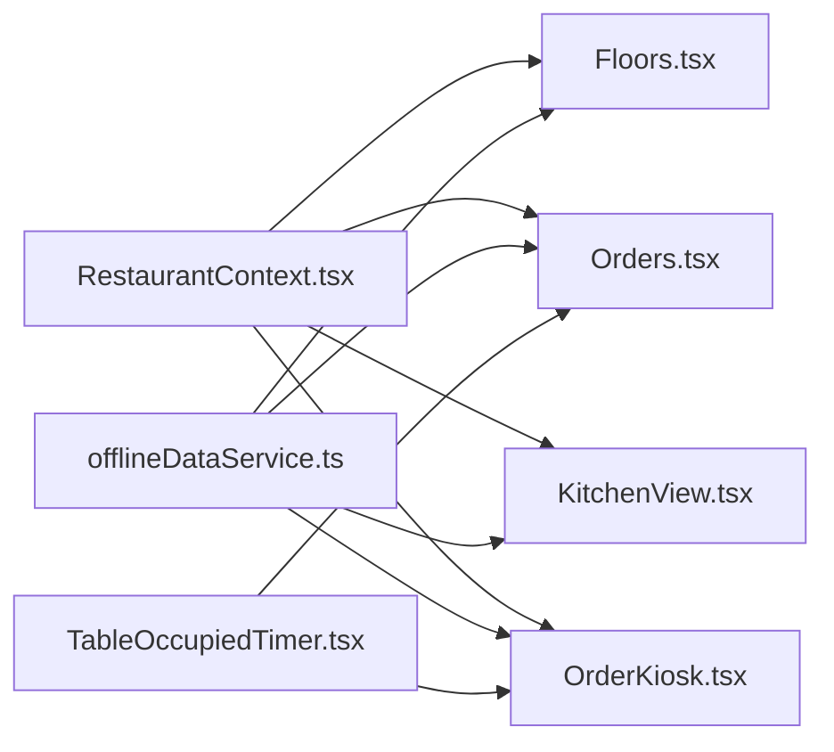

# Table & Floor Management

<cite>
**Referenced Files in This Document**
- [Floors.tsx](file://src/pages/dashboard/Floors.tsx)
- [Orders.tsx](file://src/pages/dashboard/Orders.tsx)
- [KitchenView.tsx](file://src/pages/dashboard/KitchenView.tsx)
- [OrderKiosk.tsx](file://src/pages/dashboard/OrderKiosk.tsx)
- [TableOccupiedTimer.tsx](file://src/components/TableOccupiedTimer.tsx)
- [RestaurantContext.tsx](file://src/contexts/RestaurantContext.tsx)
- [offlineDataService.ts](file://src/services/offlineDataService.ts)
- [types.ts](file://src/integrations/supabase/types.ts)
- [20251206042902_fc2b1d91-eb8e-4750-90c3-95b7e0feb6ba.sql](file://supabase/migrations/20251206042902_fc2b1d91-eb8e-4750-90c3-95b7e0feb6ba.sql)
- [20251206081648_ef719884-b181-43d8-832a-02825f1b3a50.sql](file://supabase/migrations/20251206081648_ef719884-b181-43d8-832a-02825f1b3a50.sql)
</cite>

## Table of Contents
1. [Introduction](#introduction)
2. [Project Structure](#project-structure)
3. [Core Components](#core-components)
4. [Architecture Overview](#architecture-overview)
5. [Detailed Component Analysis](#detailed-component-analysis)
6. [Dependency Analysis](#dependency-analysis)
7. [Performance Considerations](#performance-considerations)
8. [Troubleshooting Guide](#troubleshooting-guide)
9. [Conclusion](#conclusion)

## Introduction
This document explains the table and floor management system in TableFlow Pro. It covers floor plan configuration, table organization and layout management, real-time occupancy tracking, table status updates, reservation handling, and integration with the order management system. It also documents the data model for floor and table relationships, floor plan customization, table grouping strategies, and operational efficiency considerations.

## Project Structure
The table and floor management spans several UI pages and shared services:
- Floor configuration and table listing: Floors page
- Order creation and lifecycle: Orders page and Kitchen View
- Table selection kiosk: Order Kiosk
- Occupancy timer: TableOccupiedTimer component
- Shared context and offline-first data service: RestaurantContext and offlineDataService
- Database schema and relationships: Supabase migration and typed database definitions

**Diagram sources**
- [Floors.tsx:1-559](file://src/pages/dashboard/Floors.tsx#L1-L559)
- [Orders.tsx:1-1119](file://src/pages/dashboard/Orders.tsx#L1-L1119)
- [KitchenView.tsx:1-785](file://src/pages/dashboard/KitchenView.tsx#L1-L785)
- [OrderKiosk.tsx:1-2086](file://src/pages/dashboard/OrderKiosk.tsx#L1-L2086)
- [TableOccupiedTimer.tsx:1-51](file://src/components/TableOccupiedTimer.tsx#L1-L51)
- [RestaurantContext.tsx:1-391](file://src/contexts/RestaurantContext.tsx#L1-L391)
- [offlineDataService.ts:1-769](file://src/services/offlineDataService.ts#L1-L769)
- [types.ts:116-647](file://src/integrations/supabase/types.ts#L116-L647)
- [20251206042902_fc2b1d91-eb8e-4750-90c3-95b7e0feb6ba.sql:38-55](file://supabase/migrations/20251206042902_fc2b1d91-eb8e-4750-90c3-95b7e0feb6ba.sql#L38-L55)
- [20251206081648_ef719884-b181-43d8-832a-02825f1b3a50.sql:5-20](file://supabase/migrations/20251206081648_ef719884-b181-43d8-832a-02825f1b3a50.sql#L5-L20)

**Section sources**
- [Floors.tsx:1-559](file://src/pages/dashboard/Floors.tsx#L1-L559)
- [Orders.tsx:1-1119](file://src/pages/dashboard/Orders.tsx#L1-L1119)
- [KitchenView.tsx:1-785](file://src/pages/dashboard/KitchenView.tsx#L1-L785)
- [OrderKiosk.tsx:1-2086](file://src/pages/dashboard/OrderKiosk.tsx#L1-L2086)
- [TableOccupiedTimer.tsx:1-51](file://src/components/TableOccupiedTimer.tsx#L1-L51)
- [RestaurantContext.tsx:1-391](file://src/contexts/RestaurantContext.tsx#L1-L391)
- [offlineDataService.ts:1-769](file://src/services/offlineDataService.ts#L1-L769)
- [types.ts:116-647](file://src/integrations/supabase/types.ts#L116-L647)
- [20251206042902_fc2b1d91-eb8e-4750-90c3-95b7e0feb6ba.sql:38-55](file://supabase/migrations/20251206042902_fc2b1d91-eb8e-4750-90c3-95b7e0feb6ba.sql#L38-L55)
- [20251206081648_ef719884-b181-43d8-832a-02825f1b3a50.sql:5-20](file://supabase/migrations/20251206081648_ef719884-b181-43d8-832a-02825f1b3a50.sql#L5-L20)

## Core Components
- Floors page: Manages floors and tables, supports CRUD operations, and displays occupancy status.
- Orders page: Creates orders linked to tables, updates order statuses, and frees tables upon completion or cancellation.
- Kitchen View: Tracks order items by status and updates table occupancy accordingly.
- Order Kiosk: Table selection interface with occupancy indicators and timers; marks tables available on bill generation.
- TableOccupiedTimer: Real-time timer for occupied tables.
- RestaurantContext: Provides current restaurant context and role-based access.
- offlineDataService: Offline-first data access with SQLite caching and manual sync.

**Section sources**
- [Floors.tsx:29-41](file://src/pages/dashboard/Floors.tsx#L29-L41)
- [Orders.tsx:99-109](file://src/pages/dashboard/Orders.tsx#L99-L109)
- [KitchenView.tsx:42-51](file://src/pages/dashboard/KitchenView.tsx#L42-L51)
- [OrderKiosk.tsx:51-64](file://src/pages/dashboard/OrderKiosk.tsx#L51-L64)
- [TableOccupiedTimer.tsx:4-7](file://src/components/TableOccupiedTimer.tsx#L4-L7)
- [RestaurantContext.tsx:31-43](file://src/contexts/RestaurantContext.tsx#L31-L43)
- [offlineDataService.ts:151-211](file://src/services/offlineDataService.ts#L151-L211)

## Architecture Overview
The system integrates UI pages with Supabase for cloud storage and SQLite for offline-first persistence. The data flow supports:
- Fetching floors and tables with nested relations
- Creating orders that set table occupancy
- Updating order statuses that cascade to table availability
- Real-time notifications and offline mutations

**Diagram sources**
- [RestaurantContext.tsx:384-391](file://src/contexts/RestaurantContext.tsx#L384-L391)
- [offlineDataService.ts:151-211](file://src/services/offlineDataService.ts#L151-L211)
- [TableOccupiedTimer.tsx:9-40](file://src/components/TableOccupiedTimer.tsx#L9-L40)

## Detailed Component Analysis

### Floors Management
The Floors page manages floor and table entities:
- Fetches floors with nested tables using Supabase relations and offline caching.
- Supports adding, editing, and deleting floors and tables.
- Displays occupancy status per table and allows inline edits.

**Diagram sources**
- [Floors.tsx:62-106](file://src/pages/dashboard/Floors.tsx#L62-L106)
- [Floors.tsx:148-246](file://src/pages/dashboard/Floors.tsx#L148-L246)
- [Floors.tsx:248-278](file://src/pages/dashboard/Floors.tsx#L248-L278)

**Section sources**
- [Floors.tsx:29-41](file://src/pages/dashboard/Floors.tsx#L29-L41)
- [Floors.tsx:62-106](file://src/pages/dashboard/Floors.tsx#L62-L106)
- [Floors.tsx:148-246](file://src/pages/dashboard/Floors.tsx#L148-L246)
- [Floors.tsx:248-278](file://src/pages/dashboard/Floors.tsx#L248-L278)

### Order Lifecycle and Table Occupancy
The order system links orders to tables and updates occupancy:
- Creating an order sets the table’s occupancy flag.
- Updating order status to served or cancelled frees the table.
- Kitchen View updates order items and order status, freeing tables when served.

**Diagram sources**
- [Orders.tsx:387-448](file://src/pages/dashboard/Orders.tsx#L387-L448)
- [Orders.tsx:450-488](file://src/pages/dashboard/Orders.tsx#L450-L488)
- [KitchenView.tsx:255-324](file://src/pages/dashboard/KitchenView.tsx#L255-L324)

**Section sources**
- [Orders.tsx:99-109](file://src/pages/dashboard/Orders.tsx#L99-L109)
- [Orders.tsx:387-448](file://src/pages/dashboard/Orders.tsx#L387-L448)
- [Orders.tsx:450-488](file://src/pages/dashboard/Orders.tsx#L450-L488)
- [KitchenView.tsx:42-51](file://src/pages/dashboard/KitchenView.tsx#L42-L51)
- [KitchenView.tsx:255-324](file://src/pages/dashboard/KitchenView.tsx#L255-L324)

### Table Occupancy Tracking
The Occupancy Timer component tracks how long a table has been occupied:
- Receives an ISO timestamp indicating when occupancy started.
- Updates every second and formats elapsed time as minutes:seconds or hours and minutes.

**Diagram sources**
- [TableOccupiedTimer.tsx:9-40](file://src/components/TableOccupiedTimer.tsx#L9-L40)

**Section sources**
- [TableOccupiedTimer.tsx:4-7](file://src/components/TableOccupiedTimer.tsx#L4-L7)
- [TableOccupiedTimer.tsx:9-40](file://src/components/TableOccupiedTimer.tsx#L9-L40)

### Order Kiosk and Table Assignment
The Order Kiosk provides a table-centric interface:
- Displays tables grouped by floor with occupancy indicators.
- Shows a timer for occupied tables.
- Marks tables available when bills are generated.

**Diagram sources**
- [OrderKiosk.tsx:138-200](file://src/pages/dashboard/OrderKiosk.tsx#L138-L200)
- [OrderKiosk.tsx:1007-1050](file://src/pages/dashboard/OrderKiosk.tsx#L1007-L1050)
- [OrderKiosk.tsx:1230-1241](file://src/pages/dashboard/OrderKiosk.tsx#L1230-L1241)

**Section sources**
- [OrderKiosk.tsx:51-64](file://src/pages/dashboard/OrderKiosk.tsx#L51-L64)
- [OrderKiosk.tsx:138-200](file://src/pages/dashboard/OrderKiosk.tsx#L138-L200)
- [OrderKiosk.tsx:1007-1050](file://src/pages/dashboard/OrderKiosk.tsx#L1007-L1050)
- [OrderKiosk.tsx:1230-1241](file://src/pages/dashboard/OrderKiosk.tsx#L1230-L1241)

### Data Model and Relationships
The database defines floors, tables, orders, and related entities with foreign keys and policies.

**Diagram sources**
- [types.ts:116-147](file://src/integrations/supabase/types.ts#L116-L147)
- [types.ts:613-647](file://src/integrations/supabase/types.ts#L613-L647)
- [20251206042902_fc2b1d91-eb8e-4750-90c3-95b7e0feb6ba.sql:38-55](file://supabase/migrations/20251206042902_fc2b1d91-eb8e-4750-90c3-95b7e0feb6ba.sql#L38-L55)

**Section sources**
- [types.ts:116-147](file://src/integrations/supabase/types.ts#L116-L147)
- [types.ts:613-647](file://src/integrations/supabase/types.ts#L613-L647)
- [20251206042902_fc2b1d91-eb8e-4750-90c3-95b7e0feb6ba.sql:38-55](file://supabase/migrations/20251206042902_fc2b1d91-eb8e-4750-90c3-95b7e0feb6ba.sql#L38-L55)

## Dependency Analysis
- UI pages depend on RestaurantContext for current restaurant and role.
- All data operations go through offlineDataService to support offline-first behavior.
- TableOccupiedTimer depends on order creation/update events to track occupancy start time.
- Kitchen View and Orders page coordinate to update order items and table availability.

**Diagram sources**
- [RestaurantContext.tsx:384-391](file://src/contexts/RestaurantContext.tsx#L384-L391)
- [offlineDataService.ts:151-211](file://src/services/offlineDataService.ts#L151-L211)
- [TableOccupiedTimer.tsx:9-40](file://src/components/TableOccupiedTimer.tsx#L9-L40)

**Section sources**
- [RestaurantContext.tsx:31-43](file://src/contexts/RestaurantContext.tsx#L31-L43)
- [offlineDataService.ts:151-211](file://src/services/offlineDataService.ts#L151-L211)
- [TableOccupiedTimer.tsx:9-40](file://src/components/TableOccupiedTimer.tsx#L9-L40)

## Performance Considerations
- Offline-first caching reduces latency and enables operation without network connectivity.
- Batched queries combine multiple resources (floors, tables, orders) to minimize round trips.
- Optimistic UI updates improve responsiveness during order status transitions.
- Real-time subscriptions notify UI of changes, reducing polling overhead.

[No sources needed since this section provides general guidance]

## Troubleshooting Guide
Common issues and resolutions:
- Offline mode limitations: In Electron/LAN modes, writes are stored locally and synced manually. Use the manual sync function to upload pending changes.
- Table occupancy not updating: Ensure order status transitions are applied and that tables are updated to free when served or cancelled.
- Real-time updates not appearing: Verify network connectivity and that real-time channels are subscribed in web mode.

**Section sources**
- [offlineDataService.ts:397-541](file://src/services/offlineDataService.ts#L397-L541)
- [offlineDataService.ts:610-707](file://src/services/offlineDataService.ts#L610-L707)
- [Orders.tsx:308-350](file://src/pages/dashboard/Orders.tsx#L308-L350)
- [KitchenView.tsx:210-253](file://src/pages/dashboard/KitchenView.tsx#L210-L253)

## Conclusion
TableFlow Pro provides a robust, offline-first solution for managing floors and tables, tracking occupancy, and integrating with order management. The system’s modular UI pages, shared context, and offline data service enable efficient operations across desktop, LAN, and web environments while maintaining accurate table status and real-time updates.