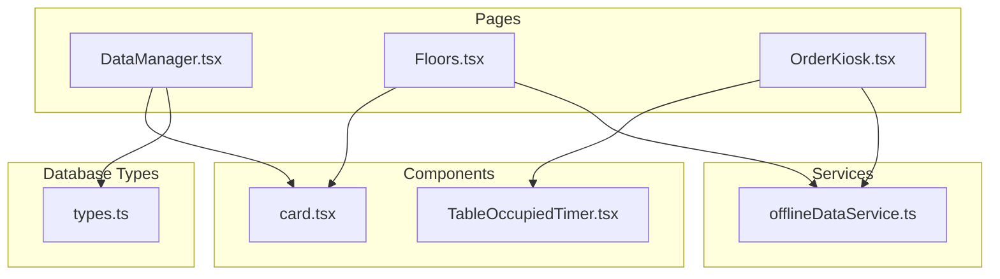
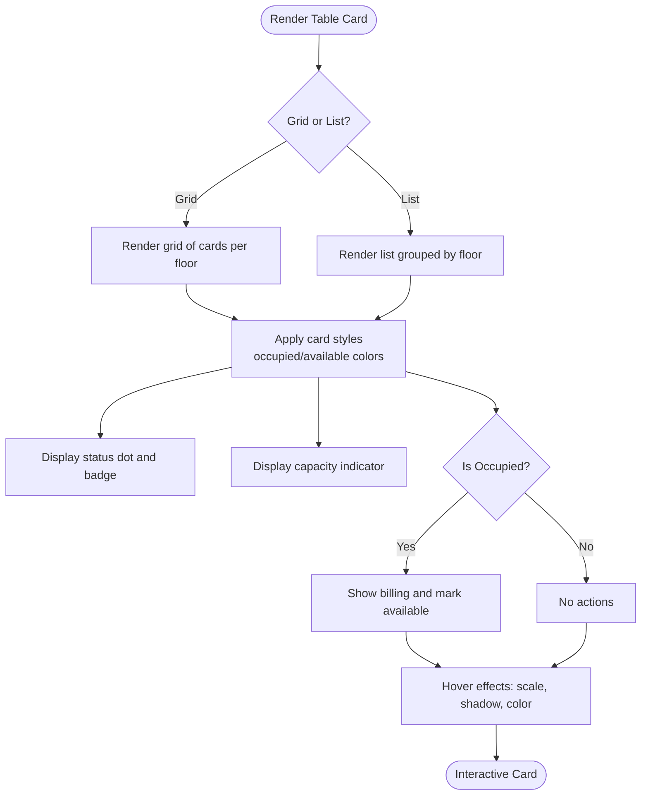
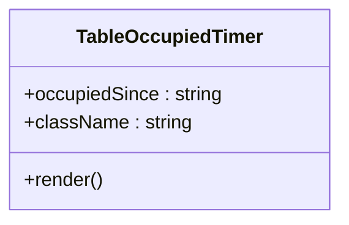
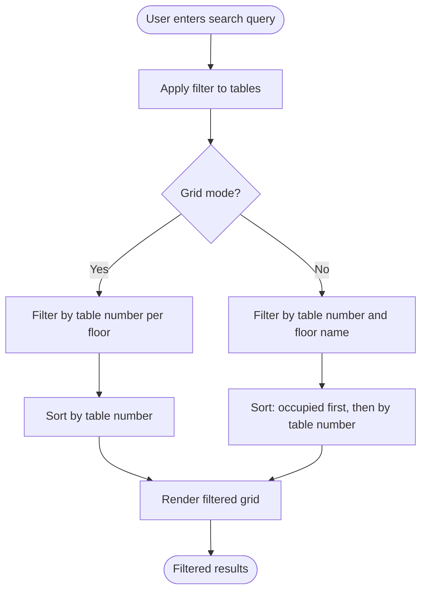
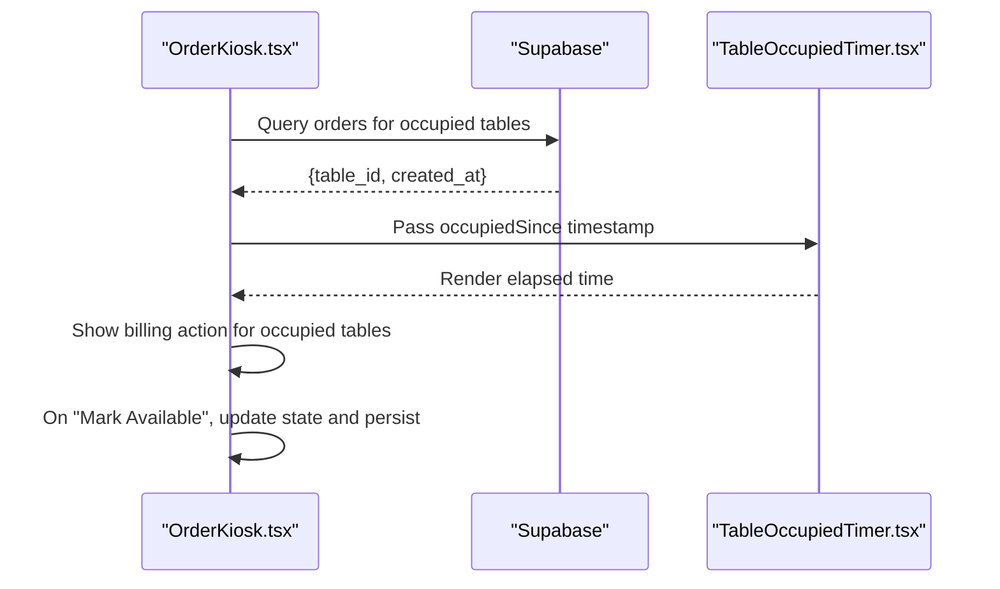
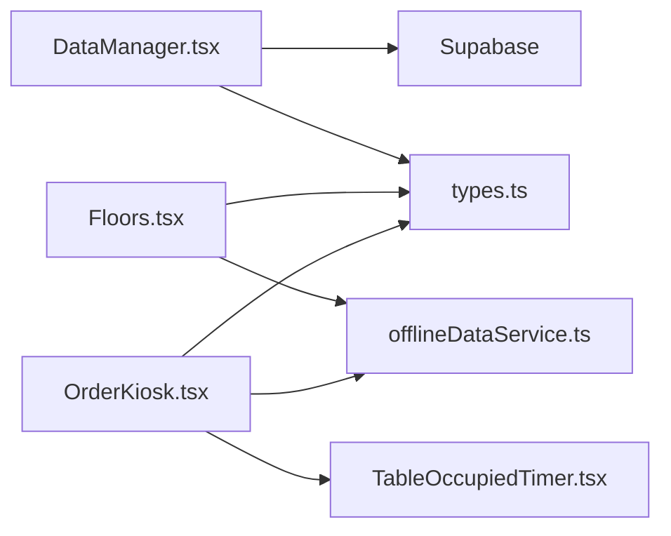

# Table Management Interface

<cite>
**Referenced Files in This Document**
- [DataManager.tsx](file://src/pages/dashboard/DataManager.tsx)
- [Floors.tsx](file://src/pages/dashboard/Floors.tsx)
- [OrderKiosk.tsx](file://src/pages/dashboard/OrderKiosk.tsx)
- [TableOccupiedTimer.tsx](file://src/components/TableOccupiedTimer.tsx)
- [types.ts](file://src/integrations/supabase/types.ts)
- [offlineDataService.ts](file://src/services/offlineDataService.ts)
- [card.tsx](file://src/components/ui/card.tsx)
</cite>

## Table of Contents
1. [Introduction](#introduction)
2. [Project Structure](#project-structure)
3. [Core Components](#core-components)
4. [Architecture Overview](#architecture-overview)
5. [Detailed Component Analysis](#detailed-component-analysis)
6. [Dependency Analysis](#dependency-analysis)
7. [Performance Considerations](#performance-considerations)
8. [Troubleshooting Guide](#troubleshooting-guide)
9. [Conclusion](#conclusion)

## Introduction
This document describes the table management interface and user interactions across the application. It covers the table card design system, visual indicators for table status (occupied/available), capacity displays, and interactive elements. It documents the table creation workflow, including table number formatting, capacity settings, and floor assignment. It explains the table editing interface, delete confirmation processes, and bulk table management operations. It includes examples of table grid layouts, responsive design considerations, hover states for table actions, table sorting mechanisms, search functionality, and integration with order management for table-based operations.

## Project Structure
The table management functionality spans several pages and shared components:
- DataManager provides a generic data table editor for administrative tasks, including tables.
- Floors manages floor and table creation/editing with a grid-based UI.
- OrderKiosk integrates tables with order management, displaying real-time status and enabling actions like billing and marking tables available.
- TableOccupiedTimer shows elapsed time for occupied tables.
- offlineDataService enables offline-first operations for tables and floors.
- Shared UI components (Card) provide consistent styling.



**Diagram sources**
- [DataManager.tsx:1-615](file://src/pages/dashboard/DataManager.tsx#L1-L615)
- [Floors.tsx:1-559](file://src/pages/dashboard/Floors.tsx#L1-L559)
- [OrderKiosk.tsx:1-2086](file://src/pages/dashboard/OrderKiosk.tsx#L1-L2086)
- [TableOccupiedTimer.tsx:1-51](file://src/components/TableOccupiedTimer.tsx#L1-L51)
- [offlineDataService.ts:1-769](file://src/services/offlineDataService.ts#L1-L769)
- [types.ts:613-647](file://src/integrations/supabase/types.ts#L613-L647)
- [card.tsx:1-44](file://src/components/ui/card.tsx#L1-L44)

**Section sources**
- [DataManager.tsx:1-615](file://src/pages/dashboard/DataManager.tsx#L1-L615)
- [Floors.tsx:1-559](file://src/pages/dashboard/Floors.tsx#L1-L559)
- [OrderKiosk.tsx:1-2086](file://src/pages/dashboard/OrderKiosk.tsx#L1-L2086)
- [TableOccupiedTimer.tsx:1-51](file://src/components/TableOccupiedTimer.tsx#L1-L51)
- [offlineDataService.ts:1-769](file://src/services/offlineDataService.ts#L1-L769)
- [types.ts:613-647](file://src/integrations/supabase/types.ts#L613-L647)
- [card.tsx:1-44](file://src/components/ui/card.tsx#L1-L44)

## Core Components
- Table card design system: Grid/list views with consistent styling, status badges, capacity indicators, and action buttons.
- Status indicators: Visual dots, status badges, and timers for occupied tables.
- Interactive elements: Hover scaling, pulse animation for occupied tables, and action buttons for billing and marking available.
- Table creation/editing: Dedicated dialogs for adding floors and tables, with validation and offline mutations.
- Search and sorting: Table search by number/floor and sorting within list/grid modes.
- Order integration: Occupancy tracking, bill generation, and quick availability actions.

**Section sources**
- [OrderKiosk.tsx:1174-1349](file://src/pages/dashboard/OrderKiosk.tsx#L1174-L1349)
- [Floors.tsx:197-246](file://src/pages/dashboard/Floors.tsx#L197-L246)
- [TableOccupiedTimer.tsx:9-50](file://src/components/TableOccupiedTimer.tsx#L9-L50)

## Architecture Overview
The table management system integrates multiple layers:
- Data access: Supabase for online, offlineDataService for offline/local modes.
- UI: Grid/list views with responsive breakpoints, hover states, and action overlays.
- Business logic: Table occupancy, search filtering, and order-based actions.
- Persistence: Offline mutations for tables and floors, with soft deletes and pending sync.

```mermaid
sequenceDiagram
participant User as "User"
participant OK as "OrderKiosk.tsx"
participant OFF as "offlineDataService.ts"
participant DB as "SQLite/Electron"
participant SB as "Supabase"
User->>OK : Click "Mark Available"
OK->>OFF : offlineMutate("tables", {id, is_occupied : false})
alt Electron/LAN mode
OFF->>DB : upsert tables with pending_sync
DB-->>OFF : success
else Web mode
OFF->>SB : update tables set is_occupied=false
SB-->>OFF : success
end
OFF-->>OK : {data, pendingSync}
OK->>OK : Update local state (floors.tables[].is_occupied)
OK-->>User : Table now shows Available
```

**Diagram sources**
- [OrderKiosk.tsx:1007-1055](file://src/pages/dashboard/OrderKiosk.tsx#L1007-L1055)
- [offlineDataService.ts:220-287](file://src/services/offlineDataService.ts#L220-L287)

## Detailed Component Analysis

### Table Card Design System
- Grid/List views: Two presentation modes with consistent styling and responsive breakpoints.
- Status indicators: Small colored dot (pulse for occupied), status badges ("Occupied"/"Available"), and optional timer for occupied tables.
- Capacity display: Users icon plus seat count below the table number.
- Action buttons: Billing printer and "Mark Available" appear when occupied.
- Hover states: Scale transform, elevation shadows, and color transitions for interactive feedback.



**Diagram sources**
- [OrderKiosk.tsx:1174-1349](file://src/pages/dashboard/OrderKiosk.tsx#L1174-L1349)

**Section sources**
- [OrderKiosk.tsx:1174-1349](file://src/pages/dashboard/OrderKiosk.tsx#L1174-L1349)

### Visual Indicators for Table Status
- Dot indicator: Positioned at top-right of each card; solid green for available, pulsing red for occupied.
- Status badge: Displays "Available" or "Occupied" with appropriate color scheme.
- Timer: For occupied tables, shows elapsed time since occupation using TableOccupiedTimer.



**Diagram sources**
- [TableOccupiedTimer.tsx:1-51](file://src/components/TableOccupiedTimer.tsx#L1-L51)

**Section sources**
- [OrderKiosk.tsx:1230-1237](file://src/pages/dashboard/OrderKiosk.tsx#L1230-L1237)
- [OrderKiosk.tsx:1315-1322](file://src/pages/dashboard/OrderKiosk.tsx#L1315-L1322)
- [TableOccupiedTimer.tsx:9-50](file://src/components/TableOccupiedTimer.tsx#L9-L50)

### Capacity Displays and Interactive Elements
- Capacity: Shown as "X seats" under the table number.
- Interactive elements: Hover overlay appears on table cards to reveal action buttons.
- Hover states: Cards scale slightly upward, gain elevation, and change border colors.

**Section sources**
- [OrderKiosk.tsx:1226-1237](file://src/pages/dashboard/OrderKiosk.tsx#L1226-L1237)
- [OrderKiosk.tsx:1311-1322](file://src/pages/dashboard/OrderKiosk.tsx#L1311-L1322)

### Table Creation Workflow
- Floors page: Dedicated dialog to add/update floors with name and floor number.
- Tables page: Dialog to add/update tables with table number and capacity; floor selection required when creating.
- Validation: Required fields enforced before submission; numeric capacity validated.
- Offline mutations: All changes are persisted locally first, then synchronized depending on mode.

```mermaid
sequenceDiagram
participant User as "User"
participant FL as "Floors.tsx"
participant OFF as "offlineDataService.ts"
participant DB as "SQLite/Electron"
participant SB as "Supabase"
User->>FL : Open "Add Floor" dialog
User->>FL : Fill name and floor number
User->>FL : Submit
FL->>OFF : offlineMutate("floors", data)
alt Electron/LAN mode
OFF->>DB : upsert floors with pending_sync
DB-->>OFF : success
else Web mode
OFF->>SB : insert floors
SB-->>OFF : success
end
FL-->>User : Floor created and refreshed
```

**Diagram sources**
- [Floors.tsx:148-195](file://src/pages/dashboard/Floors.tsx#L148-L195)
- [offlineDataService.ts:220-287](file://src/services/offlineDataService.ts#L220-L287)

**Section sources**
- [Floors.tsx:148-195](file://src/pages/dashboard/Floors.tsx#L148-L195)
- [Floors.tsx:197-246](file://src/pages/dashboard/Floors.tsx#L197-L246)

### Table Editing Interface and Delete Confirmation
- Edit dialog: Opens when clicking the pencil icon on a table card; pre-fills current values.
- Delete confirmation: Alert dialog confirms irreversible deletion; handles soft delete in offline mode.
- Generic data editor: DataManager provides a unified table editor for administrative rows with insert/edit/delete dialogs and search/filtering.

```mermaid
sequenceDiagram
participant User as "User"
participant FL as "Floors.tsx"
participant DM as "DataManager.tsx"
participant OFF as "offlineDataService.ts"
participant DB as "SQLite/Electron"
participant SB as "Supabase"
User->>FL : Click edit table
FL->>FL : Open edit dialog with prefilled values
User->>FL : Submit edits
FL->>OFF : offlineMutate("tables", data)
alt Electron/LAN mode
OFF->>DB : upsert tables with pending_sync
else Web mode
OFF->>SB : update tables
end
User->>DM : Click delete row
DM->>DM : Show delete confirmation dialog
User->>DM : Confirm
DM->>OFF : offlineDelete("tables", id)
alt Electron/LAN mode
OFF->>DB : mark pending_delete
else Web mode
OFF->>SB : delete tables
end
```

**Diagram sources**
- [Floors.tsx:197-246](file://src/pages/dashboard/Floors.tsx#L197-L246)
- [DataManager.tsx:299-312](file://src/pages/dashboard/DataManager.tsx#L299-L312)
- [offlineDataService.ts:295-347](file://src/services/offlineDataService.ts#L295-L347)

**Section sources**
- [Floors.tsx:197-246](file://src/pages/dashboard/Floors.tsx#L197-L246)
- [DataManager.tsx:271-312](file://src/pages/dashboard/DataManager.tsx#L271-L312)

### Bulk Table Management Operations
- Bulk delete: The Floors page demonstrates confirm-based deletion for individual tables; bulk operations can be implemented similarly using batch offline mutations.
- Bulk update: DataManager supports editing multiple rows via the generic editor; bulk updates can be added by selecting multiple rows and applying changes.
- Offline-first: All bulk operations leverage offlineMutate/offlineDelete to ensure reliability and immediate feedback.

**Section sources**
- [Floors.tsx:264-278](file://src/pages/dashboard/Floors.tsx#L264-L278)
- [offlineDataService.ts:220-347](file://src/services/offlineDataService.ts#L220-L347)

### Table Sorting Mechanisms and Search Functionality
- Grid mode: Sorts tables by table number within each floor tab.
- List mode: Groups by floor, sorts occupied tables first, then by table number.
- Search: Filters tables by table number and floor name in both grid and list modes.



**Diagram sources**
- [OrderKiosk.tsx:1192-1194](file://src/pages/dashboard/OrderKiosk.tsx#L1192-L1194)
- [OrderKiosk.tsx:1268-1277](file://src/pages/dashboard/OrderKiosk.tsx#L1268-L1277)

**Section sources**
- [OrderKiosk.tsx:1192-1194](file://src/pages/dashboard/OrderKiosk.tsx#L1192-L1194)
- [OrderKiosk.tsx:1268-1277](file://src/pages/dashboard/OrderKiosk.tsx#L1268-L1277)

### Responsive Design Considerations and Hover States
- Responsive grid: Uses Tailwind grid classes with responsive breakpoints (sm, md, lg, xl) to adjust column counts.
- Hover states: Cards scale upward, elevate, and change borders on hover; action buttons fade in on hover.
- Mobile considerations: List mode prioritizes occupied-first sorting and compact layouts.

**Section sources**
- [OrderKiosk.tsx:1204-1205](file://src/pages/dashboard/OrderKiosk.tsx#L1204-L1205)
- [OrderKiosk.tsx:1289-1290](file://src/pages/dashboard/OrderKiosk.tsx#L1289-L1290)

### Integration with Order Management
- Occupancy tracking: Tracks when tables become occupied and displays elapsed time.
- Billing integration: Generates bills for occupied tables and opens billing dialog.
- Quick availability: Marks tables as available and updates state immediately.



**Diagram sources**
- [OrderKiosk.tsx:221-248](file://src/pages/dashboard/OrderKiosk.tsx#L221-L248)
- [OrderKiosk.tsx:1007-1055](file://src/pages/dashboard/OrderKiosk.tsx#L1007-L1055)
- [TableOccupiedTimer.tsx:9-50](file://src/components/TableOccupiedTimer.tsx#L9-L50)

**Section sources**
- [OrderKiosk.tsx:221-248](file://src/pages/dashboard/OrderKiosk.tsx#L221-L248)
- [OrderKiosk.tsx:1007-1055](file://src/pages/dashboard/OrderKiosk.tsx#L1007-L1055)

## Dependency Analysis
- DataManager depends on Supabase for data access and uses a generic configuration to manage multiple tables including "tables".
- Floors uses offlineDataService for all mutations and reads, enabling offline-first behavior.
- OrderKiosk integrates offlineDataService for data access and uses TableOccupiedTimer for status visualization.
- Types define the schema for tables, including capacity, floor_id, and is_occupied.



**Diagram sources**
- [DataManager.tsx:100-108](file://src/pages/dashboard/DataManager.tsx#L100-L108)
- [Floors.tsx:62-106](file://src/pages/dashboard/Floors.tsx#L62-L106)
- [OrderKiosk.tsx:164-280](file://src/pages/dashboard/OrderKiosk.tsx#L164-L280)
- [offlineDataService.ts:151-211](file://src/services/offlineDataService.ts#L151-L211)
- [types.ts:613-647](file://src/integrations/supabase/types.ts#L613-L647)

**Section sources**
- [DataManager.tsx:100-108](file://src/pages/dashboard/DataManager.tsx#L100-L108)
- [Floors.tsx:62-106](file://src/pages/dashboard/Floors.tsx#L62-L106)
- [OrderKiosk.tsx:164-280](file://src/pages/dashboard/OrderKiosk.tsx#L164-L280)
- [offlineDataService.ts:151-211](file://src/services/offlineDataService.ts#L151-L211)
- [types.ts:613-647](file://src/integrations/supabase/types.ts#L613-L647)

## Performance Considerations
- Offline-first caching: Reduces latency and improves reliability by serving data from local storage when available.
- Lazy loading: Grid/list rendering adjusts based on viewport and responsive breakpoints to minimize DOM overhead.
- Efficient filtering: Search filters operate on client-side data sets; consider virtualization for very large datasets.
- Real-time subscriptions: Order status updates subscribe only when online and active order exists.

[No sources needed since this section provides general guidance]

## Troubleshooting Guide
- Offline mode issues: Ensure offlineDataService is initialized and connectivity listeners are registered.
- Sync conflicts: Review pending sync records and resolve conflicts by re-running manual sync.
- Table not updating: Verify offlineMutate returned pendingSync and that local state reflects changes.
- Search not filtering: Confirm search query is applied to both table numbers and floor names.

**Section sources**
- [offlineDataService.ts:36-47](file://src/services/offlineDataService.ts#L36-L47)
- [offlineDataService.ts:397-541](file://src/services/offlineDataService.ts#L397-L541)
- [OrderKiosk.tsx:1007-1055](file://src/pages/dashboard/OrderKiosk.tsx#L1007-L1055)

## Conclusion
The table management interface combines a robust design system with offline-first capabilities and seamless order integration. Users benefit from responsive grid/list views, clear status indicators, and intuitive actions for managing tables. The system supports reliable creation, editing, and deletion of tables while maintaining consistency across online and offline environments.