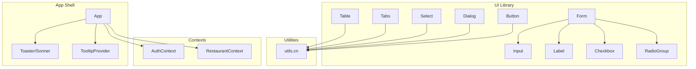
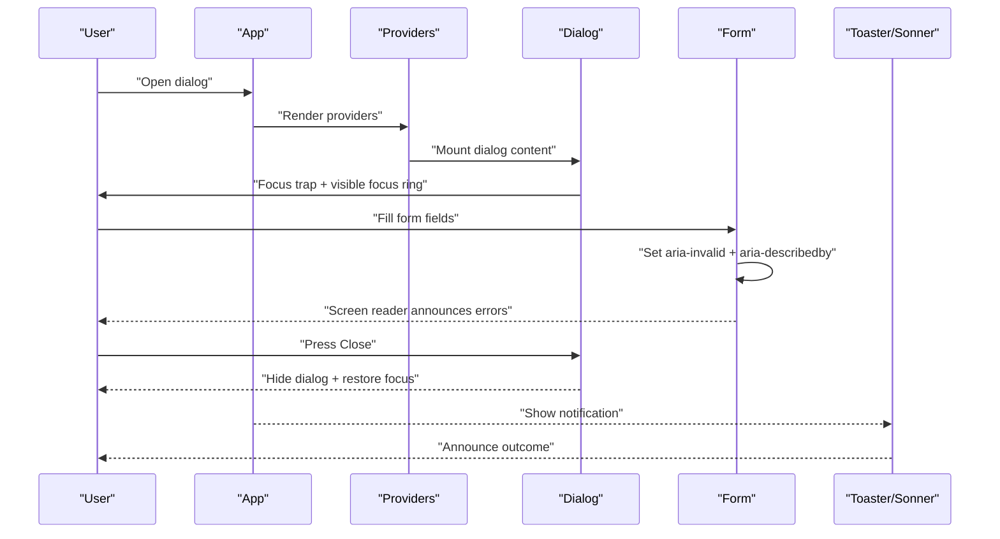
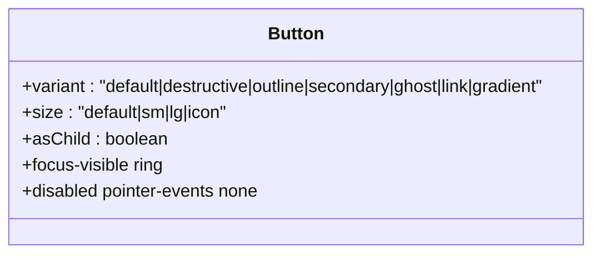
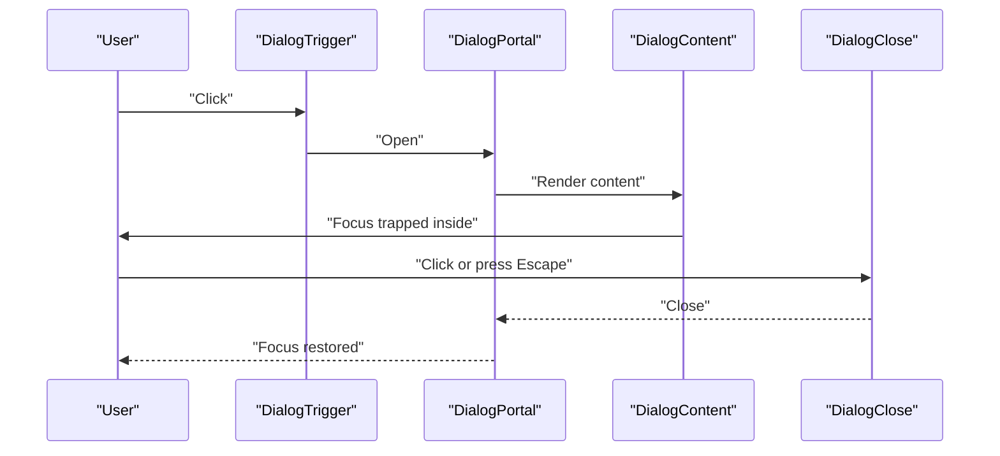
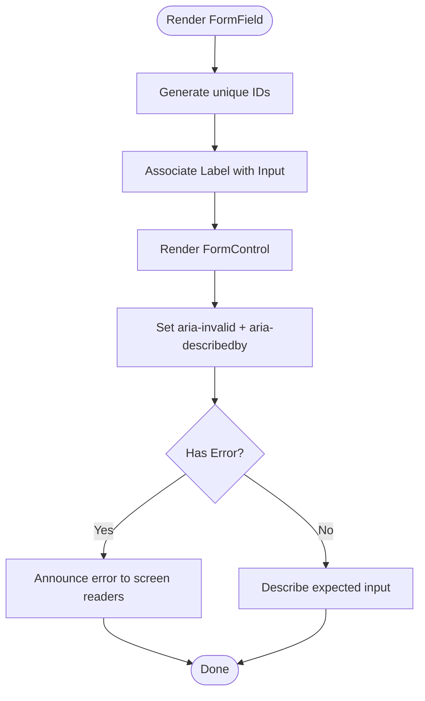
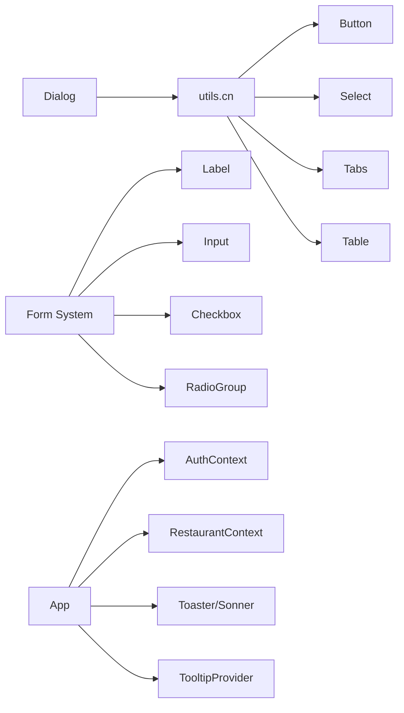

# Accessibility & UX Guidelines

<cite>
**Referenced Files in This Document**
- [button.tsx](file://src/components/ui/button.tsx)
- [dialog.tsx](file://src/components/ui/dialog.tsx)
- [form.tsx](file://src/components/ui/form.tsx)
- [input.tsx](file://src/components/ui/input.tsx)
- [select.tsx](file://src/components/ui/select.tsx)
- [label.tsx](file://src/components/ui/label.tsx)
- [checkbox.tsx](file://src/components/ui/checkbox.tsx)
- [radio-group.tsx](file://src/components/ui/radio-group.tsx)
- [tabs.tsx](file://src/components/ui/tabs.tsx)
- [table.tsx](file://src/components/ui/table.tsx)
- [utils.ts](file://src/lib/utils.ts)
- [AuthContext.tsx](file://src/contexts/AuthContext.tsx)
- [RestaurantContext.tsx](file://src/contexts/RestaurantContext.tsx)
- [use-toast.ts](file://src/hooks/use-toast.ts)
- [App.tsx](file://src/App.tsx)
</cite>

## Table of Contents
1. [Introduction](#introduction)
2. [Project Structure](#project-structure)
3. [Core Components](#core-components)
4. [Architecture Overview](#architecture-overview)
5. [Detailed Component Analysis](#detailed-component-analysis)
6. [Dependency Analysis](#dependency-analysis)
7. [Performance Considerations](#performance-considerations)
8. [Troubleshooting Guide](#troubleshooting-guide)
9. [Conclusion](#conclusion)
10. [Appendices](#appendices)

## Introduction
This document provides comprehensive accessibility and user experience guidance for TableFlow Pro components. It focuses on WCAG 2.1 success criteria, ARIA attributes, semantic HTML, keyboard navigation, focus management, screen reader compatibility, color contrast, text alternatives, interactive labeling, inclusive design patterns, cognitive accessibility, mobile usability, testing approaches, and solutions to common pitfalls in restaurant management interfaces.

## Project Structure
TableFlow Pro organizes UI primitives under a shared component library, with contexts managing global state and hooks providing reusable behaviors. Accessibility is implemented at the component level via semantic markup, ARIA attributes, focus management, and consistent keyboard interactions.

**Diagram sources**
- [button.tsx:1-49](file://src/components/ui/button.tsx#L1-L49)
- [dialog.tsx:1-96](file://src/components/ui/dialog.tsx#L1-L96)
- [form.tsx:1-130](file://src/components/ui/form.tsx#L1-L130)
- [input.tsx:1-23](file://src/components/ui/input.tsx#L1-L23)
- [select.tsx:1-144](file://src/components/ui/select.tsx#L1-L144)
- [label.tsx:1-18](file://src/components/ui/label.tsx#L1-L18)
- [checkbox.tsx:1-27](file://src/components/ui/checkbox.tsx#L1-L27)
- [radio-group.tsx:1-37](file://src/components/ui/radio-group.tsx#L1-L37)
- [tabs.tsx:1-54](file://src/components/ui/tabs.tsx#L1-L54)
- [table.tsx:1-73](file://src/components/ui/table.tsx#L1-L73)
- [utils.ts:1-7](file://src/lib/utils.ts#L1-L7)
- [AuthContext.tsx:1-141](file://src/contexts/AuthContext.tsx#L1-L141)
- [RestaurantContext.tsx:1-391](file://src/contexts/RestaurantContext.tsx#L1-L391)
- [App.tsx:1-150](file://src/App.tsx#L1-L150)

**Section sources**
- [App.tsx:108-147](file://src/App.tsx#L108-L147)

## Core Components
This section highlights how core components implement accessibility:

- Focus management and keyboard interactions are consistently applied using focus-visible outlines and ring-based focus styles.
- Semantic HTML is preserved by forwarding refs and props to native elements.
- ARIA integration is embedded where needed (e.g., dialogs, form controls).
- Utility functions merge Tailwind classes safely to avoid conflicts.

Key implementation anchors:
- Focus-visible ring and outline patterns: [button.tsx:8](file://src/components/ui/button.tsx#L8), [input.tsx:11](file://src/components/ui/input.tsx#L11), [select.tsx:20](file://src/components/ui/select.tsx#L20), [checkbox.tsx:14](file://src/components/ui/checkbox.tsx#L14), [radio-group.tsx:23](file://src/components/ui/radio-group.tsx#L23), [tabs.tsx:30](file://src/components/ui/tabs.tsx#L30), [dialog.tsx:45](file://src/components/ui/dialog.tsx#L45).
- Semantic wrappers and primitives: [button.tsx:40-46](file://src/components/ui/button.tsx#L40-L46), [input.tsx:5-19](file://src/components/ui/input.tsx#L5-L19), [select.tsx:13-31](file://src/components/ui/select.tsx#L13-L31), [checkbox.tsx:11-23](file://src/components/ui/checkbox.tsx#L11-L23), [radio-group.tsx:7-34](file://src/components/ui/radio-group.tsx#L7-L34), [tabs.tsx:8-51](file://src/components/ui/tabs.tsx#L8-L51), [table.tsx:5-72](file://src/components/ui/table.tsx#L5-L72).
- ARIA integration in forms and dialogs: [form.tsx:87-98](file://src/components/ui/form.tsx#L87-L98), [dialog.tsx:44-48](file://src/components/ui/dialog.tsx#L44-L48).

**Section sources**
- [button.tsx:8](file://src/components/ui/button.tsx#L8)
- [input.tsx:11](file://src/components/ui/input.tsx#L11)
- [select.tsx:20](file://src/components/ui/select.tsx#L20)
- [checkbox.tsx:14](file://src/components/ui/checkbox.tsx#L14)
- [radio-group.tsx:23](file://src/components/ui/radio-group.tsx#L23)
- [tabs.tsx:30](file://src/components/ui/tabs.tsx#L30)
- [dialog.tsx:45](file://src/components/ui/dialog.tsx#L45)
- [form.tsx:87-98](file://src/components/ui/form.tsx#L87-L98)
- [table.tsx:5-72](file://src/components/ui/table.tsx#L5-L72)

## Architecture Overview
Accessibility spans three layers:
- Component primitives define semantics, focus, and keyboard behavior.
- Form composition ensures ARIA integration and error labeling.
- Global providers manage focus trapping, tooltips, and notifications.

**Diagram sources**
- [App.tsx:108-147](file://src/App.tsx#L108-L147)
- [dialog.tsx:30-51](file://src/components/ui/dialog.tsx#L30-L51)
- [form.tsx:87-98](file://src/components/ui/form.tsx#L87-L98)
- [use-toast.ts:137-164](file://src/hooks/use-toast.ts#L137-L164)

**Section sources**
- [App.tsx:108-147](file://src/App.tsx#L108-L147)
- [dialog.tsx:30-51](file://src/components/ui/dialog.tsx#L30-L51)
- [form.tsx:87-98](file://src/components/ui/form.tsx#L87-L98)
- [use-toast.ts:137-164](file://src/hooks/use-toast.ts#L137-L164)

## Detailed Component Analysis

### Button
- Implements focus-visible ring and outline for keyboard users.
- Supports semantic slot pattern for anchor-like rendering.
- Maintains pointer-events disabled state for disabled buttons.

**Diagram sources**
- [button.tsx:34-46](file://src/components/ui/button.tsx#L34-L46)

**Section sources**
- [button.tsx:8](file://src/components/ui/button.tsx#L8)
- [button.tsx:40-46](file://src/components/ui/button.tsx#L40-L46)

### Dialog
- Uses Radix UI primitives for robust focus management and ARIA roles.
- Includes a visually hidden “Close” label for screen readers.
- Provides overlay and portal rendering for proper stacking and focus trapping.

**Diagram sources**
- [dialog.tsx:7-28](file://src/components/ui/dialog.tsx#L7-L28)
- [dialog.tsx:30-51](file://src/components/ui/dialog.tsx#L30-L51)
- [dialog.tsx:44-48](file://src/components/ui/dialog.tsx#L44-L48)

**Section sources**
- [dialog.tsx:44-48](file://src/components/ui/dialog.tsx#L44-L48)
- [dialog.tsx:30-51](file://src/components/ui/dialog.tsx#L30-L51)

### Form System
- Integrates with react-hook-form to generate unique IDs and wire ARIA attributes.
- Sets aria-invalid on inputs and manages aria-describedby for help/error text.
- Ensures labels are associated with inputs via htmlFor.

**Diagram sources**
- [form.tsx:33-54](file://src/components/ui/form.tsx#L33-L54)
- [form.tsx:75-82](file://src/components/ui/form.tsx#L75-L82)
- [form.tsx:85-99](file://src/components/ui/form.tsx#L85-L99)
- [form.tsx:102-109](file://src/components/ui/form.tsx#L102-L109)
- [form.tsx:111-127](file://src/components/ui/form.tsx#L111-L127)

**Section sources**
- [form.tsx:33-54](file://src/components/ui/form.tsx#L33-L54)
- [form.tsx:75-82](file://src/components/ui/form.tsx#L75-L82)
- [form.tsx:85-99](file://src/components/ui/form.tsx#L85-L99)
- [form.tsx:102-109](file://src/components/ui/form.tsx#L102-L109)
- [form.tsx:111-127](file://src/components/ui/form.tsx#L111-L127)

### Input
- Inherits native semantics and focus styles.
- Applies focus-visible ring and maintains disabled state visuals.

**Section sources**
- [input.tsx:5-19](file://src/components/ui/input.tsx#L5-L19)
- [input.tsx:11](file://src/components/ui/input.tsx#L11)

### Select
- Uses Radix UI Select primitives for accessible keyboard navigation.
- Provides focus-visible ring and scroll buttons for long lists.
- Renders item indicators and handles disabled states.

**Section sources**
- [select.tsx:13-31](file://src/components/ui/select.tsx#L13-L31)
- [select.tsx:61-91](file://src/components/ui/select.tsx#L61-L91)
- [select.tsx:101-122](file://src/components/ui/select.tsx#L101-L122)
- [select.tsx:20](file://src/components/ui/select.tsx#L20)

### Checkbox and Radio Group
- Ensures focus-visible rings and proper keyboard activation.
- Uses indicator elements for visual state feedback.

**Section sources**
- [checkbox.tsx:11-23](file://src/components/ui/checkbox.tsx#L11-L23)
- [radio-group.tsx:7-34](file://src/components/ui/radio-group.tsx#L7-L34)
- [checkbox.tsx:14](file://src/components/ui/checkbox.tsx#L14)
- [radio-group.tsx:23](file://src/components/ui/radio-group.tsx#L23)

### Tabs
- Provides accessible keyboard navigation and focus styles.
- Uses Radix UI triggers with active state styling.

**Section sources**
- [tabs.tsx:8-51](file://src/components/ui/tabs.tsx#L8-L51)
- [tabs.tsx:30](file://src/components/ui/tabs.tsx#L30)

### Table
- Wraps native table with overflow container for small screens.
- Preserves semantic header/body/footer elements and hover/selected states.

**Section sources**
- [table.tsx:5-72](file://src/components/ui/table.tsx#L5-L72)

### Utilities and Providers
- Utility merges Tailwind classes safely to prevent cascade conflicts.
- App initializes providers for tooltips, toasts, and routing.

**Section sources**
- [utils.ts:4-6](file://src/lib/utils.ts#L4-L6)
- [App.tsx:108-147](file://src/App.tsx#L108-L147)

## Dependency Analysis
Accessibility relies on consistent patterns across components and contexts.

**Diagram sources**
- [utils.ts:4-6](file://src/lib/utils.ts#L4-L6)
- [button.tsx:40-46](file://src/components/ui/button.tsx#L40-L46)
- [select.tsx:13-31](file://src/components/ui/select.tsx#L13-L31)
- [tabs.tsx:8-51](file://src/components/ui/tabs.tsx#L8-L51)
- [table.tsx:5-72](file://src/components/ui/table.tsx#L5-L72)
- [form.tsx:75-82](file://src/components/ui/form.tsx#L75-L82)
- [input.tsx:5-19](file://src/components/ui/input.tsx#L5-L19)
- [checkbox.tsx:11-23](file://src/components/ui/checkbox.tsx#L11-L23)
- [radio-group.tsx:7-34](file://src/components/ui/radio-group.tsx#L7-L34)
- [dialog.tsx:30-51](file://src/components/ui/dialog.tsx#L30-L51)
- [App.tsx:108-147](file://src/App.tsx#L108-L147)
- [AuthContext.tsx:39-132](file://src/contexts/AuthContext.tsx#L39-L132)
- [RestaurantContext.tsx:47-382](file://src/contexts/RestaurantContext.tsx#L47-L382)

**Section sources**
- [utils.ts:4-6](file://src/lib/utils.ts#L4-L6)
- [form.tsx:75-82](file://src/components/ui/form.tsx#L75-L82)
- [dialog.tsx:30-51](file://src/components/ui/dialog.tsx#L30-L51)
- [App.tsx:108-147](file://src/App.tsx#L108-L147)

## Performance Considerations
- Prefer native elements for inputs and buttons to minimize overhead.
- Use focus-visible only where necessary to reduce reflows.
- Keep ARIA attributes dynamic and scoped to avoid unnecessary DOM churn.
- Defer heavy computations off the main thread; leverage caching in contexts.

## Troubleshooting Guide
Common accessibility pitfalls and solutions:

- Missing focus indicators
  - Symptom: Keyboard users cannot see focus.
  - Solution: Ensure focus-visible ring and outline are present on interactive elements.
  - Evidence: [button.tsx:8](file://src/components/ui/button.tsx#L8), [input.tsx:11](file://src/components/ui/input.tsx#L11), [select.tsx:20](file://src/components/ui/select.tsx#L20), [checkbox.tsx:14](file://src/components/ui/checkbox.tsx#L14), [radio-group.tsx:23](file://src/components/ui/radio-group.tsx#L23), [tabs.tsx:30](file://src/components/ui/tabs.tsx#L30).

- Poor ARIA labeling
  - Symptom: Screen readers announce unexpected or missing information.
  - Solution: Use aria-invalid and aria-describedby on form controls; ensure labels are associated with inputs.
  - Evidence: [form.tsx:87-98](file://src/components/ui/form.tsx#L87-L98), [form.tsx:75-82](file://src/components/ui/form.tsx#L75-L82).

- Hidden close controls for dialogs
  - Symptom: Users cannot close dialogs with assistive technologies.
  - Solution: Provide a visible close button with a screen-reader-only label.
  - Evidence: [dialog.tsx:44-48](file://src/components/ui/dialog.tsx#L44-L48).

- Low color contrast
  - Symptom: Text or icons hard to perceive.
  - Solution: Verify foreground/background contrast ratios meet AA/AAA thresholds; adjust theme tokens accordingly.
  - Guidance: Use built-in theme tokens and validate with automated tools.

- Non-semantic tables
  - Symptom: Screen readers misinterpret tabular data.
  - Solution: Use semantic table elements and ensure headers are marked appropriately.
  - Evidence: [table.tsx:14-72](file://src/components/ui/table.tsx#L14-L72).

- Toast announcements
  - Symptom: Notifications interrupt focus flow.
  - Solution: Limit concurrent notifications and ensure they are auto-dismissing.
  - Evidence: [use-toast.ts:5-6](file://src/hooks/use-toast.ts#L5-L6), [use-toast.ts:137-164](file://src/hooks/use-toast.ts#L137-L164).

**Section sources**
- [button.tsx:8](file://src/components/ui/button.tsx#L8)
- [input.tsx:11](file://src/components/ui/input.tsx#L11)
- [select.tsx:20](file://src/components/ui/select.tsx#L20)
- [checkbox.tsx:14](file://src/components/ui/checkbox.tsx#L14)
- [radio-group.tsx:23](file://src/components/ui/radio-group.tsx#L23)
- [tabs.tsx:30](file://src/components/ui/tabs.tsx#L30)
- [form.tsx:87-98](file://src/components/ui/form.tsx#L87-L98)
- [form.tsx:75-82](file://src/components/ui/form.tsx#L75-L82)
- [dialog.tsx:44-48](file://src/components/ui/dialog.tsx#L44-L48)
- [table.tsx:14-72](file://src/components/ui/table.tsx#L14-L72)
- [use-toast.ts:5-6](file://src/hooks/use-toast.ts#L5-L6)
- [use-toast.ts:137-164](file://src/hooks/use-toast.ts#L137-L164)

## Conclusion
TableFlow Pro’s UI primitives embed accessibility by design: focus management, semantic markup, ARIA integration, and consistent keyboard interactions. By adhering to these patterns and validating with automated and manual checks, the application remains usable for all users, including those relying on assistive technologies.

## Appendices

### WCAG 2.1 Conformance Checklist (Derived from Implementation)
- Perceivable
  - Provide text alternatives for non-text content (e.g., visually hidden “Close”).
  - Ensure sufficient color contrast for text and icons.
- Operable
  - Provide focus indicators and keyboard access to all interactive controls.
  - Offer predictable navigation and avoid timing traps.
- Understandable
  - Present information and operate in ways users can understand.
  - Make error identification and help text available.
- Robust
  - Maximize compatibility with assistive technologies.

### Keyboard Navigation Patterns
- Focus order follows visual reading order and logical grouping.
- Tab navigates to interactive elements; Shift+Tab moves backward.
- Enter/Space activates primary actions; Escape closes overlays and resets forms where applicable.

### Screen Reader Compatibility
- ARIA attributes are dynamically applied to reflect state (e.g., aria-invalid, aria-describedby).
- Labels are programmatically associated with inputs.
- Dialogs provide focus trapping and clear close affordances.

### Color Contrast and Text Alternatives
- Use theme tokens to maintain consistent contrast across components.
- Provide meaningful alt text for icons and images; rely on visually hidden labels for decorative icons.

### Inclusive Design Patterns
- Provide multiple ways to complete tasks (keyboard, mouse, touch).
- Offer clear error messages and recovery pathways.
- Respect user preferences for motion and color.

### Mobile Usability
- Touch targets are adequately sized; spacing accommodates thumb zones.
- Forms are optimized for small screens with appropriate input types.
- Overlays and dialogs adapt to viewport constraints.

### Accessibility Testing Approaches
- Automated checks
  - Lighthouse, axe-core, Pa11y, or similar tools to scan for common failures.
- Manual verification
  - Keyboard-only navigation audit.
  - Screen reader testing (NVDA/JAWS/VoiceOver) for dialog flows and form validation.
  - Contrast checks with tools like WebAIM Contrast Checker.
- Regression testing
  - Add accessibility tests to CI pipelines to prevent reintroduction of regressions.

### Common Pitfalls in Restaurant Management Interfaces and Solutions
- Busy kitchen displays overwhelming users
  - Solution: Provide high-contrast modes, reduce motion, and allow pausing updates.
- Order kiosks with unclear status
  - Solution: Use persistent status indicators and announce state changes via ARIA live regions.
- Multi-step forms without clear labeling
  - Solution: Apply form composition patterns with aria-invalid and descriptive help text.
- Dialogs that obscure context
  - Solution: Ensure focus trapping and clear close affordances; provide Escape key support.
- Data tables without semantic headers
  - Solution: Use proper header cells and ensure screen readers announce column roles.