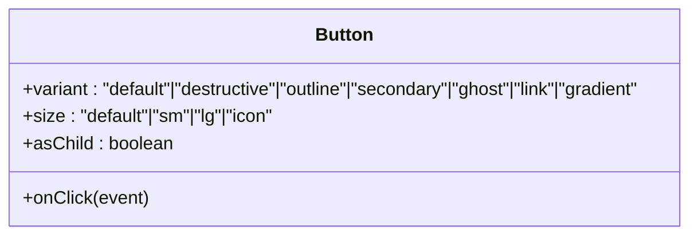
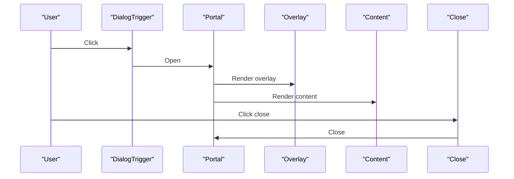
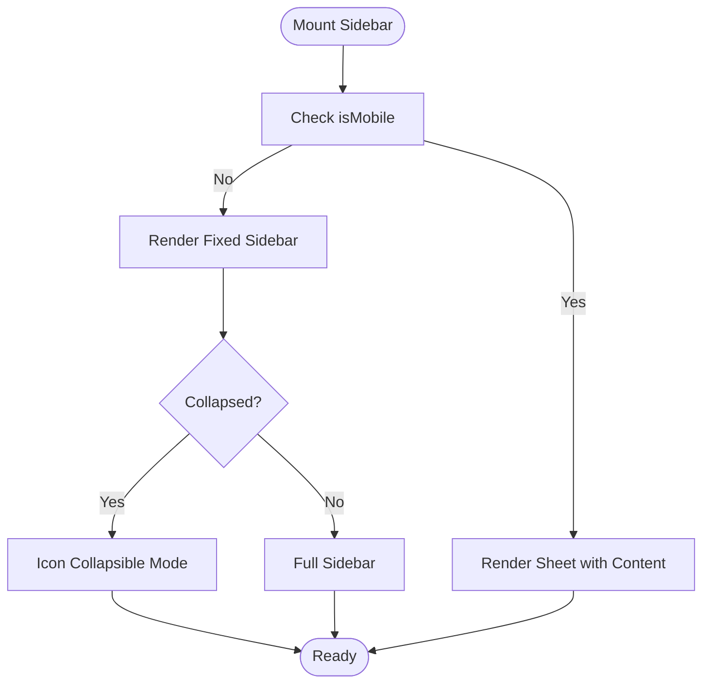
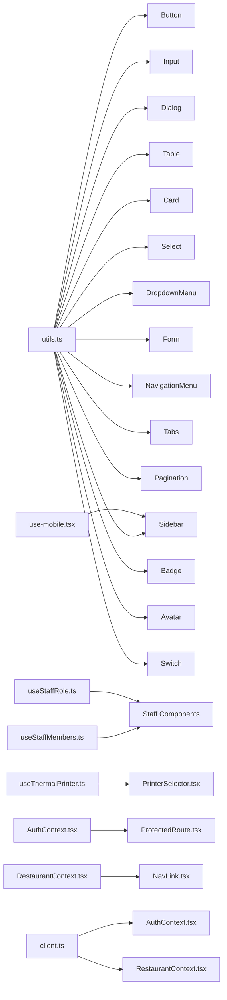

# Component Library

<cite>
**Referenced Files in This Document**
- [README.md](file://README.md)
- [button.tsx](file://src/components/ui/button.tsx)
- [input.tsx](file://src/components/ui/input.tsx)
- [dialog.tsx](file://src/components/ui/dialog.tsx)
- [table.tsx](file://src/components/ui/table.tsx)
- [card.tsx](file://src/components/ui/card.tsx)
- [select.tsx](file://src/components/ui/select.tsx)
- [dropdown-menu.tsx](file://src/components/ui/dropdown-menu.tsx)
- [form.tsx](file://src/components/ui/form.tsx)
- [navigation-menu.tsx](file://src/components/ui/navigation-menu.tsx)
- [sidebar.tsx](file://src/components/ui/sidebar.tsx)
- [tabs.tsx](file://src/components/ui/tabs.tsx)
- [pagination.tsx](file://src/components/ui/pagination.tsx)
- [badge.tsx](file://src/components/ui/badge.tsx)
- [avatar.tsx](file://src/components/ui/avatar.tsx)
- [switch.tsx](file://src/components/ui/switch.tsx)
- [accordion.tsx](file://src/components/ui/accordion.tsx)
- [alert-dialog.tsx](file://src/components/ui/alert-dialog.tsx)
- [alert.tsx](file://src/components/ui/alert.tsx)
- [aspect-ratio.tsx](file://src/components/ui/aspect-ratio.tsx)
- [calendar.tsx](file://src/components/ui/calendar.tsx)
- [carousel.tsx](file://src/components/ui/carousel.tsx)
- [chart.tsx](file://src/components/ui/chart.tsx)
- [checkbox.tsx](file://src/components/ui/checkbox.tsx)
- [collapsible.tsx](file://src/components/ui/collapsible.tsx)
- [command.tsx](file://src/components/ui/command.tsx)
- [context-menu.tsx](file://src/components/ui/context-menu.tsx)
- [drawer.tsx](file://src/components/ui/drawer.tsx)
- [hover-card.tsx](file://src/components/ui/hover-card.tsx)
- [input-otp.tsx](file://src/components/ui/input-otp.tsx)
- [label.tsx](file://src/components/ui/label.tsx)
- [menubar.tsx](file://src/components/ui/menubar.tsx)
- [popover.tsx](file://src/components/ui/popover.tsx)
- [progress.tsx](file://src/components/ui/progress.tsx)
- [radio-group.tsx](file://src/components/ui/radio-group.tsx)
- [resizable.tsx](file://src/components/ui/resizable.tsx)
- [scroll-area.tsx](file://src/components/ui/scroll-area.tsx)
- [separator.tsx](file://src/components/ui/separator.tsx)
- [sheet.tsx](file://src/components/ui/sheet.tsx)
- [skeleton.tsx](file://src/components/ui/skeleton.tsx)
- [slider.tsx](file://src/components/ui/slider.tsx)
- [sonner.tsx](file://src/components/ui/sonner.tsx)
- [textarea.tsx](file://src/components/ui/textarea.tsx)
- [toast.tsx](file://src/components/ui/toast.tsx)
- [toaster.tsx](file://src/components/ui/toaster.tsx)
- [toggle-group.tsx](file://src/components/ui/toggle-group.tsx)
- [toggle.tsx](file://src/components/ui/toggle.tsx)
- [tooltip.tsx](file://src/components/ui/tooltip.tsx)
- [use-toast.ts](file://src/components/ui/use-toast.ts)
- [ShiftScheduler.tsx](file://src/components/staff/ShiftScheduler.tsx)
- [StaffMemberCard.tsx](file://src/components/staff/StaffMemberCard.tsx)
- [StaffMemberDialog.tsx](file://src/components/staff/StaffMemberDialog.tsx)
- [DashboardLayout.tsx](file://src/components/layout/DashboardLayout.tsx)
- [TableOccupiedTimer.tsx](file://src/components/TableOccupiedTimer.tsx)
- [PrinterSelector.tsx](file://src/components/PrinterSelector.tsx)
- [ProtectedRoute.tsx](file://src/components/ProtectedRoute.tsx)
- [NavLink.tsx](file://src/components/NavLink.tsx)
- [AuthContext.tsx](file://src/contexts/AuthContext.tsx)
- [RestaurantContext.tsx](file://src/contexts/RestaurantContext.tsx)
- [use-mobile.tsx](file://src/hooks/use-mobile.tsx)
- [use-toast.ts](file://src/hooks/use-toast.ts)
- [useActiveOrderCount.ts](file://src/hooks/useActiveOrderCount.ts)
- [useStaffMembers.ts](file://src/hooks/useStaffMembers.ts)
- [useStaffRole.ts](file://src/hooks/useStaffRole.ts)
- [useThermalPrinter.ts](file://src/hooks/useThermalPrinter.ts)
- [thermalPrinter.ts](file://src/services/thermalPrinter.ts)
- [client.ts](file://src/integrations/supabase/client.ts)
- [types.ts](file://src/integrations/supabase/types.ts)
- [utils.ts](file://src/lib/utils.ts)
- [App.tsx](file://src/App.tsx)
- [index.css](file://src/index.css)
- [tailwind.config.ts](file://src/tailwind.config.ts)
- [package.json](file://package.json)
</cite>

## Table of Contents
1. [Introduction](#introduction)
2. [Project Structure](#project-structure)
3. [Core Components](#core-components)
4. [Architecture Overview](#architecture-overview)
5. [Detailed Component Analysis](#detailed-component-analysis)
6. [Dependency Analysis](#dependency-analysis)
7. [Performance Considerations](#performance-considerations)
8. [Accessibility and UX Guidelines](#accessibility-and-ux-guidelines)
9. [Customization, Theming, and Extension](#customization-theming-and-extension)
10. [Practical Usage Examples](#practical-usage-examples)
11. [Troubleshooting Guide](#troubleshooting-guide)
12. [Conclusion](#conclusion)

## Introduction
TableFlow Pro is a restaurant management application built with modern web technologies. This document describes the comprehensive component library that powers the UI, focusing on 20+ reusable UI components including buttons, inputs, forms, dialogs, tables, cards, selects, dropdown menus, navigation elements, and sidebars. It explains component composition patterns, prop interfaces, state management, accessibility features, and practical integration examples tailored to restaurant operations such as staff scheduling, order management, kitchen views, and reporting.

## Project Structure
The component library resides primarily under src/components/ui and is complemented by specialized components under src/components/staff and src/components/layout. Supporting utilities, contexts, hooks, and services provide cross-cutting concerns like theming, authentication, and printer integration.

```mermaid
graph TB
subgraph "UI Components"
UI_Button["button.tsx"]
UI_Input["input.tsx"]
UI_Dialog["dialog.tsx"]
UI_Table["table.tsx"]
UI_Card["card.tsx"]
UI_Select["select.tsx"]
UI_DD["dropdown-menu.tsx"]
UI_Form["form.tsx"]
UI_Nav["navigation-menu.tsx"]
UI_Sidebar["sidebar.tsx"]
UI_Tabs["tabs.tsx"]
UI_Pagination["pagination.tsx"]
UI_Badge["badge.tsx"]
UI_Avatar["avatar.tsx"]
UI_Switch["switch.tsx"]
UI_Others["... other UI components"]
end
subgraph "Specialized Components"
Staff_Sched["ShiftScheduler.tsx"]
Staff_Card["StaffMemberCard.tsx"]
Staff_Dialog["StaffMemberDialog.tsx"]
Layout_Dash["DashboardLayout.tsx"]
Util_Timer["TableOccupiedTimer.tsx"]
Util_Printer["PrinterSelector.tsx"]
Util_Route["ProtectedRoute.tsx"]
Util_Link["NavLink.tsx"]
end
subgraph "Supporting Modules"
Ctx_Auth["AuthContext.tsx"]
Ctx_Rest["RestaurantContext.tsx"]
Hooks_Mobile["use-mobile.tsx"]
Hooks_Staff["useStaffMembers.ts"]
Hooks_StaffRole["useStaffRole.ts"]
Hooks_Thermal["useThermalPrinter.ts"]
Hooks_UseToast["use-toast.ts"]
Services_Thermal["thermalPrinter.ts"]
Supabase_Client["client.ts"]
Supabase_Types["types.ts"]
Lib_Utils["utils.ts"]
end
UI_Button --> Lib_Utils
UI_Input --> Lib_Utils
UI_Dialog --> Lib_Utils
UI_Table --> Lib_Utils
UI_Card --> Lib_Utils
UI_Select --> Lib_Utils
UI_DD --> Lib_Utils
UI_Form --> Lib_Utils
UI_Nav --> Lib_Utils
UI_Sidebar --> Lib_Utils
UI_Tabs --> Lib_Utils
UI_Pagination --> Lib_Utils
UI_Badge --> Lib_Utils
UI_Avatar --> Lib_Utils
UI_Switch --> Lib_Utils
Staff_Sched --> Hooks_Staff
Staff_Card --> Hooks_Staff
Staff_Dialog --> Hooks_Staff
Staff_Dialog --> Hooks_StaffRole
Layout_Dash --> UI_Sidebar
Util_Timer --> Hooks_UseToast
Util_Printer --> Hooks_Thermal
Util_Route --> Ctx_Auth
Util_Link --> Ctx_Rest
Services_Thermal --> Supabase_Client
Supabase_Client --> Supabase_Types
```

**Diagram sources**
- [button.tsx:1-49](file://src/components/ui/button.tsx#L1-L49)
- [input.tsx:1-23](file://src/components/ui/input.tsx#L1-L23)
- [dialog.tsx:1-96](file://src/components/ui/dialog.tsx#L1-L96)
- [table.tsx:1-73](file://src/components/ui/table.tsx#L1-L73)
- [card.tsx:1-44](file://src/components/ui/card.tsx#L1-L44)
- [select.tsx:1-144](file://src/components/ui/select.tsx#L1-L144)
- [dropdown-menu.tsx:1-180](file://src/components/ui/dropdown-menu.tsx#L1-L180)
- [form.tsx:1-130](file://src/components/ui/form.tsx#L1-L130)
- [navigation-menu.tsx:1-121](file://src/components/ui/navigation-menu.tsx#L1-L121)
- [sidebar.tsx:1-638](file://src/components/ui/sidebar.tsx#L1-L638)
- [tabs.tsx:1-54](file://src/components/ui/tabs.tsx#L1-L54)
- [pagination.tsx:1-82](file://src/components/ui/pagination.tsx#L1-L82)
- [badge.tsx:1-30](file://src/components/ui/badge.tsx#L1-L30)
- [avatar.tsx:1-39](file://src/components/ui/avatar.tsx#L1-L39)
- [switch.tsx:1-28](file://src/components/ui/switch.tsx#L1-L28)
- [ShiftScheduler.tsx](file://src/components/staff/ShiftScheduler.tsx)
- [StaffMemberCard.tsx](file://src/components/staff/StaffMemberCard.tsx)
- [StaffMemberDialog.tsx](file://src/components/staff/StaffMemberDialog.tsx)
- [DashboardLayout.tsx](file://src/components/layout/DashboardLayout.tsx)
- [TableOccupiedTimer.tsx](file://src/components/TableOccupiedTimer.tsx)
- [PrinterSelector.tsx](file://src/components/PrinterSelector.tsx)
- [ProtectedRoute.tsx](file://src/components/ProtectedRoute.tsx)
- [NavLink.tsx](file://src/components/NavLink.tsx)
- [AuthContext.tsx](file://src/contexts/AuthContext.tsx)
- [RestaurantContext.tsx](file://src/contexts/RestaurantContext.tsx)
- [use-mobile.tsx](file://src/hooks/use-mobile.tsx)
- [use-toast.ts](file://src/hooks/use-toast.ts)
- [useActiveOrderCount.ts](file://src/hooks/useActiveOrderCount.ts)
- [useStaffMembers.ts](file://src/hooks/useStaffMembers.ts)
- [useStaffRole.ts](file://src/hooks/useStaffRole.ts)
- [useThermalPrinter.ts](file://src/hooks/useThermalPrinter.ts)
- [thermalPrinter.ts](file://src/services/thermalPrinter.ts)
- [client.ts](file://src/integrations/supabase/client.ts)
- [types.ts](file://src/integrations/supabase/types.ts)
- [utils.ts](file://src/lib/utils.ts)

**Section sources**
- [README.md](file://README.md)
- [package.json](file://package.json)

## Core Components
This section summarizes the primary UI components and their roles in the restaurant management ecosystem.

- Buttons: Variants, sizes, and semantic roles for actions across the app.
- Inputs: Text inputs with consistent styling and focus behavior.
- Dialogs: Modal overlays with close controls and accessible labeling.
- Tables: Scrollable, structured data presentation with header/body/footer.
- Cards: Content containers with header/title/description/content/footer slots.
- Select/Dropdown Menus: Single/multi-selection and nested submenus.
- Forms: Integrated with react-hook-form for validation and accessibility.
- Navigation: Horizontal navigation with expandable content areas.
- Sidebar: Collapsible, responsive sidebar with menu groups and tooltips.
- Tabs: Interactive tabbed content areas.
- Pagination: Page navigation with accessible labels.
- Badges: Status indicators with color variants.
- Avatars: User placeholders with fallbacks.
- Switches: Binary toggles with accessible states.

**Section sources**
- [button.tsx:1-49](file://src/components/ui/button.tsx#L1-L49)
- [input.tsx:1-23](file://src/components/ui/input.tsx#L1-L23)
- [dialog.tsx:1-96](file://src/components/ui/dialog.tsx#L1-L96)
- [table.tsx:1-73](file://src/components/ui/table.tsx#L1-L73)
- [card.tsx:1-44](file://src/components/ui/card.tsx#L1-L44)
- [select.tsx:1-144](file://src/components/ui/select.tsx#L1-L144)
- [dropdown-menu.tsx:1-180](file://src/components/ui/dropdown-menu.tsx#L1-L180)
- [form.tsx:1-130](file://src/components/ui/form.tsx#L1-L130)
- [navigation-menu.tsx:1-121](file://src/components/ui/navigation-menu.tsx#L1-L121)
- [sidebar.tsx:1-638](file://src/components/ui/sidebar.tsx#L1-L638)
- [tabs.tsx:1-54](file://src/components/ui/tabs.tsx#L1-L54)
- [pagination.tsx:1-82](file://src/components/ui/pagination.tsx#L1-L82)
- [badge.tsx:1-30](file://src/components/ui/badge.tsx#L1-L30)
- [avatar.tsx:1-39](file://src/components/ui/avatar.tsx#L1-L39)
- [switch.tsx:1-28](file://src/components/ui/switch.tsx#L1-L28)

## Architecture Overview
The component library follows a modular, theme-aware design using Tailwind CSS and Radix UI primitives. Components expose consistent props and leverage composition patterns for extensibility. Contexts and hooks manage global state (authentication, restaurant data) and device-specific behavior (mobile sidebar). Specialized components integrate with Supabase for data persistence and with thermal printers for receipts.

```mermaid
graph TB
App["App.tsx"]
Theme["Tailwind Config<br/>index.css"]
Utils["utils.ts"]
subgraph "UI Layer"
Btn["Button"]
Inp["Input"]
Dlg["Dialog"]
Tbl["Table"]
Crd["Card"]
Sel["Select"]
DD["DropdownMenu"]
Frm["Form"]
Nav["NavigationMenu"]
Sb["Sidebar"]
Tb["Tabs"]
Pg["Pagination"]
Bd["Badge"]
Av["Avatar"]
Sw["Switch"]
end
subgraph "Specialized Layer"
Dash["DashboardLayout"]
Staff["Staff Components"]
Timer["TableOccupiedTimer"]
Printer["PrinterSelector"]
Route["ProtectedRoute"]
Link["NavLink"]
end
subgraph "Services"
Auth["AuthContext"]
Rest["RestaurantContext"]
Supa["Supabase Client"]
Thermal["Thermal Printer Service"]
end
App --> Theme
App --> Utils
App --> Btn
App --> Inp
App --> Dlg
App --> Tbl
App --> Crd
App --> Sel
App --> DD
App --> Frm
App --> Nav
App --> Sb
App --> Tb
App --> Pg
App --> Bd
App --> Av
App --> Sw
Dash --> Sb
Staff --> Auth
Staff --> Rest
Timer --> Thermal
Printer --> Thermal
Route --> Auth
Link --> Rest
Supa --> Auth
Supa --> Rest
```

**Diagram sources**
- [App.tsx](file://src/App.tsx)
- [tailwind.config.ts](file://src/tailwind.config.ts)
- [index.css](file://src/index.css)
- [utils.ts](file://src/lib/utils.ts)
- [button.tsx:1-49](file://src/components/ui/button.tsx#L1-L49)
- [input.tsx:1-23](file://src/components/ui/input.tsx#L1-L23)
- [dialog.tsx:1-96](file://src/components/ui/dialog.tsx#L1-L96)
- [table.tsx:1-73](file://src/components/ui/table.tsx#L1-L73)
- [card.tsx:1-44](file://src/components/ui/card.tsx#L1-L44)
- [select.tsx:1-144](file://src/components/ui/select.tsx#L1-L144)
- [dropdown-menu.tsx:1-180](file://src/components/ui/dropdown-menu.tsx#L1-L180)
- [form.tsx:1-130](file://src/components/ui/form.tsx#L1-L130)
- [navigation-menu.tsx:1-121](file://src/components/ui/navigation-menu.tsx#L1-L121)
- [sidebar.tsx:1-638](file://src/components/ui/sidebar.tsx#L1-L638)
- [tabs.tsx:1-54](file://src/components/ui/tabs.tsx#L1-L54)
- [pagination.tsx:1-82](file://src/components/ui/pagination.tsx#L1-L82)
- [badge.tsx:1-30](file://src/components/ui/badge.tsx#L1-L30)
- [avatar.tsx:1-39](file://src/components/ui/avatar.tsx#L1-L39)
- [switch.tsx:1-28](file://src/components/ui/switch.tsx#L1-L28)
- [DashboardLayout.tsx](file://src/components/layout/DashboardLayout.tsx)
- [ShiftScheduler.tsx](file://src/components/staff/ShiftScheduler.tsx)
- [StaffMemberCard.tsx](file://src/components/staff/StaffMemberCard.tsx)
- [StaffMemberDialog.tsx](file://src/components/staff/StaffMemberDialog.tsx)
- [TableOccupiedTimer.tsx](file://src/components/TableOccupiedTimer.tsx)
- [PrinterSelector.tsx](file://src/components/PrinterSelector.tsx)
- [ProtectedRoute.tsx](file://src/components/ProtectedRoute.tsx)
- [NavLink.tsx](file://src/components/NavLink.tsx)
- [AuthContext.tsx](file://src/contexts/AuthContext.tsx)
- [RestaurantContext.tsx](file://src/contexts/RestaurantContext.tsx)
- [client.ts](file://src/integrations/supabase/client.ts)
- [thermalPrinter.ts](file://src/services/thermalPrinter.ts)

## Detailed Component Analysis

### Button
- Purpose: Primary action element with consistent styling and behavior.
- Props: Inherits standard button attributes plus variant, size, and asChild.
- Variants: default, destructive, outline, secondary, ghost, link, gradient.
- Sizes: default, sm, lg, icon.
- Accessibility: Focus-visible ring, disabled state handled.

**Diagram sources**
- [button.tsx:34-46](file://src/components/ui/button.tsx#L34-L46)

**Section sources**
- [button.tsx:1-49](file://src/components/ui/button.tsx#L1-L49)

### Input
- Purpose: Text input with consistent focus styles and placeholder handling.
- Props: Standard input attributes plus className.
- Accessibility: Focus-visible ring, disabled state.

**Section sources**
- [input.tsx:1-23](file://src/components/ui/input.tsx#L1-L23)

### Dialog
- Purpose: Modal overlay with portal rendering and close controls.
- Parts: Root, Trigger, Portal, Close, Overlay, Content, Header, Footer, Title, Description.
- Accessibility: Close button with screen reader label, overlay animations.

**Diagram sources**
- [dialog.tsx:7-52](file://src/components/ui/dialog.tsx#L7-L52)

**Section sources**
- [dialog.tsx:1-96](file://src/components/ui/dialog.tsx#L1-L96)

### Table
- Purpose: Structured data display with responsive wrapper.
- Parts: Table, TableHeader, TableBody, TableFooter, TableRow, TableHead, TableCell, TableCaption.
- States: selected row via data-state.

**Section sources**
- [table.tsx:1-73](file://src/components/ui/table.tsx#L1-L73)

### Card
- Purpose: Content container with standardized header/title/description/content/footer.
- Accessibility: Semantic headings and paragraphs.

**Section sources**
- [card.tsx:1-44](file://src/components/ui/card.tsx#L1-L44)

### Select
- Purpose: Single/multi-selection dropdown with scrollable viewport and icons.
- Parts: Root, Group, Value, Trigger, Content, Label, Item, Separator, ScrollUp/DownButton.
- Accessibility: Keyboard navigation, focus management, indicator for selected item.

**Section sources**
- [select.tsx:1-144](file://src/components/ui/select.tsx#L1-L144)

### Dropdown Menu
- Purpose: Contextual menus with submenus, checkboxes, radios, and shortcuts.
- Parts: Root, Trigger, Portal, Sub, SubContent, SubTrigger, Content, Item variants, Label, Separator, Shortcut, RadioGroup.

**Section sources**
- [dropdown-menu.tsx:1-180](file://src/components/ui/dropdown-menu.tsx#L1-L180)

### Form
- Purpose: Integration with react-hook-form for validation and accessibility.
- Parts: Form (FormProvider), FormField, FormItem, FormLabel, FormControl, FormDescription, FormMessage.
- Accessibility: Dynamic aria-describedby, aria-invalid, and generated IDs.

**Section sources**
- [form.tsx:1-130](file://src/components/ui/form.tsx#L1-L130)

### Navigation Menu
- Purpose: Horizontal navigation with animated dropdown content.
- Parts: Root, List, Item, Trigger, Content, Link, Indicator, Viewport.

**Section sources**
- [navigation-menu.tsx:1-121](file://src/components/ui/navigation-menu.tsx#L1-L121)

### Sidebar
- Purpose: Responsive sidebar with collapsible variants, rail, and menu components.
- Props: side, variant, collapsible.
- Features: Cookie-persisted state, keyboard shortcut, mobile off-canvas, tooltips, menu groups/buttons/actions/badges/submenus.
- Accessibility: Screen reader labels, focus management, keyboard toggling.

**Diagram sources**
- [sidebar.tsx:131-216](file://src/components/ui/sidebar.tsx#L131-L216)

**Section sources**
- [sidebar.tsx:1-638](file://src/components/ui/sidebar.tsx#L1-L638)

### Tabs
- Purpose: Tabbed content switching with accessible triggers.
- Parts: Root, List, Trigger, Content.

**Section sources**
- [tabs.tsx:1-54](file://src/components/ui/tabs.tsx#L1-L54)

### Pagination
- Purpose: Page navigation with Previous/Next links and ellipsis.
- Props: size, isActive, aria-labels.

**Section sources**
- [pagination.tsx:1-82](file://src/components/ui/pagination.tsx#L1-L82)

### Badge
- Purpose: Status badges with color variants.
- Props: variant.

**Section sources**
- [badge.tsx:1-30](file://src/components/ui/badge.tsx#L1-L30)

### Avatar
- Purpose: User avatar with image and fallback.
- Parts: Root, Image, Fallback.

**Section sources**
- [avatar.tsx:1-39](file://src/components/ui/avatar.tsx#L1-L39)

### Switch
- Purpose: Toggle switch with accessible states.
- Props: Controlled via radix-ui.

**Section sources**
- [switch.tsx:1-28](file://src/components/ui/switch.tsx#L1-L28)

### Additional UI Components
The library includes many more components such as Accordion, Alert/AlertDialog, AspectRatio, Calendar, Carousel, Chart, Checkbox, Collapsible, Command, ContextMenu, Drawer, HoverCard, InputOTP, Label, Menubar, Popover, Progress, RadioGroup, Resizable, ScrollArea, Separator, Sheet, Skeleton, Slider, Sonner, Textarea, Toast/Toaster, Toggle/ToggleGroup, and Tooltip. Each follows similar patterns of composition, variant props, and accessibility.

**Section sources**
- [accordion.tsx](file://src/components/ui/accordion.tsx)
- [alert-dialog.tsx](file://src/components/ui/alert-dialog.tsx)
- [alert.tsx](file://src/components/ui/alert.tsx)
- [aspect-ratio.tsx](file://src/components/ui/aspect-ratio.tsx)
- [calendar.tsx](file://src/components/ui/calendar.tsx)
- [carousel.tsx](file://src/components/ui/carousel.tsx)
- [chart.tsx](file://src/components/ui/chart.tsx)
- [checkbox.tsx](file://src/components/ui/checkbox.tsx)
- [collapsible.tsx](file://src/components/ui/collapsible.tsx)
- [command.tsx](file://src/components/ui/command.tsx)
- [context-menu.tsx](file://src/components/ui/context-menu.tsx)
- [drawer.tsx](file://src/components/ui/drawer.tsx)
- [hover-card.tsx](file://src/components/ui/hover-card.tsx)
- [input-otp.tsx](file://src/components/ui/input-otp.tsx)
- [label.tsx](file://src/components/ui/label.tsx)
- [menubar.tsx](file://src/components/ui/menubar.tsx)
- [popover.tsx](file://src/components/ui/popover.tsx)
- [progress.tsx](file://src/components/ui/progress.tsx)
- [radio-group.tsx](file://src/components/ui/radio-group.tsx)
- [resizable.tsx](file://src/components/ui/resizable.tsx)
- [scroll-area.tsx](file://src/components/ui/scroll-area.tsx)
- [separator.tsx](file://src/components/ui/separator.tsx)
- [sheet.tsx](file://src/components/ui/sheet.tsx)
- [skeleton.tsx](file://src/components/ui/skeleton.tsx)
- [slider.tsx](file://src/components/ui/slider.tsx)
- [sonner.tsx](file://src/components/ui/sonner.tsx)
- [textarea.tsx](file://src/components/ui/textarea.tsx)
- [toast.tsx](file://src/components/ui/toast.tsx)
- [toaster.tsx](file://src/components/ui/toaster.tsx)
- [toggle-group.tsx](file://src/components/ui/toggle-group.tsx)
- [toggle.tsx](file://src/components/ui/toggle.tsx)
- [tooltip.tsx](file://src/components/ui/tooltip.tsx)

## Dependency Analysis
Components depend on shared utilities and Radix UI primitives. The sidebar integrates with hooks for mobile detection and tooltip providers. Specialized components depend on contexts and services for authentication, restaurant data, and printer operations.

**Diagram sources**
- [utils.ts](file://src/lib/utils.ts)
- [button.tsx:1-49](file://src/components/ui/button.tsx#L1-L49)
- [input.tsx:1-23](file://src/components/ui/input.tsx#L1-L23)
- [dialog.tsx:1-96](file://src/components/ui/dialog.tsx#L1-L96)
- [table.tsx:1-73](file://src/components/ui/table.tsx#L1-L73)
- [card.tsx:1-44](file://src/components/ui/card.tsx#L1-L44)
- [select.tsx:1-144](file://src/components/ui/select.tsx#L1-L144)
- [dropdown-menu.tsx:1-180](file://src/components/ui/dropdown-menu.tsx#L1-L180)
- [form.tsx:1-130](file://src/components/ui/form.tsx#L1-L130)
- [navigation-menu.tsx:1-121](file://src/components/ui/navigation-menu.tsx#L1-L121)
- [sidebar.tsx:1-638](file://src/components/ui/sidebar.tsx#L1-L638)
- [tabs.tsx:1-54](file://src/components/ui/tabs.tsx#L1-L54)
- [pagination.tsx:1-82](file://src/components/ui/pagination.tsx#L1-L82)
- [badge.tsx:1-30](file://src/components/ui/badge.tsx#L1-L30)
- [avatar.tsx:1-39](file://src/components/ui/avatar.tsx#L1-L39)
- [switch.tsx:1-28](file://src/components/ui/switch.tsx#L1-L28)
- [use-mobile.tsx](file://src/hooks/use-mobile.tsx)
- [useStaffMembers.ts](file://src/hooks/useStaffMembers.ts)
- [useStaffRole.ts](file://src/hooks/useStaffRole.ts)
- [useThermalPrinter.ts](file://src/hooks/useThermalPrinter.ts)
- [AuthContext.tsx](file://src/contexts/AuthContext.tsx)
- [RestaurantContext.tsx](file://src/contexts/RestaurantContext.tsx)
- [client.ts](file://src/integrations/supabase/client.ts)

**Section sources**
- [utils.ts](file://src/lib/utils.ts)
- [sidebar.tsx:1-638](file://src/components/ui/sidebar.tsx#L1-L638)
- [ShiftScheduler.tsx](file://src/components/staff/ShiftScheduler.tsx)
- [StaffMemberCard.tsx](file://src/components/staff/StaffMemberCard.tsx)
- [StaffMemberDialog.tsx](file://src/components/staff/StaffMemberDialog.tsx)
- [ProtectedRoute.tsx](file://src/components/ProtectedRoute.tsx)
- [PrinterSelector.tsx](file://src/components/PrinterSelector.tsx)
- [NavLink.tsx](file://src/components/NavLink.tsx)
- [AuthContext.tsx](file://src/contexts/AuthContext.tsx)
- [RestaurantContext.tsx](file://src/contexts/RestaurantContext.tsx)
- [client.ts](file://src/integrations/supabase/client.ts)

## Performance Considerations
- Prefer variant props and className composition to minimize re-renders.
- Use lazy loading for heavy components (e.g., charts, calendars) when appropriate.
- Optimize table rendering by virtualizing rows for large datasets.
- Debounce search inputs in Select/Command components.
- Avoid unnecessary re-renders by memoizing callbacks passed to menu and form components.

## Accessibility and UX Guidelines
- Always provide labels and descriptions for dialogs, forms, and inputs.
- Ensure focus management in dialogs and modals (trap focus, return focus).
- Use semantic roles and aria-* attributes where applicable (e.g., aria-invalid, aria-describedby).
- Support keyboard navigation: Tab order, Enter/Space activation, Escape to close.
- Provide visible focus rings and high contrast states.
- Include screen reader text for decorative icons and close buttons.
- Respect reduced motion preferences via CSS media queries.

## Customization, Theming, and Extension
- Theming: Customize Tailwind colors and spacing; update tokens in the Tailwind config and index.css.
- Variants: Extend component variants using class-variance-authority; define new variants in component files.
- Composition: Build higher-order components by composing primitives (e.g., custom form fields).
- Extending Sidebar: Add new menu items, actions, and submenus; use menu button variants and tooltip props.
- Extending Forms: Wrap components with FormControl and pair with FormLabel/FormMessage for validation feedback.

**Section sources**
- [tailwind.config.ts](file://src/tailwind.config.ts)
- [index.css](file://src/index.css)
- [button.tsx:7-32](file://src/components/ui/button.tsx#L7-L32)
- [sidebar.tsx:414-434](file://src/components/ui/sidebar.tsx#L414-L434)

## Practical Usage Examples
Below are scenario-driven examples demonstrating component usage in restaurant management. Replace code blocks with your own implementation while following the referenced patterns.

- Staff Scheduling
  - Use the sidebar to navigate to the Staff page.
  - Inside the Staff page, render the shift scheduler component to manage shifts.
  - Integrate with staff members hook to fetch and update schedules.
  - Example reference: [ShiftScheduler.tsx](file://src/components/staff/ShiftScheduler.tsx), [useStaffMembers.ts](file://src/hooks/useStaffMembers.ts)

- Staff Directory
  - Display staff members in cards with avatars and roles.
  - Use the staff member dialog to edit profiles and permissions.
  - Example reference: [StaffMemberCard.tsx](file://src/components/staff/StaffMemberCard.tsx), [StaffMemberDialog.tsx](file://src/components/staff/StaffMemberDialog.tsx)

- Dashboard Navigation
  - Use the navigation menu for top-level sections (Orders, Kitchen, Reports).
  - Use the sidebar for secondary navigation (tables, floors, settings).
  - Example reference: [navigation-menu.tsx:1-121](file://src/components/ui/navigation-menu.tsx#L1-L121), [sidebar.tsx:1-638](file://src/components/ui/sidebar.tsx#L1-L638)

- Order Management
  - Use tabs to split order lists by status.
  - Use pagination to navigate large order histories.
  - Example reference: [tabs.tsx:1-54](file://src/components/ui/tabs.tsx#L1-L54), [pagination.tsx:1-82](file://src/components/ui/pagination.tsx#L1-L82)

- Kitchen View
  - Use cards to present kitchen stations and statuses.
  - Use badges to indicate order urgency.
  - Example reference: [card.tsx:1-44](file://src/components/ui/card.tsx#L1-L44), [badge.tsx:1-30](file://src/components/ui/badge.tsx#L1-L30)

- Printer Selection
  - Use the printer selector component to choose and configure thermal printers.
  - Integrate with the thermal printer service for receipt printing.
  - Example reference: [PrinterSelector.tsx](file://src/components/PrinterSelector.tsx), [thermalPrinter.ts](file://src/services/thermalPrinter.ts)

- Protected Routes
  - Wrap protected pages with the protected route component to enforce authentication.
  - Example reference: [ProtectedRoute.tsx](file://src/components/ProtectedRoute.tsx), [AuthContext.tsx](file://src/contexts/AuthContext.tsx)

- Table Occupancy Timer
  - Use the table occupancy timer to track table usage and auto-release.
  - Example reference: [TableOccupiedTimer.tsx](file://src/components/TableOccupiedTimer.tsx)

- Navigation Links
  - Use nav links to navigate between restaurant sections with active state.
  - Example reference: [NavLink.tsx](file://src/components/NavLink.tsx), [RestaurantContext.tsx](file://src/contexts/RestaurantContext.tsx)

**Section sources**
- [ShiftScheduler.tsx](file://src/components/staff/ShiftScheduler.tsx)
- [StaffMemberCard.tsx](file://src/components/staff/StaffMemberCard.tsx)
- [StaffMemberDialog.tsx](file://src/components/staff/StaffMemberDialog.tsx)
- [navigation-menu.tsx:1-121](file://src/components/ui/navigation-menu.tsx#L1-L121)
- [sidebar.tsx:1-638](file://src/components/ui/sidebar.tsx#L1-L638)
- [tabs.tsx:1-54](file://src/components/ui/tabs.tsx#L1-L54)
- [pagination.tsx:1-82](file://src/components/ui/pagination.tsx#L1-L82)
- [card.tsx:1-44](file://src/components/ui/card.tsx#L1-L44)
- [badge.tsx:1-30](file://src/components/ui/badge.tsx#L1-L30)
- [PrinterSelector.tsx](file://src/components/PrinterSelector.tsx)
- [thermalPrinter.ts](file://src/services/thermalPrinter.ts)
- [ProtectedRoute.tsx](file://src/components/ProtectedRoute.tsx)
- [AuthContext.tsx](file://src/contexts/AuthContext.tsx)
- [TableOccupiedTimer.tsx](file://src/components/TableOccupiedTimer.tsx)
- [NavLink.tsx](file://src/components/NavLink.tsx)
- [RestaurantContext.tsx](file://src/contexts/RestaurantContext.tsx)

## Troubleshooting Guide
- Dialog does not close or focus trap not working
  - Ensure Portal and Overlay are rendered and Close trigger is present.
  - Verify that the dialog is controlled via the Root/Trigger/Close APIs.
  - Reference: [dialog.tsx:7-52](file://src/components/ui/dialog.tsx#L7-L52)

- Select/Dropdown does not reflect selection
  - Confirm Value and Item selection state are synchronized.
  - Ensure ItemIndicator is visible for selected items.
  - Reference: [select.tsx:101-121](file://src/components/ui/select.tsx#L101-L121), [dropdown-menu.tsx:91-134](file://src/components/ui/dropdown-menu.tsx#L91-L134)

- Sidebar not responding to keyboard shortcut
  - Check that the keyboard handler listens for the correct key combination and meta/ctrl modifiers.
  - Reference: [sidebar.tsx:78-89](file://src/components/ui/sidebar.tsx#L78-L89)

- Form validation not announced to screen readers
  - Ensure FormMessage renders and aria-describedby includes the message ID.
  - Reference: [form.tsx:111-127](file://src/components/ui/form.tsx#L111-L127)

- Mobile sidebar not opening
  - Verify use-mobile hook detects mobile devices and openMobile state toggles.
  - Reference: [sidebar.tsx:51-76](file://src/components/ui/sidebar.tsx#L51-L76), [use-mobile.tsx](file://src/hooks/use-mobile.tsx)

**Section sources**
- [dialog.tsx:1-96](file://src/components/ui/dialog.tsx#L1-L96)
- [select.tsx:1-144](file://src/components/ui/select.tsx#L1-L144)
- [dropdown-menu.tsx:1-180](file://src/components/ui/dropdown-menu.tsx#L1-L180)
- [sidebar.tsx:1-638](file://src/components/ui/sidebar.tsx#L1-L638)
- [use-mobile.tsx](file://src/hooks/use-mobile.tsx)
- [form.tsx:1-130](file://src/components/ui/form.tsx#L1-L130)

## Conclusion
TableFlow Pro’s component library offers a cohesive, accessible, and extensible foundation for building restaurant management interfaces. By leveraging consistent composition patterns, variant props, and strong accessibility defaults, teams can rapidly assemble functional UIs while maintaining a unified design language. The included specialized components and integrations streamline common workflows such as staff management, order orchestration, and printer operations.