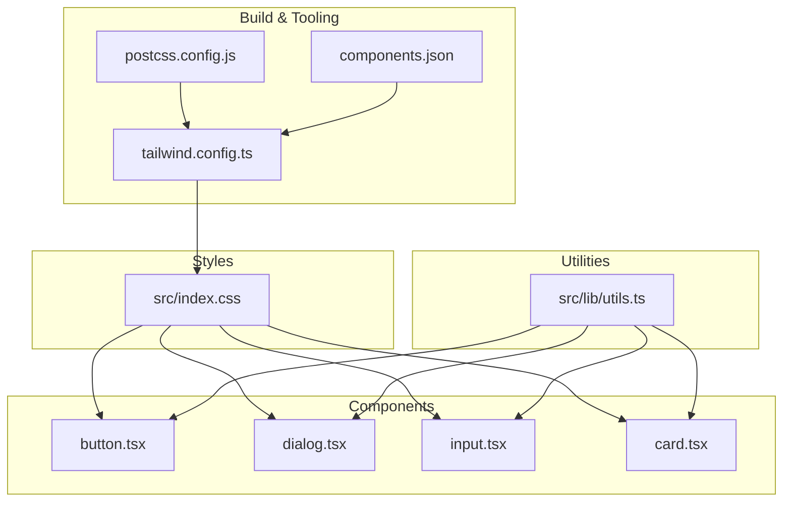
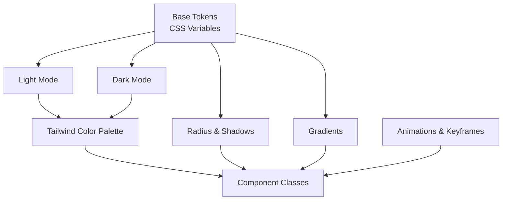
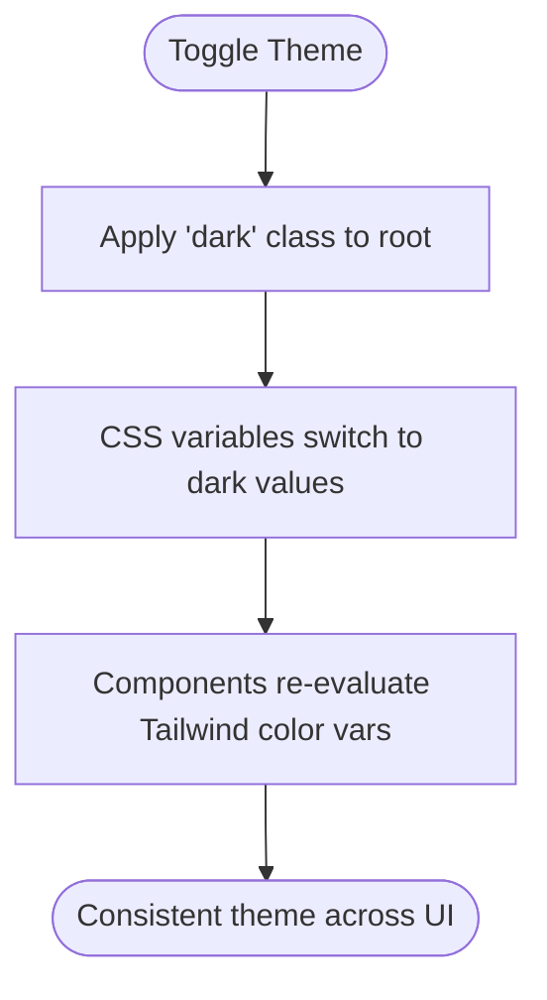
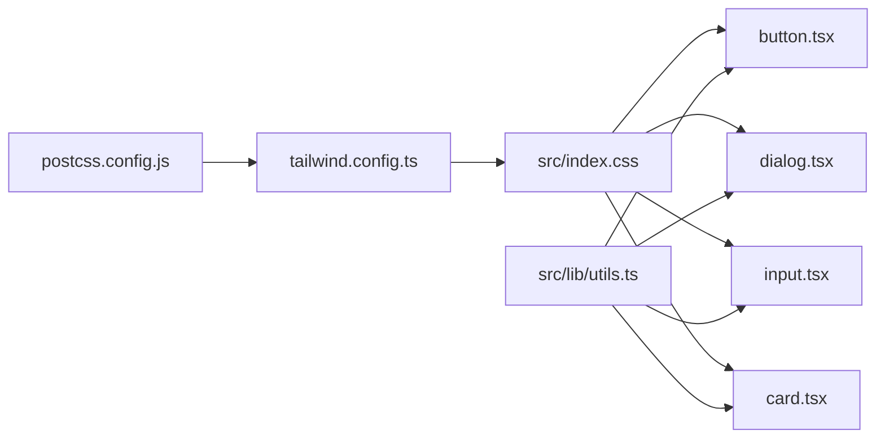

# Design System & Theming

<cite>
**Referenced Files in This Document**
- [tailwind.config.ts](file://tailwind.config.ts)
- [postcss.config.js](file://postcss.config.js)
- [src/index.css](file://src/index.css)
- [components.json](file://components.json)
- [src/lib/utils.ts](file://src/lib/utils.ts)
- [src/components/ui/button.tsx](file://src/components/ui/button.tsx)
- [src/components/ui/card.tsx](file://src/components/ui/card.tsx)
- [src/components/ui/dialog.tsx](file://src/components/ui/dialog.tsx)
- [src/components/ui/input.tsx](file://src/components/ui/input.tsx)
- [src/App.tsx](file://src/App.tsx)
- [package.json](file://package.json)
- [README.md](file://README.md)
</cite>

## Table of Contents
1. [Introduction](#introduction)
2. [Project Structure](#project-structure)
3. [Core Components](#core-components)
4. [Architecture Overview](#architecture-overview)
5. [Detailed Component Analysis](#detailed-component-analysis)
6. [Dependency Analysis](#dependency-analysis)
7. [Performance Considerations](#performance-considerations)
8. [Troubleshooting Guide](#troubleshooting-guide)
9. [Conclusion](#conclusion)
10. [Appendices](#appendices)

## Introduction
This document describes the TableFlow Pro design system and theming architecture. It explains how Tailwind CSS is configured, how design tokens are defined and consumed, how components are themed, and how dark/light mode is implemented. It also documents the color palette, typography hierarchy, spacing system, and responsive behavior, along with guidelines for maintaining design consistency and customization options.

## Project Structure
The design system is primarily driven by Tailwind CSS and a small set of CSS custom properties. The configuration ties Tailwind utilities to CSS variables, enabling a single source of truth for design tokens across light and dark modes. Components are built with utility-first classes and consume the design tokens via Tailwind’s color palette and shadow/radius extensions.

**Diagram sources**
- [postcss.config.js:1-7](file://postcss.config.js#L1-L7)
- [tailwind.config.ts:1-114](file://tailwind.config.ts#L1-L114)
- [components.json:1-21](file://components.json#L1-L21)
- [src/index.css:1-231](file://src/index.css#L1-L231)
- [src/lib/utils.ts:1-7](file://src/lib/utils.ts#L1-L7)
- [src/components/ui/button.tsx:1-49](file://src/components/ui/button.tsx#L1-L49)
- [src/components/ui/dialog.tsx:1-96](file://src/components/ui/dialog.tsx#L1-L96)
- [src/components/ui/input.tsx:1-23](file://src/components/ui/input.tsx#L1-L23)
- [src/components/ui/card.tsx:1-44](file://src/components/ui/card.tsx#L1-L44)

**Section sources**
- [postcss.config.js:1-7](file://postcss.config.js#L1-L7)
- [tailwind.config.ts:1-114](file://tailwind.config.ts#L1-L114)
- [components.json:1-21](file://components.json#L1-L21)
- [src/index.css:1-231](file://src/index.css#L1-L231)

## Core Components
- Tailwind configuration defines:
  - Dark mode strategy using a class selector.
  - Content scanning paths for purging unused styles.
  - Extended color palette mapped to CSS variables.
  - Border radius and shadow tokens mapped to CSS variables.
  - Background image gradients mapped to CSS variables.
  - Animations and keyframes for component transitions.
- CSS custom properties define:
  - Light and dark mode palettes.
  - Semantic tokens for gradients, shadows, and food/spice indicators.
  - Base layer styles and component-level utilities.
- Component libraries:
  - shadcn/ui components integrate with the design system via Tailwind classes and CSS variables.
  - Utility functions merge class names consistently.

**Section sources**
- [tailwind.config.ts:1-114](file://tailwind.config.ts#L1-L114)
- [src/index.css:1-231](file://src/index.css#L1-L231)
- [src/lib/utils.ts:1-7](file://src/lib/utils.ts#L1-L7)
- [components.json:1-21](file://components.json#L1-L21)

## Architecture Overview
The theming architecture follows a layered approach:
- Base layer: global CSS variables for colors, gradients, shadows, and radii.
- Theme layer: light and dark mode definitions under a class selector.
- Component layer: Tailwind utilities and component classes consuming the variables.
- Animation layer: Tailwind animations and keyframes extending component behavior.

**Diagram sources**
- [src/index.css:7-127](file://src/index.css#L7-L127)
- [tailwind.config.ts:15-110](file://tailwind.config.ts#L15-L110)

## Detailed Component Analysis

### Tailwind Configuration and Token Extensions
- Dark mode: enabled via class strategy.
- Content paths: scanned across pages, components, app, and src directories.
- Font family: DM Sans extended to the sans stack.
- Colors: mapped to CSS variables for all semantic roles (background, foreground, primary, secondary, destructive, success, warning, muted, accent, popover, card, sidebar).
- Border radius: mapped to a CSS variable with derived sizes.
- Box shadows: mapped to CSS variables for multiple elevations and a glow effect.
- Background images: mapped to gradient tokens.
- Animations: accordion and pulse variants, plus custom keyframes for component transitions.

**Section sources**
- [tailwind.config.ts:1-114](file://tailwind.config.ts#L1-L114)

### CSS Custom Properties and Palettes
- Light mode tokens define a warm terracotta-inspired palette with warm beige secondary, warm gold accent, and supporting success/warning colors.
- Dark mode tokens invert contrast while preserving hue families.
- Semantic tokens:
  - Gradients for primary, sidebar, and card backgrounds.
  - Shadow tokens for small, medium, large, and glow effects.
  - Food indicators (veg/non-veg/egg) and spice level tokens.
- Base layer:
  - Global border color applied to all elements.
  - Body inherits background and text colors and applies font family.
  - Headings inherit font family and weight.

**Section sources**
- [src/index.css:7-127](file://src/index.css#L7-L127)
- [src/index.css:129-143](file://src/index.css#L129-L143)

### Component Styling Patterns
- Buttons:
  - Variants include default, destructive, outline, secondary, ghost, link, and gradient.
  - Sizes include default, small, large, and icon.
  - Use semantic color tokens and shadow tokens for visual hierarchy.
- Cards:
  - Use card background and border tokens; typography tokens for titles and descriptions.
- Dialogs:
  - Overlay and content use background and shadow tokens; close button uses accent tokens.
- Inputs:
  - Use input border, background, and ring tokens; focus states apply ring tokens.

**Section sources**
- [src/components/ui/button.tsx:1-49](file://src/components/ui/button.tsx#L1-L49)
- [src/components/ui/card.tsx:1-44](file://src/components/ui/card.tsx#L1-L44)
- [src/components/ui/dialog.tsx:1-96](file://src/components/ui/dialog.tsx#L1-L96)
- [src/components/ui/input.tsx:1-23](file://src/components/ui/input.tsx#L1-L23)

### Utility Class Usage and Consistency
- Utility merging:
  - A centralized utility merges Tailwind classes safely, ensuring predictable composition.
- Component-level utilities:
  - Glass cards, status badges, and food indicators demonstrate reusable utility patterns.

**Section sources**
- [src/lib/utils.ts:1-7](file://src/lib/utils.ts#L1-L7)
- [src/index.css:145-185](file://src/index.css#L145-L185)

### Responsive Breakpoints and Typography
- Container:
  - Centered container with max width and padding; 2xl breakpoint at 1400px.
- Typography:
  - Headings inherit font family and weight; body inherits font family and color.
- Animations:
  - Slide-up, fade-in, and scale-in utilities provide micro-interactions.

**Section sources**
- [tailwind.config.ts:8-14](file://tailwind.config.ts#L8-L14)
- [src/index.css:139-143](file://src/index.css#L139-L143)
- [src/index.css:187-230](file://src/index.css#L187-L230)

### Dark/Light Mode Implementation
- Strategy:
  - Uses a class-based approach on the root element to switch themes.
- Token updates:
  - CSS variables update per mode, ensuring consistent color semantics across components.
- Sidebar and other regions:
  - Sidebar tokens are defined separately and updated per mode.

**Diagram sources**
- [src/index.css:83-126](file://src/index.css#L83-L126)
- [tailwind.config.ts:4](file://tailwind.config.ts#L4)

**Section sources**
- [src/index.css:83-126](file://src/index.css#L83-L126)
- [tailwind.config.ts:4](file://tailwind.config.ts#L4)

### Design Token System
- Color palette:
  - Semantic roles: background, foreground, primary, secondary, destructive, success, warning, muted, accent, popover, card, sidebar.
  - Food/spice indicators: veg, non-veg, egg; mild, medium, spicy, extra-spicy.
- Typography:
  - Font family: DM Sans extended to the sans stack.
- Spacing and radii:
  - Radius token mapped to CSS variable; derived sizes for lg/md/sm.
- Shadows:
  - Small, medium, large, and glow shadows mapped to CSS variables.
- Gradients:
  - Primary, sidebar, and card gradients mapped to CSS variables.

**Section sources**
- [src/index.css:7-81](file://src/index.css#L7-L81)
- [tailwind.config.ts:16-90](file://tailwind.config.ts#L16-L90)

### Component Theming Approach
- CSS variables:
  - All semantic tokens are CSS variables, enabling theme switching without rebuilding.
- Tailwind integration:
  - Tailwind color definitions resolve to CSS variables, ensuring consistent theming across utilities.
- Component props:
  - Buttons support variant and size props; dialogs and inputs rely on background, border, and ring tokens.

**Section sources**
- [tailwind.config.ts:19-74](file://tailwind.config.ts#L19-L74)
- [src/components/ui/button.tsx:7-32](file://src/components/ui/button.tsx#L7-L32)
- [src/components/ui/dialog.tsx:30-51](file://src/components/ui/dialog.tsx#L30-L51)
- [src/components/ui/input.tsx:5-17](file://src/components/ui/input.tsx#L5-L17)

### Theme Customization Options
- Brand color modifications:
  - Adjust primary and accent tokens in the base CSS variables to align with brand guidelines.
- Semantic overrides:
  - Modify success, warning, destructive tokens to reflect product-specific meanings.
- Radius and shadows:
  - Tune --radius and shadow variables to adjust visual density.
- Gradients:
  - Customize gradient tokens for branding consistency.

**Section sources**
- [src/index.css:7-81](file://src/index.css#L7-L81)
- [tailwind.config.ts:75-90](file://tailwind.config.ts#L75-L90)

### Accessibility Considerations
- Contrast:
  - Dark mode tokens invert foreground/background for readability; ensure sufficient contrast ratios for text and interactive elements.
- Focus states:
  - Ring tokens are used for focus visibility; maintain consistent focus styles across components.
- Reduced motion:
  - Base layer respects reduced motion preferences for animations.
- Semantic roles:
  - Use appropriate semantic tokens for emphasis and status indicators.

**Section sources**
- [src/index.css:134-137](file://src/index.css#L134-L137)
- [src/index.css:30-34](file://src/index.css#L30-L34)
- [src/components/ui/button.tsx:7-32](file://src/components/ui/button.tsx#L7-L32)

## Dependency Analysis
The design system depends on Tailwind CSS and PostCSS with autoprefixing. The configuration references CSS variables and enables animations. Components depend on the shared utility library for class merging.

**Diagram sources**
- [postcss.config.js:1-7](file://postcss.config.js#L1-L7)
- [tailwind.config.ts:1-114](file://tailwind.config.ts#L1-L114)
- [src/index.css:1-231](file://src/index.css#L1-L231)
- [src/lib/utils.ts:1-7](file://src/lib/utils.ts#L1-L7)
- [src/components/ui/button.tsx:1-49](file://src/components/ui/button.tsx#L1-L49)
- [src/components/ui/dialog.tsx:1-96](file://src/components/ui/dialog.tsx#L1-L96)
- [src/components/ui/input.tsx:1-23](file://src/components/ui/input.tsx#L1-L23)
- [src/components/ui/card.tsx:1-44](file://src/components/ui/card.tsx#L1-L44)

**Section sources**
- [postcss.config.js:1-7](file://postcss.config.js#L1-L7)
- [tailwind.config.ts:1-114](file://tailwind.config.ts#L1-L114)
- [package.json:17-77](file://package.json#L17-L77)

## Performance Considerations
- Purge content paths:
  - Tailwind scans pages, components, app, and src directories; ensure paths remain accurate to avoid shipping unused styles.
- CSS variables:
  - Using CSS variables reduces style recalculation overhead and improves theme switching performance.
- Animations:
  - Prefer hardware-accelerated properties and keep animation durations reasonable for smooth UX.

[No sources needed since this section provides general guidance]

## Troubleshooting Guide
- Theme not applying:
  - Verify the dark class is toggled on the root element and CSS variables update accordingly.
- Colors appear incorrect:
  - Confirm Tailwind color definitions resolve to CSS variables and that semantic tokens are set in both light and dark modes.
- Animations not working:
  - Ensure Tailwind animations and keyframes are included and that component classes reference them correctly.

**Section sources**
- [src/index.css:83-126](file://src/index.css#L83-L126)
- [tailwind.config.ts:19-110](file://tailwind.config.ts#L19-L110)

## Conclusion
TableFlow Pro’s design system centers on a robust token-driven architecture using CSS variables and Tailwind utilities. The configuration cleanly maps semantic tokens to component classes, supports seamless dark/light mode switching, and provides a scalable foundation for customization and consistency across components and pages.

[No sources needed since this section summarizes without analyzing specific files]

## Appendices

### Appendix A: Quick Reference
- Tailwind configuration highlights:
  - Dark mode class strategy.
  - Content scanning paths.
  - Extended color, radius, shadow, and gradient tokens.
- CSS variables:
  - Light and dark mode palettes.
  - Semantic tokens for gradients, shadows, and food/spice indicators.
- Component patterns:
  - Buttons, dialogs, inputs, and cards consume semantic tokens.
- Utilities:
  - Centralized class merging and reusable component utilities.

**Section sources**
- [tailwind.config.ts:1-114](file://tailwind.config.ts#L1-L114)
- [src/index.css:1-231](file://src/index.css#L1-L231)
- [src/lib/utils.ts:1-7](file://src/lib/utils.ts#L1-L7)
- [src/components/ui/button.tsx:1-49](file://src/components/ui/button.tsx#L1-L49)
- [src/components/ui/dialog.tsx:1-96](file://src/components/ui/dialog.tsx#L1-L96)
- [src/components/ui/input.tsx:1-23](file://src/components/ui/input.tsx#L1-L23)
- [src/components/ui/card.tsx:1-44](file://src/components/ui/card.tsx#L1-L44)