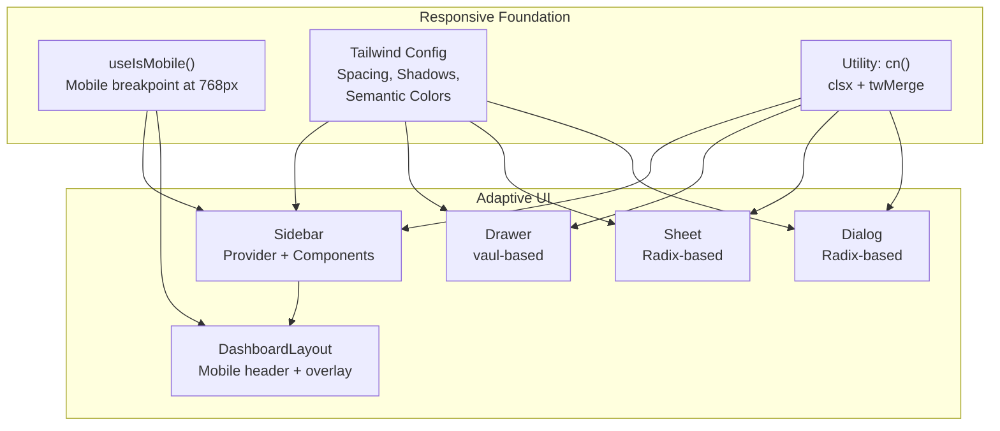
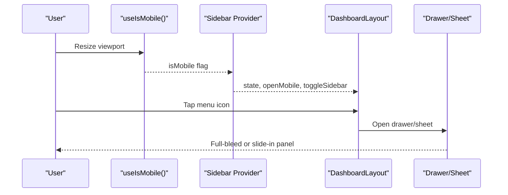
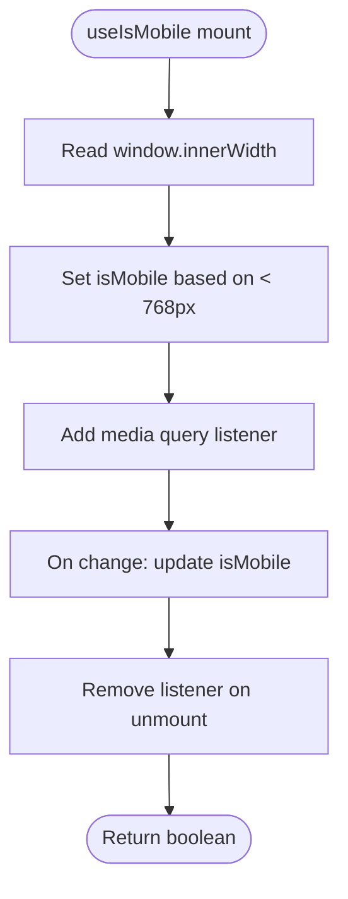
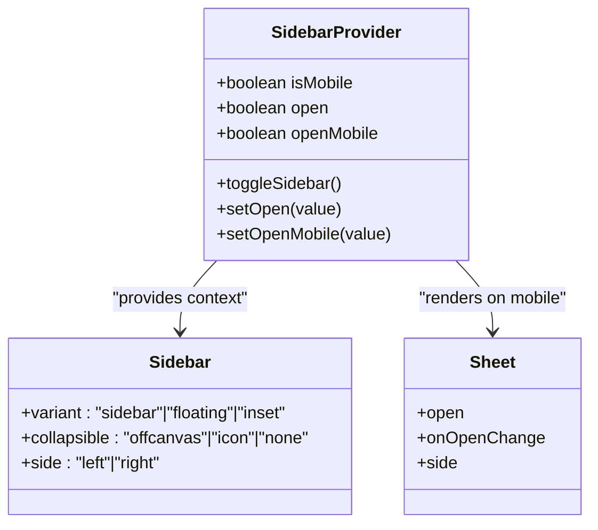
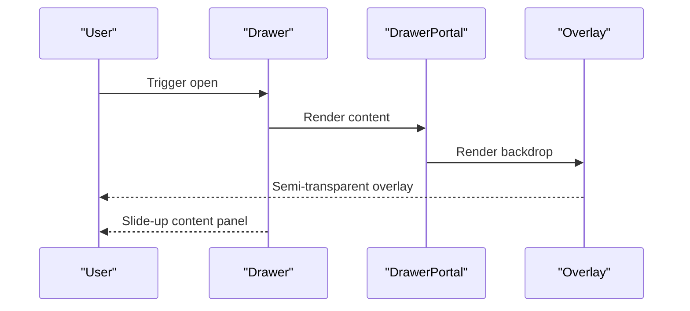
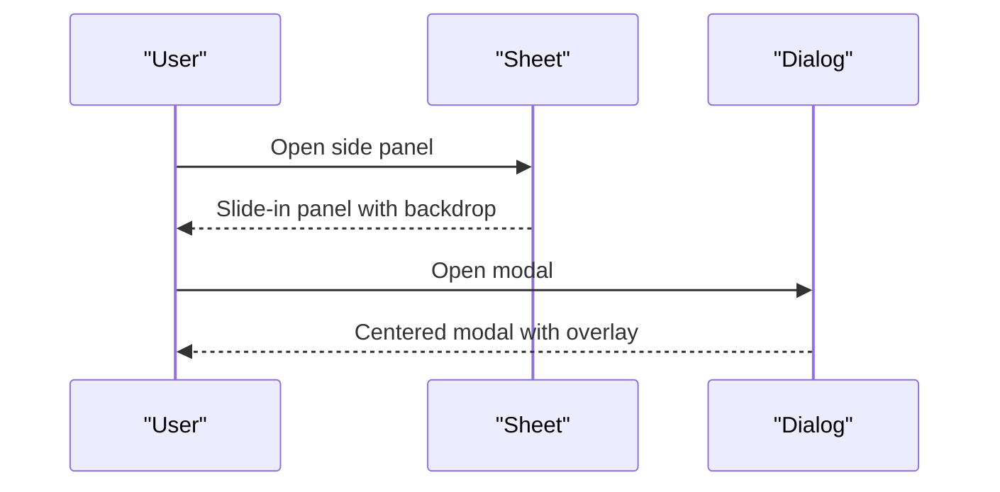
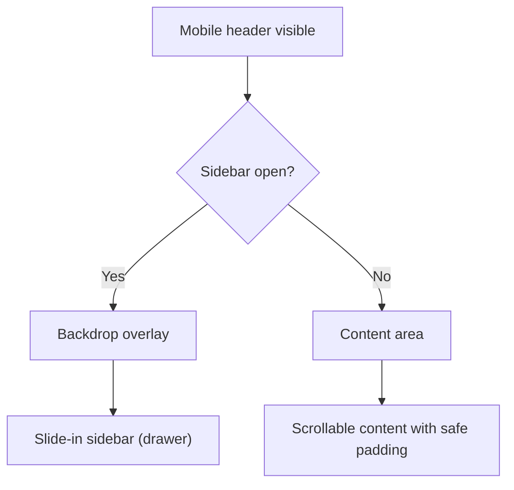
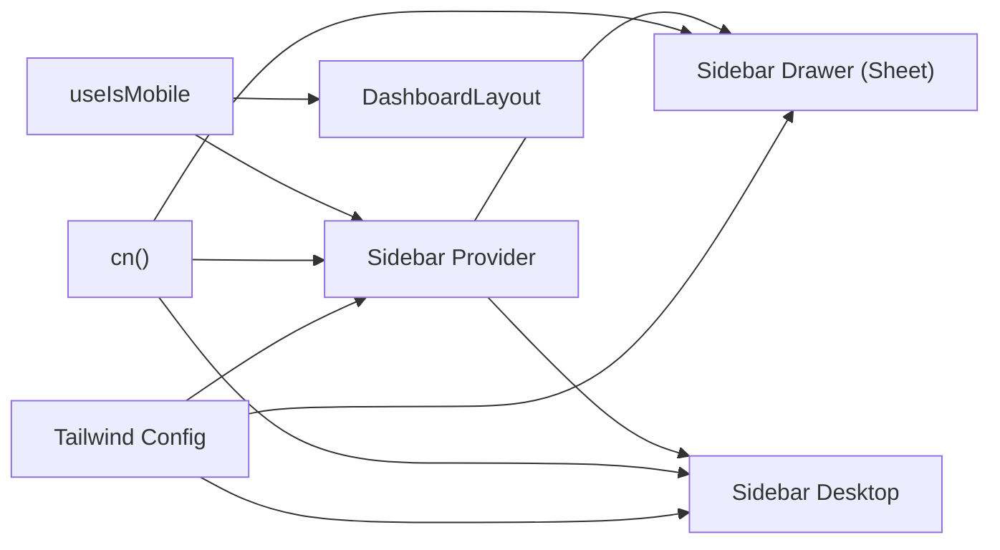

# Responsive Design & Mobile Support

<cite>
**Referenced Files in This Document**
- [use-mobile.tsx](file://src/hooks/use-mobile.tsx)
- [sidebar.tsx](file://src/components/ui/sidebar.tsx)
- [drawer.tsx](file://src/components/ui/drawer.tsx)
- [sheet.tsx](file://src/components/ui/sheet.tsx)
- [dialog.tsx](file://src/components/ui/dialog.tsx)
- [DashboardLayout.tsx](file://src/components/layout/DashboardLayout.tsx)
- [tailwind.config.ts](file://tailwind.config.ts)
- [utils.ts](file://src/lib/utils.ts)
- [index.html](file://index.html)
</cite>

## Table of Contents
1. [Introduction](#introduction)
2. [Project Structure](#project-structure)
3. [Core Components](#core-components)
4. [Architecture Overview](#architecture-overview)
5. [Detailed Component Analysis](#detailed-component-analysis)
6. [Dependency Analysis](#dependency-analysis)
7. [Performance Considerations](#performance-considerations)
8. [Troubleshooting Guide](#troubleshooting-guide)
9. [Conclusion](#conclusion)

## Introduction
This document explains how TableFlow Pro implements responsive design and mobile support. It covers the mobile-first approach, breakpoint system, adaptive component behaviors, and practical guidance for optimizing layouts across desktop, tablet, and smartphone form factors. It also documents the use of responsive utilities, mobile-specific components (drawers and sheets), touch-friendly interactions, adaptive sidebar behavior, mobile navigation patterns, gesture support, and performance considerations for mobile devices.

## Project Structure
The responsive system centers around:
- A global mobile detection hook that switches behavior below a 768px breakpoint
- A flexible sidebar component that renders as a slide-in drawer on mobile and a persistent panel on desktop
- Utility components for overlays and modals that adapt to device constraints
- Tailwind configuration extending spacing, shadows, and semantic color tokens for consistent responsive behavior

**Diagram sources**
- [use-mobile.tsx:1-20](file://src/hooks/use-mobile.tsx#L1-L20)
- [sidebar.tsx:1-638](file://src/components/ui/sidebar.tsx#L1-L638)
- [drawer.tsx:1-88](file://src/components/ui/drawer.tsx#L1-L88)
- [sheet.tsx:1-108](file://src/components/ui/sheet.tsx#L1-L108)
- [dialog.tsx:1-96](file://src/components/ui/dialog.tsx#L1-L96)
- [DashboardLayout.tsx:1-402](file://src/components/layout/DashboardLayout.tsx#L1-L402)
- [tailwind.config.ts:1-114](file://tailwind.config.ts#L1-L114)
- [utils.ts:1-7](file://src/lib/utils.ts#L1-L7)

**Section sources**
- [use-mobile.tsx:1-20](file://src/hooks/use-mobile.tsx#L1-L20)
- [tailwind.config.ts:1-114](file://tailwind.config.ts#L1-L114)
- [utils.ts:1-7](file://src/lib/utils.ts#L1-L7)

## Core Components
- Mobile detection hook: Provides a boolean signal for rendering mobile-optimized views when the viewport width is below 768px.
- Adaptive sidebar: Renders as a slide-in drawer on mobile and a persistent panel on larger screens. Uses cookies to persist expanded/collapsed state.
- Drawer: A bottom-sheet style drawer built with vaul, ideal for mobile navigation and settings panels.
- Sheet and Dialog: Radix-based overlays that adapt side placement and sizing for mobile and desktop.
- Dashboard layout: Implements a mobile header, overlay, and conditional paddings to optimize content density on small screens.

**Section sources**
- [use-mobile.tsx:1-20](file://src/hooks/use-mobile.tsx#L1-L20)
- [sidebar.tsx:1-638](file://src/components/ui/sidebar.tsx#L1-L638)
- [drawer.tsx:1-88](file://src/components/ui/drawer.tsx#L1-L88)
- [sheet.tsx:1-108](file://src/components/ui/sheet.tsx#L1-L108)
- [dialog.tsx:1-96](file://src/components/ui/dialog.tsx#L1-L96)
- [DashboardLayout.tsx:1-402](file://src/components/layout/DashboardLayout.tsx#L1-L402)

## Architecture Overview
The responsive architecture follows a mobile-first strategy:
- Mobile breakpoint at 768px drives conditional rendering for navigation and overlays
- Sidebar adapts from a slide-in drawer to a desktop sidebar
- Overlays (Drawer, Sheet, Dialog) scale content appropriately for touch targets and small screens
- Tailwind utilities and semantic tokens ensure consistent spacing and visual hierarchy

**Diagram sources**
- [use-mobile.tsx:1-20](file://src/hooks/use-mobile.tsx#L1-L20)
- [sidebar.tsx:1-638](file://src/components/ui/sidebar.tsx#L1-L638)
- [DashboardLayout.tsx:1-402](file://src/components/layout/DashboardLayout.tsx#L1-L402)
- [drawer.tsx:1-88](file://src/components/ui/drawer.tsx#L1-L88)
- [sheet.tsx:1-108](file://src/components/ui/sheet.tsx#L1-L108)

## Detailed Component Analysis

### Mobile Detection Hook
- Purpose: Detects whether the current device is considered “mobile” using a 768px breakpoint.
- Behavior: Initializes state from the current window width and updates on media query changes.
- Usage: Consumed by the sidebar provider and layout to switch between mobile and desktop render modes.

**Diagram sources**
- [use-mobile.tsx:1-20](file://src/hooks/use-mobile.tsx#L1-L20)

**Section sources**
- [use-mobile.tsx:1-20](file://src/hooks/use-mobile.tsx#L1-L20)

### Adaptive Sidebar
- Mobile: Renders inside a Sheet with a compact width and slide-in motion.
- Desktop: Renders as a fixed sidebar with collapsible variants and rail resizing affordances.
- State persistence: Uses a cookie to remember expanded/collapsed preference.
- Keyboard shortcut: Toggle via a configurable shortcut for desktop users.

**Diagram sources**
- [sidebar.tsx:1-638](file://src/components/ui/sidebar.tsx#L1-L638)

**Section sources**
- [sidebar.tsx:1-638](file://src/components/ui/sidebar.tsx#L1-L638)

### Drawer (Mobile Navigation)
- Built with vaul for smooth bottom-sheet interactions.
- Fixed at the bottom on mobile with a grab handle and backdrop overlay.
- Ideal for mobile menus, filters, and settings panels.

**Diagram sources**
- [drawer.tsx:1-88](file://src/components/ui/drawer.tsx#L1-L88)

**Section sources**
- [drawer.tsx:1-88](file://src/components/ui/drawer.tsx#L1-L88)

### Sheet and Dialog (Overlays)
- Sheet: Radix-based overlay supporting sides (top, bottom, left, right) with slide animations and responsive widths.
- Dialog: Centered overlay with fade and zoom transitions, suitable for forms and confirmations.

**Diagram sources**
- [sheet.tsx:1-108](file://src/components/ui/sheet.tsx#L1-L108)
- [dialog.tsx:1-96](file://src/components/ui/dialog.tsx#L1-L96)

**Section sources**
- [sheet.tsx:1-108](file://src/components/ui/sheet.tsx#L1-L108)
- [dialog.tsx:1-96](file://src/components/ui/dialog.tsx#L1-L96)

### Dashboard Layout (Mobile Header & Overlay)
- Mobile header: Minimal toolbar with a menu button and branding.
- Overlay: Semi-transparent backdrop behind the sidebar on mobile.
- Conditional padding: Content adjusts padding based on route to maximize readability on small screens.

**Diagram sources**
- [DashboardLayout.tsx:1-402](file://src/components/layout/DashboardLayout.tsx#L1-L402)

**Section sources**
- [DashboardLayout.tsx:1-402](file://src/components/layout/DashboardLayout.tsx#L1-L402)

## Dependency Analysis
- Mobile detection drives conditional rendering in both the sidebar and layout.
- Utility class merging ensures Tailwind variants compose cleanly across components.
- Semantic color tokens and shadow scales unify visual language across breakpoints.

**Diagram sources**
- [use-mobile.tsx:1-20](file://src/hooks/use-mobile.tsx#L1-L20)
- [sidebar.tsx:1-638](file://src/components/ui/sidebar.tsx#L1-L638)
- [DashboardLayout.tsx:1-402](file://src/components/layout/DashboardLayout.tsx#L1-L402)
- [utils.ts:1-7](file://src/lib/utils.ts#L1-L7)
- [tailwind.config.ts:1-114](file://tailwind.config.ts#L1-L114)

**Section sources**
- [use-mobile.tsx:1-20](file://src/hooks/use-mobile.tsx#L1-L20)
- [sidebar.tsx:1-638](file://src/components/ui/sidebar.tsx#L1-L638)
- [utils.ts:1-7](file://src/lib/utils.ts#L1-L7)
- [tailwind.config.ts:1-114](file://tailwind.config.ts#L1-L114)

## Performance Considerations
- Prefer lightweight overlays on mobile: Drawer and Sheet avoid heavy DOM nesting compared to full-page reflows.
- Minimize layout thrashing: Use CSS transforms for slide-in effects rather than changing display properties.
- Touch targets: Ensure interactive elements meet minimum 44px touch targets for thumb-friendly interaction.
- Reduce repaints: Use Tailwind’s semantic tokens and minimal inline styles to keep reflows predictable.
- Cookie-based state: Persist sidebar state to avoid unnecessary re-computation on subsequent visits.
- Off-main-thread animations: vaul and Radix primitives leverage efficient animation libraries to maintain smooth UX.

[No sources needed since this section provides general guidance]

## Troubleshooting Guide
- Sidebar not toggling on mobile:
  - Verify the mobile hook is mounted and returning the expected value.
  - Confirm the sidebar provider is wrapping the layout and components.
- Drawer not appearing:
  - Check that the drawer portal and overlay are rendered and z-index stacking is correct.
  - Ensure the trigger is wired to the drawer’s open state.
- Sheet content clipped on small screens:
  - Confirm the SheetContent width and side props are appropriate for the device.
  - Adjust max-width or padding for portrait orientation.
- Layout shifts on toggle:
  - Ensure the body does not scroll when overlays are open.
  - Lock scroll when opening drawers/sheets on mobile.

**Section sources**
- [use-mobile.tsx:1-20](file://src/hooks/use-mobile.tsx#L1-L20)
- [sidebar.tsx:1-638](file://src/components/ui/sidebar.tsx#L1-L638)
- [drawer.tsx:1-88](file://src/components/ui/drawer.tsx#L1-L88)
- [sheet.tsx:1-108](file://src/components/ui/sheet.tsx#L1-L108)

## Conclusion
TableFlow Pro’s responsive design is built around a 768px mobile breakpoint, adaptive sidebar behavior, and purpose-built overlays for mobile-first interactions. The combination of a mobile detection hook, drawer-based navigation, and Tailwind-driven semantic tokens ensures consistent, performant experiences across devices. By following the guidelines in this document—especially around touch targets, overlay behavior, and progressive enhancement—you can maintain cross-device consistency while optimizing for each screen size.