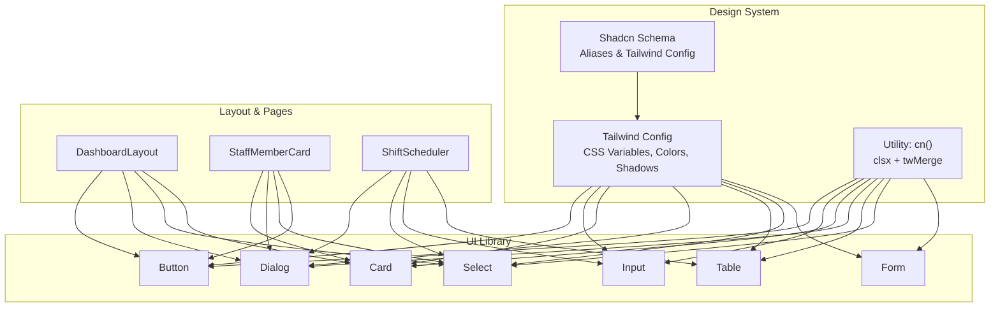
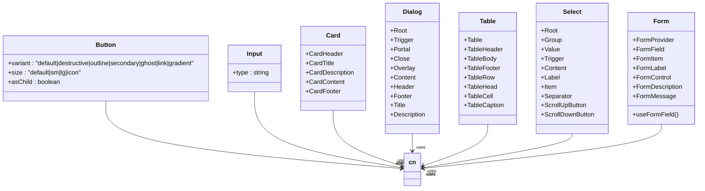
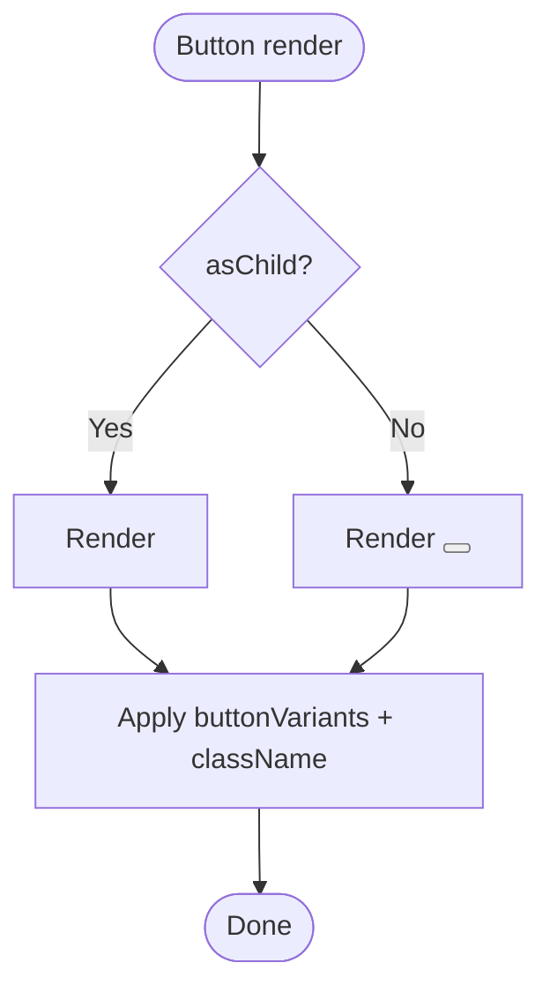
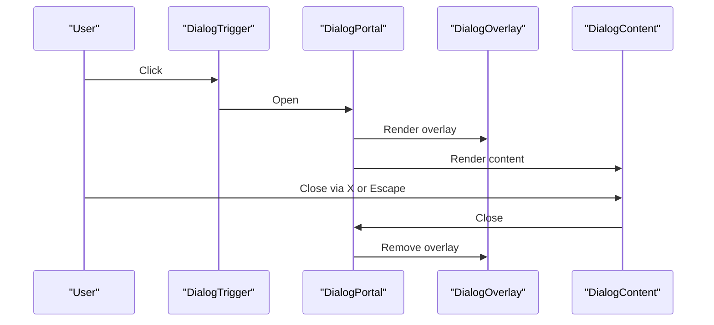
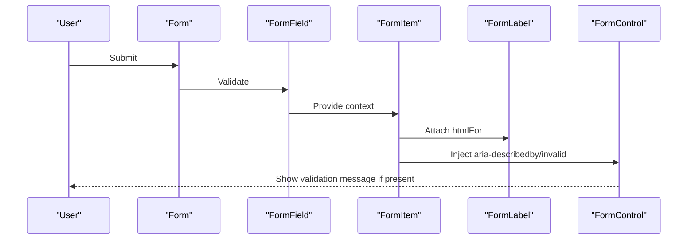
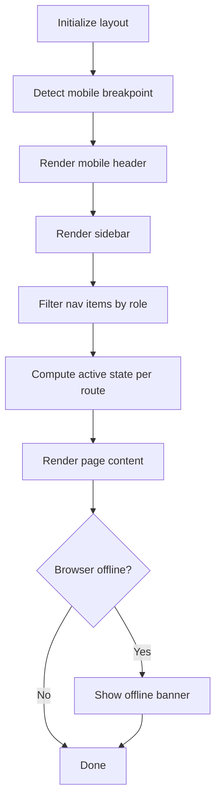
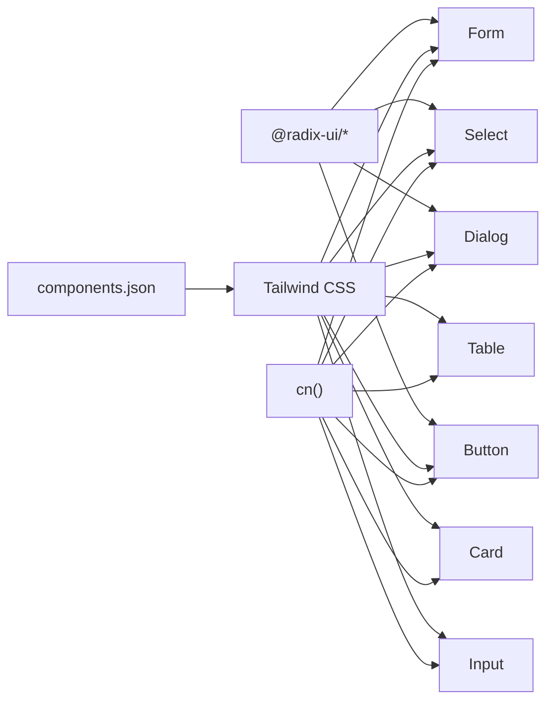

# UI Components & Design System

<cite>
**Referenced Files in This Document**
- [button.tsx](file://src/components/ui/button.tsx)
- [input.tsx](file://src/components/ui/input.tsx)
- [card.tsx](file://src/components/ui/card.tsx)
- [dialog.tsx](file://src/components/ui/dialog.tsx)
- [table.tsx](file://src/components/ui/table.tsx)
- [select.tsx](file://src/components/ui/select.tsx)
- [form.tsx](file://src/components/ui/form.tsx)
- [utils.ts](file://src/lib/utils.ts)
- [tailwind.config.ts](file://tailwind.config.ts)
- [components.json](file://components.json)
- [DashboardLayout.tsx](file://src/components/layout/DashboardLayout.tsx)
- [use-mobile.tsx](file://src/hooks/use-mobile.tsx)
- [App.tsx](file://src/App.tsx)
- [StaffMemberCard.tsx](file://src/components/staff/StaffMemberCard.tsx)
- [ShiftScheduler.tsx](file://src/components/staff/ShiftScheduler.tsx)
</cite>

## Table of Contents
1. [Introduction](#introduction)
2. [Project Structure](#project-structure)
3. [Core Components](#core-components)
4. [Architecture Overview](#architecture-overview)
5. [Detailed Component Analysis](#detailed-component-analysis)
6. [Dependency Analysis](#dependency-analysis)
7. [Performance Considerations](#performance-considerations)
8. [Troubleshooting Guide](#troubleshooting-guide)
9. [Conclusion](#conclusion)
10. [Appendices](#appendices)

## Introduction
This document describes the UI components and design system of TableFlow Pro. It focuses on the component architecture built on Radix UI primitives, Tailwind CSS styling via CSS variables, responsive design, and theme customization. It documents the complete component library including buttons, forms, dialogs, navigation elements, and specialized restaurant management components. It also explains composition patterns, accessibility compliance, cross-platform styling consistency, practical usage examples, customization options, integration patterns, the design token system, color schemes, typography hierarchy, spacing guidelines, testing strategies, performance optimization, and maintenance approaches.

## Project Structure
TableFlow Pro organizes UI components under a dedicated folder and integrates them with a design system powered by Tailwind CSS and Radix UI. The design system is configured centrally to support CSS variables, dark mode, and consistent tokens across components.

**Diagram sources**
- [tailwind.config.ts:1-114](file://tailwind.config.ts#L1-L114)
- [utils.ts:1-7](file://src/lib/utils.ts#L1-L7)
- [components.json:1-21](file://components.json#L1-L21)
- [button.tsx:1-49](file://src/components/ui/button.tsx#L1-L49)
- [input.tsx:1-23](file://src/components/ui/input.tsx#L1-L23)
- [card.tsx:1-44](file://src/components/ui/card.tsx#L1-L44)
- [dialog.tsx:1-96](file://src/components/ui/dialog.tsx#L1-L96)
- [table.tsx:1-73](file://src/components/ui/table.tsx#L1-L73)
- [select.tsx:1-144](file://src/components/ui/select.tsx#L1-L144)
- [form.tsx:1-130](file://src/components/ui/form.tsx#L1-L130)
- [DashboardLayout.tsx:1-402](file://src/components/layout/DashboardLayout.tsx#L1-L402)
- [StaffMemberCard.tsx:1-140](file://src/components/staff/StaffMemberCard.tsx#L1-L140)
- [ShiftScheduler.tsx:1-275](file://src/components/staff/ShiftScheduler.tsx#L1-L275)

**Section sources**
- [tailwind.config.ts:1-114](file://tailwind.config.ts#L1-L114)
- [components.json:1-21](file://components.json#L1-L21)
- [utils.ts:1-7](file://src/lib/utils.ts#L1-L7)

## Core Components
This section documents the foundational UI components and their design system integration.

- Button
  - Variants: default, destructive, outline, secondary, ghost, link, gradient
  - Sizes: default, sm, lg, icon
  - Composition: Uses class variance authority (CVA) and a slot pattern for semantic flexibility
  - Accessibility: Inherits focus-visible styles and supports SVG children
  - Reference: [button.tsx:1-49](file://src/components/ui/button.tsx#L1-L49)

- Input
  - Base styling for text inputs with focus-visible ring and responsive text sizing
  - Reference: [input.tsx:1-23](file://src/components/ui/input.tsx#L1-L23)

- Card
  - Semantic parts: Card, CardHeader, CardTitle, CardDescription, CardContent, CardFooter
  - Reference: [card.tsx:1-44](file://src/components/ui/card.tsx#L1-L44)

- Dialog
  - Root, Trigger, Portal, Close, Overlay, Content, Header, Footer, Title, Description
  - Animations and accessibility attributes included
  - Reference: [dialog.tsx:1-96](file://src/components/ui/dialog.tsx#L1-L96)

- Table
  - Wrapper with horizontal scrolling, and semantic parts: Table, Thead, Tbody, Tfoot, Tr, Th, Td, Caption
  - Reference: [table.tsx:1-73](file://src/components/ui/table.tsx#L1-L73)

- Select
  - Root, Group, Value, Trigger, Content, Label, Item, Separator, ScrollUp/Down buttons
  - Portal-based positioning and keyboard-friendly interactions
  - Reference: [select.tsx:1-144](file://src/components/ui/select.tsx#L1-L144)

- Form
  - Provider, Field, Item, Label, Control, Description, Message
  - Integrates with react-hook-form and Radix UI Label
  - Accessibility: aria-invalid, aria-describedby, ids for labels/messages
  - Reference: [form.tsx:1-130](file://src/components/ui/form.tsx#L1-L130)

Design tokens and theming
- Tailwind CSS variables define color palettes, shadows, radii, gradients, and animations
- Dark mode supported via class strategy
- Reference: [tailwind.config.ts:1-114](file://tailwind.config.ts#L1-L114)

Styling utilities
- Utility function merges class names with Tailwind merge semantics
- Reference: [utils.ts:1-7](file://src/lib/utils.ts#L1-L7)

**Section sources**
- [button.tsx:1-49](file://src/components/ui/button.tsx#L1-L49)
- [input.tsx:1-23](file://src/components/ui/input.tsx#L1-L23)
- [card.tsx:1-44](file://src/components/ui/card.tsx#L1-L44)
- [dialog.tsx:1-96](file://src/components/ui/dialog.tsx#L1-L96)
- [table.tsx:1-73](file://src/components/ui/table.tsx#L1-L73)
- [select.tsx:1-144](file://src/components/ui/select.tsx#L1-L144)
- [form.tsx:1-130](file://src/components/ui/form.tsx#L1-L130)
- [tailwind.config.ts:1-114](file://tailwind.config.ts#L1-L114)
- [utils.ts:1-7](file://src/lib/utils.ts#L1-L7)

## Architecture Overview
The design system centers on:
- Radix UI primitives for accessibility and composability
- Tailwind CSS with CSS variables for theming and consistent spacing
- A utility-first approach with a single cn(...) helper
- Shadcn-style component aliases for predictable imports

**Diagram sources**
- [button.tsx:1-49](file://src/components/ui/button.tsx#L1-L49)
- [input.tsx:1-23](file://src/components/ui/input.tsx#L1-L23)
- [card.tsx:1-44](file://src/components/ui/card.tsx#L1-L44)
- [dialog.tsx:1-96](file://src/components/ui/dialog.tsx#L1-L96)
- [table.tsx:1-73](file://src/components/ui/table.tsx#L1-L73)
- [select.tsx:1-144](file://src/components/ui/select.tsx#L1-L144)
- [form.tsx:1-130](file://src/components/ui/form.tsx#L1-L130)
- [utils.ts:1-7](file://src/lib/utils.ts#L1-L7)

## Detailed Component Analysis

### Button
- Purpose: Unified control with variant and size variants, optional child composition
- Implementation highlights:
  - CVA-driven variants and sizes
  - Slot pattern allows rendering as any HTML element
  - Focus-visible ring and disabled state handled
- Accessibility: Inherits focus-visible styles; supports nested SVG icons
- Customization: Extend variants/sizes in the CVA definition; override via className
- Reference: [button.tsx:1-49](file://src/components/ui/button.tsx#L1-L49)

**Diagram sources**
- [button.tsx:40-46](file://src/components/ui/button.tsx#L40-L46)

**Section sources**
- [button.tsx:1-49](file://src/components/ui/button.tsx#L1-L49)

### Input
- Purpose: Consistent base for text inputs with focus-visible ring and responsive typography
- Implementation highlights:
  - ForwardRef to DOM input
  - Responsive text size adjustments
- Customization: Override via className; combine with form components
- Reference: [input.tsx:1-23](file://src/components/ui/input.tsx#L1-L23)

**Section sources**
- [input.tsx:1-23](file://src/components/ui/input.tsx#L1-L23)

### Card
- Purpose: Structured content containers with semantic parts
- Implementation highlights:
  - ForwardRef components for each part
  - Consistent spacing and typography
- Customization: Modify parts or wrap with additional layout utilities
- Reference: [card.tsx:1-44](file://src/components/ui/card.tsx#L1-L44)

**Section sources**
- [card.tsx:1-44](file://src/components/ui/card.tsx#L1-L44)

### Dialog
- Purpose: Modal overlays with portal rendering and accessible close controls
- Implementation highlights:
  - Portal ensures overlay isolation
  - Animations for open/close transitions
  - Accessible ARIA attributes and keyboard handling
- Customization: Adjust animations, overlay, and content classes
- Reference: [dialog.tsx:1-96](file://src/components/ui/dialog.tsx#L1-L96)

**Diagram sources**
- [dialog.tsx:7-52](file://src/components/ui/dialog.tsx#L7-L52)

**Section sources**
- [dialog.tsx:1-96](file://src/components/ui/dialog.tsx#L1-L96)

### Table
- Purpose: Scrollable, accessible tables with consistent styling
- Implementation highlights:
  - Wraps table in a scroll container
  - Semantic parts for header/body/footer and cells
- Customization: Extend parts or apply additional Tailwind utilities
- Reference: [table.tsx:1-73](file://src/components/ui/table.tsx#L1-L73)

**Section sources**
- [table.tsx:1-73](file://src/components/ui/table.tsx#L1-L73)

### Select
- Purpose: Accessible dropdown selection with virtualized viewport and scroll buttons
- Implementation highlights:
  - Portal-based positioning
  - Scroll area and item indicators
  - Keyboard-friendly interactions
- Customization: Adjust trigger/content classes; add custom items
- Reference: [select.tsx:1-144](file://src/components/ui/select.tsx#L1-L144)

**Section sources**
- [select.tsx:1-144](file://src/components/ui/select.tsx#L1-L144)

### Form
- Purpose: Integration with react-hook-form and Radix UI Label for accessible forms
- Implementation highlights:
  - FormProvider, FormField, FormItem
  - useFormField for ids and aria attributes
  - FormControl injects aria-describedby and aria-invalid
- Accessibility: Proper labeling and error announcements
- Reference: [form.tsx:1-130](file://src/components/ui/form.tsx#L1-L130)

**Diagram sources**
- [form.tsx:9-127](file://src/components/ui/form.tsx#L9-L127)

**Section sources**
- [form.tsx:1-130](file://src/components/ui/form.tsx#L1-L130)

### DashboardLayout
- Purpose: Responsive layout with sidebar navigation, restaurant selector, sync status, and mobile behavior
- Implementation highlights:
  - Mobile sidebar with overlay and transform-based slide-in
  - Role-filtered navigation items
  - Sync status and offline banner for Electron
  - Dynamic restaurant switching and slug-based routing
- Customization: Extend nav items, add badges, integrate additional status indicators
- Reference: [DashboardLayout.tsx:1-402](file://src/components/layout/DashboardLayout.tsx#L1-L402)

**Diagram sources**
- [DashboardLayout.tsx:75-402](file://src/components/layout/DashboardLayout.tsx#L75-L402)
- [use-mobile.tsx:1-20](file://src/hooks/use-mobile.tsx#L1-L20)

**Section sources**
- [DashboardLayout.tsx:1-402](file://src/components/layout/DashboardLayout.tsx#L1-L402)
- [use-mobile.tsx:1-20](file://src/hooks/use-mobile.tsx#L1-L20)

### StaffMemberCard
- Purpose: Display staff member info with role-based styling, actions, and confirmation dialogs
- Implementation highlights:
  - Role-configured badges and icons
  - Conditional actions based on role (owner cannot be edited/deleted)
  - AlertDialog for deletion confirmation
- Customization: Extend roleConfig, add new actions, or swap dialogs
- Reference: [StaffMemberCard.tsx:1-140](file://src/components/staff/StaffMemberCard.tsx#L1-L140)

**Section sources**
- [StaffMemberCard.tsx:1-140](file://src/components/staff/StaffMemberCard.tsx#L1-L140)

### ShiftScheduler
- Purpose: Weekly shift schedule grid with add/delete actions and form dialogs
- Implementation highlights:
  - Week navigation with previous/next buttons
  - Dialog-based form for adding shifts with Select/Input/Textarea
  - Hover actions to delete shifts
  - Loading and saving states
- Customization: Add new fields to form, adjust grid layout, or integrate validation
- Reference: [ShiftScheduler.tsx:1-275](file://src/components/staff/ShiftScheduler.tsx#L1-L275)

**Section sources**
- [ShiftScheduler.tsx:1-275](file://src/components/staff/ShiftScheduler.tsx#L1-L275)

## Dependency Analysis
The UI library depends on:
- Radix UI for accessible primitives
- Tailwind CSS with CSS variables for theming
- Utilities for class merging
- Shadcn configuration for aliases and Tailwind integration

**Diagram sources**
- [button.tsx:1-49](file://src/components/ui/button.tsx#L1-L49)
- [dialog.tsx:1-96](file://src/components/ui/dialog.tsx#L1-L96)
- [select.tsx:1-144](file://src/components/ui/select.tsx#L1-L144)
- [form.tsx:1-130](file://src/components/ui/form.tsx#L1-L130)
- [tailwind.config.ts:1-114](file://tailwind.config.ts#L1-L114)
- [components.json:1-21](file://components.json#L1-L21)
- [utils.ts:1-7](file://src/lib/utils.ts#L1-L7)

**Section sources**
- [button.tsx:1-49](file://src/components/ui/button.tsx#L1-L49)
- [dialog.tsx:1-96](file://src/components/ui/dialog.tsx#L1-L96)
- [select.tsx:1-144](file://src/components/ui/select.tsx#L1-L144)
- [form.tsx:1-130](file://src/components/ui/form.tsx#L1-L130)
- [tailwind.config.ts:1-114](file://tailwind.config.ts#L1-L114)
- [components.json:1-21](file://components.json#L1-L21)
- [utils.ts:1-7](file://src/lib/utils.ts#L1-L7)

## Performance Considerations
- Prefer forwardRef components to avoid unnecessary wrappers
- Use the cn(...) utility to minimize class concatenation overhead
- Keep variant sets concise; avoid excessive CVA variants
- Use portals judiciously (Dialog/Select) to reduce DOM nesting
- Memoize derived data (e.g., grouped shifts) to prevent re-renders
- Lazy-load heavy pages and dialogs to improve initial load
- Use responsive breakpoints consistently to avoid layout thrashing

## Troubleshooting Guide
Common issues and resolutions:
- Dialog not closing or focus not trapped
  - Ensure Portal is wrapping Overlay and Content
  - Verify Close triggers are reachable and accessible
  - Reference: [dialog.tsx:1-96](file://src/components/ui/dialog.tsx#L1-L96)
- Form validation not announced
  - Confirm FormControl injects aria-describedby and aria-invalid
  - Ensure FormLabel has htmlFor bound to item id
  - Reference: [form.tsx:1-130](file://src/components/ui/form.tsx#L1-L130)
- Button variant or size not applying
  - Verify variant and size props match CVA definitions
  - Check className overrides
  - Reference: [button.tsx:1-49](file://src/components/ui/button.tsx#L1-L49)
- Select items not visible
  - Confirm viewport sizing matches trigger dimensions
  - Check position prop and popper alignment
  - Reference: [select.tsx:1-144](file://src/components/ui/select.tsx#L1-L144)
- Layout shifts on mobile
  - Use useIsMobile hook to guard dynamic layouts
  - Ensure transforms and fixed positions are applied
  - Reference: [DashboardLayout.tsx:1-402](file://src/components/layout/DashboardLayout.tsx#L1-L402), [use-mobile.tsx:1-20](file://src/hooks/use-mobile.tsx#L1-L20)

**Section sources**
- [dialog.tsx:1-96](file://src/components/ui/dialog.tsx#L1-L96)
- [form.tsx:1-130](file://src/components/ui/form.tsx#L1-L130)
- [button.tsx:1-49](file://src/components/ui/button.tsx#L1-L49)
- [select.tsx:1-144](file://src/components/ui/select.tsx#L1-L144)
- [DashboardLayout.tsx:1-402](file://src/components/layout/DashboardLayout.tsx#L1-L402)
- [use-mobile.tsx:1-20](file://src/hooks/use-mobile.tsx#L1-L20)

## Conclusion
TableFlow Pro’s UI system combines Radix UI primitives with a Tailwind-based design system to deliver accessible, customizable, and responsive components. The library emphasizes composition, consistent theming via CSS variables, and pragmatic utilities. Restaurant-specific components demonstrate real-world usage patterns for dialogs, forms, and scheduling. The documented architecture, customization options, and integration patterns provide a solid foundation for building and maintaining the component library across platforms.

## Appendices

### Design Token System
- Color system: foreground, background, primary, secondary, destructive, muted, accent, popover, card, sidebar, plus semantic hues (veg, non-veg, egg)
- Typography: DM Sans as the default sans-serif family
- Spacing and radius: consistent scale via CSS variables
- Shadows and gradients: CSS variables for soft, medium, large, and glow effects
- Animations: accordion and pulse-soft keyframes
- Reference: [tailwind.config.ts:15-110](file://tailwind.config.ts#L15-L110)

### Theme Customization
- Toggle dark mode via class strategy
- Override CSS variables to change brand colors, radii, and shadows
- Use alias paths in components.json to keep imports consistent
- Reference: [tailwind.config.ts:3-4](file://tailwind.config.ts#L3-L4), [components.json:13-19](file://components.json#L13-L19)

### Cross-Platform Styling Consistency
- Router selection based on environment (HashRouter for Electron, BrowserRouter for web)
- Responsive utilities and mobile detection for adaptive layouts
- Reference: [App.tsx:32-34](file://src/App.tsx#L32-L34), [use-mobile.tsx:1-20](file://src/hooks/use-mobile.tsx#L1-L20)

### Component Testing Strategies
- Unit tests for component props and variants
- Accessibility tests using screen reader assertions
- Interaction tests for dialogs, selects, and forms
- Snapshot tests for stable renders across themes
- Mock providers (FormProvider, QueryClientProvider) for isolated tests

### Maintenance Approaches
- Centralize design tokens in Tailwind config
- Keep component APIs minimal and consistent
- Use CVA for variant management
- Prefer composition over deep inheritance
- Regular audits of accessibility and performance