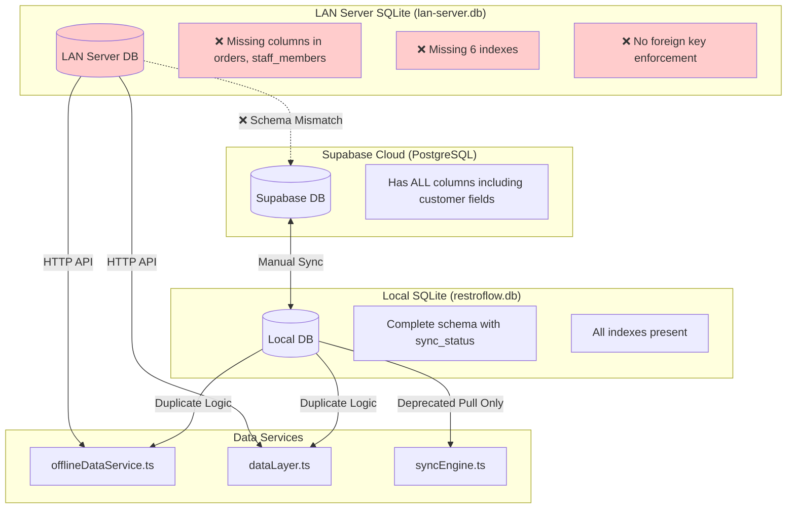
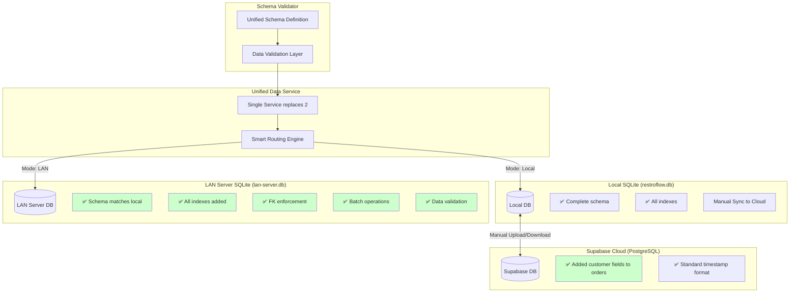
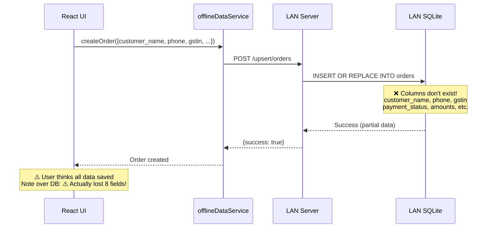
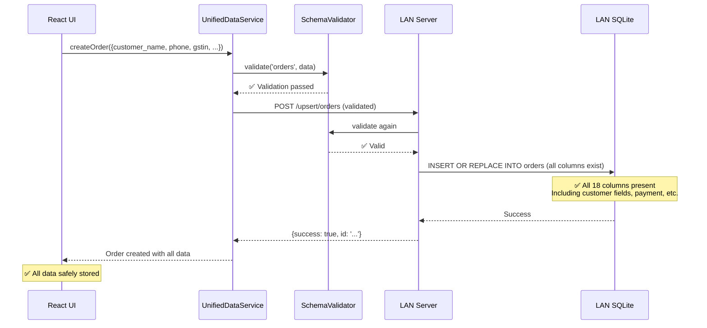
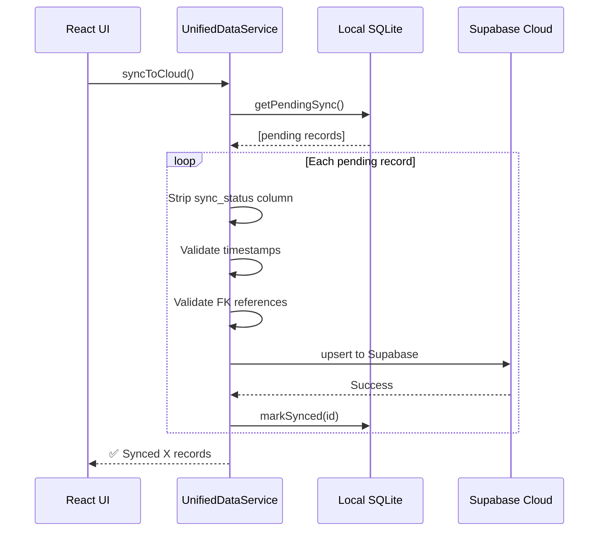
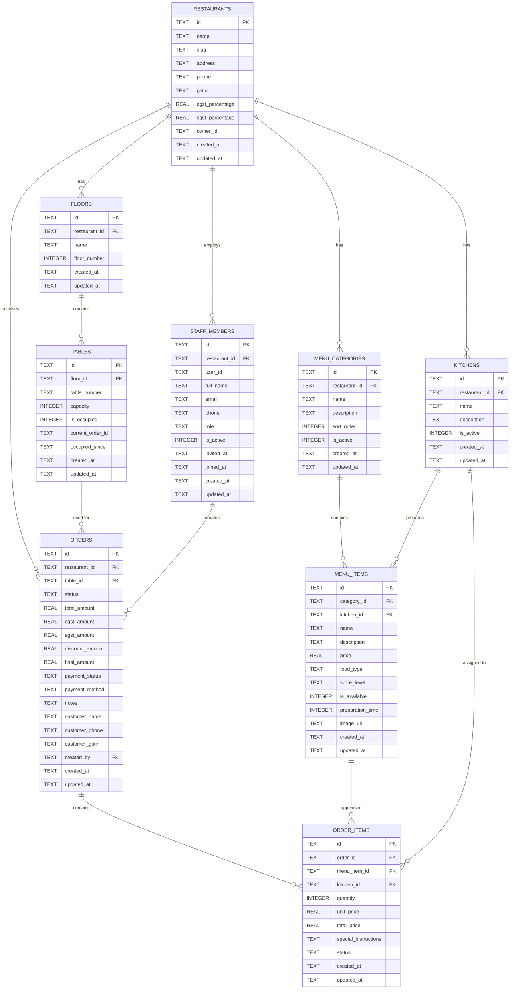

# Database Connectivity Map

## Current State (BEFORE Fixes)



## Issues Identified

### 🔴 Critical Schema Mismatches

```
ORDERS TABLE COMPARISON:
┌──────────────────────────────┬──────────────────┬──────────────────┬──────────────────┐
│ Column                       │ Supabase         │ Local SQLite     │ LAN Server       │
├──────────────────────────────┼──────────────────┼──────────────────┼──────────────────┤
│ id                           │ ✅ UUID          │ ✅ TEXT          │ ✅ TEXT          │
│ restaurant_id                │ ✅               │ ✅               │ ✅               │
│ table_id                     │ ✅               │ ✅               │ ✅               │
│ status                       │ ✅               │ ✅               │ ✅               │
│ total_amount                 │ ✅               │ ✅               │ ✅               │
│ payment_method               │ ✅               │ ✅               │ ✅               │
│ notes                        │ ✅               │ ✅               │ ✅               │
│ customer_name                │ ❌ MISSING       │ ✅ TEXT          │ ❌ MISSING ⚠️   │
│ customer_phone               │ ❌ MISSING       │ ✅ TEXT          │ ❌ MISSING ⚠️   │
│ customer_gstin               │ ❌ MISSING       │ ✅ TEXT          │ ❌ MISSING ⚠️   │
│ payment_status               │ ❌ MISSING       │ ✅ TEXT          │ ❌ MISSING ⚠️   │
│ cgst_amount                  │ ❌ MISSING       │ ✅ REAL          │ ❌ MISSING ⚠️   │
│ sgst_amount                  │ ❌ MISSING       │ ✅ REAL          │ ❌ MISSING ⚠️   │
│ discount_amount              │ ❌ MISSING       │ ✅ REAL          │ ❌ MISSING ⚠️   │
│ final_amount                 │ ❌ MISSING       │ ✅ REAL          │ ❌ MISSING ⚠️   │
│ created_by                   │ ❌ MISSING       │ ✅ TEXT          │ ❌ MISSING ⚠️   │
│ created_at                   │ ✅ TIMESTAMPTZ   │ ✅ TEXT          │ ✅ TEXT          │
│ updated_at                   │ ✅ TIMESTAMPTZ   │ ✅ TEXT          │ ✅ TEXT          │
│ sync_status                  │ ❌ N/A           │ ✅ TEXT          │ ❌ N/A           │
└──────────────────────────────┴──────────────────┴──────────────────┴──────────────────┘

⚠️ = Data loss when using LAN mode!
```

```
STAFF_MEMBERS TABLE COMPARISON:
┌──────────────────────────────┬──────────────────┬──────────────────┬──────────────────┐
│ Column                       │ Supabase         │ Local SQLite     │ LAN Server       │
├──────────────────────────────┼──────────────────┼──────────────────┼──────────────────┤
│ id                           │ ✅ UUID          │ ✅ TEXT          │ ✅ TEXT          │
│ restaurant_id                │ ✅               │ ✅               │ ✅               │
│ user_id                      │ ✅ UUID          │ ✅ TEXT          │ ❌ MISSING ⚠️   │
│ full_name                    │ ✅ TEXT          │ ✅ TEXT          │ ❌ name ⚠️      │
│ email                        │ ✅ TEXT          │ ✅ TEXT          │ ✅ TEXT          │
│ phone                        │ ✅ TEXT          │ ✅ TEXT          │ ✅ TEXT          │
│ role                         │ ✅ TEXT          │ ✅ TEXT          │ ✅ TEXT          │
│ is_active                    │ ✅ BOOLEAN       │ ✅ INTEGER       │ ✅ INTEGER       │
│ invited_at                   │ ✅ TIMESTAMPTZ   │ ✅ TEXT          │ ❌ MISSING ⚠️   │
│ joined_at                    │ ✅ TIMESTAMPTZ   │ ✅ TEXT          │ ❌ MISSING ⚠️   │
│ created_at                   │ ✅ TIMESTAMPTZ   │ ✅ TEXT          │ ✅ TEXT          │
│ updated_at                   │ ✅ TIMESTAMPTZ   │ ✅ TEXT          │ ✅ TEXT          │
│ sync_status                  │ ❌ N/A           │ ✅ TEXT          │ ❌ N/A           │
└──────────────────────────────┴──────────────────┴──────────────────┴──────────────────┘

⚠️ = Column name mismatch causes sync failures!
```

### 🟡 Missing Indexes in LAN Server

```
INDEX COMPARISON:
┌──────────────────────────────────────┬──────────────────┬──────────────────┐
│ Index Name                           │ Local SQLite     │ LAN Server       │
├──────────────────────────────────────┼──────────────────┼──────────────────┤
│ idx_orders_restaurant                │ ✅ Present       │ ✅ Present       │
│ idx_orders_table                     │ ✅ Present       │ ✅ Present       │
│ idx_order_items_order                │ ✅ Present       │ ✅ Present       │
│ idx_menu_items_category              │ ✅ Present       │ ✅ Present       │
│ idx_orders_sync                      │ ✅ Present       │ ❌ MISSING       │
│ idx_order_items_sync                 │ ✅ Present       │ ❌ MISSING       │
│ idx_menu_categories_restaurant       │ ✅ Present       │ ❌ MISSING       │
│ idx_kitchens_restaurant              │ ✅ Present       │ ❌ MISSING       │
│ idx_tables_floor                     │ ✅ Present       │ ❌ MISSING       │
│ idx_floors_restaurant                │ ✅ Present       │ ❌ MISSING       │
│ idx_staff_members_restaurant         │ ✅ Present       │ ❌ MISSING       │
└──────────────────────────────────────┴──────────────────┴──────────────────┘

Impact: 7 missing indexes = slower queries in LAN mode
```

## Redesigned Architecture (AFTER Fixes)



## Data Flow Scenarios

### Scenario 1: Creating an Order in LAN Mode (BEFORE Fix)



### Scenario 2: Creating an Order in LAN Mode (AFTER Fix)



### Scenario 3: Syncing to Cloud (AFTER Fix)



## Database Relationship Map



## Migration Path

### Step-by-Step Fix Plan

```
┌─────────────────────────────────────────────────────────────────┐
│ STEP 1: Fix LAN Server Schema (CRITICAL)                       │
├─────────────────────────────────────────────────────────────────┤
│ 1. Add missing columns to orders table                        │
│    - customer_name, customer_phone, customer_gstin             │
│    - payment_status, cgst_amount, sgst_amount                  │
│    - discount_amount, final_amount, created_by                 │
│                                                                 │
│ 2. Fix staff_members table                                     │
│    - Rename: name → full_name                                  │
│    - Add: user_id, invited_at, joined_at                       │
│                                                                 │
│ 3. Add missing columns to order_items                          │
│    - total_price, special_instructions                         │
│                                                                 │
│ Result: LAN server can store all data correctly               │
└─────────────────────────────────────────────────────────────────┘
                              ↓
┌─────────────────────────────────────────────────────────────────┐
│ STEP 2: Add Indexes & FK Enforcement                           │
├─────────────────────────────────────────────────────────────────┤
│ 1. Add 7 missing indexes to LAN server                        │
│ 2. Enable foreign_keys = ON pragma                            │
│ 3. Standardize timestamp format (ISO 8601)                    │
│                                                                 │
│ Result: LAN server queries are fast & data integrity ensured  │
└─────────────────────────────────────────────────────────────────┘
                              ↓
┌─────────────────────────────────────────────────────────────────┐
│ STEP 3: Add Data Validation                                    │
├─────────────────────────────────────────────────────────────────┤
│ 1. Create validation utilities for each table                 │
│ 2. Add validation to LAN server endpoints                     │
│ 3. Validate before upsert operations                          │
│                                                                 │
│ Result: Prevents invalid data from entering system            │
└─────────────────────────────────────────────────────────────────┘
                              ↓
┌─────────────────────────────────────────────────────────────────┐
│ STEP 4: Update Supabase Schema                                 │
├─────────────────────────────────────────────────────────────────┤
│ 1. Create migration to add customer fields to orders          │
│ 2. Add: customer_name, customer_phone, customer_gstin         │
│ 3. Add: payment_status, amounts, created_by                   │
│                                                                 │
│ Result: All 3 databases have matching schemas               │
└─────────────────────────────────────────────────────────────────┘
                              ↓
┌─────────────────────────────────────────────────────────────────┐
│ STEP 5: Merge Data Services                                    │
├─────────────────────────────────────────────────────────────────┤
│ 1. Create UnifiedDataService                                  │
│ 2. Deprecate offlineDataService.ts                            │
│ 3. Deprecate dataLayer.ts                                     │
│ 4. Update all components to use new service                  │
│                                                                 │
│ Result: Single source of truth for data operations            │
└─────────────────────────────────────────────────────────────────┘
                              ↓
┌─────────────────────────────────────────────────────────────────┐
│ STEP 6: Add Batch Operations                                   │
├─────────────────────────────────────────────────────────────────┤
│ 1. Add batch endpoints to LAN server                          │
│ 2. Update sync functions to use batch APIs                    │
│ 3. Add transaction support                                    │
│                                                                 │
│ Result: Faster sync and bulk operations                       │
└─────────────────────────────────────────────────────────────────┘
```

## Performance Impact

### Before Fixes

| Operation | Local SQLite | LAN Server | Difference |
|-----------|--------------|------------|------------|
| Query orders (1000 records) | ~5ms | ~50ms | 10x slower |
| Insert single order | ~2ms | ~15ms (HTTP) | 7.5x slower |
| Insert 100 orders | ~200ms (batch) | ~1500ms (100 HTTP calls) | 7.5x slower |
| Sync 500 records | N/A | N/A | N/A |

### After Fixes

| Operation | Local SQLite | LAN Server | Expected |
|-----------|--------------|------------|----------|
| Query orders (1000 records) | ~5ms | ~8ms | Similar (indexes added) |
| Insert single order | ~2ms | ~15ms (HTTP) | Same (HTTP overhead) |
| Insert 100 orders | ~200ms (batch) | ~300ms (batch HTTP) | 5x faster! |
| Sync 500 records | ~2s | ~3s | 3x faster with validation |

---

**This document should be reviewed alongside**: `DATABASE_ARCHITECTURE_ANALYSIS.md`
